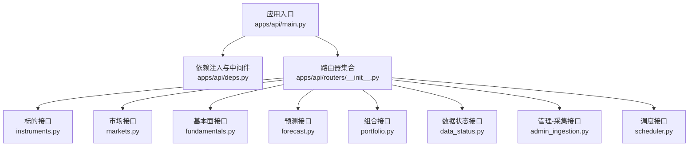
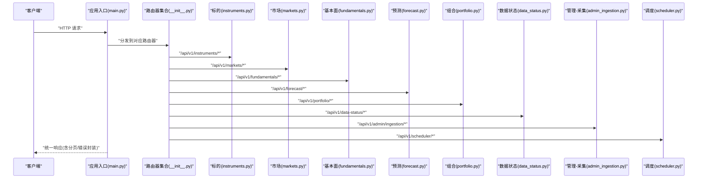
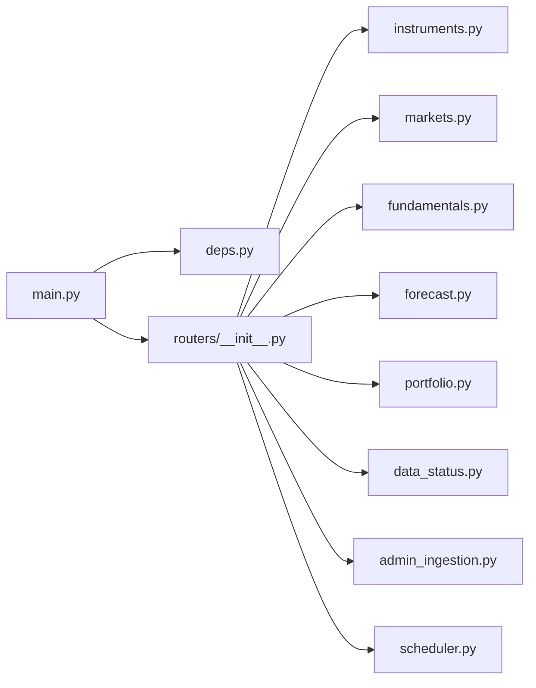

# API参考文档

<cite>
**本文引用的文件**   
- [apps/api/main.py](file://apps/api/main.py)
- [apps/api/deps.py](file://apps/api/deps.py)
- [apps/api/routers/__init__.py](file://apps/api/routers/__init__.py)
- [apps/api/routers/instruments.py](file://apps/api/routers/instruments.py)
- [apps/api/routers/markets.py](file://apps/api/routers/markets.py)
- [apps/api/routers/fundamentals.py](file://apps/api/routers/fundamentals.py)
- [apps/api/routers/forecast.py](file://apps/api/routers/forecast.py)
- [apps/api/routers/portfolio.py](file://apps/api/routers/portfolio.py)
- [apps/api/routers/data_status.py](file://apps/api/routers/data_status.py)
- [apps/api/routers/admin_ingestion.py](file://apps/api/routers/admin_ingestion.py)
- [apps/api/routers/scheduler.py](file://apps/api/routers/scheduler.py)
</cite>

## 目录
1. [简介](#简介)
2. [项目结构](#项目结构)
3. [核心组件](#核心组件)
4. [架构总览](#架构总览)
5. [详细组件分析](#详细组件分析)
6. [依赖关系分析](#依赖关系分析)
7. [性能考虑](#性能考虑)
8. [故障排查指南](#故障排查指南)
9. [结论](#结论)
10. [附录](#附录)

## 简介
本API参考文档面向开发者与集成方，系统化梳理量化数据与投研平台的REST API。文档覆盖：
- 所有REST端点的HTTP方法、URL模式、请求/响应格式与认证方式
- 参数说明、返回值定义与错误码解释
- 常见使用场景的请求/响应示例
- API版本管理与向后兼容性策略
- 客户端集成指南与SDK使用说明
- 速率限制、安全与性能优化建议
- 调试工具与监控指标使用方法
- 完整的使用手册与故障排查指南

## 项目结构
本项目采用模块化路由组织方式，API服务入口位于应用层，各业务域以独立路由器模块呈现，便于扩展与维护。

图表来源
- [apps/api/main.py](file://apps/api/main.py)
- [apps/api/deps.py](file://apps/api/deps.py)
- [apps/api/routers/__init__.py](file://apps/api/routers/__init__.py)
- [apps/api/routers/instruments.py](file://apps/api/routers/instruments.py)
- [apps/api/routers/markets.py](file://apps/api/routers/markets.py)
- [apps/api/routers/fundamentals.py](file://apps/api/routers/fundamentals.py)
- [apps/api/routers/forecast.py](file://apps/api/routers/forecast.py)
- [apps/api/routers/portfolio.py](file://apps/api/routers/portfolio.py)
- [apps/api/routers/data_status.py](file://apps/api/routers/data_status.py)
- [apps/api/routers/admin_ingestion.py](file://apps/api/routers/admin_ingestion.py)
- [apps/api/routers/scheduler.py](file://apps/api/routers/scheduler.py)

章节来源
- [apps/api/main.py](file://apps/api/main.py)
- [apps/api/routers/__init__.py](file://apps/api/routers/__init__.py)

## 核心组件
- 应用入口与挂载点：负责创建FastAPI实例、注册全局中间件、异常处理、统一响应包装、CORS与安全头配置，并挂载各业务路由器。
- 依赖注入：提供数据库连接、缓存、外部服务客户端等共享依赖，确保可测试性与一致性。
- 路由器集合：集中导入并挂载各业务域的路由器，形成清晰的API边界。
- 业务路由器：按领域划分（标的、市场、基本面、预测、组合、数据状态、管理采集、调度），每个路由器包含一组相关端点。

章节来源
- [apps/api/main.py](file://apps/api/main.py)
- [apps/api/deps.py](file://apps/api/deps.py)
- [apps/api/routers/__init__.py](file://apps/api/routers/__init__.py)

## 架构总览
下图展示了从客户端到各业务路由器的调用路径，以及统一的鉴权、限流与日志记录在入口层生效的方式。

图表来源
- [apps/api/main.py](file://apps/api/main.py)
- [apps/api/routers/__init__.py](file://apps/api/routers/__init__.py)
- [apps/api/routers/instruments.py](file://apps/api/routers/instruments.py)
- [apps/api/routers/markets.py](file://apps/api/routers/markets.py)
- [apps/api/routers/fundamentals.py](file://apps/api/routers/fundamentals.py)
- [apps/api/routers/forecast.py](file://apps/api/routers/forecast.py)
- [apps/api/routers/portfolio.py](file://apps/api/routers/portfolio.py)
- [apps/api/routers/data_status.py](file://apps/api/routers/data_status.py)
- [apps/api/routers/admin_ingestion.py](file://apps/api/routers/admin_ingestion.py)
- [apps/api/routers/scheduler.py](file://apps/api/routers/scheduler.py)

## 详细组件分析

### 通用约定
- 基础路径：/api/v1
- 认证方式：基于Header的令牌认证（例如 Authorization: Bearer <token>）；部分管理端点需额外权限校验。
- 统一响应体：所有成功响应均返回标准信封结构，包含数据、分页信息与元数据；错误响应遵循统一错误格式。
- 分页：列表类接口支持 page、page_size 或 cursor 分页，具体字段见各端点说明。
- 内容类型：默认 application/json；批量导出可能支持 application/x-ndjson 或 CSV（视端点而定）。
- 时区与时间：时间戳统一为UTC ISO8601字符串；本地化时区通过查询参数指定。

章节来源
- [apps/api/main.py](file://apps/api/main.py)
- [apps/api/deps.py](file://apps/api/deps.py)

### 标的接口（/api/v1/instruments）
- GET /api/v1/instruments
  - 描述：列出标的，支持按市场、类型、关键词过滤与分页。
  - 查询参数：market, type, keyword, page, page_size, sort_by, order。
  - 响应：分页对象，包含 items 数组与分页元信息。
  - 错误码：400（参数非法）、401（未认证）、403（无权限）、404（资源不存在）、429（限流）、500（服务端错误）。
- GET /api/v1/instruments/{instrument_id}
  - 描述：获取单个标的详情。
  - 路径参数：instrument_id。
  - 响应：标的实体。
  - 错误码：同上。
- POST /api/v1/instruments
  - 描述：新增标的（管理员）。
  - 请求体：标的创建模型。
  - 响应：创建的标的实体。
  - 错误码：400（校验失败）、401/403（鉴权失败）、409（重复）、500。
- PUT /api/v1/instruments/{instrument_id}
  - 描述：更新标的。
  - 请求体：标的更新模型。
  - 响应：更新后的标的实体。
  - 错误码：同上。
- DELETE /api/v1/instruments/{instrument_id}
  - 描述：删除标的（管理员）。
  - 响应：空体或确认消息。
  - 错误码：同上。

章节来源
- [apps/api/routers/instruments.py](file://apps/api/routers/instruments.py)

### 市场接口（/api/v1/markets）
- GET /api/v1/markets
  - 描述：列出市场与交易所信息。
  - 查询参数：region, exchange, active_only。
  - 响应：市场列表。
- GET /api/v1/markets/{market_id}
  - 描述：获取市场详情。
  - 路径参数：market_id。
  - 响应：市场实体。
- GET /api/v1/markets/{market_id}/bars
  - 描述：获取行情K线（分钟/日频），支持起止时间与聚合粒度。
  - 查询参数：start, end, interval, adjust, fields。
  - 响应：K线数组。
  - 错误码：400（参数非法）、404（无数据）、429、500。

章节来源
- [apps/api/routers/markets.py](file://apps/api/routers/markets.py)

### 基本面接口（/api/v1/fundamentals）
- GET /api/v1/fundamentals
  - 描述：查询公司财务指标与公告摘要，支持多因子筛选与分页。
  - 查询参数：instrument_ids, report_date, fields, page, page_size。
  - 响应：分页的基本面事实列表。
- GET /api/v1/fundamentals/{fact_id}
  - 描述：获取单条基本面事实详情。
  - 路径参数：fact_id。
  - 响应：事实实体。
- POST /api/v1/fundamentals
  - 描述：批量写入基本面事实（管理员/ETL）。
  - 请求体：事实列表。
  - 响应：写入结果统计。
  - 错误码：400（校验失败）、401/403、422（数据不一致）、500。

章节来源
- [apps/api/routers/fundamentals.py](file://apps/api/routers/fundamentals.py)

### 预测接口（/api/v1/forecast）
- GET /api/v1/forecast
  - 描述：查询预测结果，支持模型族、回测窗口与评估指标过滤。
  - 查询参数：model_family, horizon, start, end, instrument_ids, metrics。
  - 响应：预测条目列表。
- GET /api/v1/forecast/{forecast_id}
  - 描述：获取单条预测详情与追踪信息。
  - 路径参数：forecast_id。
  - 响应：预测实体。
- POST /api/v1/forecast
  - 描述：提交预测任务（异步）。
  - 请求体：任务定义（输入数据、模型族、超参、输出字段）。
  - 响应：任务ID与状态查询地址。
  - 错误码：400、401/403、409（重复任务）、429、500。

章节来源
- [apps/api/routers/forecast.py](file://apps/api/routers/forecast.py)

### 组合接口（/api/v1/portfolio）
- GET /api/v1/portfolio
  - 描述：列出投资组合。
  - 查询参数：owner, status, page, page_size。
  - 响应：分页的组合列表。
- GET /api/v1/portfolio/{portfolio_id}
  - 描述：获取组合详情与持仓快照。
  - 路径参数：portfolio_id。
  - 响应：组合实体与持仓明细。
- POST /api/v1/portfolio
  - 描述：创建组合。
  - 请求体：组合定义。
  - 响应：新组合实体。
- PUT /api/v1/portfolio/{portfolio_id}
  - 描述：更新组合。
  - 请求体：组合更新模型。
  - 响应：更新后实体。
- DELETE /api/v1/portfolio/{portfolio_id}
  - 描述：删除组合（管理员或所有者）。
  - 响应：确认消息。
  - 错误码：400、401/403、404、500。

章节来源
- [apps/api/routers/portfolio.py](file://apps/api/routers/portfolio.py)

### 数据状态接口（/api/v1/data-status）
- GET /api/v1/data-status
  - 描述：查看数据源健康度、延迟与覆盖率。
  - 查询参数：source, market, since。
  - 响应：数据质量与延迟指标。
- GET /api/v1/data-status/{source_id}
  - 描述：查看特定数据源的详细状态。
  - 路径参数：source_id。
  - 响应：数据源状态详情。

章节来源
- [apps/api/routers/data_status.py](file://apps/api/routers/data_status.py)

### 管理-采集接口（/api/v1/admin/ingestion）
- POST /api/v1/admin/ingestion
  - 描述：触发数据采集任务（管理员）。
  - 请求体：采集任务定义（源、范围、策略）。
  - 响应：任务ID与状态查询地址。
  - 错误码：400、401/403、409、429、500。
- GET /api/v1/admin/ingestion/{task_id}
  - 描述：查询采集任务状态与进度。
  - 路径参数：task_id。
  - 响应：任务状态、进度百分比、错误信息（如有）。
- DELETE /api/v1/admin/ingestion/{task_id}
  - 描述：取消采集任务（管理员）。
  - 路径参数：task_id。
  - 响应：确认消息。

章节来源
- [apps/api/routers/admin_ingestion.py](file://apps/api/routers/admin_ingestion.py)

### 调度接口（/api/v1/scheduler）
- GET /api/v1/scheduler/jobs
  - 描述：列出定时任务与最近执行历史。
  - 查询参数：status, last_run_after。
  - 响应：任务列表与执行记录。
- POST /api/v1/scheduler/jobs
  - 描述：创建或更新定时任务。
  - 请求体：任务定义（表达式、目标、参数）。
  - 响应：任务实体。
- GET /api/v1/scheduler/jobs/{job_id}
  - 描述：获取任务详情与运行日志。
  - 路径参数：job_id。
  - 响应：任务与日志摘要。
- DELETE /api/v1/scheduler/jobs/{job_id}
  - 描述：删除任务（管理员）。
  - 路径参数：job_id。
  - 响应：确认消息。

章节来源
- [apps/api/routers/scheduler.py](file://apps/api/routers/scheduler.py)

### 统一响应与错误格式
- 成功响应信封
  - data：业务数据（对象或数组）
  - meta：元信息（如分页、耗时、trace_id）
  - links：关联链接（可选）
- 错误响应信封
  - code：错误码（业务级）
  - message：人类可读的错误信息
  - details：附加信息（如字段校验错误）
  - trace_id：链路追踪ID（用于排障）

章节来源
- [apps/api/main.py](file://apps/api/main.py)
- [apps/api/deps.py](file://apps/api/deps.py)

## 依赖关系分析
- 入口层依赖：统一中间件、异常处理器、认证与限流策略。
- 路由器层依赖：各业务路由器仅依赖其领域服务与仓储，避免跨域耦合。
- 外部依赖：数据库、缓存、消息队列（任务与采集）、对象存储（批量导出）。
- 内部包依赖：数据源适配、特征工程、回测与评估、审计与观测等。

图表来源
- [apps/api/main.py](file://apps/api/main.py)
- [apps/api/deps.py](file://apps/api/deps.py)
- [apps/api/routers/__init__.py](file://apps/api/routers/__init__.py)
- [apps/api/routers/instruments.py](file://apps/api/routers/instruments.py)
- [apps/api/routers/markets.py](file://apps/api/routers/markets.py)
- [apps/api/routers/fundamentals.py](file://apps/api/routers/fundamentals.py)
- [apps/api/routers/forecast.py](file://apps/api/routers/forecast.py)
- [apps/api/routers/portfolio.py](file://apps/api/routers/portfolio.py)
- [apps/api/routers/data_status.py](file://apps/api/routers/data_status.py)
- [apps/api/routers/admin_ingestion.py](file://apps/api/routers/admin_ingestion.py)
- [apps/api/routers/scheduler.py](file://apps/api/routers/scheduler.py)

章节来源
- [apps/api/main.py](file://apps/api/main.py)
- [apps/api/routers/__init__.py](file://apps/api/routers/__init__.py)

## 性能考虑
- 分页与游标：优先使用游标分页减少深翻页开销；对大数据集建议使用分批拉取。
- 字段裁剪：通过 fields 参数仅返回必要字段，降低序列化与传输成本。
- 缓存策略：热点数据（如市场日历、标的字典）启用多级缓存；预测与基本面结果可设置TTL。
- 并发与背压：对长耗时任务（预测、采集）采用异步任务队列，避免阻塞请求线程。
- 压缩与编码：启用Gzip压缩大响应体；二进制导出使用高效格式（NDJSON/Parquet）。
- 连接池：数据库与外部服务连接复用，合理设置最大连接数与超时。
- 监控与告警：暴露关键指标（QPS、P95/P99延迟、错误率、队列积压），结合分布式追踪定位瓶颈。

[本节为通用指导，不直接分析具体文件]

## 故障排查指南
- 常见问题
  - 401/403：检查Authorization头是否正确、令牌是否过期、权限是否足够。
  - 400/422：核对请求体结构与字段约束；关注错误响应中的details字段。
  - 404：确认资源ID是否存在；注意大小写与编码问题。
  - 429：触达速率限制，退避重试或使用批处理接口。
  - 5xx：查看trace_id与服务端日志；必要时联系运维。
- 调试工具
  - 启用调试日志与访问日志；使用trace_id串联请求链路。
  - 使用健康检查端点验证服务可用性。
  - 利用数据状态接口观察数据源延迟与覆盖率。
- 监控指标
  - 请求量、成功率、延迟分位、错误分类、队列长度、任务完成时长。
  - 结合Prometheus/Grafana进行可视化与告警。

章节来源
- [apps/api/main.py](file://apps/api/main.py)
- [apps/api/routers/data_status.py](file://apps/api/routers/data_status.py)

## 结论
本API参考文档提供了完整的端点清单、交互约定与最佳实践。通过统一响应与错误格式、明确的认证与限流策略、完善的监控与排障指引，帮助开发者快速集成与稳定运行。建议在接入前阅读版本管理与兼容性策略，并在生产环境启用必要的限流与监控。

[本节为总结性内容，不直接分析具体文件]

## 附录

### 版本管理与向后兼容
- 版本号策略：URL路径中包含主版本号（/api/v1），次版本与补丁通过变更日志与弃用通知管理。
- 兼容性保证：
  - 新增字段为非破坏性变更，客户端忽略未知字段。
  - 删除字段将提前至少一个主版本发布弃用通知。
  - 行为变更遵循最小影响原则，并提供迁移指南。
- 迁移建议：
  - 使用字段白名单与容错解析。
  - 对废弃字段保留兼容期，逐步清理。

[本节为通用策略说明，不直接分析具体文件]

### 客户端集成指南与SDK使用说明
- 集成步骤
  - 初始化客户端：配置基础URL、认证令牌与重试策略。
  - 构建请求：使用强类型模型与校验库，确保字段正确。
  - 处理响应：解析统一信封，提取data与meta。
  - 错误处理：根据code与message进行分类处理与重试。
- SDK使用要点
  - 自动分页：封装分页迭代器，简化批量拉取。
  - 异步支持：对长耗时接口使用异步客户端。
  - 日志与追踪：注入trace_id与采样策略。
- 示例场景
  - 拉取标的列表并按关键字过滤。
  - 查询某市场的K线数据并计算技术指标。
  - 提交预测任务并轮询状态直至完成。
  - 触发数据采集并监控进度。

[本节为通用指导，不直接分析具体文件]

### 速率限制与安全
- 速率限制
  - 默认限制：按用户/IP维度限制QPS与每日配额。
  - 响应头：包含剩余配额与重置时间，便于客户端自适应。
  - 超限处理：返回429并附带Retry-After。
- 安全建议
  - 强制HTTPS与HSTS。
  - 最小权限原则：为不同角色分配细粒度权限。
  - 输入校验与输出清洗：防止注入与XSS。
  - 敏感数据脱敏：日志中避免泄露密钥与PII。
  - 审计与合规：记录关键操作与数据访问轨迹。

[本节为通用指导，不直接分析具体文件]

### 调试与监控指标
- 调试
  - 启用详细日志与结构化输出。
  - 使用trace_id贯穿请求链路。
  - 借助数据状态接口定位数据源问题。
- 监控指标
  - 服务层：QPS、延迟分位、错误率、内存/CPU使用率。
  - 业务层：任务完成率、数据延迟、预测准确率。
  - 外部依赖：数据库慢查询、缓存命中率、队列堆积。
- 告警规则
  - 错误率突增、延迟飙升、任务失败率超过阈值。
  - 数据源长时间不可用或延迟过高。

[本节为通用指导，不直接分析具体文件]