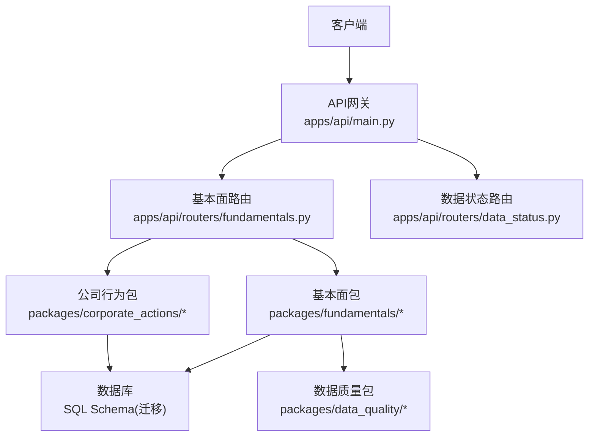
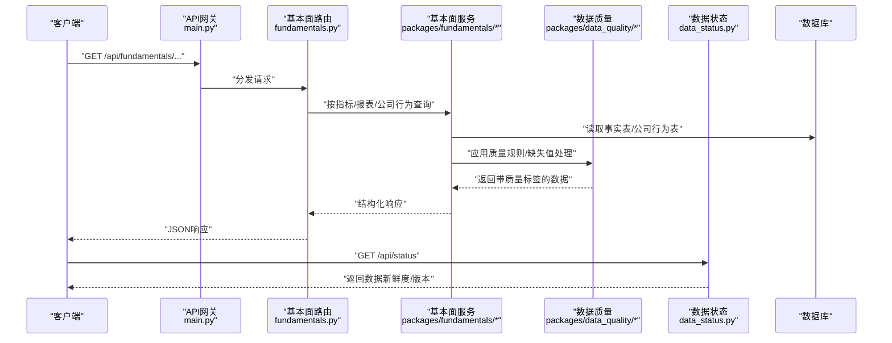
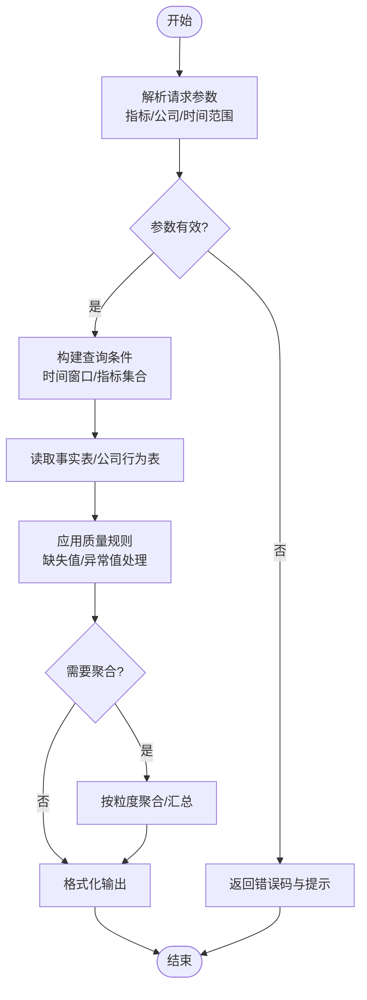
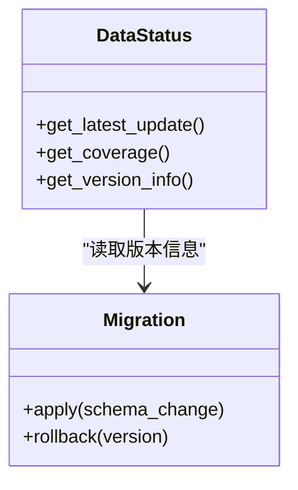
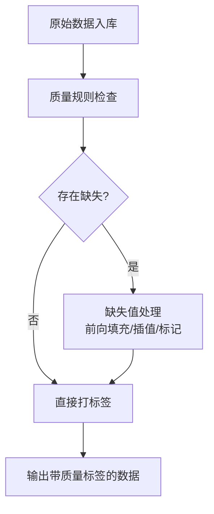
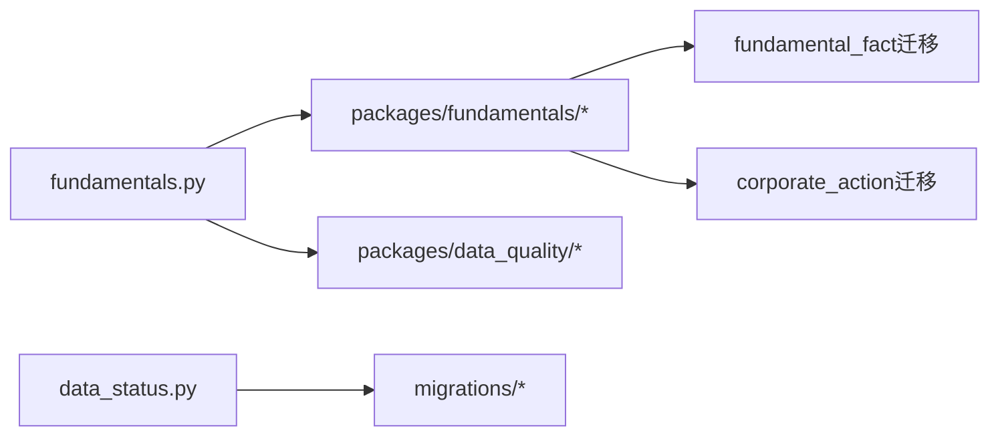

# 基本面数据API

<cite>
**本文引用的文件**   
- [apps/api/routers/fundamentals.py](file://apps/api/routers/fundamentals.py)
- [apps/api/main.py](file://apps/api/main.py)
- [packages/fundamentals/README.md](file://packages/fundamentals/README.md)
- [sql/migrations/20260715_0005_fundamental_fact.py](file://sql/migrations/20260715_0005_fundamental_fact.py)
- [sql/migrations/20260715_0004_corporate_action.py](file://sql/migrations/20260715_0004_corporate_action.py)
- [packages/data_quality/README.md](file://packages/data_quality/README.md)
- [apps/api/routers/data_status.py](file://apps/api/routers/data_status.py)
</cite>

## 目录
1. [简介](#简介)
2. [项目结构](#项目结构)
3. [核心组件](#核心组件)
4. [架构总览](#架构总览)
5. [详细组件分析](#详细组件分析)
6. [依赖分析](#依赖分析)
7. [性能考虑](#性能考虑)
8. [故障排查指南](#故障排查指南)
9. [结论](#结论)
10. [附录](#附录)

## 简介
本文件面向使用“基本面数据API”的研究与工程人员，系统化说明财务报表、公司行为等基本面数据的查询接口与使用方法。内容覆盖：
- 财务指标、资产负债表、利润表等数据的获取方法
- 时间序列查询、指标筛选与聚合统计
- 数据更新频率、历史数据范围与版本管理策略
- 实际查询示例与结果解析方法
- 数据质量标识与缺失值处理机制

## 项目结构
本项目采用分层与模块化组织方式：
- API层：基于FastAPI的HTTP路由，提供REST风格接口
- 业务包：fundamentals（基本面）、corporate_actions（公司行为）、data_quality（数据质量）等
- 数据持久化：通过Alembic迁移脚本维护数据库Schema
- 状态与运维：数据状态查询、调度与监控

图表来源
- [apps/api/main.py](file://apps/api/main.py)
- [apps/api/routers/fundamentals.py](file://apps/api/routers/fundamentals.py)
- [apps/api/routers/data_status.py](file://apps/api/routers/data_status.py)
- [packages/fundamentals/README.md](file://packages/fundamentals/README.md)
- [packages/data_quality/README.md](file://packages/data_quality/README.md)
- [sql/migrations/20260715_0005_fundamental_fact.py](file://sql/migrations/20260715_0005_fundamental_fact.py)
- [sql/migrations/20260715_0004_corporate_action.py](file://sql/migrations/20260715_0004_corporate_action.py)

章节来源
- [apps/api/main.py](file://apps/api/main.py)
- [apps/api/routers/fundamentals.py](file://apps/api/routers/fundamentals.py)
- [apps/api/routers/data_status.py](file://apps/api/routers/data_status.py)
- [packages/fundamentals/README.md](file://packages/fundamentals/README.md)
- [packages/data_quality/README.md](file://packages/data_quality/README.md)
- [sql/migrations/20260715_0005_fundamental_fact.py](file://sql/migrations/20260715_0005_fundamental_fact.py)
- [sql/migrations/20260715_0004_corporate_action.py](file://sql/migrations/20260715_0004_corporate_action.py)

## 核心组件
- 基本面数据路由：提供财务指标、报表项与公司行为的查询入口
- 数据质量模块：对数据进行质量标注、缺失值标记与一致性校验
- 数据状态路由：暴露数据新鲜度、覆盖率与版本信息
- 数据库迁移：定义事实表（如fundamental_fact）与公司行为表的结构

章节来源
- [apps/api/routers/fundamentals.py](file://apps/api/routers/fundamentals.py)
- [packages/data_quality/README.md](file://packages/data_quality/README.md)
- [apps/api/routers/data_status.py](file://apps/api/routers/data_status.py)
- [sql/migrations/20260715_0005_fundamental_fact.py](file://sql/migrations/20260715_0005_fundamental_fact.py)
- [sql/migrations/20260715_0004_corporate_action.py](file://sql/migrations/20260715_0004_corporate_action.py)

## 架构总览
整体调用链从HTTP请求进入API网关，路由到具体业务模块，再访问底层存储与质量模块。

图表来源
- [apps/api/main.py](file://apps/api/main.py)
- [apps/api/routers/fundamentals.py](file://apps/api/routers/fundamentals.py)
- [apps/api/routers/data_status.py](file://apps/api/routers/data_status.py)
- [packages/fundamentals/README.md](file://packages/fundamentals/README.md)
- [packages/data_quality/README.md](file://packages/data_quality/README.md)
- [sql/migrations/20260715_0005_fundamental_fact.py](file://sql/migrations/20260715_0005_fundamental_fact.py)
- [sql/migrations/20260715_0004_corporate_action.py](file://sql/migrations/20260715_0004_corporate_action.py)

## 详细组件分析

### 基本面数据查询接口
- 功能范围
  - 财务指标：支持按指标名称、公司、时间范围进行查询
  - 财务报表：支持资产负债表、利润表等报表项的时间序列查询
  - 公司行为：支持分红、拆合股、增发等行为事件查询
- 查询能力
  - 时间序列：支持起止日期过滤、排序与分页
  - 指标筛选：支持多指标组合、单位标准化与口径对齐
  - 聚合统计：支持按日/周/月/季/年粒度聚合与汇总
- 典型流程
  - 客户端发起请求 -> 路由解析参数 -> 服务层组装查询条件 -> 数据层拉取事实表/公司行为表 -> 质量层打标与填充 -> 返回结构化结果

图表来源
- [apps/api/routers/fundamentals.py](file://apps/api/routers/fundamentals.py)
- [packages/fundamentals/README.md](file://packages/fundamentals/README.md)
- [packages/data_quality/README.md](file://packages/data_quality/README.md)
- [sql/migrations/20260715_0005_fundamental_fact.py](file://sql/migrations/20260715_0005_fundamental_fact.py)
- [sql/migrations/20260715_0004_corporate_action.py](file://sql/migrations/20260715_0004_corporate_action.py)

章节来源
- [apps/api/routers/fundamentals.py](file://apps/api/routers/fundamentals.py)
- [packages/fundamentals/README.md](file://packages/fundamentals/README.md)
- [packages/data_quality/README.md](file://packages/data_quality/README.md)
- [sql/migrations/20260715_0005_fundamental_fact.py](file://sql/migrations/20260715_0005_fundamental_fact.py)
- [sql/migrations/20260715_0004_corporate_action.py](file://sql/migrations/20260715_0004_corporate_action.py)

### 数据状态与版本管理
- 数据新鲜度：提供最近更新时间、覆盖范围与延迟信息
- 版本策略：通过迁移脚本记录Schema演进，便于回溯与兼容
- 健康检查：可结合状态路由判断数据管道是否正常运行

图表来源
- [apps/api/routers/data_status.py](file://apps/api/routers/data_status.py)
- [sql/migrations/20260715_0005_fundamental_fact.py](file://sql/migrations/20260715_0005_fundamental_fact.py)
- [sql/migrations/20260715_0004_corporate_action.py](file://sql/migrations/20260715_0004_corporate_action.py)

章节来源
- [apps/api/routers/data_status.py](file://apps/api/routers/data_status.py)
- [sql/migrations/20260715_0005_fundamental_fact.py](file://sql/migrations/20260715_0005_fundamental_fact.py)
- [sql/migrations/20260715_0004_corporate_action.py](file://sql/migrations/20260715_0004_corporate_action.py)

### 数据质量与缺失值处理
- 质量标识：为每条记录附加质量标签（如完整、部分缺失、待复核）
- 缺失值处理：支持前向填充、插值或标记为不可用，依据指标特性选择策略
- 一致性校验：跨源比对与阈值检测，避免异常值污染下游模型

图表来源
- [packages/data_quality/README.md](file://packages/data_quality/README.md)

章节来源
- [packages/data_quality/README.md](file://packages/data_quality/README.md)

## 依赖分析
- 路由层依赖
  - fundamentals路由依赖基本面包与数据质量包
  - data_status路由依赖数据库迁移信息与系统状态
- 数据层依赖
  - fundamental_fact迁移定义财务事实表结构
  - corporate_action迁移定义公司行为表结构

图表来源
- [apps/api/routers/fundamentals.py](file://apps/api/routers/fundamentals.py)
- [apps/api/routers/data_status.py](file://apps/api/routers/data_status.py)
- [packages/fundamentals/README.md](file://packages/fundamentals/README.md)
- [packages/data_quality/README.md](file://packages/data_quality/README.md)
- [sql/migrations/20260715_0005_fundamental_fact.py](file://sql/migrations/20260715_0005_fundamental_fact.py)
- [sql/migrations/20260715_0004_corporate_action.py](file://sql/migrations/20260715_0004_corporate_action.py)

章节来源
- [apps/api/routers/fundamentals.py](file://apps/api/routers/fundamentals.py)
- [apps/api/routers/data_status.py](file://apps/api/routers/data_status.py)
- [packages/fundamentals/README.md](file://packages/fundamentals/README.md)
- [packages/data_quality/README.md](file://packages/data_quality/README.md)
- [sql/migrations/20260715_0005_fundamental_fact.py](file://sql/migrations/20260715_0005_fundamental_fact.py)
- [sql/migrations/20260715_0004_corporate_action.py](file://sql/migrations/20260715_0004_corporate_action.py)

## 性能考虑
- 查询优化
  - 合理设置时间窗口与分页大小，避免一次性拉取过大结果集
  - 优先使用索引字段（如公司ID、报告期、指标名）进行过滤
- 聚合计算
  - 在数据层完成粗粒度聚合，减少网络传输与内存占用
- 缓存策略
  - 对热点指标与常用报表项实施短期缓存，降低重复查询压力
- 质量处理
  - 将缺失值处理与异常值剔除前置到批处理阶段，提升在线查询性能

[本节为通用指导，不直接分析具体文件]

## 故障排查指南
- 常见问题
  - 参数无效：检查指标名称、公司ID格式与时间范围合法性
  - 数据缺失：确认质量标签与缺失值处理策略是否符合预期
  - 版本不一致：核对迁移版本与运行环境是否匹配
- 定位步骤
  - 查看数据状态路由返回的新鲜度与覆盖率
  - 检查对应迁移脚本是否存在并成功执行
  - 验证质量规则配置与缺失值处理策略

章节来源
- [apps/api/routers/data_status.py](file://apps/api/routers/data_status.py)
- [sql/migrations/20260715_0005_fundamental_fact.py](file://sql/migrations/20260715_0005_fundamental_fact.py)
- [sql/migrations/20260715_0004_corporate_action.py](file://sql/migrations/20260715_0004_corporate_action.py)

## 结论
基本面数据API围绕“查询—质量—状态”的主线设计，提供稳定的财务指标、报表项与公司行为数据服务。通过明确的质量标识与缺失值处理机制，以及完善的状态与版本管理，确保数据可用性与可追溯性。建议在生产环境中结合缓存与批处理优化，进一步提升查询性能与稳定性。

[本节为总结性内容，不直接分析具体文件]

## 附录
- 术语说明
  - 事实表：用于存储标准化后的财务指标与报表项
  - 公司行为：包括分红、拆合股、增发等影响证券价值的事件
  - 质量标签：描述数据完整性与可信度的元数据
- 参考路径
  - 基本面包说明：[packages/fundamentals/README.md](file://packages/fundamentals/README.md)
  - 数据质量包说明：[packages/data_quality/README.md](file://packages/data_quality/README.md)
  - 财务事实表迁移：[sql/migrations/20260715_0005_fundamental_fact.py](file://sql/migrations/20260715_0005_fundamental_fact.py)
  - 公司行为迁移：[sql/migrations/20260715_0004_corporate_action.py](file://sql/migrations/20260715_0004_corporate_action.py)