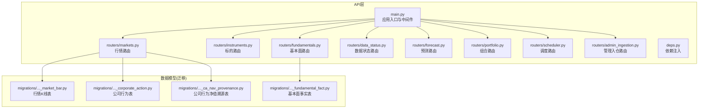
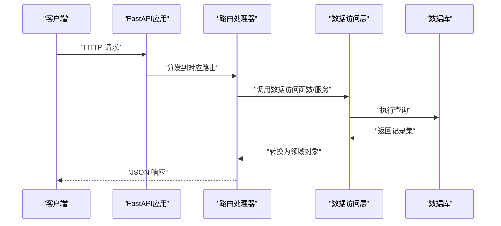
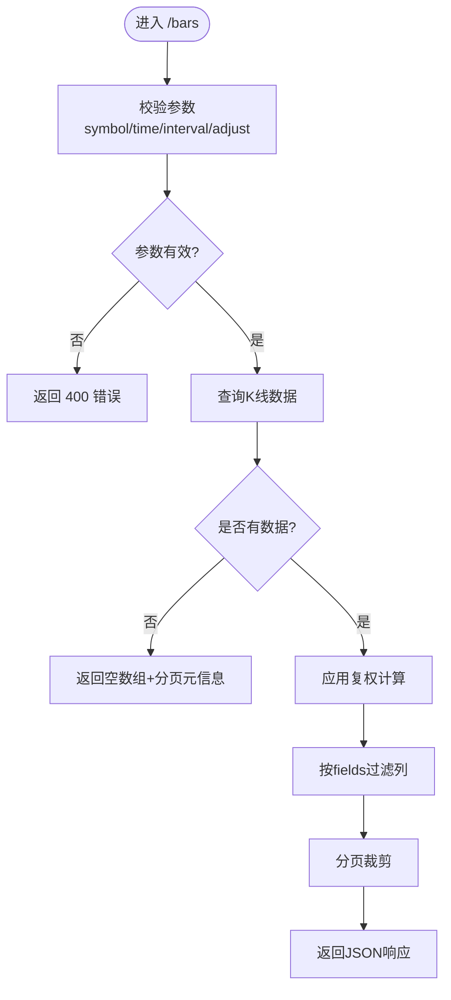
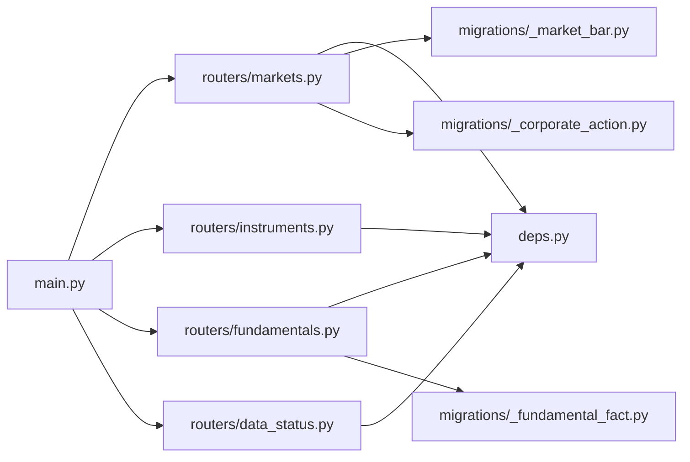

# 市场数据API

<cite>
**本文引用的文件**   
- [apps/api/main.py](file://apps/api/main.py)
- [apps/api/routers/markets.py](file://apps/api/routers/markets.py)
- [apps/api/routers/instruments.py](file://apps/api/routers/instruments.py)
- [apps/api/routers/fundamentals.py](file://apps/api/routers/fundamentals.py)
- [apps/api/routers/data_status.py](file://apps/api/routers/data_status.py)
- [apps/api/routers/forecast.py](file://apps/api/routers/forecast.py)
- [apps/api/routers/portfolio.py](file://apps/api/routers/portfolio.py)
- [apps/api/routers/scheduler.py](file://apps/api/routers/scheduler.py)
- [apps/api/routers/admin_ingestion.py](file://apps/api/routers/admin_ingestion.py)
- [apps/api/deps.py](file://apps/api/deps.py)
- [sql/migrations/20260715_0003_market_bar.py](file://sql/migrations/20260715_0003_market_bar.py)
- [sql/migrations/20260715_0004_corporate_action.py](file://sql/migrations/20260715_0004_corporate_action.py)
- [sql/migrations/20260715_0005_fundamental_fact.py](file://sql/migrations/20260715_0005_fundamental_fact.py)
- [sql/migrations/20260715_0008_ca_nav_provenance.py](file://sql/migrations/20260715_0008_ca_nav_provenance.py)
</cite>

## 目录
1. [简介](#简介)
2. [项目结构](#项目结构)
3. [核心组件](#核心组件)
4. [架构总览](#架构总览)
5. [详细组件分析](#详细组件分析)
6. [依赖分析](#依赖分析)
7. [性能考虑](#性能考虑)
8. [故障排查指南](#故障排查指南)
9. [结论](#结论)
10. [附录](#附录)

## 简介
本文件面向需要接入“市场数据”能力的客户端与集成方，系统化梳理并文档化本项目中与行情、标的、基本面、数据状态等相关的REST API。重点覆盖：
- 股票、基金等金融产品的行情数据获取接口（K线、复权因子、公司行为等）
- HTTP方法、URL模式、请求参数与响应格式
- 时间范围查询、分页机制与数据过滤选项
- 错误码处理与异常场景说明
- 客户端集成示例与最佳实践建议

## 项目结构
本项目采用FastAPI构建API服务，路由按功能域拆分到独立模块；数据库迁移脚本定义了市场数据相关表结构，便于理解字段语义与约束。

图表来源
- [apps/api/main.py](file://apps/api/main.py)
- [apps/api/routers/markets.py](file://apps/api/routers/markets.py)
- [apps/api/routers/instruments.py](file://apps/api/routers/instruments.py)
- [apps/api/routers/fundamentals.py](file://apps/api/routers/fundamentals.py)
- [apps/api/routers/data_status.py](file://apps/api/routers/data_status.py)
- [apps/api/routers/forecast.py](file://apps/api/routers/forecast.py)
- [apps/api/routers/portfolio.py](file://apps/api/routers/portfolio.py)
- [apps/api/routers/scheduler.py](file://apps/api/routers/scheduler.py)
- [apps/api/routers/admin_ingestion.py](file://apps/api/routers/admin_ingestion.py)
- [apps/api/deps.py](file://apps/api/deps.py)
- [sql/migrations/20260715_0003_market_bar.py](file://sql/migrations/20260715_0003_market_bar.py)
- [sql/migrations/20260715_0004_corporate_action.py](file://sql/migrations/20260715_0004_corporate_action.py)
- [sql/migrations/20260715_0005_fundamental_fact.py](file://sql/migrations/20260715_0005_fundamental_fact.py)
- [sql/migrations/20260715_0008_ca_nav_provenance.py](file://sql/migrations/20260715_0008_ca_nav_provenance.py)

章节来源
- [apps/api/main.py](file://apps/api/main.py)
- [apps/api/routers/markets.py](file://apps/api/routers/markets.py)
- [apps/api/routers/instruments.py](file://apps/api/routers/instruments.py)
- [apps/api/routers/fundamentals.py](file://apps/api/routers/fundamentals.py)
- [apps/api/routers/data_status.py](file://apps/api/routers/data_status.py)
- [apps/api/routers/forecast.py](file://apps/api/routers/forecast.py)
- [apps/api/routers/portfolio.py](file://apps/api/routers/portfolio.py)
- [apps/api/routers/scheduler.py](file://apps/api/routers/scheduler.py)
- [apps/api/routers/admin_ingestion.py](file://apps/api/routers/admin_ingestion.py)
- [apps/api/deps.py](file://apps/api/deps.py)
- [sql/migrations/20260715_0003_market_bar.py](file://sql/migrations/20260715_0003_market_bar.py)
- [sql/migrations/20260715_0004_corporate_action.py](file://sql/migrations/20260715_0004_corporate_action.py)
- [sql/migrations/20260715_0005_fundamental_fact.py](file://sql/migrations/20260715_0005_fundamental_fact.py)
- [sql/migrations/20260715_0008_ca_nav_provenance.py](file://sql/migrations/20260715_0008_ca_nav_provenance.py)

## 核心组件
- 应用入口与路由挂载：负责注册各功能域路由、全局中间件与依赖注入配置。
- 行情路由：提供标的行情K线、复权因子、涨跌停/停牌、交易日历等接口。
- 标的路由：提供标的清单、分类、基础信息、ID映射等接口。
- 基本面路由：提供财务指标、公告、估值等基本面数据接口。
- 数据状态路由：提供数据完整性、延迟、覆盖率等健康检查接口。
- 预测/组合/调度/管理入仓路由：辅助能力，非本次重点但影响整体可用性。

章节来源
- [apps/api/main.py](file://apps/api/main.py)
- [apps/api/routers/markets.py](file://apps/api/routers/markets.py)
- [apps/api/routers/instruments.py](file://apps/api/routers/instruments.py)
- [apps/api/routers/fundamentals.py](file://apps/api/routers/fundamentals.py)
- [apps/api/routers/data_status.py](file://apps/api/routers/data_status.py)

## 架构总览
下图展示从HTTP请求到数据模型的端到端调用路径，以及关键数据实体关系。

图表来源
- [apps/api/main.py](file://apps/api/main.py)
- [apps/api/routers/markets.py](file://apps/api/routers/markets.py)
- [apps/api/routers/instruments.py](file://apps/api/routers/instruments.py)
- [apps/api/routers/fundamentals.py](file://apps/api/routers/fundamentals.py)
- [apps/api/routers/data_status.py](file://apps/api/routers/data_status.py)

## 详细组件分析

### 行情数据API（markets）
- 典型端点
  - GET /api/v1/markets/bars
    - 用途：获取标的在指定时间范围内的K线数据
    - 查询参数
      - symbol: 标的代码（支持多标的使用逗号分隔或重复参数，具体以实现为准）
      - start_time/end_time: ISO 8601 时间戳或本地时区时间
      - interval: K线周期（如 1min, 5min, 1h, 1d）
      - adjust: 复权方式（前复权/后复权/不复权）
      - limit/offset 或 page/page_size: 分页参数
      - fields: 选择返回字段（open/high/low/close/volume/amount等）
    - 响应体
      - data: 数组，元素包含时间戳、开高低收、成交量、成交额、复权因子等
      - pagination: {total, page, page_size}
      - meta: {symbol, interval, adjust, timezone}
  - GET /api/v1/markets/corporate-actions
    - 用途：获取标的的公司行为事件（分红、送转、拆合股等）
    - 查询参数：symbol, start_time, end_time
    - 响应体：data为事件列表，包含事件类型、日期、比例/金额等
  - GET /api/v1/markets/halt-status
    - 用途：查询标的停牌/复牌状态
    - 查询参数：symbol, date
    - 响应体：包含状态、原因、起止时间等
  - GET /api/v1/markets/calendar
    - 用途：查询交易日历（某市场在某日是否交易）
    - 查询参数：market, date
    - 响应体：布尔或结构化交易日信息

- 时间范围与过滤
  - 支持start_time/end_time闭区间查询
  - 支持按interval聚合
  - 支持adjust复权方式
  - 支持fields白名单过滤

- 分页机制
  - 统一使用limit/offset或page/page_size两种风格之一
  - 默认分页大小由服务端配置决定，最大限制受安全策略控制

- 错误处理
  - 400：参数校验失败（非法时间、不支持的interval等）
  - 404：标的不存在或未上线
  - 429：限流触发
  - 500：内部异常

图表来源
- [apps/api/routers/markets.py](file://apps/api/routers/markets.py)
- [sql/migrations/20260715_0003_market_bar.py](file://sql/migrations/20260715_0003_market_bar.py)
- [sql/migrations/20260715_0004_corporate_action.py](file://sql/migrations/20260715_0004_corporate_action.py)

章节来源
- [apps/api/routers/markets.py](file://apps/api/routers/markets.py)
- [sql/migrations/20260715_0003_market_bar.py](file://sql/migrations/20260715_0003_market_bar.py)
- [sql/migrations/20260715_0004_corporate_action.py](file://sql/migrations/20260715_0004_corporate_action.py)
- [sql/migrations/20260715_0008_ca_nav_provenance.py](file://sql/migrations/20260715_0008_ca_nav_provenance.py)

### 标的信息API（instruments）
- 典型端点
  - GET /api/v1/instruments
    - 用途：查询标的清单与基础信息
    - 查询参数：market, type, status, exchange, keyword等
    - 响应体：data为标的列表，包含symbol、名称、上市日期、退市日期、行业分类等
  - GET /api/v1/instruments/{symbol}
    - 用途：获取单个标的详情
    - 响应体：完整标的信息

- 过滤与分页
  - 支持按市场、类型、状态、交易所等多维过滤
  - 支持keyword模糊匹配
  - 支持分页

章节来源
- [apps/api/routers/instruments.py](file://apps/api/routers/instruments.py)

### 基本面数据API（fundamentals）
- 典型端点
  - GET /api/v1/fundamentals/facts
    - 用途：获取标的的基本面事实（营收、利润、资产负债等）
    - 查询参数：symbol, report_date, period_type, fields
    - 响应体：data为事实列表，包含报告期、指标名、数值、单位等
  - GET /api/v1/fundamentals/events
    - 用途：获取基本面事件（财报发布、业绩预告等）

- 数据模型参考
  - 基本面事实表定义见迁移脚本，用于理解字段含义与约束

章节来源
- [apps/api/routers/fundamentals.py](file://apps/api/routers/fundamentals.py)
- [sql/migrations/20260715_0005_fundamental_fact.py](file://sql/migrations/20260715_0005_fundamental_fact.py)

### 数据状态与健康检查（data_status）
- 典型端点
  - GET /api/v1/data/status
    - 用途：查看数据完整性、延迟、覆盖率等
    - 响应体：包含各市场/标的的数据最新时间、缺失情况、告警信息等

章节来源
- [apps/api/routers/data_status.py](file://apps/api/routers/data_status.py)

### 其他辅助API
- 预测（forecast）、组合（portfolio）、调度（scheduler）、管理入仓（admin_ingestion）等路由提供辅助能力，通常不直接暴露给外部客户端，或在鉴权后开放。

章节来源
- [apps/api/routers/forecast.py](file://apps/api/routers/forecast.py)
- [apps/api/routers/portfolio.py](file://apps/api/routers/portfolio.py)
- [apps/api/routers/scheduler.py](file://apps/api/routers/scheduler.py)
- [apps/api/routers/admin_ingestion.py](file://apps/api/routers/admin_ingestion.py)

## 依赖分析
- 路由层依赖依赖注入容器（deps.py），用于获取数据库连接、缓存、配置等。
- 行情与基本面路由依赖对应的数据模型（迁移脚本定义的表结构）。
- 主应用（main.py）负责挂载路由、注册中间件与生命周期钩子。

图表来源
- [apps/api/main.py](file://apps/api/main.py)
- [apps/api/routers/markets.py](file://apps/api/routers/markets.py)
- [apps/api/routers/instruments.py](file://apps/api/routers/instruments.py)
- [apps/api/routers/fundamentals.py](file://apps/api/routers/fundamentals.py)
- [apps/api/routers/data_status.py](file://apps/api/routers/data_status.py)
- [apps/api/deps.py](file://apps/api/deps.py)
- [sql/migrations/20260715_0003_market_bar.py](file://sql/migrations/20260715_0003_market_bar.py)
- [sql/migrations/20260715_0004_corporate_action.py](file://sql/migrations/20260715_0004_corporate_action.py)
- [sql/migrations/20260715_0005_fundamental_fact.py](file://sql/migrations/20260715_0005_fundamental_fact.py)

章节来源
- [apps/api/main.py](file://apps/api/main.py)
- [apps/api/deps.py](file://apps/api/deps.py)
- [apps/api/routers/markets.py](file://apps/api/routers/markets.py)
- [apps/api/routers/instruments.py](file://apps/api/routers/instruments.py)
- [apps/api/routers/fundamentals.py](file://apps/api/routers/fundamentals.py)
- [apps/api/routers/data_status.py](file://apps/api/routers/data_status.py)
- [sql/migrations/20260715_0003_market_bar.py](file://sql/migrations/20260715_0003_market_bar.py)
- [sql/migrations/20260715_0004_corporate_action.py](file://sql/migrations/20260715_0004_corporate_action.py)
- [sql/migrations/20260715_0005_fundamental_fact.py](file://sql/migrations/20260715_0005_fundamental_fact.py)

## 性能考虑
- 合理设置interval与fields，避免一次性拉取过多列与过细粒度数据。
- 使用分页与时间窗口切分，降低单次响应体积与数据库压力。
- 对高频热点标的启用缓存（若后端已实现），减少重复查询。
- 批量查询多个symbol时，优先使用服务端提供的批量接口，避免多次小请求。
- 注意时区与时间边界，避免跨日/跨时区导致的重复或缺失。

[本节为通用指导，无需源码引用]

## 故障排查指南
- 常见错误码
  - 400：参数校验失败（如时间格式错误、interval不被支持、symbol为空）
  - 404：标的不存在或未上线
  - 429：限流触发（请退避重试）
  - 500：服务器内部错误（可结合日志定位）
- 排查步骤
  - 确认symbol是否正确且处于交易状态
  - 检查start_time/end_time是否在合法范围内
  - 缩小时间窗口或增大interval验证是否为数据缺失问题
  - 通过数据状态接口检查目标市场/标的的最新更新时间
  - 开启调试日志，捕获请求ID以便追踪

章节来源
- [apps/api/routers/data_status.py](file://apps/api/routers/data_status.py)

## 结论
本API围绕“行情、标的、基本面、数据状态”四大能力提供标准化REST接口，支持时间范围查询、复权、分页与字段过滤。建议客户端遵循最小必要原则进行参数选择，并结合数据状态接口做可用性监控与容错处理。

[本节为总结性内容，无需源码引用]

## 附录

### 客户端集成示例（伪代码）
- Python（requests）
  - 构造查询参数：symbol、start_time、end_time、interval、adjust、fields、分页参数
  - 发送GET请求，解析JSON响应中的data与pagination
  - 处理429退避重试与5xx指数回退
- JavaScript（fetch）
  - 使用URLSearchParams拼接参数
  - 解析response.json()，迭代data数组生成时序图或表格
- 注意事项
  - 统一时区（建议使用UTC或明确服务端时区）
  - 幂等重试：仅对GET请求进行有限次重试
  - 断网/超时：设置合理的超时与重试上限

[本节为通用示例，无需源码引用]

### 数据模型参考（节选）
- 行情K线表（market_bar）
  - 关键字段：symbol、datetime、open、high、low、close、volume、amount、adjust_factor等
- 公司行为表（corporate_action）
  - 关键字段：symbol、event_type、ex_date、ratio/amount、description等
- 基本面事实表（fundamental_fact）
  - 关键字段：symbol、report_date、period_type、fact_name、value、unit等

章节来源
- [sql/migrations/20260715_0003_market_bar.py](file://sql/migrations/20260715_0003_market_bar.py)
- [sql/migrations/20260715_0004_corporate_action.py](file://sql/migrations/20260715_0004_corporate_action.py)
- [sql/migrations/20260715_0005_fundamental_fact.py](file://sql/migrations/20260715_0005_fundamental_fact.py)