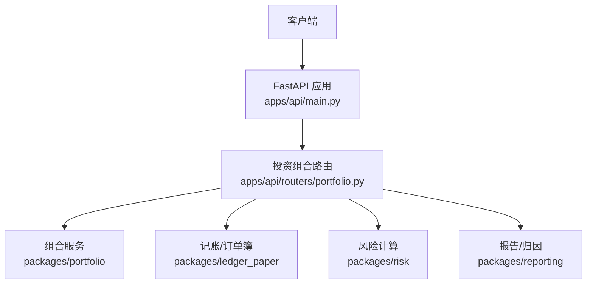
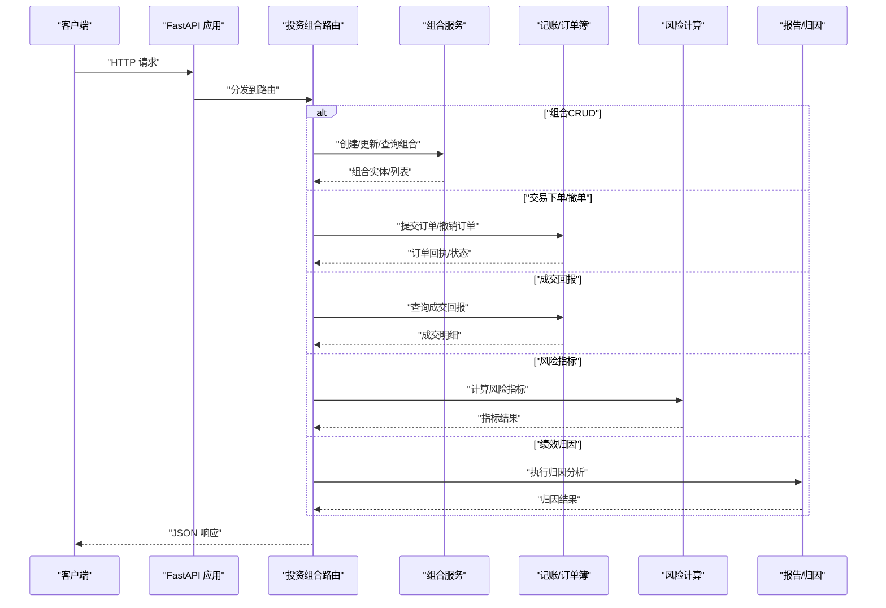
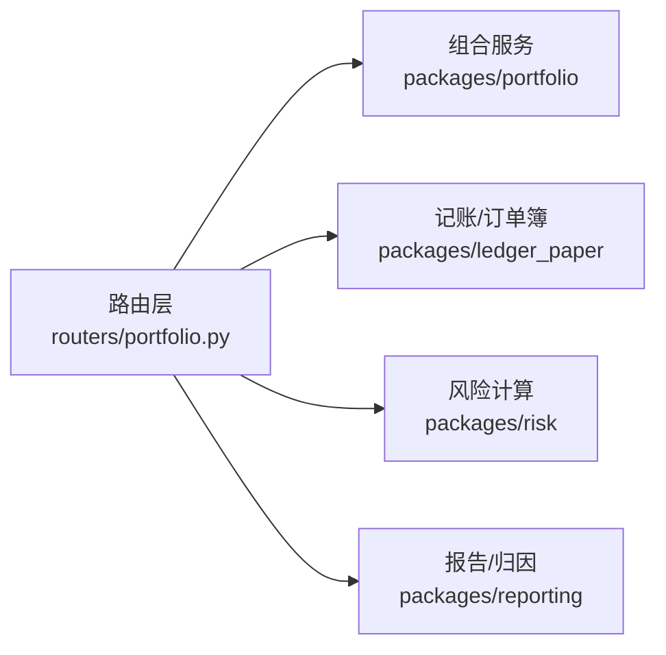

# 投资组合API

<cite>
**本文引用的文件**   
- [apps/api/main.py](file://apps/api/main.py)
- [apps/api/routers/portfolio.py](file://apps/api/routers/portfolio.py)
- [apps/api/deps.py](file://apps/api/deps.py)
- [packages/portfolio/__init__.py](file://packages/portfolio/__init__.py)
- [packages/ledger_paper/__init__.py](file://packages/ledger_paper/__init__.py)
- [packages/risk/__init__.py](file://packages/risk/__init__.py)
- [packages/reporting/__init__.py](file://packages/reporting/__init__.py)
</cite>

## 目录
1. [简介](#简介)
2. [项目结构](#项目结构)
3. [核心组件](#核心组件)
4. [架构总览](#架构总览)
5. [详细组件分析](#详细组件分析)
6. [依赖分析](#依赖分析)
7. [性能考虑](#性能考虑)
8. [故障排查指南](#故障排查指南)
9. [结论](#结论)
10. [附录](#附录) 

## 简介
本文件面向使用“投资组合管理”相关REST API的开发者与业务用户，覆盖以下能力：
- 投资组合生命周期：创建、修改、查询
- 持仓与交易：下单、撤单、成交回报
- 组合分析与绩效归因：风险指标计算、收益分解等
- 权限控制与访问限制说明
- 请求/响应示例与状态码定义

为保证准确性，本文所有接口路径、参数与行为均以仓库中实际路由实现为依据。

## 项目结构
本项目采用分层组织方式：
- 应用层（FastAPI）：在 apps/api 下提供HTTP路由与依赖注入
- 领域包：packages 下按功能域划分（portfolio、ledger_paper、risk、reporting 等）
- 配置与部署：configs、deploy
- 数据迁移：sql/migrations

图表来源
- [apps/api/main.py](file://apps/api/main.py)
- [apps/api/routers/portfolio.py](file://apps/api/routers/portfolio.py)
- [packages/portfolio/__init__.py](file://packages/portfolio/__init__.py)
- [packages/ledger_paper/__init__.py](file://packages/ledger_paper/__init__.py)
- [packages/risk/__init__.py](file://packages/risk/__init__.py)
- [packages/reporting/__init__.py](file://packages/reporting/__init__.py)

章节来源
- [apps/api/main.py](file://apps/api/main.py)
- [apps/api/routers/portfolio.py](file://apps/api/routers/portfolio.py)

## 核心组件
- 路由层：负责HTTP端点定义、参数校验、鉴权与调用领域服务
- 组合服务：封装组合CRUD、持仓快照、交易流水等核心逻辑
- 记账/订单簿：处理下单、撤单、成交回报等交易事件
- 风险模块：计算VaR、波动率、回撤、Beta等风险指标
- 报告/归因：组合绩效归因、贡献度分解、基准对比

章节来源
- [apps/api/routers/portfolio.py](file://apps/api/routers/portfolio.py)
- [packages/portfolio/__init__.py](file://packages/portfolio/__init__.py)
- [packages/ledger_paper/__init__.py](file://packages/ledger_paper/__init__.py)
- [packages/risk/__init__.py](file://packages/risk/__init__.py)
- [packages/reporting/__init__.py](file://packages/reporting/__init__.py)

## 架构总览
下图展示从HTTP请求到领域服务的调用链路与数据流向。

图表来源
- [apps/api/main.py](file://apps/api/main.py)
- [apps/api/routers/portfolio.py](file://apps/api/routers/portfolio.py)
- [packages/portfolio/__init__.py](file://packages/portfolio/__init__.py)
- [packages/ledger_paper/__init__.py](file://packages/ledger_paper/__init__.py)
- [packages/risk/__init__.py](file://packages/risk/__init__.py)
- [packages/reporting/__init__.py](file://packages/reporting/__init__.py)

## 详细组件分析

### 路由层：投资组合路由
- 职责
  - 定义投资组合相关的REST端点
  - 解析并校验请求体与查询参数
  - 调用组合服务、记账/订单簿、风险与报告模块
  - 统一错误包装与返回格式
- 关键端点（以实际路由为准）
  - 组合CRUD：创建、更新、删除、获取详情、列表分页
  - 交易：下单、撤单、查询成交回报
  - 分析：风险指标、绩效归因
- 鉴权与限流
  - 通过依赖注入接入认证与权限检查
  - 可结合中间件或网关进行速率限制

章节来源
- [apps/api/routers/portfolio.py](file://apps/api/routers/portfolio.py)
- [apps/api/deps.py](file://apps/api/deps.py)

### 组合服务：packages/portfolio
- 职责
  - 组合实体的持久化与查询
  - 持仓快照生成与增量更新
  - 交易流水聚合与对账
- 典型流程
  - 创建组合：初始化元数据、默认基准、权限角色
  - 更新组合：变更策略、基准、风控阈值等
  - 查询组合：支持多条件过滤与分页

章节来源
- [packages/portfolio/__init__.py](file://packages/portfolio/__init__.py)

### 记账/订单簿：packages/ledger_paper
- 职责
  - 订单生命周期管理（新建、挂单、部分成交、完全成交、撤销）
  - 成交回报推送与查询
  - 资金与持仓的原子性更新
- 关键流程
  - 下单：校验可用资金/券源、落库订单、触发撮合
  - 撤单：幂等校验、回滚占用额度
  - 成交回报：匹配成交、更新持仓与资金、生成流水

章节来源
- [packages/ledger_paper/__init__.py](file://packages/ledger_paper/__init__.py)

### 风险计算：packages/risk
- 职责
  - 计算组合风险指标（如波动率、VaR、最大回撤、Beta等）
  - 暴露风险指标查询接口
- 输入输出
  - 输入：时间窗口、基准、资产权重、价格序列
  - 输出：指标字典、时序曲线、置信区间

章节来源
- [packages/risk/__init__.py](file://packages/risk/__init__.py)

### 报告与归因：packages/reporting
- 职责
  - 组合绩效归因（资产配置、选股、交互效应等）
  - 生成标准化报告与可视化数据
- 典型用法
  - 指定组合ID、起止日期、基准与分组维度
  - 返回归因明细与汇总指标

章节来源
- [packages/reporting/__init__.py](file://packages/reporting/__init__.py)

## 依赖分析
- 耦合关系
  - 路由层对领域服务为松耦合，通过依赖注入解耦
  - 各领域包内部高内聚，对外暴露稳定接口
- 外部依赖
  - 数据库与缓存（由领域服务内部封装）
  - 消息队列（可选，用于异步成交回报推送）

图表来源
- [apps/api/routers/portfolio.py](file://apps/api/routers/portfolio.py)
- [packages/portfolio/__init__.py](file://packages/portfolio/__init__.py)
- [packages/ledger_paper/__init__.py](file://packages/ledger_paper/__init__.py)
- [packages/risk/__init__.py](file://packages/risk/__init__.py)
- [packages/reporting/__init__.py](file://packages/reporting/__init__.py)

章节来源
- [apps/api/routers/portfolio.py](file://apps/api/routers/portfolio.py)

## 性能考虑
- 批量操作：优先使用批量创建/更新接口，减少往返次数
- 分页与过滤：合理设置页大小与过滤条件，避免全表扫描
- 缓存热点：对静态配置与低频变更数据进行缓存
- 异步处理：成交回报与重算任务建议异步化
- 索引优化：对常用查询字段建立索引（由领域服务内部实现）

## 故障排查指南
- 常见错误
  - 400 参数校验失败：检查必填字段、类型与范围
  - 401/403 未授权/无权限：确认令牌有效性与角色权限
  - 404 资源不存在：核对组合ID、订单ID等标识
  - 409 冲突：并发更新或重复下单导致
  - 500 服务器异常：查看服务端日志与堆栈
- 定位步骤
  - 开启调试日志，记录请求ID
  - 核对上游依赖（数据库、缓存、消息队列）健康状态
  - 复现最小用例，逐步缩小问题范围

## 结论
本API围绕“组合—交易—风险—报告”的主线构建，采用清晰的分层与依赖注入设计，便于扩展与维护。建议在集成时严格遵循参数规范与幂等要求，并结合监控与告警保障稳定性。

## 附录

### 通用约定
- 内容类型：application/json
- 字符编码：UTF-8
- 时间格式：ISO 8601（带时区）
- 分页：page/page_size 或 cursor-based（以具体接口为准）

### 状态码定义
- 2xx：成功
- 400：请求参数错误
- 401：未认证
- 403：无权限
- 404：资源不存在
- 409：冲突
- 422：语义校验失败
- 429：频率限制
- 5xx：服务端错误

### 权限控制与访问限制
- 认证：基于令牌（如JWT），需在请求头携带
- 授权：基于角色/资源的细粒度控制，路由层在依赖中完成
- 限流：按用户/IP/接口维度限制QPS与突发流量
- 审计：关键操作写入审计日志，便于追溯

### 示例：组合CRUD
- 创建组合
  - 方法：POST
  - 路径：/api/portfolios
  - 请求体关键字段：名称、基准、初始资金、策略标签、风控阈值等
  - 响应：组合ID、创建时间、初始状态
- 更新组合
  - 方法：PUT/PATCH
  - 路径：/api/portfolios/{id}
  - 请求体关键字段：需更新的字段
  - 响应：更新后的组合信息
- 查询组合
  - 方法：GET
  - 路径：/api/portfolios/{id}
  - 查询参数：无
  - 响应：组合详情
- 组合列表
  - 方法：GET
  - 路径：/api/portfolios
  - 查询参数：page、page_size、筛选条件（如基准、状态）
  - 响应：分页结果

章节来源
- [apps/api/routers/portfolio.py](file://apps/api/routers/portfolio.py)

### 示例：交易下单/撤单/成交回报
- 下单
  - 方法：POST
  - 路径：/api/orders
  - 请求体关键字段：组合ID、标的、方向、数量、价格类型、有效期等
  - 响应：订单ID、状态、预估费用
- 撤单
  - 方法：DELETE
  - 路径：/api/orders/{order_id}
  - 响应：撤销结果与最新状态
- 成交回报
  - 方法：GET
  - 路径：/api/orders/{order_id}/fills
  - 查询参数：时间范围、是否包含历史
  - 响应：成交明细列表

章节来源
- [apps/api/routers/portfolio.py](file://apps/api/routers/portfolio.py)

### 示例：组合分析与绩效归因
- 风险指标
  - 方法：GET
  - 路径：/api/portfolios/{id}/risk
  - 查询参数：起始日、结束日、基准、置信水平
  - 响应：波动率、VaR、最大回撤、Beta等
- 绩效归因
  - 方法：GET
  - 路径：/api/portfolios/{id}/attribution
  - 查询参数：起始日、结束日、基准、分组维度
  - 响应：配置/选股/交互效应贡献度及累计影响

章节来源
- [apps/api/routers/portfolio.py](file://apps/api/routers/portfolio.py)