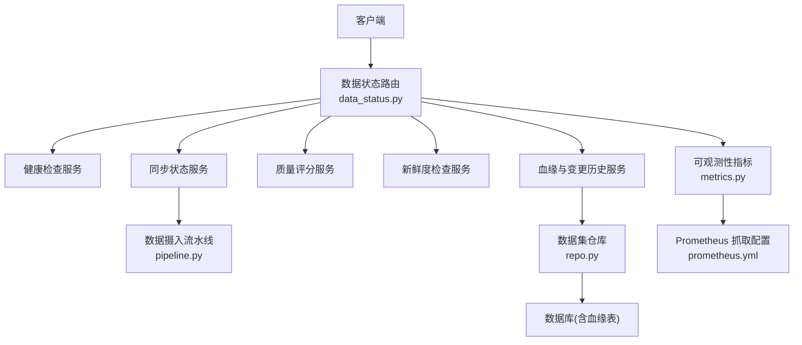
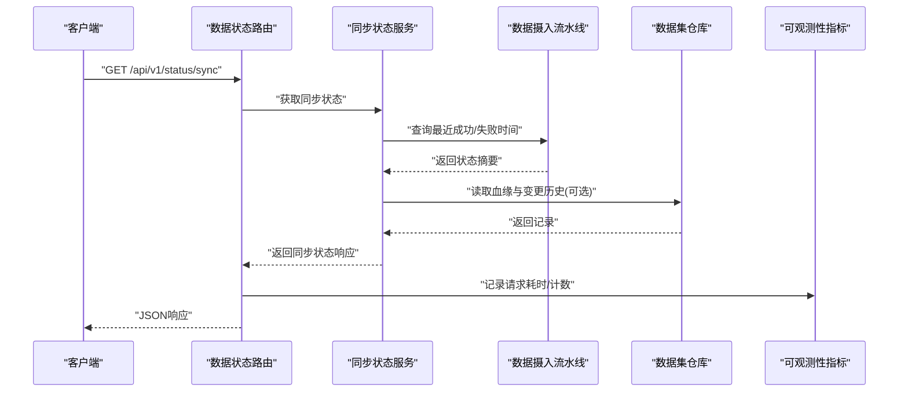
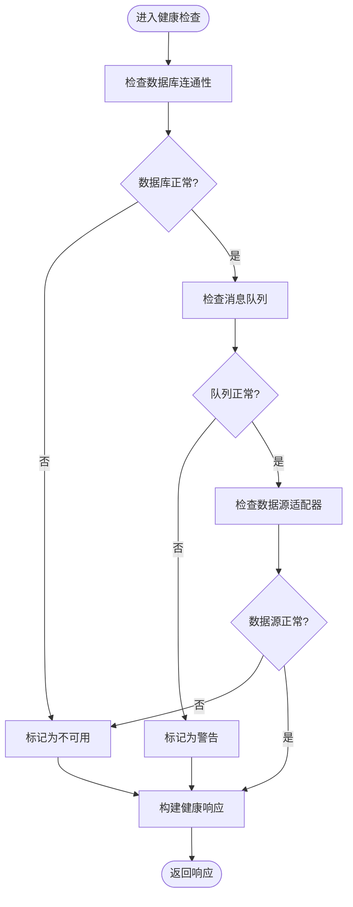
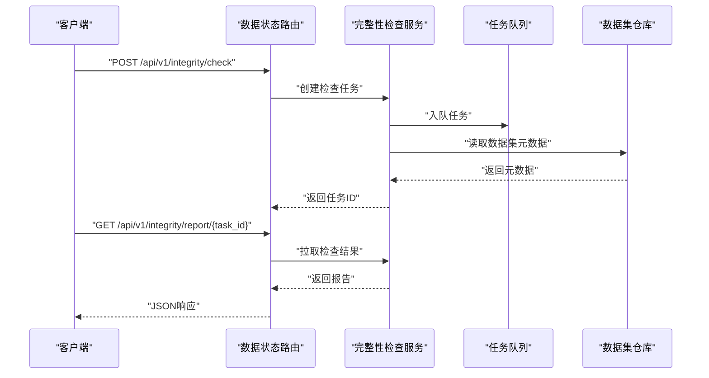
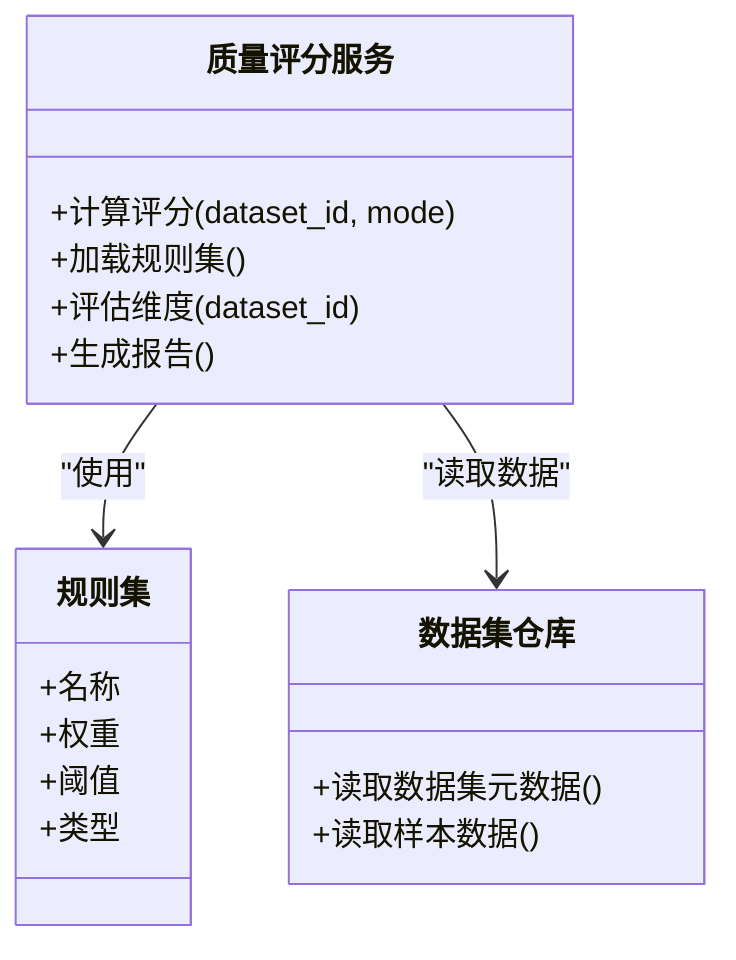
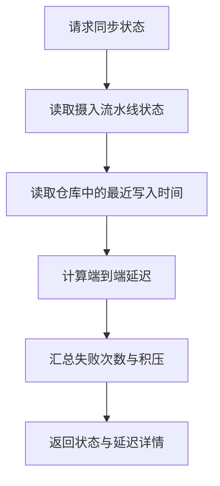
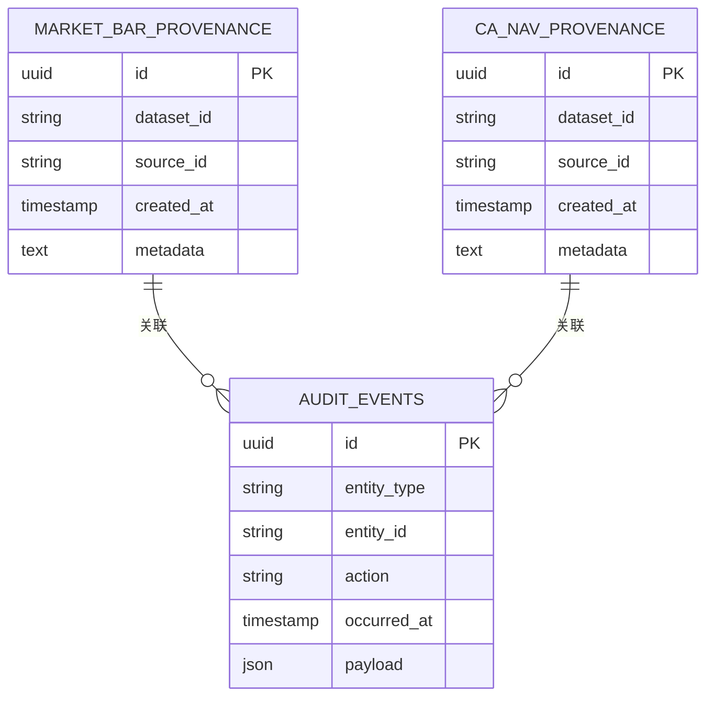
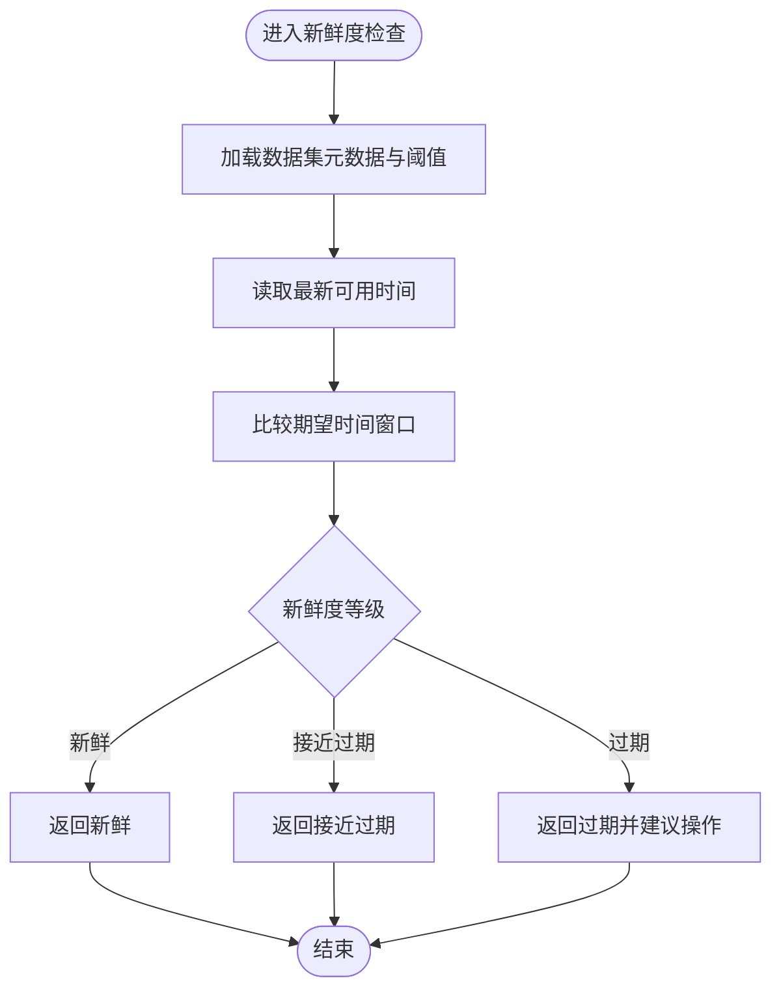
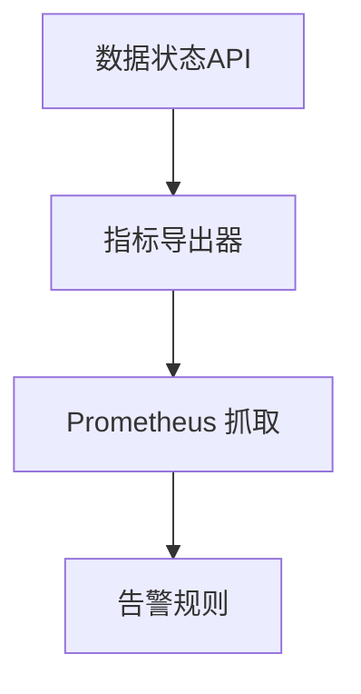
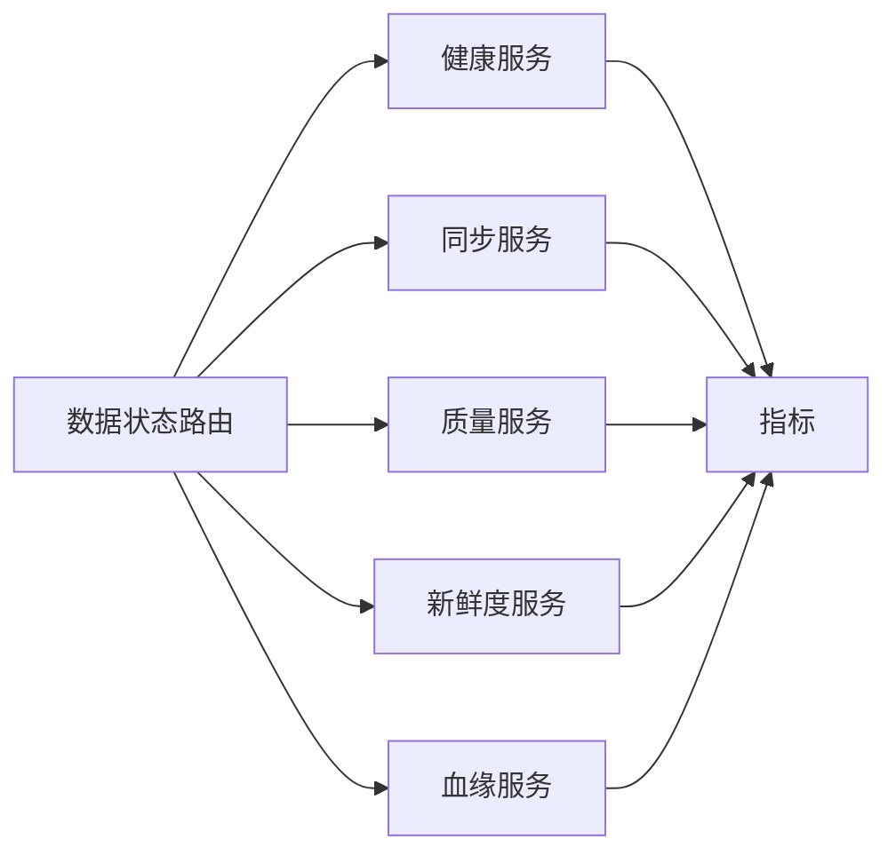

# 数据状态API

<cite>
**本文引用的文件**   
- [apps/api/routers/data_status.py](file://apps/api/routers/data_status.py)
- [apps/api/main.py](file://apps/api/main.py)
- [packages/observability/metrics.py](file://packages/observability/metrics.py)
- [packages/ingestion/pipeline.py](file://packages/ingestion/pipeline.py)
- [packages/datasets/repo.py](file://packages/datasets/repo.py)
- [packages/data_quality/engine.py](file://packages/data_quality/engine.py)
- [sql/migrations/20260715_0007_market_bar_provenance.py](file://sql/migrations/20260715_0007_market_bar_provenance.py)
- [sql/migrations/20260715_0008_ca_nav_provenance.py](file://sql/migrations/20260715_0008_ca_nav_provenance.py)
- [deploy/prometheus.yml](file://deploy/prometheus.yml)
</cite>

## 目录
1. [简介](#简介)
2. [项目结构](#项目结构)
3. [核心组件](#核心组件)
4. [架构总览](#架构总览)
5. [详细组件分析](#详细组件分析)
6. [依赖分析](#依赖分析)
7. [性能考虑](#性能考虑)
8. [故障排查指南](#故障排查指南)
9. [结论](#结论)
10. [附录](#附录)

## 简介
本文件面向“数据状态监控API”的完整说明，覆盖以下能力：
- 数据完整性检查、数据质量监控与健康状态查询接口
- 数据同步状态与延迟监控
- 数据质量评分计算方法
- 数据血缘追踪与变更历史查询
- 数据新鲜度检查与告警通知配置
- 系统健康检查与性能监控API使用说明
- 故障排查与运维管理实用工具接口

目标读者包括数据工程师、量化研究员与运维人员。文档以渐进方式组织，既提供高层概览，也给出代码级实现映射与可视化图示。

## 项目结构
与数据状态监控API直接相关的代码主要位于以下位置：
- API路由层：apps/api/routers/data_status.py
- 应用入口与路由注册：apps/api/main.py
- 可观测性指标：packages/observability/metrics.py
- 数据摄入流水线（用于同步状态与延迟）：packages/ingestion/pipeline.py
- 数据集仓库（用于血缘与变更历史）：packages/datasets/repo.py
- 数据质量引擎（用于质量评分与规则执行）：packages/data_quality/engine.py
- 血缘相关数据库迁移：sql/migrations/20260715_0007_market_bar_provenance.py、sql/migrations/20260715_0008_ca_nav_provenance.py
- 监控采集配置：deploy/prometheus.yml

图表来源
- [apps/api/routers/data_status.py](file://apps/api/routers/data_status.py)
- [apps/api/main.py](file://apps/api/main.py)
- [packages/observability/metrics.py](file://packages/observability/metrics.py)
- [packages/ingestion/pipeline.py](file://packages/ingestion/pipeline.py)
- [packages/datasets/repo.py](file://packages/datasets/repo.py)
- [deploy/prometheus.yml](file://deploy/prometheus.yml)

章节来源
- [apps/api/routers/data_status.py](file://apps/api/routers/data_status.py)
- [apps/api/main.py](file://apps/api/main.py)

## 核心组件
- 健康检查服务：提供系统与服务可用性探测，返回关键子系统状态与版本信息。
- 同步状态服务：聚合各数据源的最近一次成功时间、失败次数、队列积压等指标。
- 质量评分服务：基于规则集对数据集进行完整性、一致性、时效性等维度评估，输出综合评分。
- 新鲜度检查服务：对比数据最新可用时间与期望时间窗口，判定是否过期或延迟。
- 血缘与变更历史服务：基于血缘表与审计事件，提供数据从源到标的的链路追溯与变更记录。
- 可观测性指标：暴露标准指标供外部监控系统采集，如延迟、吞吐、错误率等。

章节来源
- [apps/api/routers/data_status.py](file://apps/api/routers/data_status.py)
- [packages/observability/metrics.py](file://packages/observability/metrics.py)

## 架构总览
数据状态监控API采用分层设计：
- 接入层：FastAPI路由统一对外暴露REST接口
- 服务层：按职责拆分为健康、同步、质量、新鲜度、血缘等子服务
- 数据层：通过仓库访问数据库，读取血缘、审计与指标数据
- 可观测性层：指标导出至Prometheus，便于集中监控与告警

图表来源
- [apps/api/routers/data_status.py](file://apps/api/routers/data_status.py)
- [packages/ingestion/pipeline.py](file://packages/ingestion/pipeline.py)
- [packages/datasets/repo.py](file://packages/datasets/repo.py)
- [packages/observability/metrics.py](file://packages/observability/metrics.py)

## 详细组件分析

### 健康检查接口
- 功能：返回系统整体健康状态、依赖项状态、版本信息与启动时间
- 典型端点：
  - GET /api/v1/health
  - GET /api/v1/health/deadlocks（可选，用于检测锁竞争）
- 行为要点：
  - 并行探测数据库连接、消息队列、外部数据源
  - 汇总各依赖项状态为OK/WARNING/ERROR
  - 返回包含阈值与时间戳的结构化响应

章节来源
- [apps/api/routers/data_status.py](file://apps/api/routers/data_status.py)

### 数据完整性检查接口
- 功能：对指定数据集执行完整性校验，包括空值比例、主键唯一性、外键约束、时间序列连续性等
- 典型端点：
  - POST /api/v1/integrity/check
  - GET /api/v1/integrity/report/{dataset_id}
- 行为要点：
  - 支持批量任务提交与异步报告查询
  - 结果包含通过率、失败明细与建议修复动作
  - 与质量评分联动，影响最终得分

章节来源
- [apps/api/routers/data_status.py](file://apps/api/routers/data_status.py)
- [packages/datasets/repo.py](file://packages/datasets/repo.py)

### 数据质量监控接口
- 功能：基于规则集计算质量评分，支持多维度（完整性、一致性、时效性、准确性）
- 典型端点：
  - GET /api/v1/quality/score/{dataset_id}
  - GET /api/v1/quality/rules
  - POST /api/v1/quality/run
- 计算方法：
  - 维度分 = f(规则命中情况, 权重, 阈值)
  - 综合分 = Σ(维度分 × 维度权重)
  - 规则类型包括：空值率、重复率、范围校验、时序连续性、跨源一致性等
- 行为要点：
  - 支持增量与全量两种模式
  - 输出维度明细、规则明细与改进建议

图表来源
- [packages/data_quality/engine.py](file://packages/data_quality/engine.py)
- [packages/datasets/repo.py](file://packages/datasets/repo.py)

章节来源
- [packages/data_quality/engine.py](file://packages/data_quality/engine.py)
- [apps/api/routers/data_status.py](file://apps/api/routers/data_status.py)

### 数据同步状态与延迟监控接口
- 功能：展示各数据源的最近成功时间、失败次数、队列积压、端到端延迟
- 典型端点：
  - GET /api/v1/status/sync
  - GET /api/v1/status/sync/{source_id}
  - GET /api/v1/status/latency
- 行为要点：
  - 从摄入流水线与仓库中聚合状态
  - 延迟计算基于“期望时间 vs 实际写入时间”
  - 支持阈值告警与趋势统计

图表来源
- [packages/ingestion/pipeline.py](file://packages/ingestion/pipeline.py)
- [packages/datasets/repo.py](file://packages/datasets/repo.py)
- [apps/api/routers/data_status.py](file://apps/api/routers/data_status.py)

章节来源
- [packages/ingestion/pipeline.py](file://packages/ingestion/pipeline.py)
- [apps/api/routers/data_status.py](file://apps/api/routers/data_status.py)

### 数据血缘追踪与变更历史接口
- 功能：提供数据从源到标的的链路追溯与变更记录查询
- 典型端点：
  - GET /api/v1/provenance/{dataset_id}
  - GET /api/v1/provenance/history/{dataset_id}
- 行为要点：
  - 基于血缘表与审计事件构建有向图
  - 支持按时间范围过滤与节点筛选
  - 输出节点属性、边关系与变更摘要

图表来源
- [sql/migrations/20260715_0007_market_bar_provenance.py](file://sql/migrations/20260715_0007_market_bar_provenance.py)
- [sql/migrations/20260715_0008_ca_nav_provenance.py](file://sql/migrations/20260715_0008_ca_nav_provenance.py)

章节来源
- [apps/api/routers/data_status.py](file://apps/api/routers/data_status.py)
- [packages/datasets/repo.py](file://packages/datasets/repo.py)

### 数据新鲜度检查接口
- 功能：对比数据最新可用时间与期望时间窗口，判定是否过期或延迟
- 典型端点：
  - GET /api/v1/freshness/{dataset_id}
  - GET /api/v1/freshness/batch
- 行为要点：
  - 支持按市场、资产类别、时间粒度设置阈值
  - 返回新鲜度等级（新鲜、接近过期、过期）与建议操作
  - 与告警系统集成，触发通知

章节来源
- [apps/api/routers/data_status.py](file://apps/api/routers/data_status.py)
- [packages/datasets/repo.py](file://packages/datasets/repo.py)

### 告警通知配置接口
- 功能：配置与查看告警规则、通道与阈值
- 典型端点：
  - GET /api/v1/alerts/config
  - PUT /api/v1/alerts/config
  - GET /api/v1/alerts/events
- 行为要点：
  - 支持多通道（邮件、IM、Webhook）
  - 规则可按数据集、指标、时间窗口定义
  - 事件记录包含触发条件、级别与处理状态

章节来源
- [apps/api/routers/data_status.py](file://apps/api/routers/data_status.py)

### 系统健康检查与性能监控API
- 功能：暴露系统健康与性能指标，便于外部监控
- 典型端点：
  - GET /api/v1/health
  - GET /metrics（Prometheus格式）
- 行为要点：
  - 指标包括请求数、延迟分布、错误率、资源占用
  - 与Prometheus集成，定期抓取

图表来源
- [packages/observability/metrics.py](file://packages/observability/metrics.py)
- [deploy/prometheus.yml](file://deploy/prometheus.yml)

章节来源
- [packages/observability/metrics.py](file://packages/observability/metrics.py)
- [deploy/prometheus.yml](file://deploy/prometheus.yml)

## 依赖分析
- 路由层依赖服务层：数据状态路由调用健康、同步、质量、新鲜度、血缘等服务
- 服务层依赖数据层：通过数据集仓库访问数据库，读取血缘、审计与指标数据
- 可观测性贯穿：所有关键路径记录指标，便于监控与排障

图表来源
- [apps/api/routers/data_status.py](file://apps/api/routers/data_status.py)
- [packages/observability/metrics.py](file://packages/observability/metrics.py)

章节来源
- [apps/api/routers/data_status.py](file://apps/api/routers/data_status.py)
- [packages/observability/metrics.py](file://packages/observability/metrics.py)

## 性能考虑
- 并发与批处理：对批量检查与报告生成采用异步任务队列，避免阻塞主线程
- 缓存策略：对频繁访问的元数据与阈值进行缓存，降低数据库压力
- 指标采样：对高频指标采用降采样与聚合，减少存储与传输开销
- 超时与重试：对外部数据源与数据库调用设置合理超时与重试策略
- 分页与过滤：对血缘与变更历史查询提供分页与时间范围过滤，提升响应速度

[本节为通用指导，不直接分析具体文件]

## 故障排查指南
- 常见问题定位：
  - 健康检查失败：检查数据库连接、消息队列与外部数据源状态
  - 同步延迟升高：查看队列积压与消费者消费速率
  - 质量评分下降：定位失败的规则与数据异常点
  - 新鲜度告警：确认数据源产出时间与ETL管道运行状态
- 诊断工具：
  - 健康检查端点快速验证系统可用性
  - 同步状态与延迟端点定位瓶颈环节
  - 质量报告与规则明细辅助根因分析
  - 血缘与变更历史帮助追踪数据流转与变更影响
- 日志与指标：
  - 结合Prometheus指标与结构化日志进行问题复现
  - 关注错误率、延迟分布与资源占用异常

章节来源
- [apps/api/routers/data_status.py](file://apps/api/routers/data_status.py)
- [packages/observability/metrics.py](file://packages/observability/metrics.py)

## 结论
数据状态监控API围绕健康、同步、质量、新鲜度、血缘与可观测性六大能力构建，形成闭环的数据治理与运维体系。通过标准化接口与指标导出，团队可实现对数据状态的持续监控、快速定位与高效治理。

[本节为总结性内容，不直接分析具体文件]

## 附录
- 术语说明：
  - 数据血缘：描述数据从源到标的的流转关系
  - 变更历史：记录数据实体的创建、更新与删除事件
  - 新鲜度：衡量数据最新可用时间与期望时间的差距
  - 质量评分：基于规则集对数据质量的量化评估
- 参考实现路径：
  - 路由与接口定义：apps/api/routers/data_status.py
  - 指标导出：packages/observability/metrics.py
  - 摄入流水线：packages/ingestion/pipeline.py
  - 数据集仓库：packages/datasets/repo.py
  - 质量引擎：packages/data_quality/engine.py
  - 血缘迁移：sql/migrations/20260715_0007_market_bar_provenance.py、sql/migrations/20260715_0008_ca_nav_provenance.py
  - 监控配置：deploy/prometheus.yml

[本节为补充信息，不直接分析具体文件]