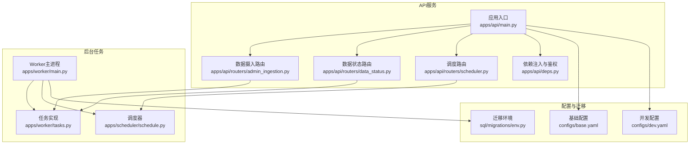
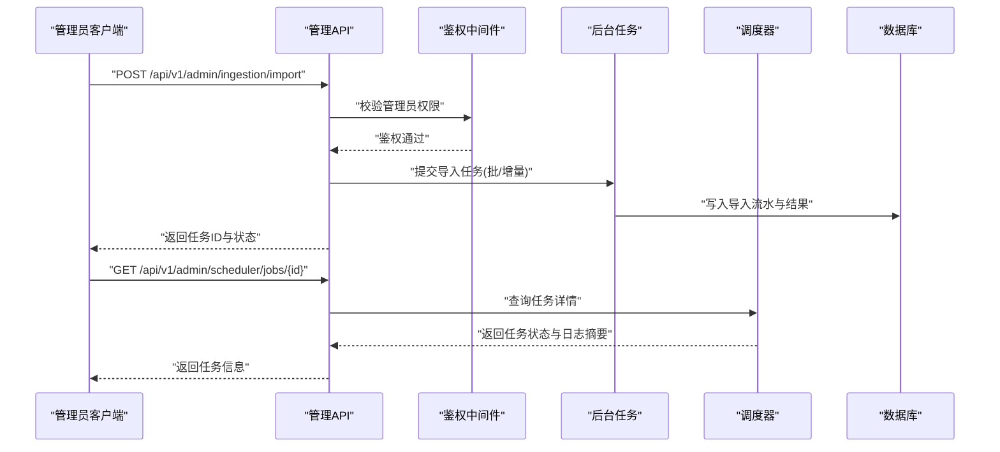
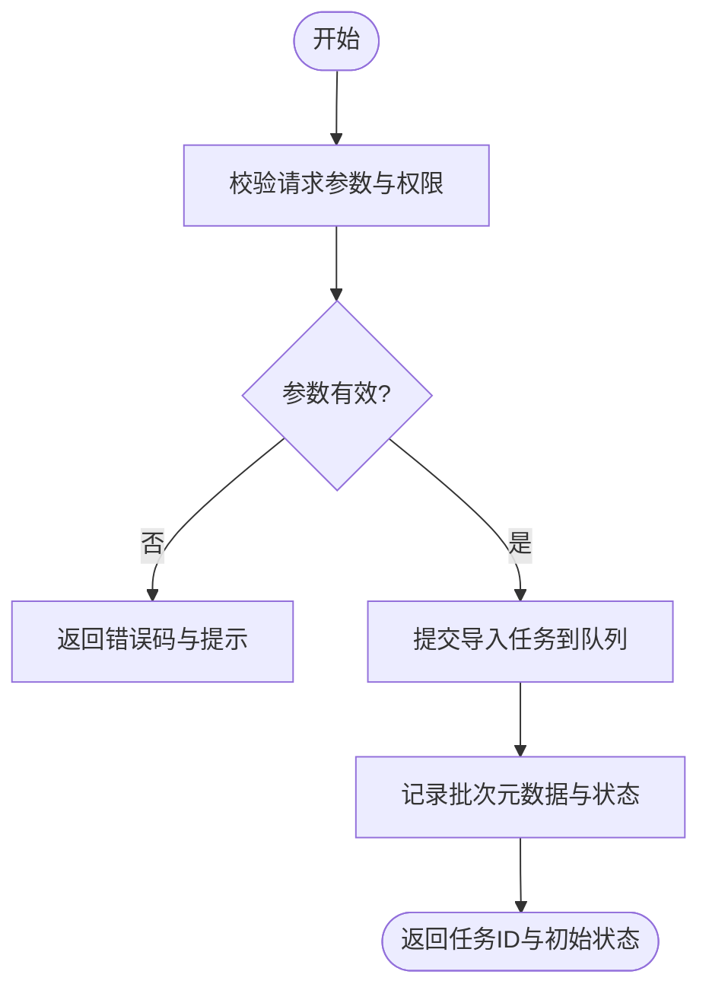
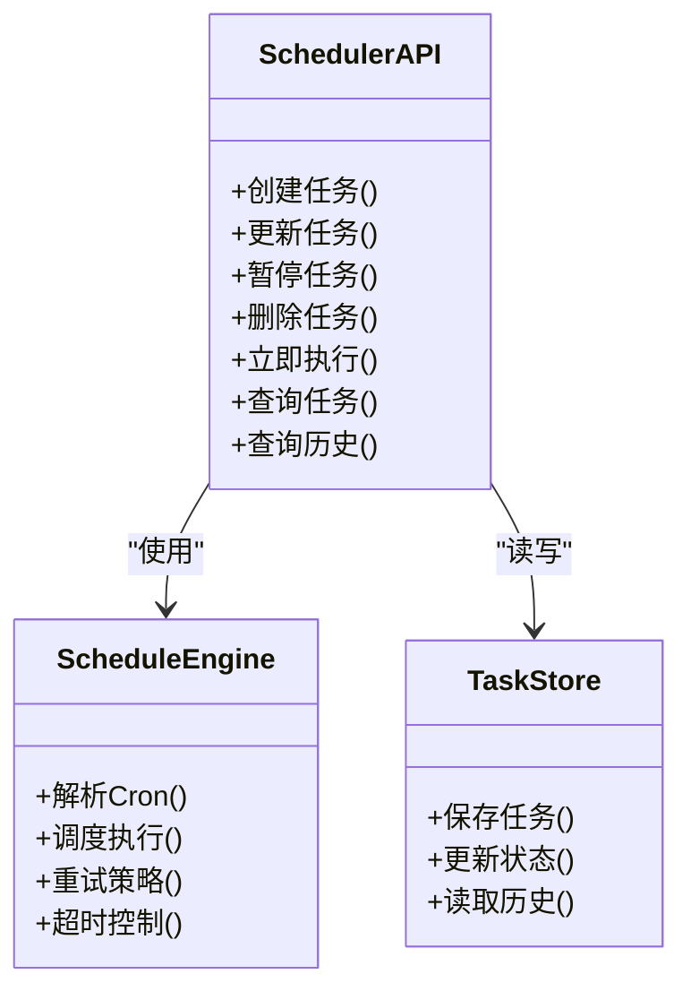
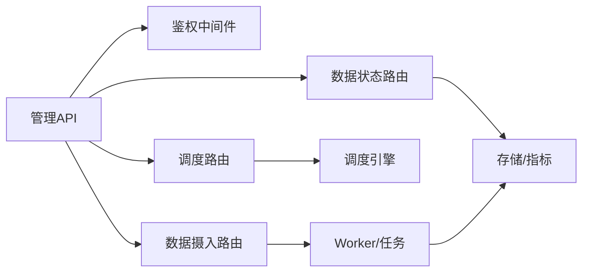

# 管理API

<cite>
**本文引用的文件**   
- [apps/api/main.py](file://apps/api/main.py)
- [apps/api/deps.py](file://apps/api/deps.py)
- [apps/api/routers/admin_ingestion.py](file://apps/api/routers/admin_ingestion.py)
- [apps/api/routers/data_status.py](file://apps/api/routers/data_status.py)
- [apps/api/routers/scheduler.py](file://apps/api/routers/scheduler.py)
- [apps/scheduler/schedule.py](file://apps/scheduler/schedule.py)
- [apps/worker/main.py](file://apps/worker/main.py)
- [apps/worker/tasks.py](file://apps/worker/tasks.py)
- [configs/base.yaml](file://configs/base.yaml)
- [configs/dev.yaml](file://configs/dev.yaml)
- [sql/migrations/env.py](file://sql/migrations/env.py)
</cite>

## 目录
1. [简介](#简介)
2. [项目结构](#项目结构)
3. [核心组件](#核心组件)
4. [架构总览](#架构总览)
5. [详细组件分析](#详细组件分析)
6. [依赖关系分析](#依赖关系分析)
7. [性能考虑](#性能考虑)
8. [故障排查指南](#故障排查指南)
9. [结论](#结论)
10. [附录](#附录)

## 简介
本文件为系统管理API的完整文档，覆盖数据摄入、任务调度、系统配置等管理功能的REST API接口。重点说明：
- 数据导入导出与批量处理操作方法
- 定时任务的创建、配置与监控接口
- 用户权限管理与系统配置、环境切换的管理能力
- 日志查询、审计追踪与系统维护工具接口
- 管理员权限验证与安全控制机制
- 系统升级与备份恢复操作指南

## 项目结构
本项目采用分层与按功能域组织的方式：
- API层：FastAPI应用入口与路由定义，提供HTTP REST接口
- 调度层：任务调度器与后台工作进程
- 配置层：YAML配置文件与环境变量
- 数据库迁移：Alembic迁移脚本与环境初始化

图表来源
- [apps/api/main.py](file://apps/api/main.py)
- [apps/api/deps.py](file://apps/api/deps.py)
- [apps/api/routers/admin_ingestion.py](file://apps/api/routers/admin_ingestion.py)
- [apps/api/routers/data_status.py](file://apps/api/routers/data_status.py)
- [apps/api/routers/scheduler.py](file://apps/api/routers/scheduler.py)
- [apps/scheduler/schedule.py](file://apps/scheduler/schedule.py)
- [apps/worker/main.py](file://apps/worker/main.py)
- [apps/worker/tasks.py](file://apps/worker/tasks.py)
- [configs/base.yaml](file://configs/base.yaml)
- [configs/dev.yaml](file://configs/dev.yaml)
- [sql/migrations/env.py](file://sql/migrations/env.py)

章节来源
- [apps/api/main.py](file://apps/api/main.py)
- [apps/api/deps.py](file://apps/api/deps.py)
- [apps/api/routers/admin_ingestion.py](file://apps/api/routers/admin_ingestion.py)
- [apps/api/routers/data_status.py](file://apps/api/routers/data_status.py)
- [apps/api/routers/scheduler.py](file://apps/api/routers/scheduler.py)
- [apps/scheduler/schedule.py](file://apps/scheduler/schedule.py)
- [apps/worker/main.py](file://apps/worker/main.py)
- [apps/worker/tasks.py](file://apps/worker/tasks.py)
- [configs/base.yaml](file://configs/base.yaml)
- [configs/dev.yaml](file://configs/dev.yaml)
- [sql/migrations/env.py](file://sql/migrations/env.py)

## 核心组件
- 应用入口与路由挂载：负责注册路由、中间件、生命周期钩子与全局配置加载
- 依赖注入与鉴权：统一认证、授权校验、请求上下文注入
- 数据摄入路由：提供数据导入、增量同步、批量处理、导入结果查询等接口
- 数据状态路由：暴露数据完整性、质量指标、时间范围、源端连接健康等状态
- 调度路由：提供任务创建、更新、暂停、删除、执行与历史查询
- Worker与任务：异步执行耗时任务（如数据导入、清洗、入库）
- 调度器：基于配置的定时任务编排与触发
- 配置与环境：通过YAML与环境变量组合加载，支持多环境切换
- 迁移与环境：Alembic迁移初始化与运行环境准备

章节来源
- [apps/api/main.py](file://apps/api/main.py)
- [apps/api/deps.py](file://apps/api/deps.py)
- [apps/api/routers/admin_ingestion.py](file://apps/api/routers/admin_ingestion.py)
- [apps/api/routers/data_status.py](file://apps/api/routers/data_status.py)
- [apps/api/routers/scheduler.py](file://apps/api/routers/scheduler.py)
- [apps/scheduler/schedule.py](file://apps/scheduler/schedule.py)
- [apps/worker/main.py](file://apps/worker/main.py)
- [apps/worker/tasks.py](file://apps/worker/tasks.py)
- [configs/base.yaml](file://configs/base.yaml)
- [configs/dev.yaml](file://configs/dev.yaml)
- [sql/migrations/env.py](file://sql/migrations/env.py)

## 架构总览
管理API采用“API网关 + 任务队列 + 调度器”的架构模式：
- 客户端通过REST调用管理API
- API将耗时操作投递至后台任务或调度器
- Worker消费任务并持久化结果
- 配置中心统一管理运行时参数与环境差异
- 迁移模块在启动时确保数据库结构一致

图表来源
- [apps/api/routers/admin_ingestion.py](file://apps/api/routers/admin_ingestion.py)
- [apps/api/routers/scheduler.py](file://apps/api/routers/scheduler.py)
- [apps/worker/tasks.py](file://apps/worker/tasks.py)
- [apps/scheduler/schedule.py](file://apps/scheduler/schedule.py)
- [apps/api/deps.py](file://apps/api/deps.py)

## 详细组件分析

### 数据摄入管理API
- 功能范围
  - 全量/增量数据导入
  - 批量处理与分片策略
  - 导入进度与结果查询
  - 失败重试与补偿
- 典型接口
  - 提交导入任务：路径与方法见路由文件
  - 查询导入任务状态：路径与方法见路由文件
  - 批量导入：支持分批大小、并发度、幂等键
- 错误处理
  - 非法参数、源端不可用、数据格式异常、重复导入
- 幂等性与一致性
  - 通过唯一批次号与去重键保证幂等
  - 事务边界与回滚策略

图表来源
- [apps/api/routers/admin_ingestion.py](file://apps/api/routers/admin_ingestion.py)
- [apps/worker/tasks.py](file://apps/worker/tasks.py)

章节来源
- [apps/api/routers/admin_ingestion.py](file://apps/api/routers/admin_ingestion.py)
- [apps/worker/tasks.py](file://apps/worker/tasks.py)

### 数据状态与质量监控API
- 功能范围
  - 数据时间范围、最新时间戳
  - 数据源连接健康检查
  - 数据质量指标与告警阈值
- 典型接口
  - 获取数据概览：路径与方法见路由文件
  - 健康检查：路径与方法见路由文件
- 输出字段
  - 时间范围、记录数、延迟、错误率、上游可用性

章节来源
- [apps/api/routers/data_status.py](file://apps/api/routers/data_status.py)

### 任务调度管理API
- 功能范围
  - 任务CRUD：创建、更新、暂停、删除
  - 立即执行与手动触发
  - 任务历史与日志查询
- 典型接口
  - 创建/更新任务：路径与方法见路由文件
  - 查询任务列表与详情：路径与方法见路由文件
  - 执行与停止：路径与方法见路由文件
- 调度模型
  - Cron表达式、间隔、时区、重试策略、超时控制

图表来源
- [apps/api/routers/scheduler.py](file://apps/api/routers/scheduler.py)
- [apps/scheduler/schedule.py](file://apps/scheduler/schedule.py)

章节来源
- [apps/api/routers/scheduler.py](file://apps/api/routers/scheduler.py)
- [apps/scheduler/schedule.py](file://apps/scheduler/schedule.py)

### 后台任务与Worker
- 功能范围
  - 任务消费与执行
  - 断点续跑与幂等处理
  - 指标上报与日志落盘
- 关键流程
  - 接收任务 -> 拉取输入 -> 转换/清洗 -> 写入存储 -> 更新状态

章节来源
- [apps/worker/main.py](file://apps/worker/main.py)
- [apps/worker/tasks.py](file://apps/worker/tasks.py)

### 配置与环境管理
- 配置来源
  - YAML基础配置与开发配置
  - 环境变量覆盖
- 环境切换
  - 通过配置项选择不同环境
  - 敏感信息通过环境变量注入
- 建议
  - 生产环境禁用调试开关
  - 最小权限原则访问数据库与外部源

章节来源
- [configs/base.yaml](file://configs/base.yaml)
- [configs/dev.yaml](file://configs/dev.yaml)

### 数据库迁移与环境初始化
- 迁移工具
  - Alembic迁移脚本与环境初始化
- 启动流程
  - 应用启动前执行必要迁移
  - 版本对齐与回滚策略

章节来源
- [sql/migrations/env.py](file://sql/migrations/env.py)

## 依赖关系分析
- 组件耦合
  - API路由依赖鉴权中间件与业务服务
  - 调度路由依赖调度引擎与任务存储
  - Worker依赖任务队列与持久化存储
- 外部依赖
  - 数据库、消息队列、对象存储、外部数据源
- 潜在风险
  - 循环依赖需避免
  - 外部依赖降级与熔断策略

图表来源
- [apps/api/main.py](file://apps/api/main.py)
- [apps/api/deps.py](file://apps/api/deps.py)
- [apps/api/routers/admin_ingestion.py](file://apps/api/routers/admin_ingestion.py)
- [apps/api/routers/data_status.py](file://apps/api/routers/data_status.py)
- [apps/api/routers/scheduler.py](file://apps/api/routers/scheduler.py)
- [apps/scheduler/schedule.py](file://apps/scheduler/schedule.py)
- [apps/worker/main.py](file://apps/worker/main.py)
- [apps/worker/tasks.py](file://apps/worker/tasks.py)

章节来源
- [apps/api/main.py](file://apps/api/main.py)
- [apps/api/deps.py](file://apps/api/deps.py)
- [apps/api/routers/admin_ingestion.py](file://apps/api/routers/admin_ingestion.py)
- [apps/api/routers/data_status.py](file://apps/api/routers/data_status.py)
- [apps/api/routers/scheduler.py](file://apps/api/routers/scheduler.py)
- [apps/scheduler/schedule.py](file://apps/scheduler/schedule.py)
- [apps/worker/main.py](file://apps/worker/main.py)
- [apps/worker/tasks.py](file://apps/worker/tasks.py)

## 性能考虑
- 批量导入
  - 合理设置批次大小与并发度
  - 使用流式读取与写入降低内存峰值
- 任务调度
  - 避免高峰期集中触发
  - 设置超时与重试退避策略
- 资源隔离
  - 读写分离与只读副本用于查询
  - 指标与日志异步落盘
- 可观测性
  - 关键路径埋点与慢查询告警

[本节为通用指导，不直接分析具体文件]

## 故障排查指南
- 常见问题
  - 鉴权失败：检查管理员令牌与权限分配
  - 导入失败：核对源端连通性与数据格式
  - 调度未触发：检查Cron表达式与时区配置
  - Worker无响应：查看任务队列堆积与资源水位
- 定位手段
  - 通过任务ID查询历史与日志摘要
  - 检查数据状态与健康检查接口
  - 审查配置与环境变量是否生效

章节来源
- [apps/api/routers/data_status.py](file://apps/api/routers/data_status.py)
- [apps/api/routers/scheduler.py](file://apps/api/routers/scheduler.py)
- [apps/worker/tasks.py](file://apps/worker/tasks.py)

## 结论
管理API围绕数据摄入、任务调度与系统配置三大主题，提供了完整的REST接口与后台执行能力。通过鉴权中间件、调度引擎与Worker协作，实现了高可靠的数据管道与管理面。建议在生产环境中强化安全控制、可观测性与容灾策略，确保系统稳定与可运维。

[本节为总结性内容，不直接分析具体文件]

## 附录

### 管理员权限验证与安全控制
- 鉴权方式
  - 基于令牌的身份验证与角色/权限校验
- 安全建议
  - 仅对受信任网段开放管理端口
  - 启用HTTPS与最小权限原则
  - 定期轮换密钥与审计日志留存

章节来源
- [apps/api/deps.py](file://apps/api/deps.py)

### 系统配置与环境切换
- 配置优先级
  - 环境变量 > 开发配置 > 基础配置
- 环境切换
  - 通过配置项选择目标环境
  - 敏感参数通过环境变量注入

章节来源
- [configs/base.yaml](file://configs/base.yaml)
- [configs/dev.yaml](file://configs/dev.yaml)

### 系统升级与备份恢复
- 升级步骤
  - 备份当前配置与数据
  - 执行数据库迁移
  - 滚动重启服务并验证健康检查
- 备份与恢复
  - 定期备份数据库与对象存储
  - 制定恢复演练计划与RTO/RPO目标

章节来源
- [sql/migrations/env.py](file://sql/migrations/env.py)