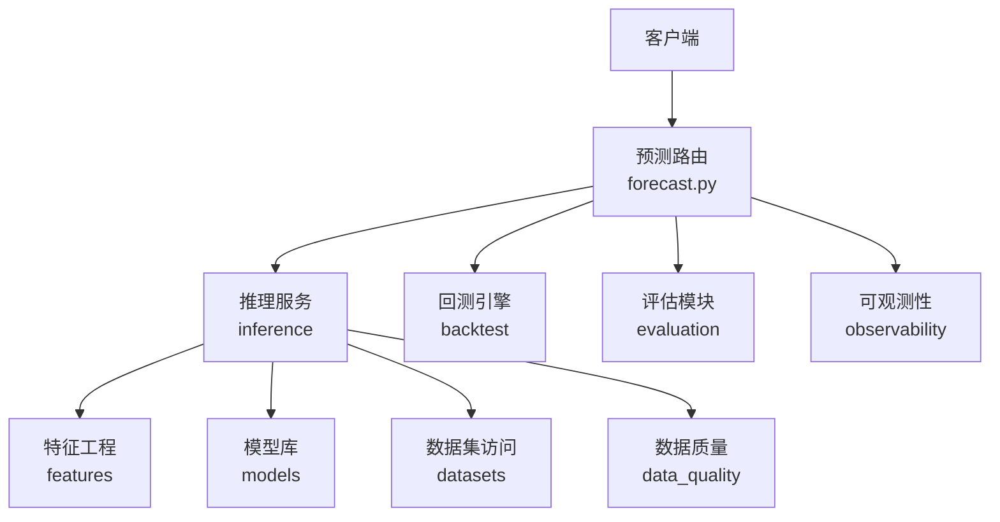
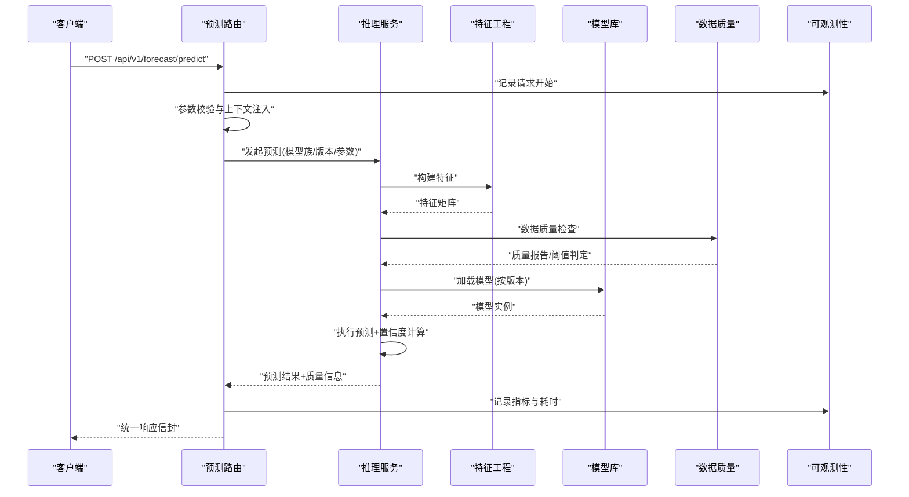
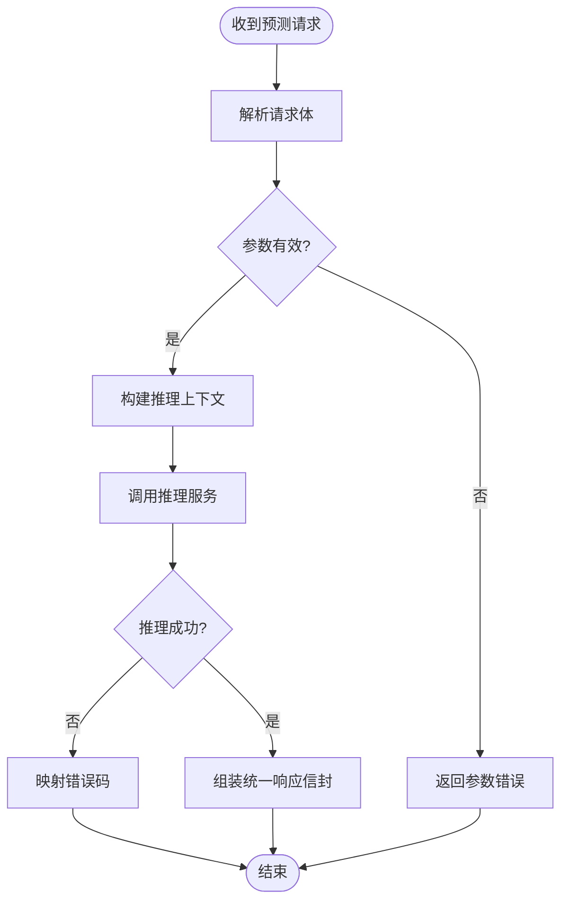
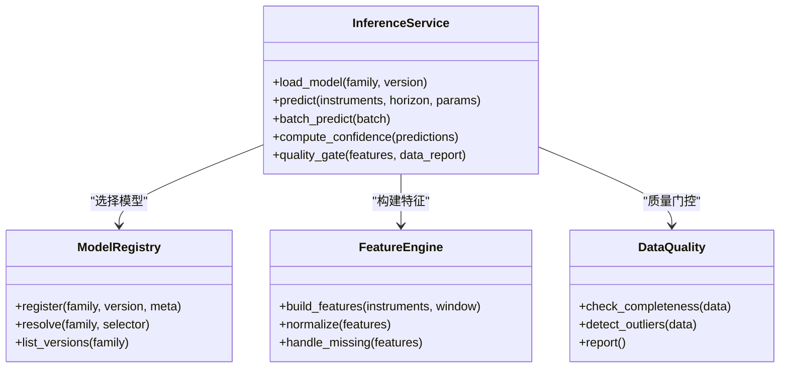
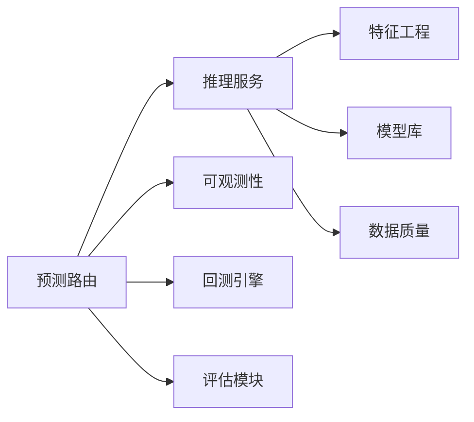

# 预测API

<cite>
**本文引用的文件**   
- [apps/api/routers/forecast.py](file://apps/api/routers/forecast.py)
- [apps/api/main.py](file://apps/api/main.py)
- [packages/inference/__init__.py](file://packages/inference/__init__.py)
- [packages/models/__init__.py](file://packages/models/__init__.py)
- [packages/backtest/__init__.py](file://packages/backtest/__init__.py)
- [packages/evaluation/__init__.py](file://packages/evaluation/__init__.py)
- [packages/features/__init__.py](file://packages/features/__init__.py)
- [packages/datasets/__init__.py](file://packages/datasets/__init__.py)
- [packages/data_quality/__init__.py](file://packages/data_quality/__init__.py)
- [packages/observability/__init__.py](file://packages/observability/__init__.py)
- [skills/cross-market-quant-research/references/model-families.md](file://skills/cross-market-quant-research/references/model-families.md)
- [skills/cross-market-quant-research/scripts/validate_forecast.py](file://skills/cross-market-quant-research/scripts/validate_forecast.py)
</cite>

## 目录
1. [简介](#简介)
2. [项目结构](#项目结构)
3. [核心组件](#核心组件)
4. [架构总览](#架构总览)
5. [详细组件分析](#详细组件分析)
6. [依赖关系分析](#依赖关系分析)
7. [性能考虑](#性能考虑)
8. [故障排查指南](#故障排查指南)
9. [结论](#结论)
10. [附录](#附录)

## 简介
本文件面向使用“AI驱动的预测模型”的开发者与策略研究员，提供完整的预测API文档。内容覆盖：
- 价格预测、趋势分析等能力
- 预测模型类型、参数配置与输出格式
- 批量预测、实时预测与回测验证的使用方法
- 置信度评估与质量控制机制
- 模型版本管理与A/B测试支持说明
- 实际调用示例与结果解读指南

## 项目结构
本项目采用分层与模块化组织方式：
- API层：基于FastAPI的路由定义，暴露REST接口
- 推理层：封装模型加载、特征工程、预测执行与结果序列化
- 数据与质量：数据集访问、特征计算、数据质量校验
- 回测与评估：历史回测流程与指标评估
- 可观测性：日志、指标与追踪

图表来源
- [apps/api/routers/forecast.py](file://apps/api/routers/forecast.py)
- [packages/inference/__init__.py](file://packages/inference/__init__.py)
- [packages/features/__init__.py](file://packages/features/__init__.py)
- [packages/models/__init__.py](file://packages/models/__init__.py)
- [packages/datasets/__init__.py](file://packages/datasets/__init__.py)
- [packages/data_quality/__init__.py](file://packages/data_quality/__init__.py)
- [packages/backtest/__init__.py](file://packages/backtest/__init__.py)
- [packages/evaluation/__init__.py](file://packages/evaluation/__init__.py)
- [packages/observability/__init__.py](file://packages/observability/__init__.py)

章节来源
- [apps/api/main.py](file://apps/api/main.py)
- [apps/api/routers/forecast.py](file://apps/api/routers/forecast.py)

## 核心组件
- 预测路由（Forecast Router）
  - 负责接收HTTP请求、参数校验、调度推理或回测任务、返回统一响应信封
  - 关键职责：鉴权/限流（可选）、输入校验、上下文注入、结果序列化、错误映射
- 推理服务（Inference Service）
  - 负责模型选择与加载、特征构建、预测执行、置信度计算、质量控制
  - 关键职责：模型注册表、版本路由、批处理优化、缓存策略
- 特征工程（Features）
  - 负责从原始数据到模型可用特征的转换，含缺失值处理、标准化、滚动窗口统计等
- 模型库（Models）
  - 管理模型族、权重、元数据与版本信息；支持多算法族（如树模型、时序模型、深度学习等）
- 数据集访问（Datasets）
  - 提供统一的数据读取接口，屏蔽底层存储差异（SQL/对象存储/消息队列）
- 数据质量（Data Quality）
  - 在预测前进行数据完整性、一致性、异常值检测，必要时触发告警或降级
- 回测与评估（Backtest & Evaluation）
  - 提供历史回测流水线与指标计算（如MAE、RMSE、方向准确率、夏普比率等）
- 可观测性（Observability）
  - 记录请求级指标、延迟、错误率、模型版本、数据质量事件等

章节来源
- [apps/api/routers/forecast.py](file://apps/api/routers/forecast.py)
- [packages/inference/__init__.py](file://packages/inference/__init__.py)
- [packages/features/__init__.py](file://packages/features/__init__.py)
- [packages/models/__init__.py](file://packages/models/__init__.py)
- [packages/datasets/__init__.py](file://packages/datasets/__init__.py)
- [packages/data_quality/__init__.py](file://packages/data_quality/__init__.py)
- [packages/backtest/__init__.py](file://packages/backtest/__init__.py)
- [packages/evaluation/__init__.py](file://packages/evaluation/__init__.py)
- [packages/observability/__init__.py](file://packages/observability/__init__.py)

## 架构总览
下图展示一次典型预测请求的处理路径：客户端通过REST接口进入路由层，路由层完成参数校验后调用推理服务；推理服务根据模型族与版本选择具体模型，结合特征工程与数据质量检查生成预测结果，并附带置信度与质量控制信息；最终返回给客户端。

图表来源
- [apps/api/routers/forecast.py](file://apps/api/routers/forecast.py)
- [packages/inference/__init__.py](file://packages/inference/__init__.py)
- [packages/features/__init__.py](file://packages/features/__init__.py)
- [packages/models/__init__.py](file://packages/models/__init__.py)
- [packages/data_quality/__init__.py](file://packages/data_quality/__init__.py)
- [packages/observability/__init__.py](file://packages/observability/__init__.py)

## 详细组件分析

### 预测路由（Forecast Router）
- 功能要点
  - 提供实时预测、批量预测、回测验证三类端点
  - 统一响应信封：包含状态码、业务码、数据体、元数据（模型版本、耗时、质量摘要）
  - 参数校验：标的标识、时间范围、预测步长、模型族/版本、置信水平等
- 关键流程
  - 解析请求体 -> 校验必填字段 -> 构造推理上下文 -> 调用推理服务 -> 组装响应
- 错误处理
  - 将下游异常映射为统一错误码与消息，便于客户端重试与降级

图表来源
- [apps/api/routers/forecast.py](file://apps/api/routers/forecast.py)

章节来源
- [apps/api/routers/forecast.py](file://apps/api/routers/forecast.py)

### 推理服务（Inference Service）
- 功能要点
  - 模型注册表：维护模型族、版本、权重位置、元数据
  - 版本路由：支持按版本号或标签（如latest、canary）选择模型
  - 批处理：对批量请求进行合并与并行化，提升吞吐
  - 置信度：输出区间估计或概率分布，供下游风控与决策使用
- 质量控制
  - 数据质量门控：缺失率、异常值、漂移检测
  - 模型健康检查：权重完整性、精度基线比对
- 缓存与降级
  - 热点标的/时间窗口的特征或结果缓存
  - 当质量不达标时，自动降级至保守策略或返回空预测并附原因

图表来源
- [packages/inference/__init__.py](file://packages/inference/__init__.py)
- [packages/models/__init__.py](file://packages/models/__init__.py)
- [packages/features/__init__.py](file://packages/features/__init__.py)
- [packages/data_quality/__init__.py](file://packages/data_quality/__init__.py)

章节来源
- [packages/inference/__init__.py](file://packages/inference/__init__.py)
- [packages/models/__init__.py](file://packages/models/__init__.py)
- [packages/features/__init__.py](file://packages/features/__init__.py)
- [packages/data_quality/__init__.py](file://packages/data_quality/__init__.py)

### 模型族与版本管理
- 模型族
  - 常见族包括：树模型（GBDT/XGBoost/LightGBM）、时序模型（ARIMA/Prophet类）、深度学习（LSTM/Transformer）
  - 不同族对应不同的特征需求与超参空间
- 版本管理
  - 每个模型具备唯一版本标识，支持灰度发布与回滚
  - 可通过标签（如stable、canary）进行A/B分流
- A/B测试
  - 路由层按流量比例分发到不同版本
  - 对比关键指标（误差、方向准确率、收益曲线）以评估新版本效果

章节来源
- [skills/cross-market-quant-research/references/model-families.md](file://skills/cross-market-quant-research/references/model-families.md)

### 批量预测与实时预测
- 实时预测
  - 单标的或少量标的的低延迟预测
  - 适合盘中交易信号生成
- 批量预测
  - 大批量标的或长预测窗口的离线/准实时预测
  - 支持分片与并发控制，避免资源争用
- 回测验证
  - 基于历史数据回放，评估模型稳定性与鲁棒性
  - 输出回测报告与指标，辅助模型上线决策

章节来源
- [apps/api/routers/forecast.py](file://apps/api/routers/forecast.py)
- [packages/backtest/__init__.py](file://packages/backtest/__init__.py)

### 置信度评估与质量控制
- 置信度
  - 区间预测（上下界）或概率分布（上涨/下跌概率）
  - 置信水平可配置（如90%、95%）
- 质量控制
  - 数据完整性、异常值、分布漂移检测
  - 模型健康检查（权重完整性、精度基线）
  - 质量不达标时的降级策略与告警

章节来源
- [packages/data_quality/__init__.py](file://packages/data_quality/__init__.py)
- [packages/observability/__init__.py](file://packages/observability/__init__.py)

### 回测与评估
- 回测流程
  - 数据准备 -> 特征构建 -> 模型预测 -> 交易规则模拟 -> 绩效统计
- 评估指标
  - 误差类：MAE、RMSE、MAPE
  - 方向类：方向准确率、Kappa系数
  - 风险收益：夏普比率、最大回撤、胜率
- 报告输出
  - 结构化JSON或表格，便于自动化归档与可视化

章节来源
- [packages/evaluation/__init__.py](file://packages/evaluation/__init__.py)
- [packages/backtest/__init__.py](file://packages/backtest/__init__.py)

### 实际调用示例与结果解读
- 实时预测示例
  - 请求：指定标的、预测步长、模型族/版本、置信水平
  - 响应：预测值、置信区间、质量摘要、模型版本、耗时
  - 解读：关注置信区间宽度与质量评分，窄区间且高质量更可靠
- 批量预测示例
  - 请求：标的列表、统一参数、分批大小
  - 响应：逐标的预测结果汇总、批次统计、失败明细
  - 解读：关注失败率与整体质量分布，定位异常标的
- 回测验证示例
  - 请求：回测起止时间、交易成本、滑点假设、评估指标
  - 响应：回测报告、指标曲线、敏感性分析
  - 解读：关注稳健性与过拟合迹象，结合样本外表现

章节来源
- [apps/api/routers/forecast.py](file://apps/api/routers/forecast.py)
- [skills/cross-market-quant-research/scripts/validate_forecast.py](file://skills/cross-market-quant-research/scripts/validate_forecast.py)

## 依赖关系分析
- 组件耦合
  - 路由层仅依赖推理服务与可观测性，保持低耦合
  - 推理服务聚合特征、模型、数据质量三个子系统
- 外部依赖
  - 数据存储（SQL/对象存储）
  - 监控与日志系统
  - 模型仓库（权重与元数据）

图表来源
- [apps/api/routers/forecast.py](file://apps/api/routers/forecast.py)
- [packages/inference/__init__.py](file://packages/inference/__init__.py)
- [packages/features/__init__.py](file://packages/features/__init__.py)
- [packages/models/__init__.py](file://packages/models/__init__.py)
- [packages/data_quality/__init__.py](file://packages/data_quality/__init__.py)
- [packages/backtest/__init__.py](file://packages/backtest/__init__.py)
- [packages/evaluation/__init__.py](file://packages/evaluation/__init__.py)
- [packages/observability/__init__.py](file://packages/observability/__init__.py)

章节来源
- [apps/api/main.py](file://apps/api/main.py)
- [apps/api/routers/forecast.py](file://apps/api/routers/forecast.py)

## 性能考虑
- 批处理与并发
  - 合理设置批次大小与并发度，平衡吞吐与延迟
- 缓存策略
  - 对热点标的与时间窗的特征/结果进行短期缓存
- 资源隔离
  - 不同模型族或版本可独立进程/线程池，避免相互影响
- 监控与告警
  - 跟踪P95/P99延迟、错误率、队列积压，及时扩容或降级

[本节为通用指导，无需代码来源]

## 故障排查指南
- 常见问题
  - 参数错误：检查必填字段、数据类型、取值范围
  - 数据质量问题：查看缺失率、异常值、漂移检测结果
  - 模型加载失败：确认版本存在、权重完整、权限正确
  - 超时与限流：调整批次大小、增加并发、优化特征计算
- 诊断步骤
  - 查看请求ID与链路追踪
  - 核对模型版本与元数据
  - 检查数据质量报告与质量门控阈值
  - 对比历史基线指标，定位回归问题

章节来源
- [packages/data_quality/__init__.py](file://packages/data_quality/__init__.py)
- [packages/observability/__init__.py](file://packages/observability/__init__.py)

## 结论
本预测API通过清晰的分层与模块化设计，提供了稳定可靠的实时与批量预测能力，并内置置信度评估与质量控制机制。配合模型版本管理与A/B测试，可在保证质量的前提下持续迭代模型。建议在生产环境完善监控与告警，建立严格的上线评审与回滚流程。

[本节为总结，无需代码来源]

## 附录
- 术语
  - 模型族：具有相似结构与训练范式的模型集合
  - 置信区间：在一定置信水平下预测值的上下界
  - 质量门控：基于数据与模型健康指标的准入/放行机制
- 参考规范
  - 模型族参考：[model-families.md](file://skills/cross-market-quant-research/references/model-families.md)
  - 预测结果校验脚本：[validate_forecast.py](file://skills/cross-market-quant-research/scripts/validate_forecast.py)