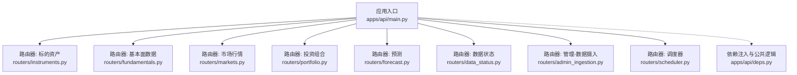
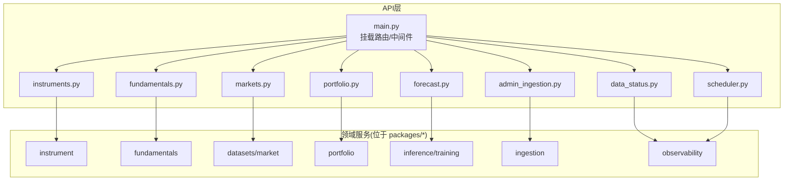
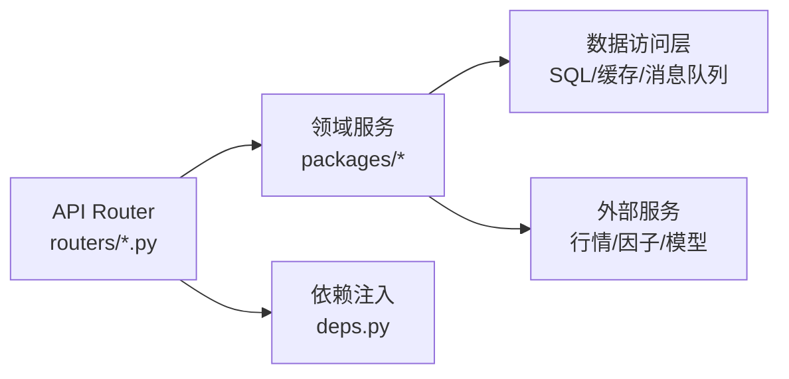

# API接口参考

<cite>
**本文引用的文件**   
- [apps/api/main.py](file://apps/api/main.py)
- [apps/api/routers/instruments.py](file://apps/api/routers/instruments.py)
- [apps/api/routers/fundamentals.py](file://apps/api/routers/fundamentals.py)
- [apps/api/routers/markets.py](file://apps/api/routers/markets.py)
- [apps/api/routers/portfolio.py](file://apps/api/routers/portfolio.py)
- [apps/api/routers/forecast.py](file://apps/api/routers/forecast.py)
- [apps/api/routers/data_status.py](file://apps/api/routers/data_status.py)
- [apps/api/routers/admin_ingestion.py](file://apps/api/routers/admin_ingestion.py)
- [apps/api/routers/scheduler.py](file://apps/api/routers/scheduler.py)
- [apps/api/deps.py](file://apps/api/deps.py)
</cite>

## 目录
1. [简介](#简介)
2. [项目结构](#项目结构)
3. [核心组件](#核心组件)
4. [架构总览](#架构总览)
5. [详细组件分析](#详细组件分析)
6. [依赖分析](#依赖分析)
7. [性能考虑](#性能考虑)
8. [故障排查指南](#故障排查指南)
9. [结论](#结论)
10. [附录](#附录)

## 简介
本文件为量化交易MCP系统的RESTful API接口参考，覆盖标的资产、投资组合、基本面数据、市场行情与预测等核心端点。文档包含HTTP方法与URL模式、请求/响应模式、认证与安全、速率限制、版本策略、常见用例、客户端实现建议、性能优化技巧、调试与监控方法，以及弃用迁移与向后兼容性说明。

## 项目结构
API服务基于模块化路由组织，入口挂载各功能域的路由器，统一处理异常、鉴权、限流与可观测性。

图表来源
- [apps/api/main.py](file://apps/api/main.py)
- [apps/api/routers/instruments.py](file://apps/api/routers/instruments.py)
- [apps/api/routers/fundamentals.py](file://apps/api/routers/fundamentals.py)
- [apps/api/routers/markets.py](file://apps/api/routers/markets.py)
- [apps/api/routers/portfolio.py](file://apps/api/routers/portfolio.py)
- [apps/api/routers/forecast.py](file://apps/api/routers/forecast.py)
- [apps/api/routers/data_status.py](file://apps/api/routers/data_status.py)
- [apps/api/routers/admin_ingestion.py](file://apps/api/routers/admin_ingestion.py)
- [apps/api/routers/scheduler.py](file://apps/api/routers/scheduler.py)
- [apps/api/deps.py](file://apps/api/deps.py)

章节来源
- [apps/api/main.py](file://apps/api/main.py)
- [apps/api/deps.py](file://apps/api/deps.py)

## 核心组件
- 应用入口与中间件：负责注册路由、全局异常处理、跨域、日志与指标上报。
- 路由器（按领域划分）：
  - 标的资产：查询与过滤标的信息。
  - 基本面数据：公司财务与事件事实。
  - 市场行情：K线、快照、盘口等行情数据。
  - 投资组合：组合定义、持仓、绩效与风险。
  - 预测：模型输出、回测结果与评分。
  - 数据状态：数据新鲜度、质量与健康检查。
  - 管理-数据摄入：触发或查看数据摄入任务。
  - 调度器：定时任务与批处理作业控制。
- 依赖注入：数据库连接、缓存、外部服务、配置与鉴权上下文。

章节来源
- [apps/api/main.py](file://apps/api/main.py)
- [apps/api/deps.py](file://apps/api/deps.py)

## 架构总览
整体采用“网关+领域路由”的轻量架构，API层仅做协议适配与编排，业务逻辑下沉至packages下的领域包。

图表来源
- [apps/api/main.py](file://apps/api/main.py)
- [apps/api/routers/instruments.py](file://apps/api/routers/instruments.py)
- [apps/api/routers/fundamentals.py](file://apps/api/routers/fundamentals.py)
- [apps/api/routers/markets.py](file://apps/api/routers/markets.py)
- [apps/api/routers/portfolio.py](file://apps/api/routers/portfolio.py)
- [apps/api/routers/forecast.py](file://apps/api/routers/forecast.py)
- [apps/api/routers/data_status.py](file://apps/api/routers/data_status.py)
- [apps/api/routers/admin_ingestion.py](file://apps/api/routers/admin_ingestion.py)
- [apps/api/routers/scheduler.py](file://apps/api/routers/scheduler.py)

## 详细组件分析

### 通用约定
- 基础路径：所有端点以统一前缀访问（例如 /api/v1）。
- 认证方式：默认使用请求头携带令牌进行鉴权；健康检查与公开元数据无需认证。
- 内容类型：请求与响应默认使用JSON。
- 分页：列表接口支持分页参数，返回包含页码、总数与数据数组的统一信封。
- 错误格式：统一错误体包含错误码、消息与可选详情。
- 时间与时区：时间戳使用ISO 8601字符串，时区为UTC。
- 幂等性：GET为幂等；POST/PUT/PATCH需客户端保证幂等键（如Idempotency-Key）。

章节来源
- [apps/api/main.py](file://apps/api/main.py)
- [apps/api/deps.py](file://apps/api/deps.py)

### 标的资产（Instruments）
- 能力概述：查询标的清单、筛选与详情。
- 典型端点
  - GET /api/v1/instruments
    - 查询参数：市场、行业、上市状态、关键词、分页等。
    - 响应：分页对象，包含标的ID、名称、代码、交易所、状态等字段。
  - GET /api/v1/instruments/{instrument_id}
    - 路径参数：instrument_id
    - 响应：标的详细信息与扩展属性。
- 错误处理
  - 404：标的不存在
  - 422：参数校验失败
- 示例
  - 请求：GET /api/v1/instruments?market=CN&limit=20
  - 响应：{ "items": [...], "page": 1, "total": 123 }

章节来源
- [apps/api/routers/instruments.py](file://apps/api/routers/instruments.py)

### 基本面数据（Fundamentals）
- 能力概述：获取公司财务指标、公告事件与事实表。
- 典型端点
  - GET /api/v1/fundamentals/{instrument_id}
    - 查询参数：报告期、指标集合、是否复权等。
    - 响应：指标键值对或结构化报表。
  - POST /api/v1/fundamentals/query
    - 请求体：批量查询条件（多标的、多期、多指标）。
    - 响应：聚合后的数据集。
- 错误处理
  - 404：无对应财报或标的
  - 422：日期范围或指标非法
- 示例
  - 请求：GET /api/v1/fundamentals/AAPL?period=Q&fields=revenue,net_income
  - 响应：{ "AAPL": { "revenue": ..., "net_income": ... } }

章节来源
- [apps/api/routers/fundamentals.py](file://apps/api/routers/fundamentals.py)

### 市场行情（Markets）
- 能力概述：提供K线、快照、盘口与成交明细等行情数据。
- 典型端点
  - GET /api/v1/markets/bars
    - 查询参数：instrument_id、频率（1m/5m/1d）、起止时间、复权标志、分页。
    - 响应：K线数组，含开高低收量等字段。
  - GET /api/v1/markets/snapshot
    - 查询参数：instrument_id
    - 响应：最新价、买卖盘、成交量等快照。
  - GET /api/v1/markets/trades
    - 查询参数：instrument_id、起止时间、分页。
    - 响应：逐笔成交序列。
- 错误处理
  - 404：标的或时段无数据
  - 422：时间范围非法或频率不支持
- 示例
  - 请求：GET /api/v1/markets/bars?instrument_id=000001.SZ&freq=1d&start=2024-01-01T00:00:00Z&end=2024-01-31T23:59:59Z
  - 响应：{ "bars": [...] }

章节来源
- [apps/api/routers/markets.py](file://apps/api/routers/markets.py)

### 投资组合（Portfolio）
- 能力概述：组合定义、持仓、净值与风险指标。
- 典型端点
  - GET /api/v1/portfolios
    - 查询参数：所有者、标签、状态、分页。
    - 响应：组合列表。
  - GET /api/v1/portfolios/{portfolio_id}
    - 响应：组合基本信息与统计摘要。
  - GET /api/v1/portfolios/{portfolio_id}/holdings
    - 查询参数：日期、是否包含未平仓。
    - 响应：持仓明细。
  - GET /api/v1/portfolios/{portfolio_id}/performance
    - 查询参数：起止时间、基准、指标集合。
    - 响应：收益曲线与风险指标。
- 错误处理
  - 404：组合不存在
  - 403：无权限访问
  - 422：时间范围或指标非法
- 示例
  - 请求：GET /api/v1/portfolios/pf_001/performance?start=2024-01-01&end=2024-12-31
  - 响应：{ "returns": [...], "risk_metrics": { "sharpe": ..., "max_drawdown": ... } }

章节来源
- [apps/api/routers/portfolio.py](file://apps/api/routers/portfolio.py)

### 预测（Forecast）
- 能力概述：模型预测、评分与回测报告。
- 典型端点
  - GET /api/v1/forecasts
    - 查询参数：标的、模型族、预测周期、阈值、分页。
    - 响应：预测条目列表。
  - GET /api/v1/forecasts/{forecast_id}
    - 响应：预测详情与置信区间。
  - POST /api/v1/forecasts/run
    - 请求体：触发离线预测任务（标的集、模型、窗口）。
    - 响应：任务ID与状态查询地址。
- 错误处理
  - 404：预测记录不存在
  - 422：模型或参数不合法
- 示例
  - 请求：POST /api/v1/forecasts/run
  - 响应：{ "task_id": "abc123", "status_url": "/api/v1/forecasts/tasks/abc123" }

章节来源
- [apps/api/routers/forecast.py](file://apps/api/routers/forecast.py)

### 数据状态（Data Status）
- 能力概述：数据新鲜度、质量与健康检查。
- 典型端点
  - GET /api/v1/status
    - 响应：系统健康、依赖服务状态、关键指标摘要。
  - GET /api/v1/data/freshness
    - 查询参数：数据域（markets/fundamentals等）。
    - 响应：各域最新更新时间与延迟。
- 错误处理
  - 503：依赖不可用
- 示例
  - 请求：GET /api/v1/data/freshness?domains=markets,fundamentals
  - 响应：{ "markets": { "latest": "2024-06-01T12:00:00Z", "lag_seconds": 12 }, "fundamentals": { ... } }

章节来源
- [apps/api/routers/data_status.py](file://apps/api/routers/data_status.py)

### 管理-数据摄入（Admin Ingestion）
- 能力概述：触发或查看数据摄入任务。
- 典型端点
  - POST /api/v1/admin/ingest
    - 请求体：数据源、标的范围、时间窗口、策略选项。
    - 响应：任务ID与状态查询地址。
  - GET /api/v1/admin/ingest/{task_id}
    - 响应：任务进度、日志摘要与结果。
- 错误处理
  - 403：无管理员权限
  - 422：参数非法
- 示例
  - 请求：POST /api/v1/admin/ingest
  - 响应：{ "task_id": "ing_001", "status_url": "/api/v1/admin/ingest/ing_001" }

章节来源
- [apps/api/routers/admin_ingestion.py](file://apps/api/routers/admin_ingestion.py)

### 调度器（Scheduler）
- 能力概述：定时任务与批处理作业的控制与监控。
- 典型端点
  - GET /api/v1/scheduler/jobs
    - 响应：任务清单与状态。
  - POST /api/v1/scheduler/jobs/{job_id}/run
    - 响应：立即执行结果或排队确认。
  - GET /api/v1/scheduler/jobs/{job_id}/runs
    - 响应：历史运行记录与耗时。
- 错误处理
  - 404：任务不存在
  - 409：任务正在运行
- 示例
  - 请求：POST /api/v1/scheduler/jobs/daily_rebalance/run
  - 响应：{ "run_id": "r_123", "status": "queued" }

章节来源
- [apps/api/routers/scheduler.py](file://apps/api/routers/scheduler.py)

### 认证与安全
- 认证方式
  - 默认使用请求头携带令牌（例如 Authorization: Bearer <token>）。
  - 健康检查与公开元数据无需认证。
- 授权模型
  - 基于角色的访问控制（RBAC），不同角色拥有不同资源访问权限。
- 安全建议
  - 强制HTTPS传输。
  - 令牌短期有效并支持刷新。
  - 敏感操作启用二次确认与审计日志。

章节来源
- [apps/api/deps.py](file://apps/api/deps.py)

### 速率限制
- 限制维度
  - 按用户/租户与IP双维度限制。
  - 针对重计算端点（如预测、回测）设置更严格配额。
- 响应头
  - X-RateLimit-Limit：配额上限
  - X-RateLimit-Remaining：剩余次数
  - X-RateLimit-Reset：重置时间
- 超限处理
  - 返回429 Too Many Requests，并在Retry-After中给出重试秒数。

章节来源
- [apps/api/main.py](file://apps/api/main.py)

### 版本策略与向后兼容
- 版本前缀：/api/v1
- 变更原则
  - 新增字段保持向后兼容。
  - 废弃字段保留至少两个大版本。
  - 破坏性变更通过新版本前缀发布。
- 弃用通知
  - 响应头X-API-Deprecation与Sunset日期提示。

章节来源
- [apps/api/main.py](file://apps/api/main.py)

## 依赖分析
API层依赖领域服务与基础设施，遵循低耦合高内聚原则。

图表来源
- [apps/api/routers/instruments.py](file://apps/api/routers/instruments.py)
- [apps/api/routers/fundamentals.py](file://apps/api/routers/fundamentals.py)
- [apps/api/routers/markets.py](file://apps/api/routers/markets.py)
- [apps/api/routers/portfolio.py](file://apps/api/routers/portfolio.py)
- [apps/api/routers/forecast.py](file://apps/api/routers/forecast.py)
- [apps/api/routers/data_status.py](file://apps/api/routers/data_status.py)
- [apps/api/routers/admin_ingestion.py](file://apps/api/routers/admin_ingestion.py)
- [apps/api/routers/scheduler.py](file://apps/api/routers/scheduler.py)
- [apps/api/deps.py](file://apps/api/deps.py)

章节来源
- [apps/api/main.py](file://apps/api/main.py)
- [apps/api/deps.py](file://apps/api/deps.py)

## 性能考虑
- 分页与游标：大数据集必须分页，优先使用游标避免深翻页。
- 缓存策略：热点行情与静态字典数据使用缓存层，设置合理TTL。
- 压缩：开启GZIP/Br压缩减少带宽。
- 并发与超时：合理设置I/O超时与连接池大小，避免雪崩。
- 异步任务：长耗时操作（预测、回测、数据摄入）走异步任务队列。
- 索引与投影：后端按查询条件建立索引，只返回必要字段。

[本节为通用指导，不直接分析具体文件]

## 故障排查指南
- 快速定位
  - 使用 /api/v1/status 与 /api/v1/data/freshness 检查系统与数据健康。
  - 关注响应头中的速率限制与错误码。
- 常见问题
  - 401/403：检查令牌有效期与权限范围。
  - 422：核对参数类型、枚举值与时间范围。
  - 429：降低请求频率或申请更高配额。
  - 500/503：查看服务端日志与依赖服务状态。
- 调试工具
  - 启用调试日志与Trace ID透传。
  - 使用Prometheus/Grafana监控关键指标（QPS、P99延迟、错误率）。
- 审计与追踪
  - 关键操作写入审计日志，便于回溯。

章节来源
- [apps/api/routers/data_status.py](file://apps/api/routers/data_status.py)
- [apps/api/main.py](file://apps/api/main.py)

## 结论
本API参考覆盖了量化交易MCP系统的核心接口与最佳实践。通过统一的认证、限流、错误与版本策略，结合清晰的领域路由设计，系统具备良好的可扩展性与可维护性。建议在生产环境启用全链路监控与审计，并结合缓存与异步化提升吞吐与稳定性。

[本节为总结性内容，不直接分析具体文件]

## 附录

### 常见用例
- 获取某标的近一月日频K线并进行简单趋势判断。
- 批量拉取多标的基本面指标用于因子构建。
- 创建投资组合并定期更新持仓与绩效。
- 触发离线预测任务并轮询结果。

### 客户端实现指南
- 使用HTTP客户端库自动处理重试与退避。
- 解析统一错误信封，区分可重试与不可重试错误。
- 实现本地缓存与去重，避免重复请求。
- 在调用前附加认证令牌与幂等键。

### 已弃用功能迁移指南
- 旧版前缀 /api/v0 将在下个主版本移除，请迁移至 /api/v1。
- 字段名变更：旧字段将保留至v2，新字段命名遵循小写下划线风格。
- 行为变更：预测任务从同步返回改为异步任务，请使用任务查询接口。

[本节为通用指导，不直接分析具体文件]