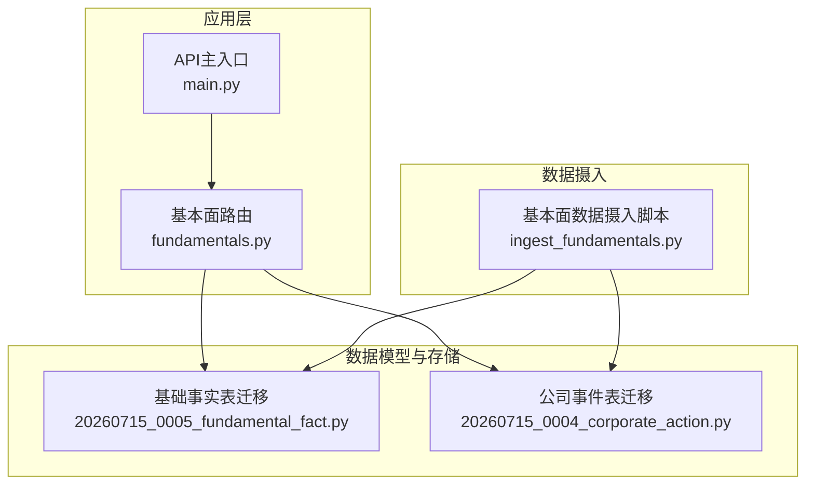
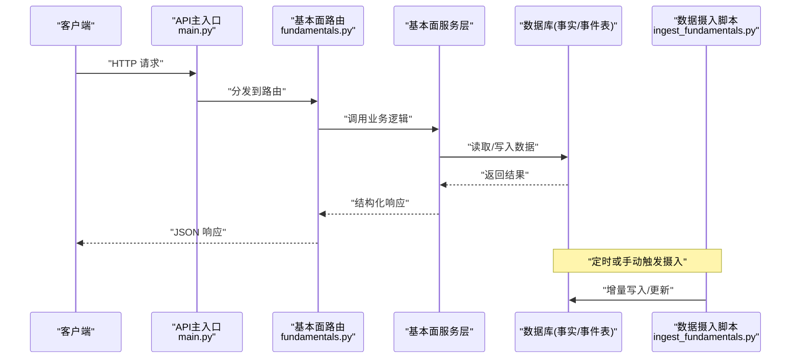
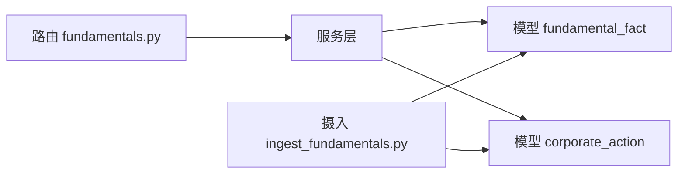
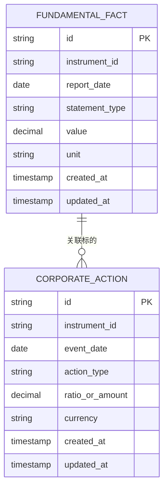

# 基本面数据API

<cite>
**本文引用的文件**   
- [apps/api/routers/fundamentals.py](file://apps/api/routers/fundamentals.py)
- [apps/api/main.py](file://apps/api/main.py)
- [packages/fundamentals/](file://packages/fundamentals/)
- [sql/migrations/20260715_0005_fundamental_fact.py](file://sql/migrations/20260715_0005_fundamental_fact.py)
- [sql/migrations/20260715_0004_corporate_action.py](file://sql/migrations/20260715_0004_corporate_action.py)
- [scripts/ingest_fundamentals.py](file://scripts/ingest_fundamentals.py)
</cite>

## 目录
1. [简介](#简介)
2. [项目结构](#项目结构)
3. [核心组件](#核心组件)
4. [架构总览](#架构总览)
5. [详细组件分析](#详细组件分析)
6. [依赖关系分析](#依赖关系分析)
7. [性能考虑](#性能考虑)
8. [故障排查指南](#故障排查指南)
9. [结论](#结论)
10. [附录](#附录)

## 简介
本文件为“基本面数据模块”的RESTful API文档，覆盖财务数据、公司事件与估值指标等能力。重点包括：
- 财务报表数据接口（利润表、资产负债表、现金流量表及关键比率）
- 分红送股处理与股票拆分事件查询
- 时间序列数据处理、数据质量验证与增量更新机制
- 面向基本面分析、因子构建与投资决策的应用示例

## 项目结构
本项目采用模块化组织方式，基本面相关API位于应用层路由中，底层数据模型与迁移脚本位于SQL迁移目录，数据摄入脚本位于scripts目录。

图表来源
- [apps/api/main.py](file://apps/api/main.py)
- [apps/api/routers/fundamentals.py](file://apps/api/routers/fundamentals.py)
- [sql/migrations/20260715_0005_fundamental_fact.py](file://sql/migrations/20260715_0005_fundamental_fact.py)
- [sql/migrations/20260715_0004_corporate_action.py](file://sql/migrations/20260715_0004_corporate_action.py)
- [scripts/ingest_fundamentals.py](file://scripts/ingest_fundamentals.py)

章节来源
- [apps/api/main.py](file://apps/api/main.py)
- [apps/api/routers/fundamentals.py](file://apps/api/routers/fundamentals.py)
- [sql/migrations/20260715_0005_fundamental_fact.py](file://sql/migrations/20260715_0005_fundamental_fact.py)
- [sql/migrations/20260715_0004_corporate_action.py](file://sql/migrations/20260715_0004_corporate_action.py)
- [scripts/ingest_fundamentals.py](file://scripts/ingest_fundamentals.py)

## 核心组件
- 基本面路由：提供财务数据与公司事件的HTTP端点，负责参数校验、调用服务层、返回统一响应格式。
- 数据模型：以“基础事实表”和“公司事件表”为核心，支撑报表、比率、分红送股与拆合股等数据。
- 数据摄入：通过脚本将外部源数据清洗、对齐后写入数据库，支持增量更新。

章节来源
- [apps/api/routers/fundamentals.py](file://apps/api/routers/fundamentals.py)
- [sql/migrations/20260715_0005_fundamental_fact.py](file://sql/migrations/20260715_0005_fundamental_fact.py)
- [sql/migrations/20260715_0004_corporate_action.py](file://sql/migrations/20260715_0004_corporate_action.py)
- [scripts/ingest_fundamentals.py](file://scripts/ingest_fundamentals.py)

## 架构总览
下图展示了客户端请求到数据存储的整体流程，以及基本面数据摄入路径。

图表来源
- [apps/api/main.py](file://apps/api/main.py)
- [apps/api/routers/fundamentals.py](file://apps/api/routers/fundamentals.py)
- [scripts/ingest_fundamentals.py](file://scripts/ingest_fundamentals.py)
- [sql/migrations/20260715_0005_fundamental_fact.py](file://sql/migrations/20260715_0005_fundamental_fact.py)
- [sql/migrations/20260715_0004_corporate_action.py](file://sql/migrations/20260715_0004_corporate_action.py)

## 详细组件分析

### 财务报表数据接口
- 功能范围
  - 按标的与报告期获取三大报表数据（利润表、资产负债表、现金流量表）
  - 获取关键财务比率（盈利能力、偿债能力、运营效率等）
  - 支持时间窗口过滤、排序与分页
- 典型请求参数
  - 标的标识、报告期起止、字段白名单、排序与分页参数
- 响应结构
  - 统一信封：包含数据列表、元信息（分页、统计）、错误码与消息
- 数据质量与一致性
  - 缺失值标记、异常值阈值告警、口径说明（如是否经审计）
- 增量更新
  - 基于报告期的幂等写入，重复提交不产生重复记录

章节来源
- [apps/api/routers/fundamentals.py](file://apps/api/routers/fundamentals.py)
- [sql/migrations/20260715_0005_fundamental_fact.py](file://sql/migrations/20260715_0005_fundamental_fact.py)

### 公司事件接口（分红送股与股票拆分）
- 功能范围
  - 查询分红、送股、拆合股等公司事件
  - 支持事件生效日、类型筛选与前后复权计算参考
- 典型请求参数
  - 标的标识、事件类型、生效日期范围
- 响应结构
  - 事件明细列表，含事件类型、比例/金额、生效日、公告日等
- 数据质量
  - 事件冲突检测（同日多事件）、比例合理性校验

章节来源
- [apps/api/routers/fundamentals.py](file://apps/api/routers/fundamentals.py)
- [sql/migrations/20260715_0004_corporate_action.py](file://sql/migrations/20260715_0004_corporate_action.py)

### 估值指标接口
- 功能范围
  - 提供常用估值指标（PE、PB、PS、EV/EBITDA等）的时间序列
  - 支持滚动窗口与同比/环比计算
- 典型请求参数
  - 标的标识、指标名称、时间窗口、计算频率
- 响应结构
  - 时间序列数组，附带指标定义与单位说明

章节来源
- [apps/api/routers/fundamentals.py](file://apps/api/routers/fundamentals.py)
- [sql/migrations/20260715_0005_fundamental_fact.py](file://sql/migrations/20260715_0005_fundamental_fact.py)

### 时间序列数据处理与数据质量验证
- 时间序列处理
  - 缺失值插补策略、异常值检测、重采样与对齐
- 数据质量验证
  - 完整性检查、一致性校验、跨源比对与差异报告
- 可视化与诊断
  - 质量评分、问题清单与修复建议

章节来源
- [apps/api/routers/fundamentals.py](file://apps/api/routers/fundamentals.py)

### 增量更新机制
- 触发方式
  - 定时任务或手动调用摄入脚本
- 更新策略
  - 基于主键与时间戳的幂等写入，支持部分字段更新
- 回滚与重试
  - 失败重试、事务边界与补偿日志

章节来源
- [scripts/ingest_fundamentals.py](file://scripts/ingest_fundamentals.py)
- [sql/migrations/20260715_0005_fundamental_fact.py](file://sql/migrations/20260715_0005_fundamental_fact.py)
- [sql/migrations/20260715_0004_corporate_action.py](file://sql/migrations/20260715_0004_corporate_action.py)

### 应用示例
- 基本面分析
  - 拉取某标的近N期财报与比率，进行趋势分析与同业对比
- 因子构建
  - 基于估值指标与财务比率构造横截面因子，结合时间序列平滑
- 投资决策
  - 结合公司事件（分红、拆分）调整价格序列，提升回测准确性

章节来源
- [apps/api/routers/fundamentals.py](file://apps/api/routers/fundamentals.py)

## 依赖关系分析
- 路由与服务层解耦：路由仅负责HTTP协议适配与参数校验，业务逻辑下沉至服务层
- 数据模型驱动：所有读写均围绕“基础事实表”和“公司事件表”展开，保证一致性与可演进性
- 摄入与查询分离：摄入脚本独立于API，避免写入阻塞读取

图表来源
- [apps/api/routers/fundamentals.py](file://apps/api/routers/fundamentals.py)
- [sql/migrations/20260715_0005_fundamental_fact.py](file://sql/migrations/20260715_0005_fundamental_fact.py)
- [sql/migrations/20260715_0004_corporate_action.py](file://sql/migrations/20260715_0004_corporate_action.py)
- [scripts/ingest_fundamentals.py](file://scripts/ingest_fundamentals.py)

章节来源
- [apps/api/routers/fundamentals.py](file://apps/api/routers/fundamentals.py)
- [sql/migrations/20260715_0005_fundamental_fact.py](file://sql/migrations/20260715_0005_fundamental_fact.py)
- [sql/migrations/20260715_0004_corporate_action.py](file://sql/migrations/20260715_0004_corporate_action.py)
- [scripts/ingest_fundamentals.py](file://scripts/ingest_fundamentals.py)

## 性能考虑
- 索引设计：对标的标识、报告期、事件类型建立复合索引，加速范围查询
- 分页与裁剪：默认限制返回条数，支持字段裁剪减少网络传输
- 缓存策略：热点指标可引入缓存层，降低数据库压力
- 批量写入：摄入阶段使用批量插入与事务合并，提高吞吐

[本节为通用指导，无需源码引用]

## 故障排查指南
- 常见问题
  - 参数校验失败：检查必填字段、数据类型与取值范围
  - 数据缺失：确认报告期是否已摄入，核对时间窗口
  - 事件冲突：同日多事件需人工复核并选择权威源
- 定位方法
  - 查看统一响应的错误码与消息
  - 核对摄入日志与数据库变更记录
  - 使用数据质量报告定位异常值与缺失项

章节来源
- [apps/api/routers/fundamentals.py](file://apps/api/routers/fundamentals.py)
- [scripts/ingest_fundamentals.py](file://scripts/ingest_fundamentals.py)

## 结论
本API围绕“基础事实表”和“公司事件表”提供稳定的基本面数据服务能力，覆盖财报、比率、公司事件与估值指标等核心场景。通过时间序列处理与数据质量验证，配合增量摄入机制，可满足研究、因子构建与投资决策等多类需求。

[本节为总结性内容，无需源码引用]

## 附录

### 数据模型概览

图表来源
- [sql/migrations/20260715_0005_fundamental_fact.py](file://sql/migrations/20260715_0005_fundamental_fact.py)
- [sql/migrations/20260715_0004_corporate_action.py](file://sql/migrations/20260715_0004_corporate_action.py)