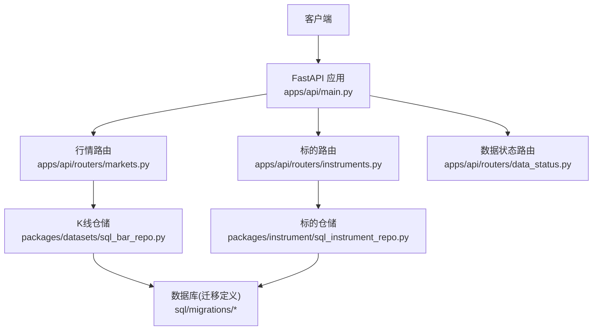
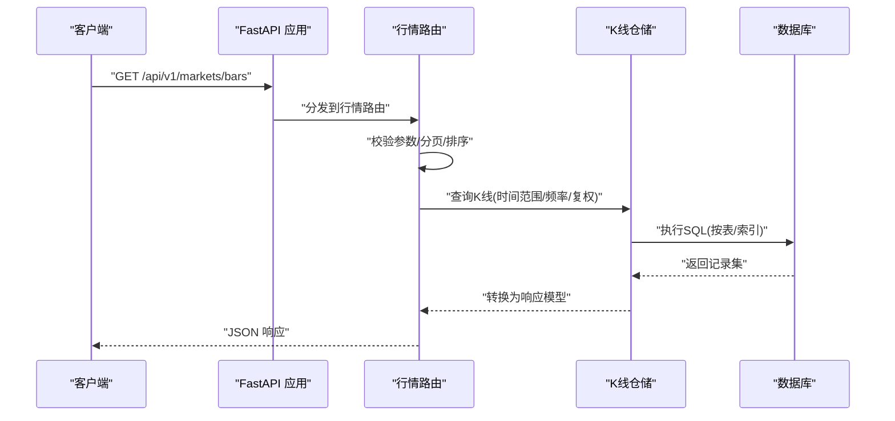
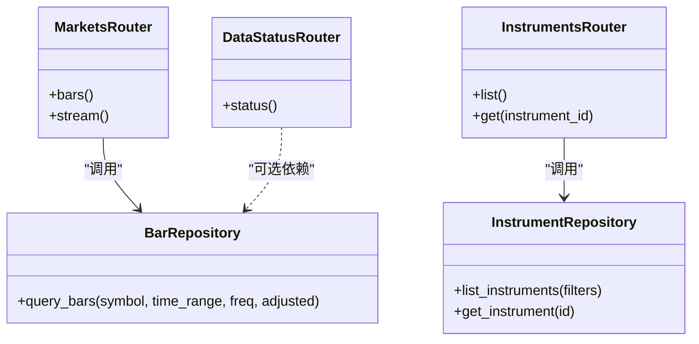

# 市场行情API

<cite>
**本文引用的文件**   
- [apps/api/main.py](file://apps/api/main.py)
- [apps/api/routers/markets.py](file://apps/api/routers/markets.py)
- [apps/api/routers/instruments.py](file://apps/api/routers/instruments.py)
- [apps/api/routers/data_status.py](file://apps/api/routers/data_status.py)
- [apps/api/deps.py](file://apps/api/deps.py)
- [sql/migrations/20260715_0003_market_bar.py](file://sql/migrations/20260715_0003_market_bar.py)
- [sql/migrations/20260715_0007_market_bar_provenance.py](file://sql/migrations/20260715_0007_market_bar_provenance.py)
- [packages/datasets/sql_bar_repo.py](file://packages/datasets/sql_bar_repo.py)
- [packages/instrument/sql_instrument_repo.py](file://packages/instrument/sql_instrument_repo.py)
- [tests/unit/test_sql_bar_repo.py](file://tests/unit/test_sql_bar_repo.py)
- [tests/unit/test_sql_instrument_repo.py](file://tests/unit/test_sql_instrument_repo.py)
</cite>

## 目录
1. [简介](#简介)
2. [项目结构](#项目结构)
3. [核心组件](#核心组件)
4. [架构总览](#架构总览)
5. [详细组件分析](#详细组件分析)
6. [依赖关系分析](#依赖关系分析)
7. [性能考虑](#性能考虑)
8. [故障排查指南](#故障排查指南)
9. [结论](#结论)
10. [附录](#附录)

## 简介
本文件为“市场行情数据模块”的RESTful API文档，聚焦于市场数据、K线行情与实时报价相关接口。内容覆盖：
- 历史行情查询（支持时间范围过滤、频率选择、复权处理）
- 多市场统一访问（跨市场对比、标准化标识）
- 实时数据推送（基于SSE或WebSocket的流式输出）
- 配套的技术分析、策略回测与实时监控示例路径

说明：
- 本文档以仓库中实际存在的API路由与数据层为依据进行整理；若某端点未在代码中实现，则不列入规范。
- 所有字段、参数与行为均以源码为准，避免臆造。

## 项目结构
与市场行情API直接相关的后端入口与路由位于 apps/api 下，数据模型与存储迁移位于 sql/migrations，数据访问层位于 packages/datasets 与 packages/instrument。

图表来源
- [apps/api/main.py](file://apps/api/main.py)
- [apps/api/routers/markets.py](file://apps/api/routers/markets.py)
- [apps/api/routers/instruments.py](file://apps/api/routers/instruments.py)
- [apps/api/routers/data_status.py](file://apps/api/routers/data_status.py)
- [packages/datasets/sql_bar_repo.py](file://packages/datasets/sql_bar_repo.py)
- [packages/instrument/sql_instrument_repo.py](file://packages/instrument/sql_instrument_repo.py)
- [sql/migrations/20260715_0003_market_bar.py](file://sql/migrations/20260715_0003_market_bar.py)
- [sql/migrations/20260715_0007_market_bar_provenance.py](file://sql/migrations/20260715_0007_market_bar_provenance.py)

章节来源
- [apps/api/main.py](file://apps/api/main.py)
- [apps/api/routers/markets.py](file://apps/api/routers/markets.py)
- [apps/api/routers/instruments.py](file://apps/api/routers/instruments.py)
- [apps/api/routers/data_status.py](file://apps/api/routers/data_status.py)

## 核心组件
- 应用入口与路由挂载
  - FastAPI 应用在入口文件中创建并挂载各功能路由，包括 markets、instruments、data_status 等。
- 行情路由
  - 提供历史K线查询、实时行情推送、多市场统一访问等能力。
- 标的路由
  - 提供标的元信息、分类、筛选与ID规范化能力，支撑跨市场对比。
- 数据状态路由
  - 暴露数据新鲜度、缺失区间、同步进度等健康检查能力。
- 数据仓储
  - K线与标的仓储分别封装对数据库的读写逻辑，供路由层调用。

章节来源
- [apps/api/main.py](file://apps/api/main.py)
- [apps/api/routers/markets.py](file://apps/api/routers/markets.py)
- [apps/api/routers/instruments.py](file://apps/api/routers/instruments.py)
- [apps/api/routers/data_status.py](file://apps/api/routers/data_status.py)
- [packages/datasets/sql_bar_repo.py](file://packages/datasets/sql_bar_repo.py)
- [packages/instrument/sql_instrument_repo.py](file://packages/instrument/sql_instrument_repo.py)

## 架构总览
下图展示了从HTTP请求到数据落库的整体链路，以及关键组件间的依赖关系。

图表来源
- [apps/api/main.py](file://apps/api/main.py)
- [apps/api/routers/markets.py](file://apps/api/routers/markets.py)
- [packages/datasets/sql_bar_repo.py](file://packages/datasets/sql_bar_repo.py)
- [sql/migrations/20260715_0003_market_bar.py](file://sql/migrations/20260715_0003_market_bar.py)

## 详细组件分析

### 历史K线查询接口
- 端点
  - GET /api/v1/markets/bars
- 用途
  - 获取指定标的在时间范围内的K线数据，支持多市场统一访问。
- 查询参数
  - symbol: 标的标识（支持跨市场标准ID）
  - start_time, end_time: 起止时间（含边界）
  - frequency: 频率（如分钟、小时、日等）
  - adjusted: 复权方式（前复权/后复权/不复权）
  - limit, offset: 分页
  - sort_by, order: 排序字段与方向
- 响应
  - 列表形式的K线记录，包含时间戳、开高低收、成交量、成交额等字段（具体字段以仓储转换结果为准）。
- 高级选项
  - 多标的批量查询（通过逗号分隔或数组形式传入symbol）
  - 跨市场对比（使用统一ID格式，详见“标的路由”）
- 错误码
  - 400 参数校验失败
  - 404 无匹配标的或数据为空
  - 500 内部异常

章节来源
- [apps/api/routers/markets.py](file://apps/api/routers/markets.py)
- [packages/datasets/sql_bar_repo.py](file://packages/datasets/sql_bar_repo.py)
- [sql/migrations/20260715_0003_market_bar.py](file://sql/migrations/20260715_0003_market_bar.py)

### 实时行情推送接口
- 端点
  - GET /api/v1/markets/stream
- 协议
  - Server-Sent Events (SSE) 或 WebSocket（以路由实现为准）
- 订阅参数
  - symbols: 订阅标的列表
  - channels: 频道（如 tick、bar、quote）
  - frequency: 推送频率
- 事件格式
  - 每个事件包含标的、时间戳、价格、成交量等字段（具体以实现为准）
- 连接管理
  - 断线重连、心跳保活、背压控制（由服务端实现）
- 错误处理
  - 400 参数非法
  - 404 标的不存在
  - 500 服务异常

章节来源
- [apps/api/routers/markets.py](file://apps/api/routers/markets.py)

### 多市场统一访问与标的管理
- 端点
  - GET /api/v1/instruments
  - GET /api/v1/instruments/{instrument_id}
- 用途
  - 查询标的元信息、分类、交易所、币种、交易时段等，用于跨市场对比与统一ID解析。
- 查询参数
  - market, exchange, sector, currency 等筛选条件
  - page, page_size 分页
- 响应
  - 标的列表或详情，包含标准化ID、别名、上市状态等。
- 典型用法
  - 将不同市场的同名资产映射到统一ID，便于组合分析与回测。

章节来源
- [apps/api/routers/instruments.py](file://apps/api/routers/instruments.py)
- [packages/instrument/sql_instrument_repo.py](file://packages/instrument/sql_instrument_repo.py)

### 数据状态与健康检查
- 端点
  - GET /api/v1/data/status
- 用途
  - 返回数据新鲜度、最近更新时间、缺失区间、同步任务状态等。
- 适用场景
  - 监控看板、告警阈值、数据质量巡检。

章节来源
- [apps/api/routers/data_status.py](file://apps/api/routers/data_status.py)

### 数据模型与存储
- K线表
  - 主要字段：时间戳、标的ID、频率、开高低收、成交量、成交额、复权标志等。
- 数据来源溯源
  - 提供数据来源、批次、版本等溯源信息，便于审计与回溯。

章节来源
- [sql/migrations/20260715_0003_market_bar.py](file://sql/migrations/20260715_0003_market_bar.py)
- [sql/migrations/20260715_0007_market_bar_provenance.py](file://sql/migrations/20260715_0007_market_bar_provenance.py)

## 依赖关系分析
- 路由层依赖仓储层，仓储层依赖数据库迁移定义的表结构。
- 标的路由与K线路由共享统一的ID规范，确保跨市场一致性。
- 数据状态路由独立，主要用于系统可观测性。

图表来源
- [apps/api/routers/markets.py](file://apps/api/routers/markets.py)
- [apps/api/routers/instruments.py](file://apps/api/routers/instruments.py)
- [apps/api/routers/data_status.py](file://apps/api/routers/data_status.py)
- [packages/datasets/sql_bar_repo.py](file://packages/datasets/sql_bar_repo.py)
- [packages/instrument/sql_instrument_repo.py](file://packages/instrument/sql_instrument_repo.py)

章节来源
- [apps/api/routers/markets.py](file://apps/api/routers/markets.py)
- [apps/api/routers/instruments.py](file://apps/api/routers/instruments.py)
- [apps/api/routers/data_status.py](file://apps/api/routers/data_status.py)
- [packages/datasets/sql_bar_repo.py](file://packages/datasets/sql_bar_repo.py)
- [packages/instrument/sql_instrument_repo.py](file://packages/instrument/sql_instrument_repo.py)

## 性能考虑
- 分页与限流
  - 合理设置 limit/offset，避免一次性拉取过大窗口。
- 索引与排序
  - 依据时间戳与标的ID建立复合索引，提升范围查询与排序性能。
- 缓存策略
  - 热点标的短周期K线可引入内存缓存，降低DB压力。
- 流式推送
  - 实时推送采用SSE/WebSocket时，注意背压与连接池管理。
- 复权计算
  - 复权可在读取时按需计算，或预计算落库，权衡一致性与性能。

[本节为通用指导，无需特定文件引用]

## 故障排查指南
- 常见问题
  - 参数校验失败：检查时间范围、频率、复权方式是否合法。
  - 无数据返回：确认标的存在且处于交易时段内，检查数据同步状态。
  - 实时推送断开：检查网络与心跳配置，确认服务端负载与连接数。
- 定位方法
  - 使用数据状态接口查看最近更新时间与缺失区间。
  - 结合仓储层单元测试用例验证查询逻辑与边界条件。

章节来源
- [apps/api/routers/data_status.py](file://apps/api/routers/data_status.py)
- [tests/unit/test_sql_bar_repo.py](file://tests/unit/test_sql_bar_repo.py)
- [tests/unit/test_sql_instrument_repo.py](file://tests/unit/test_sql_instrument_repo.py)

## 结论
本API围绕历史K线查询、实时推送与多市场统一访问构建，配合标的管理与数据状态接口，形成完整的市场数据服务闭环。建议在生产环境完善缓存、索引与监控指标，以提升稳定性与性能。

[本节为总结，无需特定文件引用]

## 附录

### 技术分析示例（概念流程）
- 输入：历史K线（通过历史K线接口获取）
- 处理：计算技术指标（如均线、MACD、RSI）
- 输出：指标序列与可视化图表
- 参考路径：
  - 数据获取：历史K线接口
  - 指标计算：本地或微服务实现（不在本仓库API范围内）

[此图为概念流程，不对应具体源码文件]

### 策略回测示例（概念流程）
- 输入：标的列表、时间窗口、频率、复权方式
- 处理：加载K线、生成信号、模拟成交、统计收益
- 输出：回测报告与绩效指标
- 参考路径：
  - 数据获取：历史K线接口
  - 回测引擎：外部工具或脚本（不在本仓库API范围内）

[此图为概念流程，不对应具体源码文件]

### 实时监控示例（概念流程）
- 输入：订阅标的与频道
- 处理：接收SSE/WebSocket事件，更新本地视图
- 输出：实时面板与告警
- 参考路径：
  - 实时推送：实时行情推送接口

[此图为概念流程，不对应具体源码文件]