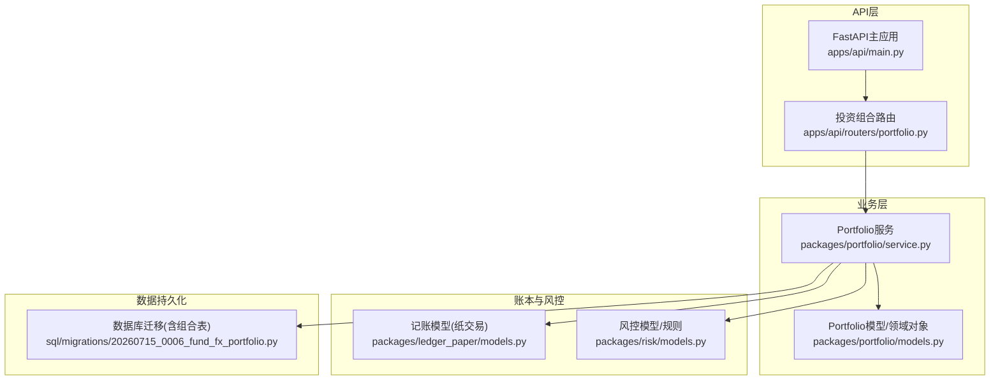
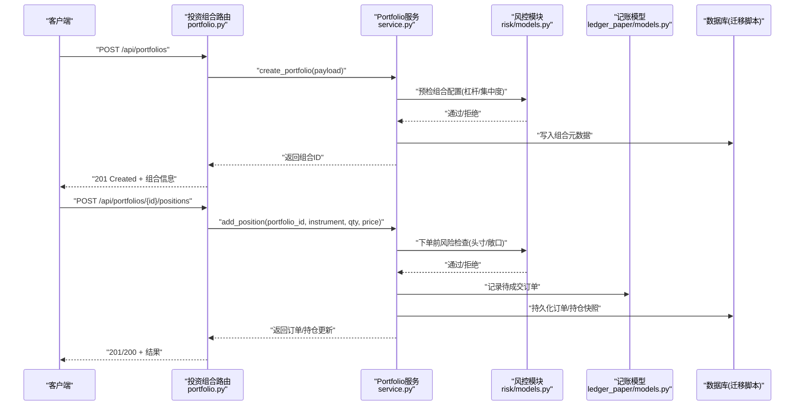
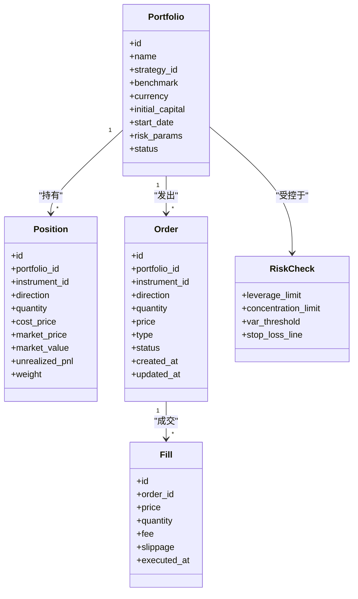
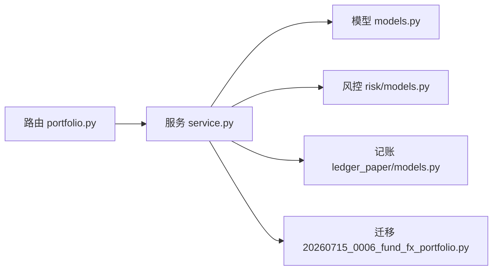

# 投资组合API

<cite>
**本文引用的文件**   
- [apps/api/routers/portfolio.py](file://apps/api/routers/portfolio.py)
- [apps/api/main.py](file://apps/api/main.py)
- [packages/portfolio/models.py](file://packages/portfolio/models.py)
- [packages/portfolio/service.py](file://packages/portfolio/service.py)
- [packages/ledger_paper/models.py](file://packages/ledger_paper/models.py)
- [packages/risk/models.py](file://packages/risk/models.py)
- [sql/migrations/20260715_0006_fund_fx_portfolio.py](file://sql/migrations/20260715_0006_fund_fx_portfolio.py)
</cite>

## 目录
1. [简介](#简介)
2. [项目结构](#项目结构)
3. [核心组件](#核心组件)
4. [架构总览](#架构总览)
5. [详细组件分析](#详细组件分析)
6. [依赖分析](#依赖分析)
7. [性能考虑](#性能考虑)
8. [故障排查指南](#故障排查指南)
9. [结论](#结论)
10. [附录](#附录)

## 简介
本文件为投资组合管理模块的RESTful API文档，覆盖组合创建、持仓管理、交易记录、权重调整、风险限额检查、实时净值计算、回测与模拟交易等能力。文档面向开发者与量化研究员，提供端点定义、请求/响应数据模型、错误处理与最佳实践，并给出端到端使用示例（回测、模拟交易、实盘对接）。

## 项目结构
投资组合相关API位于FastAPI应用的路由层，业务逻辑封装在portfolio包中，持久化与领域模型分布在portfolio、ledger_paper、risk等包以及数据库迁移脚本中。

图表来源
- [apps/api/main.py](file://apps/api/main.py)
- [apps/api/routers/portfolio.py](file://apps/api/routers/portfolio.py)
- [packages/portfolio/service.py](file://packages/portfolio/service.py)
- [packages/portfolio/models.py](file://packages/portfolio/models.py)
- [packages/ledger_paper/models.py](file://packages/ledger_paper/models.py)
- [packages/risk/models.py](file://packages/risk/models.py)
- [sql/migrations/20260715_0006_fund_fx_portfolio.py](file://sql/migrations/20260715_0006_fund_fx_portfolio.py)

章节来源
- [apps/api/main.py](file://apps/api/main.py)
- [apps/api/routers/portfolio.py](file://apps/api/routers/portfolio.py)

## 核心组件
- 路由层：暴露HTTP端点，负责参数校验、鉴权（如需要）、调用服务层。
- 服务层：编排业务逻辑，协调组合、持仓、订单、风控与记账。
- 模型层：定义组合、持仓、订单、净值等数据结构与约束。
- 风控层：提供风险限额检查、集中度、杠杆、流动性等指标计算。
- 账本层：记录成交、费用、分红拆合等事件，支撑净值与绩效计算。
- 数据层：通过迁移脚本定义的表结构进行持久化。

章节来源
- [packages/portfolio/service.py](file://packages/portfolio/service.py)
- [packages/portfolio/models.py](file://packages/portfolio/models.py)
- [packages/ledger_paper/models.py](file://packages/ledger_paper/models.py)
- [packages/risk/models.py](file://packages/risk/models.py)
- [sql/migrations/20260715_0006_fund_fx_portfolio.py](file://sql/migrations/20260715_0006_fund_fx_portfolio.py)

## 架构总览
下图展示从HTTP请求到业务落库的完整链路，包括风控前置检查与记账后置落库。

图表来源
- [apps/api/routers/portfolio.py](file://apps/api/routers/portfolio.py)
- [packages/portfolio/service.py](file://packages/portfolio/service.py)
- [packages/risk/models.py](file://packages/risk/models.py)
- [packages/ledger_paper/models.py](file://packages/ledger_paper/models.py)
- [sql/migrations/20260715_0006_fund_fx_portfolio.py](file://sql/migrations/20260715_0006_fund_fx_portfolio.py)

## 详细组件分析

### 组合生命周期API
- 创建组合
  - 方法: POST
  - 路径: /api/portfolios
  - 请求体字段: 名称、策略标识、基准、币种、初始资金、开始日期、风控参数（最大杠杆、行业集中度上限、单票集中度上限、VaR阈值等）
  - 响应: 组合ID、状态、创建时间
  - 错误: 重复名称、非法风控参数、初始化失败
- 查询组合
  - 方法: GET
  - 路径: /api/portfolios/{id}
  - 响应: 组合元数据、当前状态、最近净值
- 更新组合
  - 方法: PATCH
  - 路径: /api/portfolios/{id}
  - 支持: 修改风控参数、切换基准、暂停/恢复
- 删除组合
  - 方法: DELETE
  - 路径: /api/portfolios/{id}
  - 说明: 仅允许未激活或空组合；已产生交易的组合需归档

章节来源
- [apps/api/routers/portfolio.py](file://apps/api/routers/portfolio.py)
- [packages/portfolio/models.py](file://packages/portfolio/models.py)

### 持仓管理API
- 新增/调整持仓
  - 方法: POST
  - 路径: /api/portfolios/{id}/positions
  - 请求体字段: 标的ID、方向（多/空）、数量、价格、订单类型（市价/限价）、备注
  - 响应: 订单ID、预估占用、风险检查结果
- 批量调整
  - 方法: POST
  - 路径: /api/portfolios/{id}/positions/batch
  - 请求体: 多条调整指令，原子执行
- 撤销/修改订单
  - 方法: PUT/DELETE
  - 路径: /api/portfolios/{id}/orders/{order_id}
- 查询持仓
  - 方法: GET
  - 路径: /api/portfolios/{id}/positions?instrument=&date=
  - 响应: 持仓明细、成本、市值、盈亏

章节来源
- [apps/api/routers/portfolio.py](file://apps/api/routers/portfolio.py)
- [packages/portfolio/service.py](file://packages/portfolio/service.py)
- [packages/ledger_paper/models.py](file://packages/ledger_paper/models.py)

### 交易记录与成交确认API
- 提交成交
  - 方法: POST
  - 路径: /api/portfolios/{id}/fills
  - 请求体字段: 订单ID、成交价、成交量、手续费、滑点、成交时间
  - 响应: 成交ID、更新后的持仓与可用资金
- 查询成交
  - 方法: GET
  - 路径: /api/portfolios/{id}/fills?start=&end=&status=
- 冲正/更正
  - 方法: POST
  - 路径: /api/portfolios/{id}/fills/{fill_id}/reverse
  - 说明: 需审计日志与原因

章节来源
- [apps/api/routers/portfolio.py](file://apps/api/routers/portfolio.py)
- [packages/ledger_paper/models.py](file://packages/ledger_paper/models.py)

### 组合权重调整API
- 目标权重调整
  - 方法: POST
  - 路径: /api/portfolios/{id}/target_weights
  - 请求体: 标的权重映射、再平衡日、触发条件（偏离阈值）
  - 响应: 再平衡计划、预计调仓量、风险影响评估
- 执行再平衡
  - 方法: POST
  - 路径: /api/portfolios/{id}/rebalance
  - 说明: 生成调仓订单集，经风控后提交

章节来源
- [apps/api/routers/portfolio.py](file://apps/api/routers/portfolio.py)
- [packages/portfolio/service.py](file://packages/portfolio/service.py)

### 风险限额检查API
- 单次检查
  - 方法: POST
  - 路径: /api/portfolios/{id}/risk/check
  - 请求体: 拟调仓清单或订单集合
  - 响应: 风险评分、超限项、建议
- 持续监控
  - 方法: GET
  - 路径: /api/portfolios/{id}/risk/status
  - 响应: 当前风险指标快照（杠杆、集中度、VaR、流动性覆盖率等）

章节来源
- [apps/api/routers/portfolio.py](file://apps/api/routers/portfolio.py)
- [packages/risk/models.py](file://packages/risk/models.py)

### 实时净值与绩效指标API
- 实时净值
  - 方法: GET
  - 路径: /api/portfolios/{id}/nav?as_of=
  - 响应: 单位净值、累计净值、现金余额、市值、估值时点
- 绩效指标
  - 方法: GET
  - 路径: /api/portfolios/{id}/performance?period=
  - 指标: 年化收益、波动率、夏普比率、最大回撤、Calmar比率、信息比率、跟踪误差
- 净值曲线
  - 方法: GET
  - 路径: /api/portfolios/{id}/nav_series?start=&end=&freq=

章节来源
- [apps/api/routers/portfolio.py](file://apps/api/routers/portfolio.py)
- [packages/portfolio/service.py](file://packages/portfolio/service.py)

### 回测与模拟交易API
- 启动回测
  - 方法: POST
  - 路径: /api/backtests
  - 请求体: 策略ID、组合配置、历史区间、数据源、风控参数
  - 响应: 回测任务ID、进度查询接口
- 查询回测结果
  - 方法: GET
  - 路径: /api/backtests/{id}
  - 响应: 净值曲线、绩效指标、交易明细、归因
- 启动模拟交易
  - 方法: POST
  - 路径: /api/paper_trading
  - 请求体: 组合ID、策略ID、运行模式（日内/跨日）、风控开关
  - 响应: 会话ID、订阅推送通道
- 停止模拟交易
  - 方法: DELETE
  - 路径: /api/paper_trading/{session_id}

章节来源
- [apps/api/routers/portfolio.py](file://apps/api/routers/portfolio.py)
- [packages/portfolio/service.py](file://packages/portfolio/service.py)

### 实盘对接API
- 连接券商/交易所适配器
  - 方法: POST
  - 路径: /api/live/adapters/connect
  - 请求体: 适配器类型、凭据、环境（沙箱/生产）
  - 响应: 连接ID、健康状态
- 下发订单
  - 方法: POST
  - 路径: /api/live/orders
  - 请求体: 组合ID、订单详情、风控标记
  - 响应: 外部订单号、回执
- 接收回报
  - 方法: POST
  - 路径: /api/live/webhooks/fills
  - 说明: 异步推送成交、撤单、部分成交等消息

章节来源
- [apps/api/routers/portfolio.py](file://apps/api/routers/portfolio.py)

### 数据模型定义

#### 组合配置
- 关键字段: 名称、策略标识、基准、币种、初始资金、开始日期、风控参数（最大杠杆、行业集中度上限、单票集中度上限、VaR阈值、止损线）
- 用途: 控制组合行为与风险边界

章节来源
- [packages/portfolio/models.py](file://packages/portfolio/models.py)

#### 持仓数据结构
- 关键字段: 标的ID、方向、数量、成本价、现价、市值、未实现盈亏、占比
- 用途: 反映组合当前头寸与风险暴露

章节来源
- [packages/portfolio/models.py](file://packages/portfolio/models.py)

#### 交易订单格式
- 关键字段: 订单ID、组合ID、标的ID、方向、数量、价格、类型、状态、时间戳、备注
- 用途: 全生命周期追踪订单

章节来源
- [packages/ledger_paper/models.py](file://packages/ledger_paper/models.py)

#### 绩效计算指标
- 指标列表: 年化收益、波动率、夏普比率、最大回撤、Calmar比率、信息比率、跟踪误差
- 计算依据: 净值序列、基准序列、交易流水、费率与滑点

章节来源
- [packages/portfolio/service.py](file://packages/portfolio/service.py)

### 类图（代码级关系）

图表来源
- [packages/portfolio/models.py](file://packages/portfolio/models.py)
- [packages/ledger_paper/models.py](file://packages/ledger_paper/models.py)
- [packages/risk/models.py](file://packages/risk/models.py)

## 依赖分析
- 路由对服务的依赖：路由层仅做参数校验与转发，核心逻辑在服务层。
- 服务对风控与记账的依赖：下单前调用风控检查，成交后写入账本。
- 数据持久化：通过迁移脚本定义的表结构存储组合、订单、成交等数据。

图表来源
- [apps/api/routers/portfolio.py](file://apps/api/routers/portfolio.py)
- [packages/portfolio/service.py](file://packages/portfolio/service.py)
- [packages/portfolio/models.py](file://packages/portfolio/models.py)
- [packages/risk/models.py](file://packages/risk/models.py)
- [packages/ledger_paper/models.py](file://packages/ledger_paper/models.py)
- [sql/migrations/20260715_0006_fund_fx_portfolio.py](file://sql/migrations/20260715_0006_fund_fx_portfolio.py)

章节来源
- [apps/api/routers/portfolio.py](file://apps/api/routers/portfolio.py)
- [packages/portfolio/service.py](file://packages/portfolio/service.py)

## 性能考虑
- 批量操作：优先使用批量调整接口减少往返与事务开销。
- 分页与过滤：查询接口应支持分页与按时间/标的过滤，避免大结果集。
- 缓存热点：净值与风险快照可短期缓存，注意失效策略。
- 异步处理：回测与大规模再平衡建议异步任务队列，提供进度查询。
- 幂等性：订单与成交接口需支持幂等键，防止重复提交。

[本节为通用指导，不直接分析具体文件]

## 故障排查指南
- 常见错误码
  - 400 参数校验失败：检查必填字段、数值范围、枚举值
  - 404 资源不存在：确认组合ID、订单ID有效
  - 409 冲突：重复名称、重复订单ID
  - 422 风控拒绝：查看风险检查返回的超限项与建议
  - 500 内部错误：查看服务日志与数据库异常
- 定位步骤
  - 核对请求体字段与模型定义是否一致
  - 检查风控阈值设置是否过于严格
  - 查看账本流水是否成功写入
  - 确认数据库迁移是否已执行

章节来源
- [packages/portfolio/models.py](file://packages/portfolio/models.py)
- [packages/ledger_paper/models.py](file://packages/ledger_paper/models.py)
- [packages/risk/models.py](file://packages/risk/models.py)

## 结论
本API文档覆盖了投资组合从创建、调仓、风控、记账到净值与绩效的全流程接口，并提供回测、模拟交易与实盘对接的使用方式。建议在集成时遵循幂等、分页、异步与缓存的最佳实践，确保系统稳定与可扩展。

[本节为总结，不直接分析具体文件]

## 附录

### 使用示例

- 组合创建
  - 请求: POST /api/portfolios
  - 要点: 提供名称、策略、基准、币种、初始资金、风控参数
  - 预期: 返回组合ID与状态
- 持仓调整
  - 请求: POST /api/portfolios/{id}/positions
  - 要点: 指定标的、方向、数量、价格与类型
  - 预期: 返回订单ID与风险检查结果
- 成交确认
  - 请求: POST /api/portfolios/{id}/fills
  - 要点: 关联订单ID、成交价、成交量、费用
  - 预期: 更新持仓与可用资金
- 风险检查
  - 请求: POST /api/portfolios/{id}/risk/check
  - 要点: 传入拟调仓清单
  - 预期: 返回风险评分与超限项
- 净值查询
  - 请求: GET /api/portfolios/{id}/nav?as_of=
  - 预期: 返回单位净值、累计净值与资产构成
- 回测启动
  - 请求: POST /api/backtests
  - 要点: 指定策略、区间、数据源与风控参数
  - 预期: 返回任务ID与进度查询接口
- 模拟交易
  - 请求: POST /api/paper_trading
  - 要点: 绑定组合与策略，选择运行模式
  - 预期: 返回会话ID与推送通道
- 实盘对接
  - 请求: POST /api/live/adapters/connect
  - 要点: 提供适配器类型与凭据
  - 预期: 返回连接ID与健康状态

[本节为概念性示例，不直接分析具体文件]