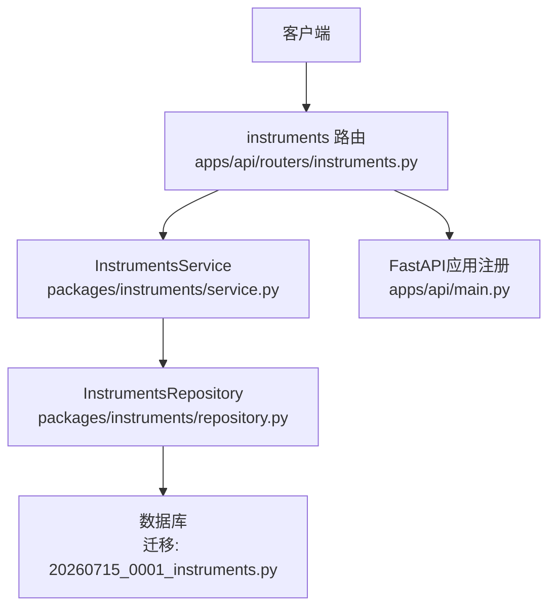
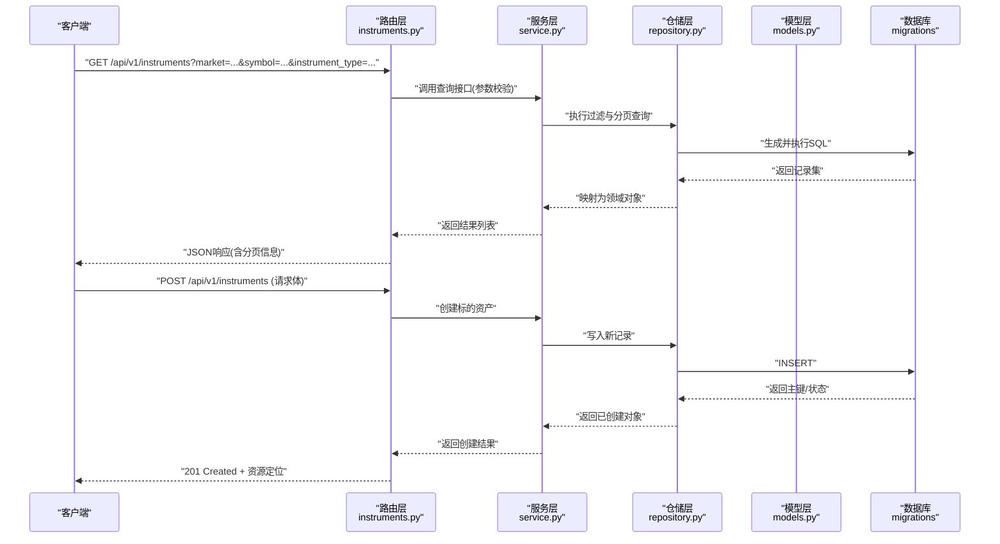
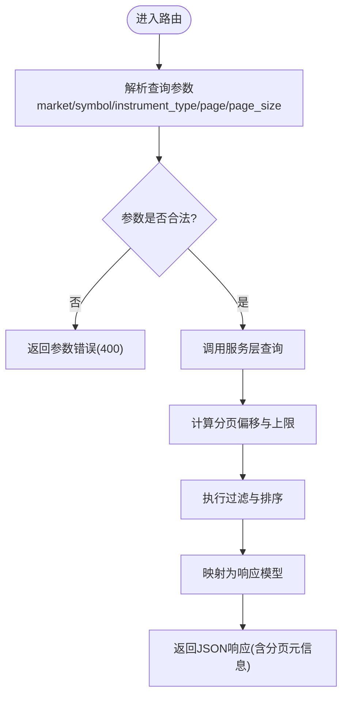
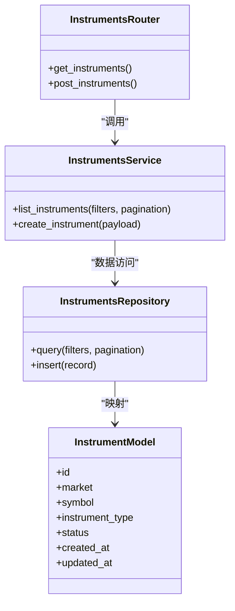

# 标的资产API

<cite>
**本文引用的文件**   
- [apps/api/routers/instruments.py](file://apps/api/routers/instruments.py)
- [apps/api/main.py](file://apps/api/main.py)
- [packages/instruments/models.py](file://packages/instruments/models.py)
- [packages/instruments/service.py](file://packages/instruments/service.py)
- [packages/instruments/repository.py](file://packages/instruments/repository.py)
- [sql/migrations/20260715_0001_instruments.py](file://sql/migrations/20260715_0001_instruments.py)
- [tests/unit/test_instruments_router_wired.py](file://tests/unit/test_instruments_router_wired.py)
</cite>

## 目录
1. [简介](#简介)
2. [项目结构](#项目结构)
3. [核心组件](#核心组件)
4. [架构总览](#架构总览)
5. [详细组件分析](#详细组件分析)
6. [依赖关系分析](#依赖关系分析)
7. [性能考虑](#性能考虑)
8. [故障排查指南](#故障排查指南)
9. [结论](#结论)
10. [附录](#附录)

## 简介
本文件为“标的资产管理模块”的RESTful API文档，聚焦于与标的资产（Instrument）相关的HTTP端点。内容涵盖：
- 接口清单与语义说明
- 查询参数过滤条件（如 market、symbol、instrument_type）
- 请求体结构与响应数据格式
- 分页机制、批量操作与错误码
- Python客户端示例与常见使用场景
- 性能优化建议

## 项目结构
与标的资产API直接相关的代码主要分布在以下位置：
- API路由层：定义HTTP端点、参数校验、响应封装
- 服务层：业务逻辑编排、跨域规则处理
- 仓储层：数据访问抽象与实现
- 模型层：标的资产的数据模型定义
- 数据库迁移：标的资产表结构演进
- 测试：路由集成与行为验证

图表来源
- [apps/api/routers/instruments.py](file://apps/api/routers/instruments.py)
- [packages/instruments/service.py](file://packages/instruments/service.py)
- [packages/instruments/repository.py](file://packages/instruments/repository.py)
- [sql/migrations/20260715_0001_instruments.py](file://sql/migrations/20260715_0001_instruments.py)
- [apps/api/main.py](file://apps/api/main.py)

章节来源
- [apps/api/routers/instruments.py](file://apps/api/routers/instruments.py)
- [apps/api/main.py](file://apps/api/main.py)
- [packages/instruments/models.py](file://packages/instruments/models.py)
- [packages/instruments/service.py](file://packages/instruments/service.py)
- [packages/instruments/repository.py](file://packages/instruments/repository.py)
- [sql/migrations/20260715_0001_instruments.py](file://sql/migrations/20260715_0001_instruments.py)
- [tests/unit/test_instruments_router_wired.py](file://tests/unit/test_instruments_router_wired.py)

## 核心组件
- 路由层（Routers）
  - 负责解析HTTP请求、参数校验、调用服务层并返回统一响应格式
  - 关键端点：GET /api/v1/instruments、POST /api/v1/instruments
- 服务层（Service）
  - 封装标的资产的查询、创建、更新等业务流程
  - 协调多源数据、执行过滤与排序策略
- 仓储层（Repository）
  - 提供对持久化存储的访问能力，屏蔽底层SQL细节
- 模型层（Models）
  - 定义标的资产的核心字段与约束，作为请求/响应的数据载体
- 迁移脚本（Migrations）
  - 维护标的资产表结构的版本演进

章节来源
- [apps/api/routers/instruments.py](file://apps/api/routers/instruments.py)
- [packages/instruments/service.py](file://packages/instruments/service.py)
- [packages/instruments/repository.py](file://packages/instruments/repository.py)
- [packages/instruments/models.py](file://packages/instruments/models.py)
- [sql/migrations/20260715_0001_instruments.py](file://sql/migrations/20260715_0001_instruments.py)

## 架构总览
下图展示了从客户端到数据库的完整调用链路，以及各层职责边界。

图表来源
- [apps/api/routers/instruments.py](file://apps/api/routers/instruments.py)
- [packages/instruments/service.py](file://packages/instruments/service.py)
- [packages/instruments/repository.py](file://packages/instruments/repository.py)
- [packages/instruments/models.py](file://packages/instruments/models.py)
- [sql/migrations/20260715_0001_instruments.py](file://sql/migrations/20260715_0001_instruments.py)

## 详细组件分析

### 路由层：/api/v1/instruments
- GET /api/v1/instruments
  - 功能：按市场、标的代码、类型等条件检索标的资产，支持分页
  - 查询参数
    - market: 可选，市场标识过滤器
    - symbol: 可选，标的代码过滤器
    - instrument_type: 可选，标的类型过滤器
    - page: 可选，页码（默认1）
    - page_size: 可选，每页条数（默认若干，受服务端限制）
  - 响应
    - 列表数据：包含标的资产关键字段（如唯一ID、市场、代码、类型、状态、时间戳等）
    - 分页元信息：当前页、每页大小、总条数、总页数
- POST /api/v1/instruments
  - 功能：新增标的资产
  - 请求体字段（节选）
    - market: 必填，市场标识
    - symbol: 必填，标的代码
    - instrument_type: 必填，标的类型
    - status: 可选，初始状态
    - 其他扩展字段：根据模型定义
  - 响应
    - 成功：201 Created，返回新建标的资产详情及资源定位
    - 失败：4xx/5xx，见错误码说明

图表来源
- [apps/api/routers/instruments.py](file://apps/api/routers/instruments.py)

章节来源
- [apps/api/routers/instruments.py](file://apps/api/routers/instruments.py)

### 服务层：InstrumentsService
- 职责
  - 组合多个仓储调用，完成复杂查询与事务性创建
  - 执行业务规则校验（如重复检查、状态机转换）
- 典型方法
  - list_instruments(filters, pagination): 返回列表
  - create_instrument(payload): 创建并返回实体
- 异常处理
  - 将仓储异常转换为标准业务异常，便于路由层统一响应

章节来源
- [packages/instruments/service.py](file://packages/instruments/service.py)

### 仓储层：InstrumentsRepository
- 职责
  - 封装SQL构建与执行，提供统一的CRUD接口
- 关键能力
  - 动态过滤：基于market/symbol/instrument_type生成WHERE子句
  - 分页：LIMIT/OFFSET或等效机制
  - 事务：在批量写入时保证一致性

章节来源
- [packages/instruments/repository.py](file://packages/instruments/repository.py)

### 模型层：Instruments Models
- 作用
  - 定义标的资产的结构与约束，作为请求/响应契约
- 关键字段
  - id: 唯一标识
  - market: 市场
  - symbol: 标的代码
  - instrument_type: 标的类型
  - status: 状态
  - created_at/updated_at: 时间戳
- 校验
  - 非空、枚举值、长度限制等

章节来源
- [packages/instruments/models.py](file://packages/instruments/models.py)

### 数据库迁移：20260715_0001_instruments.py
- 作用
  - 初始化或升级标的资产相关表结构
- 关注点
  - 索引设计：针对market/symbol/instrument_type建立合适索引以提升查询性能
  - 约束：唯一性、外键、非空等

章节来源
- [sql/migrations/20260715_0001_instruments.py](file://sql/migrations/20260715_0001_instruments.py)

### 测试：路由集成验证
- 目标
  - 验证路由与服务/仓储的集成正确性
  - 覆盖正常路径与异常分支
- 用例要点
  - 参数缺失与非法值
  - 分页边界情况
  - 重复创建冲突

章节来源
- [tests/unit/test_instruments_router_wired.py](file://tests/unit/test_instruments_router_wired.py)

## 依赖关系分析
- 路由层依赖服务层，服务层依赖仓储层，仓储层依赖数据库
- 模型层贯穿请求/响应与ORM映射
- 迁移脚本驱动数据库结构变更

图表来源
- [apps/api/routers/instruments.py](file://apps/api/routers/instruments.py)
- [packages/instruments/service.py](file://packages/instruments/service.py)
- [packages/instruments/repository.py](file://packages/instruments/repository.py)
- [packages/instruments/models.py](file://packages/instruments/models.py)

章节来源
- [apps/api/routers/instruments.py](file://apps/api/routers/instruments.py)
- [packages/instruments/service.py](file://packages/instruments/service.py)
- [packages/instruments/repository.py](file://packages/instruments/repository.py)
- [packages/instruments/models.py](file://packages/instruments/models.py)

## 性能考虑
- 查询优化
  - 合理使用market/symbol/instrument_type过滤，避免全表扫描
  - 利用数据库索引提升过滤与排序效率
- 分页策略
  - 控制page_size上限，防止大结果集导致内存压力
  - 优先使用游标式分页（如基于时间戳或主键）替代深度OFFSET
- 连接池与并发
  - 合理配置数据库连接池大小，避免连接耗尽
  - 在高并发下启用读写分离或只读副本
- 缓存
  - 对热点标的资产元数据进行短期缓存（注意失效策略）
- 序列化开销
  - 按需返回字段，减少冗余传输

[本节为通用指导，不直接分析具体文件]

## 故障排查指南
- 常见错误码
  - 400 参数错误：缺少必填字段或参数值非法
  - 404 未找到：标的资产不存在
  - 409 冲突：重复创建（如market+symbol组合唯一）
  - 422 校验失败：请求体验证错误
  - 500 服务器内部错误：未知异常
- 排查步骤
  - 检查请求参数是否符合规范
  - 查看服务日志中的异常堆栈
  - 核对数据库索引与约束是否生效
  - 复现最小可重现场景并逐步缩小范围

章节来源
- [apps/api/routers/instruments.py](file://apps/api/routers/instruments.py)
- [packages/instruments/service.py](file://packages/instruments/service.py)
- [packages/instruments/repository.py](file://packages/instruments/repository.py)

## 结论
本API围绕标的资产的查询与创建提供了清晰的REST接口，结合分层架构与完善的模型/迁移管理，具备良好的可扩展性与可维护性。通过合理的分页、索引与缓存策略，可在高并发场景下保持稳定性能。

[本节为总结性内容，不直接分析具体文件]

## 附录

### 接口清单与语义
- GET /api/v1/instruments
  - 用途：检索标的资产列表
  - 过滤：market、symbol、instrument_type
  - 分页：page、page_size
- POST /api/v1/instruments
  - 用途：新增标的资产
  - 请求体：market、symbol、instrument_type、status等

章节来源
- [apps/api/routers/instruments.py](file://apps/api/routers/instruments.py)

### 请求体与响应字段说明
- 请求体关键字段
  - market: 市场标识（必填）
  - symbol: 标的代码（必填）
  - instrument_type: 标的类型（必填）
  - status: 初始状态（可选）
- 响应关键字段
  - id: 唯一标识
  - market/symbol/instrument_type/status
  - created_at/updated_at
  - 分页元信息：page、page_size、total、pages

章节来源
- [packages/instruments/models.py](file://packages/instruments/models.py)

### 分页机制
- 参数
  - page: 页码（从1开始）
  - page_size: 每页条数（受服务端上限限制）
- 响应
  - total: 总记录数
  - pages: 总页数
  - items: 当前页数据

章节来源
- [apps/api/routers/instruments.py](file://apps/api/routers/instruments.py)

### 批量操作
- 当前版本未暴露批量创建端点
- 如需批量导入，可通过多次POST调用或在服务端增加批量接口（需评估幂等与事务）

章节来源
- [apps/api/routers/instruments.py](file://apps/api/routers/instruments.py)

### Python客户端示例
- 使用requests库进行GET/POST调用
- 示例要点
  - 设置基础URL与超时
  - 构造查询参数与请求体
  - 处理分页循环获取全部数据
  - 捕获并打印错误信息

章节来源
- [apps/api/routers/instruments.py](file://apps/api/routers/instruments.py)

### 常见使用场景
- 按市场与类型筛选标的资产
- 增量同步：基于更新时间戳拉取变更
- 预加载：在回测前批量获取标的元数据

章节来源
- [apps/api/routers/instruments.py](file://apps/api/routers/instruments.py)