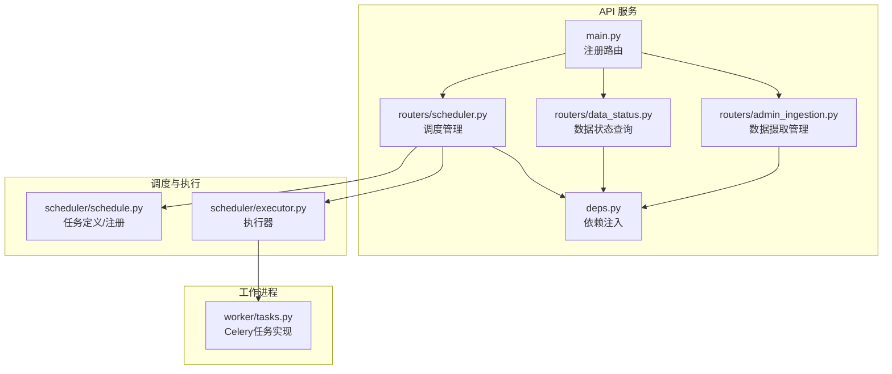
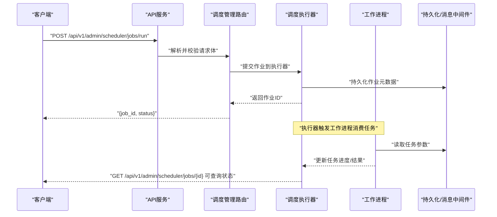
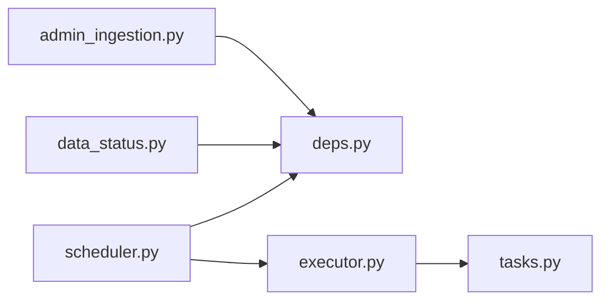

# 管理员与数据摄取API

<cite>
**本文引用的文件**   
- [apps/api/main.py](file://apps/api/main.py)
- [apps/api/routers/admin_ingestion.py](file://apps/api/routers/admin_ingestion.py)
- [apps/api/routers/data_status.py](file://apps/api/routers/data_status.py)
- [apps/api/routers/scheduler.py](file://apps/api/routers/scheduler.py)
- [apps/api/deps.py](file://apps/api/deps.py)
- [apps/worker/tasks.py](file://apps/worker/tasks.py)
- [apps/scheduler/executor.py](file://apps/scheduler/executor.py)
- [apps/scheduler/schedule.py](file://apps/scheduler/schedule.py)
</cite>

## 目录
1. [简介](#简介)
2. [项目结构](#项目结构)
3. [核心组件](#核心组件)
4. [架构总览](#架构总览)
5. [详细组件分析](#详细组件分析)
6. [依赖关系分析](#依赖关系分析)
7. [性能考虑](#性能考虑)
8. [故障排查指南](#故障排查指南)
9. [结论](#结论)
10. [附录](#附录)

## 简介
本文件面向系统管理与数据摄取模块，提供完整的RESTful API文档。内容覆盖：
- 管理操作：数据源配置、批量导入、数据质量检查、任务状态监控
- 运维接口：定时任务配置、工作进程管理、系统健康检查
- 数据管道监控：端到端流程可视化、关键指标与告警建议
- 故障排查与性能调优：常见问题定位方法与优化建议

## 项目结构
与管理员与数据摄取相关的API主要位于应用服务层（FastAPI），并通过调度器与工作进程协同完成异步任务执行。

图表来源
- [apps/api/main.py](file://apps/api/main.py)
- [apps/api/routers/admin_ingestion.py](file://apps/api/routers/admin_ingestion.py)
- [apps/api/routers/data_status.py](file://apps/api/routers/data_status.py)
- [apps/api/routers/scheduler.py](file://apps/api/routers/scheduler.py)
- [apps/api/deps.py](file://apps/api/deps.py)
- [apps/scheduler/schedule.py](file://apps/scheduler/schedule.py)
- [apps/scheduler/executor.py](file://apps/scheduler/executor.py)
- [apps/worker/tasks.py](file://apps/worker/tasks.py)

章节来源
- [apps/api/main.py](file://apps/api/main.py)
- [apps/api/routers/admin_ingestion.py](file://apps/api/routers/admin_ingestion.py)
- [apps/api/routers/data_status.py](file://apps/api/routers/data_status.py)
- [apps/api/routers/scheduler.py](file://apps/api/routers/scheduler.py)
- [apps/api/deps.py](file://apps/api/deps.py)
- [apps/scheduler/schedule.py](file://apps/scheduler/schedule.py)
- [apps/scheduler/executor.py](file://apps/scheduler/executor.py)
- [apps/worker/tasks.py](file://apps/worker/tasks.py)

## 核心组件
- 数据摄取管理路由：提供数据源配置、批量导入、数据质量检查等管理接口
- 数据状态路由：提供数据完整性、覆盖率、延迟等监控查询
- 调度管理路由：提供定时任务配置、启停、重跑、状态查询等运维能力
- 依赖注入：为路由提供统一的数据库、存储、消息队列等基础设施访问
- 调度器与工作进程：将耗时任务异步化，保障API响应性与可扩展性

章节来源
- [apps/api/routers/admin_ingestion.py](file://apps/api/routers/admin_ingestion.py)
- [apps/api/routers/data_status.py](file://apps/api/routers/data_status.py)
- [apps/api/routers/scheduler.py](file://apps/api/routers/scheduler.py)
- [apps/api/deps.py](file://apps/api/deps.py)

## 架构总览
管理员与数据摄取API采用“API路由 + 调度器 + 工作进程”的解耦架构。API负责请求编排与校验，调度器负责任务编排与生命周期管理，工作进程负责具体数据处理逻辑的执行。

图表来源
- [apps/api/routers/scheduler.py](file://apps/api/routers/scheduler.py)
- [apps/scheduler/executor.py](file://apps/scheduler/executor.py)
- [apps/worker/tasks.py](file://apps/worker/tasks.py)

## 详细组件分析

### 数据摄取管理（admin_ingestion）
- 功能范围
  - 数据源配置：新增、更新、删除、查询数据源连接信息
  - 批量导入：按数据集或时间窗口发起批量拉取与转换
  - 数据质量检查：对指定数据集运行一致性、完整性、时效性等规则
  - 导入任务跟踪：查询任务状态、重试、取消
- 典型端点
  - POST /api/v1/admin/ingestion/sources
  - PUT /api/v1/admin/ingestion/sources/{source_id}
  - DELETE /api/v1/admin/ingestion/sources/{source_id}
  - GET /api/v1/admin/ingestion/sources
  - POST /api/v1/admin/ingestion/batch
  - GET /api/v1/admin/ingestion/batch/{batch_id}
  - POST /api/v1/admin/ingestion/quality/check
  - GET /api/v1/admin/ingestion/quality/report/{check_id}
- 请求/响应要点
  - 认证：需携带管理员凭据（由鉴权中间件处理）
  - 幂等：批量导入支持幂等键，避免重复执行
  - 分页：列表查询支持分页与过滤
  - 错误码：400/401/403/404/409/422/500
- 示例调用路径
  - [数据源配置接口](file://apps/api/routers/admin_ingestion.py)
  - [批量导入接口](file://apps/api/routers/admin_ingestion.py)
  - [数据质量检查接口](file://apps/api/routers/admin_ingestion.py)

章节来源
- [apps/api/routers/admin_ingestion.py](file://apps/api/routers/admin_ingestion.py)

### 数据状态监控（data_status）
- 功能范围
  - 数据覆盖率：按市场/资产/字段统计缺失比例
  - 数据延迟：最新记录时间与当前时间的差值
  - 数据新鲜度：最近一次成功摄入的时间戳
  - 异常计数：近N小时失败任务数、重试次数
- 典型端点
  - GET /api/v1/admin/data/status/coverage
  - GET /api/v1/admin/data/status/freshness
  - GET /api/v1/admin/data/status/delay
  - GET /api/v1/admin/data/status/errors
- 查询参数
  - market/instrument/date_range/aggregation_level
- 响应格式
  - 统一信封：{code, message, data}
- 示例调用路径
  - [数据状态查询接口](file://apps/api/routers/data_status.py)

章节来源
- [apps/api/routers/data_status.py](file://apps/api/routers/data_status.py)

### 调度管理（scheduler）
- 功能范围
  - 定时任务CRUD：创建、更新、删除、启用/禁用
  - 任务执行：立即运行、重跑、停止
  - 任务状态：历史执行记录、重试策略、失败告警
- 典型端点
  - POST /api/v1/admin/scheduler/jobs
  - PUT /api/v1/admin/scheduler/jobs/{job_id}
  - DELETE /api/v1/admin/scheduler/jobs/{job_id}
  - POST /api/v1/admin/scheduler/jobs/{job_id}/run
  - POST /api/v1/admin/scheduler/jobs/{job_id}/stop
  - GET /api/v1/admin/scheduler/jobs/{job_id}
  - GET /api/v1/admin/scheduler/jobs
- 调度表达式
  - cron表达式或相对时间窗口
- 重试与超时
  - 最大重试次数、退避策略、超时阈值
- 示例调用路径
  - [调度管理路由](file://apps/api/routers/scheduler.py)
  - [调度执行器](file://apps/scheduler/executor.py)
  - [任务定义/注册](file://apps/scheduler/schedule.py)

章节来源
- [apps/api/routers/scheduler.py](file://apps/api/routers/scheduler.py)
- [apps/scheduler/executor.py](file://apps/scheduler/executor.py)
- [apps/scheduler/schedule.py](file://apps/scheduler/schedule.py)

### 工作进程与任务（worker）
- 功能范围
  - 接收执行器分发的任务
  - 执行数据摄取、转换、入库、质量检查等逻辑
  - 上报任务进度、日志与指标
- 典型任务
  - 批量数据导入
  - 数据质量检查
  - 增量同步
- 示例调用路径
  - [工作进程任务实现](file://apps/worker/tasks.py)

章节来源
- [apps/worker/tasks.py](file://apps/worker/tasks.py)

### 依赖注入（deps）
- 作用
  - 为路由提供统一的数据库会话、对象存储、消息队列、缓存等依赖
  - 集中管理资源生命周期与错误处理
- 使用方式
  - 在路由中通过依赖注入获取所需服务实例
- 示例调用路径
  - [依赖注入模块](file://apps/api/deps.py)

章节来源
- [apps/api/deps.py](file://apps/api/deps.py)

## 依赖关系分析
- 路由层依赖
  - admin_ingestion、data_status、scheduler 三个路由均通过 deps 获取共享基础设施
- 调度链路
  - scheduler 路由调用 executor 进行作业编排，executor 驱动 worker 执行具体任务
- 外部依赖
  - 数据库、消息队列、对象存储、监控系统（可选）

图表来源
- [apps/api/routers/admin_ingestion.py](file://apps/api/routers/admin_ingestion.py)
- [apps/api/routers/data_status.py](file://apps/api/routers/data_status.py)
- [apps/api/routers/scheduler.py](file://apps/api/routers/scheduler.py)
- [apps/api/deps.py](file://apps/api/deps.py)
- [apps/scheduler/executor.py](file://apps/scheduler/executor.py)
- [apps/worker/tasks.py](file://apps/worker/tasks.py)

## 性能考虑
- 批量导入
  - 使用流式写入与批大小控制，避免内存峰值
  - 合理设置并发度与限流策略，防止下游过载
- 数据质量检查
  - 对大规模数据集采用抽样与分片并行策略
  - 将长耗时检查拆分为多个子任务，提升可观测性
- 调度与重试
  - 指数退避与抖动，降低雪崩风险
  - 失败快速失败与隔离，避免级联故障
- 监控与告警
  - 暴露关键指标：任务时长、成功率、延迟、吞吐
  - 结合Prometheus/Grafana建立看板与阈值告警

[本节为通用指导，不直接分析具体文件]

## 故障排查指南
- 常见症状
  - 批量导入长时间无进展：检查工作进程是否存活、队列堆积情况
  - 数据质量检查失败：查看失败规则明细与样本数据
  - 定时任务未触发：核对cron表达式与时区配置
- 定位步骤
  - 通过调度管理路由查询作业状态与日志
  - 检查工作进程日志与指标
  - 验证数据源连通性与权限
- 恢复措施
  - 重试失败任务或重新提交
  - 调整批大小与并发度
  - 修复数据源配置后重跑

章节来源
- [apps/api/routers/scheduler.py](file://apps/api/routers/scheduler.py)
- [apps/worker/tasks.py](file://apps/worker/tasks.py)

## 结论
管理员与数据摄取API以清晰的职责分层与异步执行模型，提供了完善的数据源管理、批量导入、质量检查与调度能力。配合数据状态监控与运维接口，可实现从配置到执行的全链路可视化管理。建议在生产环境强化监控告警与容量规划，确保高可用与高性能。

[本节为总结性内容，不直接分析具体文件]

## 附录

### 健康检查与管理入口
- 健康检查
  - GET /health
  - GET /ready
- 管理入口
  - 所有管理端点均以 /api/v1/admin 前缀组织，便于统一鉴权与审计

章节来源
- [apps/api/main.py](file://apps/api/main.py)