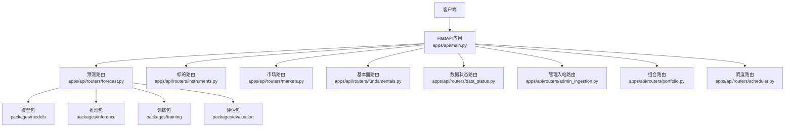
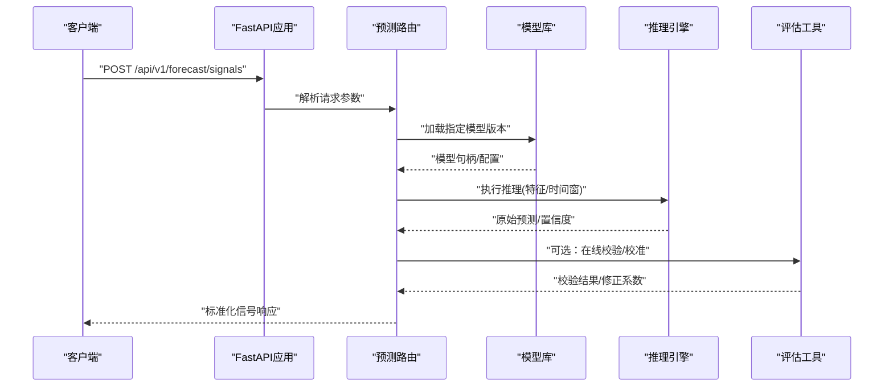
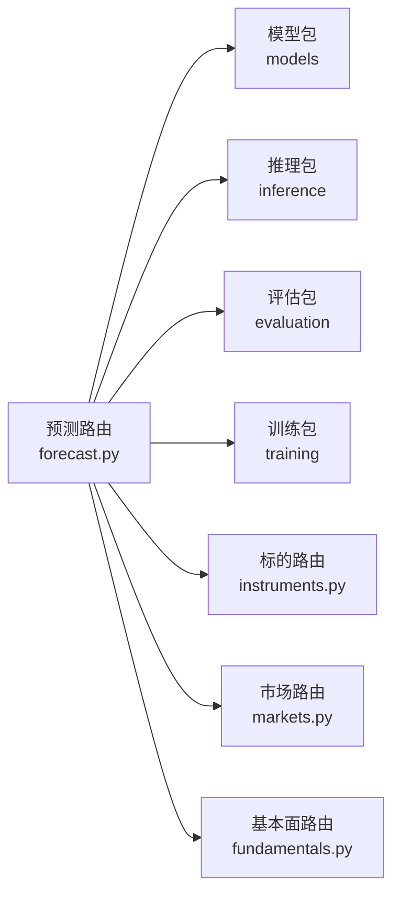

# 预测模型API

<cite>
**本文引用的文件**   
- [apps/api/main.py](file://apps/api/main.py)
- [apps/api/routers/forecast.py](file://apps/api/routers/forecast.py)
- [apps/api/routers/instruments.py](file://apps/api/routers/instruments.py)
- [apps/api/routers/markets.py](file://apps/api/routers/markets.py)
- [apps/api/routers/fundamentals.py](file://apps/api/routers/fundamentals.py)
- [apps/api/routers/data_status.py](file://apps/api/routers/data_status.py)
- [apps/api/routers/admin_ingestion.py](file://apps/api/routers/admin_ingestion.py)
- [apps/api/routers/portfolio.py](file://apps/api/routers/portfolio.py)
- [apps/api/routers/scheduler.py](file://apps/api/routers/scheduler.py)
- [packages/models](file://packages/models)
- [packages/inference](file://packages/inference)
- [packages/training](file://packages/training)
- [packages/evaluation](file://packages/evaluation)
- [scripts/register_and_evaluate.py](file://scripts/register_and_evaluate.py)
- [skills/cross-market-quant-research/scripts/validate_forecast.py](file://skills/cross-market-quant-research/scripts/validate_forecast.py)
</cite>

## 目录
1. [简介](#简介)
2. [项目结构](#项目结构)
3. [核心组件](#核心组件)
4. [架构总览](#架构总览)
5. [详细组件分析](#详细组件分析)
6. [依赖分析](#依赖分析)
7. [性能考虑](#性能考虑)
8. [故障排查指南](#故障排查指南)
9. [结论](#结论)
10. [附录](#附录)

## 简介
本文件为“预测模型模块”的RESTful API文档，聚焦量化预测、信号生成、模型评估与版本管理等相关HTTP端点。内容覆盖：
- 预测模型注册接口（含元数据、版本、路由策略）
- 信号计算接口（批量/单标的、时间窗口、特征来源）
- 模型评估与验证（离线回测指标、在线校验）
- 模型版本管理与发布流程（开发/预发/生产）
- 机器学习与深度学习框架集成说明（LightGBM、XGBoost、PyTorch等）
- 在线学习更新机制（增量训练、灰度发布、回滚）
- 面向策略开发、模型训练与实盘部署的端到端示例

## 项目结构
系统采用FastAPI作为Web服务入口，按功能划分路由模块；预测相关能力集中在forecast路由中，并与instruments、markets、fundamentals等基础数据路由协同工作。后端通过packages下的models、inference、training、evaluation等包实现模型生命周期与推理管线。

图表来源
- [apps/api/main.py](file://apps/api/main.py)
- [apps/api/routers/forecast.py](file://apps/api/routers/forecast.py)
- [apps/api/routers/instruments.py](file://apps/api/routers/instruments.py)
- [apps/api/routers/markets.py](file://apps/api/routers/markets.py)
- [apps/api/routers/fundamentals.py](file://apps/api/routers/fundamentals.py)
- [apps/api/routers/data_status.py](file://apps/api/routers/data_status.py)
- [apps/api/routers/admin_ingestion.py](file://apps/api/routers/admin_ingestion.py)
- [apps/api/routers/portfolio.py](file://apps/api/routers/portfolio.py)
- [apps/api/routers/scheduler.py](file://apps/api/routers/scheduler.py)

章节来源
- [apps/api/main.py](file://apps/api/main.py)
- [apps/api/routers/forecast.py](file://apps/api/routers/forecast.py)

## 核心组件
- 预测路由（forecast）：提供模型注册、版本查询、信号计算、结果验证等核心端点。
- 基础数据路由（instruments/markets/fundamentals）：为预测提供标的、市场、基本面等上下文。
- 数据状态与管理（data_status/admin_ingestion）：监控数据就绪情况与触发数据入站任务。
- 组合与调度（portfolio/scheduler）：支撑策略组合与定时任务编排。
- 模型与推理（packages/models, packages/inference）：封装模型加载、序列化、推理执行。
- 训练与评估（packages/training, packages/evaluation）：提供训练流水线与离线评估指标。

章节来源
- [apps/api/routers/forecast.py](file://apps/api/routers/forecast.py)
- [apps/api/routers/instruments.py](file://apps/api/routers/instruments.py)
- [apps/api/routers/markets.py](file://apps/api/routers/markets.py)
- [apps/api/routers/fundamentals.py](file://apps/api/routers/fundamentals.py)
- [apps/api/routers/data_status.py](file://apps/api/routers/data_status.py)
- [apps/api/routers/admin_ingestion.py](file://apps/api/routers/admin_ingestion.py)
- [apps/api/routers/portfolio.py](file://apps/api/routers/portfolio.py)
- [apps/api/routers/scheduler.py](file://apps/api/routers/scheduler.py)
- [packages/models](file://packages/models)
- [packages/inference](file://packages/inference)
- [packages/training](file://packages/training)
- [packages/evaluation](file://packages/evaluation)

## 架构总览
预测模型API的整体调用链路如下：客户端请求进入FastAPI主应用后，由对应路由处理，再调用模型与推理层完成预测或评估，最终返回结构化响应。

图表来源
- [apps/api/main.py](file://apps/api/main.py)
- [apps/api/routers/forecast.py](file://apps/api/routers/forecast.py)
- [packages/inference](file://packages/inference)
- [packages/evaluation](file://packages/evaluation)

## 详细组件分析

### 预测模型注册与版本管理
- 模型注册
  - 方法：POST
  - 路径：/api/v1/models/register
  - 用途：注册新模型版本，提交模型元数据、存储位置、框架类型、输入输出规范、基线指标等。
  - 关键请求字段：模型名称、版本标识、框架（如lightgbm/xgboost/pytorch）、模型文件路径或对象存储键、输入特征Schema、输出定义、创建者、标签（dev/staging/prod）。
  - 成功响应：返回模型ID、版本、状态（registered/pending/promoted）、创建时间。
  - 错误码：400（参数缺失/非法）、409（版本冲突）、500（存储失败）。
- 模型列表与详情
  - 方法：GET
  - 路径：/api/v1/models?name=&version=&status=
  - 用途：分页查询模型列表，支持按名称、版本、状态过滤。
  - 详情：GET /api/v1/models/{model_id}/versions/{version}
- 模型发布与回滚
  - 方法：POST
  - 路径：/api/v1/models/{model_id}/promote
  - 用途：将指定版本提升为目标环境（staging/prod），并记录审计事件。
  - 回滚：POST /api/v1/models/{model_id}/rollback
  - 注意：生产环境需满足评估阈值与合规检查。

章节来源
- [apps/api/routers/forecast.py](file://apps/api/routers/forecast.py)

### 信号计算接口
- 批量信号
  - 方法：POST
  - 路径：/api/v1/forecast/signals
  - 用途：对给定标的集合与时间窗口进行批量预测，返回标准化信号（方向、强度、置信度、时间戳、模型版本）。
  - 关键请求字段：
    - instruments: 标的列表（支持多市场格式）
    - start_time/end_time: 预测时间范围
    - model_id/version: 指定模型版本
    - features: 可选，外部特征注入
    - options: 是否包含中间结果、校准开关
  - 响应：信号数组，含标的、时间、预测值、置信度、模型元信息。
- 单标的信号
  - 方法：POST
  - 路径：/api/v1/forecast/signals/single
  - 用途：低延迟场景下对单一标的进行实时预测。
- 信号校验
  - 方法：POST
  - 路径：/api/v1/forecast/signals/validate
  - 用途：对已生成的信号进行格式与业务规则校验，返回校验报告与问题清单。
  - 参考脚本：skills/cross-market-quant-research/scripts/validate_forecast.py

章节来源
- [apps/api/routers/forecast.py](file://apps/api/routers/forecast.py)
- [skills/cross-market-quant-research/scripts/validate_forecast.py](file://skills/cross-market-quant-research/scripts/validate_forecast.py)

### 模型评估与回测
- 离线评估
  - 方法：POST
  - 路径：/api/v1/evaluation/run
  - 用途：基于历史数据对指定模型版本执行离线评估，返回指标（IC、IR、夏普、最大回撤、胜率等）。
  - 关键请求字段：模型版本、数据集范围、评估指标集、基准策略、风险约束。
- 对比评估
  - 方法：POST
  - 路径：/api/v1/evaluation/compare
  - 用途：多模型或多版本的横向对比，返回排名与差异分析。
- 评估报告
  - 方法：GET
  - 路径：/api/v1/evaluation/reports/{report_id}
  - 用途：获取评估报告详情与可视化摘要。

章节来源
- [apps/api/routers/forecast.py](file://apps/api/routers/forecast.py)
- [packages/evaluation](file://packages/evaluation)

### 基础数据与上下文
- 标的信息
  - 方法：GET
  - 路径：/api/v1/instruments/{instrument_id}
  - 用途：获取标的基本信息、交易日历、币种、市场属性。
- 市场信息
  - 方法：GET
  - 路径：/api/v1/markets/{market_id}
  - 用途：获取市场时区、交易时段、节假日等。
- 基本面数据
  - 方法：GET
  - 路径：/api/v1/fundamentals/{instrument_id}?period=&fields=
  - 用途：拉取基本面因子用于特征工程或解释性分析。

章节来源
- [apps/api/routers/instruments.py](file://apps/api/routers/instruments.py)
- [apps/api/routers/markets.py](file://apps/api/routers/markets.py)
- [apps/api/routers/fundamentals.py](file://apps/api/routers/fundamentals.py)

### 数据状态与管理
- 数据就绪状态
  - 方法：GET
  - 路径：/api/v1/data/status
  - 用途：查看各数据源与表的同步状态、延迟、缺失率。
- 管理入站任务
  - 方法：POST
  - 路径：/api/v1/admin/ingest
  - 用途：触发数据入站任务（全量/增量），返回任务ID与进度查询接口。

章节来源
- [apps/api/routers/data_status.py](file://apps/api/routers/data_status.py)
- [apps/api/routers/admin_ingestion.py](file://apps/api/routers/admin_ingestion.py)

### 组合与调度
- 组合快照
  - 方法：GET
  - 路径：/api/v1/portfolio/snapshot
  - 用途：获取当前组合持仓、风险暴露、信号汇总。
- 调度任务
  - 方法：POST
  - 路径：/api/v1/scheduler/run
  - 用途：手动触发预测/评估/数据同步等任务。
  - 查询：GET /api/v1/scheduler/jobs/{job_id}

章节来源
- [apps/api/routers/portfolio.py](file://apps/api/routers/portfolio.py)
- [apps/api/routers/scheduler.py](file://apps/api/routers/scheduler.py)

### 高级特性：框架集成与在线学习
- 框架支持
  - 机器学习：LightGBM、XGBoost、Ridge/Lasso等
  - 深度学习：PyTorch、TensorFlow/Keras（通过统一推理接口适配）
  - 模型序列化：ONNX/自定义二进制，确保跨环境一致性
- 在线学习更新
  - 增量训练：POST /api/v1/training/incremental
  - 灰度发布：结合promote接口逐步放量，观察指标漂移
  - 自动回滚：当评估指标低于阈值或数据漂移告警时，自动回退至上一稳定版本

章节来源
- [packages/models](file://packages/models)
- [packages/inference](file://packages/inference)
- [packages/training](file://packages/training)

### 端到端示例（策略开发/模型训练/实盘部署）
- 策略开发
  - 使用instruments/markets/fundamentals构建特征与标签
  - 通过evaluation/run进行离线评估，筛选候选模型
- 模型训练
  - 使用training/incremental进行增量训练，产出新版本
  - 通过register_and_evaluate.py自动化注册与评估流程
- 实盘部署
  - 使用promote将模型提升至prod
  - 通过forecast/signals进行批量或实时信号生成
  - 使用scheduler/run编排定时预测与风控检查

章节来源
- [scripts/register_and_evaluate.py](file://scripts/register_and_evaluate.py)
- [apps/api/routers/forecast.py](file://apps/api/routers/forecast.py)
- [apps/api/routers/scheduler.py](file://apps/api/routers/scheduler.py)

## 依赖分析
预测模型API的依赖关系如下：

图表来源
- [apps/api/routers/forecast.py](file://apps/api/routers/forecast.py)
- [apps/api/routers/instruments.py](file://apps/api/routers/instruments.py)
- [apps/api/routers/markets.py](file://apps/api/routers/markets.py)
- [apps/api/routers/fundamentals.py](file://apps/api/routers/fundamentals.py)
- [packages/models](file://packages/models)
- [packages/inference](file://packages/inference)
- [packages/training](file://packages/training)
- [packages/evaluation](file://packages/evaluation)

章节来源
- [apps/api/routers/forecast.py](file://apps/api/routers/forecast.py)

## 性能考虑
- 批处理优化：批量信号接口建议按批次大小与并发度调优，避免内存峰值。
- 缓存策略：对静态特征与市场信息进行缓存，减少重复IO。
- 异步推理：对高延迟模型采用异步队列与超时控制。
- 指标采样：评估阶段按需采样以降低计算成本。
- 资源隔离：不同环境的模型运行容器化隔离，防止相互影响。

## 故障排查指南
- 常见错误
  - 400：请求参数缺失或格式错误（检查instruments、时间窗口、模型版本）
  - 404：模型或标的不存在（确认ID与命名空间）
  - 409：版本冲突（尝试升级或清理旧版本）
  - 500：内部错误（查看日志与下游依赖健康状态）
- 诊断步骤
  - 使用/data/status检查数据就绪情况
  - 使用/scheduler/jobs/{job_id}跟踪任务进度
  - 使用/evaluation/reports/{report_id}定位评估异常
  - 使用/forecast/signals/validate校验信号格式与业务规则

章节来源
- [apps/api/routers/data_status.py](file://apps/api/routers/data_status.py)
- [apps/api/routers/scheduler.py](file://apps/api/routers/scheduler.py)
- [apps/api/routers/forecast.py](file://apps/api/routers/forecast.py)

## 结论
预测模型API围绕“注册—训练—评估—发布—推理—校验”的全生命周期设计，提供标准化的REST接口与完善的辅助工具链。通过统一的模型与推理抽象，系统兼容多种机器学习与深度学习框架，并支持在线学习与灰度发布，满足从研究到实盘的端到端需求。

## 附录
- 术语
  - 模型版本：同一模型的不同迭代，具有唯一标识与环境标签
  - 信号：预测输出的标准化形式，包含方向、强度与置信度
  - 评估指标：衡量模型表现的关键指标，如IC、IR、夏普比率等
- 最佳实践
  - 在staging环境充分验证后再提升到prod
  - 建立回归测试与基线指标门禁
  - 定期复盘模型漂移与数据质量