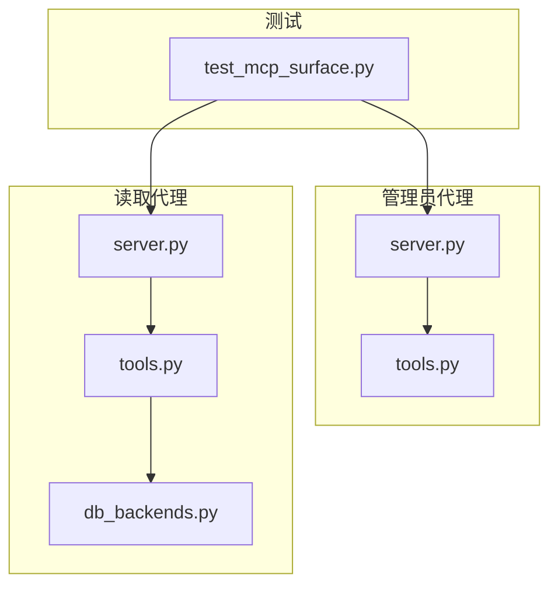
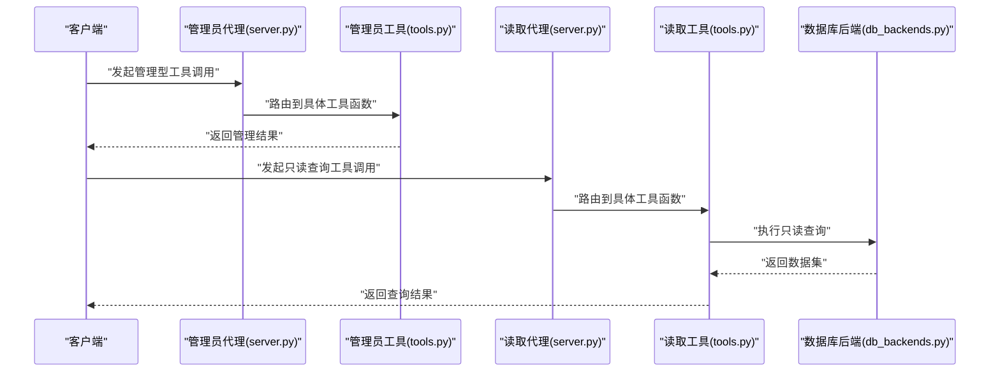
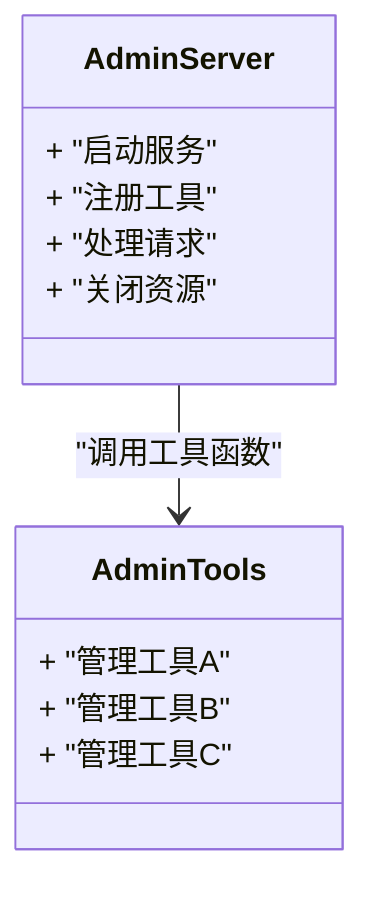
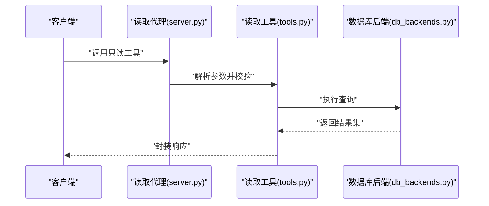
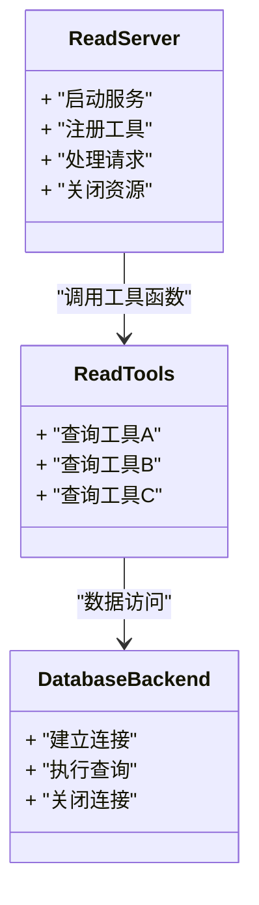
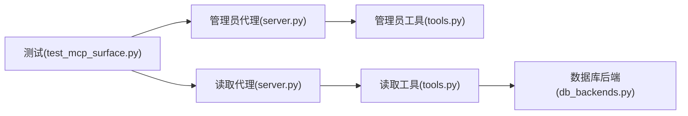

# MCP代理系统

<cite>
**本文引用的文件**   
- [apps/quant-admin-mcp/server.py](file://apps/quant-admin-mcp/server.py)
- [apps/quant-admin-mcp/tools.py](file://apps/quant-admin-mcp/tools.py)
- [apps/quant-read-mcp/server.py](file://apps/quant-read-mcp/server.py)
- [apps/quant-read-mcp/tools.py](file://apps/quant-read-mcp/tools.py)
- [apps/quant-read-mcp/db_backends.py](file://apps/quant-read-mcp/db_backends.py)
- [tests/unit/test_mcp_surface.py](file://tests/unit/test_mcp_surface.py)
</cite>

## 目录
1. [简介](#简介)
2. [项目结构](#项目结构)
3. [核心组件](#核心组件)
4. [架构总览](#架构总览)
5. [详细组件分析](#详细组件分析)
6. [依赖关系分析](#依赖关系分析)
7. [性能考虑](#性能考虑)
8. [故障排查指南](#故障排查指南)
9. [结论](#结论)
10. [附录](#附录)

## 简介
本技术文档围绕MCP（Model Context Protocol）代理系统，聚焦以下目标：
- 代理生命周期管理：从启动、工具注册到请求处理与资源释放的完整流程。
- 工具注册机制：如何声明、注册并暴露工具供上层调用。
- 上下文传递原理：在跨进程或跨服务调用中，如何将配置、连接、审计等上下文安全地传递。
- 管理员代理与读取代理的实现细节、调用关系、接口设计和使用模式。
- 结合仓库中的实际代码路径进行说明，提供可复现的配置项、参数与返回值约定。
- 解释与其他组件的关系，给出常见问题及解决方案。

## 项目结构
MCP相关实现位于两个应用子包中：
- 管理员代理：apps/quant-admin-mcp
- 读取代理：apps/quant-read-mcp

此外，单元测试覆盖MCP表面能力，便于验证集成行为。

图示来源
- [apps/quant-admin-mcp/server.py](file://apps/quant-admin-mcp/server.py)
- [apps/quant-admin-mcp/tools.py](file://apps/quant-admin-mcp/tools.py)
- [apps/quant-read-mcp/server.py](file://apps/quant-read-mcp/server.py)
- [apps/quant-read-mcp/tools.py](file://apps/quant-read-mcp/tools.py)
- [apps/quant-read-mcp/db_backends.py](file://apps/quant-read-mcp/db_backends.py)
- [tests/unit/test_mcp_surface.py](file://tests/unit/test_mcp_surface.py)

章节来源
- [apps/quant-admin-mcp/server.py](file://apps/quant-admin-mcp/server.py)
- [apps/quant-admin-mcp/tools.py](file://apps/quant-admin-mcp/tools.py)
- [apps/quant-read-mcp/server.py](file://apps/quant-read-mcp/server.py)
- [apps/quant-read-mcp/tools.py](file://apps/quant-read-mcp/tools.py)
- [apps/quant-read-mcp/db_backends.py](file://apps/quant-read-mcp/db_backends.py)
- [tests/unit/test_mcp_surface.py](file://tests/unit/test_mcp_surface.py)

## 核心组件
- 管理员代理（Admin MCP Server）
  - 负责管理型操作的工具注册与执行，通常涉及写入、变更或控制面操作。
  - 入口：server.py；工具定义：tools.py。
- 读取代理（Read MCP Server）
  - 负责只读查询类操作，通过数据库后端访问数据。
  - 入口：server.py；工具定义：tools.py；数据访问：db_backends.py。
- 测试覆盖
  - 针对MCP表面的集成测试，用于验证工具注册、调用与返回格式。

章节来源
- [apps/quant-admin-mcp/server.py](file://apps/quant-admin-mcp/server.py)
- [apps/quant-admin-mcp/tools.py](file://apps/quant-admin-mcp/tools.py)
- [apps/quant-read-mcp/server.py](file://apps/quant-read-mcp/server.py)
- [apps/quant-read-mcp/tools.py](file://apps/quant-read-mcp/tools.py)
- [apps/quant-read-mcp/db_backends.py](file://apps/quant-read-mcp/db_backends.py)
- [tests/unit/test_mcp_surface.py](file://tests/unit/test_mcp_surface.py)

## 架构总览
下图展示了管理员代理与读取代理的整体交互关系，包括工具注册、上下文传递与数据访问路径。

图示来源
- [apps/quant-admin-mcp/server.py](file://apps/quant-admin-mcp/server.py)
- [apps/quant-admin-mcp/tools.py](file://apps/quant-admin-mcp/tools.py)
- [apps/quant-read-mcp/server.py](file://apps/quant-read-mcp/server.py)
- [apps/quant-read-mcp/tools.py](file://apps/quant-read-mcp/tools.py)
- [apps/quant-read-mcp/db_backends.py](file://apps/quant-read-mcp/db_backends.py)

## 详细组件分析

### 管理员代理（Admin MCP Server）
- 职责
  - 启动MCP服务器实例，完成工具注册。
  - 接收来自客户端的管理型工具调用，交由对应工具函数处理。
  - 维护必要的上下文（如配置、权限、审计信息），并在工具间共享。
- 关键文件
  - server.py：服务器初始化、工具注册、生命周期钩子。
  - tools.py：管理型工具的具体实现。
- 使用模式
  - 外部通过MCP协议调用管理员工具，例如创建、更新、删除等写操作。
  - 工具函数应遵循统一的输入输出契约，确保可观测性与错误语义一致。

章节来源
- [apps/quant-admin-mcp/server.py](file://apps/quant-admin-mcp/server.py)
- [apps/quant-admin-mcp/tools.py](file://apps/quant-admin-mcp/tools.py)

#### 管理员代理类图（概念映射）

图示来源
- [apps/quant-admin-mcp/server.py](file://apps/quant-admin-mcp/server.py)
- [apps/quant-admin-mcp/tools.py](file://apps/quant-admin-mcp/tools.py)

### 读取代理（Read MCP Server）
- 职责
  - 启动MCP服务器实例，完成只读工具的注册。
  - 将查询请求路由至工具函数，并通过数据库后端获取数据。
  - 保证上下文（如连接池、查询超时、审计标签）在调用链中正确传递。
- 关键文件
  - server.py：服务器初始化、工具注册、生命周期管理。
  - tools.py：只读工具的具体实现。
  - db_backends.py：数据库访问抽象与实现。
- 使用模式
  - 外部通过MCP协议调用只读工具，例如行情、基本面、组合快照等查询。
  - 工具函数应返回结构化数据，便于上层消费与可视化。

章节来源
- [apps/quant-read-mcp/server.py](file://apps/quant-read-mcp/server.py)
- [apps/quant-read-mcp/tools.py](file://apps/quant-read-mcp/tools.py)
- [apps/quant-read-mcp/db_backends.py](file://apps/quant-read-mcp/db_backends.py)

#### 读取代理序列图（典型查询流程）

图示来源
- [apps/quant-read-mcp/server.py](file://apps/quant-read-mcp/server.py)
- [apps/quant-read-mcp/tools.py](file://apps/quant-read-mcp/tools.py)
- [apps/quant-read-mcp/db_backends.py](file://apps/quant-read-mcp/db_backends.py)

#### 读取代理类图（概念映射）

图示来源
- [apps/quant-read-mcp/server.py](file://apps/quant-read-mcp/server.py)
- [apps/quant-read-mcp/tools.py](file://apps/quant-read-mcp/tools.py)
- [apps/quant-read-mcp/db_backends.py](file://apps/quant-read-mcp/db_backends.py)

### 工具注册机制
- 注册时机
  - 服务器启动时集中注册所有可用工具，形成工具清单。
- 注册方式
  - 通过统一注册接口将工具函数与元数据（名称、描述、参数签名）绑定。
- 工具发现
  - 客户端可通过工具列表接口枚举已注册工具，按需调用。
- 版本兼容
  - 工具注册需支持向后兼容，新增字段不应破坏旧客户端。

章节来源
- [apps/quant-admin-mcp/server.py](file://apps/quant-admin-mcp/server.py)
- [apps/quant-read-mcp/server.py](file://apps/quant-read-mcp/server.py)

### 上下文传递原理
- 上下文内容
  - 配置项（如数据库连接、超时、重试策略）。
  - 运行时状态（如会话ID、追踪ID、审计标签）。
- 传递路径
  - 服务器层注入上下文，工具函数通过闭包或显式参数获取。
  - 数据库后端从上下文提取连接与查询选项。
- 隔离与复用
  - 每个请求拥有独立上下文副本，避免并发污染。
  - 连接池等资源在服务器生命周期内复用。

章节来源
- [apps/quant-read-mcp/server.py](file://apps/quant-read-mcp/server.py)
- [apps/quant-read-mcp/tools.py](file://apps/quant-read-mcp/tools.py)
- [apps/quant-read-mcp/db_backends.py](file://apps/quant-read-mcp/db_backends.py)

### 接口设计与使用模式
- 管理员工具
  - 典型操作：创建、更新、删除、批量导入等。
  - 输入：结构化参数对象；输出：操作结果与状态码。
- 读取工具
  - 典型操作：按时间范围、标的、指标维度查询。
  - 输入：查询条件与分页参数；输出：数据集与元数据。
- 错误语义
  - 明确区分业务错误与系统错误，返回一致的错误信封。
- 幂等性
  - 读取工具天然幂等；管理工具建议支持幂等键以避免重复提交。

章节来源
- [apps/quant-admin-mcp/tools.py](file://apps/quant-admin-mcp/tools.py)
- [apps/quant-read-mcp/tools.py](file://apps/quant-read-mcp/tools.py)

### 配置选项、参数与返回值
- 配置项（示例类别）
  - 数据库连接：主机、端口、用户名、密码、连接池大小。
  - 网络与服务：监听地址、端口、超时、重试次数。
  - 日志与观测：日志级别、采样率、追踪端点。
- 工具参数
  - 必填/可选字段、类型约束、默认值、取值范围。
- 返回值
  - 成功：包含数据主体与元数据（页码、总数、耗时）。
  - 失败：错误码、错误消息、诊断信息。

章节来源
- [apps/quant-read-mcp/db_backends.py](file://apps/quant-read-mcp/db_backends.py)
- [apps/quant-read-mcp/tools.py](file://apps/quant-read-mcp/tools.py)
- [apps/quant-admin-mcp/tools.py](file://apps/quant-admin-mcp/tools.py)

### 与其他组件的关系
- 与API网关/调度器
  - 作为内部服务被上层编排调用，提供稳定的工具接口。
- 与数据源与存储
  - 读取代理通过数据库后端访问持久化数据。
- 与可观测性
  - 通过审计与指标上报，记录工具调用与异常。

章节来源
- [apps/quant-read-mcp/db_backends.py](file://apps/quant-read-mcp/db_backends.py)
- [tests/unit/test_mcp_surface.py](file://tests/unit/test_mcp_surface.py)

## 依赖关系分析

图示来源
- [apps/quant-admin-mcp/server.py](file://apps/quant-admin-mcp/server.py)
- [apps/quant-admin-mcp/tools.py](file://apps/quant-admin-mcp/tools.py)
- [apps/quant-read-mcp/server.py](file://apps/quant-read-mcp/server.py)
- [apps/quant-read-mcp/tools.py](file://apps/quant-read-mcp/tools.py)
- [apps/quant-read-mcp/db_backends.py](file://apps/quant-read-mcp/db_backends.py)
- [tests/unit/test_mcp_surface.py](file://tests/unit/test_mcp_surface.py)

章节来源
- [apps/quant-admin-mcp/server.py](file://apps/quant-admin-mcp/server.py)
- [apps/quant-admin-mcp/tools.py](file://apps/quant-admin-mcp/tools.py)
- [apps/quant-read-mcp/server.py](file://apps/quant-read-mcp/server.py)
- [apps/quant-read-mcp/tools.py](file://apps/quant-read-mcp/tools.py)
- [apps/quant-read-mcp/db_backends.py](file://apps/quant-read-mcp/db_backends.py)
- [tests/unit/test_mcp_surface.py](file://tests/unit/test_mcp_surface.py)

## 性能考虑
- 连接池与复用
  - 数据库连接应在服务器生命周期内复用，减少握手开销。
- 查询优化
  - 合理分页、索引命中、避免全表扫描。
- 超时与重试
  - 为I/O设置合理的超时与退避重试策略，避免雪崩。
- 并发模型
  - 根据部署环境选择同步/异步模型，注意锁粒度与资源竞争。
- 监控与告警
  - 对慢查询、错误率、吞吐进行监控，及时定位瓶颈。

[本节为通用指导，不直接分析具体文件]

## 故障排查指南
- 常见问题
  - 工具未注册：检查服务器启动时的注册逻辑是否执行。
  - 上下文缺失：确认上下文注入是否在请求链路早期完成。
  - 数据库连接失败：核对连接参数、网络连通性与权限。
  - 超时与重试：调整超时阈值与重试策略，观察错误分布。
- 定位方法
  - 查看工具调用日志与追踪ID。
  - 使用测试用例复现场景，缩小问题范围。
- 恢复措施
  - 重启服务以重建连接池。
  - 回滚最近变更，逐步回归定位。

章节来源
- [tests/unit/test_mcp_surface.py](file://tests/unit/test_mcp_surface.py)
- [apps/quant-read-mcp/db_backends.py](file://apps/quant-read-mcp/db_backends.py)

## 结论
MCP代理系统通过清晰的分层与职责划分，实现了管理员与读取两类代理的稳定运行。工具注册机制与上下文传递确保了可扩展性与一致性。配合完善的测试与可观测性，可在复杂生产环境中可靠交付。

[本节为总结性内容，不直接分析具体文件]

## 附录
- 术语
  - MCP：Model Context Protocol，模型上下文协议。
  - 管理员代理：面向管理型操作的MCP服务。
  - 读取代理：面向只读查询的MCP服务。
- 参考路径
  - 管理员代理：apps/quant-admin-mcp/server.py、apps/quant-admin-mcp/tools.py
  - 读取代理：apps/quant-read-mcp/server.py、apps/quant-read-mcp/tools.py、apps/quant-read-mcp/db_backends.py
  - 测试：tests/unit/test_mcp_surface.py

[本节为补充信息，不直接分析具体文件]