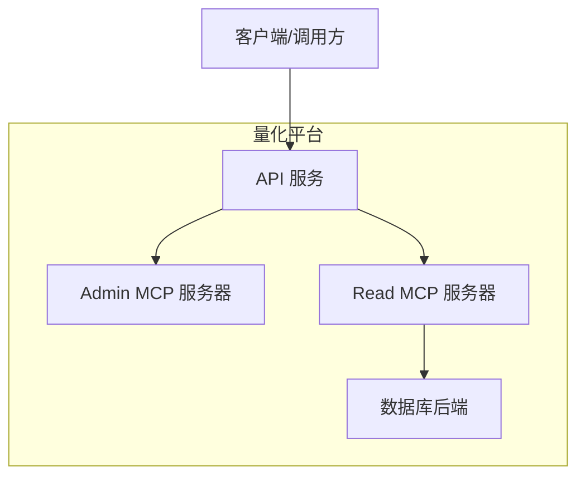
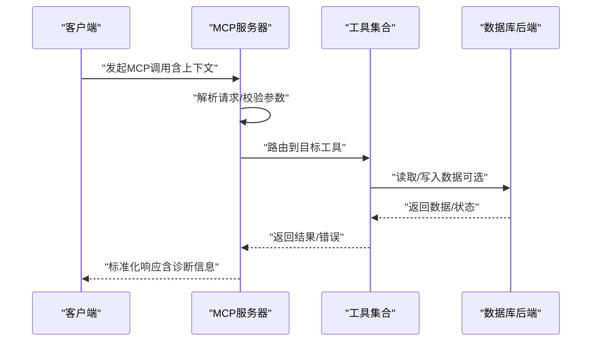
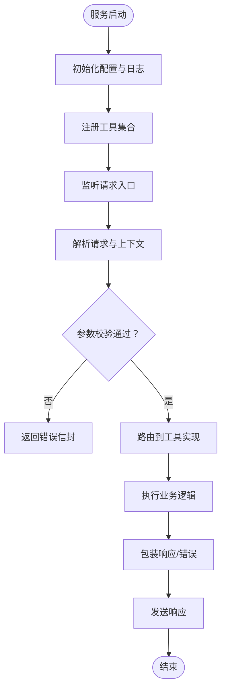
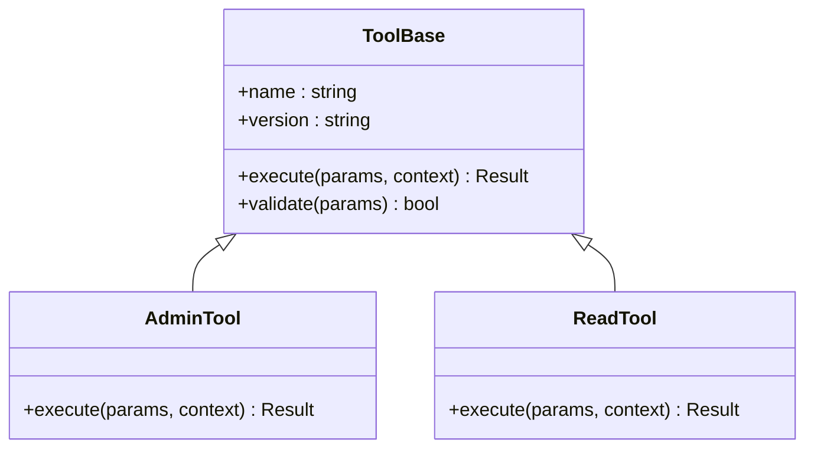
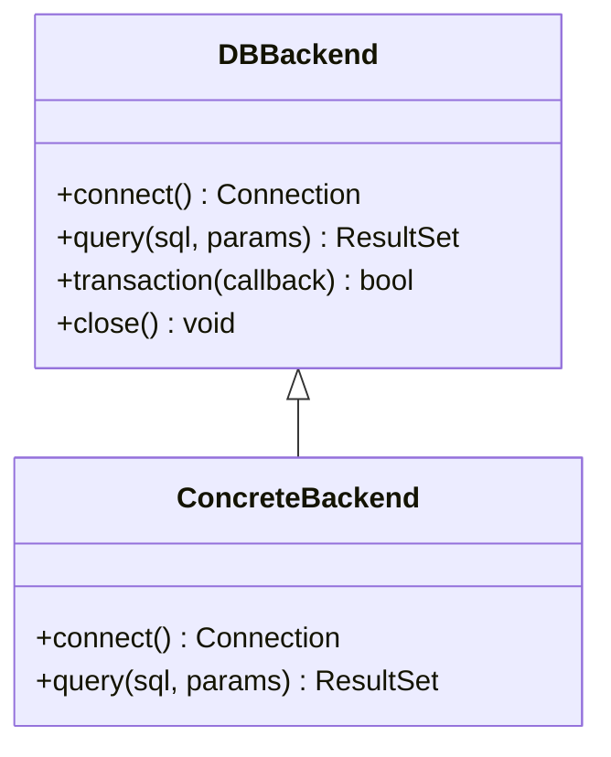

# MCP协议基础

<cite>
**本文引用的文件**   
- [apps/quant-admin-mcp/server.py](file://apps/quant-admin-mcp/server.py)
- [apps/quant-admin-mcp/tools.py](file://apps/quant-admin-mcp/tools.py)
- [apps/quant-read-mcp/server.py](file://apps/quant-read-mcp/server.py)
- [apps/quant-read-mcp/tools.py](file://apps/quant-read-mcp/tools.py)
- [apps/quant-read-mcp/db_backends.py](file://apps/quant-read-mcp/db_backends.py)
- [tests/unit/test_mcp_surface.py](file://tests/unit/test_mcp_surface.py)
</cite>

## 目录
1. [简介](#简介)
2. [项目结构](#项目结构)
3. [核心组件](#核心组件)
4. [架构总览](#架构总览)
5. [详细组件分析](#详细组件分析)
6. [依赖关系分析](#依赖关系分析)
7. [性能考虑](#性能考虑)
8. [故障排查指南](#故障排查指南)
9. [结论](#结论)
10. [附录](#附录)

## 简介
本文件面向希望基于MCP（Model Context Protocol）构建自定义代理的开发者，系统阐述该仓库中MCP相关实现的核心概念、通信机制与消息格式。文档聚焦于：
- 代理间通信的握手流程、上下文传递与错误处理策略
- 协议版本兼容性与安全考量
- 性能优化建议与扩展点
- 如何基于现有代码快速搭建可运行的MCP服务与工具

为便于不同层次读者理解，文档采用由浅入深的结构，并辅以架构图、时序图与流程图帮助建立整体认知。

## 项目结构
本项目将MCP能力以“MCP服务器+工具”的方式组织在两个应用子包中：
- quant-admin-mcp：提供管理侧MCP服务与工具
- quant-read-mcp：提供读取侧MCP服务与工具，包含数据库后端抽象

图表来源
- [apps/quant-admin-mcp/server.py](file://apps/quant-admin-mcp/server.py)
- [apps/quant-read-mcp/server.py](file://apps/quant-read-mcp/server.py)
- [apps/quant-read-mcp/db_backends.py](file://apps/quant-read-mcp/db_backends.py)

章节来源
- [apps/quant-admin-mcp/server.py](file://apps/quant-admin-mcp/server.py)
- [apps/quant-admin-mcp/tools.py](file://apps/quant-admin-mcp/tools.py)
- [apps/quant-read-mcp/server.py](file://apps/quant-read-mcp/server.py)
- [apps/quant-read-mcp/tools.py](file://apps/quant-read-mcp/tools.py)
- [apps/quant-read-mcp/db_backends.py](file://apps/quant-read-mcp/db_backends.py)

## 核心组件
- MCP服务器（Server）
  - 负责启动MCP服务、注册工具、处理请求与响应、维护会话上下文
  - 典型职责包括：初始化配置、加载工具集、暴露RPC接口、生命周期管理
- 工具（Tools）
  - 封装具体业务能力，作为MCP可调用的最小单元
  - 输入输出遵循统一的参数与结果约定，支持错误码与诊断信息
- 数据后端（DB Backends）
  - 对数据库访问进行抽象，屏蔽底层差异，供读取侧工具复用
- 测试表面（Test Surface）
  - 提供端到端或集成测试入口，验证MCP服务的可用性与契约一致性

章节来源
- [apps/quant-admin-mcp/server.py](file://apps/quant-admin-mcp/server.py)
- [apps/quant-admin-mcp/tools.py](file://apps/quant-admin-mcp/tools.py)
- [apps/quant-read-mcp/server.py](file://apps/quant-read-mcp/server.py)
- [apps/quant-read-mcp/tools.py](file://apps/quant-read-mcp/tools.py)
- [apps/quant-read-mcp/db_backends.py](file://apps/quant-read-mcp/db_backends.py)
- [tests/unit/test_mcp_surface.py](file://tests/unit/test_mcp_surface.py)

## 架构总览
下图展示了MCP在系统中的位置与交互方式：客户端通过统一入口调用MCP服务器，服务器根据路由将请求分发到对应工具；读取侧工具通过后端抽象访问数据库。

图表来源
- [apps/quant-admin-mcp/server.py](file://apps/quant-admin-mcp/server.py)
- [apps/quant-admin-mcp/tools.py](file://apps/quant-admin-mcp/tools.py)
- [apps/quant-read-mcp/server.py](file://apps/quant-read-mcp/server.py)
- [apps/quant-read-mcp/tools.py](file://apps/quant-read-mcp/tools.py)
- [apps/quant-read-mcp/db_backends.py](file://apps/quant-read-mcp/db_backends.py)

## 详细组件分析

### MCP服务器（Server）
- 功能要点
  - 初始化与配置加载：从配置文件或环境变量注入连接参数、日志级别等
  - 工具注册：集中注册工具元数据与实现，形成可发现的服务清单
  - 请求处理：解析入参、校验必填字段、执行工具、包装响应
  - 上下文传递：在调用链中携带会话ID、追踪ID、权限信息等
  - 错误处理：捕获异常并转换为标准错误信封，包含错误码与诊断信息
- 关键流程
  - 启动：创建服务实例、注册工具、绑定端口/通道
  - 接收请求：反序列化、鉴权、限流、路由
  - 执行工具：按工具名匹配实现，传入上下文与参数
  - 返回响应：序列化、记录指标、清理资源

图表来源
- [apps/quant-admin-mcp/server.py](file://apps/quant-admin-mcp/server.py)
- [apps/quant-read-mcp/server.py](file://apps/quant-read-mcp/server.py)

章节来源
- [apps/quant-admin-mcp/server.py](file://apps/quant-admin-mcp/server.py)
- [apps/quant-read-mcp/server.py](file://apps/quant-read-mcp/server.py)

### 工具（Tools）
- 设计原则
  - 单一职责：每个工具聚焦一个明确的能力边界
  - 幂等性：尽量保证重复调用不会产生副作用或可恢复
  - 可观测性：记录必要指标与诊断信息
- 输入输出规范
  - 输入：结构化参数对象，包含必填项校验与默认值
  - 输出：统一结果信封，包含数据体、状态码、错误信息与追踪ID
- 错误处理
  - 业务错误：返回明确的错误码与提示，便于上层重试或降级
  - 系统错误：捕获未预期异常，记录堆栈并返回通用错误信封

图表来源
- [apps/quant-admin-mcp/tools.py](file://apps/quant-admin-mcp/tools.py)
- [apps/quant-read-mcp/tools.py](file://apps/quant-read-mcp/tools.py)

章节来源
- [apps/quant-admin-mcp/tools.py](file://apps/quant-admin-mcp/tools.py)
- [apps/quant-read-mcp/tools.py](file://apps/quant-read-mcp/tools.py)

### 数据后端（DB Backends）
- 抽象层
  - 定义统一的查询/写入接口，屏蔽不同数据库的差异
  - 提供连接池、事务、重试与超时控制
- 使用方式
  - 读取工具通过后端接口获取数据，避免直接耦合具体驱动
  - 支持多后端切换，便于测试与灰度发布

图表来源
- [apps/quant-read-mcp/db_backends.py](file://apps/quant-read-mcp/db_backends.py)

章节来源
- [apps/quant-read-mcp/db_backends.py](file://apps/quant-read-mcp/db_backends.py)

### 测试表面（Test Surface）
- 作用
  - 提供MCP服务可用性验证与契约测试
  - 覆盖正常路径与错误路径，确保行为稳定
- 关注点
  - 端到端调用链路验证
  - 错误信封结构与字段完整性
  - 上下文传递的正确性

章节来源
- [tests/unit/test_mcp_surface.py](file://tests/unit/test_mcp_surface.py)

## 依赖关系分析
- 模块内聚与耦合
  - Server与Tools之间通过注册表解耦，降低直接依赖
  - Tools与DB Backend通过抽象接口隔离，提升可替换性
- 外部依赖
  - 数据库驱动、日志框架、配置中心、监控埋点等
- 潜在循环依赖
  - 当前结构未见明显循环引用；新增模块时应保持单向依赖

图表来源
- [apps/quant-admin-mcp/server.py](file://apps/quant-admin-mcp/server.py)
- [apps/quant-admin-mcp/tools.py](file://apps/quant-admin-mcp/tools.py)
- [apps/quant-read-mcp/server.py](file://apps/quant-read-mcp/server.py)
- [apps/quant-read-mcp/tools.py](file://apps/quant-read-mcp/tools.py)
- [apps/quant-read-mcp/db_backends.py](file://apps/quant-read-mcp/db_backends.py)
- [tests/unit/test_mcp_surface.py](file://tests/unit/test_mcp_surface.py)

章节来源
- [apps/quant-admin-mcp/server.py](file://apps/quant-admin-mcp/server.py)
- [apps/quant-admin-mcp/tools.py](file://apps/quant-admin-mcp/tools.py)
- [apps/quant-read-mcp/server.py](file://apps/quant-read-mcp/server.py)
- [apps/quant-read-mcp/tools.py](file://apps/quant-read-mcp/tools.py)
- [apps/quant-read-mcp/db_backends.py](file://apps/quant-read-mcp/db_backends.py)
- [tests/unit/test_mcp_surface.py](file://tests/unit/test_mcp_surface.py)

## 性能考虑
- 连接与资源管理
  - 使用连接池与对象复用，减少频繁创建销毁开销
  - 合理设置超时与重试次数，避免雪崩效应
- 并发与吞吐
  - 异步I/O与批量处理结合，提高吞吐
  - 限制最大并发数，保护下游资源
- 缓存与去重
  - 热点数据本地缓存，注意失效策略与一致性
  - 对幂等请求做去重，避免重复计算
- 可观测性
  - 记录关键指标（延迟、错误率、吞吐），配合告警与看板
  - 分布式追踪贯穿调用链，便于定位瓶颈

[本节为通用指导，不直接分析具体文件]

## 故障排查指南
- 常见问题
  - 参数校验失败：检查必填字段与类型约束
  - 工具未注册：确认服务启动时是否完成工具注册
  - 数据库连接失败：检查连接串、权限与网络连通性
  - 超时与重试：调整超时阈值与重试策略
- 诊断手段
  - 查看错误信封中的错误码与诊断信息
  - 启用调试日志与追踪ID，定位问题根因
  - 使用测试表面复现问题，缩小范围

章节来源
- [tests/unit/test_mcp_surface.py](file://tests/unit/test_mcp_surface.py)

## 结论
本仓库以清晰的模块化方式实现了MCP协议的基础能力：服务器负责请求路由与上下文管理，工具封装业务能力，数据后端抽象数据库访问。通过统一的错误信封与可观测性设计，提升了系统的可维护性与稳定性。建议在后续迭代中持续完善版本兼容性矩阵、安全策略与性能基准，以满足更广泛的场景需求。

[本节为总结性内容，不直接分析具体文件]

## 附录

### 协议版本兼容性
- 建议做法
  - 在工具与服务元数据中标明协议版本
  - 服务端提供向后兼容的路由或适配器，逐步迁移
  - 客户端在握手阶段协商版本，选择合适实现

[本节为通用指导，不直接分析具体文件]

### 安全考虑
- 认证与授权
  - 在服务入口实施身份校验与权限控制
  - 对敏感操作增加二次确认与审计日志
- 数据安全
  - 传输加密（TLS）、敏感字段脱敏
  - 输入严格校验与白名单过滤，防止注入攻击
- 资源保护
  - 限流与熔断，避免恶意请求导致资源耗尽

[本节为通用指导，不直接分析具体文件]

### 扩展点与最佳实践
- 扩展点
  - 新增工具：在工具注册表中声明元数据与实现
  - 新增后端：实现数据库后端抽象接口并注册
  - 中间件：在请求前后插入横切逻辑（如审计、指标采集）
- 最佳实践
  - 保持工具幂等与可重试
  - 统一错误模型与诊断信息
  - 充分单元测试与集成测试覆盖

[本节为通用指导，不直接分析具体文件]

### 示例：基于MCP构建自定义代理
- 步骤概览
  - 新建工具类，实现输入校验与业务逻辑
  - 在服务器启动时注册工具
  - 编写测试用例验证契约与错误路径
  - 部署并接入监控与日志
- 参考路径
  - 工具实现参考：[apps/quant-admin-mcp/tools.py](file://apps/quant-admin-mcp/tools.py)、[apps/quant-read-mcp/tools.py](file://apps/quant-read-mcp/tools.py)
  - 服务器注册参考：[apps/quant-admin-mcp/server.py](file://apps/quant-admin-mcp/server.py)、[apps/quant-read-mcp/server.py](file://apps/quant-read-mcp/server.py)
  - 测试参考：[tests/unit/test_mcp_surface.py](file://tests/unit/test_mcp_surface.py)

章节来源
- [apps/quant-admin-mcp/tools.py](file://apps/quant-admin-mcp/tools.py)
- [apps/quant-read-mcp/tools.py](file://apps/quant-read-mcp/tools.py)
- [apps/quant-admin-mcp/server.py](file://apps/quant-admin-mcp/server.py)
- [apps/quant-read-mcp/server.py](file://apps/quant-read-mcp/server.py)
- [tests/unit/test_mcp_surface.py](file://tests/unit/test_mcp_surface.py)