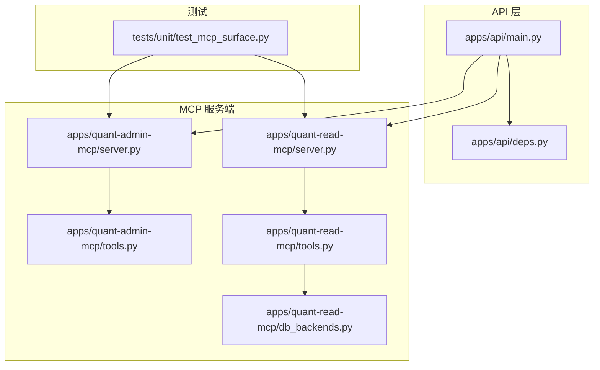
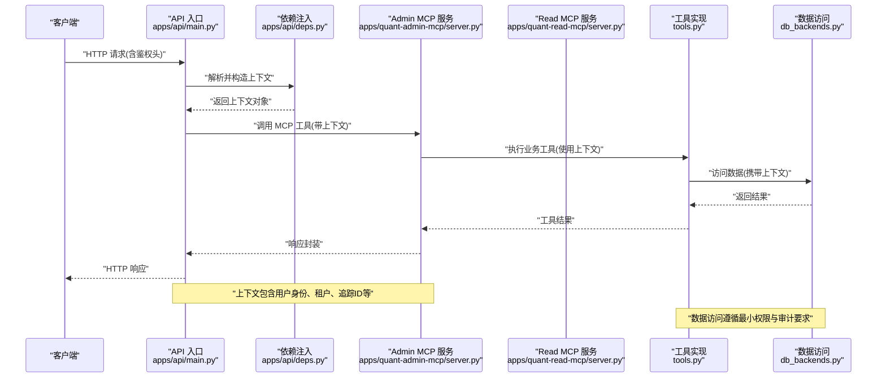
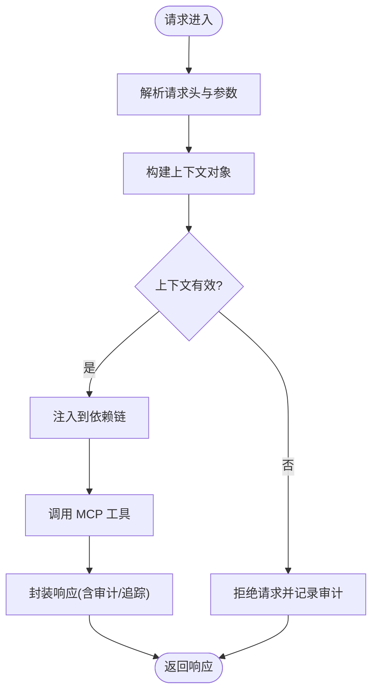
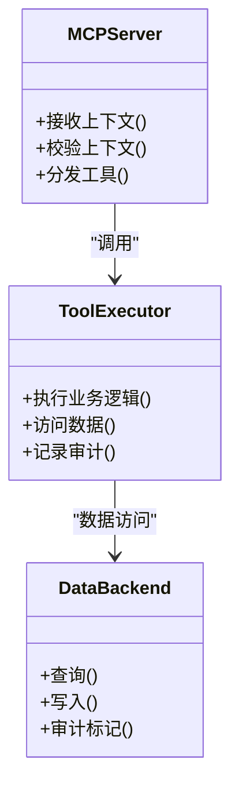
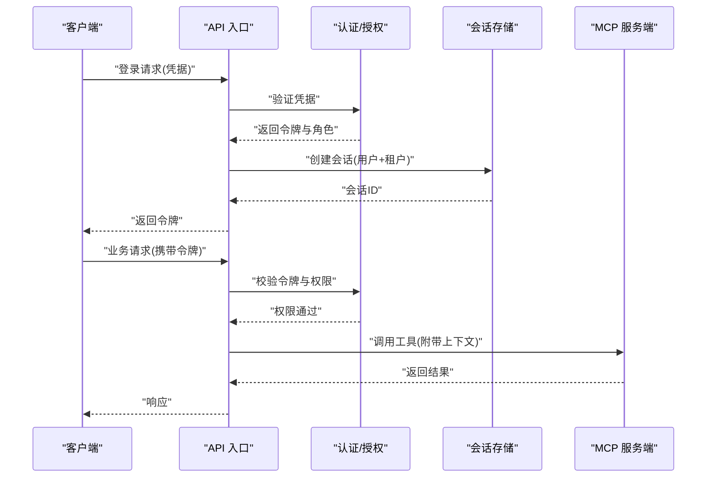
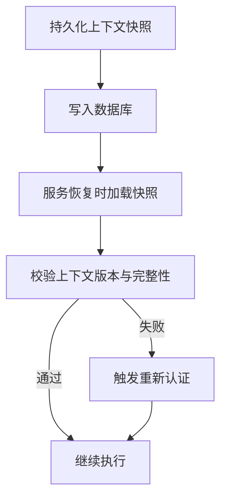
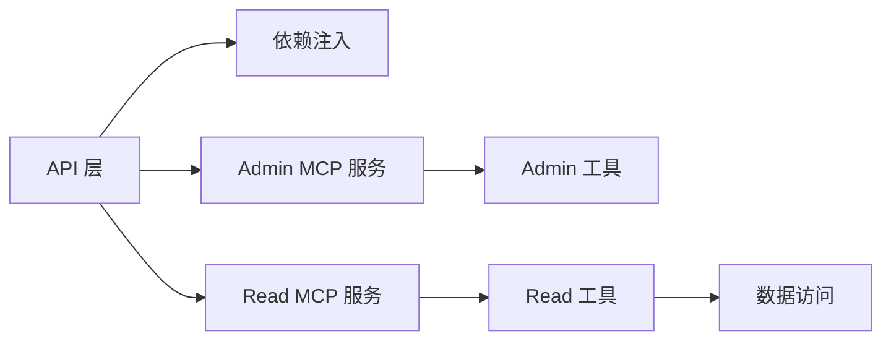

# 上下文管理

<cite>
**本文引用的文件**   
- [apps/api/main.py](file://apps/api/main.py)
- [apps/api/deps.py](file://apps/api/deps.py)
- [apps/quant-admin-mcp/server.py](file://apps/quant-admin-mcp/server.py)
- [apps/quant-read-mcp/server.py](file://apps/quant-read-mcp/server.py)
- [apps/quant-admin-mcp/tools.py](file://apps/quant-admin-mcp/tools.py)
- [apps/quant-read-mcp/tools.py](file://apps/quant-read-mcp/tools.py)
- [apps/quant-read-mcp/db_backends.py](file://apps/quant-read-mcp/db_backends.py)
- [tests/unit/test_mcp_surface.py](file://tests/unit/test_mcp_surface.py)
</cite>

## 目录
1. [简介](#简介)
2. [项目结构](#项目结构)
3. [核心组件](#核心组件)
4. [架构总览](#架构总览)
5. [详细组件分析](#详细组件分析)
6. [依赖关系分析](#依赖关系分析)
7. [性能考量](#性能考量)
8. [故障排查指南](#故障排查指南)
9. [结论](#结论)
10. [附录](#附录) 

## 简介
本技术文档围绕 MCP（Model Context Protocol）上下文管理机制，系统化阐述以下主题：
- 上下文的作用域、继承与传播机制
- 会话状态管理、用户身份认证与权限验证
- 上下文隔离、数据安全与隐私保护
- 上下文持久化、恢复与迁移策略
- 代理间传递业务上下文的实践方式
- 上下文与请求响应的绑定关系
- 常见问题及解决方案

目标读者包括后端工程师、MCP 服务开发者与安全审计人员。

## 项目结构
本项目采用多应用分层组织：API 网关层负责 HTTP 入口与依赖注入；MCP 服务端提供工具能力；测试覆盖关键交互路径。与上下文管理直接相关的代码主要分布在 API 层与 MCP 服务端中。

图表来源
- [apps/api/main.py](file://apps/api/main.py)
- [apps/api/deps.py](file://apps/api/deps.py)
- [apps/quant-admin-mcp/server.py](file://apps/quant-admin-mcp/server.py)
- [apps/quant-read-mcp/server.py](file://apps/quant-read-mcp/server.py)
- [apps/quant-admin-mcp/tools.py](file://apps/quant-admin-mcp/tools.py)
- [apps/quant-read-mcp/tools.py](file://apps/quant-read-mcp/tools.py)
- [apps/quant-read-mcp/db_backends.py](file://apps/quant-read-mcp/db_backends.py)
- [tests/unit/test_mcp_surface.py](file://tests/unit/test_mcp_surface.py)

章节来源
- [apps/api/main.py](file://apps/api/main.py)
- [apps/api/deps.py](file://apps/api/deps.py)
- [apps/quant-admin-mcp/server.py](file://apps/quant-admin-mcp/server.py)
- [apps/quant-read-mcp/server.py](file://apps/quant-read-mcp/server.py)
- [apps/quant-admin-mcp/tools.py](file://apps/quant-admin-mcp/tools.py)
- [apps/quant-read-mcp/tools.py](file://apps/quant-read-mcp/tools.py)
- [apps/quant-read-mcp/db_backends.py](file://apps/quant-read-mcp/db_backends.py)
- [tests/unit/test_mcp_surface.py](file://tests/unit/test_mcp_surface.py)

## 核心组件
- API 入口与依赖注入
  - 负责解析请求头中的身份与会话信息，构建并注入到后续处理链的上下文中。
  - 通过依赖注入将“当前用户”、“租户/环境标识”、“追踪ID”等上下文对象传递给路由处理器与 MCP 调用点。
- MCP 服务端
  - 暴露工具接口，接收来自上层调用的上下文参数，并在工具执行期间维持作用域内的一致性。
  - 在工具内部访问数据库或外部系统时，携带必要的鉴权与审计元数据。
- 工具实现与数据访问
  - 工具函数从传入的上下文读取必要信息（如用户角色、数据源选择），确保跨进程/跨服务的上下文一致性。
  - 数据访问层根据上下文决定连接参数、权限范围与审计标签。
- 测试用例
  - 覆盖 MCP 表面接口的上下文传递、鉴权失败与正常流程，保障上下文行为符合预期。

章节来源
- [apps/api/main.py](file://apps/api/main.py)
- [apps/api/deps.py](file://apps/api/deps.py)
- [apps/quant-admin-mcp/server.py](file://apps/quant-admin-mcp/server.py)
- [apps/quant-read-mcp/server.py](file://apps/quant-read-mcp/server.py)
- [apps/quant-admin-mcp/tools.py](file://apps/quant-admin-mcp/tools.py)
- [apps/quant-read-mcp/tools.py](file://apps/quant-read-mcp/tools.py)
- [apps/quant-read-mcp/db_backends.py](file://apps/quant-read-mcp/db_backends.py)
- [tests/unit/test_mcp_surface.py](file://tests/unit/test_mcp_surface.py)

## 架构总览
下图展示了从 HTTP 请求进入，到 MCP 工具执行的完整上下文流转路径，以及上下文在各层的职责边界。

图表来源
- [apps/api/main.py](file://apps/api/main.py)
- [apps/api/deps.py](file://apps/api/deps.py)
- [apps/quant-admin-mcp/server.py](file://apps/quant-admin-mcp/server.py)
- [apps/quant-read-mcp/server.py](file://apps/quant-read-mcp/server.py)
- [apps/quant-admin-mcp/tools.py](file://apps/quant-admin-mcp/tools.py)
- [apps/quant-read-mcp/tools.py](file://apps/quant-read-mcp/tools.py)
- [apps/quant-read-mcp/db_backends.py](file://apps/quant-read-mcp/db_backends.py)

## 详细组件分析

### 组件A：API 层上下文注入与传播
- 作用域
  - 请求级作用域：每个 HTTP 请求创建独立的上下文实例，避免跨请求污染。
  - 子任务作用域：在异步任务或并发调用中，为每个子任务克隆父上下文并追加任务级元数据。
- 继承与传播
  - 父上下文向下游自动继承，子上下文可叠加只读字段（如追踪ID、操作类型）。
  - 敏感字段（如令牌）在传播前进行脱敏或白名单校验。
- 与请求响应的绑定
  - 响应阶段附加审计日志、耗时统计与追踪ID，便于问题定位。
- 错误处理
  - 对缺失或非法上下文字段进行快速失败，返回明确的错误码与消息。

图表来源
- [apps/api/main.py](file://apps/api/main.py)
- [apps/api/deps.py](file://apps/api/deps.py)

章节来源
- [apps/api/main.py](file://apps/api/main.py)
- [apps/api/deps.py](file://apps/api/deps.py)

### 组件B：MCP 服务端上下文接收与工具执行
- 上下文接收
  - 服务端从调用方传入的上下文提取用户身份、权限集、租户与环境标识。
  - 在服务端入口处进行二次校验，确保上下文未被篡改。
- 工具执行
  - 工具函数以上下文为输入，按最小权限原则访问资源。
  - 工具内部产生的中间状态保存在本地作用域，不泄露到全局。
- 安全与隔离
  - 不同租户/环境的上下文严格隔离，禁止跨租户数据访问。
  - 对敏感输出进行过滤与脱敏。

图表来源
- [apps/quant-admin-mcp/server.py](file://apps/quant-admin-mcp/server.py)
- [apps/quant-read-mcp/server.py](file://apps/quant-read-mcp/server.py)
- [apps/quant-admin-mcp/tools.py](file://apps/quant-admin-mcp/tools.py)
- [apps/quant-read-mcp/tools.py](file://apps/quant-read-mcp/tools.py)
- [apps/quant-read-mcp/db_backends.py](file://apps/quant-read-mcp/db_backends.py)

章节来源
- [apps/quant-admin-mcp/server.py](file://apps/quant-admin-mcp/server.py)
- [apps/quant-read-mcp/server.py](file://apps/quant-read-mcp/server.py)
- [apps/quant-admin-mcp/tools.py](file://apps/quant-admin-mcp/tools.py)
- [apps/quant-read-mcp/tools.py](file://apps/quant-read-mcp/tools.py)
- [apps/quant-read-mcp/db_backends.py](file://apps/quant-read-mcp/db_backends.py)

### 组件C：会话状态管理与用户认证/授权
- 会话状态
  - 会话键由用户ID与租户ID组合生成，保证跨请求的会话一致性。
  - 会话数据仅保留必要的最小集合，降低存储与泄露风险。
- 认证与授权
  - 认证阶段验证令牌签名与有效期；授权阶段基于角色与资源ACL进行细粒度控制。
  - 未认证或越权访问立即拒绝，并记录审计事件。
- 上下文隔离
  - 会话上下文与请求上下文分离，避免会话状态泄漏到其他请求。

图表来源
- [apps/api/main.py](file://apps/api/main.py)
- [apps/api/deps.py](file://apps/api/deps.py)
- [apps/quant-admin-mcp/server.py](file://apps/quant-admin-mcp/server.py)
- [apps/quant-read-mcp/server.py](file://apps/quant-read-mcp/server.py)

章节来源
- [apps/api/main.py](file://apps/api/main.py)
- [apps/api/deps.py](file://apps/api/deps.py)
- [apps/quant-admin-mcp/server.py](file://apps/quant-admin-mcp/server.py)
- [apps/quant-read-mcp/server.py](file://apps/quant-read-mcp/server.py)

### 组件D：上下文持久化、恢复与迁移
- 持久化
  - 会话与审计事件持久化至数据库，确保崩溃后可恢复。
  - 上下文快照仅保存必要字段，避免冗余与敏感信息泄露。
- 恢复
  - 服务重启后，依据会话ID与时间戳重建上下文，必要时触发重新认证。
- 迁移
  - 上下文结构变更通过版本化迁移脚本推进，兼容旧版本客户端。

图表来源
- [apps/quant-read-mcp/db_backends.py](file://apps/quant-read-mcp/db_backends.py)
- [apps/quant-read-mcp/server.py](file://apps/quant-read-mcp/server.py)

章节来源
- [apps/quant-read-mcp/db_backends.py](file://apps/quant-read-mcp/db_backends.py)
- [apps/quant-read-mcp/server.py](file://apps/quant-read-mcp/server.py)

### 组件E：代理间传递业务上下文
- 传递方式
  - 通过 MCP 工具调用参数显式传递上下文对象，避免隐式全局状态。
  - 在工具链中逐级透传，保持上下文一致性与可追溯性。
- 示例路径
  - 参考测试用例中对 MCP 表面接口的调用方式，观察上下文如何从 API 层传递到工具实现。

章节来源
- [tests/unit/test_mcp_surface.py](file://tests/unit/test_mcp_surface.py)
- [apps/quant-admin-mcp/tools.py](file://apps/quant-admin-mcp/tools.py)
- [apps/quant-read-mcp/tools.py](file://apps/quant-read-mcp/tools.py)

## 依赖关系分析
- 耦合与内聚
  - API 层与 MCP 服务端通过清晰的接口契约解耦，上下文作为唯一的数据载体。
  - 工具实现与数据访问层通过上下文参数明确依赖，提升内聚性。
- 外部依赖
  - 数据库访问与审计日志为外部依赖，需考虑超时、重试与降级策略。
- 潜在循环依赖
  - 当前结构未发现循环导入；若新增共享模块，应通过接口抽象避免循环。

图表来源
- [apps/api/main.py](file://apps/api/main.py)
- [apps/api/deps.py](file://apps/api/deps.py)
- [apps/quant-admin-mcp/server.py](file://apps/quant-admin-mcp/server.py)
- [apps/quant-read-mcp/server.py](file://apps/quant-read-mcp/server.py)
- [apps/quant-admin-mcp/tools.py](file://apps/quant-admin-mcp/tools.py)
- [apps/quant-read-mcp/tools.py](file://apps/quant-read-mcp/tools.py)
- [apps/quant-read-mcp/db_backends.py](file://apps/quant-read-mcp/db_backends.py)

章节来源
- [apps/api/main.py](file://apps/api/main.py)
- [apps/api/deps.py](file://apps/api/deps.py)
- [apps/quant-admin-mcp/server.py](file://apps/quant-admin-mcp/server.py)
- [apps/quant-read-mcp/server.py](file://apps/quant-read-mcp/server.py)
- [apps/quant-admin-mcp/tools.py](file://apps/quant-admin-mcp/tools.py)
- [apps/quant-read-mcp/tools.py](file://apps/quant-read-mcp/tools.py)
- [apps/quant-read-mcp/db_backends.py](file://apps/quant-read-mcp/db_backends.py)

## 性能考量
- 上下文开销
  - 避免在上下文中存放大对象，优先使用引用或按需加载。
  - 对高频路径进行上下文字段裁剪，减少序列化与传输成本。
- 并发与隔离
  - 使用线程/协程局部存储或显式参数传递，防止上下文泄漏。
  - 对长事务与慢查询设置超时，避免上下文长时间持有资源。
- 缓存与复用
  - 对只读上下文片段进行缓存，但需考虑失效策略与一致性。

[本节为通用指导，无需特定文件来源]

## 故障排查指南
- 常见症状
  - 上下文缺失或为空：检查请求头解析与依赖注入链路。
  - 权限不足：确认令牌有效性、角色映射与资源 ACL。
  - 会话不一致：核对会话键生成规则与存储一致性。
- 定位方法
  - 启用审计日志与追踪ID，关联请求全链路。
  - 在 MCP 服务端入口打印上下文摘要（脱敏后），对比期望值。
- 修复建议
  - 增加上下文校验的快速失败分支，返回明确错误码。
  - 对异常路径补充单元测试，覆盖边界条件。

章节来源
- [tests/unit/test_mcp_surface.py](file://tests/unit/test_mcp_surface.py)
- [apps/api/deps.py](file://apps/api/deps.py)
- [apps/quant-admin-mcp/server.py](file://apps/quant-admin-mcp/server.py)
- [apps/quant-read-mcp/server.py](file://apps/quant-read-mcp/server.py)

## 结论
本项目的 MCP 上下文管理以“显式传递、最小权限、强隔离”为核心原则，贯穿 API 层、MCP 服务端与工具实现。通过严格的认证授权、审计与持久化策略，保障了上下文的安全性与可恢复性。建议在后续演进中持续优化上下文结构与性能，完善监控与告警，提升整体可观测性与稳定性。

[本节为总结性内容，无需特定文件来源]

## 附录
- 术语
  - 上下文：包含用户身份、租户、环境、追踪ID等元数据的结构化对象。
  - 会话：跨请求的状态容器，用于维持短期业务状态。
  - 工具：MCP 提供的可被远程调用的业务功能单元。
- 最佳实践
  - 始终显式传递上下文，避免隐式全局状态。
  - 对敏感信息进行脱敏与最小可见性控制。
  - 为所有关键路径添加审计与追踪。

[本节为概念性内容，无需特定文件来源]