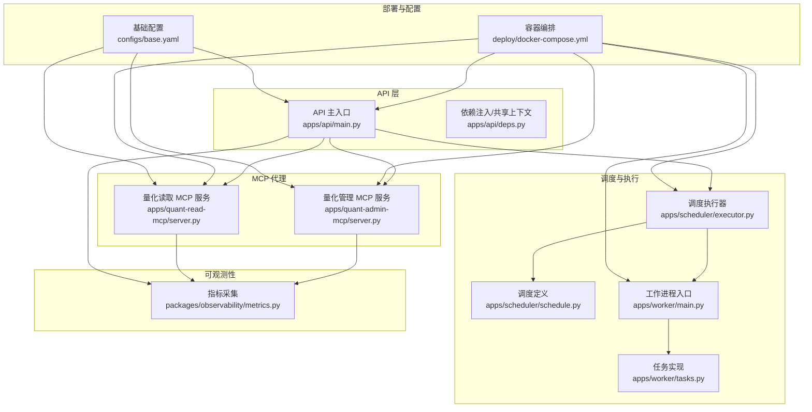
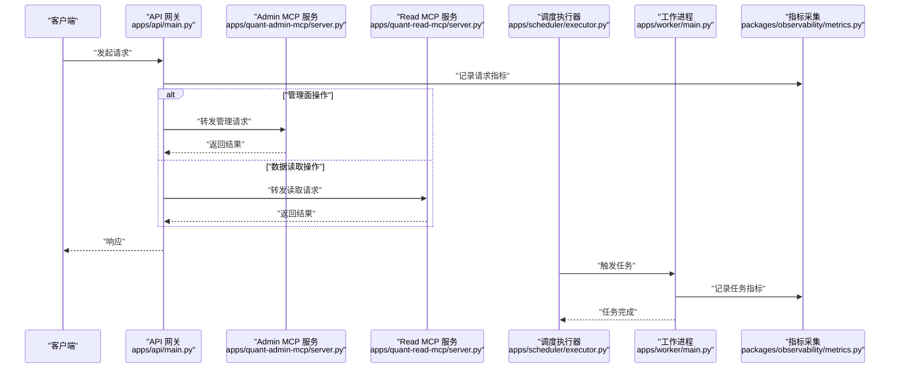
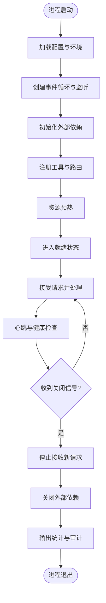
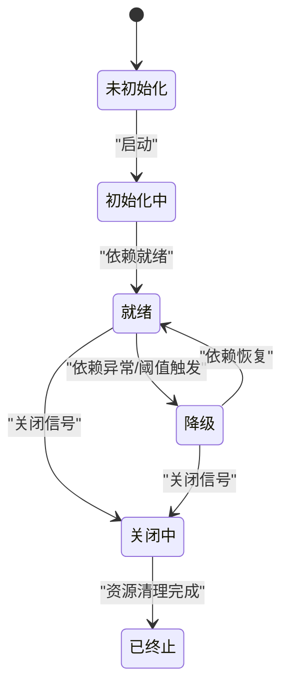
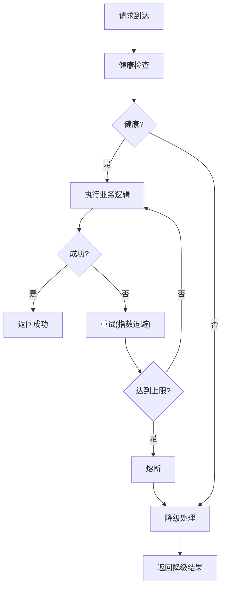
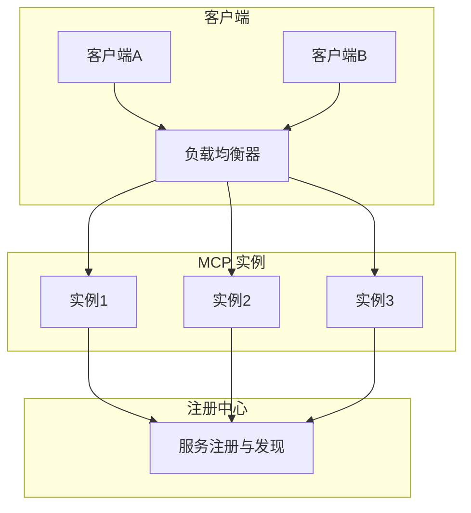
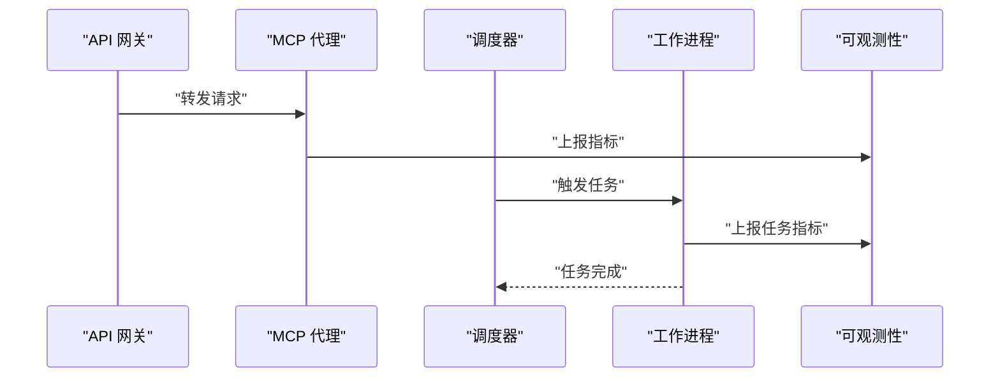
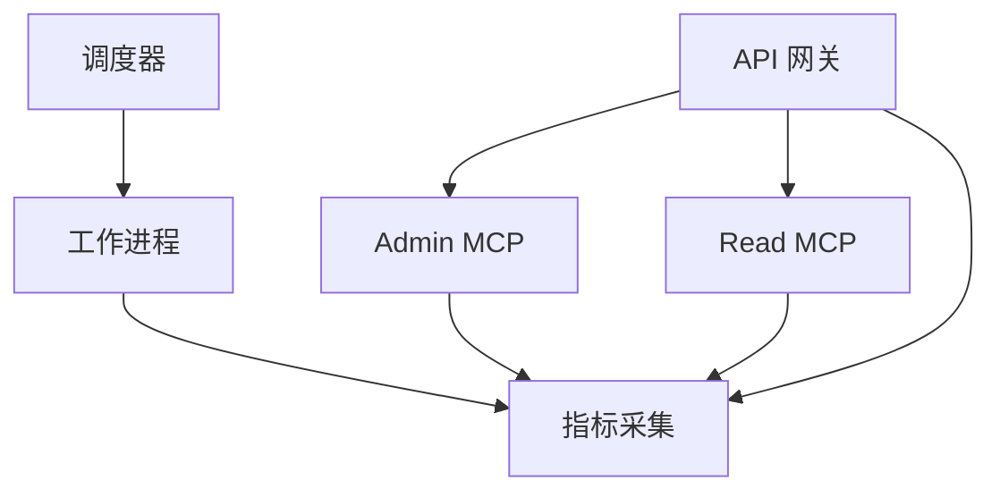

# 代理生命周期管理

<cite>
**本文引用的文件**   
- [apps/quant-admin-mcp/server.py](file://apps/quant-admin-mcp/server.py)
- [apps/quant-read-mcp/server.py](file://apps/quant-read-mcp/server.py)
- [apps/api/main.py](file://apps/api/main.py)
- [apps/api/deps.py](file://apps/api/deps.py)
- [apps/scheduler/executor.py](file://apps/scheduler/executor.py)
- [apps/scheduler/schedule.py](file://apps/scheduler/schedule.py)
- [apps/worker/main.py](file://apps/worker/main.py)
- [apps/worker/tasks.py](file://apps/worker/tasks.py)
- [packages/observability/metrics.py](file://packages/observability/metrics.py)
- [deploy/docker-compose.yml](file://deploy/docker-compose.yml)
- [configs/base.yaml](file://configs/base.yaml)
- [tests/unit/test_mcp_surface.py](file://tests/unit/test_mcp_surface.py)
</cite>

## 目录
1. [简介](#简介)
2. [项目结构](#项目结构)
3. [核心组件](#核心组件)
4. [架构总览](#架构总览)
5. [详细组件分析](#详细组件分析)
6. [依赖关系分析](#依赖关系分析)
7. [性能考量](#性能考量)
8. [故障排查指南](#故障排查指南)
9. [结论](#结论)
10. [附录](#附录)

## 简介
本技术文档围绕“MCP 代理”的完整生命周期展开，覆盖启动、初始化、运行与销毁四个阶段，并深入阐述状态机设计、资源管理、故障恢复、注册发现、负载均衡与容错处理。同时给出配置项说明、监控指标与调试方法，并提供自定义代理生命周期的实现思路与示例路径，帮助读者快速构建可观测、可扩展、高可用的 MCP 代理服务。

## 项目结构
本项目采用多应用分层组织：API 服务、调度器、工作进程以及多个 MCP 子服务（如 quant-admin-mcp、quant-read-mcp）。各 MCP 服务以独立进程运行，通过 API 网关或消息通道进行交互；调度与工作进程负责任务编排与执行；可观测性模块提供统一指标采集。

图表来源
- [apps/api/main.py](file://apps/api/main.py)
- [apps/quant-admin-mcp/server.py](file://apps/quant-admin-mcp/server.py)
- [apps/quant-read-mcp/server.py](file://apps/quant-read-mcp/server.py)
- [apps/scheduler/executor.py](file://apps/scheduler/executor.py)
- [apps/scheduler/schedule.py](file://apps/scheduler/schedule.py)
- [apps/worker/main.py](file://apps/worker/main.py)
- [apps/worker/tasks.py](file://apps/worker/tasks.py)
- [packages/observability/metrics.py](file://packages/observability/metrics.py)
- [deploy/docker-compose.yml](file://deploy/docker-compose.yml)
- [configs/base.yaml](file://configs/base.yaml)

章节来源
- [apps/api/main.py](file://apps/api/main.py)
- [apps/quant-admin-mcp/server.py](file://apps/quant-admin-mcp/server.py)
- [apps/quant-read-mcp/server.py](file://apps/quant-read-mcp/server.py)
- [apps/scheduler/executor.py](file://apps/scheduler/executor.py)
- [apps/scheduler/schedule.py](file://apps/scheduler/schedule.py)
- [apps/worker/main.py](file://apps/worker/main.py)
- [apps/worker/tasks.py](file://apps/worker/tasks.py)
- [packages/observability/metrics.py](file://packages/observability/metrics.py)
- [deploy/docker-compose.yml](file://deploy/docker-compose.yml)
- [configs/base.yaml](file://configs/base.yaml)

## 核心组件
- MCP 代理服务器：每个 MCP 服务（如 quant-admin-mcp、quant-read-mcp）均包含独立的 server 入口，负责生命周期管理、工具注册、请求路由与优雅关闭。
- API 网关：聚合外部调用，转发到对应 MCP 服务，提供鉴权、限流、指标上报等横切能力。
- 调度与工作进程：基于 schedule 定义的任务在 executor 中编排，由 worker 执行具体业务逻辑。
- 可观测性：统一的指标采集与上报，便于监控与告警。
- 配置与部署：通过 YAML 配置与 docker-compose 编排，实现环境隔离与弹性伸缩。

章节来源
- [apps/quant-admin-mcp/server.py](file://apps/quant-admin-mcp/server.py)
- [apps/quant-read-mcp/server.py](file://apps/quant-read-mcp/server.py)
- [apps/api/main.py](file://apps/api/main.py)
- [apps/scheduler/executor.py](file://apps/scheduler/executor.py)
- [apps/scheduler/schedule.py](file://apps/scheduler/schedule.py)
- [apps/worker/main.py](file://apps/worker/main.py)
- [apps/worker/tasks.py](file://apps/worker/tasks.py)
- [packages/observability/metrics.py](file://packages/observability/metrics.py)
- [deploy/docker-compose.yml](file://deploy/docker-compose.yml)
- [configs/base.yaml](file://configs/base.yaml)

## 架构总览
下图展示 MCP 代理在系统中的位置及关键交互：API 作为统一入口，将请求分发至不同 MCP 服务；调度器按策略触发任务，工作进程执行；所有组件上报指标到可观测性后端。

图表来源
- [apps/api/main.py](file://apps/api/main.py)
- [apps/quant-admin-mcp/server.py](file://apps/quant-admin-mcp/server.py)
- [apps/quant-read-mcp/server.py](file://apps/quant-read-mcp/server.py)
- [apps/scheduler/executor.py](file://apps/scheduler/executor.py)
- [apps/worker/main.py](file://apps/worker/main.py)
- [packages/observability/metrics.py](file://packages/observability/metrics.py)

## 详细组件分析

### MCP 代理生命周期（启动、初始化、运行、销毁）
- 启动阶段
  - 加载配置与环境变量，解析端口、日志级别、连接参数等。
  - 创建事件循环与网络监听，绑定地址与端口。
  - 注册健康检查端点与版本信息。
- 初始化阶段
  - 建立外部依赖连接（数据库、缓存、消息队列等）。
  - 注册工具与方法，构建路由表。
  - 预热必要资源（索引、模型、缓存键）。
- 运行阶段
  - 接受请求，进行鉴权、限流、参数校验。
  - 执行业务逻辑，更新内部状态与指标。
  - 周期性心跳与健康检查，上报存活状态。
- 销毁阶段
  - 停止接收新请求，等待在途请求完成。
  - 关闭外部连接，释放锁与临时资源。
  - 输出最终统计与审计日志，退出进程。

图表来源
- [apps/quant-admin-mcp/server.py](file://apps/quant-admin-mcp/server.py)
- [apps/quant-read-mcp/server.py](file://apps/quant-read-mcp/server.py)

章节来源
- [apps/quant-admin-mcp/server.py](file://apps/quant-admin-mcp/server.py)
- [apps/quant-read-mcp/server.py](file://apps/quant-read-mcp/server.py)

### 代理状态机设计
- 状态定义
  - 未初始化：进程已启动但依赖未就绪。
  - 初始化中：正在建立连接与注册工具。
  - 就绪：可接受请求。
  - 降级：部分依赖不可用，仅允许只读或受限功能。
  - 关闭中：停止接收新请求，等待在途请求完成。
  - 已终止：资源全部释放，进程退出。
- 状态转换规则
  - 未初始化 → 初始化中：启动后进入。
  - 初始化中 → 就绪：依赖就绪且健康检查通过。
  - 就绪 → 降级：依赖异常或阈值触发。
  - 降级 → 就绪：依赖恢复。
  - 就绪/降级 → 关闭中：收到关闭信号。
  - 关闭中 → 已终止：资源清理完成。

图表来源
- [apps/quant-admin-mcp/server.py](file://apps/quant-admin-mcp/server.py)
- [apps/quant-read-mcp/server.py](file://apps/quant-read-mcp/server.py)

章节来源
- [apps/quant-admin-mcp/server.py](file://apps/quant-admin-mcp/server.py)
- [apps/quant-read-mcp/server.py](file://apps/quant-read-mcp/server.py)

### 资源管理与故障恢复机制
- 资源管理
  - 连接池：数据库、缓存、消息队列使用连接池，设置最大连接数与空闲超时。
  - 内存与文件句柄：限制并发与打开文件数，避免资源泄漏。
  - 定时任务：使用调度器统一管理，支持幂等与重试。
- 故障恢复
  - 重试与退避：对瞬时错误采用指数退避与抖动策略。
  - 熔断与降级：当错误率超过阈值时熔断下游，切换到降级模式。
  - 健康检查：探针定期探测依赖可用性，动态调整流量。
  - 优雅关闭：确保在途请求完成后再释放资源。

图表来源
- [apps/quant-admin-mcp/server.py](file://apps/quant-admin-mcp/server.py)
- [apps/quant-read-mcp/server.py](file://apps/quant-read-mcp/server.py)
- [packages/observability/metrics.py](file://packages/observability/metrics.py)

章节来源
- [apps/quant-admin-mcp/server.py](file://apps/quant-admin-mcp/server.py)
- [apps/quant-read-mcp/server.py](file://apps/quant-read-mcp/server.py)
- [packages/observability/metrics.py](file://packages/observability/metrics.py)

### 代理注册发现、负载均衡与容错处理
- 注册发现
  - 服务启动后向注册中心注册自身实例（IP、端口、健康状态）。
  - 消费者从注册中心获取可用实例列表，动态更新本地缓存。
- 负载均衡
  - 客户端侧负载均衡：轮询、随机、最少连接、一致性哈希等策略。
  - 服务端侧负载均衡：反向代理根据权重与容量分配流量。
- 容错处理
  - 失败转移：单个实例失败时自动剔除，流量重定向到其他实例。
  - 超时控制：为每个下游调用设置超时时间，避免雪崩。
  - 限流与背压：保护系统在高负载下稳定运行。

图表来源
- [apps/api/main.py](file://apps/api/main.py)
- [apps/quant-admin-mcp/server.py](file://apps/quant-admin-mcp/server.py)
- [apps/quant-read-mcp/server.py](file://apps/quant-read-mcp/server.py)

章节来源
- [apps/api/main.py](file://apps/api/main.py)
- [apps/quant-admin-mcp/server.py](file://apps/quant-admin-mcp/server.py)
- [apps/quant-read-mcp/server.py](file://apps/quant-read-mcp/server.py)

### 代理配置选项
- 通用配置
  - 服务名称、实例 ID、监听端口、日志级别、健康检查间隔。
- 依赖配置
  - 数据库连接串、连接池大小、超时时间。
  - 缓存地址、认证信息、读写分离开关。
  - 消息队列地址、主题、消费者组。
- 运行时配置
  - 最大并发、请求超时、重试次数、熔断阈值。
  - 限流 QPS、令牌桶容量。
- 可观测性配置
  - 指标导出地址、采样率、标签维度。

章节来源
- [configs/base.yaml](file://configs/base.yaml)
- [apps/api/main.py](file://apps/api/main.py)
- [apps/quant-admin-mcp/server.py](file://apps/quant-admin-mcp/server.py)
- [apps/quant-read-mcp/server.py](file://apps/quant-read-mcp/server.py)

### 监控指标与调试方法
- 指标
  - 请求量、延迟分布、错误率、重试次数、熔断状态。
  - 资源使用：CPU、内存、GC、文件句柄、连接池占用。
  - 业务指标：任务成功率、积压队列长度、吞吐。
- 调试
  - 结构化日志：包含请求 ID、用户 ID、耗时、堆栈。
  - 分布式追踪：跨服务链路追踪，定位瓶颈。
  - 健康检查端点：暴露 /healthz、/readyz、/metrics。
  - 快照与转储：崩溃前导出堆栈与内存快照。

章节来源
- [packages/observability/metrics.py](file://packages/observability/metrics.py)
- [apps/api/main.py](file://apps/api/main.py)
- [apps/quant-admin-mcp/server.py](file://apps/quant-admin-mcp/server.py)
- [apps/quant-read-mcp/server.py](file://apps/quant-read-mcp/server.py)

### 自定义代理生命周期实现示例
- 步骤
  - 继承基础代理类或实现接口协议。
  - 重写启动钩子：加载配置、初始化依赖。
  - 重写运行钩子：注册工具、启动监听、处理请求。
  - 重写销毁钩子：优雅关闭、释放资源、上报指标。
- 参考路径
  - 自定义 MCP 服务入口：[apps/quant-admin-mcp/server.py](file://apps/quant-admin-mcp/server.py)、[apps/quant-read-mcp/server.py](file://apps/quant-read-mcp/server.py)
  - 测试用例参考：[tests/unit/test_mcp_surface.py](file://tests/unit/test_mcp_surface.py)

章节来源
- [apps/quant-admin-mcp/server.py](file://apps/quant-admin-mcp/server.py)
- [apps/quant-read-mcp/server.py](file://apps/quant-read-mcp/server.py)
- [tests/unit/test_mcp_surface.py](file://tests/unit/test_mcp_surface.py)

### 与其他组件的交互模式
- API 网关
  - 统一鉴权、限流、路由转发，聚合指标与审计。
- 调度与工作进程
  - 调度器按策略触发任务，工作进程执行并回传结果。
- 可观测性
  - 所有组件上报指标与日志，形成统一视图。

图表来源
- [apps/api/main.py](file://apps/api/main.py)
- [apps/quant-admin-mcp/server.py](file://apps/quant-admin-mcp/server.py)
- [apps/quant-read-mcp/server.py](file://apps/quant-read-mcp/server.py)
- [apps/scheduler/executor.py](file://apps/scheduler/executor.py)
- [apps/worker/main.py](file://apps/worker/main.py)
- [packages/observability/metrics.py](file://packages/observability/metrics.py)

章节来源
- [apps/api/main.py](file://apps/api/main.py)
- [apps/scheduler/executor.py](file://apps/scheduler/executor.py)
- [apps/worker/main.py](file://apps/worker/main.py)
- [packages/observability/metrics.py](file://packages/observability/metrics.py)

## 依赖关系分析
- 组件耦合
  - API 与 MCP 服务松耦合，通过 HTTP/gRPC 通信。
  - 调度与工作进程解耦，通过消息队列或 RPC 传递任务。
  - 可观测性作为横切关注点，被各组件引用。
- 外部依赖
  - 数据库、缓存、消息队列、注册中心、监控系统。
- 潜在循环依赖
  - 避免在初始化阶段互相引用，采用依赖注入与延迟加载。

图表来源
- [apps/api/main.py](file://apps/api/main.py)
- [apps/quant-admin-mcp/server.py](file://apps/quant-admin-mcp/server.py)
- [apps/quant-read-mcp/server.py](file://apps/quant-read-mcp/server.py)
- [apps/scheduler/executor.py](file://apps/scheduler/executor.py)
- [apps/worker/main.py](file://apps/worker/main.py)
- [packages/observability/metrics.py](file://packages/observability/metrics.py)

章节来源
- [apps/api/main.py](file://apps/api/main.py)
- [apps/quant-admin-mcp/server.py](file://apps/quant-admin-mcp/server.py)
- [apps/quant-read-mcp/server.py](file://apps/quant-read-mcp/server.py)
- [apps/scheduler/executor.py](file://apps/scheduler/executor.py)
- [apps/worker/main.py](file://apps/worker/main.py)
- [packages/observability/metrics.py](file://packages/observability/metrics.py)

## 性能考量
- 连接复用与池化：减少握手开销，提升吞吐。
- 异步与非阻塞：I/O 密集型场景优先使用异步框架。
- 批处理与合并：批量写入与查询降低往返次数。
- 缓存与预取：热点数据缓存，减少下游压力。
- 水平扩展：无状态设计，易于横向扩容。
- 资源配额：限制并发与内存使用，防止单点过载。

## 故障排查指南
- 常见问题
  - 启动失败：端口冲突、配置错误、依赖不可达。
  - 健康检查不通过：依赖异常、资源不足、死锁。
  - 请求超时：下游慢、连接池耗尽、线程阻塞。
  - 熔断频繁：错误率高、重试风暴、雪崩效应。
- 排查步骤
  - 查看健康检查端点与指标趋势。
  - 检索结构化日志，定位错误堆栈与上下文。
  - 检查连接池与资源使用，确认是否存在泄漏。
  - 验证重试与熔断策略是否合理。
- 恢复建议
  - 重启实例并观察恢复情况。
  - 调整超时与重试参数，启用降级。
  - 扩容实例或优化下游性能。

章节来源
- [apps/api/main.py](file://apps/api/main.py)
- [apps/quant-admin-mcp/server.py](file://apps/quant-admin-mcp/server.py)
- [apps/quant-read-mcp/server.py](file://apps/quant-read-mcp/server.py)
- [packages/observability/metrics.py](file://packages/observability/metrics.py)

## 结论
通过对 MCP 代理生命周期的系统化设计与实现，结合状态机、资源管理、故障恢复、注册发现、负载均衡与可观测性，能够构建出高可用、易维护、可扩展的服务体系。建议在持续集成与灰度发布中引入自动化健康检查与回滚策略，进一步提升稳定性与交付效率。

## 附录
- 部署参考
  - 容器编排与端口映射：[deploy/docker-compose.yml](file://deploy/docker-compose.yml)
  - 基础配置模板：[configs/base.yaml](file://configs/base.yaml)
- 测试参考
  - MCP 表面测试用例：[tests/unit/test_mcp_surface.py](file://tests/unit/test_mcp_surface.py)

章节来源
- [deploy/docker-compose.yml](file://deploy/docker-compose.yml)
- [configs/base.yaml](file://configs/base.yaml)
- [tests/unit/test_mcp_surface.py](file://tests/unit/test_mcp_surface.py)