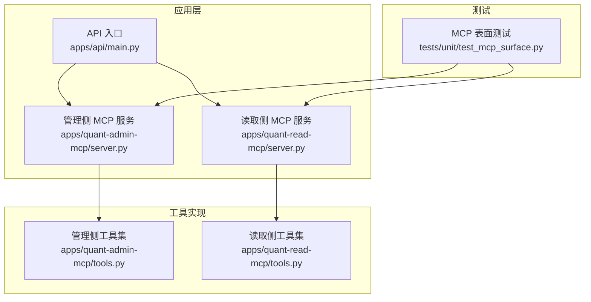
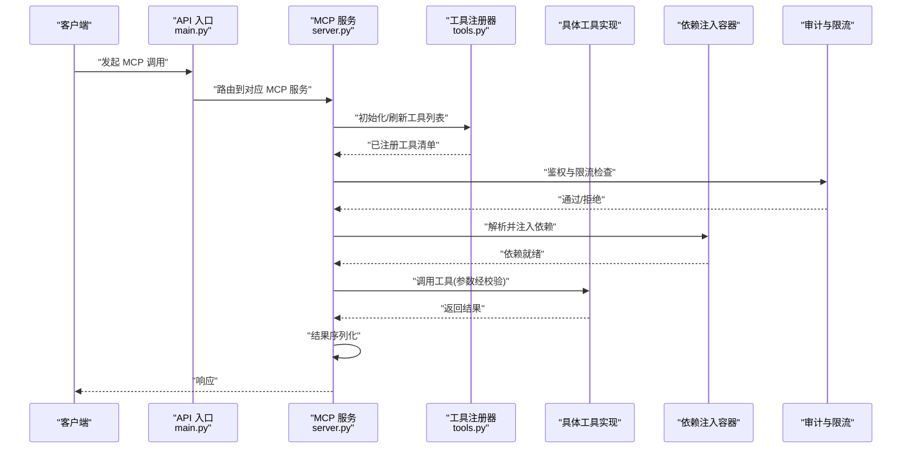
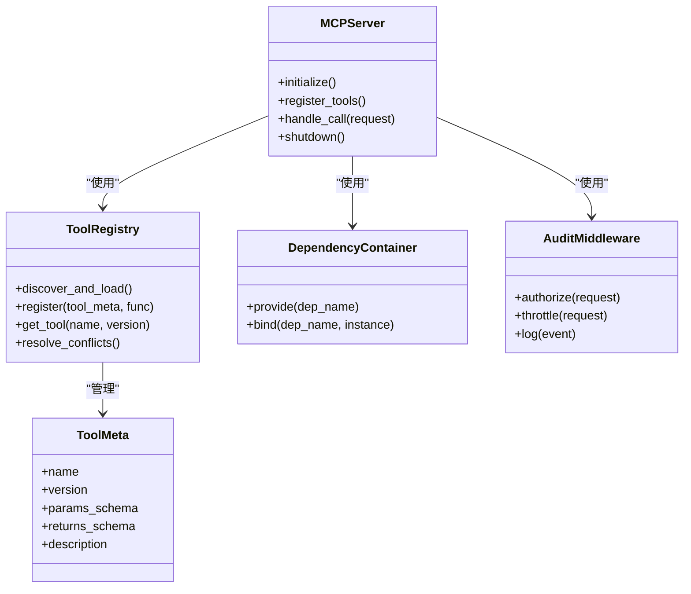
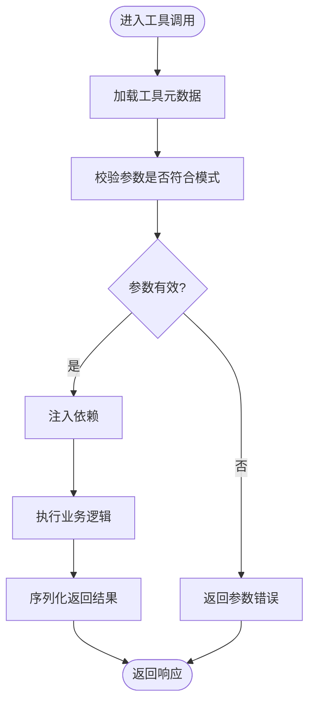
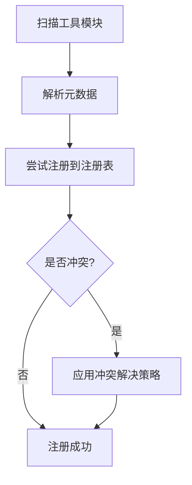
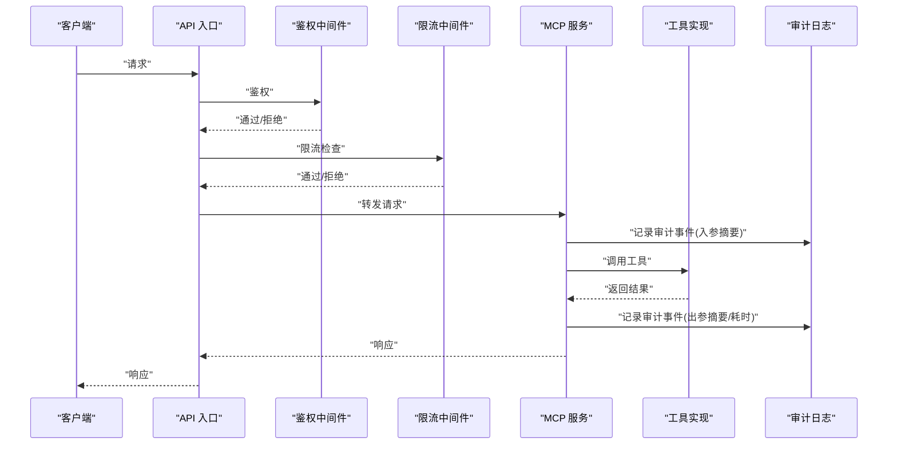
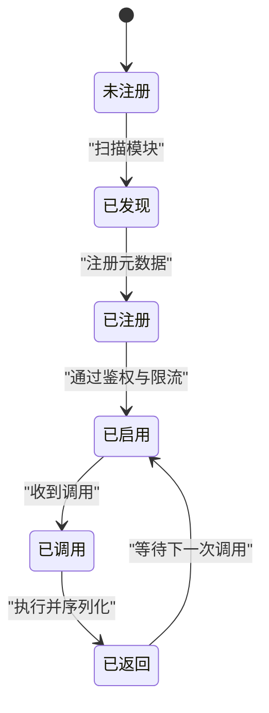
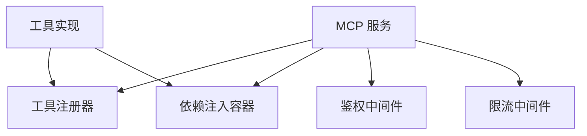

# 工具注册机制

<cite>
**本文引用的文件**   
- [apps/quant-admin-mcp/server.py](file://apps/quant-admin-mcp/server.py)
- [apps/quant-admin-mcp/tools.py](file://apps/quant-admin-mcp/tools.py)
- [apps/quant-read-mcp/server.py](file://apps/quant-read-mcp/server.py)
- [apps/quant-read-mcp/tools.py](file://apps/quant-read-mcp/tools.py)
- [apps/api/main.py](file://apps/api/main.py)
- [tests/unit/test_mcp_surface.py](file://tests/unit/test_mcp_surface.py)
</cite>

## 目录
1. [简介](#简介)
2. [项目结构](#项目结构)
3. [核心组件](#核心组件)
4. [架构总览](#架构总览)
5. [详细组件分析](#详细组件分析)
6. [依赖分析](#依赖分析)
7. [性能考虑](#性能考虑)
8. [故障排查指南](#故障排查指南)
9. [结论](#结论)
10. [附录](#附录)

## 简介
本技术文档围绕 MCP（Model Context Protocol）工具注册机制，系统性阐述以下主题：
- 工具的声明式注册、动态加载与依赖注入原理
- 工具元数据定义、参数校验与返回值序列化
- 工具发现机制、版本管理与冲突解决策略
- 权限控制、调用限制与审计日志
- 可插拔工具模块的开发范式与最佳实践
- 工具与业务逻辑的解耦设计
- 常见问题及解决方案

目标读者包括：希望扩展或集成新工具的后端工程师、平台运维人员以及需要理解系统边界的测试与质量保障人员。

## 项目结构
仓库采用多应用分层组织，MCP 相关能力集中在 apps 目录下，按功能域拆分为多个子应用：
- quant-admin-mcp：面向管理侧的 MCP 服务与工具集
- quant-read-mcp：面向读取侧的 MCP 服务与工具集
- api：API 网关/入口，负责启动与装配各子系统
- tests：单元测试覆盖关键路径，包含对 MCP 表面的测试

图示来源
- [apps/api/main.py](file://apps/api/main.py)
- [apps/quant-admin-mcp/server.py](file://apps/quant-admin-mcp/server.py)
- [apps/quant-read-mcp/server.py](file://apps/quant-read-mcp/server.py)
- [apps/quant-admin-mcp/tools.py](file://apps/quant-admin-mcp/tools.py)
- [apps/quant-read-mcp/tools.py](file://apps/quant-read-mcp/tools.py)
- [tests/unit/test_mcp_surface.py](file://tests/unit/test_mcp_surface.py)

章节来源
- [apps/api/main.py](file://apps/api/main.py)
- [apps/quant-admin-mcp/server.py](file://apps/quant-admin-mcp/server.py)
- [apps/quant-read-mcp/server.py](file://apps/quant-read-mcp/server.py)
- [apps/quant-admin-mcp/tools.py](file://apps/quant-admin-mcp/tools.py)
- [apps/quant-read-mcp/tools.py](file://apps/quant-read-mcp/tools.py)
- [tests/unit/test_mcp_surface.py](file://tests/unit/test_mcp_surface.py)

## 核心组件
- MCP 服务实例：每个子应用维护一个独立的 MCP 服务实例，用于暴露一组工具。
- 工具集合：以“工具集”为单位进行组织，便于按领域划分与管理。
- 工具注册器：提供声明式注册接口，将函数包装为 MCP 可调用的工具，并附带元数据。
- 依赖注入容器：在工具执行前注入所需的外部依赖（如数据库连接、配置等）。
- 元数据与校验：通过装饰器或注册 API 描述工具名称、版本、参数模式、返回类型等。
- 发现与装配：服务启动时扫描并注册工具，支持热更新或按需加载。
- 安全与审计：统一鉴权、限流与审计日志记录。

章节来源
- [apps/quant-admin-mcp/server.py](file://apps/quant-admin-mcp/server.py)
- [apps/quant-admin-mcp/tools.py](file://apps/quant-admin-mcp/tools.py)
- [apps/quant-read-mcp/server.py](file://apps/quant-read-mcp/server.py)
- [apps/quant-read-mcp/tools.py](file://apps/quant-read-mcp/tools.py)

## 架构总览
下图展示了从 API 入口到具体工具执行的端到端流程，包括工具发现、注册、依赖注入、参数校验、执行与结果序列化。

图示来源
- [apps/api/main.py](file://apps/api/main.py)
- [apps/quant-admin-mcp/server.py](file://apps/quant-admin-mcp/server.py)
- [apps/quant-read-mcp/server.py](file://apps/quant-read-mcp/server.py)
- [apps/quant-admin-mcp/tools.py](file://apps/quant-admin-mcp/tools.py)
- [apps/quant-read-mcp/tools.py](file://apps/quant-read-mcp/tools.py)

## 详细组件分析

### 组件A：MCP 服务与工具注册器
本节聚焦于 MCP 服务如何发现并注册工具，以及工具元数据的定义方式。

- 服务生命周期
  - 启动阶段：创建 MCP 服务实例，初始化注册器，扫描工具模块并注册。
  - 运行阶段：接收调用请求，完成鉴权、限流、依赖注入、参数校验、执行与序列化。
  - 关闭阶段：释放资源，清理上下文。

- 工具注册
  - 声明式注册：通过装饰器或显式 API 将函数注册为工具，同时声明名称、版本、参数模式、返回类型等元数据。
  - 动态加载：支持按配置或插件目录动态发现工具模块，避免硬编码导入。
  - 版本管理：工具元数据包含版本号；注册器在冲突时依据策略选择保留版本。

- 依赖注入
  - 容器化依赖：数据库连接、配置对象、外部服务等通过容器注入，降低耦合。
  - 作用域：可按请求级或服务级提供依赖实例。

- 参数校验与返回序列化
  - 参数校验：基于元数据中的参数模式进行静态与运行时校验，失败即返回错误。
  - 返回序列化：统一序列化为协议兼容格式，处理复杂类型与异常。

图示来源
- [apps/quant-admin-mcp/server.py](file://apps/quant-admin-mcp/server.py)
- [apps/quant-admin-mcp/tools.py](file://apps/quant-admin-mcp/tools.py)
- [apps/quant-read-mcp/server.py](file://apps/quant-read-mcp/server.py)
- [apps/quant-read-mcp/tools.py](file://apps/quant-read-mcp/tools.py)

章节来源
- [apps/quant-admin-mcp/server.py](file://apps/quant-admin-mcp/server.py)
- [apps/quant-admin-mcp/tools.py](file://apps/quant-admin-mcp/tools.py)
- [apps/quant-read-mcp/server.py](file://apps/quant-read-mcp/server.py)
- [apps/quant-read-mcp/tools.py](file://apps/quant-read-mcp/tools.py)

### 组件B：工具元数据、参数校验与返回序列化
- 元数据定义
  - 字段建议：名称、版本、描述、参数模式、返回模式、权限标签、限流策略、审计开关等。
  - 版本语义：遵循语义化版本，主版本变更表示不兼容。

- 参数校验
  - 静态校验：编译期或导入期基于类型注解与模式定义进行检查。
  - 运行时校验：入参与模式不一致时快速失败，返回结构化错误。

- 返回序列化
  - 统一输出：将 Python 对象转换为协议兼容的 JSON 或其他格式。
  - 异常映射：将内部异常映射为标准错误码与消息。

图示来源
- [apps/quant-admin-mcp/tools.py](file://apps/quant-admin-mcp/tools.py)
- [apps/quant-read-mcp/tools.py](file://apps/quant-read-mcp/tools.py)

章节来源
- [apps/quant-admin-mcp/tools.py](file://apps/quant-admin-mcp/tools.py)
- [apps/quant-read-mcp/tools.py](file://apps/quant-read-mcp/tools.py)

### 组件C：工具发现、版本管理与冲突解决
- 发现机制
  - 包内扫描：根据命名约定或配置文件自动发现工具模块。
  - 插件目录：支持外部目录挂载，动态加载 .py 文件或包。

- 版本管理
  - 注册表键：以“名称+版本”作为唯一标识。
  - 默认版本：未指定版本时选择最高可用版本。

- 冲突解决策略
  - 严格模式：同名不同版本直接报错，要求调用方明确版本。
  - 宽容模式：保留最新稳定版，弃用旧版并记录告警。
  - 灰度发布：按权重或标签分流，逐步放量。

图示来源
- [apps/quant-admin-mcp/server.py](file://apps/quant-admin-mcp/server.py)
- [apps/quant-read-mcp/server.py](file://apps/quant-read-mcp/server.py)

章节来源
- [apps/quant-admin-mcp/server.py](file://apps/quant-admin-mcp/server.py)
- [apps/quant-read-mcp/server.py](file://apps/quant-read-mcp/server.py)

### 组件D：权限控制、调用限制与审计日志
- 权限控制
  - 基于角色或标签的访问控制，工具元数据携带权限标签。
  - 鉴权中间件在调用前验证令牌与权限。

- 调用限制
  - 全局与工具级限流，支持滑动窗口与令牌桶算法。
  - 超时与重试策略可配置。

- 审计日志
  - 记录调用者、时间戳、工具名、版本、入参与出参摘要、耗时与状态码。
  - 敏感信息脱敏，支持采样与分级存储。

图示来源
- [apps/api/main.py](file://apps/api/main.py)
- [apps/quant-admin-mcp/server.py](file://apps/quant-admin-mcp/server.py)
- [apps/quant-read-mcp/server.py](file://apps/quant-read-mcp/server.py)

章节来源
- [apps/api/main.py](file://apps/api/main.py)
- [apps/quant-admin-mcp/server.py](file://apps/quant-admin-mcp/server.py)
- [apps/quant-read-mcp/server.py](file://apps/quant-read-mcp/server.py)

### 组件E：可插拔工具模块开发范式
- 步骤概览
  - 新建工具模块：定义函数与元数据，声明参数模式与返回类型。
  - 注册工具：使用装饰器或显式 API 注册到工具注册器。
  - 依赖注入：通过容器获取数据库连接、配置等外部依赖。
  - 权限与限流：在元数据中声明权限标签与限流策略。
  - 单元测试：编写用例覆盖正常路径与边界条件。

- 示例路径
  - 参考现有工具实现位置，复制模板并替换业务逻辑。
  - 在测试文件中添加针对新工具的断言。

章节来源
- [apps/quant-admin-mcp/tools.py](file://apps/quant-admin-mcp/tools.py)
- [apps/quant-read-mcp/tools.py](file://apps/quant-read-mcp/tools.py)
- [tests/unit/test_mcp_surface.py](file://tests/unit/test_mcp_surface.py)

### 概念性总览
下图展示了一个通用的 MCP 工具生命周期，帮助非代码读者理解整体流程。

[此图为概念性流程图，无需图示来源]

## 依赖分析
- 组件耦合
  - MCP 服务强依赖工具注册器与依赖注入容器。
  - 工具实现弱依赖注册器，仅通过装饰器或显式 API 注册。
  - 鉴权与限流作为横切关注点，通过中间件接入。

- 外部依赖
  - 数据库连接池、配置中心、消息队列等通过容器注入。
  - 日志与指标采集通过统一 SDK 接入。

图示来源
- [apps/quant-admin-mcp/server.py](file://apps/quant-admin-mcp/server.py)
- [apps/quant-admin-mcp/tools.py](file://apps/quant-admin-mcp/tools.py)
- [apps/quant-read-mcp/server.py](file://apps/quant-read-mcp/server.py)
- [apps/quant-read-mcp/tools.py](file://apps/quant-read-mcp/tools.py)

章节来源
- [apps/quant-admin-mcp/server.py](file://apps/quant-admin-mcp/server.py)
- [apps/quant-admin-mcp/tools.py](file://apps/quant-admin-mcp/tools.py)
- [apps/quant-read-mcp/server.py](file://apps/quant-read-mcp/server.py)
- [apps/quant-read-mcp/tools.py](file://apps/quant-read-mcp/tools.py)

## 性能考虑
- 工具发现缓存：首次扫描后缓存工具清单，减少重复 IO。
- 依赖复用：容器提供单例或请求级实例，避免频繁创建。
- 参数校验优化：预编译参数模式，减少运行时开销。
- 序列化优化：批量返回与流式传输，减少内存占用。
- 限流与熔断：保护后端资源，防止雪崩。

[本节为通用指导，无需章节来源]

## 故障排查指南
- 常见问题
  - 工具未注册：检查扫描路径与命名约定，确认注册器已加载。
  - 参数校验失败：核对元数据中的参数模式与实际入参。
  - 版本冲突：查看注册表日志，调整冲突解决策略或升级调用方。
  - 权限不足：确认调用方令牌与工具权限标签匹配。
  - 限流触发：检查限流阈值与配额，必要时扩容或降级。
  - 审计缺失：确认审计中间件已启用且日志通道可用。

- 定位方法
  - 开启调试日志，观察注册与调用链路。
  - 使用测试套件复现问题，缩小范围。
  - 检查容器绑定是否正确，依赖是否就绪。

章节来源
- [tests/unit/test_mcp_surface.py](file://tests/unit/test_mcp_surface.py)
- [apps/quant-admin-mcp/server.py](file://apps/quant-admin-mcp/server.py)
- [apps/quant-read-mcp/server.py](file://apps/quant-read-mcp/server.py)

## 结论
本方案通过声明式注册、动态加载与依赖注入，实现了工具与业务逻辑的解耦，提升了可扩展性与可维护性。统一的元数据、参数校验与返回序列化保障了稳定性与一致性。配合权限控制、限流与审计日志，形成了完整的安全与可观测性闭环。建议在新工具开发中遵循既定范式，并在测试中覆盖关键路径与边界条件。

[本节为总结，无需章节来源]

## 附录
- 术语
  - MCP：模型上下文协议，用于标准化工具调用与交互。
  - 工具元数据：描述工具名称、版本、参数与返回模式的附加信息。
  - 依赖注入：在运行时将外部依赖提供给组件，降低耦合。

- 参考实现路径
  - 管理侧工具：[apps/quant-admin-mcp/tools.py](file://apps/quant-admin-mcp/tools.py)
  - 读取侧工具：[apps/quant-read-mcp/tools.py](file://apps/quant-read-mcp/tools.py)
  - MCP 服务入口：[apps/quant-admin-mcp/server.py](file://apps/quant-admin-mcp/server.py)、[apps/quant-read-mcp/server.py](file://apps/quant-read-mcp/server.py)
  - API 入口：[apps/api/main.py](file://apps/api/main.py)
  - 测试用例：[tests/unit/test_mcp_surface.py](file://tests/unit/test_mcp_surface.py)