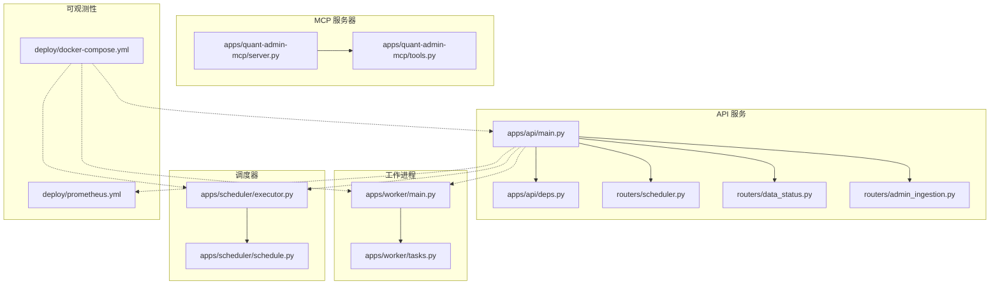
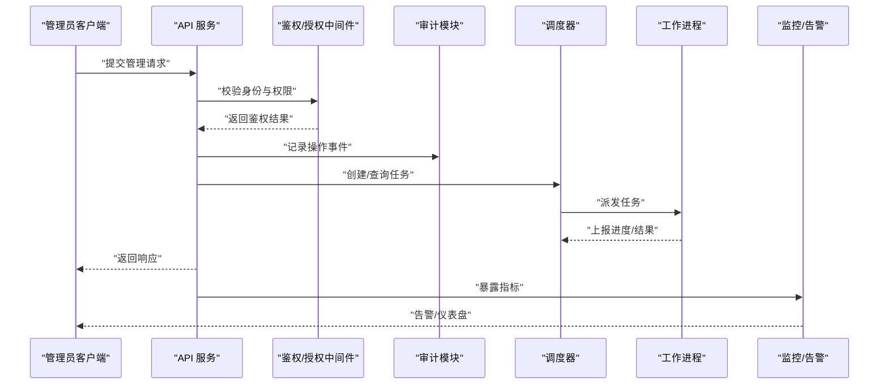
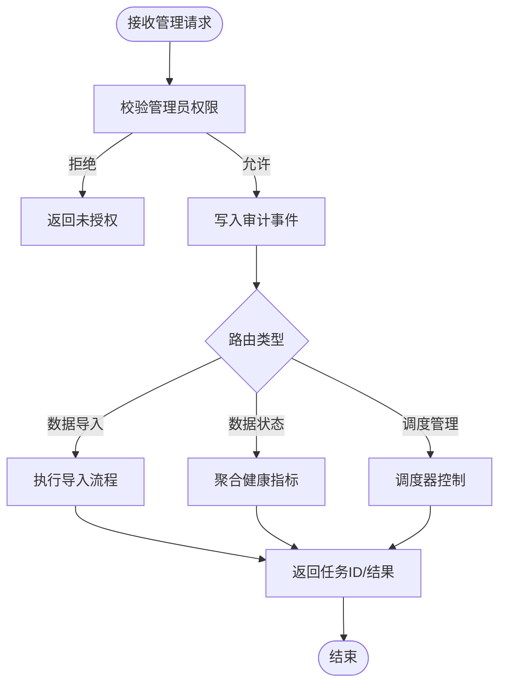
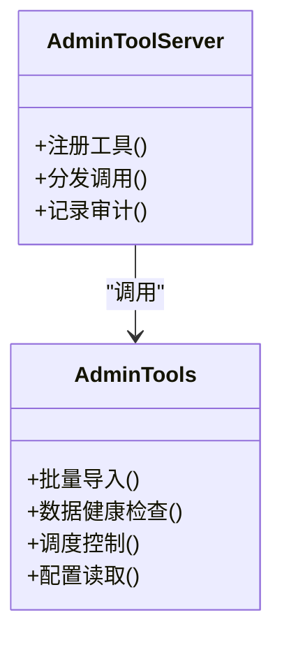
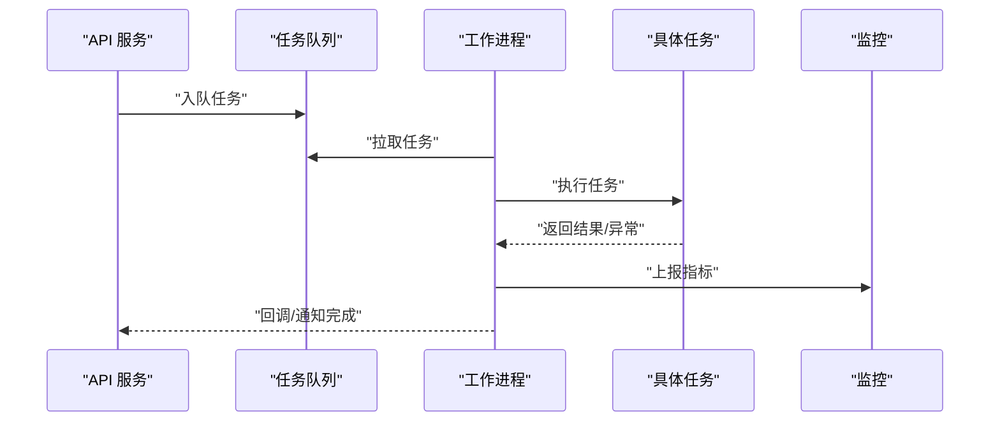
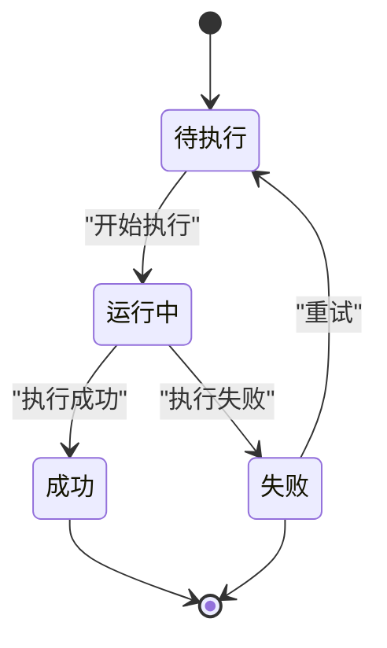
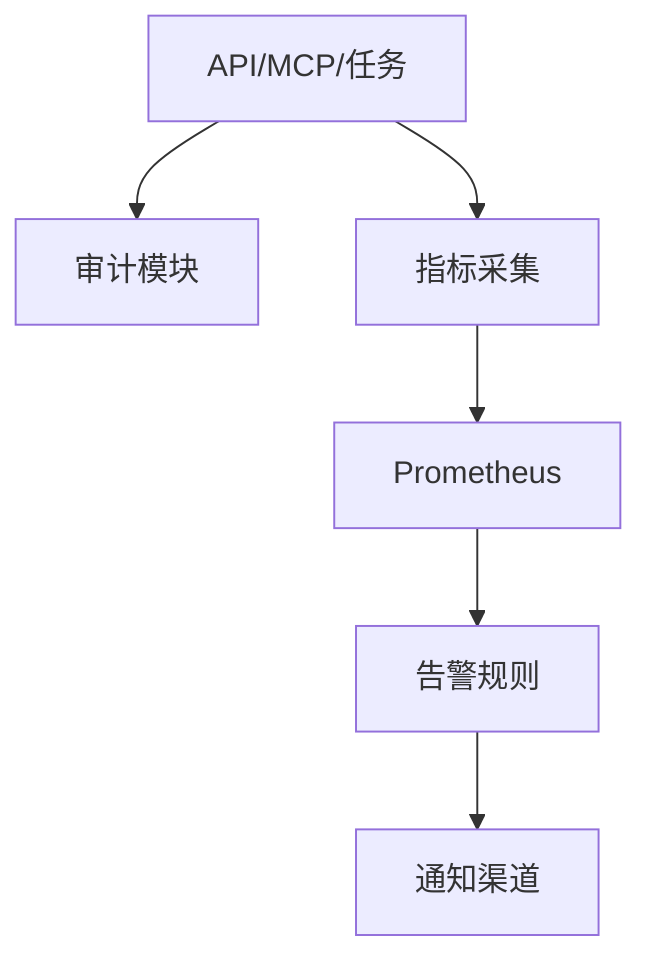
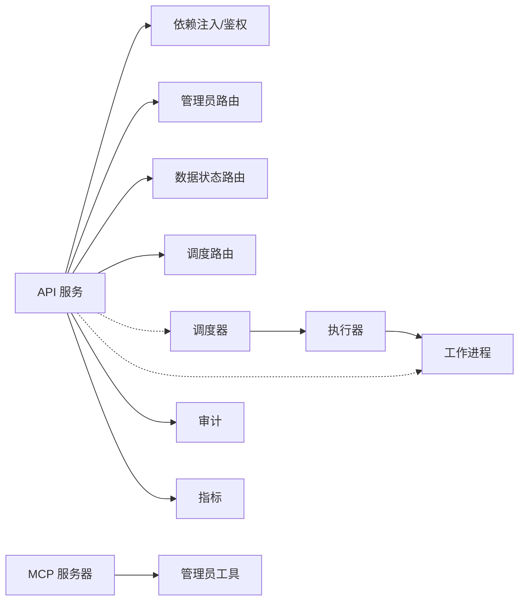

# 管理员代理

<cite>
**本文引用的文件**   
- [apps/api/main.py](file://apps/api/main.py)
- [apps/api/deps.py](file://apps/api/deps.py)
- [apps/api/routers/admin_ingestion.py](file://apps/api/routers/admin_ingestion.py)
- [apps/api/routers/data_status.py](file://apps/api/routers/data_status.py)
- [apps/api/routers/scheduler.py](file://apps/api/routers/scheduler.py)
- [apps/quant-admin-mcp/server.py](file://apps/quant-admin-mcp/server.py)
- [apps/quant-admin-mcp/tools.py](file://apps/quant-admin-mcp/tools.py)
- [apps/worker/main.py](file://apps/worker/main.py)
- [apps/worker/tasks.py](file://apps/worker/tasks.py)
- [apps/scheduler/executor.py](file://apps/scheduler/executor.py)
- [apps/scheduler/schedule.py](file://apps/scheduler/schedule.py)
- [packages/audit/](file://packages/audit/)
- [deploy/docker-compose.yml](file://deploy/docker-compose.yml)
- [deploy/prometheus.yml](file://deploy/prometheus.yml)
</cite>

## 目录
1. [简介](#简介)
2. [项目结构](#项目结构)
3. [核心组件](#核心组件)
4. [架构总览](#架构总览)
5. [详细组件分析](#详细组件分析)
6. [依赖关系分析](#依赖关系分析)
7. [性能与扩展性](#性能与扩展性)
8. [故障排查指南](#故障排查指南)
9. [结论](#结论)
10. [附录：API 与工具参考](#附录api-与工具参考)

## 简介
本技术文档面向系统管理员，围绕“管理员代理”的职责、权限模型与安全控制机制展开，覆盖系统配置管理、用户权限控制、操作审计、批量数据处理、任务调度与监控告警能力。同时记录管理员 API 接口、命令行工具与 Web 界面集成方式，并提供运维与故障排查示例，解释与普通代理的区别及协作模式。

## 项目结构
本项目采用多应用分层组织：
- API 服务：提供 HTTP 接口（含管理员路由）
- MCP 服务器：提供可编程工具集（管理员工具）
- 工作进程：执行异步任务
- 调度器：负责任务编排与执行
- 可观测性与部署：Prometheus 指标采集与容器编排

图示来源
- [apps/api/main.py](file://apps/api/main.py)
- [apps/api/deps.py](file://apps/api/deps.py)
- [apps/api/routers/admin_ingestion.py](file://apps/api/routers/admin_ingestion.py)
- [apps/api/routers/data_status.py](file://apps/api/routers/data_status.py)
- [apps/api/routers/scheduler.py](file://apps/api/routers/scheduler.py)
- [apps/quant-admin-mcp/server.py](file://apps/quant-admin-mcp/server.py)
- [apps/quant-admin-mcp/tools.py](file://apps/quant-admin-mcp/tools.py)
- [apps/worker/main.py](file://apps/worker/main.py)
- [apps/worker/tasks.py](file://apps/worker/tasks.py)
- [apps/scheduler/executor.py](file://apps/scheduler/executor.py)
- [apps/scheduler/schedule.py](file://apps/scheduler/schedule.py)
- [deploy/prometheus.yml](file://deploy/prometheus.yml)
- [deploy/docker-compose.yml](file://deploy/docker-compose.yml)

章节来源
- [apps/api/main.py](file://apps/api/main.py)
- [apps/api/deps.py](file://apps/api/deps.py)
- [apps/api/routers/admin_ingestion.py](file://apps/api/routers/admin_ingestion.py)
- [apps/api/routers/data_status.py](file://apps/api/routers/data_status.py)
- [apps/api/routers/scheduler.py](file://apps/api/routers/scheduler.py)
- [apps/quant-admin-mcp/server.py](file://apps/quant-admin-mcp/server.py)
- [apps/quant-admin-mcp/tools.py](file://apps/quant-admin-mcp/tools.py)
- [apps/worker/main.py](file://apps/worker/main.py)
- [apps/worker/tasks.py](file://apps/worker/tasks.py)
- [apps/scheduler/executor.py](file://apps/scheduler/executor.py)
- [apps/scheduler/schedule.py](file://apps/scheduler/schedule.py)
- [deploy/prometheus.yml](file://deploy/prometheus.yml)
- [deploy/docker-compose.yml](file://deploy/docker-compose.yml)

## 核心组件
- 管理员 API 网关：统一入口，负责路由、鉴权、限流、审计等横切关注点
- 管理员工具集（MCP）：以工具形式暴露管理能力，便于脚本化与自动化
- 任务执行器与工作进程：承载批量数据导入、重算、修复等耗时任务
- 调度器：按策略触发周期性或事件驱动的任务
- 审计与可观测性：记录关键操作并暴露指标，支撑告警与排障

章节来源
- [apps/api/main.py](file://apps/api/main.py)
- [apps/api/deps.py](file://apps/api/deps.py)
- [apps/quant-admin-mcp/server.py](file://apps/quant-admin-mcp/server.py)
- [apps/quant-admin-mcp/tools.py](file://apps/quant-admin-mcp/tools.py)
- [apps/worker/main.py](file://apps/worker/main.py)
- [apps/worker/tasks.py](file://apps/worker/tasks.py)
- [apps/scheduler/executor.py](file://apps/scheduler/executor.py)
- [apps/scheduler/schedule.py](file://apps/scheduler/schedule.py)

## 架构总览
管理员代理通过 API 与 MCP 双通道对外提供服务；内部由调度器与工作进程协同完成重型处理；所有关键路径均接入审计与指标采集。

图示来源
- [apps/api/main.py](file://apps/api/main.py)
- [apps/api/deps.py](file://apps/api/deps.py)
- [apps/api/routers/scheduler.py](file://apps/api/routers/scheduler.py)
- [apps/scheduler/executor.py](file://apps/scheduler/executor.py)
- [apps/worker/main.py](file://apps/worker/main.py)
- [apps/worker/tasks.py](file://apps/worker/tasks.py)
- [deploy/prometheus.yml](file://deploy/prometheus.yml)

## 详细组件分析

### 管理员 API 路由
- 数据导入管理：提供批量导入、增量更新、幂等控制、失败重试与回滚策略
- 数据状态查询：暴露数据完整性、新鲜度、质量评分与健康检查
- 调度管理：创建、暂停、恢复、删除定时任务；查看运行历史与日志

图示来源
- [apps/api/routers/admin_ingestion.py](file://apps/api/routers/admin_ingestion.py)
- [apps/api/routers/data_status.py](file://apps/api/routers/data_status.py)
- [apps/api/routers/scheduler.py](file://apps/api/routers/scheduler.py)
- [apps/api/deps.py](file://apps/api/deps.py)

章节来源
- [apps/api/routers/admin_ingestion.py](file://apps/api/routers/admin_ingestion.py)
- [apps/api/routers/data_status.py](file://apps/api/routers/data_status.py)
- [apps/api/routers/scheduler.py](file://apps/api/routers/scheduler.py)
- [apps/api/deps.py](file://apps/api/deps.py)

### MCP 管理员工具集
- 工具注册：在 MCP 服务器中集中注册管理员工具，供外部系统调用
- 参数校验：对输入进行严格校验，避免误操作
- 幂等与事务：支持幂等键与事务边界，保障一致性
- 审计与追踪：每个工具调用生成审计条目与追踪上下文

图示来源
- [apps/quant-admin-mcp/server.py](file://apps/quant-admin-mcp/server.py)
- [apps/quant-admin-mcp/tools.py](file://apps/quant-admin-mcp/tools.py)

章节来源
- [apps/quant-admin-mcp/server.py](file://apps/quant-admin-mcp/server.py)
- [apps/quant-admin-mcp/tools.py](file://apps/quant-admin-mcp/tools.py)

### 任务执行与工作进程
- 任务队列：接收来自 API 或调度器的任务
- 并发控制：基于进程/线程池限制并发度，防止资源耗尽
- 重试与退避：对瞬时错误自动重试，指数退避
- 进度上报：向调度器或监控系统上报进度与指标

图示来源
- [apps/worker/main.py](file://apps/worker/main.py)
- [apps/worker/tasks.py](file://apps/worker/tasks.py)
- [apps/scheduler/executor.py](file://apps/scheduler/executor.py)
- [deploy/prometheus.yml](file://deploy/prometheus.yml)

章节来源
- [apps/worker/main.py](file://apps/worker/main.py)
- [apps/worker/tasks.py](file://apps/worker/tasks.py)
- [apps/scheduler/executor.py](file://apps/scheduler/executor.py)

### 调度器
- 任务编排：定义周期性与一次性任务
- 执行引擎：协调工作进程，保证至少一次语义
- 状态机：维护任务生命周期（待执行、运行中、成功、失败）

图示来源
- [apps/scheduler/schedule.py](file://apps/scheduler/schedule.py)
- [apps/scheduler/executor.py](file://apps/scheduler/executor.py)

章节来源
- [apps/scheduler/schedule.py](file://apps/scheduler/schedule.py)
- [apps/scheduler/executor.py](file://apps/scheduler/executor.py)

### 审计与可观测性
- 审计事件：记录管理员操作、任务执行、数据变更
- 指标暴露：任务成功率、延迟、队列长度、错误率
- 告警规则：基于阈值与趋势的告警策略

图示来源
- [packages/audit/](file://packages/audit/)
- [deploy/prometheus.yml](file://deploy/prometheus.yml)

章节来源
- [packages/audit/](file://packages/audit/)
- [deploy/prometheus.yml](file://deploy/prometheus.yml)

## 依赖关系分析
- API 层依赖鉴权与审计中间件，路由到业务处理器
- MCP 服务器依赖工具实现，统一暴露能力
- 调度器与工作进程解耦，通过消息传递协作
- 可观测性贯穿全链路，便于定位问题

图示来源
- [apps/api/main.py](file://apps/api/main.py)
- [apps/api/deps.py](file://apps/api/deps.py)
- [apps/api/routers/admin_ingestion.py](file://apps/api/routers/admin_ingestion.py)
- [apps/api/routers/data_status.py](file://apps/api/routers/data_status.py)
- [apps/api/routers/scheduler.py](file://apps/api/routers/scheduler.py)
- [apps/quant-admin-mcp/server.py](file://apps/quant-admin-mcp/server.py)
- [apps/quant-admin-mcp/tools.py](file://apps/quant-admin-mcp/tools.py)
- [apps/scheduler/executor.py](file://apps/scheduler/executor.py)
- [apps/worker/main.py](file://apps/worker/main.py)

章节来源
- [apps/api/main.py](file://apps/api/main.py)
- [apps/api/deps.py](file://apps/api/deps.py)
- [apps/api/routers/admin_ingestion.py](file://apps/api/routers/admin_ingestion.py)
- [apps/api/routers/data_status.py](file://apps/api/routers/data_status.py)
- [apps/api/routers/scheduler.py](file://apps/api/routers/scheduler.py)
- [apps/quant-admin-mcp/server.py](file://apps/quant-admin-mcp/server.py)
- [apps/quant-admin-mcp/tools.py](file://apps/quant-admin-mcp/tools.py)
- [apps/scheduler/executor.py](file://apps/scheduler/executor.py)
- [apps/worker/main.py](file://apps/worker/main.py)

## 性能与扩展性
- 水平扩展：工作进程与调度器可独立扩容，结合队列容量与消费者数量调节吞吐
- 背压与限流：在高负载时限制新任务入队速率，保护下游资源
- 批处理优化：合并小批次、并行分片、去重与增量更新
- 缓存与索引：热点数据缓存、查询索引优化，降低数据库压力
- 资源隔离：不同租户/环境使用独立队列与命名空间，避免相互影响

[本节为通用指导，不直接分析具体文件]

## 故障排查指南
- 常见症状
  - 任务堆积：检查队列长度、消费者健康、资源瓶颈
  - 导入失败：核对数据源连通性、格式校验、幂等键冲突
  - 调度不触发：确认调度配置、时间窗口、依赖条件
  - 指标缺失：验证采集端点可达性与权限
- 定位步骤
  - 查看审计日志：锁定操作主体、时间、参数与结果
  - 检查任务状态：从待执行到失败的流转路径
  - 抓取指标：成功率、延迟、错误码分布
  - 复现最小用例：缩小范围快速定位
- 恢复建议
  - 重试与补偿：对瞬时错误启用重试，必要时人工补偿
  - 降级与熔断：保护关键路径，避免雪崩
  - 回滚与快照：变更前备份，变更后验证

章节来源
- [apps/api/routers/data_status.py](file://apps/api/routers/data_status.py)
- [apps/api/routers/scheduler.py](file://apps/api/routers/scheduler.py)
- [apps/worker/tasks.py](file://apps/worker/tasks.py)
- [deploy/prometheus.yml](file://deploy/prometheus.yml)

## 结论
管理员代理通过清晰的职责划分、严格的权限控制与完善的审计与可观测性，为系统运维提供了可靠的能力基座。借助 MCP 工具与 API 的双通道，管理员可以高效地完成批量数据处理、任务调度与日常巡检。配合合理的性能调优与故障排查流程，可在复杂环境下保持稳定运行。

[本节为总结性内容，不直接分析具体文件]

## 附录：API 与工具参考
- 管理员 API
  - 数据导入管理：批量导入、增量更新、幂等控制、失败重试
  - 数据状态查询：健康检查、质量评分、新鲜度
  - 调度管理：任务创建、暂停、恢复、删除与历史查询
- MCP 管理员工具
  - 工具注册与调用：统一入口，参数校验，审计追踪
  - 典型场景：批量导入、健康检查、调度控制、配置读取
- 部署与监控
  - 容器编排：服务启动、端口映射、环境变量
  - 指标采集：Prometheus 配置、目标发现、告警规则

章节来源
- [apps/api/routers/admin_ingestion.py](file://apps/api/routers/admin_ingestion.py)
- [apps/api/routers/data_status.py](file://apps/api/routers/data_status.py)
- [apps/api/routers/scheduler.py](file://apps/api/routers/scheduler.py)
- [apps/quant-admin-mcp/server.py](file://apps/quant-admin-mcp/server.py)
- [apps/quant-admin-mcp/tools.py](file://apps/quant-admin-mcp/tools.py)
- [deploy/docker-compose.yml](file://deploy/docker-compose.yml)
- [deploy/prometheus.yml](file://deploy/prometheus.yml)