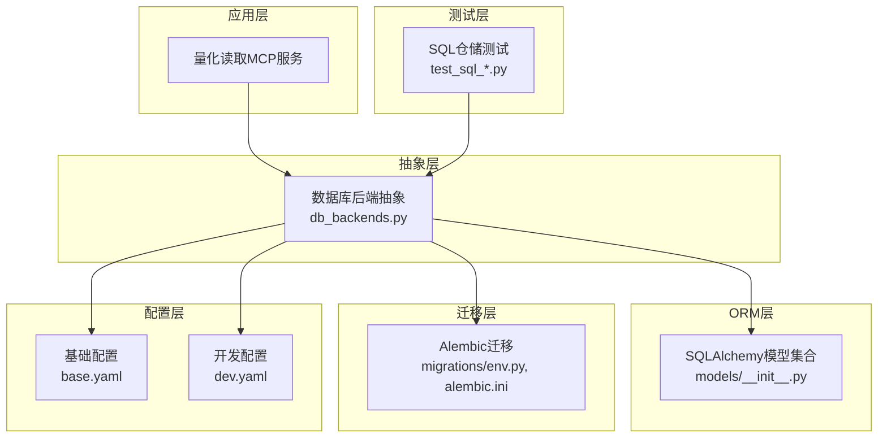
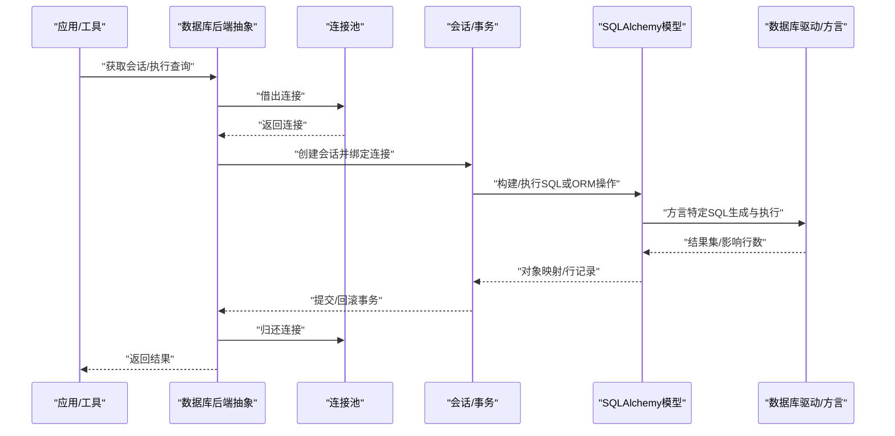
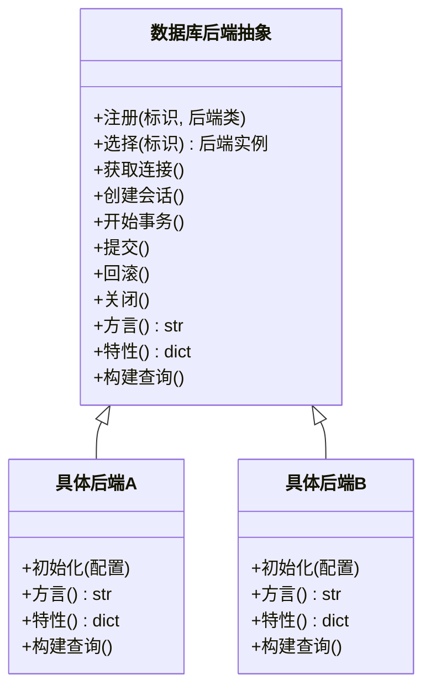
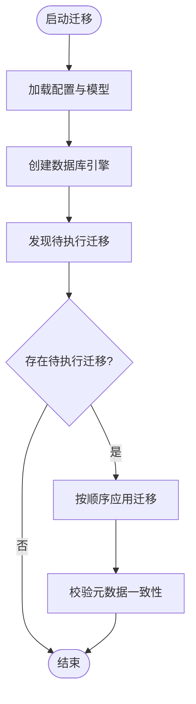
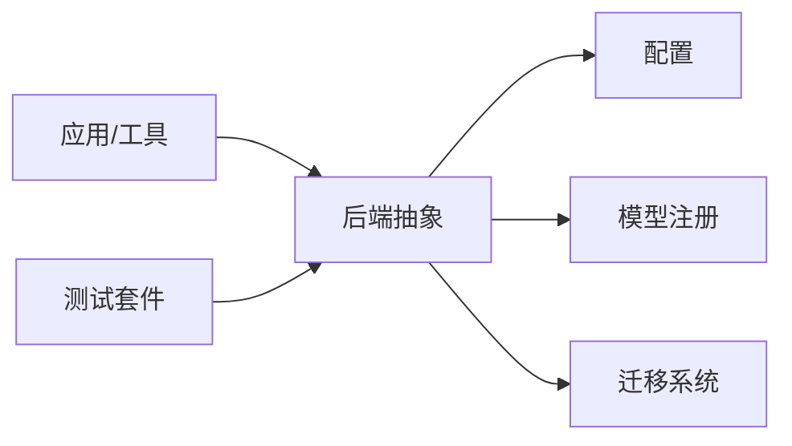

# 数据库后端抽象

<cite>
**本文引用的文件**   
- [apps/quant-read-mcp/db_backends.py](file://apps/quant-read-mcp/db_backends.py)
- [packages/models/__init__.py](file://packages/models/__init__.py)
- [sql/migrations/env.py](file://sql/migrations/env.py)
- [alembic.ini](file://alembic.ini)
- [configs/base.yaml](file://configs/base.yaml)
- [configs/dev.yaml](file://configs/dev.yaml)
- [tests/unit/test_sql_repos.py](file://tests/unit/test_sql_repos.py)
- [tests/unit/test_sql_bar_repo.py](file://tests/unit/test_sql_bar_repo.py)
- [tests/unit/test_sql_instrument_repo.py](file://tests/unit/test_sql_instrument_repo.py)
</cite>

## 目录
1. [简介](#简介)
2. [项目结构](#项目结构)
3. [核心组件](#核心组件)
4. [架构总览](#架构总览)
5. [详细组件分析](#详细组件分析)
6. [依赖关系分析](#依赖关系分析)
7. [性能考虑](#性能考虑)
8. [故障排查指南](#故障排查指南)
9. [结论](#结论)
10. [附录](#附录)

## 简介
本技术文档围绕“数据库后端抽象层”展开，聚焦多数据库支持的架构设计、接口抽象与实现模式。内容涵盖连接池管理、事务处理与并发控制、SQLAlchemy ORM集成、查询构建器与数据映射策略、不同数据库类型的适配与方言差异、新增后端的扩展方法、数据一致性保障、备份恢复与迁移策略，以及跨库兼容性、性能调优与故障转移机制。

## 项目结构
仓库采用按功能域划分的模块化组织方式，数据库相关能力主要分布在以下位置：
- 读取端MCP服务中的数据库后端抽象与注册：apps/quant-read-mcp/db_backends.py
- SQLAlchemy模型定义入口：packages/models/__init__.py
- Alembic迁移配置与环境脚本：sql/migrations/env.py、alembic.ini
- 运行时配置（含数据库URL等）：configs/base.yaml、configs/dev.yaml
- 单元测试覆盖SQL仓储与读写路径：tests/unit/test_sql_*.py

图表来源
- [apps/quant-read-mcp/db_backends.py](file://apps/quant-read-mcp/db_backends.py)
- [packages/models/__init__.py](file://packages/models/__init__.py)
- [sql/migrations/env.py](file://sql/migrations/env.py)
- [alembic.ini](file://alembic.ini)
- [configs/base.yaml](file://configs/base.yaml)
- [configs/dev.yaml](file://configs/dev.yaml)
- [tests/unit/test_sql_repos.py](file://tests/unit/test_sql_repos.py)

章节来源
- [apps/quant-read-mcp/db_backends.py](file://apps/quant-read-mcp/db_backends.py)
- [packages/models/__init__.py](file://packages/models/__init__.py)
- [sql/migrations/env.py](file://sql/migrations/env.py)
- [alembic.ini](file://alembic.ini)
- [configs/base.yaml](file://configs/base.yaml)
- [configs/dev.yaml](file://configs/dev.yaml)
- [tests/unit/test_sql_repos.py](file://tests/unit/test_sql_repos.py)

## 核心组件
- 数据库后端抽象与注册中心：提供统一的连接获取、会话生命周期管理、事务边界封装、方言选择与特性探测、查询构建器注入点、批量写入与分页游标等能力。
- SQLAlchemy模型与映射：集中声明表结构与字段类型，统一导入以完成自动注册，便于迁移工具发现实体。
- 迁移系统：基于Alembic的元数据驱动迁移，支持版本化演进与回滚。
- 配置管理：通过YAML配置项注入数据库URL、连接池参数、超时与重试策略等。
- 测试支撑：针对SQL仓储的单元与集成测试，验证跨库行为一致性与异常分支。

章节来源
- [apps/quant-read-mcp/db_backends.py](file://apps/quant-read-mcp/db_backends.py)
- [packages/models/__init__.py](file://packages/models/__init__.py)
- [sql/migrations/env.py](file://sql/migrations/env.py)
- [alembic.ini](file://alembic.ini)
- [configs/base.yaml](file://configs/base.yaml)
- [configs/dev.yaml](file://configs/dev.yaml)
- [tests/unit/test_sql_repos.py](file://tests/unit/test_sql_repos.py)

## 架构总览
下图展示了从应用调用到具体数据库驱动的端到端流程，包括连接池、会话、事务与ORM映射的关键交互。

图表来源
- [apps/quant-read-mcp/db_backends.py](file://apps/quant-read-mcp/db_backends.py)
- [packages/models/__init__.py](file://packages/models/__init__.py)

## 详细组件分析

### 数据库后端抽象与注册（db_backends.py）
该模块承担多数据库接入的统一入口职责，典型职责包括：
- 后端注册表：维护已注册的数据库后端类与其标识（如引擎键名）。
- 工厂方法：根据配置或请求上下文选择并实例化对应后端。
- 连接与会话管理：封装连接池借用、会话创建、事务开启/提交/回滚、连接回收。
- 方言与特性探测：识别当前数据库类型，暴露特性开关（如是否支持CTE、窗口函数、UPSERT等）。
- 查询构建器注入：为上层仓储提供可插拔的查询构造能力，屏蔽底层方言差异。
- 错误与重试：对网络抖动、锁等待、死锁等进行可配置的重试与退避。

图表来源
- [apps/quant-read-mcp/db_backends.py](file://apps/quant-read-mcp/db_backends.py)

章节来源
- [apps/quant-read-mcp/db_backends.py](file://apps/quant-read-mcp/db_backends.py)

### SQLAlchemy模型与映射（models/__init__.py）
- 模型集中导入：确保所有表模型在启动时完成声明式注册，供ORM与迁移工具发现。
- 字段与约束：使用标准类型与约束表达业务语义，尽量保持跨库兼容。
- 索引与分区：按需添加复合索引、唯一约束，提升查询性能与数据完整性。
- 命名规范：表名、列名遵循统一约定，降低方言差异带来的迁移成本。

章节来源
- [packages/models/__init__.py](file://packages/models/__init__.py)

### 迁移系统与版本控制（env.py, alembic.ini）
- env.py负责加载配置、建立引擎、发现模型与运行迁移脚本。
- alembic.ini定义迁移脚本目录、目标数据库URL及日志级别等。
- 版本化管理：每次变更以迁移脚本形式落地，支持向前升级与向后回滚。

图表来源
- [sql/migrations/env.py](file://sql/migrations/env.py)
- [alembic.ini](file://alembic.ini)

章节来源
- [sql/migrations/env.py](file://sql/migrations/env.py)
- [alembic.ini](file://alembic.ini)

### 配置管理（base.yaml, dev.yaml）
- 数据库URL：包含协议、主机、端口、数据库名与可选参数。
- 连接池参数：最大连接数、最小空闲、超时时间、预取/批大小等。
- 方言与特性：显式指定方言或启用/禁用某些特性。
- 环境切换：通过配置文件组合实现开发/测试/生产差异化。

章节来源
- [configs/base.yaml](file://configs/base.yaml)
- [configs/dev.yaml](file://configs/dev.yaml)

### 测试与验证（test_sql_*.py）
- 仓储级单测：覆盖增删改查、分页、排序、过滤、聚合等常见场景。
- 跨库一致性：在不同后端下验证相同逻辑的行为一致。
- 异常路径：断言超时、连接失败、约束冲突等错误被正确捕获与上报。

章节来源
- [tests/unit/test_sql_repos.py](file://tests/unit/test_sql_repos.py)
- [tests/unit/test_sql_bar_repo.py](file://tests/unit/test_sql_bar_repo.py)
- [tests/unit/test_sql_instrument_repo.py](file://tests/unit/test_sql_instrument_repo.py)

## 依赖关系分析
- 应用层依赖后端抽象，不直接耦合具体驱动。
- 后端抽象依赖配置与模型注册，间接依赖Alembic进行迁移。
- 测试依赖后端抽象提供的测试夹具与隔离环境。

图表来源
- [apps/quant-read-mcp/db_backends.py](file://apps/quant-read-mcp/db_backends.py)
- [packages/models/__init__.py](file://packages/models/__init__.py)
- [sql/migrations/env.py](file://sql/migrations/env.py)
- [alembic.ini](file://alembic.ini)
- [configs/base.yaml](file://configs/base.yaml)
- [configs/dev.yaml](file://configs/dev.yaml)
- [tests/unit/test_sql_repos.py](file://tests/unit/test_sql_repos.py)

章节来源
- [apps/quant-read-mcp/db_backends.py](file://apps/quant-read-mcp/db_backends.py)
- [packages/models/__init__.py](file://packages/models/__init__.py)
- [sql/migrations/env.py](file://sql/migrations/env.py)
- [alembic.ini](file://alembic.ini)
- [configs/base.yaml](file://configs/base.yaml)
- [configs/dev.yaml](file://configs/dev.yaml)
- [tests/unit/test_sql_repos.py](file://tests/unit/test_sql_repos.py)

## 性能考虑
- 连接池调优：依据并发度与延迟目标设置最大连接数、超时与预取大小，避免连接风暴与饥饿。
- 批量操作：优先使用批量插入/更新减少往返开销；注意事务粒度与内存占用平衡。
- 查询优化：合理索引、选择性过滤、分页游标替代偏移分页，避免深分页导致的性能退化。
- 方言差异：利用特性探测启用最优SQL生成策略（如UPSERT、CTE、窗口函数）。
- 缓存与只读副本：读多写少场景引入只读连接与缓存层，降低主库压力。

[本节为通用指导，无需代码来源]

## 故障排查指南
- 连接失败：检查数据库URL、网络可达性、认证凭据与防火墙规则。
- 事务异常：确认事务边界是否正确闭合，是否存在长事务导致锁竞争。
- 死锁与锁等待：缩短事务、调整隔离级别、拆分大事务、增加重试与退避。
- 迁移失败：核对目标库版本、回滚至稳定版本、查看迁移脚本依赖顺序。
- 性能问题：定位慢查询、检查索引命中、评估连接池与批大小。

章节来源
- [tests/unit/test_sql_repos.py](file://tests/unit/test_sql_repos.py)
- [tests/unit/test_sql_bar_repo.py](file://tests/unit/test_sql_bar_repo.py)
- [tests/unit/test_sql_instrument_repo.py](file://tests/unit/test_sql_instrument_repo.py)

## 结论
通过统一的数据库后端抽象层，系统在多数据库环境下实现了高内聚、低耦合的可插拔架构。借助连接池与会话封装、事务边界控制、方言与特性探测、迁移版本化与完善的测试覆盖，系统在可扩展性、稳定性与可维护性方面具备良好基础。后续可在只读副本、缓存、分库分表与更细粒度的监控指标上持续演进。

[本节为总结性内容，无需代码来源]

## 附录

### 如何添加新的数据库后端（步骤清单）
- 新建后端类：继承后端抽象基类，实现方言、特性与查询构建器方法。
- 注册后端：在后端注册表中登记新后端标识与类引用。
- 配置接入：在配置文件中新增数据库URL与连接池参数。
- 模型与迁移：确保模型已注册，编写并执行迁移脚本以创建/变更表结构。
- 测试覆盖：为新后端补充仓储级测试，验证CRUD、事务与异常路径。
- 回归验证：在本地与CI环境中跑通全量测试，确认无回归。

章节来源
- [apps/quant-read-mcp/db_backends.py](file://apps/quant-read-mcp/db_backends.py)
- [packages/models/__init__.py](file://packages/models/__init__.py)
- [sql/migrations/env.py](file://sql/migrations/env.py)
- [alembic.ini](file://alembic.ini)
- [configs/base.yaml](file://configs/base.yaml)
- [configs/dev.yaml](file://configs/dev.yaml)
- [tests/unit/test_sql_repos.py](file://tests/unit/test_sql_repos.py)