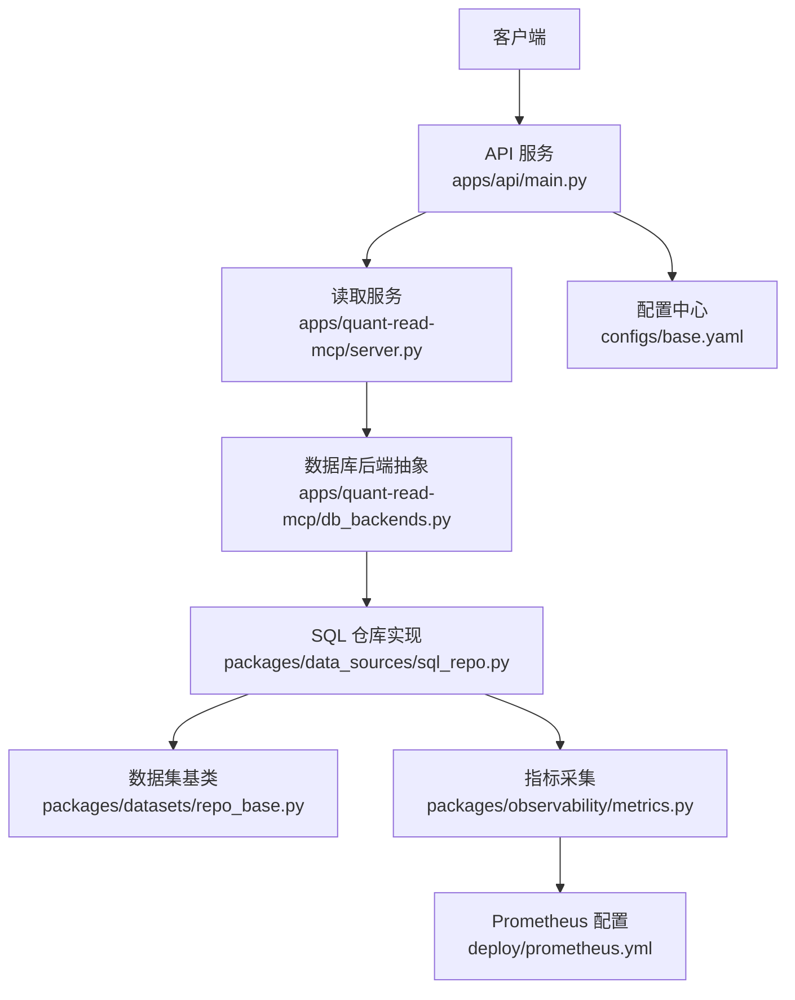
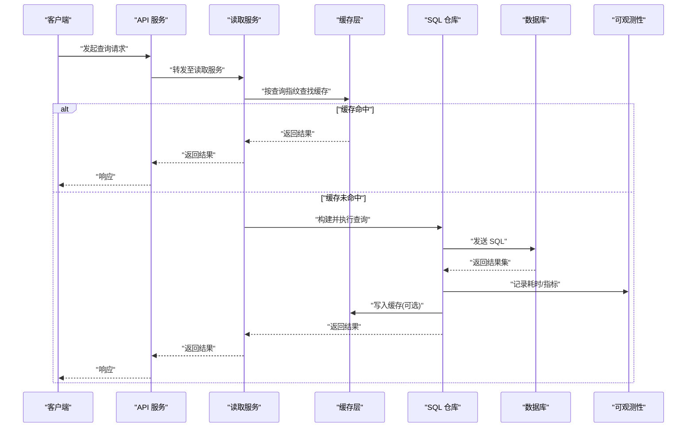
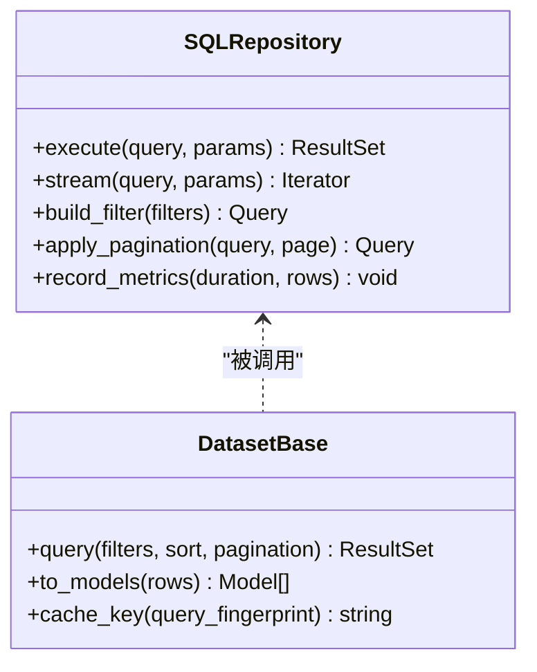
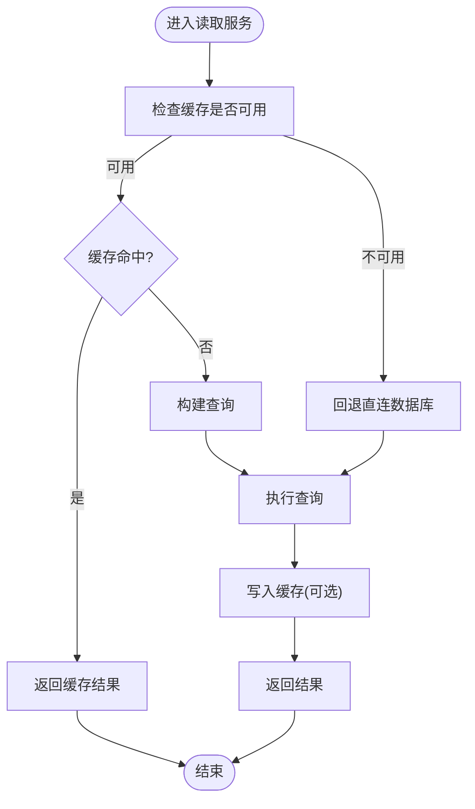
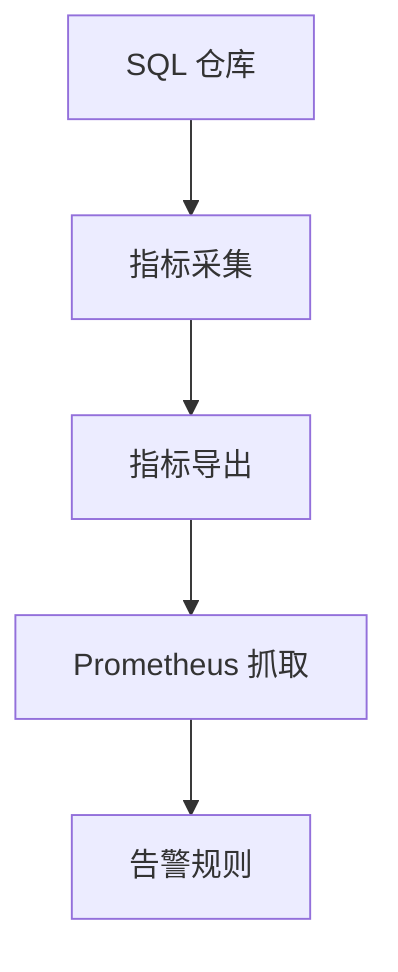
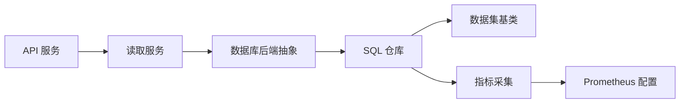

# 查询优化与缓存

<cite>
**本文引用的文件**   
- [apps/api/main.py](file://apps/api/main.py)
- [apps/api/deps.py](file://apps/api/deps.py)
- [apps/quant-read-mcp/server.py](file://apps/quant-read-mcp/server.py)
- [apps/quant-read-mcp/db_backends.py](file://apps/quant-read-mcp/db_backends.py)
- [packages/data_sources/sql_repo.py](file://packages/data_sources/sql_repo.py)
- [packages/datasets/repo_base.py](file://packages/datasets/repo_base.py)
- [packages/observability/metrics.py](file://packages/observability/metrics.py)
- [deploy/prometheus.yml](file://deploy/prometheus.yml)
- [configs/base.yaml](file://configs/base.yaml)
</cite>

## 目录
1. [简介](#简介)
2. [项目结构](#项目结构)
3. [核心组件](#核心组件)
4. [架构总览](#架构总览)
5. [详细组件分析](#详细组件分析)
6. [依赖关系分析](#依赖关系分析)
7. [性能考量](#性能考量)
8. [故障排查指南](#故障排查指南)
9. [结论](#结论)
10. [附录](#附录) 

## 简介
本技术文档聚焦于“查询优化与缓存”子系统，面向量化数据读取与报表场景，覆盖以下主题：
- 查询执行计划分析与索引优化建议
- 查询重写策略（SQL改写、谓词下推、投影裁剪）
- 多级缓存架构（进程内、分布式、物化视图/预计算）
- 缓存失效策略与一致性保证（TTL、版本戳、写扩散/读扩散）
- 结果集分页、流式传输与大数据量处理优化
- 查询监控、性能分析与慢查询日志
- 自定义查询优化规则示例（以代码片段路径形式给出）
- 缓存预热、预取策略与内存管理
- 常见问题：性能瓶颈、缓存穿透、雪崩效应等

## 项目结构
本项目采用分层与模块化组织方式。与查询和缓存相关的核心位置包括：
- API 层：HTTP 路由与服务入口，负责参数校验、鉴权、调用仓储层
- MCP 读取服务：提供模型上下文协议接口，封装数据库后端与查询逻辑
- 数据源与仓储：统一 SQL 仓库实现、数据集基类，承载查询构建与执行
- 可观测性：指标采集与导出配置，支撑慢查询与性能分析
- 配置：全局开关与默认值，控制缓存、连接池、超时等

图表来源
- [apps/api/main.py](file://apps/api/main.py)
- [apps/quant-read-mcp/server.py](file://apps/quant-read-mcp/server.py)
- [apps/quant-read-mcp/db_backends.py](file://apps/quant-read-mcp/db_backends.py)
- [packages/data_sources/sql_repo.py](file://packages/data_sources/sql_repo.py)
- [packages/datasets/repo_base.py](file://packages/datasets/repo_base.py)
- [packages/observability/metrics.py](file://packages/observability/metrics.py)
- [deploy/prometheus.yml](file://deploy/prometheus.yml)
- [configs/base.yaml](file://configs/base.yaml)

章节来源
- [apps/api/main.py](file://apps/api/main.py)
- [apps/quant-read-mcp/server.py](file://apps/quant-read-mcp/server.py)
- [apps/quant-read-mcp/db_backends.py](file://apps/quant-read-mcp/db_backends.py)
- [packages/data_sources/sql_repo.py](file://packages/data_sources/sql_repo.py)
- [packages/datasets/repo_base.py](file://packages/datasets/repo_base.py)
- [packages/observability/metrics.py](file://packages/observability/metrics.py)
- [deploy/prometheus.yml](file://deploy/prometheus.yml)
- [configs/base.yaml](file://configs/base.yaml)

## 核心组件
- 查询执行与仓储
  - SQL 仓库负责构建与执行查询，支持分页、排序、过滤与聚合
  - 数据集基类提供通用查询能力与结果映射
- 缓存层
  - 进程内缓存：用于热点键快速命中
  - 分布式缓存：跨实例共享，降低重复计算与 IO
  - 物化视图/预计算：对高频复杂查询进行离线或增量刷新
- 可观测性与监控
  - 指标埋点：QPS、延迟分位、命中率、错误率
  - 慢查询日志：阈值触发记录，便于定位热点与低效 SQL
- 配置与治理
  - 通过配置文件集中管理缓存 TTL、连接池大小、超时、重试等

章节来源
- [packages/data_sources/sql_repo.py](file://packages/data_sources/sql_repo.py)
- [packages/datasets/repo_base.py](file://packages/datasets/repo_base.py)
- [packages/observability/metrics.py](file://packages/observability/metrics.py)
- [configs/base.yaml](file://configs/base.yaml)

## 架构总览
下图展示从 HTTP 请求到数据返回的端到端流程，包含缓存命中分支与慢查询告警路径。

图表来源
- [apps/api/main.py](file://apps/api/main.py)
- [apps/quant-read-mcp/server.py](file://apps/quant-read-mcp/server.py)
- [packages/data_sources/sql_repo.py](file://packages/data_sources/sql_repo.py)
- [packages/observability/metrics.py](file://packages/observability/metrics.py)

## 详细组件分析

### 查询执行与仓储（SQL 仓库与数据集基类）
- 职责
  - 统一查询构建：过滤、排序、分页、聚合
  - 执行与结果映射：将行映射为领域对象
  - 可观测性埋点：记录执行时间、错误码、行数
- 关键设计
  - 查询指纹：基于规范化后的查询条件生成缓存键
  - 分页策略：游标分页优于偏移分页，避免深分页性能退化
  - 流式读取：大结果集使用迭代器/流式游标，减少峰值内存
- 优化点
  - 谓词下推与投影裁剪：在仓库层尽早过滤与仅选择必要列
  - 批量合并：对多次小查询进行批处理，减少往返次数
  - 索引建议：根据慢查询日志与执行计划，补充复合索引与覆盖索引

图表来源
- [packages/data_sources/sql_repo.py](file://packages/data_sources/sql_repo.py)
- [packages/datasets/repo_base.py](file://packages/datasets/repo_base.py)

章节来源
- [packages/data_sources/sql_repo.py](file://packages/data_sources/sql_repo.py)
- [packages/datasets/repo_base.py](file://packages/datasets/repo_base.py)

### 读取服务与数据库后端抽象（MCP 读取服务）
- 职责
  - 暴露统一的读取接口，屏蔽底层存储差异
  - 协调缓存读写、重试与降级
  - 将查询转换为后端适配器的具体实现
- 关键设计
  - 后端抽象：不同数据源（如不同数据库类型）通过适配器接入
  - 失败回退：缓存不可用时直接走数据库；数据库异常时返回部分结果或错误码
  - 限流与熔断：保护下游资源，避免雪崩

图表来源
- [apps/quant-read-mcp/server.py](file://apps/quant-read-mcp/server.py)
- [apps/quant-read-mcp/db_backends.py](file://apps/quant-read-mcp/db_backends.py)

章节来源
- [apps/quant-read-mcp/server.py](file://apps/quant-read-mcp/server.py)
- [apps/quant-read-mcp/db_backends.py](file://apps/quant-read-mcp/db_backends.py)

### 可观测性与监控（指标与慢查询）
- 指标维度
  - 查询耗时（P50/P95/P99）、QPS、错误率、缓存命中率、结果行数
- 慢查询日志
  - 超过阈值的查询记录完整 SQL、参数、执行计划摘要
- 集成
  - 指标导出至 Prometheus，配合 Grafana 可视化
  - 告警规则：高延迟、低命中率、错误率突增

图表来源
- [packages/observability/metrics.py](file://packages/observability/metrics.py)
- [deploy/prometheus.yml](file://deploy/prometheus.yml)

章节来源
- [packages/observability/metrics.py](file://packages/observability/metrics.py)
- [deploy/prometheus.yml](file://deploy/prometheus.yml)

### 配置与治理（base.yaml）
- 关键项
  - 连接池大小、超时、重试次数
  - 缓存 TTL、最大容量、淘汰策略
  - 慢查询阈值、采样率
- 作用
  - 统一控制行为，便于灰度与回滚
  - 针对不同环境（开发/生产）差异化配置

章节来源
- [configs/base.yaml](file://configs/base.yaml)

## 依赖关系分析
- 组件耦合
  - API 服务依赖读取服务；读取服务依赖数据库后端抽象；仓储依赖数据集基类
  - 可观测性模块被仓储与读取服务共同引用
- 外部依赖
  - 数据库驱动、缓存中间件、Prometheus 客户端
- 潜在环依赖
  - 仓储不应反向依赖读取服务；指标模块应保持无状态

图表来源
- [apps/api/main.py](file://apps/api/main.py)
- [apps/quant-read-mcp/server.py](file://apps/quant-read-mcp/server.py)
- [apps/quant-read-mcp/db_backends.py](file://apps/quant-read-mcp/db_backends.py)
- [packages/data_sources/sql_repo.py](file://packages/data_sources/sql_repo.py)
- [packages/datasets/repo_base.py](file://packages/datasets/repo_base.py)
- [packages/observability/metrics.py](file://packages/observability/metrics.py)
- [deploy/prometheus.yml](file://deploy/prometheus.yml)

章节来源
- [apps/api/main.py](file://apps/api/main.py)
- [apps/quant-read-mcp/server.py](file://apps/quant-read-mcp/server.py)
- [apps/quant-read-mcp/db_backends.py](file://apps/quant-read-mcp/db_backends.py)
- [packages/data_sources/sql_repo.py](file://packages/data_sources/sql_repo.py)
- [packages/datasets/repo_base.py](file://packages/datasets/repo_base.py)
- [packages/observability/metrics.py](file://packages/observability/metrics.py)
- [deploy/prometheus.yml](file://deploy/prometheus.yml)

## 性能考量
- 查询执行计划分析
  - 关注全表扫描、临时表、文件排序、嵌套循环过多
  - 结合慢查询日志与执行计划，优先优化高代价节点
- 索引优化
  - 复合索引顺序遵循最左前缀原则
  - 覆盖索引减少回表
  - 定期统计信息更新，避免计划劣化
- 查询重写
  - 谓词下推到子查询
  - 投影裁剪，仅选择必要列
  - 拆分复杂 JOIN 为多步查询，利用缓存中间结果
- 分页与流式
  - 使用游标分页替代 OFFSET
  - 大结果集使用流式迭代器，限制单批次大小
- 缓存策略
  - 多级缓存：进程内 L1 + 分布式 L2 + 物化视图 L3
  - 失效策略：TTL + 版本号 + 事件驱动失效
  - 一致性：最终一致为主，强一致场景使用写扩散+短 TTL
- 内存管理
  - 控制缓存最大条目与内存上限
  - 淘汰策略：LRU/LFU 结合业务热度
  - 序列化体积控制，避免大对象膨胀

[本节为通用指导，不直接分析具体文件]

## 故障排查指南
- 常见症状
  - 高延迟：检查慢查询日志、执行计划、索引缺失
  - 低命中率：核对缓存键规范、TTL 设置、预热策略
  - 错误率上升：查看指标与告警，定位上游依赖异常
- 排查步骤
  - 定位热点查询：按 QPS 与 P99 排序
  - 分析执行计划：识别全表扫描与回表
  - 验证缓存链路：确认键空间、过期、并发击穿防护
  - 压测回归：变更前后对比关键指标
- 恢复手段
  - 临时扩容连接池与缓存实例
  - 降级非关键查询，保障核心路径
  - 回滚可疑变更，逐步灰度

章节来源
- [packages/observability/metrics.py](file://packages/observability/metrics.py)
- [deploy/prometheus.yml](file://deploy/prometheus.yml)

## 结论
通过统一的仓储抽象、多级缓存与完善的可观测性体系，系统能够在保证一致性的前提下显著提升查询性能与稳定性。持续优化执行计划与索引、完善查询重写与缓存策略，并结合监控告警闭环，可有效应对大数据量与高并发场景下的性能挑战。

[本节为总结，不直接分析具体文件]

## 附录

### 自定义查询优化规则示例（代码片段路径）
- 谓词下推规则
  - 仓库层在构建查询时将外层过滤条件下推到子查询
  - 参考路径：[packages/data_sources/sql_repo.py](file://packages/data_sources/sql_repo.py)
- 投影裁剪规则
  - 仅选择必要列，减少网络与序列化开销
  - 参考路径：[packages/data_sources/sql_repo.py](file://packages/data_sources/sql_repo.py)
- 分页改写规则
  - 将 OFFSET 分页改写为基于游标的分页
  - 参考路径：[packages/data_sources/sql_repo.py](file://packages/data_sources/sql_repo.py)
- 缓存键规范化
  - 基于查询指纹生成稳定键，避免键爆炸
  - 参考路径：[packages/datasets/repo_base.py](file://packages/datasets/repo_base.py)

章节来源
- [packages/data_sources/sql_repo.py](file://packages/data_sources/sql_repo.py)
- [packages/datasets/repo_base.py](file://packages/datasets/repo_base.py)

### 缓存预热与预取策略
- 预热
  - 启动后加载热点键集合，缩短冷启动延迟
  - 参考路径：[apps/quant-read-mcp/server.py](file://apps/quant-read-mcp/server.py)
- 预取
  - 基于访问模式预测下一批数据，提前拉取
  - 参考路径：[packages/data_sources/sql_repo.py](file://packages/data_sources/sql_repo.py)

章节来源
- [apps/quant-read-mcp/server.py](file://apps/quant-read-mcp/server.py)
- [packages/data_sources/sql_repo.py](file://packages/data_sources/sql_repo.py)

### 一致性保证机制
- 版本戳
  - 数据变更递增版本号，缓存键携带版本，避免脏读
  - 参考路径：[packages/datasets/repo_base.py](file://packages/datasets/repo_base.py)
- 失效传播
  - 写操作触发相关缓存键失效，必要时采用广播通知
  - 参考路径：[apps/quant-read-mcp/server.py](file://apps/quant-read-mcp/server.py)

章节来源
- [packages/datasets/repo_base.py](file://packages/datasets/repo_base.py)
- [apps/quant-read-mcp/server.py](file://apps/quant-read-mcp/server.py)

### 结果集分页、流式传输与大数据量处理
- 游标分页
  - 使用唯一键或时间戳作为游标，避免深分页
  - 参考路径：[packages/data_sources/sql_repo.py](file://packages/data_sources/sql_repo.py)
- 流式传输
  - 服务端逐批推送，客户端按需消费
  - 参考路径：[packages/data_sources/sql_repo.py](file://packages/data_sources/sql_repo.py)
- 内存控制
  - 限制批次大小与缓存总量，防止 OOM
  - 参考路径：[configs/base.yaml](file://configs/base.yaml)

章节来源
- [packages/data_sources/sql_repo.py](file://packages/data_sources/sql_repo.py)
- [configs/base.yaml](file://configs/base.yaml)

### 慢查询日志与性能分析
- 阈值与采样
  - 配置慢查询阈值与采样率，平衡精度与开销
  - 参考路径：[configs/base.yaml](file://configs/base.yaml)
- 指标与告警
  - 采集延迟分位与错误率，设置告警规则
  - 参考路径：[packages/observability/metrics.py](file://packages/observability/metrics.py), [deploy/prometheus.yml](file://deploy/prometheus.yml)

章节来源
- [configs/base.yaml](file://configs/base.yaml)
- [packages/observability/metrics.py](file://packages/observability/metrics.py)
- [deploy/prometheus.yml](file://deploy/prometheus.yml)

### 常见问题与对策
- 性能瓶颈
  - 现象：P99 延迟飙升
  - 对策：优化索引、改写查询、增加缓存命中率
  - 参考路径：[packages/data_sources/sql_repo.py](file://packages/data_sources/sql_repo.py), [packages/observability/metrics.py](file://packages/observability/metrics.py)
- 缓存穿透
  - 现象：大量不存在键导致直达数据库
  - 对策：布隆过滤器、空值缓存短 TTL
  - 参考路径：[apps/quant-read-mcp/server.py](file://apps/quant-read-mcp/server.py)
- 缓存雪崩
  - 现象：大批缓存同时过期
  - 对策：随机抖动 TTL、互斥锁重建、分级缓存
  - 参考路径：[apps/quant-read-mcp/server.py](file://apps/quant-read-mcp/server.py), [configs/base.yaml](file://configs/base.yaml)

章节来源
- [packages/data_sources/sql_repo.py](file://packages/data_sources/sql_repo.py)
- [apps/quant-read-mcp/server.py](file://apps/quant-read-mcp/server.py)
- [packages/observability/metrics.py](file://packages/observability/metrics.py)
- [configs/base.yaml](file://configs/base.yaml)