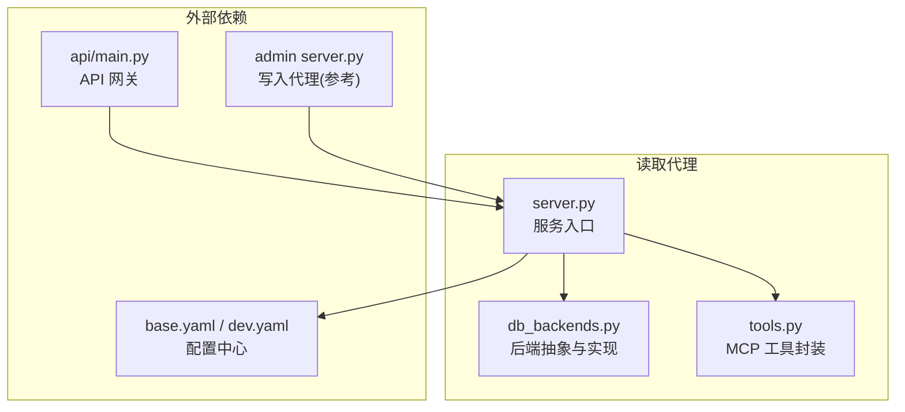
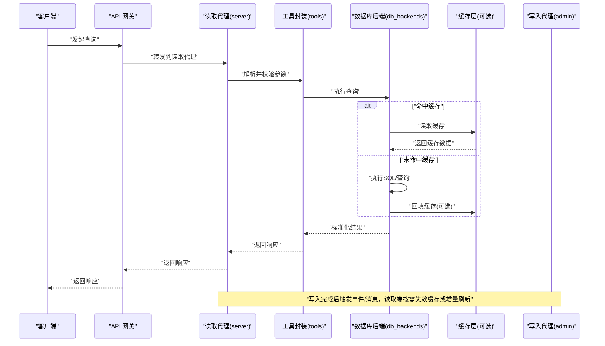
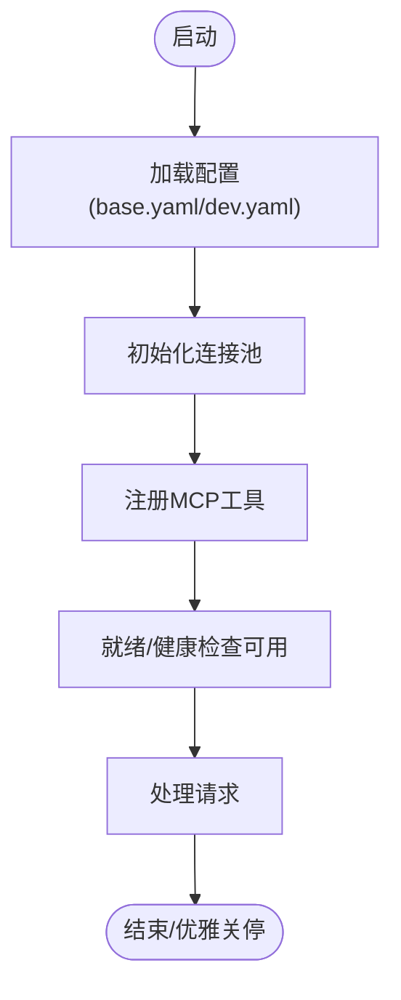
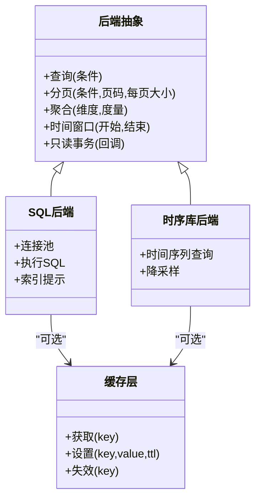
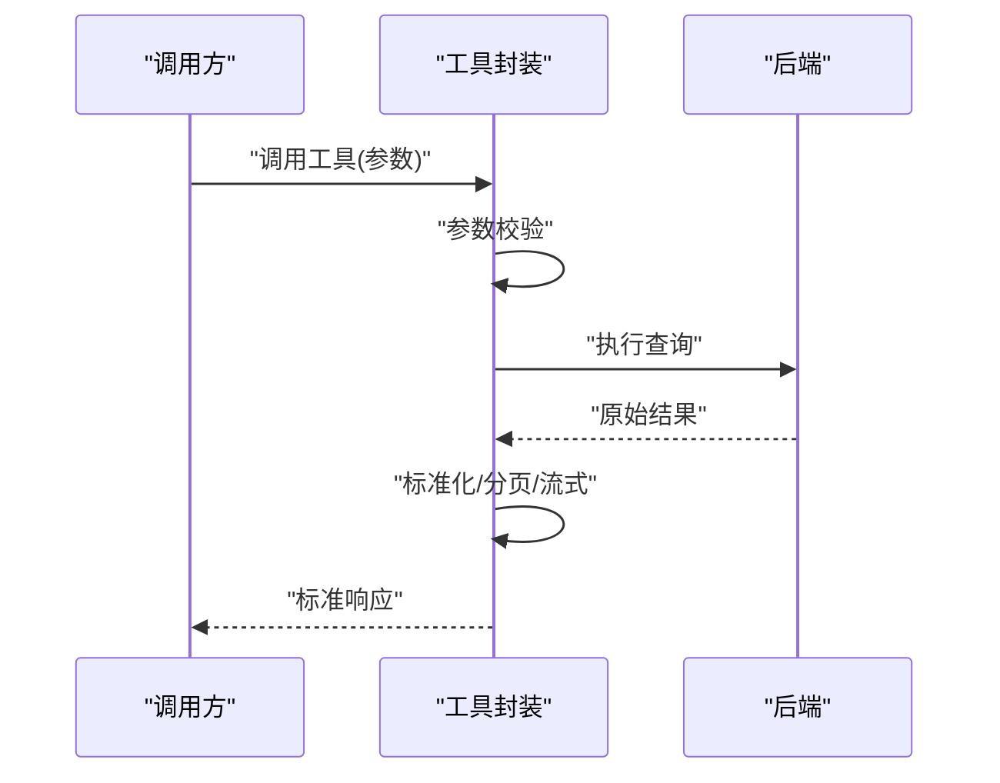
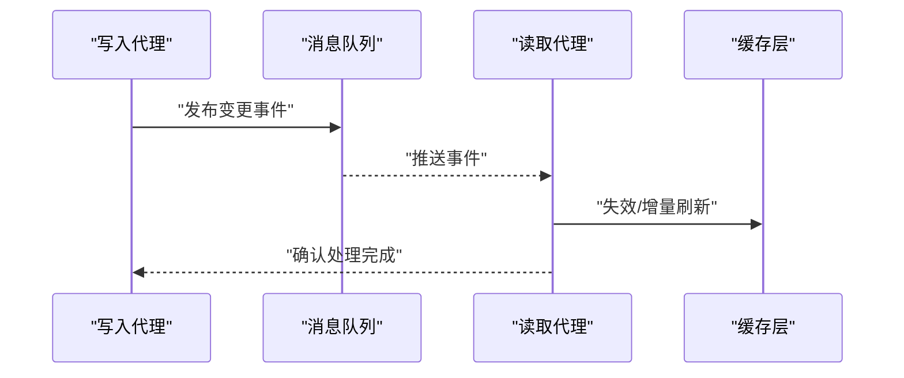
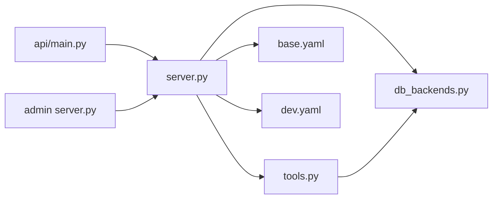

# 读取代理

<cite>
**本文引用的文件**   
- [apps/quant-read-mcp/server.py](file://apps/quant-read-mcp/server.py)
- [apps/quant-read-mcp/db_backends.py](file://apps/quant-read-mcp/db_backends.py)
- [apps/quant-read-mcp/tools.py](file://apps/quant-read-mcp/tools.py)
- [apps/quant-admin-mcp/server.py](file://apps/quant-admin-mcp/server.py)
- [apps/api/main.py](file://apps/api/main.py)
- [configs/base.yaml](file://configs/base.yaml)
- [configs/dev.yaml](file://configs/dev.yaml)
</cite>

## 目录
1. [简介](#简介)
2. [项目结构](#项目结构)
3. [核心组件](#核心组件)
4. [架构总览](#架构总览)
5. [详细组件分析](#详细组件分析)
6. [依赖关系分析](#依赖关系分析)
7. [性能考量](#性能考量)
8. [故障排查指南](#故障排查指南)
9. [结论](#结论)
10. [附录](#附录)

## 简介
本技术文档聚焦于“读取代理”子系统，围绕其数据访问模式、查询优化与缓存策略、多数据库后端支持、连接池管理、事务处理、一致性保证、并发控制、性能监控、查询语言支持、结果集处理与流式传输、扩展新数据源后端的实践方法，以及与写入代理的协作和数据同步机制进行系统化说明。读者无需深入源码即可理解整体设计思路与使用方式；同时提供面向二次开发者的扩展指引与常见问题解决方案。

## 项目结构
读取代理位于应用层服务中，主要包含以下模块：
- 服务入口与生命周期管理：负责启动、配置加载、依赖注入与优雅关停。
- 数据库后端抽象与实现：定义统一的数据访问接口，并提供多种后端适配（如 SQL、时序库等）。
- 工具与服务暴露：将读取能力以 MCP 工具形式对外暴露，供上层调用。

图表来源
- [apps/quant-read-mcp/server.py](file://apps/quant-read-mcp/server.py)
- [apps/quant-read-mcp/db_backends.py](file://apps/quant-read-mcp/db_backends.py)
- [apps/quant-read-mcp/tools.py](file://apps/quant-read-mcp/tools.py)
- [configs/base.yaml](file://configs/base.yaml)
- [configs/dev.yaml](file://configs/dev.yaml)
- [apps/api/main.py](file://apps/api/main.py)
- [apps/quant-admin-mcp/server.py](file://apps/quant-admin-mcp/server.py)

章节来源
- [apps/quant-read-mcp/server.py](file://apps/quant-read-mcp/server.py)
- [apps/quant-read-mcp/db_backends.py](file://apps/quant-read-mcp/db_backends.py)
- [apps/quant-read-mcp/tools.py](file://apps/quant-read-mcp/tools.py)
- [configs/base.yaml](file://configs/base.yaml)
- [configs/dev.yaml](file://configs/dev.yaml)
- [apps/api/main.py](file://apps/api/main.py)
- [apps/quant-admin-mcp/server.py](file://apps/quant-admin-mcp/server.py)

## 核心组件
- 服务入口（server.py）
  - 职责：加载配置、初始化后端连接池、注册工具、启动/停止服务、健康检查与指标上报。
  - 关键点：基于配置文件选择后端类型；按环境切换连接参数；在进程生命周期内复用连接池。
- 数据库后端（db_backends.py）
  - 职责：定义统一的读取接口（查询、分页、聚合、时间窗口过滤等），提供具体后端实现；封装连接池、重试与超时、错误分类。
  - 关键点：通过工厂或注册表创建后端实例；对不同类型后端做差异化优化（索引提示、批大小、游标模式）。
- 工具封装（tools.py）
  - 职责：将底层读取能力包装为 MCP 工具，屏蔽后端差异；提供参数校验、结果标准化、分页与流式输出。
  - 关键点：统一输入模型与返回协议；对大结果集采用流式传输；记录审计与可观测性指标。

章节来源
- [apps/quant-read-mcp/server.py](file://apps/quant-read-mcp/server.py)
- [apps/quant-read-mcp/db_backends.py](file://apps/quant-read-mcp/db_backends.py)
- [apps/quant-read-mcp/tools.py](file://apps/quant-read-mcp/tools.py)

## 架构总览
读取代理作为只读侧的服务，向上暴露稳定的查询接口，向下对接多种数据源。典型交互路径包括：
- 客户端通过 API 网关或 MCP 客户端发起查询请求。
- 读取代理根据工具路由解析参数，选择合适后端。
- 后端执行查询，必要时走缓存层，最终返回标准化结果。
- 写入代理通过消息队列或事件总线更新数据，读取代理按需失效缓存或增量刷新。

图表来源
- [apps/quant-read-mcp/server.py](file://apps/quant-read-mcp/server.py)
- [apps/quant-read-mcp/tools.py](file://apps/quant-read-mcp/tools.py)
- [apps/quant-read-mcp/db_backends.py](file://apps/quant-read-mcp/db_backends.py)
- [apps/quant-admin-mcp/server.py](file://apps/quant-admin-mcp/server.py)

## 详细组件分析

### 服务入口（server.py）
- 功能要点
  - 配置加载：从 base.yaml 与 dev.yaml 合并加载，覆盖环境变量。
  - 后端初始化：根据配置创建连接池，设置最大连接数、空闲回收、超时与重试策略。
  - 工具注册：将 tools.py 中的 MCP 工具注册到服务上下文。
  - 生命周期：启动时预热连接，关闭时释放资源；暴露健康检查与指标端点。
- 关键流程
  - 启动流程：加载配置 → 初始化后端 → 注册工具 → 启动服务。
  - 请求处理：接收请求 → 路由到工具 → 调用后端 → 返回结果。
  - 优雅关停：停止接收新请求 → 等待活跃请求完成 → 释放连接池。

图表来源
- [apps/quant-read-mcp/server.py](file://apps/quant-read-mcp/server.py)
- [configs/base.yaml](file://configs/base.yaml)
- [configs/dev.yaml](file://configs/dev.yaml)

章节来源
- [apps/quant-read-mcp/server.py](file://apps/quant-read-mcp/server.py)
- [configs/base.yaml](file://configs/base.yaml)
- [configs/dev.yaml](file://configs/dev.yaml)

### 数据库后端（db_backends.py）
- 设计目标
  - 统一接口：所有后端实现统一的查询、分页、聚合、时间窗口过滤接口。
  - 连接池管理：集中管理连接生命周期、并发限制、超时与重试。
  - 错误分类：区分网络错误、认证失败、权限不足、数据不存在、超时等，便于上层处理。
- 核心能力
  - 多后端支持：通过工厂或注册表动态选择后端实现。
  - 查询优化：按后端特性生成最优查询计划（如索引提示、分批拉取、游标迭代）。
  - 缓存集成：可选地读写本地或分布式缓存，支持 TTL 与键空间前缀。
  - 事务处理：对于需要一致性的读操作，提供只读事务或快照隔离语义。
- 扩展新后端
  - 步骤概览
    - 定义新的后端类，实现统一接口。
    - 在工厂或注册表中注册新后端。
    - 在配置中新增后端类型与连接参数。
    - 编写单元测试验证正确性与性能。
  - 注意事项
    - 遵循幂等原则，避免重复执行导致副作用。
    - 合理设置超时与重试，防止雪崩。
    - 对大结果集采用流式或分页，避免内存溢出。

图表来源
- [apps/quant-read-mcp/db_backends.py](file://apps/quant-read-mcp/db_backends.py)

章节来源
- [apps/quant-read-mcp/db_backends.py](file://apps/quant-read-mcp/db_backends.py)

### 工具封装（tools.py）
- 功能要点
  - 参数校验：对输入参数进行类型、范围与必填项校验。
  - 结果标准化：将不同后端的结果转换为统一格式，便于消费方处理。
  - 流式传输：对大结果集采用流式输出，降低峰值内存占用。
  - 可观测性：记录请求耗时、命中率、错误率等指标。
- 关键流程
  - 接收工具调用 → 解析参数 → 选择后端 → 执行查询 → 标准化结果 → 返回响应。

图表来源
- [apps/quant-read-mcp/tools.py](file://apps/quant-read-mcp/tools.py)
- [apps/quant-read-mcp/db_backends.py](file://apps/quant-read-mcp/db_backends.py)

章节来源
- [apps/quant-read-mcp/tools.py](file://apps/quant-read-mcp/tools.py)
- [apps/quant-read-mcp/db_backends.py](file://apps/quant-read-mcp/db_backends.py)

### 与写入代理的协作与数据同步
- 协作模式
  - 写入代理在完成数据变更后，发布事件或消息至消息队列。
  - 读取代理订阅相关主题，按需失效缓存或触发增量刷新。
  - 对于强一致场景，读取代理可在只读事务中读取最新快照。
- 同步机制
  - 事件驱动：基于消息队列的异步通知，适合高吞吐与最终一致。
  - 版本戳：数据行携带版本号或时间戳，读取端据此判断是否需要刷新。
  - 双写补偿：在极端情况下，读取端检测到不一致时主动回源修正。

图表来源
- [apps/quant-admin-mcp/server.py](file://apps/quant-admin-mcp/server.py)
- [apps/quant-read-mcp/server.py](file://apps/quant-read-mcp/server.py)
- [apps/quant-read-mcp/db_backends.py](file://apps/quant-read-mcp/db_backends.py)

章节来源
- [apps/quant-admin-mcp/server.py](file://apps/quant-admin-mcp/server.py)
- [apps/quant-read-mcp/server.py](file://apps/quant-read-mcp/server.py)
- [apps/quant-read-mcp/db_backends.py](file://apps/quant-read-mcp/db_backends.py)

## 依赖关系分析
- 内部依赖
  - server.py 依赖 db_backends.py 与 tools.py。
  - tools.py 依赖 db_backends.py。
- 外部依赖
  - 配置文件 base.yaml 与 dev.yaml。
  - API 网关 main.py 作为上游入口。
  - 写入代理 admin server.py 作为数据变更源。

图表来源
- [apps/quant-read-mcp/server.py](file://apps/quant-read-mcp/server.py)
- [apps/quant-read-mcp/db_backends.py](file://apps/quant-read-mcp/db_backends.py)
- [apps/quant-read-mcp/tools.py](file://apps/quant-read-mcp/tools.py)
- [configs/base.yaml](file://configs/base.yaml)
- [configs/dev.yaml](file://configs/dev.yaml)
- [apps/api/main.py](file://apps/api/main.py)
- [apps/quant-admin-mcp/server.py](file://apps/quant-admin-mcp/server.py)

章节来源
- [apps/quant-read-mcp/server.py](file://apps/quant-read-mcp/server.py)
- [apps/quant-read-mcp/db_backends.py](file://apps/quant-read-mcp/db_backends.py)
- [apps/quant-read-mcp/tools.py](file://apps/quant-read-mcp/tools.py)
- [configs/base.yaml](file://configs/base.yaml)
- [configs/dev.yaml](file://configs/dev.yaml)
- [apps/api/main.py](file://apps/api/main.py)
- [apps/quant-admin-mcp/server.py](file://apps/quant-admin-mcp/server.py)

## 性能考量
- 连接池调优
  - 根据并发量与后端容量设置最大连接数、最小空闲连接与回收周期。
  - 针对慢查询设置合理的超时与重试次数，避免级联失败。
- 查询优化
  - 利用后端索引与统计信息，生成高效查询计划。
  - 对热点数据进行预聚合与物化视图，减少实时计算压力。
- 缓存策略
  - 分层缓存：本地 LRU + 分布式缓存，结合 TTL 与键空间前缀。
  - 失效策略：基于事件驱动的细粒度失效，避免全量刷新。
- 流式与分页
  - 对大结果集采用游标或分页，降低内存峰值。
  - 服务端流式输出，客户端按需消费。
- 可观测性
  - 指标：QPS、P99/P95 延迟、错误率、缓存命中率、连接池利用率。
  - 日志：结构化日志记录关键路径与异常堆栈。
  - 追踪：跨服务链路追踪，定位瓶颈。

[本节为通用指导，不直接分析具体文件]

## 故障排查指南
- 常见问题
  - 连接池耗尽：表现为大量超时与拒绝连接。
    - 排查：检查连接池上限、活跃连接数、慢查询与泄漏。
    - 解决：调整连接池参数、优化慢查询、修复连接泄漏。
  - 缓存不一致：读取结果与写入结果不一致。
    - 排查：确认事件是否送达、失效逻辑是否正确、TTL 是否过短。
    - 解决：增强事件可靠性、细化失效粒度、延长 TTL 或引入版本戳。
  - 大结果集 OOM：内存飙升甚至崩溃。
    - 排查：确认是否启用分页或流式输出。
    - 解决：强制分页、服务端流式、客户端增量消费。
  - 后端不可用：网络抖动或服务重启。
    - 排查：查看健康检查与重试策略。
    - 解决：增加重试退避、降级策略与熔断保护。
- 诊断手段
  - 指标看板：关注 QPS、延迟分位、错误率、缓存命中率。
  - 日志检索：按请求 ID 关联上下游日志。
  - 链路追踪：端到端追踪，识别慢节点。

章节来源
- [apps/quant-read-mcp/server.py](file://apps/quant-read-mcp/server.py)
- [apps/quant-read-mcp/db_backends.py](file://apps/quant-read-mcp/db_backends.py)
- [apps/quant-read-mcp/tools.py](file://apps/quant-read-mcp/tools.py)

## 结论
读取代理通过统一的后端抽象、完善的连接池管理与缓存策略，提供了稳定高效的只读数据访问能力。借助事件驱动的数据同步机制，系统在最终一致的前提下实现了低延迟与高吞吐。配合完善的可观测性与故障排查手段，能够保障生产环境的稳定性与可维护性。

[本节为总结性内容，不直接分析具体文件]

## 附录

### 扩展新数据源后端的实践步骤
- 定义后端接口
  - 明确查询、分页、聚合、时间窗口过滤与只读事务等接口契约。
- 实现具体后端
  - 实现统一接口，封装连接池、超时与重试、错误分类。
  - 针对后端特性进行查询优化（索引提示、批大小、游标模式）。
- 注册与配置
  - 在工厂或注册表中注册新后端。
  - 在 base.yaml 与 dev.yaml 中新增后端类型与连接参数。
- 测试与验收
  - 编写单元与集成测试，覆盖正常路径与异常分支。
  - 压测验证性能与稳定性，确保满足 SLA。

章节来源
- [apps/quant-read-mcp/db_backends.py](file://apps/quant-read-mcp/db_backends.py)
- [configs/base.yaml](file://configs/base.yaml)
- [configs/dev.yaml](file://configs/dev.yaml)