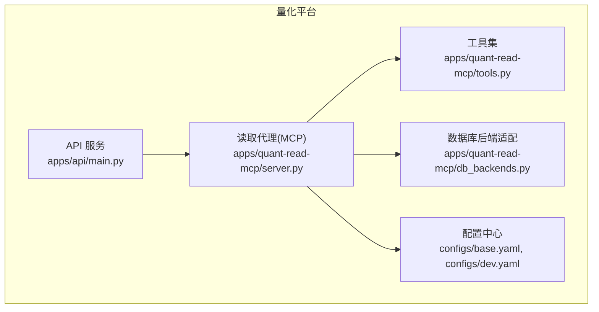
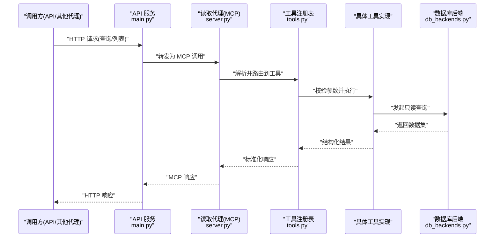
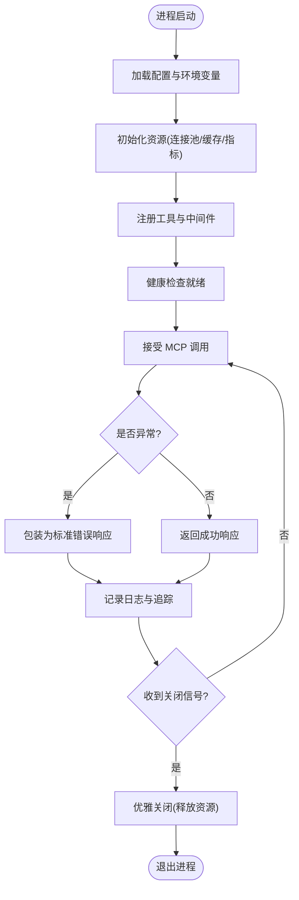
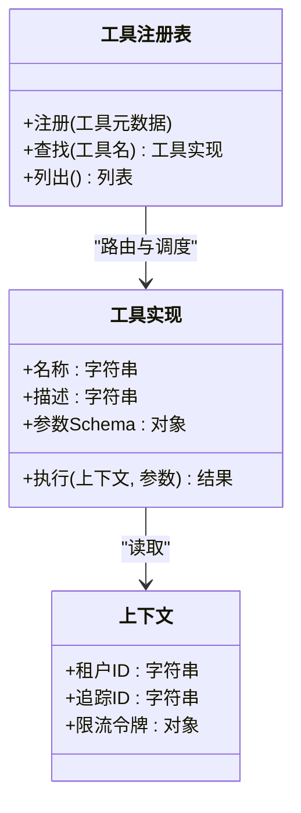
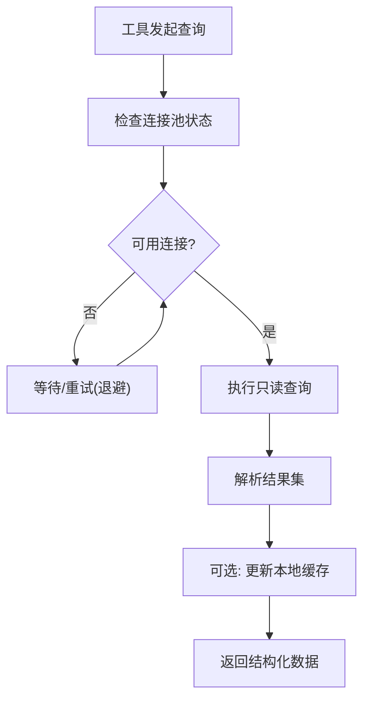
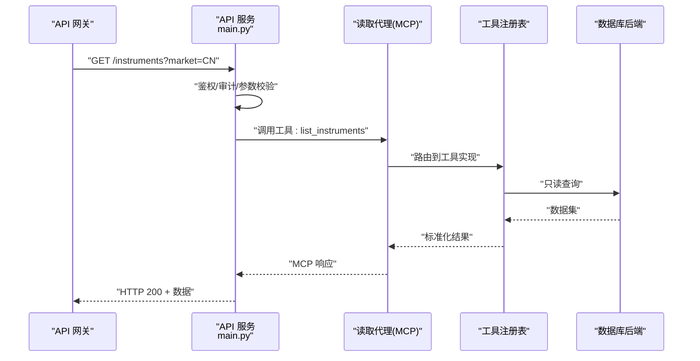
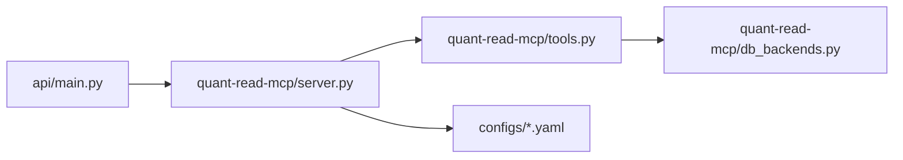

# 读取代理核心

<cite>
**本文引用的文件**   
- [apps/quant-read-mcp/server.py](file://apps/quant-read-mcp/server.py)
- [apps/quant-read-mcp/tools.py](file://apps/quant-read-mcp/tools.py)
- [apps/quant-read-mcp/db_backends.py](file://apps/quant-read-mcp/db_backends.py)
- [apps/api/main.py](file://apps/api/main.py)
- [configs/base.yaml](file://configs/base.yaml)
- [configs/dev.yaml](file://configs/dev.yaml)
</cite>

## 目录
1. [简介](#简介)
2. [项目结构](#项目结构)
3. [核心组件](#核心组件)
4. [架构总览](#架构总览)
5. [详细组件分析](#详细组件分析)
6. [依赖关系分析](#依赖关系分析)
7. [性能考虑](#性能考虑)
8. [故障排查指南](#故障排查指南)
9. [结论](#结论)
10. [附录](#附录)

## 简介
本技术文档聚焦“读取代理核心”（quant-read-mcp），围绕以下目标展开：
- MCP 服务器的初始化流程、工具注册机制与生命周期管理
- 请求处理管道、上下文传递与错误处理策略
- 代理间通信协议、消息格式定义与状态同步机制
- 配置加载、环境变量管理与多环境支持
- 扩展新工具类型的实践路径
- 与 API 网关的集成模式与路由分发机制
- 常见问题定位与优化建议（连接超时、内存泄漏、性能瓶颈）

## 项目结构
读取代理核心位于 apps/quant-read-mcp，主要包含：
- server.py：MCP 服务器启动、生命周期钩子、中间件与错误处理
- tools.py：工具注册表与具体工具实现
- db_backends.py：数据库后端抽象与适配层

图表来源
- [apps/api/main.py](file://apps/api/main.py)
- [apps/quant-read-mcp/server.py](file://apps/quant-read-mcp/server.py)
- [apps/quant-read-mcp/tools.py](file://apps/quant-read-mcp/tools.py)
- [apps/quant-read-mcp/db_backends.py](file://apps/quant-read-mcp/db_backends.py)
- [configs/base.yaml](file://configs/base.yaml)
- [configs/dev.yaml](file://configs/dev.yaml)

章节来源
- [apps/quant-read-mcp/server.py](file://apps/quant-read-mcp/server.py)
- [apps/quant-read-mcp/tools.py](file://apps/quant-read-mcp/tools.py)
- [apps/quant-read-mcp/db_backends.py](file://apps/quant-read-mcp/db_backends.py)
- [apps/api/main.py](file://apps/api/main.py)
- [configs/base.yaml](file://configs/base.yaml)
- [configs/dev.yaml](file://configs/dev.yaml)

## 核心组件
- MCP 服务器（server.py）
  - 负责进程内或进程外 MCP 会话的创建、启动、优雅关闭
  - 提供中间件用于日志、指标、追踪与错误包装
  - 维护全局上下文（如配置、连接池、缓存）
- 工具注册表（tools.py）
  - 统一的工具发现与注册入口
  - 工具元数据（名称、描述、参数 schema、权限）
  - 执行器调度与结果序列化
- 数据库后端适配（db_backends.py）
  - 统一的数据访问接口（查询、事务、批处理）
  - 多后端切换（SQLAlchemy、原生驱动等）
  - 连接池与重试策略

章节来源
- [apps/quant-read-mcp/server.py](file://apps/quant-read-mcp/server.py)
- [apps/quant-read-mcp/tools.py](file://apps/quant-read-mcp/tools.py)
- [apps/quant-read-mcp/db_backends.py](file://apps/quant-read-mcp/db_backends.py)

## 架构总览
读取代理作为 MCP 服务端，暴露一组只读工具给上层调用方（例如 API 网关或其他代理）。整体交互如下：

图表来源
- [apps/api/main.py](file://apps/api/main.py)
- [apps/quant-read-mcp/server.py](file://apps/quant-read-mcp/server.py)
- [apps/quant-read-mcp/tools.py](file://apps/quant-read-mcp/tools.py)
- [apps/quant-read-mcp/db_backends.py](file://apps/quant-read-mcp/db_backends.py)

## 详细组件分析

### MCP 服务器（server.py）
职责与要点：
- 初始化顺序
  - 加载配置与环境变量
  - 建立数据库连接池与资源
  - 注册工具与中间件
  - 启动 MCP 会话/服务
- 生命周期管理
  - 启动前准备（预热、健康检查端点）
  - 运行期监控（指标、日志、追踪）
  - 优雅关闭（释放连接、刷新缓冲、持久化状态）
- 错误处理策略
  - 统一异常捕获与分类（参数错误、业务错误、系统错误）
  - 标准化错误响应（错误码、消息、上下文）
  - 幂等与重试边界控制

图表来源
- [apps/quant-read-mcp/server.py](file://apps/quant-read-mcp/server.py)

章节来源
- [apps/quant-read-mcp/server.py](file://apps/quant-read-mcp/server.py)

### 工具注册表与工具实现（tools.py）
职责与要点：
- 工具发现与注册
  - 通过装饰器或显式注册 API 将工具加入全局注册表
  - 维护工具元数据（名称、版本、描述、参数 Schema、权限标签）
- 执行管道
  - 参数校验（类型、必填、范围）
  - 上下文注入（租户、追踪 ID、限流令牌）
  - 执行器选择（按工具名路由到具体实现）
  - 结果序列化（JSON/Protobuf/自定义）
- 扩展新工具类型
  - 新增工具类或函数，声明元数据
  - 在注册表中登记
  - 编写单元测试覆盖参数校验与典型路径

图表来源
- [apps/quant-read-mcp/tools.py](file://apps/quant-read-mcp/tools.py)

章节来源
- [apps/quant-read-mcp/tools.py](file://apps/quant-read-mcp/tools.py)

### 数据库后端适配（db_backends.py）
职责与要点：
- 统一接口
  - 查询（单条/批量）、事务、分页、排序
  - 只读语义保障（禁止写操作暴露）
- 连接与资源管理
  - 连接池大小、空闲回收、最大生命周期
  - 重试与退避策略（指数退避、抖动）
- 多后端支持
  - 基于配置切换后端（SQLAlchemy、原生驱动等）
  - 后端能力探测与降级

图表来源
- [apps/quant-read-mcp/db_backends.py](file://apps/quant-read-mcp/db_backends.py)

章节来源
- [apps/quant-read-mcp/db_backends.py](file://apps/quant-read-mcp/db_backends.py)

### 与 API 网关的集成（apps/api/main.py）
职责与要点：
- 路由分发
  - 根据路径/方法将 HTTP 请求映射到 MCP 工具调用
  - 鉴权与审计（JWT/OAuth、访问日志）
- 请求转换
  - HTTP 参数到 MCP 参数的映射
  - 响应封装（统一信封、分页、错误体）
- 可观测性
  - 链路追踪贯穿 API→MCP→DB
  - 指标采集（QPS、延迟分位、错误率）

图表来源
- [apps/api/main.py](file://apps/api/main.py)
- [apps/quant-read-mcp/server.py](file://apps/quant-read-mcp/server.py)
- [apps/quant-read-mcp/tools.py](file://apps/quant-read-mcp/tools.py)
- [apps/quant-read-mcp/db_backends.py](file://apps/quant-read-mcp/db_backends.py)

章节来源
- [apps/api/main.py](file://apps/api/main.py)

## 依赖关系分析
- 模块耦合
  - server.py 依赖 tools.py 与 db_backends.py
  - tools.py 依赖 db_backends.py 进行数据访问
  - api/main.py 依赖 server.py 作为 MCP 客户端
- 外部依赖
  - 配置中心（base.yaml、dev.yaml）
  - 数据库驱动与连接池
  - 指标与追踪库（若启用）

图表来源
- [apps/api/main.py](file://apps/api/main.py)
- [apps/quant-read-mcp/server.py](file://apps/quant-read-mcp/server.py)
- [apps/quant-read-mcp/tools.py](file://apps/quant-read-mcp/tools.py)
- [apps/quant-read-mcp/db_backends.py](file://apps/quant-read-mcp/db_backends.py)
- [configs/base.yaml](file://configs/base.yaml)
- [configs/dev.yaml](file://configs/dev.yaml)

章节来源
- [apps/api/main.py](file://apps/api/main.py)
- [apps/quant-read-mcp/server.py](file://apps/quant-read-mcp/server.py)
- [apps/quant-read-mcp/tools.py](file://apps/quant-read-mcp/tools.py)
- [apps/quant-read-mcp/db_backends.py](file://apps/quant-read-mcp/db_backends.py)
- [configs/base.yaml](file://configs/base.yaml)
- [configs/dev.yaml](file://configs/dev.yaml)

## 性能考虑
- 连接池调优
  - 合理设置最大连接数与最小空闲连接
  - 针对高并发只读场景启用连接复用
- 查询优化
  - 使用分页与字段裁剪减少传输体积
  - 对热点查询增加二级缓存（注意一致性）
- 序列化开销
  - 大结果集采用流式传输或增量返回
  - 避免不必要的深拷贝与大对象驻留
- 错误与重试
  - 对瞬时失败采用指数退避+抖动
  - 限制重试次数与超时时间，防止雪崩
- 可观测性
  - 采集关键指标（P95/P99 延迟、错误率、连接池水位）
  - 分布式追踪定位慢调用链

[本节为通用指导，不直接分析具体文件]

## 故障排查指南
- 连接超时
  - 现象：MCP 调用频繁超时或报错
  - 排查：检查数据库连接池配置、网络延迟、远端负载
  - 解决：调整超时阈值、增大连接池、启用重试与熔断
- 内存泄漏
  - 现象：进程内存持续增长
  - 排查：定位未释放的大对象、循环引用、未关闭游标
  - 解决：确保连接/游标及时关闭，避免长生命周期缓存大对象
- 性能瓶颈
  - 现象：P99 延迟升高、CPU/IO 打满
  - 排查：慢查询分析、锁竞争、序列化热点
  - 解决：索引优化、分批处理、异步化非关键路径

章节来源
- [apps/quant-read-mcp/server.py](file://apps/quant-read-mcp/server.py)
- [apps/quant-read-mcp/db_backends.py](file://apps/quant-read-mcp/db_backends.py)

## 结论
读取代理核心以 MCP 服务器为中心，通过工具注册表与数据库后端适配层，提供稳定高效的只读数据访问能力。配合 API 网关的路由分发与可观测性体系，形成高内聚、低耦合的读取子系统。通过合理的配置与环境管理、完善的错误处理与性能调优，可在生产环境中获得良好的稳定性与可扩展性。

## 附录

### 配置加载与环境变量管理
- 多环境支持
  - base.yaml：基础配置（默认值）
  - dev.yaml：开发环境覆盖项
- 环境变量优先级
  - 环境变量 > 环境特定 YAML > 基础 YAML
- 关键配置项示例（概念说明）
  - 数据库连接串、连接池大小、超时
  - 日志级别、指标上报地址
  - 功能开关（如缓存、重试）

章节来源
- [configs/base.yaml](file://configs/base.yaml)
- [configs/dev.yaml](file://configs/dev.yaml)

### 扩展新工具类型（步骤指引）
- 在 tools.py 中新增工具实现
  - 定义工具元数据（名称、描述、参数 Schema）
  - 实现执行逻辑（参数校验、上下文读取、数据访问）
- 注册工具
  - 在注册表中登记工具名与实现
- 测试与验证
  - 单元测试覆盖正常路径与异常分支
  - 集成测试验证端到端调用

章节来源
- [apps/quant-read-mcp/tools.py](file://apps/quant-read-mcp/tools.py)

### 代理间通信协议与消息格式（概念说明）
- 协议选择
  - 进程内：函数调用/事件总线
  - 跨进程：gRPC/HTTP+JSON/消息队列
- 消息格式
  - 请求：工具名、参数、上下文（租户、追踪 ID）
  - 响应：数据体、元信息（分页、耗时）、错误体
- 状态同步
  - 幂等键保证重复调用安全
  - 最终一致性模型下的补偿与重试

[本节为概念性说明，不直接分析具体文件]