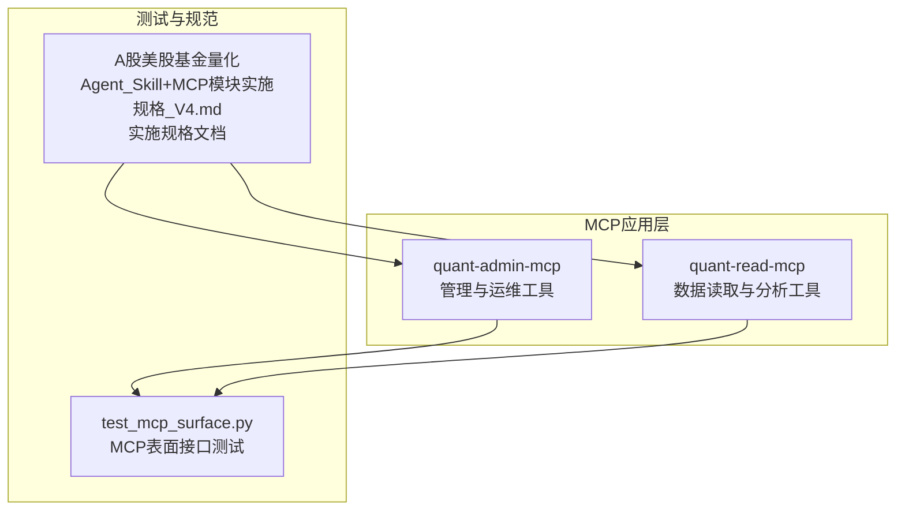
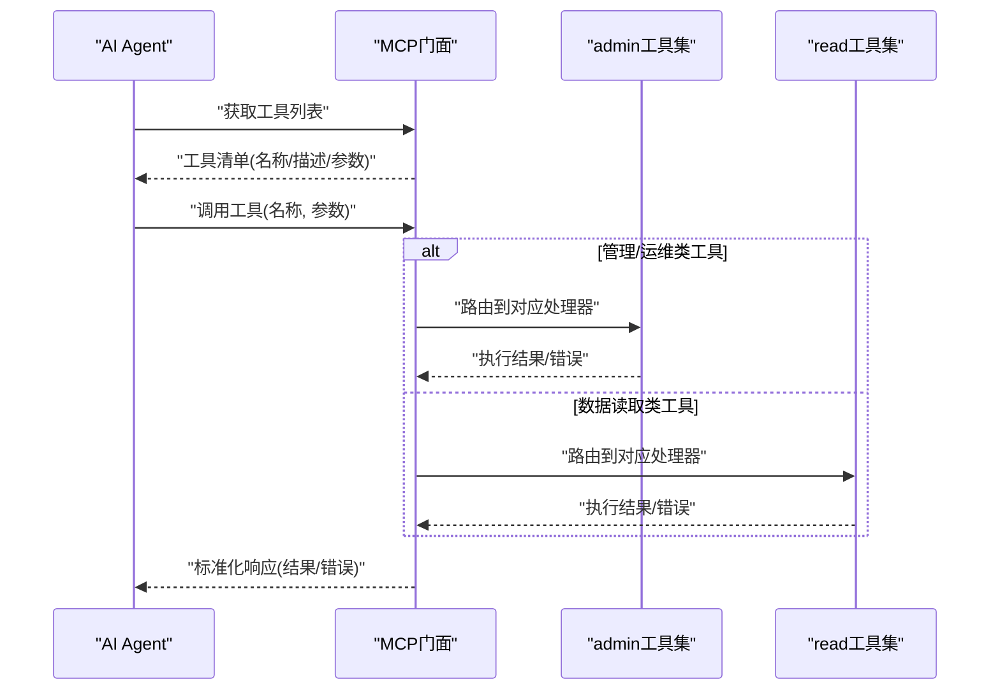
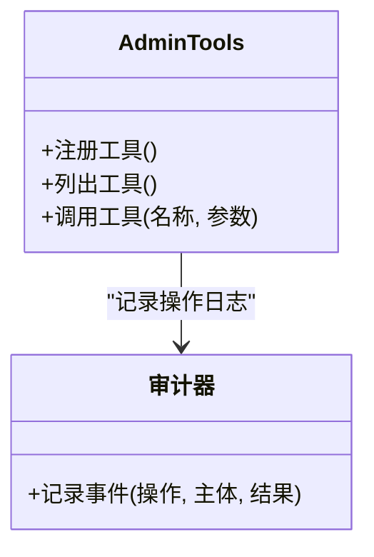
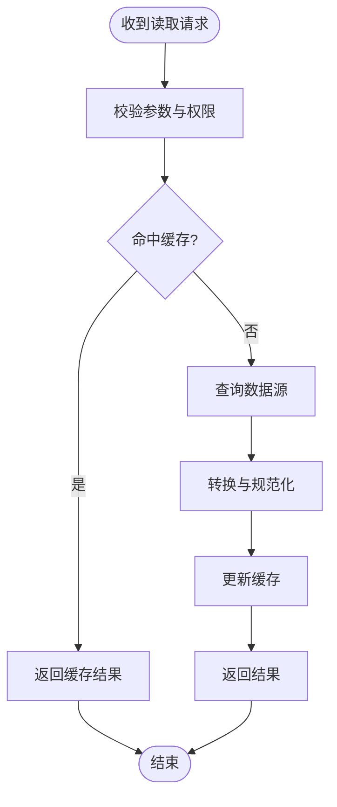
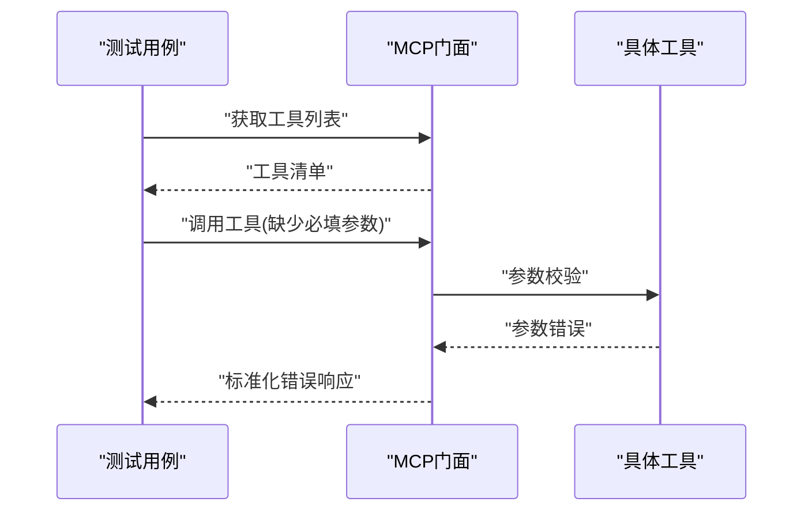
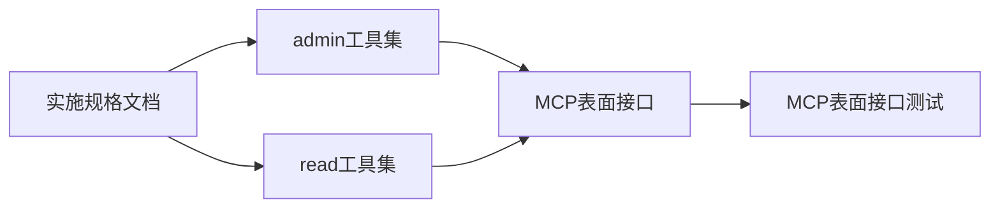

# MCP协议概述

<cite>
**本文引用的文件**   
- [apps/quant-admin-mcp/__init__.py](file://apps/quant-admin-mcp/__init__.py)
- [apps/quant-admin-mcp/tools.py](file://apps/quant-admin-mcp/tools.py)
- [apps/quant-read-mcp/__init__.py](file://apps/quant-read-mcp/__init__.py)
- [apps/quant-read-mcp/tools.py](file://apps/quant-read-mcp/tools.py)
- [tests/unit/test_mcp_surface.py](file://tests/unit/test_mcp_surface.py)
- [readme/A股美股基金量化Agent_Skill+MCP模块实施规格_V4.md](file://readme/A股美股基金量化Agent_Skill+MCP模块实施规格_V4.md)
</cite>

## 目录
1. [简介](#简介)
2. [项目结构](#项目结构)
3. [核心组件](#核心组件)
4. [架构总览](#架构总览)
5. [详细组件分析](#详细组件分析)
6. [依赖关系分析](#依赖关系分析)
7. [性能与可扩展性](#性能与可扩展性)
8. [故障排查指南](#故障排查指南)
9. [结论](#结论)
10. [附录](#附录)

## 简介
本文件面向开发者与集成方，系统化阐述本项目中“模型上下文协议（Model Context Protocol，简称MCP）”的设计与实现。文档覆盖以下要点：
- 核心概念与设计原则：在量化投资系统中，MCP作为AI Agent与系统能力之间的标准化交互契约，提供工具发现、注册、调用与结果回传的通用机制。
- 消息格式与通信机制：定义请求/响应语义、错误约定、幂等与超时策略。
- 生命周期管理：从服务启动、工具注册、会话建立到工具调用的端到端流程。
- 版本兼容与扩展机制：向后兼容策略、新增字段与能力的演进方式。
- 与AI Agent集成的架构设计与最佳实践：如何以最小侵入接入现有量化平台能力。
- 工具发现、注册与调用的完整流程：从服务端暴露到客户端发现的闭环。
- 技术细节与实现指南：结合仓库中的具体实现进行说明，并给出可操作的参考路径。

## 项目结构
仓库中与MCP相关的代码主要位于两个应用子包：
- apps/quant-admin-mcp：面向管理与运维场景的MCP工具集合
- apps/quant-read-mcp：面向数据读取与分析场景的MCP工具集合
同时，单元测试对MCP表面接口进行了验证，README文档提供了整体实施规格与背景。

图表来源
- [apps/quant-admin-mcp/__init__.py](file://apps/quant-admin-mcp/__init__.py)
- [apps/quant-admin-mcp/tools.py](file://apps/quant-admin-mcp/tools.py)
- [apps/quant-read-mcp/__init__.py](file://apps/quant-read-mcp/__init__.py)
- [apps/quant-read-mcp/tools.py](file://apps/quant-read-mcp/tools.py)
- [tests/unit/test_mcp_surface.py](file://tests/unit/test_mcp_surface.py)
- [readme/A股美股基金量化Agent_Skill+MCP模块实施规格_V4.md](file://readme/A股美股基金量化Agent_Skill+MCP模块实施规格_V4.md)

章节来源
- [apps/quant-admin-mcp/__init__.py](file://apps/quant-admin-mcp/__init__.py)
- [apps/quant-admin-mcp/tools.py](file://apps/quant-admin-mcp/tools.py)
- [apps/quant-read-mcp/__init__.py](file://apps/quant-read-mcp/__init__.py)
- [apps/quant-read-mcp/tools.py](file://apps/quant-read-mcp/tools.py)
- [tests/unit/test_mcp_surface.py](file://tests/unit/test_mcp_surface.py)
- [readme/A股美股基金量化Agent_Skill+MCP模块实施规格_V4.md](file://readme/A股美股基金量化Agent_Skill+MCP模块实施规格_V4.md)

## 核心组件
- 工具提供者（Tool Provider）：每个MCP子包负责注册一组领域工具，如“管理/运维”或“数据读取”。工具通常以函数形式暴露，并通过统一的注册入口对外可见。
- 工具描述与参数校验：为每个工具提供元信息（名称、描述、参数模式），便于客户端自动发现与表单生成。
- 统一调用门面：通过标准化的请求体与响应体，屏蔽底层差异，确保跨语言与跨进程的可互操作性。
- 错误与状态约定：明确成功、失败、部分成功等返回语义，以及错误码与诊断信息的结构。
- 生命周期钩子：在工具注册、初始化、销毁阶段提供扩展点，用于资源准备与清理。

章节来源
- [apps/quant-admin-mcp/tools.py](file://apps/quant-admin-mcp/tools.py)
- [apps/quant-read-mcp/tools.py](file://apps/quant-read-mcp/tools.py)
- [tests/unit/test_mcp_surface.py](file://tests/unit/test_mcp_surface.py)

## 架构总览
MCP在本项目中的角色是“AI Agent与量化系统能力之间的桥梁”。其典型交互包括：
- 工具发现：客户端查询可用工具列表及元信息
- 工具注册：服务端在启动时完成工具注册与校验
- 工具调用：客户端携带参数发起调用，服务端执行并返回结构化结果
- 错误处理：服务端返回标准错误对象，客户端据此重试或降级

图表来源
- [apps/quant-admin-mcp/tools.py](file://apps/quant-admin-mcp/tools.py)
- [apps/quant-read-mcp/tools.py](file://apps/quant-read-mcp/tools.py)
- [tests/unit/test_mcp_surface.py](file://tests/unit/test_mcp_surface.py)

## 详细组件分析

### 管理与运维工具集（quant-admin-mcp）
职责范围
- 提供与系统管理、配置、监控、任务调度等相关的工具能力
- 保证操作的安全性与审计追踪

关键设计
- 工具注册：集中式注册表，支持按命名空间组织
- 权限与审计：对敏感操作进行鉴权与记录
- 幂等与事务：对写操作提供幂等键与事务边界

图表来源
- [apps/quant-admin-mcp/tools.py](file://apps/quant-admin-mcp/tools.py)

章节来源
- [apps/quant-admin-mcp/tools.py](file://apps/quant-admin-mcp/tools.py)

### 数据读取与分析工具集（quant-read-mcp）
职责范围
- 提供市场数据、基本面、因子、组合快照等只读能力
- 支持分页、过滤、时间窗口等查询参数

关键设计
- 只读约束：所有工具遵循只读语义，避免副作用
- 缓存与限流：对热点查询启用缓存与速率限制
- 结果规范化：统一数据结构，便于下游消费

图表来源
- [apps/quant-read-mcp/tools.py](file://apps/quant-read-mcp/tools.py)

章节来源
- [apps/quant-read-mcp/tools.py](file://apps/quant-read-mcp/tools.py)

### MCP表面接口与测试（test_mcp_surface）
目标
- 验证MCP表面接口的稳定性与兼容性
- 覆盖工具发现、调用、错误处理等关键路径

关键用例
- 工具列表一致性检查
- 必填参数缺失时的错误返回
- 超时与异常的统一封装

图表来源
- [tests/unit/test_mcp_surface.py](file://tests/unit/test_mcp_surface.py)

章节来源
- [tests/unit/test_mcp_surface.py](file://tests/unit/test_mcp_surface.py)

### 实施规格与背景（实施规格文档）
内容要点
- 在量化研究与管理场景中引入Skill与MCP的组合方案
- 定义Agent与系统能力对接的边界与契约
- 指导工具抽象、命名规范与版本演进策略

章节来源
- [readme/A股美股基金量化Agent_Skill+MCP模块实施规格_V4.md](file://readme/A股美股基金量化Agent_Skill+MCP模块实施规格_V4.md)

## 依赖关系分析
MCP子系统内部依赖关系清晰，强调低耦合与高内聚：
- 工具集之间通过统一门面解耦，避免直接相互引用
- 测试聚焦于表面接口，降低对内部实现的侵入
- 实施规格文档作为上层契约，驱动工具集的实现与演进

图表来源
- [readme/A股美股基金量化Agent_Skill+MCP模块实施规格_V4.md](file://readme/A股美股基金量化Agent_Skill+MCP模块实施规格_V4.md)
- [apps/quant-admin-mcp/tools.py](file://apps/quant-admin-mcp/tools.py)
- [apps/quant-read-mcp/tools.py](file://apps/quant-read-mcp/tools.py)
- [tests/unit/test_mcp_surface.py](file://tests/unit/test_mcp_surface.py)

章节来源
- [apps/quant-admin-mcp/tools.py](file://apps/quant-admin-mcp/tools.py)
- [apps/quant-read-mcp/tools.py](file://apps/quant-read-mcp/tools.py)
- [tests/unit/test_mcp_surface.py](file://tests/unit/test_mcp_surface.py)
- [readme/A股美股基金量化Agent_Skill+MCP模块实施规格_V4.md](file://readme/A股美股基金量化Agent_Skill+MCP模块实施规格_V4.md)

## 性能与可扩展性
- 只读优先：read工具集采用只读语义，天然具备水平扩展潜力
- 缓存与限流：对高频查询启用缓存与速率限制，降低后端压力
- 异步与批处理：对批量读取与复杂计算建议采用异步与批处理策略
- 版本兼容：新增字段默认可选，旧客户端不受影响；废弃字段保留过渡期
- 插件化注册：新工具集可通过注册表快速接入，无需修改门面逻辑

[本节为通用指导，不直接分析具体文件]

## 故障排查指南
常见问题与定位方法
- 工具未找到：检查工具是否已正确注册，命名是否与客户端一致
- 参数校验失败：核对必填参数与类型，关注错误响应中的诊断信息
- 超时与重试：确认客户端超时设置与服务端处理能力，必要时增加重试与退避
- 权限与审计：对敏感操作核查权限配置与审计日志，定位问题根因

章节来源
- [tests/unit/test_mcp_surface.py](file://tests/unit/test_mcp_surface.py)

## 结论
MCP在本项目中承担了“AI Agent与量化系统能力”的标准化桥接作用。通过清晰的工具发现、注册与调用流程，配合严格的错误与版本策略，既保证了系统的稳定性，也为后续扩展与演进预留了空间。建议在新增能力时严格遵循实施规格，保持工具集的只读与安全边界，并以测试驱动的方式保障表面接口的长期稳定。

[本节为总结性内容，不直接分析具体文件]

## 附录
- 术语
  - 工具：由MCP暴露的可调用能力，包含名称、描述与参数模式
  - 门面：统一的请求/响应封装，屏蔽底层差异
  - 表面接口：对外稳定的API契约，受测试保护
- 参考路径
  - 管理与运维工具实现：[apps/quant-admin-mcp/tools.py](file://apps/quant-admin-mcp/tools.py)
  - 数据读取与分析工具实现：[apps/quant-read-mcp/tools.py](file://apps/quant-read-mcp/tools.py)
  - 表面接口测试：[tests/unit/test_mcp_surface.py](file://tests/unit/test_mcp_surface.py)
  - 实施规格文档：[readme/A股美股基金量化Agent_Skill+MCP模块实施规格_V4.md](file://readme/A股美股基金量化Agent_Skill+MCP模块实施规格_V4.md)