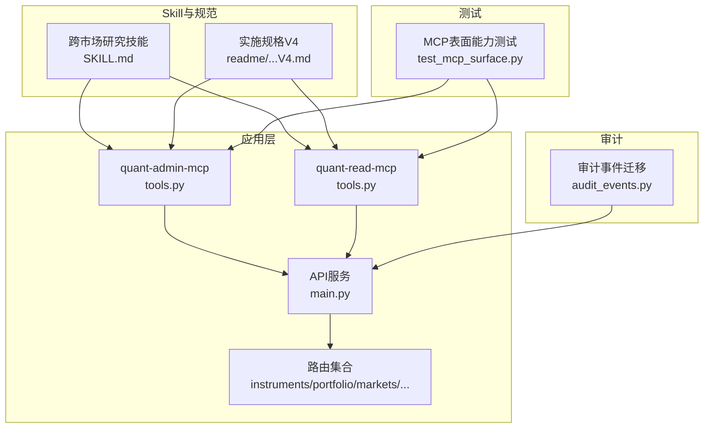
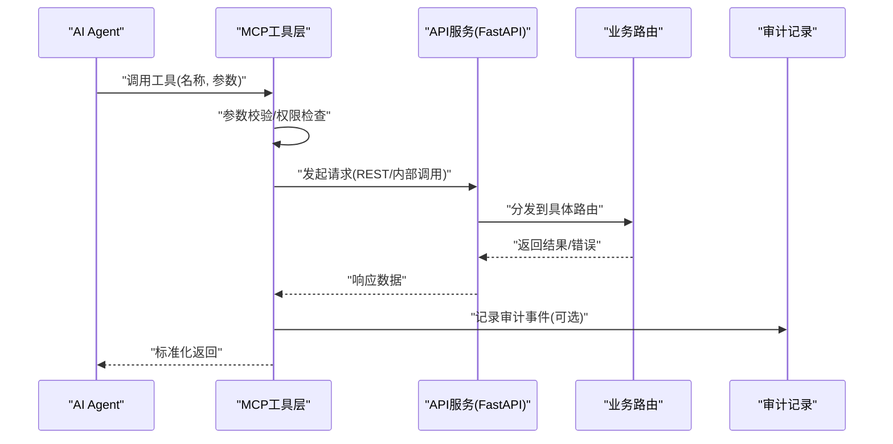
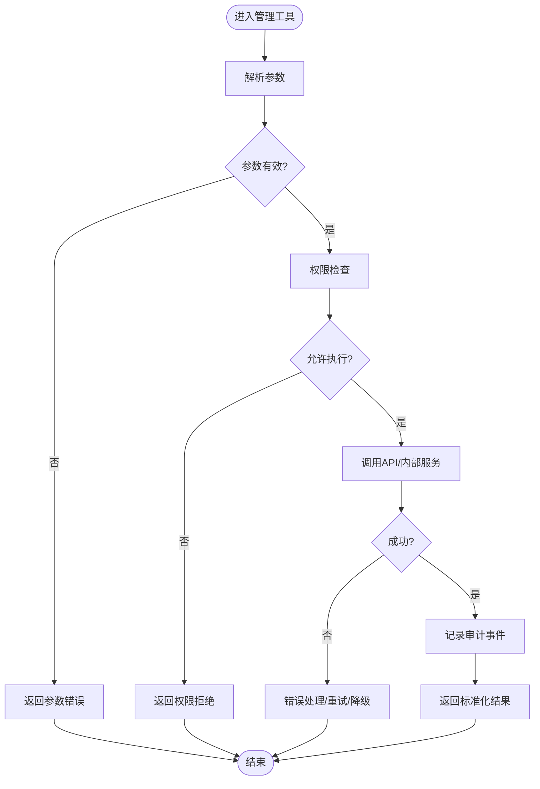
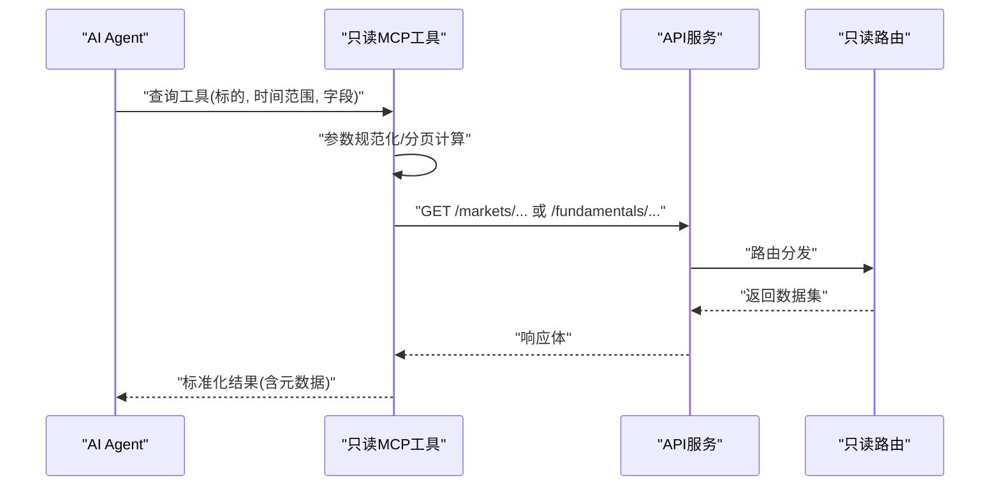
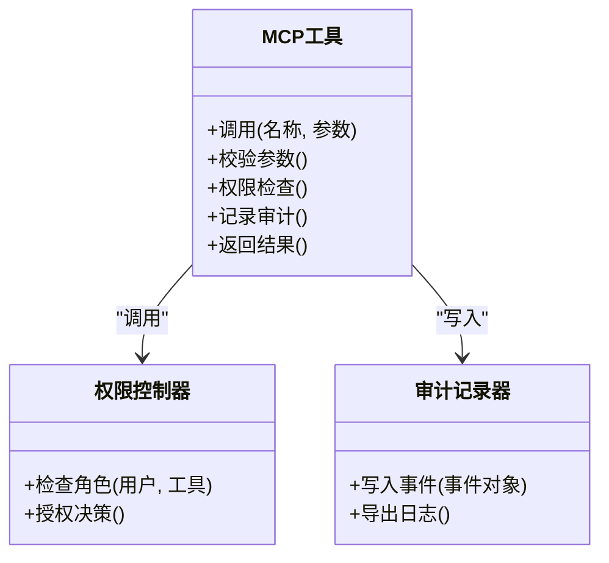
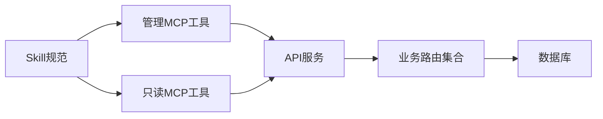

# MCP工具集

<cite>
**本文引用的文件**   
- [apps/quant-admin-mcp/tools.py](file://apps/quant-admin-mcp/tools.py)
- [apps/quant-read-mcp/tools.py](file://apps/quant-read-mcp/tools.py)
- [tests/unit/test_mcp_surface.py](file://tests/unit/test_mcp_surface.py)
- [readme/A股美股基金量化Agent_Skill+MCP模块实施规格_V4.md](file://readme/A股美股基金量化Agent_Skill+MCP模块实施规格_V4.md)
- [skills/cross-market-quant-research/SKILL.md](file://skills/cross-market-quant-research/SKILL.md)
- [apps/api/main.py](file://apps/api/main.py)
- [apps/api/routers/instruments.py](file://apps/api/routers/instruments.py)
- [apps/api/routers/portfolio.py](file://apps/api/routers/portfolio.py)
- [apps/api/routers/markets.py](file://apps/api/routers/markets.py)
- [apps/api/routers/fundamentals.py](file://apps/api/routers/fundamentals.py)
- [apps/api/routers/forecast.py](file://apps/api/routers/forecast.py)
- [apps/api/routers/admin_ingestion.py](file://apps/api/routers/admin_ingestion.py)
- [apps/api/routers/data_status.py](file://apps/api/routers/data_status.py)
- [apps/api/routers/scheduler.py](file://apps/api/routers/scheduler.py)
- [sql/migrations/20260715_0002_audit_events.py](file://sql/migrations/20260715_0002_audit_events.py)
</cite>

## 目录
1. [简介](#简介)
2. [项目结构](#项目结构)
3. [核心组件](#核心组件)
4. [架构总览](#架构总览)
5. [详细组件分析](#详细组件分析)
6. [依赖关系分析](#依赖关系分析)
7. [性能考虑](#性能考虑)
8. [故障排查指南](#故障排查指南)
9. [结论](#结论)
10. [附录](#附录)

## 简介
本文件面向AI开发者与量化系统使用者，系统化说明Model Context Protocol（MCP）在本仓库中的工作原理、集成方式与扩展方法。文档覆盖：
- MCP协议在系统中的角色与数据流
- 已实现的MCP工具清单、参数与返回格式约定
- Skill框架的设计理念与技能定义规范
- AI Agent集成示例与最佳实践
- 工具注册与动态发现机制
- 错误处理、权限控制与审计追踪实现要点
- 自然语言接口的设计与落地细节

## 项目结构
本项目采用“应用层按能力拆分 + 包层按领域划分”的组织方式。与MCP直接相关的代码位于应用层的两个MCP子应用中：
- quant-admin-mcp：提供管理侧MCP工具（如数据导入、调度等）
- quant-read-mcp：提供只读查询类MCP工具（如行情、基本面、组合等）

API服务通过FastAPI暴露REST端点，MCP工具通常由上层Agent调用，内部可复用API或领域服务。测试用例对MCP表面能力进行验证。

图示来源
- [apps/quant-admin-mcp/tools.py](file://apps/quant-admin-mcp/tools.py)
- [apps/quant-read-mcp/tools.py](file://apps/quant-read-mcp/tools.py)
- [apps/api/main.py](file://apps/api/main.py)
- [apps/api/routers/instruments.py](file://apps/api/routers/instruments.py)
- [apps/api/routers/portfolio.py](file://apps/api/routers/portfolio.py)
- [apps/api/routers/markets.py](file://apps/api/routers/markets.py)
- [apps/api/routers/fundamentals.py](file://apps/api/routers/fundamentals.py)
- [apps/api/routers/forecast.py](file://apps/api/routers/forecast.py)
- [apps/api/routers/admin_ingestion.py](file://apps/api/routers/admin_ingestion.py)
- [apps/api/routers/data_status.py](file://apps/api/routers/data_status.py)
- [apps/api/routers/scheduler.py](file://apps/api/routers/scheduler.py)
- [skills/cross-market-quant-research/SKILL.md](file://skills/cross-market-quant-research/SKILL.md)
- [readme/A股美股基金量化Agent_Skill+MCP模块实施规格_V4.md](file://readme/A股美股基金量化Agent_Skill+MCP模块实施规格_V4.md)
- [tests/unit/test_mcp_surface.py](file://tests/unit/test_mcp_surface.py)
- [sql/migrations/20260715_0002_audit_events.py](file://sql/migrations/20260715_0002_audit_events.py)

章节来源
- [apps/quant-admin-mcp/tools.py](file://apps/quant-admin-mcp/tools.py)
- [apps/quant-read-mcp/tools.py](file://apps/quant-read-mcp/tools.py)
- [apps/api/main.py](file://apps/api/main.py)
- [tests/unit/test_mcp_surface.py](file://tests/unit/test_mcp_surface.py)
- [readme/A股美股基金量化Agent_Skill+MCP模块实施规格_V4.md](file://readme/A股美股基金量化Agent_Skill+MCP模块实施规格_V4.md)
- [skills/cross-market-quant-research/SKILL.md](file://skills/cross-market-quant-research/SKILL.md)

## 核心组件
- MCP工具层
  - 管理侧工具（quant-admin-mcp）：面向数据接入、任务调度、系统管理等写操作场景。
  - 只读工具（quant-read-mcp）：面向行情、基本面、组合、预测等查询场景。
- API服务层（FastAPI）
  - 统一入口与路由组织，承载业务逻辑与外部交互。
- Skill与规范
  - 以Markdown形式描述技能边界、输入输出契约、校验脚本与参考知识，驱动Agent行为一致性。
- 测试与验收
  - 针对MCP表面能力的单元测试，保障工具契约稳定。

章节来源
- [apps/quant-admin-mcp/tools.py](file://apps/quant-admin-mcp/tools.py)
- [apps/quant-read-mcp/tools.py](file://apps/quant-read-mcp/tools.py)
- [apps/api/main.py](file://apps/api/main.py)
- [skills/cross-market-quant-research/SKILL.md](file://skills/cross-market-quant-research/SKILL.md)
- [tests/unit/test_mcp_surface.py](file://tests/unit/test_mcp_surface.py)

## 架构总览
下图展示从Agent到MCP工具再到API服务的典型调用路径，以及Skill规范如何约束工具行为。

图示来源
- [apps/quant-admin-mcp/tools.py](file://apps/quant-admin-mcp/tools.py)
- [apps/quant-read-mcp/tools.py](file://apps/quant-read-mcp/tools.py)
- [apps/api/main.py](file://apps/api/main.py)
- [apps/api/routers/instruments.py](file://apps/api/routers/instruments.py)
- [apps/api/routers/portfolio.py](file://apps/api/routers/portfolio.py)
- [apps/api/routers/markets.py](file://apps/api/routers/markets.py)
- [apps/api/routers/fundamentals.py](file://apps/api/routers/fundamentals.py)
- [apps/api/routers/forecast.py](file://apps/api/routers/forecast.py)
- [apps/api/routers/admin_ingestion.py](file://apps/api/routers/admin_ingestion.py)
- [apps/api/routers/data_status.py](file://apps/api/routers/data_status.py)
- [apps/api/routers/scheduler.py](file://apps/api/routers/scheduler.py)
- [sql/migrations/20260715_0002_audit_events.py](file://sql/migrations/20260715_0002_audit_events.py)

## 详细组件分析

### MCP工具层：管理侧（quant-admin-mcp）
- 职责
  - 封装数据接入、任务调度、系统管理等写操作为MCP工具。
  - 提供统一的参数校验、错误包装与审计埋点。
- 关键流程
  - 接收Agent调用 -> 解析并校验参数 -> 调用API路由或内部服务 -> 记录审计事件 -> 返回标准化结果。
- 典型工具类别
  - 数据接入：批量导入、增量同步、源校验。
  - 调度管理：创建/暂停/恢复定时任务、查看执行历史。
  - 系统状态：健康检查、配置读取（受限）。

图示来源
- [apps/quant-admin-mcp/tools.py](file://apps/quant-admin-mcp/tools.py)
- [apps/api/routers/admin_ingestion.py](file://apps/api/routers/admin_ingestion.py)
- [apps/api/routers/scheduler.py](file://apps/api/routers/scheduler.py)
- [sql/migrations/20260715_0002_audit_events.py](file://sql/migrations/20260715_0002_audit_events.py)

章节来源
- [apps/quant-admin-mcp/tools.py](file://apps/quant-admin-mcp/tools.py)
- [apps/api/routers/admin_ingestion.py](file://apps/api/routers/admin_ingestion.py)
- [apps/api/routers/scheduler.py](file://apps/api/routers/scheduler.py)
- [sql/migrations/20260715_0002_audit_events.py](file://sql/migrations/20260715_0002_audit_events.py)

### MCP工具层：只读侧（quant-read-mcp）
- 职责
  - 将行情、基本面、组合、预测等查询能力暴露为MCP工具。
  - 保证查询幂等、分页与过滤语义清晰。
- 关键流程
  - 接收Agent调用 -> 参数校验 -> 调用只读API -> 返回结构化数据。
- 典型工具类别
  - 标的查询：按市场、行业、指数成分筛选。
  - 行情数据：多周期Bar、快照、涨跌停与停牌信息。
  - 基本面：财务指标、公告摘要、公司行动。
  - 组合与风险：持仓、净值、风险因子暴露。
  - 预测与回测：模型输出、评估报告链接。

图示来源
- [apps/quant-read-mcp/tools.py](file://apps/quant-read-mcp/tools.py)
- [apps/api/routers/markets.py](file://apps/api/routers/markets.py)
- [apps/api/routers/fundamentals.py](file://apps/api/routers/fundamentals.py)
- [apps/api/routers/portfolio.py](file://apps/api/routers/portfolio.py)
- [apps/api/routers/forecast.py](file://apps/api/routers/forecast.py)

章节来源
- [apps/quant-read-mcp/tools.py](file://apps/quant-read-mcp/tools.py)
- [apps/api/routers/markets.py](file://apps/api/routers/markets.py)
- [apps/api/routers/fundamentals.py](file://apps/api/routers/fundamentals.py)
- [apps/api/routers/portfolio.py](file://apps/api/routers/portfolio.py)
- [apps/api/routers/forecast.py](file://apps/api/routers/forecast.py)

### 工具注册与动态发现
- 设计要点
  - 工具命名空间：按“admin/”与“read/”前缀区分读写域。
  - 注册表：集中维护工具名、描述、参数Schema与权限标签。
  - 动态发现：启动时扫描工具模块，生成可用工具列表供Agent检索。
- 建议实现
  - 使用装饰器或显式注册函数将工具加入全局注册表。
  - 对外暴露一个“列出工具”的元工具，返回工具清单与简要说明。
  - 结合Skill文档自动补全工具提示词，提升Agent可用性。

章节来源
- [apps/quant-admin-mcp/tools.py](file://apps/quant-admin-mcp/tools.py)
- [apps/quant-read-mcp/tools.py](file://apps/quant-read-mcp/tools.py)
- [tests/unit/test_mcp_surface.py](file://tests/unit/test_mcp_surface.py)

### Skill框架与技能定义规范
- 设计理念
  - 以Markdown为中心的技能契约，明确目标、输入输出、约束与校验脚本。
  - 通过脚本化校验确保输出质量与一致性。
- 规范要点
  - 技能标题与版本、适用范围、前置条件。
  - 输入参数类型、取值范围、必填项。
  - 输出数据结构、字段含义、示例。
  - 校验脚本路径与失败处理策略。
  - 与MCP工具的映射关系。
- 参考
  - 跨市场研究技能的SKILL.md定义了研究流程、产出模板与校验规则。

章节来源
- [skills/cross-market-quant-research/SKILL.md](file://skills/cross-market-quant-research/SKILL.md)
- [readme/A股美股基金量化Agent_Skill+MCP模块实施规格_V4.md](file://readme/A股美股基金量化Agent_Skill+MCP模块实施规格_V4.md)

### 自然语言接口设计与实现
- 设计原则
  - 将MCP工具描述转化为Agent可读的提示词，包括工具用途、参数说明与示例。
  - 支持模糊意图识别与参数自动填充（如日期范围、标的编码）。
- 实现建议
  - 构建“工具字典”，包含工具名、描述、参数Schema与示例问答。
  - 在Agent侧做意图分类与槽位填充，再调用对应MCP工具。
  - 对复杂任务拆分为多步工具链，结合Skill规范编排。

章节来源
- [readme/A股美股基金量化Agent_Skill+MCP模块实施规格_V4.md](file://readme/A股美股基金量化Agent_Skill+MCP模块实施规格_V4.md)
- [skills/cross-market-quant-research/SKILL.md](file://skills/cross-market-quant-research/SKILL.md)

### 错误处理、权限控制与审计追踪
- 错误处理
  - 参数错误：返回明确的字段级错误信息。
  - 权限拒绝：返回无权限提示与可用资源列表。
  - 服务异常：统一错误码与消息，必要时附带请求ID。
- 权限控制
  - 基于角色的访问控制（RBAC），在工具入口处校验。
  - 敏感操作需二次确认或审批流。
- 审计追踪
  - 记录调用者、工具名、参数摘要、结果摘要、时间戳与IP。
  - 审计事件持久化至数据库，便于追溯与分析。

图示来源
- [apps/quant-admin-mcp/tools.py](file://apps/quant-admin-mcp/tools.py)
- [apps/quant-read-mcp/tools.py](file://apps/quant-read-mcp/tools.py)
- [sql/migrations/20260715_0002_audit_events.py](file://sql/migrations/20260715_0002_audit_events.py)

章节来源
- [apps/quant-admin-mcp/tools.py](file://apps/quant-admin-mcp/tools.py)
- [apps/quant-read-mcp/tools.py](file://apps/quant-read-mcp/tools.py)
- [sql/migrations/20260715_0002_audit_events.py](file://sql/migrations/20260715_0002_audit_events.py)

### 工具清单与调用约定
- 工具命名
  - 管理侧：admin.*（例如：admin.data_ingest、admin.scheduler_manage）
  - 只读侧：read.*（例如：read.markets_bar、read.fundamentals_snapshot、read.portfolio_holdings、read.forecast_report）
- 通用参数
  - 时间范围：start_date、end_date（ISO格式）
  - 分页：page、page_size
  - 过滤：market、instrument_id、tags
- 返回格式
  - 成功：{code: 0, data: {...}, meta: {page, total}} 
  - 失败：{code: 非0, message: 错误描述, request_id: 唯一ID}
- 调用方法
  - Agent通过工具名与参数JSON调用MCP工具，MCP内部转发至API路由或领域服务。

章节来源
- [apps/quant-admin-mcp/tools.py](file://apps/quant-admin-mcp/tools.py)
- [apps/quant-read-mcp/tools.py](file://apps/quant-read-mcp/tools.py)
- [apps/api/routers/instruments.py](file://apps/api/routers/instruments.py)
- [apps/api/routers/portfolio.py](file://apps/api/routers/portfolio.py)
- [apps/api/routers/markets.py](file://apps/api/routers/markets.py)
- [apps/api/routers/fundamentals.py](file://apps/api/routers/fundamentals.py)
- [apps/api/routers/forecast.py](file://apps/api/routers/forecast.py)
- [apps/api/routers/admin_ingestion.py](file://apps/api/routers/admin_ingestion.py)
- [apps/api/routers/data_status.py](file://apps/api/routers/data_status.py)
- [apps/api/routers/scheduler.py](file://apps/api/routers/scheduler.py)

### AI Agent集成示例与最佳实践
- 示例流程
  - 获取工具清单 -> 根据用户意图选择工具 -> 构造参数 -> 调用MCP工具 -> 解析结果 -> 生成自然语言回复。
- 最佳实践
  - 参数校验前置，减少无效调用。
  - 对长耗时任务采用异步与轮询模式。
  - 结合Skill规范进行输出校验与格式化。
  - 对敏感操作增加人工确认与审计记录。

章节来源
- [tests/unit/test_mcp_surface.py](file://tests/unit/test_mcp_surface.py)
- [readme/A股美股基金量化Agent_Skill+MCP模块实施规格_V4.md](file://readme/A股美股基金量化Agent_Skill+MCP模块实施规格_V4.md)
- [skills/cross-market-quant-research/SKILL.md](file://skills/cross-market-quant-research/SKILL.md)

## 依赖关系分析
- 组件耦合
  - MCP工具层依赖API服务的路由能力；API服务内聚各业务路由。
  - Skill与规范作为外部契约，指导工具实现与Agent编排。
- 外部依赖
  - FastAPI用于HTTP服务。
  - 数据库用于持久化审计事件与业务数据。
- 潜在循环依赖
  - 避免MCP工具直接依赖API路由的具体实现，应通过抽象接口或服务层解耦。

图示来源
- [apps/quant-admin-mcp/tools.py](file://apps/quant-admin-mcp/tools.py)
- [apps/quant-read-mcp/tools.py](file://apps/quant-read-mcp/tools.py)
- [apps/api/main.py](file://apps/api/main.py)
- [apps/api/routers/instruments.py](file://apps/api/routers/instruments.py)
- [apps/api/routers/portfolio.py](file://apps/api/routers/portfolio.py)
- [apps/api/routers/markets.py](file://apps/api/routers/markets.py)
- [apps/api/routers/fundamentals.py](file://apps/api/routers/fundamentals.py)
- [apps/api/routers/forecast.py](file://apps/api/routers/forecast.py)
- [apps/api/routers/admin_ingestion.py](file://apps/api/routers/admin_ingestion.py)
- [apps/api/routers/data_status.py](file://apps/api/routers/data_status.py)
- [apps/api/routers/scheduler.py](file://apps/api/routers/scheduler.py)
- [skills/cross-market-quant-research/SKILL.md](file://skills/cross-market-quant-research/SKILL.md)

章节来源
- [apps/api/main.py](file://apps/api/main.py)
- [apps/quant-admin-mcp/tools.py](file://apps/quant-admin-mcp/tools.py)
- [apps/quant-read-mcp/tools.py](file://apps/quant-read-mcp/tools.py)

## 性能考虑
- 查询优化
  - 合理使用分页与字段裁剪，避免大结果集传输。
  - 对热点数据引入缓存层（如Redis），降低数据库压力。
- 并发与限流
  - 对高频只读工具启用并发限制与熔断策略。
  - 管理侧写操作串行化，防止冲突。
- 批处理
  - 数据接入工具支持批量提交与断点续传。
- 监控与可观测性
  - 记录工具调用耗时、错误率与资源占用，配合Prometheus/Grafana可视化。

[本节为通用性能建议，不直接分析具体文件]

## 故障排查指南
- 常见问题
  - 参数错误：检查字段类型、必填项与取值范围。
  - 权限拒绝：确认用户角色与工具权限映射。
  - 服务异常：查看请求ID与后端日志定位问题。
- 调试步骤
  - 启用详细日志，记录入参与出参摘要。
  - 使用“列出工具”元工具验证工具注册是否生效。
  - 通过API网关或中间件捕获请求链路。
- 审计回溯
  - 依据审计事件表查询调用轨迹，定位异常环节。

章节来源
- [tests/unit/test_mcp_surface.py](file://tests/unit/test_mcp_surface.py)
- [sql/migrations/20260715_0002_audit_events.py](file://sql/migrations/20260715_0002_audit_events.py)

## 结论
本仓库通过MCP工具层将量化系统的核心能力暴露给AI Agent，结合Skill规范与严格的错误处理、权限控制与审计追踪，形成一套可扩展、可观测、可治理的工具生态。建议在后续迭代中完善工具注册中心、动态提示词生成与更细粒度的权限策略，进一步提升Agent的使用体验与系统安全性。

## 附录
- 术语
  - MCP：Model Context Protocol，模型上下文协议，用于Agent与工具之间的标准化交互。
  - Skill：以Markdown定义的技能契约，描述工具边界、输入输出与校验规则。
- 参考
  - 实施规格V4文档提供了整体架构与集成要点。
  - 跨市场研究技能文档给出了研究与产出的标准流程。

章节来源
- [readme/A股美股基金量化Agent_Skill+MCP模块实施规格_V4.md](file://readme/A股美股基金量化Agent_Skill+MCP模块实施规格_V4.md)
- [skills/cross-market-quant-research/SKILL.md](file://skills/cross-market-quant-research/SKILL.md)