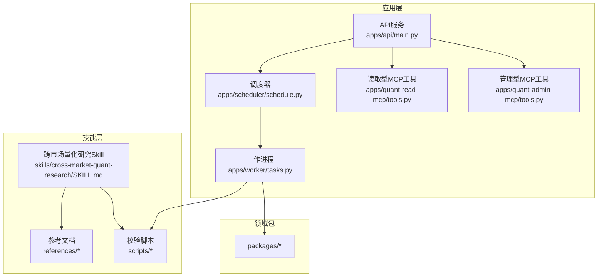
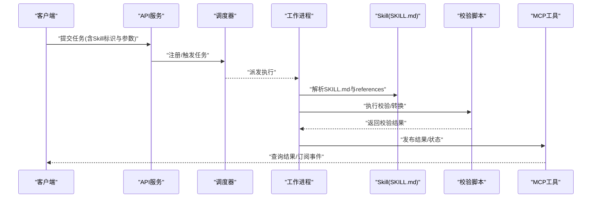
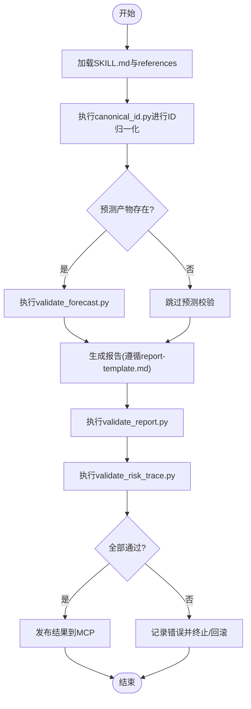
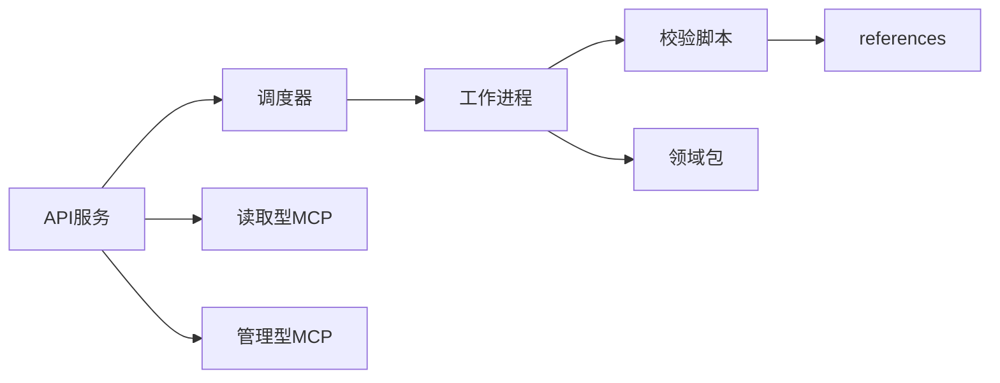

# Skill框架

<cite>
**本文引用的文件**   
- [SKILL.md](file://skills/cross-market-quant-research/SKILL.md)
- [instrument-id-format.md](file://skills/cross-market-quant-research/references/instrument-id-format.md)
- [model-families.md](file://skills/cross-market-quant-research/references/model-families.md)
- [no-forecast-reasons.md](file://skills/cross-market-quant-research/references/no-forecast-reasons.md)
- [report-template.md](file://skills/cross-market-quant-research/references/report-template.md)
- [risk-layers.md](file://skills/cross-market-quant-research/references/risk-layers.md)
- [canonical_id.py](file://skills/cross-market-quant-research/scripts/canonical_id.py)
- [validate_forecast.py](file://skills/cross-market-quant-research/scripts/validate_forecast.py)
- [validate_report.py](file://skills/cross-market-quant-research/scripts/validate_report.py)
- [validate_risk_trace.py](file://skills/cross-market-quant-research/scripts/validate_risk_trace.py)
- [test_skill_validators.py](file://tests/unit/test_skill_validators.py)
- [tools.py](file://apps/quant-read-mcp/tools.py)
- [tools.py](file://apps/quant-admin-mcp/tools.py)
- [main.py](file://apps/api/main.py)
- [schedule.py](file://apps/scheduler/schedule.py)
- [tasks.py](file://apps/worker/tasks.py)
- [README.md](file://readme/A股美股基金量化Agent_Skill+MCP模块实施规格_V4.md)
</cite>

## 目录
1. [简介](#简介)
2. [项目结构](#项目结构)
3. [核心组件](#核心组件)
4. [架构总览](#架构总览)
5. [详细组件分析](#详细组件分析)
6. [依赖关系分析](#依赖关系分析)
7. [性能考虑](#性能考虑)
8. [故障排查指南](#故障排查指南)
9. [结论](#结论)
10. [附录](#附录)

## 简介
本文件系统化阐述Skill框架的设计理念、定义规范与执行机制，重点围绕跨市场量化研究Skill的实现案例，说明SKILL.md的结构与语法约定、引用文件组织方式、脚本验证机制，以及Skill版本管理与兼容性策略。同时给出AI开发者创建与部署Skill的完整流程，并展示Skill与MCP工具的集成方式和调用模式。

## 项目结构
仓库采用“应用 + 包 + 技能”的分层组织：
- apps：API服务、调度器、工作进程、MCP工具集等运行时组件
- packages：领域能力包（数据、特征、模型、评估、风控等）
- skills：以Skill为单位的可复用知识+脚本+参考文档集合
- tests：单元测试与集成测试
- configs：配置
- deploy：部署编排
- sql：数据库迁移

图表来源
- [main.py](file://apps/api/main.py)
- [schedule.py](file://apps/scheduler/schedule.py)
- [tasks.py](file://apps/worker/tasks.py)
- [tools.py](file://apps/quant-read-mcp/tools.py)
- [tools.py](file://apps/quant-admin-mcp/tools.py)
- [SKILL.md](file://skills/cross-market-quant-research/SKILL.md)

章节来源
- [SKILL.md](file://skills/cross-market-quant-research/SKILL.md)
- [README.md](file://readme/A股美股基金量化Agent_Skill+MCP模块实施规格_V4.md)

## 核心组件
- SKILL.md：Skill的入口与契约，描述目标、输入输出、步骤、约束、产物、校验与版本信息。
- references：Skill运行所需的权威参考文档，供AI生成或校验时引用。
- scripts：可执行的校验与转换脚本，用于对中间产物进行静态检查与规范化处理。
- MCP工具：将Skill能力暴露为可被外部系统调用的标准化接口。
- 调度与工作流：通过调度器触发任务，由工作进程执行Skill脚本与领域包逻辑。

章节来源
- [SKILL.md](file://skills/cross-market-quant-research/SKILL.md)
- [instrument-id-format.md](file://skills/cross-market-quant-research/references/instrument-id-format.md)
- [model-families.md](file://skills/cross-market-quant-research/references/model-families.md)
- [no-forecast-reasons.md](file://skills/cross-market-quant-research/references/no-forecast-reasons.md)
- [report-template.md](file://skills/cross-market-quant-research/references/report-template.md)
- [risk-layers.md](file://skills/cross-market-quant-research/references/risk-layers.md)
- [canonical_id.py](file://skills/cross-market-quant-research/scripts/canonical_id.py)
- [validate_forecast.py](file://skills/cross-market-quant-research/scripts/validate_forecast.py)
- [validate_report.py](file://skills/cross-market-quant-research/scripts/validate_report.py)
- [validate_risk_trace.py](file://skills/cross-market-quant-research/scripts/validate_risk_trace.py)

## 架构总览
Skill在系统中的位置与交互如下：
- AI或上游系统根据SKILL.md的规范准备输入与参数
- 调度器按策略触发任务，工作进程加载Skill上下文与脚本
- 工作进程执行脚本，调用领域包完成数据处理、建模与评估
- 产出物经scripts中的校验脚本验证，结果通过MCP工具对外暴露
- API服务提供统一入口，协调调度、任务执行与结果查询

图表来源
- [main.py](file://apps/api/main.py)
- [schedule.py](file://apps/scheduler/schedule.py)
- [tasks.py](file://apps/worker/tasks.py)
- [tools.py](file://apps/quant-read-mcp/tools.py)
- [tools.py](file://apps/quant-admin-mcp/tools.py)
- [SKILL.md](file://skills/cross-market-quant-research/SKILL.md)

## 详细组件分析

### SKILL.md结构与语法规范
- 角色与目标：明确Skill面向的业务问题与预期产出
- 输入与约束：规定输入数据格式、范围、必填项与前置条件
- 步骤与产物：分阶段描述处理流程，明确每个阶段的输入、处理逻辑与输出产物
- 引用与依据：列出references中相关文档，确保AI生成过程有据可依
- 校验规则：声明需运行的scripts及失败时的处理策略
- 版本与兼容：记录版本变更、向后兼容策略与弃用说明
- 错误与回滚：定义异常分支、重试与补偿策略

章节来源
- [SKILL.md](file://skills/cross-market-quant-research/SKILL.md)

### 引用文件组织方式
- references目录存放权威参考文档，包括：
  - 标的ID格式规范
  - 模型族分类与选择建议
  - 无法预测的原因清单
  - 报告模板
  - 风险分层定义
- SKILL.md通过路径引用这些文档，保证AI在执行过程中能准确定位依据

章节来源
- [instrument-id-format.md](file://skills/cross-market-quant-research/references/instrument-id-format.md)
- [model-families.md](file://skills/cross-market-quant-research/references/model-families.md)
- [no-forecast-reasons.md](file://skills/cross-market-quant-research/references/no-forecast-reasons.md)
- [report-template.md](file://skills/cross-market-quant-research/references/report-template.md)
- [risk-layers.md](file://skills/cross-market-quant-research/references/risk-layers.md)

### 脚本验证机制
- canonical_id.py：负责将多源标的ID归一化为标准形式，保障跨市场一致性
- validate_forecast.py：校验预测产物的字段完整性、时间序列一致性与取值范围
- validate_report.py：基于report-template.md对报告结构、必填项与引用进行合规性检查
- validate_risk_trace.py：校验风险追踪链路的完整性与层级覆盖度

图表来源
- [canonical_id.py](file://skills/cross-market-quant-research/scripts/canonical_id.py)
- [validate_forecast.py](file://skills/cross-market-quant-research/scripts/validate_forecast.py)
- [validate_report.py](file://skills/cross-market-quant-research/scripts/validate_report.py)
- [validate_risk_trace.py](file://skills/cross-market-quant-research/scripts/validate_risk_trace.py)
- [report-template.md](file://skills/cross-market-quant-research/references/report-template.md)

章节来源
- [canonical_id.py](file://skills/cross-market-quant-research/scripts/canonical_id.py)
- [validate_forecast.py](file://skills/cross-market-quant-research/scripts/validate_forecast.py)
- [validate_report.py](file://skills/cross-market-quant-research/scripts/validate_report.py)
- [validate_risk_trace.py](file://skills/cross-market-quant-research/scripts/validate_risk_trace.py)
- [report-template.md](file://skills/cross-market-quant-research/references/report-template.md)

### 自定义Skill开发指南与最佳实践
- 设计原则
  - 单一职责：一个Skill聚焦一个明确的业务目标
  - 可观测：关键步骤埋点与日志，便于追踪与排障
  - 可验证：所有关键产物必须通过scripts校验
  - 可演进：通过版本字段与兼容性策略平滑升级
- 开发步骤
  - 编写SKILL.md：明确目标、输入、步骤、产物、校验与版本
  - 整理references：沉淀权威依据，避免AI自由发挥
  - 实现scripts：对产物进行结构化校验与规范化
  - 接入MCP：将结果与状态暴露为工具接口
  - 编写测试：覆盖边界与异常场景
- 最佳实践
  - 使用统一的ID格式与时间基准，减少跨市场差异
  - 将复杂逻辑下沉至packages，保持Skill简洁
  - 对不可预测场景建立“无预测原因”清单，提升可解释性
  - 报告严格遵循模板，确保可读性与一致性

章节来源
- [SKILL.md](file://skills/cross-market-quant-research/SKILL.md)
- [no-forecast-reasons.md](file://skills/cross-market-quant-research/references/no-forecast-reasons.md)
- [report-template.md](file://skills/cross-market-quant-research/references/report-template.md)
- [instrument-id-format.md](file://skills/cross-market-quant-research/references/instrument-id-format.md)

### Skill的版本管理与兼容性处理
- 版本字段：在SKILL.md中声明版本号与发布日期
- 向后兼容：新增字段默认可选，旧版消费者仍可运行
- 弃用策略：标记废弃字段与步骤，提供迁移指引
- 校验升级：随版本更新scripts，确保新产物符合新规范
- 测试覆盖：针对新旧版本并行回归，确保平滑过渡

章节来源
- [SKILL.md](file://skills/cross-market-quant-research/SKILL.md)

### 跨市场量化研究的Skill实现案例
- 目标：在A股、美股与基金等多市场环境下，统一标的ID、模型选择与风险评估，输出可比对的研究报告
- 关键要点
  - 统一ID：通过canonical_id.py将不同市场的ID映射为标准形式
  - 模型族：依据model-families.md选择合适的模型族与路由策略
  - 风险分层：按risk-layers.md构建多层次风险指标与追踪链路
  - 报告模板：遵循report-template.md生成结构化报告
  - 校验闭环：通过validate_*系列脚本确保产物质量

章节来源
- [instrument-id-format.md](file://skills/cross-market-quant-research/references/instrument-id-format.md)
- [model-families.md](file://skills/cross-market-quant-research/references/model-families.md)
- [risk-layers.md](file://skills/cross-market-quant-research/references/risk-layers.md)
- [report-template.md](file://skills/cross-market-quant-research/references/report-template.md)
- [canonical_id.py](file://skills/cross-market-quant-research/scripts/canonical_id.py)
- [validate_forecast.py](file://skills/cross-market-quant-research/scripts/validate_forecast.py)
- [validate_report.py](file://skills/cross-market-quant-research/scripts/validate_report.py)
- [validate_risk_trace.py](file://skills/cross-market-quant-research/scripts/validate_risk_trace.py)

### Skill与MCP工具的集成与调用模式
- 集成方式
  - 读取型MCP工具：提供查询、检索与导出能力
  - 管理型MCP工具：提供任务提交、状态查询与结果拉取
- 调用模式
  - 同步调用：适用于轻量查询与即时反馈
  - 异步任务：适用于长耗时计算与批量处理
  - 事件驱动：通过回调或轮询获取任务进度与结果

章节来源
- [tools.py](file://apps/quant-read-mcp/tools.py)
- [tools.py](file://apps/quant-admin-mcp/tools.py)

## 依赖关系分析
- 组件耦合
  - API服务依赖调度器与工作进程，间接依赖Skill与MCP工具
  - 工作进程直接依赖scripts与packages，间接依赖references
  - MCP工具作为对外暴露面，解耦内部实现细节
- 外部依赖
  - 数据库与存储：通过packages中的数据访问层抽象
  - 消息与队列：由调度器与工作进程协调
- 潜在循环依赖
  - 通过MCP与API的单向依赖避免循环
  - Skill与packages之间通过脚本与接口隔离

图表来源
- [main.py](file://apps/api/main.py)
- [schedule.py](file://apps/scheduler/schedule.py)
- [tasks.py](file://apps/worker/tasks.py)
- [tools.py](file://apps/quant-read-mcp/tools.py)
- [tools.py](file://apps/quant-admin-mcp/tools.py)
- [SKILL.md](file://skills/cross-market-quant-research/SKILL.md)

章节来源
- [main.py](file://apps/api/main.py)
- [schedule.py](file://apps/scheduler/schedule.py)
- [tasks.py](file://apps/worker/tasks.py)
- [tools.py](file://apps/quant-read-mcp/tools.py)
- [tools.py](file://apps/quant-admin-mcp/tools.py)

## 性能考虑
- 批处理与并行：对大规模标的与时间窗口采用批处理与并发执行
- 缓存与增量：对中间产物与索引进行缓存，支持增量更新
- 资源隔离：为不同Skill设置资源配额与超时限制
- 监控与度量：关键路径埋点，结合Prometheus等工具进行观测

[本节为通用指导，不直接分析具体文件]

## 故障排查指南
- 常见问题
  - 校验失败：检查scripts输出与错误码，确认references是否最新
  - ID不一致：核对canonical_id.py的映射规则与输入数据
  - 报告缺失字段：对照report-template.md逐项补齐
  - 任务超时：调整调度策略与资源配额
- 调试手段
  - 启用详细日志与追踪ID
  - 使用单元测试用例复现问题
  - 通过MCP工具查询任务状态与中间产物

章节来源
- [test_skill_validators.py](file://tests/unit/test_skill_validators.py)

## 结论
Skill框架以SKILL.md为核心契约，结合references与scripts形成“知识+执行+验证”的闭环。通过MCP工具对外暴露能力，配合调度与工作进程实现稳定可靠的自动化流水线。跨市场量化研究Skill展示了统一ID、模型选择、风险分层与报告模板的实践路径，为AI开发者提供了从创建到部署的完整方法论。

## 附录
- 术语表
  - Skill：封装业务目标、步骤与校验的可复用单元
  - MCP：Model Context Protocol，用于工具与系统的标准化集成
  - references：Skill运行所需的权威参考文档集合
  - scripts：对产物进行校验与转换的可执行脚本

[本节为概念性内容，不直接分析具体文件]