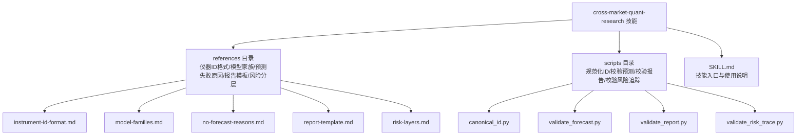
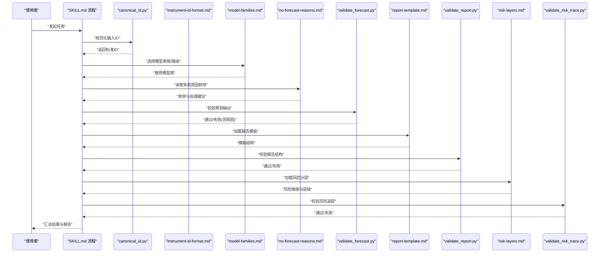
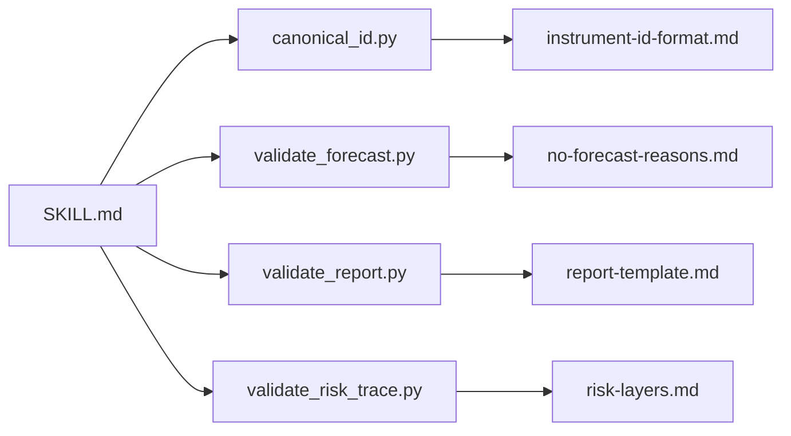

# 引用文件管理

<cite>
**本文引用的文件**   
- [SKILL.md](file://skills/cross-market-quant-research/SKILL.md)
- [instrument-id-format.md](file://skills/cross-market-quant-research/references/instrument-id-format.md)
- [model-families.md](file://skills/cross-market-quant-research/references/model-families.md)
- [no-forecast-reasons.md](file://skills/cross-market-quant-research/references/no-forecast-reasons.md)
- [report-template.md](file://skills/cross-market-quant-research/references/report-template.md)
- [risk-layers.md](file://skills/cross-market-quant-research/references/risk-layers.md)
- [canonical_id.py](file://skills/cross-market-quant-research/scripts/canonical_id.py)
- [validate_forecast.py](file://skills/cross-market-quant-research/scripts/validate_forecast.py)
- [validate_report.py](file://skills/cross-market-quant-research/scripts/validate_report.py)
- [validate_risk_trace.py](file://skills/cross-market-quant-research/scripts/validate_risk_trace.py)
</cite>

## 目录
1. [简介](#简介)
2. [项目结构](#项目结构)
3. [核心组件](#核心组件)
4. [架构总览](#架构总览)
5. [详细组件分析](#详细组件分析)
6. [依赖关系分析](#依赖关系分析)
7. [性能与可维护性考虑](#性能与可维护性考虑)
8. [故障排查指南](#故障排查指南)
9. [结论](#结论)
10. [附录](#附录)

## 简介
本文件面向跨市场量化研究中的“引用文件管理”，聚焦于 skills/cross-market-quant-research/references 目录的组织规范、命名约定、参考文档类型与用途，以及如何在 Skill 中引用与管理这些外部知识文件。同时提供文档维护与更新的最佳实践，并展示在跨市场量化研究中不同类型参考文件的典型使用场景与集成方式。

## 项目结构
引用文件位于技能包内，遵循“以技能为中心”的模块化组织方式：每个技能拥有独立的 references 目录存放领域知识、模板与规范；scripts 目录提供校验与工具脚本；SKILL.md 作为技能的入口说明，描述如何消费 references 下的资源。

图表来源
- [SKILL.md:1-200](file://skills/cross-market-quant-research/SKILL.md#L1-L200)
- [instrument-id-format.md:1-200](file://skills/cross-market-quant-research/references/instrument-id-format.md#L1-L200)
- [model-families.md:1-200](file://skills/cross-market-quant-research/references/model-families.md#L1-L200)
- [no-forecast-reasons.md:1-200](file://skills/cross-market-quant-research/references/no-forecast-reasons.md#L1-L200)
- [report-template.md:1-200](file://skills/cross-market-quant-research/references/report-template.md#L1-L200)
- [risk-layers.md:1-200](file://skills/cross-market-quant-research/references/risk-layers.md#L1-L200)
- [canonical_id.py:1-200](file://skills/cross-market-quant-research/scripts/canonical_id.py#L1-L200)
- [validate_forecast.py:1-200](file://skills/cross-market-quant-research/scripts/validate_forecast.py#L1-L200)
- [validate_report.py:1-200](file://skills/cross-market-quant-research/scripts/validate_report.py#L1-L200)
- [validate_risk_trace.py:1-200](file://skills/cross-market-quant-research/scripts/validate_risk_trace.py#L1-L200)

章节来源
- [SKILL.md:1-200](file://skills/cross-market-quant-research/SKILL.md#L1-L200)

## 核心组件
- 参考文档集合（references）
  - 仪器ID格式规范：定义跨市场统一标识符的语法、字段含义与示例，确保数据与模型输入的一致性。
  - 模型家族分类：对模型族进行归类与能力边界说明，指导选择与路由策略。
  - 预测失败原因分析：标准化失败归因标签与处理建议，便于自动化诊断与复盘。
  - 报告模板：统一的输出结构与必填项，保证报告可读性与可解析性。
  - 风险分层框架：明确风险维度、层级划分与度量口径，支撑风控与归因。
- 校验与工具脚本（scripts）
  - 规范化ID生成：将原始标识转换为标准形式，减少下游歧义。
  - 预测结果校验：依据“预测失败原因”等规范检查输出完整性与一致性。
  - 报告校验：基于“报告模板”约束验证结构、字段与必填项。
  - 风险追踪校验：结合“风险分层框架”验证风险指标与链路完整性。
- 技能入口（SKILL.md）
  - 描述如何使用上述参考文档与脚本，给出调用顺序、参数约定与错误处理指引。

章节来源
- [instrument-id-format.md:1-200](file://skills/cross-market-quant-research/references/instrument-id-format.md#L1-L200)
- [model-families.md:1-200](file://skills/cross-market-quant-research/references/model-families.md#L1-L200)
- [no-forecast-reasons.md:1-200](file://skills/cross-market-quant-research/references/no-forecast-reasons.md#L1-L200)
- [report-template.md:1-200](file://skills/cross-market-quant-research/references/report-template.md#L1-L200)
- [risk-layers.md:1-200](file://skills/cross-market-quant-research/references/risk-layers.md#L1-L200)
- [canonical_id.py:1-200](file://skills/cross-market-quant-research/scripts/canonical_id.py#L1-L200)
- [validate_forecast.py:1-200](file://skills/cross-market-quant-research/scripts/validate_forecast.py#L1-L200)
- [validate_report.py:1-200](file://skills/cross-market-quant-research/scripts/validate_report.py#L1-L200)
- [validate_risk_trace.py:1-200](file://skills/cross-market-quant-research/scripts/validate_risk_trace.py#L1-L200)
- [SKILL.md:1-200](file://skills/cross-market-quant-research/SKILL.md#L1-L200)

## 架构总览
以下序列图展示了在 Skill 工作流中，如何按步骤消费 references 与 scripts，完成从输入到输出的端到端流程。

图表来源
- [SKILL.md:1-200](file://skills/cross-market-quant-research/SKILL.md#L1-L200)
- [canonical_id.py:1-200](file://skills/cross-market-quant-research/scripts/canonical_id.py#L1-L200)
- [instrument-id-format.md:1-200](file://skills/cross-market-quant-research/references/instrument-id-format.md#L1-L200)
- [model-families.md:1-200](file://skills/cross-market-quant-research/references/model-families.md#L1-L200)
- [no-forecast-reasons.md:1-200](file://skills/cross-market-quant-research/references/no-forecast-reasons.md#L1-L200)
- [validate_forecast.py:1-200](file://skills/cross-market-quant-research/scripts/validate_forecast.py#L1-L200)
- [report-template.md:1-200](file://skills/cross-market-quant-research/references/report-template.md#L1-L200)
- [validate_report.py:1-200](file://skills/cross-market-quant-research/scripts/validate_report.py#L1-L200)
- [risk-layers.md:1-200](file://skills/cross-market-quant-research/references/risk-layers.md#L1-L200)
- [validate_risk_trace.py:1-200](file://skills/cross-market-quant-research/scripts/validate_risk_trace.py#L1-L200)

## 详细组件分析

### 参考文档类型与用途
- 仪器ID格式规范（instrument-id-format.md）
  - 作用：统一跨市场资产标识，避免多源异构导致的匹配与聚合问题。
  - 关键内容：字段组成、分隔符、大小写与地区后缀约定、示例与反例。
  - 适用场景：数据接入、特征工程、回测与实盘交易前的ID对齐。
- 模型家族分类（model-families.md）
  - 作用：为不同建模方法建立族谱与能力边界，辅助自动路由与组合。
  - 关键内容：家族定义、适用标的、假设条件、优缺点与限制。
  - 适用场景：策略研发、模型选择、A/B测试与版本治理。
- 预测失败原因分析（no-forecast-reasons.md）
  - 作用：标准化失败归因标签与处置建议，提升排障效率。
  - 关键内容：失败类别、触发条件、修复建议、影响范围。
  - 适用场景：监控告警、复盘审计、自动化重试与降级。
- 报告模板（report-template.md）
  - 作用：统一报告结构与必填项，保障可解析与可比较。
  - 关键内容：章节结构、字段清单、单位与时间粒度、样例占位。
  - 适用场景：投研汇报、合规留痕、对外披露。
- 风险分层框架（risk-layers.md）
  - 作用：明确风险维度与层级，统一度量口径与阈值。
  - 关键内容：风险域划分、指标定义、阈值与预警规则。
  - 适用场景：风控系统、压力测试、限额管理与穿透归因。

章节来源
- [instrument-id-format.md:1-200](file://skills/cross-market-quant-research/references/instrument-id-format.md#L1-L200)
- [model-families.md:1-200](file://skills/cross-market-quant-research/references/model-families.md#L1-L200)
- [no-forecast-reasons.md:1-200](file://skills/cross-market-quant-research/references/no-forecast-reasons.md#L1-L200)
- [report-template.md:1-200](file://skills/cross-market-quant-research/references/report-template.md#L1-L200)
- [risk-layers.md:1-200](file://skills/cross-market-quant-research/references/risk-layers.md#L1-L200)

### 校验与工具脚本
- canonical_id.py
  - 功能：将非标准或混合格式的ID转换为规范形式，支持批量与增量模式。
  - 输入/输出：原始ID列表/文件 -> 标准ID列表/文件。
  - 关联参考：instrument-id-format.md。
- validate_forecast.py
  - 功能：校验预测输出是否符合预期结构，并结合失败原因枚举进行诊断。
  - 输入/输出：预测结果文件/对象 -> 校验报告与失败原因。
  - 关联参考：no-forecast-reasons.md。
- validate_report.py
  - 功能：基于报告模板校验结构完整性与必填项，输出差异清单。
  - 输入/输出：报告文件/对象 -> 校验结果与修正建议。
  - 关联参考：report-template.md。
- validate_risk_trace.py
  - 功能：依据风险分层框架校验风险指标链路与阈值，定位缺失与越界。
  - 输入/输出：风险追踪数据 -> 校验结果与风险提示。
  - 关联参考：risk-layers.md。

章节来源
- [canonical_id.py:1-200](file://skills/cross-market-quant-research/scripts/canonical_id.py#L1-L200)
- [validate_forecast.py:1-200](file://skills/cross-market-quant-research/scripts/validate_forecast.py#L1-L200)
- [validate_report.py:1-200](file://skills/cross-market-quant-research/scripts/validate_report.py#L1-L200)
- [validate_risk_trace.py:1-200](file://skills/cross-market-quant-research/scripts/validate_risk_trace.py#L1-L200)

### 在 Skill 中引用与管理外部知识文件
- 引用方式
  - 在 SKILL.md 中以路径引用 references 下的具体文档，并在流程节点中指明使用该文档的规则。
  - 通过 scripts 中的工具脚本对 references 的约束进行自动化校验与转换。
- 管理要点
  - 单一事实来源：所有规范与模板仅存在于 references 目录，禁止在代码中硬编码。
  - 版本化与变更日志：每次修改需记录变更点、影响面与回滚方案。
  - 最小权限访问：仅允许必要人员编辑，变更需经同行评审。
  - 自动化门禁：在提交前运行 scripts 中的校验脚本，阻断不合规变更。

章节来源
- [SKILL.md:1-200](file://skills/cross-market-quant-research/SKILL.md#L1-L200)

### 跨市场量化研究的使用场景与集成方式
- 场景一：多源数据接入与ID对齐
  - 使用 instrument-id-format.md 统一各市场原始ID，配合 canonical_id.py 完成清洗与映射。
- 场景二：模型路由与组合
  - 依据 model-families.md 选择合适模型族，结合历史表现与约束条件进行动态路由。
- 场景三：预测质量监控与自愈
  - 利用 no-forecast-reasons.md 的归因标签驱动 validate_forecast.py，实现自动重试、降级与告警。
- 场景四：报告生产与合规留痕
  - 基于 report-template.md 生成结构化报告，并通过 validate_report.py 进行前置校验。
- 场景五：风险穿透与限额管理
  - 根据 risk-layers.md 构建风险指标体系，借助 validate_risk_trace.py 进行实时校验与拦截。

章节来源
- [instrument-id-format.md:1-200](file://skills/cross-market-quant-research/references/instrument-id-format.md#L1-L200)
- [model-families.md:1-200](file://skills/cross-market-quant-research/references/model-families.md#L1-L200)
- [no-forecast-reasons.md:1-200](file://skills/cross-market-quant-research/references/no-forecast-reasons.md#L1-L200)
- [report-template.md:1-200](file://skills/cross-market-quant-research/references/report-template.md#L1-L200)
- [risk-layers.md:1-200](file://skills/cross-market-quant-research/references/risk-layers.md#L1-L200)
- [canonical_id.py:1-200](file://skills/cross-market-quant-research/scripts/canonical_id.py#L1-L200)
- [validate_forecast.py:1-200](file://skills/cross-market-quant-research/scripts/validate_forecast.py#L1-L200)
- [validate_report.py:1-200](file://skills/cross-market-quant-research/scripts/validate_report.py#L1-L200)
- [validate_risk_trace.py:1-200](file://skills/cross-market-quant-research/scripts/validate_risk_trace.py#L1-L200)

## 依赖关系分析
references 与 scripts 之间存在明确的“规范-实现”依赖关系：脚本以参考文档为权威约束，SKILL.md 编排调用顺序与上下文。

图表来源
- [SKILL.md:1-200](file://skills/cross-market-quant-research/SKILL.md#L1-L200)
- [canonical_id.py:1-200](file://skills/cross-market-quant-research/scripts/canonical_id.py#L1-L200)
- [validate_forecast.py:1-200](file://skills/cross-market-quant-research/scripts/validate_forecast.py#L1-L200)
- [validate_report.py:1-200](file://skills/cross-market-quant-research/scripts/validate_report.py#L1-L200)
- [validate_risk_trace.py:1-200](file://skills/cross-market-quant-research/scripts/validate_risk_trace.py#L1-L200)
- [instrument-id-format.md:1-200](file://skills/cross-market-quant-research/references/instrument-id-format.md#L1-L200)
- [no-forecast-reasons.md:1-200](file://skills/cross-market-quant-research/references/no-forecast-reasons.md#L1-L200)
- [report-template.md:1-200](file://skills/cross-market-quant-research/references/report-template.md#L1-L200)
- [risk-layers.md:1-200](file://skills/cross-market-quant-research/references/risk-layers.md#L1-L200)

## 性能与可维护性考虑
- 性能
  - 批量处理：对大规模ID与报告采用流式/分块处理，降低内存峰值。
  - 缓存策略：对稳定不变的参考文档（如模板、枚举）进行只读缓存，减少重复I/O。
  - 并行校验：对相互独立的校验任务（预测、报告、风险）并发执行，缩短端到端时延。
- 可维护性
  - 单一职责：每个脚本仅负责一项校验或转换，避免耦合。
  - 配置外置：将阈值、白名单、黑名单等易变参数抽离至配置文件，避免频繁改码。
  - 回归用例：为关键路径补充单元测试与黄金样本，确保变更安全。

[本节为通用指导，无需源码引用]

## 故障排查指南
- 常见问题
  - ID不规范：使用 canonical_id.py 重新规范化，对照 instrument-id-format.md 逐项核对字段。
  - 预测失败：查看 validate_forecast.py 输出与 no-forecast-reasons.md 的归因标签，定位根因并执行修复建议。
  - 报告不完整：依据 validate_report.py 的差异清单，补齐 report-template.md 要求的必填项。
  - 风险指标缺失：结合 risk-layers.md 的风险维度，检查 validate_risk_trace.py 的断言与阈值。
- 快速自检清单
  - 是否已运行全部校验脚本且无报错？
  - 参考文档是否为最新版本？
  - 变更是否经过同行评审与回归测试？

章节来源
- [canonical_id.py:1-200](file://skills/cross-market-quant-research/scripts/canonical_id.py#L1-L200)
- [validate_forecast.py:1-200](file://skills/cross-market-quant-research/scripts/validate_forecast.py#L1-L200)
- [validate_report.py:1-200](file://skills/cross-market-quant-research/scripts/validate_report.py#L1-L200)
- [validate_risk_trace.py:1-200](file://skills/cross-market-quant-research/scripts/validate_risk_trace.py#L1-L200)
- [instrument-id-format.md:1-200](file://skills/cross-market-quant-research/references/instrument-id-format.md#L1-L200)
- [no-forecast-reasons.md:1-200](file://skills/cross-market-quant-research/references/no-forecast-reasons.md#L1-L200)
- [report-template.md:1-200](file://skills/cross-market-quant-research/references/report-template.md#L1-L200)
- [risk-layers.md:1-200](file://skills/cross-market-quant-research/references/risk-layers.md#L1-L200)

## 结论
通过将规范、模板与校验脚本集中在技能包内，并以 SKILL.md 为编排入口，引用文件管理实现了“规范即代码、校验即门禁”的工程化落地。这既提升了跨市场研究的协作效率，也保障了数据、模型与报告的稳定性与可追溯性。

[本节为总结性内容，无需源码引用]

## 附录
- 命名规范建议
  - 文件名小写、连字符分隔，语义清晰，避免缩写歧义。
  - 版本号与日期信息不在文件名中体现，统一由变更日志管理。
- 最佳实践
  - 先有规范后有实现：任何新增能力需同步更新对应 reference 与校验脚本。
  - 变更可回溯：提交信息需关联相关 reference 与脚本变更。
  - 持续演练：定期用真实数据跑通端到端流程，发现潜在不一致。

[本节为通用指导，无需源码引用]