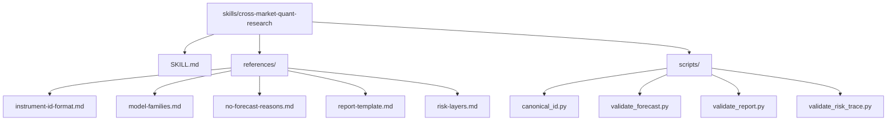
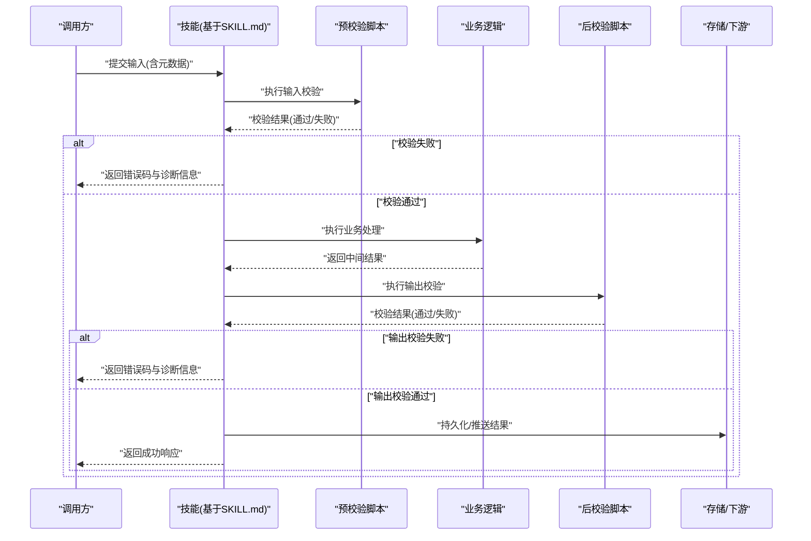
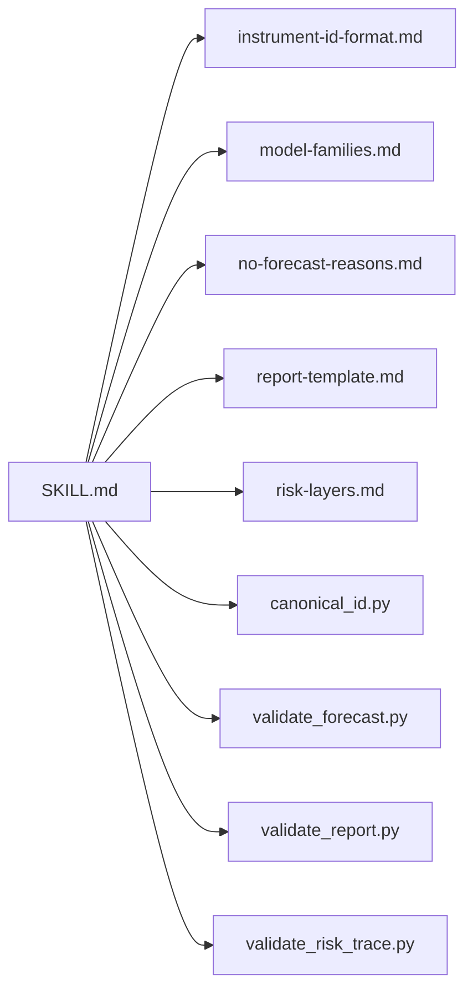
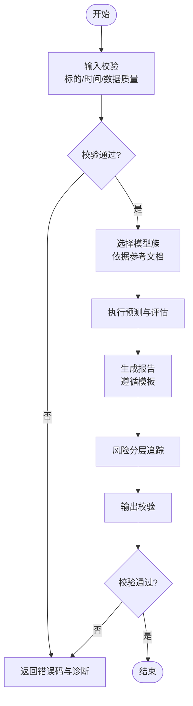
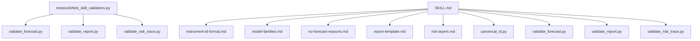

# 技能定义规范

<cite>
**本文引用的文件**   
- [SKILL.md](file://skills/cross-market-quant-research/SKILL.md)
- [instrument-id-format.md](file://skills/cross-market-quant-research/references/instrument-id-format.md)
- [model-families.md](file://skills/cross-market-quant-research/references/model-families.md)
- [no-forecast-reasons.md](file://skills/cross-market-quant-research/references/no-forecast-reasons.md)
- [report-template.md](file://skills/cross-market-quant-research/references/report-template.md)
- [risk-layers.md](file://skills/cross-market-quant-research/references/risk-layers.md)
- [canonical_id.py](file://skills/cross-market-quant-research/scripts/canonical_id.py)
- [validate_forecast.py](file://skills/cross-market-quant-research/scripts/validate_forecast.py)
- [validate_report.py](file://skills/cross-market-quant-research/scripts/validate_report.py)
- [validate_risk_trace.py](file://skills/cross-market-quant-research/scripts/validate_risk_trace.py)
- [test_skill_validators.py](file://tests/unit/test_skill_validators.py)
</cite>

## 目录
1. [简介](#简介)
2. [项目结构](#项目结构)
3. [核心组件](#核心组件)
4. [架构总览](#架构总览)
5. [详细组件分析](#详细组件分析)
6. [依赖分析](#依赖分析)
7. [性能考虑](#性能考虑)
8. [故障排查指南](#故障排查指南)
9. [结论](#结论)
10. [附录](#附录)

## 简介
本规范面向跨市场量化研究场景，定义“技能”（Skill）的声明与实现标准。以 SKILL.md 为核心契约，统一描述技能的元数据、输入输出、执行环境、依赖关系、版本控制、错误处理与可观测性要求；通过 references 提供领域参考，scripts 提供校验与工具脚本，确保技能在跨市场环境中具备一致性与可验证性。

## 项目结构
技能包采用“声明 + 参考 + 脚本”的组织方式：
- SKILL.md：技能契约，包含元数据、参数、输入输出、执行约束、错误码、依赖与版本策略等。
- references：领域参考文档，如标的标识格式、模型族、风险分层、报告模板等。
- scripts：运行时或离线校验脚本，用于输入/输出/风险追踪等一致性检查。

图示来源
- [SKILL.md:1-200](file://skills/cross-market-quant-research/SKILL.md#L1-L200)
- [instrument-id-format.md:1-200](file://skills/cross-market-quant-research/references/instrument-id-format.md#L1-L200)
- [model-families.md:1-200](file://skills/cross-market-quant-research/references/model-families.md#L1-L200)
- [no-forecast-reasons.md:1-200](file://skills/cross-market-quant-research/references/no-forecast-reasons.md#L1-L200)
- [report-template.md:1-200](file://skills/cross-market-quant-research/references/report-template.md#L1-L200)
- [risk-layers.md:1-200](file://skills/cross-market-quant-research/references/risk-layers.md#L1-L200)
- [canonical_id.py:1-200](file://skills/cross-market-quant-research/scripts/canonical_id.py#L1-L200)
- [validate_forecast.py:1-200](file://skills/cross-market-quant-research/scripts/validate_forecast.py#L1-L200)
- [validate_report.py:1-200](file://skills/cross-market-quant-research/scripts/validate_report.py#L1-L200)
- [validate_risk_trace.py:1-200](file://skills/cross-market-quant-research/scripts/validate_risk_trace.py#L1-L200)

章节来源
- [SKILL.md:1-200](file://skills/cross-market-quant-research/SKILL.md#L1-L200)

## 核心组件
- 元数据与版本
  - 字段包括：名称、版本、作者、许可证、描述、标签、兼容范围等。
  - 版本策略遵循语义化版本，变更需记录于变更日志或提交说明中。
- 描述与用途
  - 明确技能目标、适用市场、数据域与典型使用场景。
- 参数配置
  - 参数名、类型、默认值、取值范围、是否必填、示例与说明。
- 输入/输出格式
  - 输入：数据结构、字段含义、约束条件、时间粒度、标的标识规范。
  - 输出：结果结构、指标定义、质量评分、不确定性估计、可复现信息。
- 执行环境与依赖
  - Python 版本、第三方库、外部服务、环境变量、资源配额与超时限制。
- 依赖关系
  - 上游数据源、下游消费方、共享参考文档与脚本。
- 错误处理
  - 错误码分类、错误消息结构、重试与降级策略、审计与追踪字段。
- 可观测性与审计
  - 指标上报、日志规范、追踪ID、输入输出快照与回放能力。

章节来源
- [SKILL.md:1-200](file://skills/cross-market-quant-research/SKILL.md#L1-L200)

## 架构总览
技能运行时的关键交互如下：调用方传入结构化输入，执行前由校验脚本进行一致性检查，随后进入业务逻辑并产出结果，最后由输出校验脚本保障输出契约。

图示来源
- [validate_forecast.py:1-200](file://skills/cross-market-quant-research/scripts/validate_forecast.py#L1-L200)
- [validate_report.py:1-200](file://skills/cross-market-quant-research/scripts/validate_report.py#L1-L200)
- [validate_risk_trace.py:1-200](file://skills/cross-market-quant-research/scripts/validate_risk_trace.py#L1-L200)
- [SKILL.md:1-200](file://skills/cross-market-quant-research/SKILL.md#L1-L200)

## 详细组件分析

### 元数据与版本控制
- 元数据字段建议
  - 名称、版本、作者、许可证、描述、标签、兼容范围、维护者联系方式。
- 版本策略
  - 语义化版本：主版本不兼容变更，次版本新增功能，补丁版本修复问题。
  - 变更影响评估：对输入/输出契约、依赖、执行环境的破坏性变更需提升主版本。
- 兼容性矩阵
  - 明确支持的Python版本、关键库版本区间、外部API版本。

章节来源
- [SKILL.md:1-200](file://skills/cross-market-quant-research/SKILL.md#L1-L200)

### 描述与用途
- 目标与边界
  - 明确解决的业务问题、覆盖的市场与资产类别、不适用的场景。
- 典型用例
  - 给出端到端流程与预期效果，便于使用者快速上手。

章节来源
- [SKILL.md:1-200](file://skills/cross-market-quant-research/SKILL.md#L1-L200)

### 参数配置
- 参数定义
  - 每个参数应包含：名称、类型、默认值、是否必填、取值范围、示例、说明。
- 参数校验
  - 在预校验阶段完成类型、范围、组合约束的检查，并提供清晰的错误提示。

章节来源
- [SKILL.md:1-200](file://skills/cross-market-quant-research/SKILL.md#L1-L200)

### 输入/输出格式
- 输入
  - 标的标识：遵循 instrument-id-format.md 的规范，保证跨市场唯一性与可解析性。
  - 时间窗口：起止时间、频率、时区、节假日日历。
  - 特征与标签：字段名、数据类型、缺失值策略、采样规则。
- 输出
  - 预测结果：时间序列、置信区间、不确定性度量、评估指标。
  - 报告：遵循 report-template.md 的结构与字段约定。
  - 风险追踪：遵循 risk-layers.md 的分层与聚合规则。

章节来源
- [instrument-id-format.md:1-200](file://skills/cross-market-quant-research/references/instrument-id-format.md#L1-L200)
- [report-template.md:1-200](file://skills/cross-market-quant-research/references/report-template.md#L1-L200)
- [risk-layers.md:1-200](file://skills/cross-market-quant-research/references/risk-layers.md#L1-L200)
- [SKILL.md:1-200](file://skills/cross-market-quant-research/SKILL.md#L1-L200)

### 执行环境与依赖
- 运行环境
  - Python 版本、操作系统、内存/CPU/GPU配额、网络访问策略。
- 依赖管理
  - 第三方库清单与版本锁定、虚拟环境隔离、容器镜像基线。
- 外部服务
  - 数据源、缓存、消息队列、监控与日志服务的连接参数与容错策略。

章节来源
- [SKILL.md:1-200](file://skills/cross-market-quant-research/SKILL.md#L1-L200)

### 依赖关系
- 内部依赖
  - 参考文档：instrument-id-format.md、model-families.md、no-forecast-reasons.md、report-template.md、risk-layers.md。
  - 脚本：canonical_id.py、validate_forecast.py、validate_report.py、validate_risk_trace.py。
- 外部依赖
  - 数据源、计算框架、可视化与报告生成工具。

图示来源
- [SKILL.md:1-200](file://skills/cross-market-quant-research/SKILL.md#L1-L200)
- [instrument-id-format.md:1-200](file://skills/cross-market-quant-research/references/instrument-id-format.md#L1-L200)
- [model-families.md:1-200](file://skills/cross-market-quant-research/references/model-families.md#L1-L200)
- [no-forecast-reasons.md:1-200](file://skills/cross-market-quant-research/references/no-forecast-reasons.md#L1-L200)
- [report-template.md:1-200](file://skills/cross-market-quant-research/references/report-template.md#L1-L200)
- [risk-layers.md:1-200](file://skills/cross-market-quant-research/references/risk-layers.md#L1-L200)
- [canonical_id.py:1-200](file://skills/cross-market-quant-research/scripts/canonical_id.py#L1-L200)
- [validate_forecast.py:1-200](file://skills/cross-market-quant-research/scripts/validate_forecast.py#L1-L200)
- [validate_report.py:1-200](file://skills/cross-market-quant-research/scripts/validate_report.py#L1-L200)
- [validate_risk_trace.py:1-200](file://skills/cross-market-quant-research/scripts/validate_risk_trace.py#L1-L200)

### 错误处理
- 错误码体系
  - 分类：参数错误、数据异常、模型异常、系统错误、外部服务错误。
  - 编码：按模块+错误类型+具体原因三段式命名。
- 错误消息
  - 包含：错误码、人类可读消息、上下文信息（请求ID、时间戳、输入摘要）、定位线索。
- 重试与降级
  - 幂等性要求、退避策略、熔断与限流、回退路径与兜底输出。

章节来源
- [SKILL.md:1-200](file://skills/cross-market-quant-research/SKILL.md#L1-L200)

### 可观测性与审计
- 指标
  - 延迟、吞吐、错误率、资源使用率、数据新鲜度。
- 日志
  - 结构化日志、敏感信息脱敏、分级输出、采样策略。
- 追踪
  - 全局请求ID、链路跨度、关键步骤埋点、输入输出快照。

章节来源
- [SKILL.md:1-200](file://skills/cross-market-quant-research/SKILL.md#L1-L200)

### 标准模板与最佳实践
- 模板要点
  - 元数据完整、描述清晰、参数详尽、输入输出严格契约化、错误码完备、依赖与环境明确。
- 最佳实践
  - 使用 canonical_id.py 统一标的标识；用 validate_forecast.py 与 validate_report.py 做前后校验；用 validate_risk_trace.py 保障风险追踪完整性；在测试中覆盖边界与异常路径。

章节来源
- [canonical_id.py:1-200](file://skills/cross-market-quant-research/scripts/canonical_id.py#L1-L200)
- [validate_forecast.py:1-200](file://skills/cross-market-quant-research/scripts/validate_forecast.py#L1-L200)
- [validate_report.py:1-200](file://skills/cross-market-quant-research/scripts/validate_report.py#L1-L200)
- [validate_risk_trace.py:1-200](file://skills/cross-market-quant-research/scripts/validate_risk_trace.py#L1-L200)
- [SKILL.md:1-200](file://skills/cross-market-quant-research/SKILL.md#L1-L200)

### 复杂技能案例：跨市场量化研究
- 场景概述
  - 同时处理A股与美股数据，统一标的标识与时区，输出标准化预测与报告，附带风险分层追踪。
- 关键流程
  - 输入校验：标的格式、时间窗口、数据质量。
  - 模型选择：依据 model-families.md 选择合适模型族。
  - 预测与评估：生成预测序列与不确定性估计，输出至报告模板。
  - 风险追踪：按 risk-layers.md 分层汇总，确保可追溯。
- 校验与回归
  - 使用 validate_forecast.py 与 validate_report.py 进行自动化校验；在单元测试中覆盖跨市场场景。

图示来源
- [model-families.md:1-200](file://skills/cross-market-quant-research/references/model-families.md#L1-L200)
- [report-template.md:1-200](file://skills/cross-market-quant-research/references/report-template.md#L1-L200)
- [risk-layers.md:1-200](file://skills/cross-market-quant-research/references/risk-layers.md#L1-L200)
- [validate_forecast.py:1-200](file://skills/cross-market-quant-research/scripts/validate_forecast.py#L1-L200)
- [validate_report.py:1-200](file://skills/cross-market-quant-research/scripts/validate_report.py#L1-L200)
- [validate_risk_trace.py:1-200](file://skills/cross-market-quant-research/scripts/validate_risk_trace.py#L1-L200)
- [SKILL.md:1-200](file://skills/cross-market-quant-research/SKILL.md#L1-L200)

章节来源
- [model-families.md:1-200](file://skills/cross-market-quant-research/references/model-families.md#L1-L200)
- [report-template.md:1-200](file://skills/cross-market-quant-research/references/report-template.md#L1-L200)
- [risk-layers.md:1-200](file://skills/cross-market-quant-research/references/risk-layers.md#L1-L200)
- [validate_forecast.py:1-200](file://skills/cross-market-quant-research/scripts/validate_forecast.py#L1-L200)
- [validate_report.py:1-200](file://skills/cross-market-quant-research/scripts/validate_report.py#L1-L200)
- [validate_risk_trace.py:1-200](file://skills/cross-market-quant-research/scripts/validate_risk_trace.py#L1-L200)
- [SKILL.md:1-200](file://skills/cross-market-quant-research/SKILL.md#L1-L200)

## 依赖分析
- 直接依赖
  - SKILL.md 作为契约，引用 references 与 scripts。
- 间接依赖
  - 测试套件对脚本行为进行断言，确保契约稳定。
- 潜在循环依赖
  - 避免脚本反向引用 SKILL.md 的运行时解析，保持单向依赖。

图示来源
- [test_skill_validators.py:1-200](file://tests/unit/test_skill_validators.py#L1-L200)
- [validate_forecast.py:1-200](file://skills/cross-market-quant-research/scripts/validate_forecast.py#L1-L200)
- [validate_report.py:1-200](file://skills/cross-market-quant-research/scripts/validate_report.py#L1-L200)
- [validate_risk_trace.py:1-200](file://skills/cross-market-quant-research/scripts/validate_risk_trace.py#L1-L200)
- [SKILL.md:1-200](file://skills/cross-market-quant-research/SKILL.md#L1-L200)
- [instrument-id-format.md:1-200](file://skills/cross-market-quant-research/references/instrument-id-format.md#L1-L200)
- [model-families.md:1-200](file://skills/cross-market-quant-research/references/model-families.md#L1-L200)
- [no-forecast-reasons.md:1-200](file://skills/cross-market-quant-research/references/no-forecast-reasons.md#L1-L200)
- [report-template.md:1-200](file://skills/cross-market-quant-research/references/report-template.md#L1-L200)
- [risk-layers.md:1-200](file://skills/cross-market-quant-research/references/risk-layers.md#L1-L200)

章节来源
- [test_skill_validators.py:1-200](file://tests/unit/test_skill_validators.py#L1-L200)
- [SKILL.md:1-200](file://skills/cross-market-quant-research/SKILL.md#L1-L200)

## 性能考虑
- 批处理与并行
  - 对多标的与长时序数据进行批处理，合理设置并发度与内存上限。
- 缓存与增量更新
  - 对中间结果与模型权重进行缓存，支持增量计算与断点续跑。
- 资源隔离
  - 为不同任务分配独立进程/容器，避免相互干扰。
- 监控与告警
  - 对关键指标设置阈值告警，及时定位瓶颈。

[本节为通用指导，无需列出具体文件来源]

## 故障排查指南
- 常见问题
  - 标的标识不一致：使用 canonical_id.py 进行规范化与比对。
  - 预测输出不符合契约：运行 validate_forecast.py 定位字段缺失或类型错误。
  - 报告结构异常：运行 validate_report.py 检查模板字段与顺序。
  - 风险追踪不完整：运行 validate_risk_trace.py 检查分层与聚合逻辑。
- 调试技巧
  - 开启详细日志与追踪ID，结合输入输出快照进行回放。
  - 在单元测试中构造最小可复现场景，逐步缩小问题范围。

章节来源
- [canonical_id.py:1-200](file://skills/cross-market-quant-research/scripts/canonical_id.py#L1-L200)
- [validate_forecast.py:1-200](file://skills/cross-market-quant-research/scripts/validate_forecast.py#L1-L200)
- [validate_report.py:1-200](file://skills/cross-market-quant-research/scripts/validate_report.py#L1-L200)
- [validate_risk_trace.py:1-200](file://skills/cross-market-quant-research/scripts/validate_risk_trace.py#L1-L200)
- [test_skill_validators.py:1-200](file://tests/unit/test_skill_validators.py#L1-L200)

## 结论
通过统一的 SKILL.md 契约与配套的参考文档与校验脚本，跨市场量化研究技能可实现一致的输入输出、严格的错误处理与完善的可观测性。建议在团队内推广该规范，并在持续集成中引入自动化校验，以提升质量与效率。

[本节为总结性内容，无需列出具体文件来源]

## 附录
- 自定义技能创建步骤
  - 新建技能目录，编写 SKILL.md 契约。
  - 补充 references 中的领域参考文档。
  - 实现 scripts 中的校验与工具脚本。
  - 编写单元测试覆盖关键路径与异常分支。
  - 在CI中集成校验脚本，确保契约稳定。

[本节为操作指引，无需列出具体文件来源]