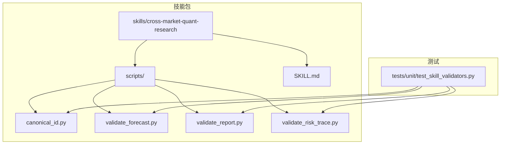
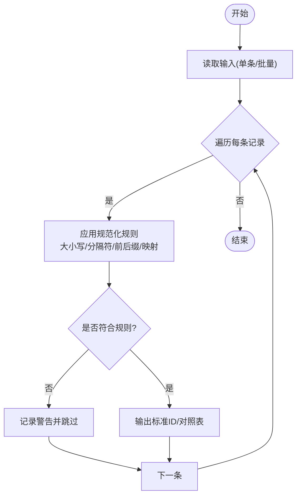
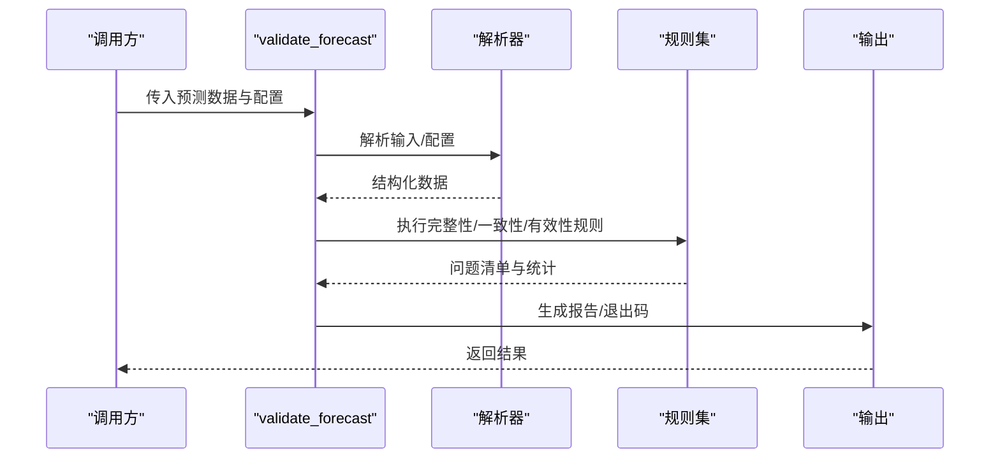
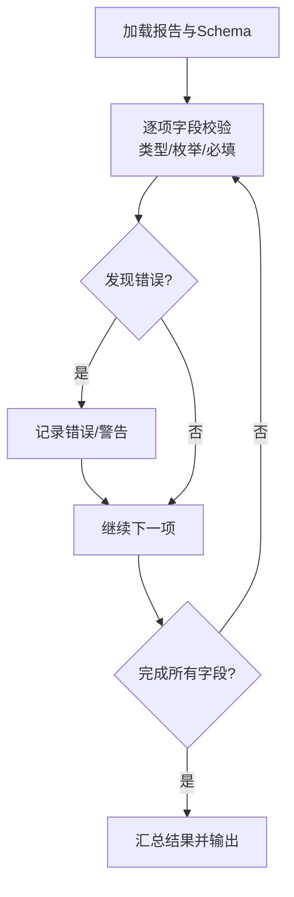
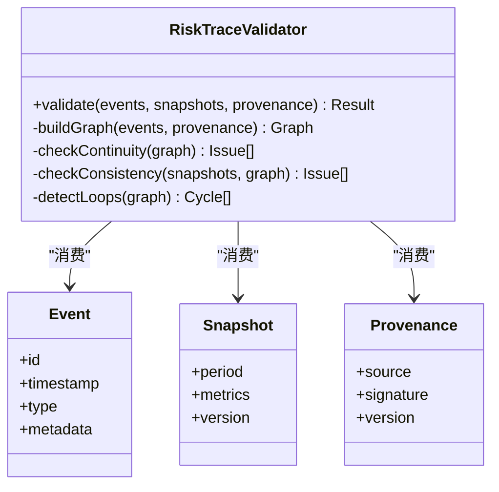
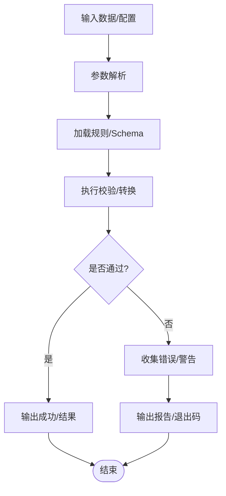
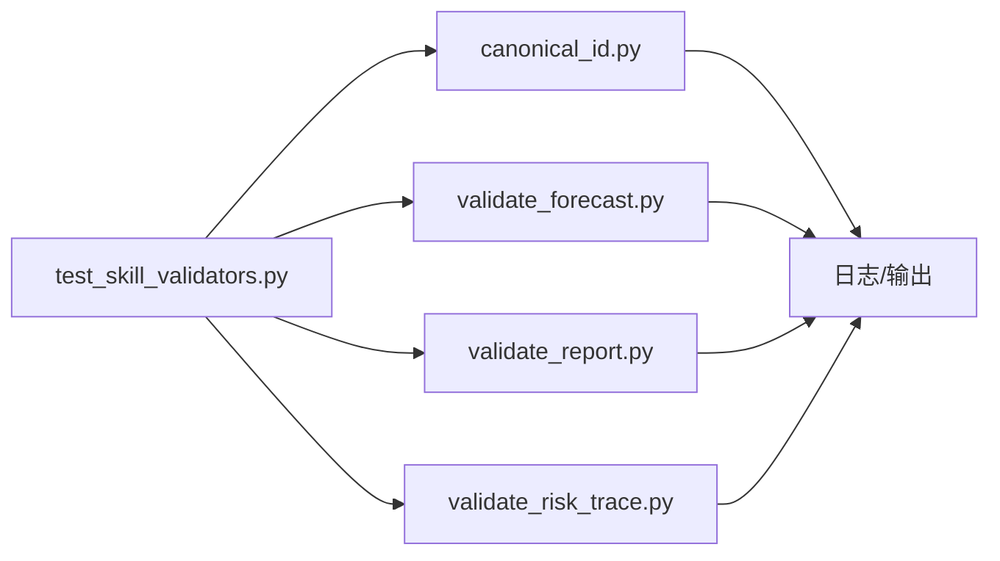

# 验证脚本机制

<cite>
**本文引用的文件**   
- [canonical_id.py](file://skills/cross-market-quant-research/scripts/canonical_id.py)
- [validate_forecast.py](file://skills/cross-market-quant-research/scripts/validate_forecast.py)
- [validate_report.py](file://skills/cross-market-quant-research/scripts/validate_report.py)
- [validate_risk_trace.py](file://skills/cross-market-quant-research/scripts/validate_risk_trace.py)
- [SKILL.md](file://skills/cross-market-quant-research/SKILL.md)
- [test_skill_validators.py](file://tests/unit/test_skill_validators.py)
</cite>

## 目录
1. [简介](#简介)
2. [项目结构](#项目结构)
3. [核心组件](#核心组件)
4. [架构总览](#架构总览)
5. [详细组件分析](#详细组件分析)
6. [依赖关系分析](#依赖关系分析)
7. [性能考虑](#性能考虑)
8. [故障排查指南](#故障排查指南)
9. [结论](#结论)
10. [附录](#附录)

## 简介
本文件系统化说明“验证脚本机制”，聚焦于 skills/cross-market-quant-research/scripts 目录下的四个核心脚本：
- canonical_id.py：标准化ID生成与校验
- validate_forecast.py：预测结果验证规则
- validate_report.py：报告格式检查机制
- validate_risk_trace.py：风险追踪验证流程

文档将解释各脚本的职责、调用方式、错误处理与日志记录策略，并提供自定义验证脚本的开发指南与集成方法。同时给出实际使用示例与调试技巧，帮助读者快速上手并稳定扩展。

## 项目结构
验证脚本位于技能包下，便于随技能一起分发与复用；单元测试位于 tests/unit 中，用于保障脚本行为正确性。



图表来源
- [canonical_id.py](file://skills/cross-market-quant-research/scripts/canonical_id.py)
- [validate_forecast.py](file://skills/cross-market-quant-research/scripts/validate_forecast.py)
- [validate_report.py](file://skills/cross-market-quant-research/scripts/validate_report.py)
- [validate_risk_trace.py](file://skills/cross-market-quant-research/scripts/validate_risk_trace.py)
- [SKILL.md](file://skills/cross-market-quant-research/SKILL.md)
- [test_skill_validators.py](file://tests/unit/test_skill_validators.py)

章节来源
- [SKILL.md](file://skills/cross-market-quant-research/SKILL.md)
- [test_skill_validators.py](file://tests/unit/test_skill_validators.py)

## 核心组件
本节概述四个脚本的核心职责与交互边界，为后续深入分析提供框架。

- canonical_id.py
  - 目标：统一资产标识的规范化（大小写、分隔符、后缀等），输出可复用的标准ID，供下游模块一致引用。
  - 输入：原始ID或包含原始ID的数据集（如JSONL/CSV）。
  - 输出：标准化后的ID或带校验结果的数据流。
  - 关键特性：幂等、容错（跳过非法项）、可配置规则（如市场前缀、交易所后缀）。

- validate_forecast.py
  - 目标：对预测结果进行一致性、完整性与时序有效性校验。
  - 输入：预测数据（时间戳、标的、预测值、置信区间等）。
  - 输出：通过/失败状态及问题清单（缺失字段、越界、时序乱序等）。
  - 关键特性：阈值与范围校验、跨源一致性检查、空值与异常值处理。

- validate_report.py
  - 目标：确保报告的结构、必填字段、枚举值与版本兼容符合规范。
  - 输入：报告文件或结构化对象。
  - 输出：校验摘要、错误与警告列表。
  - 关键特性：Schema驱动校验、向后兼容提示、严重级别分级。

- validate_risk_trace.py
  - 目标：验证风险追踪链路的完整性与可追溯性（事件顺序、因果关联、指标一致性）。
  - 输入：风险事件序列、聚合指标快照、溯源元数据。
  - 输出：链路完整性结论、断点定位与修复建议。
  - 关键特性：有向图式链路校验、环检测、缺失节点告警。

章节来源
- [canonical_id.py](file://skills/cross-market-quant-research/scripts/canonical_id.py)
- [validate_forecast.py](file://skills/cross-market-quant-research/scripts/validate_forecast.py)
- [validate_report.py](file://skills/cross-market-quant-research/scripts/validate_report.py)
- [validate_risk_trace.py](file://skills/cross-market-quant-research/scripts/validate_risk_trace.py)

## 架构总览
验证脚本采用“独立CLI + 可插拔规则”的轻量架构：每个脚本自包含入口、参数解析、规则执行与结果汇总。测试层通过固定用例驱动端到端验证。

```mermaid
sequenceDiagram
participant U as "用户/CI"
participant CLI as "脚本入口"
participant PAR as "参数解析"
participant RUL as "规则引擎"
participant OUT as "结果输出"
U->>CLI : 运行脚本(传入输入路径/选项)
CLI->>PAR : 解析命令行参数
PAR-->>CLI : 参数对象
CLI->>RUL : 加载并执行规则
RUL-->>CLI : 校验结果(通过/失败+详情)
CLI->>OUT : 写入日志/报告/退出码
OUT-->>U : 返回结果
```

图表来源
- [canonical_id.py](file://skills/cross-market-quant-research/scripts/canonical_id.py)
- [validate_forecast.py](file://skills/cross-market-quant-research/scripts/validate_forecast.py)
- [validate_report.py](file://skills/cross-market-quant-research/scripts/validate_report.py)
- [validate_risk_trace.py](file://skills/cross-market-quant-research/scripts/validate_risk_trace.py)

## 详细组件分析

### canonical_id.py：标准化ID生成逻辑
- 功能要点
  - 规范化策略：大小写归一、分隔符替换、前后缀裁剪、市场/交易所映射。
  - 输入适配：支持单条ID或批量数据集（逐行处理）。
  - 输出模式：仅输出标准ID，或附带转换前后的对照表。
  - 容错策略：遇到非法输入时记录警告并跳过，不中断整体流程。
- 典型调用方式
  - 命令行：指定输入文件/目录、输出路径、是否覆盖、是否输出差异对比。
  - 作为库：导入函数直接对字符串或数据集进行转换。
- 错误处理与日志
  - 常见错误：非法字符、未知市场前缀、重复映射冲突。
  - 日志级别：INFO记录统计，WARNING记录跳过项，ERROR记录致命错误并终止。
- 复杂度与性能
  - 时间复杂度：O(n) 线性扫描，n为输入条目数。
  - 空间复杂度：O(k) 存储映射表与中间结果，k为唯一ID数量。
- 优化建议
  - 预编译正则表达式、缓存映射表、并行分块读取大文件。



图表来源
- [canonical_id.py](file://skills/cross-market-quant-research/scripts/canonical_id.py)

章节来源
- [canonical_id.py](file://skills/cross-market-quant-research/scripts/canonical_id.py)

### validate_forecast.py：预测结果验证规则
- 功能要点
  - 完整性：必填字段存在且非空（时间戳、标的、预测值等）。
  - 一致性：同一标的在同一时间点的预测值唯一；多源预测需满足一致性阈值。
  - 有效性：数值范围、置信区间上下界合理、时序单调性（如适用）。
  - 兼容性：版本号与字段演进兼容检查。
- 典型调用方式
  - 命令行：指定预测数据路径、校验规则配置文件、输出报告路径、严格模式开关。
  - 作为库：调用校验函数返回布尔结果与问题清单。
- 错误处理与日志
  - 分类：缺失字段、越界、重复键、时序异常、不一致。
  - 日志：按严重级别输出，支持汇总统计（通过率、失败分布）。
- 复杂度与性能
  - 时间复杂度：O(n log n) 排序/去重，n为预测记录数。
  - 空间复杂度：O(m) 索引结构，m为唯一标的×时间点组合数。
- 优化建议
  - 增量校验、分区计算、提前短路失败分支。



图表来源
- [validate_forecast.py](file://skills/cross-market-quant-research/scripts/validate_forecast.py)

章节来源
- [validate_forecast.py](file://skills/cross-market-quant-research/scripts/validate_forecast.py)

### validate_report.py：报告格式检查机制
- 功能要点
  - Schema校验：基于模板/Schema定义检查字段类型、枚举值、必填项。
  - 版本兼容：新旧字段共存时的兼容性与弃用提示。
  - 结构化输出：错误与警告分离，严重级别分级，便于自动化处理。
- 典型调用方式
  - 命令行：指定报告文件、Schema路径、严格模式、是否允许警告通过。
  - 作为库：传入报告对象与Schema，返回校验结果。
- 错误处理与日志
  - 错误分类：结构错误、类型错误、约束违反、版本不兼容。
  - 日志：结构化日志便于聚合分析，支持导出为JSON/文本。
- 复杂度与性能
  - 时间复杂度：O(s) 与Schema规模相关，通常为常数级开销。
  - 空间复杂度：O(1) 额外内存，主要消耗在输入缓冲。
- 优化建议
  - 懒加载Schema、按需校验、缓存解析结果。



图表来源
- [validate_report.py](file://skills/cross-market-quant-research/scripts/validate_report.py)

章节来源
- [validate_report.py](file://skills/cross-market-quant-research/scripts/validate_report.py)

### validate_risk_trace.py：风险追踪验证流程
- 功能要点
  - 链路完整性：事件序列连续、因果关联完整、无断链。
  - 一致性：聚合指标与明细事件一致，时间窗口对齐。
  - 可追溯性：每个事件具备溯源元数据（来源、版本、签名等）。
- 典型调用方式
  - 命令行：指定事件文件、聚合快照、溯源元数据、输出路径、严格模式。
  - 作为库：传入数据结构，返回链路健康度与问题定位。
- 错误处理与日志
  - 错误分类：缺失事件、环状依赖、指标不一致、元数据缺失。
  - 日志：提供断点位置与修复建议，便于快速定位。
- 复杂度与性能
  - 时间复杂度：O(e + r) 事件数e与关系边r的线性扫描。
  - 空间复杂度：O(r) 存储关系图与索引。
- 优化建议
  - 增量构建图、延迟加载边、并行校验子图。



图表来源
- [validate_risk_trace.py](file://skills/cross-market-quant-research/scripts/validate_risk_trace.py)

章节来源
- [validate_risk_trace.py](file://skills/cross-market-quant-research/scripts/validate_risk_trace.py)

### 概念总览
以下流程图展示通用验证脚本的生命周期，适用于上述四类脚本的统一理解。



[此图为概念流程，无需图表来源]

## 依赖关系分析
- 内部依赖
  - 脚本之间保持低耦合，各自负责单一职责；共享能力可通过公共工具模块（若存在）引入。
  - 测试用例集中覆盖各脚本的关键路径，保证回归稳定性。
- 外部依赖
  - 标准库：argparse、json、csv、logging、pathlib等。
  - 可选第三方：pandas/pyarrow（大数据量场景）、pydantic（Schema校验）、networkx（图分析）。
- 潜在循环依赖
  - 当前设计避免相互import，降低循环风险。



图表来源
- [canonical_id.py](file://skills/cross-market-quant-research/scripts/canonical_id.py)
- [validate_forecast.py](file://skills/cross-market-quant-research/scripts/validate_forecast.py)
- [validate_report.py](file://skills/cross-market-quant-research/scripts/validate_report.py)
- [validate_risk_trace.py](file://skills/cross-market-quant-research/scripts/validate_risk_trace.py)
- [test_skill_validators.py](file://tests/unit/test_skill_validators.py)

章节来源
- [test_skill_validators.py](file://tests/unit/test_skill_validators.py)

## 性能考虑
- 批处理与流式处理：对大文件优先采用流式读取与分块处理，减少峰值内存占用。
- 规则短路：一旦检测到致命错误，尽早中止并返回，避免无谓计算。
- 索引与缓存：对高频查询建立索引（如标的×时间），缓存映射表与解析结果。
- 并行化：CPU密集型规则可并行执行，I/O密集型注意并发度与磁盘吞吐平衡。
- 资源监控：结合日志与指标输出，观察耗时分布与瓶颈点。

[本节为通用指导，无需章节来源]

## 故障排查指南
- 常见问题
  - 参数错误：路径不存在、文件格式不支持、缺少必需字段。
  - 规则冲突：映射规则覆盖导致歧义、阈值设置过严。
  - 数据异常：缺失值、越界值、时序乱序、重复键。
- 定位步骤
  - 查看日志：关注ERROR/WARNING级别信息与堆栈。
  - 缩小范围：使用最小复现数据集与宽松模式逐步收紧。
  - 启用调试：开启详细日志与中间结果输出，定位断点。
- 恢复建议
  - 修正输入数据或调整规则阈值。
  - 更新Schema/模板以兼容新字段。
  - 增加容错与重试逻辑，提升鲁棒性。

章节来源
- [test_skill_validators.py](file://tests/unit/test_skill_validators.py)

## 结论
本机制以“独立脚本 + 规则驱动”的方式实现高内聚、低耦合的验证能力。通过统一的错误处理与日志体系，配合完善的单元测试，能够稳定支撑跨市场量化研究中的ID标准化、预测校验、报告检查与风险追踪等关键环节。建议在持续迭代中完善规则配置化与可视化报告，进一步提升可维护性与可观测性。

[本节为总结，无需章节来源]

## 附录

### 自定义验证脚本开发指南
- 设计原则
  - 单一职责：一个脚本专注一类验证任务。
  - 可配置：通过命令行参数或配置文件控制行为。
  - 可测试：提供清晰的输入输出契约，便于编写用例。
- 开发步骤
  - 新建脚本文件至 scripts 目录。
  - 实现参数解析、规则执行、结果输出与错误处理。
  - 编写对应单元测试，覆盖正常与异常路径。
  - 在 SKILL.md 中补充使用说明与示例。
- 集成方法
  - 在CI流水线中新增脚本执行步骤。
  - 与其他脚本组合成工作流（如先标准化ID，再执行预测与报告校验）。
  - 输出结构化日志与报告，便于聚合与分析。

章节来源
- [SKILL.md](file://skills/cross-market-quant-research/SKILL.md)

### 实际使用示例与调试技巧
- 示例
  - 标准化ID：指定输入文件与输出路径，开启差异对比模式。
  - 预测校验：传入预测数据与规则配置，选择严格模式并输出报告。
  - 报告检查：指定报告与Schema路径，允许警告通过以便灰度发布。
  - 风险追踪：提供事件、快照与溯源元数据，输出链路健康度。
- 调试技巧
  - 使用最小数据集复现问题。
  - 逐步放宽规则，定位最严格的失败点。
  - 打开详细日志，捕获中间状态与堆栈信息。
  - 借助测试用例驱动回归验证。

章节来源
- [test_skill_validators.py](file://tests/unit/test_skill_validators.py)