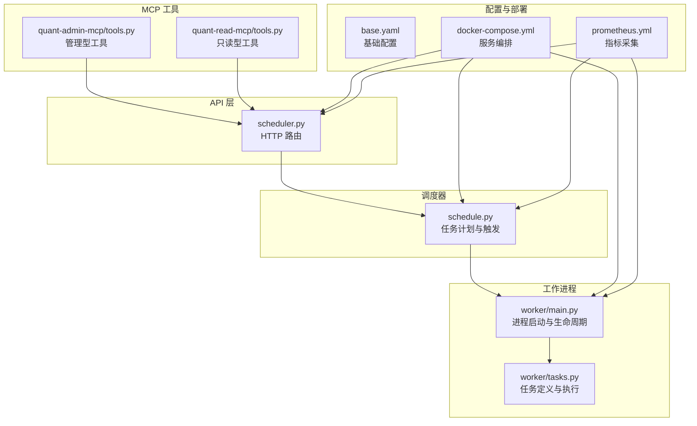
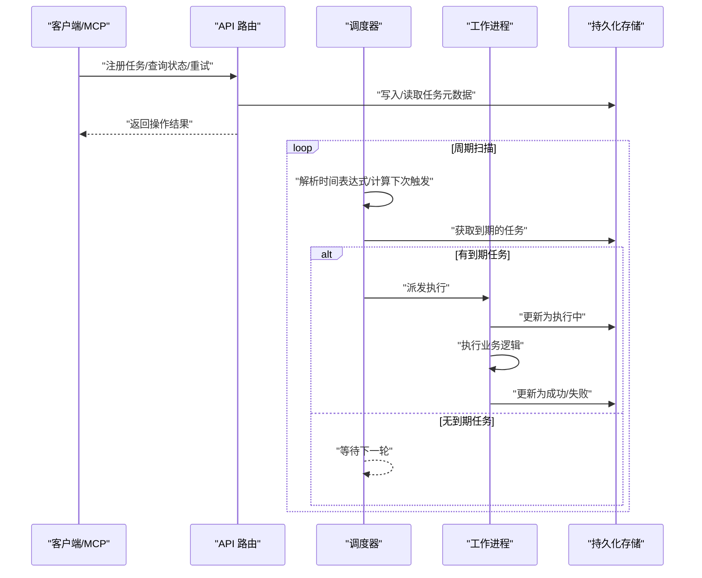
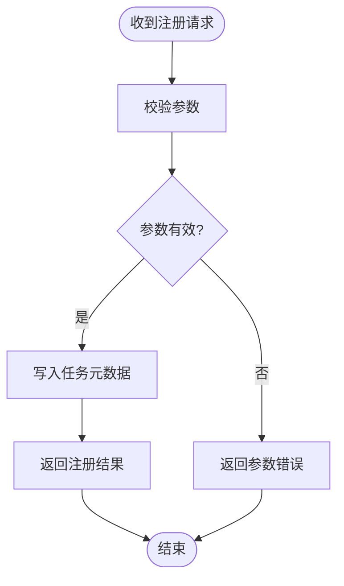
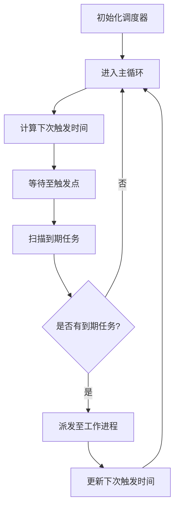
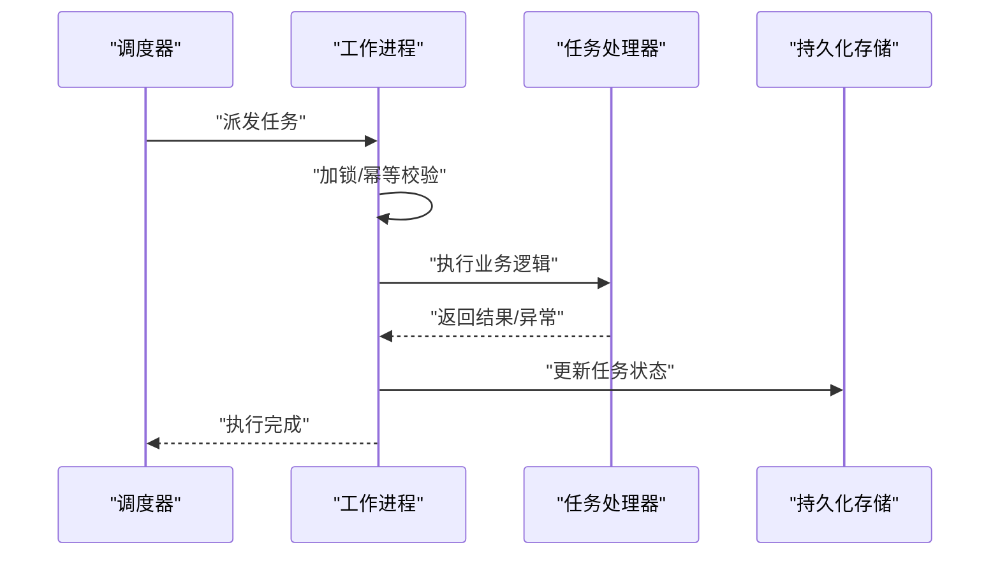
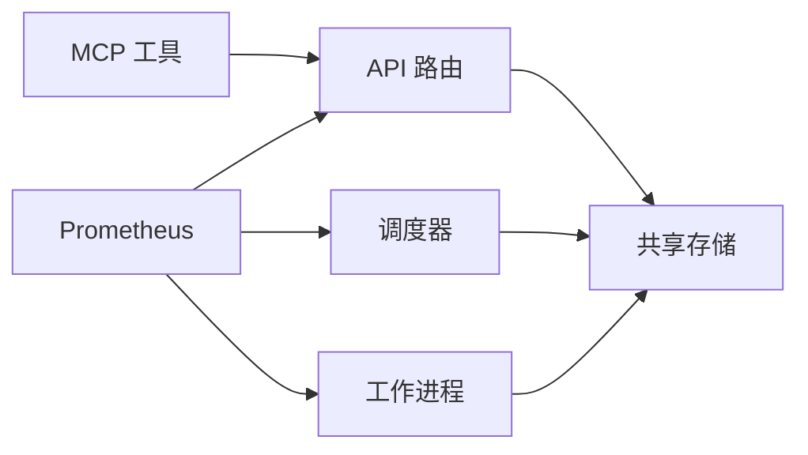

# 任务调度工具

<cite>
**本文引用的文件**   
- [apps/api/routers/scheduler.py](file://apps/api/routers/scheduler.py)
- [apps/scheduler/schedule.py](file://apps/scheduler/schedule.py)
- [apps/worker/main.py](file://apps/worker/main.py)
- [apps/worker/tasks.py](file://apps/worker/tasks.py)
- [apps/quant-admin-mcp/tools.py](file://apps/quant-admin-mcp/tools.py)
- [apps/quant-read-mcp/tools.py](file://apps/quant-read-mcp/tools.py)
- [deploy/docker-compose.yml](file://deploy/docker-compose.yml)
- [deploy/prometheus.yml](file://deploy/prometheus.yml)
- [configs/base.yaml](file://configs/base.yaml)
- [tests/unit/test_scheduler.py](file://tests/unit/test_scheduler.py)
- [tests/unit/test_worker_tasks.py](file://tests/unit/test_worker_tasks.py)
</cite>

## 目录
1. [简介](#简介)
2. [项目结构](#项目结构)
3. [核心组件](#核心组件)
4. [架构总览](#架构总览)
5. [详细组件分析](#详细组件分析)
6. [依赖关系分析](#依赖关系分析)
7. [性能与可观测性](#性能与可观测性)
8. [故障排查指南](#故障排查指南)
9. [结论](#结论)
10. [附录](#附录)

## 简介
本仓库包含一个面向量化研究场景的任务调度子系统，提供定时任务的创建、管理与监控能力。系统通过 API 路由暴露任务注册与状态查询接口，由独立调度器负责时间表达式解析与触发，工作进程执行具体任务并上报状态。同时提供 MCP（Model Context Protocol）工具集，便于外部智能体或管理面板以统一方式调用调度能力。

## 项目结构
与任务调度相关的核心代码分布在以下模块：
- API 层：提供任务注册、状态查询等 HTTP 接口
- 调度器：解析时间表达式、维护任务计划、触发执行
- 工作进程：消费任务、执行业务逻辑、更新状态
- MCP 工具：对外暴露统一的工具调用入口
- 配置与部署：容器编排与指标采集配置
- 测试：覆盖调度与工作任务的单元测试

图表来源
- [apps/api/routers/scheduler.py](file://apps/api/routers/scheduler.py)
- [apps/scheduler/schedule.py](file://apps/scheduler/schedule.py)
- [apps/worker/main.py](file://apps/worker/main.py)
- [apps/worker/tasks.py](file://apps/worker/tasks.py)
- [apps/quant-admin-mcp/tools.py](file://apps/quant-admin-mcp/tools.py)
- [apps/quant-read-mcp/tools.py](file://apps/quant-read-mcp/tools.py)
- [deploy/docker-compose.yml](file://deploy/docker-compose.yml)
- [deploy/prometheus.yml](file://deploy/prometheus.yml)
- [configs/base.yaml](file://configs/base.yaml)

章节来源
- [apps/api/routers/scheduler.py](file://apps/api/routers/scheduler.py)
- [apps/scheduler/schedule.py](file://apps/scheduler/schedule.py)
- [apps/worker/main.py](file://apps/worker/main.py)
- [apps/worker/tasks.py](file://apps/worker/tasks.py)
- [apps/quant-admin-mcp/tools.py](file://apps/quant-admin-mcp/tools.py)
- [apps/quant-read-mcp/tools.py](file://apps/quant-read-mcp/tools.py)
- [deploy/docker-compose.yml](file://deploy/docker-compose.yml)
- [deploy/prometheus.yml](file://deploy/prometheus.yml)
- [configs/base.yaml](file://configs/base.yaml)

## 核心组件
- 任务注册与查询（API 路由）
  - 提供任务注册、列表、状态查询、重试等 HTTP 端点
  - 输入校验、参数绑定、响应封装
- 调度器（计划与触发）
  - 解析时间表达式（如 Cron 风格）
  - 维护任务计划表，周期性检查并触发待执行任务
  - 支持并发度、去重、失败重试策略
- 工作进程（执行与上报）
  - 拉取待执行任务，分配至本地队列
  - 执行任务回调，记录日志与指标
  - 更新任务状态（成功/失败/重试中）
- MCP 工具（统一调用面）
  - 管理型工具：注册、暂停、恢复、删除、重试
  - 只读型工具：查询任务列表、详情、最近执行历史
- 配置与部署
  - 基础配置项：数据库连接、Redis、调度间隔、并发度等
  - Docker Compose 编排 API、调度器、工作进程
  - Prometheus 抓取 API/调度器/工作进程的指标端点

章节来源
- [apps/api/routers/scheduler.py](file://apps/api/routers/scheduler.py)
- [apps/scheduler/schedule.py](file://apps/scheduler/schedule.py)
- [apps/worker/main.py](file://apps/worker/main.py)
- [apps/worker/tasks.py](file://apps/worker/tasks.py)
- [apps/quant-admin-mcp/tools.py](file://apps/quant-admin-mcp/tools.py)
- [apps/quant-read-mcp/tools.py](file://apps/quant-read-mcp/tools.py)
- [configs/base.yaml](file://configs/base.yaml)
- [deploy/docker-compose.yml](file://deploy/docker-compose.yml)
- [deploy/prometheus.yml](file://deploy/prometheus.yml)

## 架构总览
整体采用“API + 调度器 + 工作进程”的解耦架构。API 仅负责请求接入与状态读写；调度器专注时间驱动与任务分发；工作进程专注业务执行与结果回写。MCP 工具作为上层调用面，统一封装对 API 的访问。

图表来源
- [apps/api/routers/scheduler.py](file://apps/api/routers/scheduler.py)
- [apps/scheduler/schedule.py](file://apps/scheduler/schedule.py)
- [apps/worker/main.py](file://apps/worker/main.py)
- [apps/worker/tasks.py](file://apps/worker/tasks.py)

## 详细组件分析

### API 路由（任务注册与状态查询）
- 职责
  - 接收任务注册请求，校验参数并落库
  - 提供任务列表、详情、状态查询
  - 提供手动重试、暂停/恢复等控制接口
- 关键流程
  - 注册：参数校验 -> 生成唯一 ID -> 写入任务元数据 -> 返回注册结果
  - 查询：按条件过滤 -> 组装分页/排序 -> 返回结果
  - 重试：校验任务存在且处于可重试状态 -> 更新状态 -> 通知调度器重新入队
- 错误处理
  - 参数缺失/非法：返回明确错误码与提示
  - 任务不存在/状态不合法：返回相应错误
  - 内部异常：记录堆栈并返回通用错误

图表来源
- [apps/api/routers/scheduler.py](file://apps/api/routers/scheduler.py)

章节来源
- [apps/api/routers/scheduler.py](file://apps/api/routers/scheduler.py)

### 调度器（时间表达式与触发）
- 职责
  - 解析时间表达式（支持 Cron 风格），计算下一次触发时间
  - 周期性扫描到期任务，将任务派发至工作进程
  - 维护任务执行窗口、并发度、去重与幂等键
- 关键流程
  - 初始化：加载配置、建立连接、预热任务计划
  - 循环：休眠至下一个触发点 -> 扫描到期任务 -> 派发执行 -> 更新计划
  - 失败重试：根据策略进行退避重试，记录失败原因
- 分布式特性
  - 基于共享存储的锁/标记实现跨实例互斥
  - 支持多实例并行扫描，避免重复派发

图表来源
- [apps/scheduler/schedule.py](file://apps/scheduler/schedule.py)

章节来源
- [apps/scheduler/schedule.py](file://apps/scheduler/schedule.py)

### 工作进程（任务执行与状态上报）
- 职责
  - 从调度器或消息通道获取任务
  - 执行任务回调，记录执行日志与指标
  - 更新任务最终状态（成功/失败/重试中）
- 关键流程
  - 启动：加载配置、初始化资源、注册任务处理器
  - 执行：拉取任务 -> 加锁 -> 执行 -> 上报结果 -> 解锁
  - 失败处理：捕获异常、记录堆栈、按策略重试或标记失败
- 可观测性
  - 输出结构化日志（任务 ID、耗时、错误信息）
  - 暴露指标（执行次数、成功率、延迟分位）

图表来源
- [apps/worker/main.py](file://apps/worker/main.py)
- [apps/worker/tasks.py](file://apps/worker/tasks.py)

章节来源
- [apps/worker/main.py](file://apps/worker/main.py)
- [apps/worker/tasks.py](file://apps/worker/tasks.py)

### MCP 工具（统一调用面）
- 管理型工具（admin）
  - 注册任务、暂停/恢复、删除、重试
  - 适合自动化运维与智能体编排
- 只读型工具（read）
  - 查询任务列表、详情、最近执行历史
  - 适合监控面板与审计
- 调用约定
  - 统一输入输出格式，便于外部系统集成
  - 错误码与提示信息标准化

章节来源
- [apps/quant-admin-mcp/tools.py](file://apps/quant-admin-mcp/tools.py)
- [apps/quant-read-mcp/tools.py](file://apps/quant-read-mcp/tools.py)

### 配置与部署
- 基础配置（base.yaml）
  - 调度相关：扫描间隔、最大并发、重试策略、超时
  - 存储相关：数据库、缓存连接串
  - 可观测性：日志级别、指标开关
- 容器编排（docker-compose.yml）
  - 服务：API、调度器、工作进程、数据库、缓存、Prometheus
  - 健康检查与重启策略
- 指标采集（prometheus.yml）
  - 抓取各服务的 /metrics 端点
  - 自定义指标维度（任务类型、状态、节点）

章节来源
- [configs/base.yaml](file://configs/base.yaml)
- [deploy/docker-compose.yml](file://deploy/docker-compose.yml)
- [deploy/prometheus.yml](file://deploy/prometheus.yml)

## 依赖关系分析
- 组件耦合
  - API 与调度器：通过共享存储交互，低耦合
  - 调度器与工作进程：通过消息通道或共享队列通信
  - 工作进程与存储：强依赖，需保证事务性与幂等
- 外部依赖
  - 数据库：任务元数据与执行历史
  - 缓存/消息中间件：任务派发与锁机制
  - 监控系统：指标与日志聚合

图表来源
- [apps/api/routers/scheduler.py](file://apps/api/routers/scheduler.py)
- [apps/scheduler/schedule.py](file://apps/scheduler/schedule.py)
- [apps/worker/main.py](file://apps/worker/main.py)
- [deploy/prometheus.yml](file://deploy/prometheus.yml)

章节来源
- [apps/api/routers/scheduler.py](file://apps/api/routers/scheduler.py)
- [apps/scheduler/schedule.py](file://apps/scheduler/schedule.py)
- [apps/worker/main.py](file://apps/worker/main.py)
- [deploy/prometheus.yml](file://deploy/prometheus.yml)

## 性能与可观测性
- 时间表达式语法
  - 支持 Cron 风格表达式，字段包括分钟、小时、日、月、周几
  - 建议避免过于密集的触发频率，合理设置扫描间隔
- 执行策略配置
  - 并发度：限制单实例并发执行数，防止过载
  - 重试策略：固定间隔/指数退避，最大重试次数
  - 超时控制：任务执行超时自动中断并标记失败
- 日志与指标
  - 结构化日志：包含任务 ID、开始/结束时间、错误堆栈摘要
  - 指标：执行次数、成功率、P95/P99 延迟、重试次数
  - 追踪：跨组件链路 ID，便于定位问题
- 分布式与负载均衡
  - 多实例调度：基于共享存储的互斥锁，避免重复派发
  - 任务分区：按任务 ID 哈希分配到不同实例，提升吞吐
  - 弹性扩缩容：动态调整实例数量，结合指标告警

章节来源
- [apps/scheduler/schedule.py](file://apps/scheduler/schedule.py)
- [apps/worker/main.py](file://apps/worker/main.py)
- [deploy/prometheus.yml](file://deploy/prometheus.yml)

## 故障排查指南
- 常见问题
  - 任务未触发：检查时间表达式是否正确、调度器是否运行、存储连接是否正常
  - 任务执行失败：查看工作进程日志与错误堆栈，确认依赖服务可用性
  - 重复执行：检查分布式锁是否生效、是否存在网络抖动导致锁失效
  - 性能瓶颈：观察指标中的延迟分位与重试次数，调整并发度与超时
- 诊断步骤
  - 使用只读 MCP 工具查询任务详情与最近执行历史
  - 在 API 层开启调试日志，核对请求参数与响应
  - 在调度器与工作进程中增加更细粒度的日志
  - 使用 Prometheus 面板观察趋势与异常峰值
- 恢复策略
  - 手动重试：通过管理 MCP 工具或 API 触发重试
  - 暂停/恢复：临时停止任务，修复后恢复执行
  - 扩容：增加工作进程实例，提升处理能力

章节来源
- [apps/quant-read-mcp/tools.py](file://apps/quant-read-mcp/tools.py)
- [apps/quant-admin-mcp/tools.py](file://apps/quant-admin-mcp/tools.py)
- [apps/api/routers/scheduler.py](file://apps/api/routers/scheduler.py)
- [apps/scheduler/schedule.py](file://apps/scheduler/schedule.py)
- [apps/worker/main.py](file://apps/worker/main.py)

## 结论
该任务调度工具以清晰的层次划分与低耦合设计，提供了完整的定时任务生命周期管理能力。通过 MCP 工具的统一调用面，开发者可以便捷地集成到自动化流程与智能体系统中。配合完善的日志与指标体系，可实现高可靠、可观测、可扩展的任务调度解决方案。

## 附录
- 单元测试参考
  - 调度器行为验证：时间表达式解析、触发时机、重试策略
  - 工作进程行为验证：任务执行、状态更新、异常处理

章节来源
- [tests/unit/test_scheduler.py](file://tests/unit/test_scheduler.py)
- [tests/unit/test_worker_tasks.py](file://tests/unit/test_worker_tasks.py)