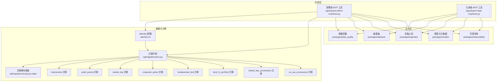
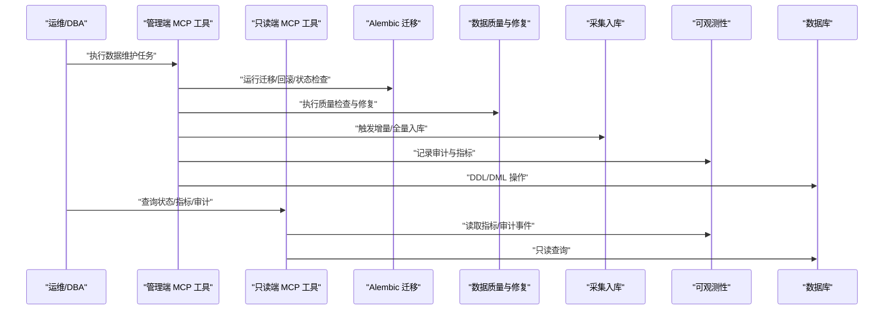
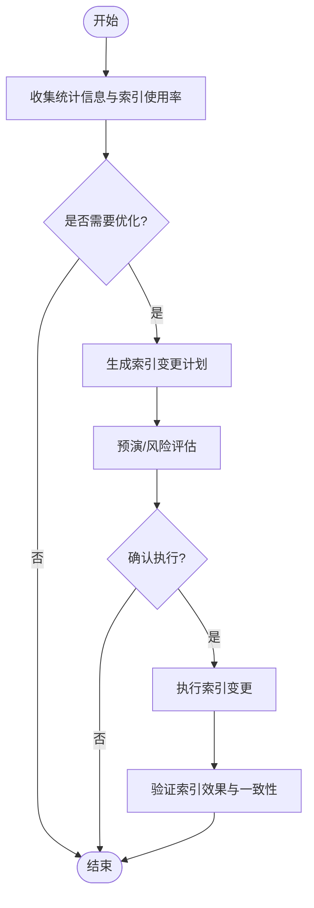
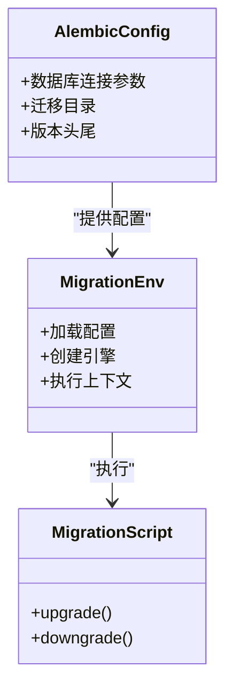
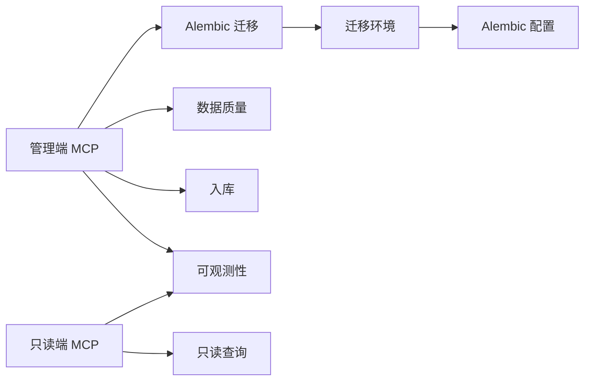

# 数据维护工具

<cite>
**本文引用的文件**   
- [apps/quant-admin-mcp/tools.py](file://apps/quant-admin-mcp/tools.py)
- [apps/quant-read-mcp/tools.py](file://apps/quant-read-mcp/tools.py)
- [alembic.ini](file://alembic.ini)
- [sql/migrations/env.py](file://sql/migrations/env.py)
- [sql/migrations/script.py.mako](file://sql/migrations/script.py.mako)
- [sql/migrations/versions/20260715_0001_instruments.py](file://sql/migrations/versions/20260715_0001_instruments.py)
- [sql/migrations/versions/20260715_0002_audit_events.py](file://sql/migrations/versions/20260715_0002_audit_events.py)
- [sql/migrations/versions/20260715_0003_market_bar.py](file://sql/migrations/versions/20260715_0003_market_bar.py)
- [sql/migrations/versions/20260715_0004_corporate_action.py](file://sql/migrations/versions/20260715_0004_corporate_action.py)
- [sql/migrations/versions/20260715_0005_fundamental_fact.py](file://sql/migrations/versions/20260715_0005_fundamental_fact.py)
- [sql/migrations/versions/20260715_0006_fund_fx_portfolio.py](file://sql/migrations/versions/20260715_0006_fund_fx_portfolio.py)
- [sql/migrations/versions/20260715_0007_market_bar_provenance.py](file://sql/migrations/versions/20260715_0007_market_bar_provenance.py)
- [sql/migrations/versions/20260715_0008_ca_nav_provenance.py](file://sql/migrations/versions/20260715_0008_ca_nav_provenance.py)
- [packages/data_quality/README.md](file://packages/data_quality/README.md)
- [packages/datasets/README.md](file://packages/datasets/README.md)
- [packages/ingestion/README.md](file://packages/ingestion/README.md)
- [packages/models/README.md](file://packages/models/README.md)
- [packages/observability/README.md](file://packages/observability/README.md)
- [configs/base.yaml](file://configs/base.yaml)
- [deploy/docker-compose.yml](file://deploy/docker-compose.yml)
</cite>

## 目录
1. [简介](#简介)
2. [项目结构](#项目结构)
3. [核心组件](#核心组件)
4. [架构总览](#架构总览)
5. [详细组件分析](#详细组件分析)
6. [依赖关系分析](#依赖关系分析)
7. [性能与批处理](#性能与批处理)
8. [故障排查指南](#故障排查指南)
9. [结论](#结论)
10. [附录](#附录)

## 简介
本文件面向DBA与运维人员，系统化梳理“数据维护工具”的能力边界与实践方法，覆盖数据库维护、数据备份恢复、数据清理、数据质量检查与修复、以及大数据量操作的批量处理机制。文档同时记录所有与数据维护相关的MCP工具接口（管理端与只读端），并给出迁移、索引优化、表结构管理等操作建议与流程说明。

## 项目结构
仓库采用应用分层与包化组织：
- 应用层提供API与MCP工具入口，其中管理端MCP工具用于执行数据维护任务，只读端MCP工具用于查询与诊断。
- 数据层通过Alembic进行版本化迁移，迁移脚本位于sql/migrations下。
- 业务功能按包划分，如data_quality、datasets、ingestion、models、observability等。
- 配置与部署分别位于configs与deploy目录。

图表来源
- [apps/quant-admin-mcp/tools.py](file://apps/quant-admin-mcp/tools.py)
- [apps/quant-read-mcp/tools.py](file://apps/quant-read-mcp/tools.py)
- [alembic.ini](file://alembic.ini)
- [sql/migrations/env.py](file://sql/migrations/env.py)
- [sql/migrations/script.py.mako](file://sql/migrations/script.py.mako)
- [sql/migrations/versions/20260715_0001_instruments.py](file://sql/migrations/versions/20260715_0001_instruments.py)
- [sql/migrations/versions/20260715_0002_audit_events.py](file://sql/migrations/versions/20260715_0002_audit_events.py)
- [sql/migrations/versions/20260715_0003_market_bar.py](file://sql/migrations/versions/20260715_0003_market_bar.py)
- [sql/migrations/versions/20260715_0004_corporate_action.py](file://sql/migrations/versions/20260715_0004_corporate_action.py)
- [sql/migrations/versions/20260715_0005_fundamental_fact.py](file://sql/migrations/versions/20260715_0005_fundamental_fact.py)
- [sql/migrations/versions/20260715_0006_fund_fx_portfolio.py](file://sql/migrations/versions/20260715_0006_fund_fx_portfolio.py)
- [sql/migrations/versions/20260715_0007_market_bar_provenance.py](file://sql/migrations/versions/20260715_0007_market_bar_provenance.py)
- [sql/migrations/versions/20260715_0008_ca_nav_provenance.py](file://sql/migrations/versions/20260715_0008_ca_nav_provenance.py)

章节来源
- [apps/quant-admin-mcp/tools.py](file://apps/quant-admin-mcp/tools.py)
- [apps/quant-read-mcp/tools.py](file://apps/quant-read-mcp/tools.py)
- [alembic.ini](file://alembic.ini)
- [sql/migrations/env.py](file://sql/migrations/env.py)
- [sql/migrations/script.py.mako](file://sql/migrations/script.py.mako)
- [sql/migrations/versions/20260715_0001_instruments.py](file://sql/migrations/versions/20260715_0001_instruments.py)
- [sql/migrations/versions/20260715_0002_audit_events.py](file://sql/migrations/versions/20260715_0002_audit_events.py)
- [sql/migrations/versions/20260715_0003_market_bar.py](file://sql/migrations/versions/20260715_0003_market_bar.py)
- [sql/migrations/versions/20260715_0004_corporate_action.py](file://sql/migrations/versions/20260715_0004_corporate_action.py)
- [sql/migrations/versions/20260715_0005_fundamental_fact.py](file://sql/migrations/versions/20260715_0005_fundamental_fact.py)
- [sql/migrations/versions/20260715_0006_fund_fx_portfolio.py](file://sql/migrations/versions/20260715_0006_fund_fx_portfolio.py)
- [sql/migrations/versions/20260715_0007_market_bar_provenance.py](file://sql/migrations/versions/20260715_0007_market_bar_provenance.py)
- [sql/migrations/versions/20260715_0008_ca_nav_provenance.py](file://sql/migrations/versions/20260715_0008_ca_nav_provenance.py)

## 核心组件
- 管理端MCP工具：提供数据维护能力，包括迁移执行、索引优化、表结构管理、数据清理、质量检查与修复、备份与恢复等。
- 只读端MCP工具：提供数据查询、健康检查、指标与审计事件读取等只读能力，便于验证与维护结果。
- 迁移系统：基于Alembic的版本化管理，集中定义schema变更与数据演进。
- 数据质量与修复：在data_quality包中实现规则校验、异常检测与修复策略。
- 数据集与入库：datasets与ingestion包负责数据生命周期管理与入湖/入库流程。
- 可观测性：observability包提供指标、日志与审计追踪，支撑维护过程的可观测与回溯。

章节来源
- [apps/quant-admin-mcp/tools.py](file://apps/quant-admin-mcp/tools.py)
- [apps/quant-read-mcp/tools.py](file://apps/quant-read-mcp/tools.py)
- [packages/data_quality/README.md](file://packages/data_quality/README.md)
- [packages/datasets/README.md](file://packages/datasets/README.md)
- [packages/ingestion/README.md](file://packages/ingestion/README.md)
- [packages/observability/README.md](file://packages/observability/README.md)

## 架构总览
下图展示数据维护工具的整体交互：管理端MCP作为统一入口，调用迁移、质量、入库、可观测性等子系统；只读端MCP提供查询与诊断能力；Alembic驱动数据库版本控制。

图表来源
- [apps/quant-admin-mcp/tools.py](file://apps/quant-admin-mcp/tools.py)
- [apps/quant-read-mcp/tools.py](file://apps/quant-read-mcp/tools.py)
- [alembic.ini](file://alembic.ini)
- [sql/migrations/env.py](file://sql/migrations/env.py)
- [packages/data_quality/README.md](file://packages/data_quality/README.md)
- [packages/ingestion/README.md](file://packages/ingestion/README.md)
- [packages/observability/README.md](file://packages/observability/README.md)

## 详细组件分析

### 管理端MCP工具（数据维护）
职责与能力
- 数据迁移：执行升级、降级、生成迁移脚本、查看当前版本。
- 索引优化：评估缺失索引、重建或创建索引、统计信息更新。
- 表结构管理：查看表结构、新增/修改字段、约束管理。
- 数据清理：归档历史数据、删除过期分区、清理临时表。
- 数据质量检查与修复：运行规则集、定位异常、自动或半自动修复。
- 备份与恢复：触发备份任务、校验备份完整性、执行恢复演练。
- 批处理与并发：分片/分页处理、事务边界控制、失败重试与幂等。

关键流程（示例：索引优化）

章节来源
- [apps/quant-admin-mcp/tools.py](file://apps/quant-admin-mcp/tools.py)

### 只读端MCP工具（查询与诊断）
职责与能力
- 数据查询：按时间范围、标的、市场维度检索行情、基本面、公司行为等。
- 健康检查：连接可用性、延迟、错误率、队列积压等。
- 指标与审计：读取可观测性指标、审计事件、变更记录。
- 一致性校验：对比源系统与目标库的计数、抽样比对。

章节来源
- [apps/quant-read-mcp/tools.py](file://apps/quant-read-mcp/tools.py)

### 迁移系统（Alembic）
- 配置文件：alembic.ini定义迁移环境、数据库连接、脚本路径等。
- 环境初始化：env.py加载配置、建立引擎、执行上下文。
- 脚本模板：script.py.mako为自动生成迁移脚本的模板。
- 版本脚本：versions下的每个文件对应一次schema或数据变更。

图表来源
- [alembic.ini](file://alembic.ini)
- [sql/migrations/env.py](file://sql/migrations/env.py)
- [sql/migrations/script.py.mako](file://sql/migrations/script.py.mako)
- [sql/migrations/versions/20260715_0001_instruments.py](file://sql/migrations/versions/20260715_0001_instruments.py)
- [sql/migrations/versions/20260715_0002_audit_events.py](file://sql/migrations/versions/20260715_0002_audit_events.py)
- [sql/migrations/versions/20260715_0003_market_bar.py](file://sql/migrations/versions/20260715_0003_market_bar.py)
- [sql/migrations/versions/20260715_0004_corporate_action.py](file://sql/migrations/versions/20260715_0004_corporate_action.py)
- [sql/migrations/versions/20260715_0005_fundamental_fact.py](file://sql/migrations/versions/20260715_0005_fundamental_fact.py)
- [sql/migrations/versions/20260715_0006_fund_fx_portfolio.py](file://sql/migrations/versions/20260715_0006_fund_fx_portfolio.py)
- [sql/migrations/versions/20260715_0007_market_bar_provenance.py](file://sql/migrations/versions/20260715_0007_market_bar_provenance.py)
- [sql/migrations/versions/20260715_0008_ca_nav_provenance.py](file://sql/migrations/versions/20260715_0008_ca_nav_provenance.py)

章节来源
- [alembic.ini](file://alembic.ini)
- [sql/migrations/env.py](file://sql/migrations/env.py)
- [sql/migrations/script.py.mako](file://sql/migrations/script.py.mako)
- [sql/migrations/versions/20260715_0001_instruments.py](file://sql/migrations/versions/20260715_0001_instruments.py)
- [sql/migrations/versions/20260715_0002_audit_events.py](file://sql/migrations/versions/20260715_0002_audit_events.py)
- [sql/migrations/versions/20260715_0003_market_bar.py](file://sql/migrations/versions/20260715_0003_market_bar.py)
- [sql/migrations/versions/20260715_0004_corporate_action.py](file://sql/migrations/versions/20260715_0004_corporate_action.py)
- [sql/migrations/versions/20260715_0005_fundamental_fact.py](file://sql/migrations/versions/20260715_0005_fundamental_fact.py)
- [sql/migrations/versions/20260715_0006_fund_fx_portfolio.py](file://sql/migrations/versions/20260715_0006_fund_fx_portfolio.py)
- [sql/migrations/versions/20260715_0007_market_bar_provenance.py](file://sql/migrations/versions/20260715_0007_market_bar_provenance.py)
- [sql/migrations/versions/20260715_0008_ca_nav_provenance.py](file://sql/migrations/versions/20260715_0008_ca_nav_provenance.py)

### 数据质量检查与修复
- 规则定义：完整性、唯一性、时序一致性、跨表关联一致性等。
- 扫描与采样：支持全量扫描与抽样策略，降低对生产的影响。
- 修复策略：自动修复（幂等）、人工审核、补偿任务。
- 报告与审计：输出质量报告、审计事件与指标。

章节来源
- [packages/data_quality/README.md](file://packages/data_quality/README.md)

### 数据集与入库
- 数据集：标准化数据结构、版本化、血缘追踪。
- 入库：批量写入、去重、幂等、断点续传、失败重试。
- 与质量联动：入库前后质量门禁。

章节来源
- [packages/datasets/README.md](file://packages/datasets/README.md)
- [packages/ingestion/README.md](file://packages/ingestion/README.md)

### 可观测性与审计
- 指标：延迟、吞吐、错误率、资源使用。
- 审计：变更记录、操作者、时间戳、影响范围。
- 告警：阈值与SLO达成情况。

章节来源
- [packages/observability/README.md](file://packages/observability/README.md)

## 依赖关系分析
- 管理端MCP依赖迁移系统、数据质量、入库、可观测性模块。
- 只读端MCP依赖可观测性与只读查询通道。
- 迁移系统依赖Alembic配置与环境初始化。
- 各包之间通过清晰的接口契约协作，避免循环依赖。

图表来源
- [apps/quant-admin-mcp/tools.py](file://apps/quant-admin-mcp/tools.py)
- [apps/quant-read-mcp/tools.py](file://apps/quant-read-mcp/tools.py)
- [alembic.ini](file://alembic.ini)
- [sql/migrations/env.py](file://sql/migrations/env.py)

章节来源
- [apps/quant-admin-mcp/tools.py](file://apps/quant-admin-mcp/tools.py)
- [apps/quant-read-mcp/tools.py](file://apps/quant-read-mcp/tools.py)
- [alembic.ini](file://alembic.ini)
- [sql/migrations/env.py](file://sql/migrations/env.py)

## 性能与批处理
- 分批与分页：将大表操作拆分为小批次，减少锁竞争与内存占用。
- 事务边界：合理划分事务大小，避免长事务导致锁等待。
- 并发控制：限制并发度，结合队列与背压机制。
- 幂等设计：确保重复执行不会产生副作用。
- 监控与回滚：每批完成后记录指标，失败时快速回滚并告警。

[本节为通用指导，不直接分析具体文件]

## 故障排查指南
- 迁移失败：检查alembic版本、依赖顺序、外键约束与索引冲突；必要时回滚到上一版本。
- 质量异常：核对规则阈值、数据源差异、时间窗口对齐；优先定位受影响标的与时间范围。
- 入库阻塞：观察锁等待、慢查询、磁盘IO；调整批大小与并发度。
- 备份恢复：验证备份完整性、恢复演练、RPO/RTO达标情况。
- 可观测性：利用指标与审计事件定位根因，结合只读端查询验证。

章节来源
- [alembic.ini](file://alembic.ini)
- [packages/observability/README.md](file://packages/observability/README.md)
- [apps/quant-read-mcp/tools.py](file://apps/quant-read-mcp/tools.py)

## 结论
本数据维护工具集以管理端MCP为核心，整合迁移、质量、入库与可观测性能力，形成从变更到验证的闭环。配合Alembic版本化与批处理机制，可在保障一致性的前提下高效完成大规模数据维护任务。建议在生产环境严格遵循变更评审、灰度发布与回滚预案，并通过只读端持续验证维护效果。

[本节为总结，不直接分析具体文件]

## 附录

### 数据备份策略与恢复流程
- 备份策略
  - 全量+增量组合：定期全量备份，频繁增量备份，满足RPO要求。
  - 多副本与异地容灾：至少两份副本，一份本地，一份异地。
  - 加密与访问控制：备份文件加密，最小权限访问。
- 恢复流程
  - 选择最近可用全量备份与增量链。
  - 在隔离环境执行恢复演练，验证数据一致性与应用可用性。
  - 切换流量至恢复实例，持续监控与回滚预案准备。
- 工具集成
  - 通过管理端MCP触发备份/恢复任务，记录审计与指标。
  - 使用只读端MCP验证恢复后数据的可读性与一致性。

章节来源
- [apps/quant-admin-mcp/tools.py](file://apps/quant-admin-mcp/tools.py)
- [apps/quant-read-mcp/tools.py](file://apps/quant-read-mcp/tools.py)

### 数据清理与归档
- 清理策略
  - 按时间窗口与热度分层：热数据保留短期，冷数据归档。
  - 分区与索引维护：定期重建索引、更新统计信息。
- 操作流程
  - 预检：评估影响范围与依赖。
  - 执行：分批删除/归档，记录审计。
  - 验证：只读端校验数据可见性与一致性。

章节来源
- [apps/quant-admin-mcp/tools.py](file://apps/quant-admin-mcp/tools.py)
- [apps/quant-read-mcp/tools.py](file://apps/quant-read-mcp/tools.py)

### 配置与部署要点
- 配置项
  - 数据库连接、迁移目录、日志级别、可观测性上报地址等。
- 部署
  - 容器编排与服务发现，确保迁移与任务调度可靠运行。

章节来源
- [configs/base.yaml](file://configs/base.yaml)
- [deploy/docker-compose.yml](file://deploy/docker-compose.yml)