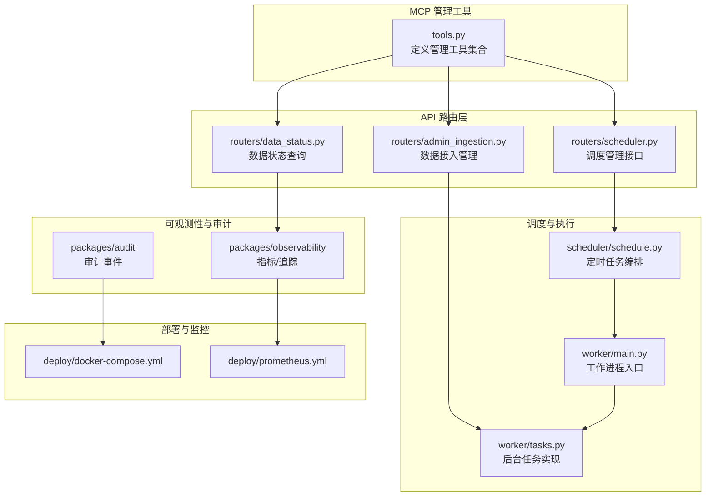
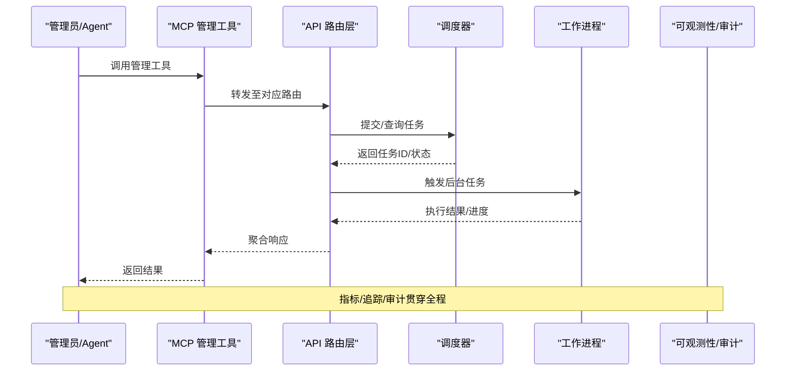
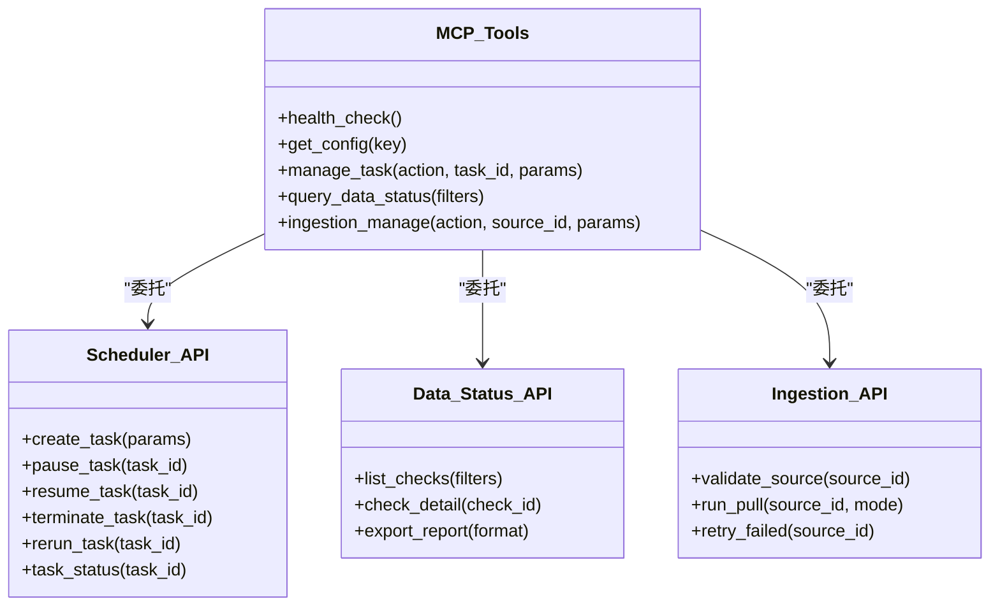
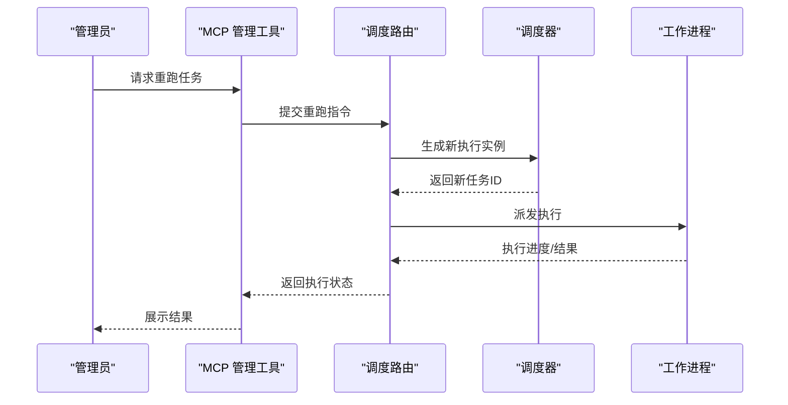
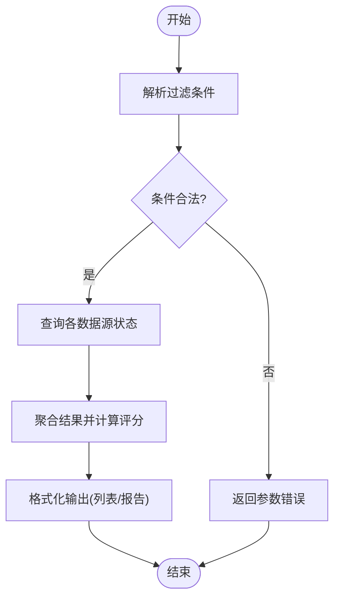
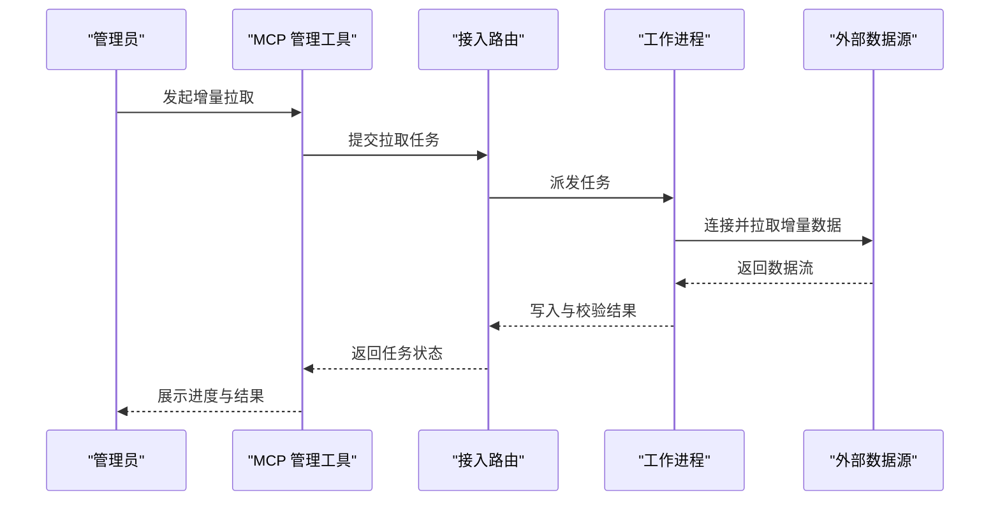
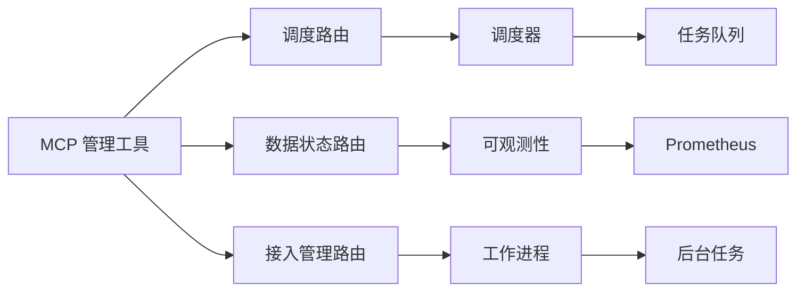

# 管理工具

<cite>
**本文引用的文件**   
- [apps/quant-admin-mcp/tools.py](file://apps/quant-admin-mcp/tools.py)
- [apps/api/routers/scheduler.py](file://apps/api/routers/scheduler.py)
- [apps/api/routers/data_status.py](file://apps/api/routers/data_status.py)
- [apps/api/routers/admin_ingestion.py](file://apps/api/routers/admin_ingestion.py)
- [apps/scheduler/schedule.py](file://apps/scheduler/schedule.py)
- [apps/worker/main.py](file://apps/worker/main.py)
- [apps/worker/tasks.py](file://apps/worker/tasks.py)
- [packages/observability](file://packages/observability)
- [packages/audit](file://packages/audit)
- [deploy/docker-compose.yml](file://deploy/docker-compose.yml)
- [deploy/prometheus.yml](file://deploy/prometheus.yml)
</cite>

## 目录
1. [简介](#简介)
2. [项目结构](#项目结构)
3. [核心组件](#核心组件)
4. [架构总览](#架构总览)
5. [详细组件分析](#详细组件分析)
6. [依赖关系分析](#依赖关系分析)
7. [性能与扩展性](#性能与扩展性)
8. [故障排查指南](#故障排查指南)
9. [结论](#结论)
10. [附录](#附录)

## 简介
本文件面向系统管理员，提供量化管理系统中“管理相关 MCP 工具”的完整使用文档。内容覆盖：
- 系统监控、配置管理、任务调度、数据维护等管理能力
- 每个工具的输入输出格式、错误处理与权限控制
- 调用示例与集成方式（以路径引用代替具体代码）
- 安全机制与审计日志记录
- 批量操作与异步处理的实现方式

## 项目结构
管理功能主要分布在以下模块：
- MCP 管理工具接口层：apps/quant-admin-mcp/tools.py
- 管理 API 路由层：apps/api/routers/*（scheduler、data_status、admin_ingestion 等）
- 任务调度与执行：apps/scheduler/schedule.py、apps/worker/main.py、apps/worker/tasks.py
- 可观测性与审计：packages/observability、packages/audit
- 部署与监控：deploy/docker-compose.yml、deploy/prometheus.yml

图表来源
- [apps/quant-admin-mcp/tools.py](file://apps/quant-admin-mcp/tools.py)
- [apps/api/routers/scheduler.py](file://apps/api/routers/scheduler.py)
- [apps/api/routers/data_status.py](file://apps/api/routers/data_status.py)
- [apps/api/routers/admin_ingestion.py](file://apps/api/routers/admin_ingestion.py)
- [apps/scheduler/schedule.py](file://apps/scheduler/schedule.py)
- [apps/worker/main.py](file://apps/worker/main.py)
- [apps/worker/tasks.py](file://apps/worker/tasks.py)
- [packages/observability](file://packages/observability)
- [packages/audit](file://packages/audit)
- [deploy/docker-compose.yml](file://deploy/docker-compose.yml)
- [deploy/prometheus.yml](file://deploy/prometheus.yml)

章节来源
- [apps/quant-admin-mcp/tools.py](file://apps/quant-admin-mcp/tools.py)
- [apps/api/routers/scheduler.py](file://apps/api/routers/scheduler.py)
- [apps/api/routers/data_status.py](file://apps/api/routers/data_status.py)
- [apps/api/routers/admin_ingestion.py](file://apps/api/routers/admin_ingestion.py)
- [apps/scheduler/schedule.py](file://apps/scheduler/schedule.py)
- [apps/worker/main.py](file://apps/worker/main.py)
- [apps/worker/tasks.py](file://apps/worker/tasks.py)
- [packages/observability](file://packages/observability)
- [packages/audit](file://packages/audit)
- [deploy/docker-compose.yml](file://deploy/docker-compose.yml)
- [deploy/prometheus.yml](file://deploy/prometheus.yml)

## 核心组件
- 管理工具集合（MCP）：集中暴露系统管理能力，供上层客户端或 Agent 调用
- 调度管理：提供任务的创建、启停、重跑、查看状态等能力
- 数据状态：提供数据完整性、新鲜度、质量检查结果的查询
- 数据接入管理：提供数据源校验、增量/全量拉取、失败重试等管理操作
- 可观测性与审计：统一采集指标、追踪与审计事件，支撑排障与合规

章节来源
- [apps/quant-admin-mcp/tools.py](file://apps/quant-admin-mcp/tools.py)
- [apps/api/routers/scheduler.py](file://apps/api/routers/scheduler.py)
- [apps/api/routers/data_status.py](file://apps/api/routers/data_status.py)
- [apps/api/routers/admin_ingestion.py](file://apps/api/routers/admin_ingestion.py)

## 架构总览
管理工具通过 MCP 层对外暴露，内部由 API 路由转发到调度器与工作进程；可观测性与审计贯穿请求链路。

图表来源
- [apps/quant-admin-mcp/tools.py](file://apps/quant-admin-mcp/tools.py)
- [apps/api/routers/scheduler.py](file://apps/api/routers/scheduler.py)
- [apps/api/routers/data_status.py](file://apps/api/routers/data_status.py)
- [apps/api/routers/admin_ingestion.py](file://apps/api/routers/admin_ingestion.py)
- [apps/scheduler/schedule.py](file://apps/scheduler/schedule.py)
- [apps/worker/main.py](file://apps/worker/main.py)
- [apps/worker/tasks.py](file://apps/worker/tasks.py)
- [packages/observability](file://packages/observability)
- [packages/audit](file://packages/audit)

## 详细组件分析

### 管理工具集合（MCP）
- 职责：统一封装系统管理能力，提供一致的参数约定、错误码与返回结构
- 典型能力：
  - 系统健康检查与版本信息
  - 配置读取与热更新提示
  - 任务生命周期管理（创建、暂停、恢复、终止、重跑）
  - 数据状态与质量报告
  - 数据接入管理（校验、拉取、重试）
- 输入输出规范：
  - 输入：标准化 JSON 对象，包含操作类型、目标资源标识、可选参数与上下文
  - 输出：统一信封结构，包含状态码、消息、数据体与审计元数据
- 权限控制：
  - 基于角色访问控制（RBAC），仅允许具备管理角色的用户/服务调用
  - 敏感操作需二次确认或审批流
- 错误处理：
  - 明确区分业务错误与系统错误，返回结构化错误码与可定位信息
  - 对超时、限流、并发冲突进行友好提示
- 审计日志：
  - 所有管理操作均记录审计事件，包含操作者、时间、资源、结果与影响范围

章节来源
- [apps/quant-admin-mcp/tools.py](file://apps/quant-admin-mcp/tools.py)
- [packages/audit](file://packages/audit)

#### 类图（概念映射）

图表来源
- [apps/quant-admin-mcp/tools.py](file://apps/quant-admin-mcp/tools.py)
- [apps/api/routers/scheduler.py](file://apps/api/routers/scheduler.py)
- [apps/api/routers/data_status.py](file://apps/api/routers/data_status.py)
- [apps/api/routers/admin_ingestion.py](file://apps/api/routers/admin_ingestion.py)

### 调度管理（Scheduler）
- 能力清单：
  - 任务创建：支持一次性与周期性任务，指定执行策略与重试次数
  - 任务控制：暂停、恢复、终止、重跑
  - 状态查询：获取任务详情、运行历史、最近失败原因
- 输入输出：
  - 输入：任务类型、调度表达式、参数包、优先级、标签
  - 输出：任务ID、计划时间、当前状态、下次执行时间
- 错误处理：
  - 重复创建、非法表达式、资源不足等场景的错误码与修复建议
- 权限控制：
  - 仅管理员可创建/修改任务；普通用户仅可查询
- 审计日志：
  - 记录任务变更、执行结果与异常堆栈摘要

章节来源
- [apps/api/routers/scheduler.py](file://apps/api/routers/scheduler.py)
- [apps/scheduler/schedule.py](file://apps/scheduler/schedule.py)
- [apps/worker/main.py](file://apps/worker/main.py)
- [apps/worker/tasks.py](file://apps/worker/tasks.py)

#### 序列图（任务重跑流程）

图表来源
- [apps/api/routers/scheduler.py](file://apps/api/routers/scheduler.py)
- [apps/scheduler/schedule.py](file://apps/scheduler/schedule.py)
- [apps/worker/main.py](file://apps/worker/main.py)
- [apps/worker/tasks.py](file://apps/worker/tasks.py)

### 数据状态（Data Status）
- 能力清单：
  - 数据完整性检查：按市场/品种/时间窗口统计缺失与异常
  - 数据新鲜度：对比最新可用时间与期望时间
  - 质量报告：导出 CSV/JSON 报告，便于归档与告警
- 输入输出：
  - 输入：过滤条件（市场、品种、日期范围）、报告格式
  - 输出：检查结果列表、明细项、汇总评分与建议
- 错误处理：
  - 数据源不可用、权限不足、查询超时的错误码与降级策略
- 权限控制：
  - 只读权限即可查询；导出报告需具备数据导出权限
- 审计日志：
  - 记录查询条件、导出行为与访问者信息

章节来源
- [apps/api/routers/data_status.py](file://apps/api/routers/data_status.py)
- [packages/observability](file://packages/observability)

#### 流程图（数据状态检查）

图表来源
- [apps/api/routers/data_status.py](file://apps/api/routers/data_status.py)

### 数据接入管理（Ingestion）
- 能力清单：
  - 数据源校验：连通性、凭据有效性、权限检查
  - 拉取任务：支持增量/全量模式，指定时间窗口与过滤规则
  - 失败重试：按批次或单条重试，支持退避策略
- 输入输出：
  - 输入：数据源ID、拉取模式、时间范围、重试策略
  - 输出：任务ID、预计耗时、进度、失败明细
- 错误处理：
  - 网络异常、认证失败、数据格式不兼容的错误码与修复指引
- 权限控制：
  - 仅管理员可发起拉取与重试；只读用户可查看状态
- 审计日志：
  - 记录拉取任务的生命周期与关键事件

章节来源
- [apps/api/routers/admin_ingestion.py](file://apps/api/routers/admin_ingestion.py)
- [apps/worker/tasks.py](file://apps/worker/tasks.py)

#### 序列图（增量拉取流程）

图表来源
- [apps/api/routers/admin_ingestion.py](file://apps/api/routers/admin_ingestion.py)
- [apps/worker/tasks.py](file://apps/worker/tasks.py)

### 配置管理（Configuration）
- 能力清单：
  - 读取配置：按命名空间与键值读取运行时配置
  - 热更新提示：部分配置支持动态生效，其他需重启服务
  - 配置校验：启动时校验必填项与取值范围
- 输入输出：
  - 输入：命名空间、键名、默认值
  - 输出：配置值、来源（环境变量/配置文件/远程中心）
- 错误处理：
  - 键不存在、类型不匹配、权限不足的明确错误码
- 权限控制：
  - 读取需基础权限；修改需管理员权限
- 审计日志：
  - 记录配置读取与变更事件

章节来源
- [apps/quant-admin-mcp/tools.py](file://apps/quant-admin-mcp/tools.py)

### 系统监控与可观测性（Observability）
- 能力清单：
  - 指标采集：CPU、内存、队列长度、任务成功率/延迟
  - 分布式追踪：跨服务请求链路追踪
  - 告警规则：阈值与趋势告警
- 集成点：
  - Prometheus 抓取配置与端点
  - 审计事件持久化与检索
- 权限控制：
  - 监控数据只读；告警规则修改需管理员权限

章节来源
- [packages/observability](file://packages/observability)
- [deploy/prometheus.yml](file://deploy/prometheus.yml)

## 依赖关系分析
- 耦合与内聚：
  - MCP 层作为门面，降低上层复杂度；路由层按领域拆分，保持高内聚
  - 调度与工作进程解耦，通过任务队列通信，提升可扩展性
- 外部依赖：
  - 数据库与缓存用于状态持久化
  - 消息队列承载异步任务
  - 监控系统（Prometheus）采集指标
- 潜在循环依赖：
  - 通过分层与接口隔离避免循环依赖

图表来源
- [apps/quant-admin-mcp/tools.py](file://apps/quant-admin-mcp/tools.py)
- [apps/api/routers/scheduler.py](file://apps/api/routers/scheduler.py)
- [apps/api/routers/data_status.py](file://apps/api/routers/data_status.py)
- [apps/api/routers/admin_ingestion.py](file://apps/api/routers/admin_ingestion.py)
- [apps/scheduler/schedule.py](file://apps/scheduler/schedule.py)
- [apps/worker/main.py](file://apps/worker/main.py)
- [apps/worker/tasks.py](file://apps/worker/tasks.py)
- [deploy/prometheus.yml](file://deploy/prometheus.yml)

章节来源
- [apps/quant-admin-mcp/tools.py](file://apps/quant-admin-mcp/tools.py)
- [apps/api/routers/scheduler.py](file://apps/api/routers/scheduler.py)
- [apps/api/routers/data_status.py](file://apps/api/routers/data_status.py)
- [apps/api/routers/admin_ingestion.py](file://apps/api/routers/admin_ingestion.py)
- [apps/scheduler/schedule.py](file://apps/scheduler/schedule.py)
- [apps/worker/main.py](file://apps/worker/main.py)
- [apps/worker/tasks.py](file://apps/worker/tasks.py)
- [deploy/prometheus.yml](file://deploy/prometheus.yml)

## 性能与扩展性
- 批量操作：
  - 支持批量任务创建与批量重试，减少往返开销
  - 采用分页与游标式查询，避免大结果集阻塞
- 异步处理：
  - 长耗时操作通过任务队列异步执行，前端轮询或回调通知
  - 支持并发度与速率限制，保护下游数据源
- 缓存与索引：
  - 热点配置与状态缓存，缩短查询延迟
  - 数据状态检查使用预聚合表，提高扫描效率
- 弹性伸缩：
  - 工作进程水平扩展，结合队列积压自动扩缩容

[本节为通用指导，无需源码引用]

## 故障排查指南
- 常见问题：
  - 任务失败：查看任务历史与失败原因，关注重试次数与退避策略
  - 数据源不可用：检查凭据、网络连通性与权限
  - 监控无数据：确认 Prometheus 抓取配置与服务端点可达
- 定位手段：
  - 通过审计日志回溯操作链路与影响范围
  - 使用分布式追踪定位慢调用与瓶颈
  - 查看指标曲线判断资源压力与异常波动
- 恢复步骤：
  - 修正配置后触发热更新或滚动重启
  - 对失败任务进行选择性重跑
  - 清理过期任务与中间状态，释放资源

章节来源
- [packages/audit](file://packages/audit)
- [packages/observability](file://packages/observability)
- [deploy/prometheus.yml](file://deploy/prometheus.yml)

## 结论
管理工具以 MCP 为统一入口，结合调度与工作进程实现高效、可观测的系统管理能力。通过严格的权限控制、完善的错误处理与审计日志，保障生产环境的安全与稳定。建议在上线前完成权限与监控基线配置，并在日常运维中持续优化批处理与异步策略。

[本节为总结，无需源码引用]

## 附录

### 调用示例与集成要点（路径引用）
- 管理工具集合
  - 参考路径：[apps/quant-admin-mcp/tools.py](file://apps/quant-admin-mcp/tools.py)
- 调度管理接口
  - 参考路径：[apps/api/routers/scheduler.py](file://apps/api/routers/scheduler.py)
- 数据状态查询
  - 参考路径：[apps/api/routers/data_status.py](file://apps/api/routers/data_status.py)
- 数据接入管理
  - 参考路径：[apps/api/routers/admin_ingestion.py](file://apps/api/routers/admin_ingestion.py)
- 调度与执行
  - 参考路径：[apps/scheduler/schedule.py](file://apps/scheduler/schedule.py)、[apps/worker/main.py](file://apps/worker/main.py)、[apps/worker/tasks.py](file://apps/worker/tasks.py)
- 部署与监控
  - 参考路径：[deploy/docker-compose.yml](file://deploy/docker-compose.yml)、[deploy/prometheus.yml](file://deploy/prometheus.yml)

### 权限与安全
- RBAC 角色划分：管理员、只读用户、数据工程师
- 敏感操作二次确认与审批流
- 审计日志不可篡改与保留策略

章节来源
- [packages/audit](file://packages/audit)
- [apps/quant-admin-mcp/tools.py](file://apps/quant-admin-mcp/tools.py)