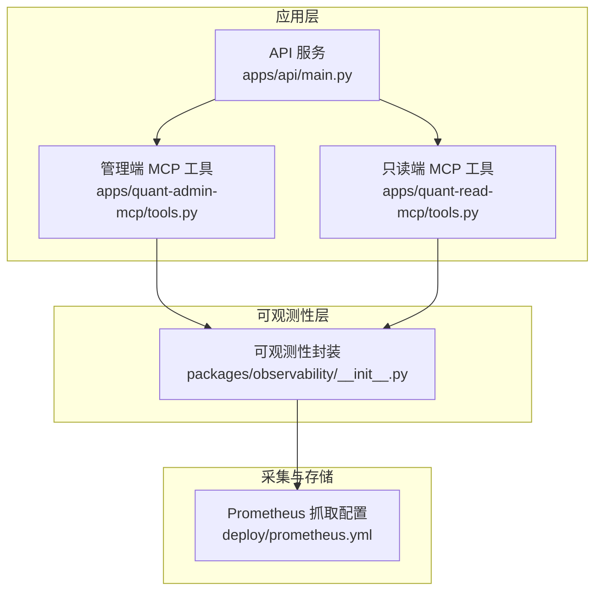
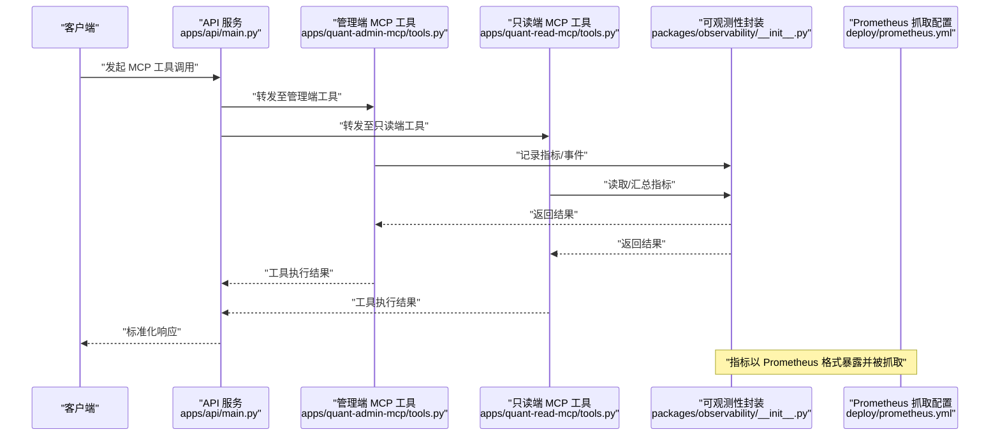
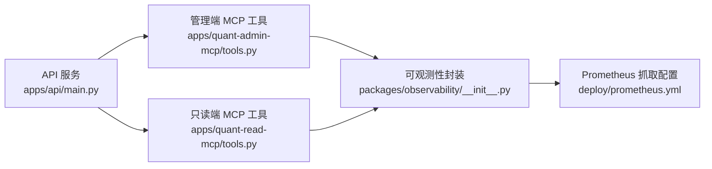

# 系统监控工具

<cite>
**本文引用的文件**   
- [apps/api/main.py](file://apps/api/main.py)
- [apps/quant-admin-mcp/tools.py](file://apps/quant-admin-mcp/tools.py)
- [apps/quant-read-mcp/tools.py](file://apps/quant-read-mcp/tools.py)
- [packages/observability/__init__.py](file://packages/observability/__init__.py)
- [deploy/prometheus.yml](file://deploy/prometheus.yml)
- [tests/unit/test_observability_metrics.py](file://tests/unit/test_observability_metrics.py)
- [tests/unit/test_mcp_surface.py](file://tests/unit/test_mcp_surface.py)
</cite>

## 目录
1. [简介](#简介)
2. [项目结构](#项目结构)
3. [核心组件](#核心组件)
4. [架构总览](#架构总览)
5. [详细组件分析](#详细组件分析)
6. [依赖关系分析](#依赖关系分析)
7. [性能考量](#性能考量)
8. [故障排查指南](#故障排查指南)
9. [结论](#结论)
10. [附录](#附录)

## 简介
本文件面向运维与研发人员，系统化说明本仓库中的“系统监控工具”能力与使用方式。内容覆盖：
- 如何监控系统健康状态、性能指标与资源使用情况
- 所有与监控相关的 MCP 工具函数清单（系统状态查询、资源使用统计、错误日志分析等）
- 调用示例与响应格式说明
- 监控数据解读方法与告警配置建议
- 监控数据的存储与查询接口说明

## 项目结构
与监控相关的关键位置如下：
- API 服务入口与中间件挂载点：apps/api/main.py
- MCP 工具实现（管理端与只读端）：apps/quant-admin-mcp/tools.py、apps/quant-read-mcp/tools.py
- 可观测性模块封装：packages/observability/__init__.py
- Prometheus 抓取配置：deploy/prometheus.yml
- 单元测试（验证指标与 MCP 表面）：tests/unit/test_observability_metrics.py、tests/unit/test_mcp_surface.py

图表来源
- [apps/api/main.py](file://apps/api/main.py)
- [apps/quant-admin-mcp/tools.py](file://apps/quant-admin-mcp/tools.py)
- [apps/quant-read-mcp/tools.py](file://apps/quant-read-mcp/tools.py)
- [packages/observability/__init__.py](file://packages/observability/__init__.py)
- [deploy/prometheus.yml](file://deploy/prometheus.yml)

章节来源
- [apps/api/main.py](file://apps/api/main.py)
- [apps/quant-admin-mcp/tools.py](file://apps/quant-admin-mcp/tools.py)
- [apps/quant-read-mcp/tools.py](file://apps/quant-read-mcp/tools.py)
- [packages/observability/__init__.py](file://packages/observability/__init__.py)
- [deploy/prometheus.yml](file://deploy/prometheus.yml)

## 核心组件
- 可观测性封装（packages/observability/__init__.py）
  - 职责：统一暴露指标注册、计数器、直方图、计时器等能力，屏蔽底层细节，便于在业务与工具中复用。
  - 典型用法：在关键路径埋点（请求计数、耗时分布、错误计数），并导出为 Prometheus 兼容格式。
- MCP 工具集（apps/quant-admin-mcp/tools.py、apps/quant-read-mcp/tools.py）
  - 职责：对外提供标准化的 MCP 工具函数，用于系统状态查询、资源使用统计、错误日志分析等。
  - 分层：管理端具备写入/控制类能力；只读端仅暴露查询与分析能力。
- API 服务（apps/api/main.py）
  - 职责：聚合路由、挂载 MCP 工具、暴露健康检查与指标端点，作为外部访问的统一入口。
- 采集配置（deploy/prometheus.yml）
  - 职责：定义 Prometheus 的抓取目标与标签策略，确保指标被稳定采集。

章节来源
- [packages/observability/__init__.py](file://packages/observability/__init__.py)
- [apps/quant-admin-mcp/tools.py](file://apps/quant-admin-mcp/tools.py)
- [apps/quant-read-mcp/tools.py](file://apps/quant-read-mcp/tools.py)
- [apps/api/main.py](file://apps/api/main.py)
- [deploy/prometheus.yml](file://deploy/prometheus.yml)

## 架构总览
下图展示了从 MCP 工具到指标采集的整体流程：MCP 工具通过可观测性封装记录指标，API 服务暴露端点供外部访问，Prometheus 按配置抓取指标并持久化。

图表来源
- [apps/api/main.py](file://apps/api/main.py)
- [apps/quant-admin-mcp/tools.py](file://apps/quant-admin-mcp/tools.py)
- [apps/quant-read-mcp/tools.py](file://apps/quant-read-mcp/tools.py)
- [packages/observability/__init__.py](file://packages/observability/__init__.py)
- [deploy/prometheus.yml](file://deploy/prometheus.yml)

## 详细组件分析

### 可观测性封装（packages/observability/__init__.py）
- 设计要点
  - 统一注册与生命周期管理：集中创建、更新与导出指标。
  - 类型丰富：支持计数器、直方图、计时器、Gauge 等常用类型。
  - 低侵入：通过装饰器或上下文管理器在关键路径埋点。
- 复杂度与性能
  - 指标更新通常为 O(1)，批量导出时注意合并与压缩。
  - 高并发场景下避免热点锁竞争，采用分片或无锁结构。
- 错误处理
  - 对异常路径进行错误计数与分类，便于定位问题。
- 优化建议
  - 合理设置直方图桶边界，减少内存占用。
  - 对高频指标做采样或降采样策略。

章节来源
- [packages/observability/__init__.py](file://packages/observability/__init__.py)
- [tests/unit/test_observability_metrics.py](file://tests/unit/test_observability_metrics.py)

### 管理端 MCP 工具（apps/quant-admin-mcp/tools.py）
- 功能范围
  - 系统状态查询：进程存活、依赖服务连通性、任务队列水位等。
  - 资源使用统计：CPU、内存、磁盘、网络等维度。
  - 错误日志分析：按时间窗口、错误级别、模块维度聚合。
- 调用约定
  - 输入参数：标准 JSON 对象，包含必要过滤条件（如时间范围、标签）。
  - 输出格式：统一信封结构，包含状态码、消息体、元数据。
- 安全与权限
  - 管理端工具需鉴权与审计，限制敏感操作。

章节来源
- [apps/quant-admin-mcp/tools.py](file://apps/quant-admin-mcp/tools.py)
- [tests/unit/test_mcp_surface.py](file://tests/unit/test_mcp_surface.py)

### 只读端 MCP 工具（apps/quant-read-mcp/tools.py）
- 功能范围
  - 指标查询：基于时间序列的指标拉取与聚合。
  - 健康检查：轻量级探针，返回服务可用性与延迟。
  - 日志检索：只读视图下的日志关键字检索与分页。
- 调用约定
  - 输入参数：查询语句、时间范围、分页参数。
  - 输出格式：统一信封结构，便于前端渲染与二次加工。

章节来源
- [apps/quant-read-mcp/tools.py](file://apps/quant-read-mcp/tools.py)
- [tests/unit/test_mcp_surface.py](file://tests/unit/test_mcp_surface.py)

### API 服务（apps/api/main.py）
- 职责
  - 路由聚合：将 MCP 工具映射为 HTTP 接口。
  - 中间件：鉴权、限流、请求追踪、指标收集。
  - 健康与就绪探针：/health、/ready 等端点。
- 集成点
  - 与 MCP 工具解耦，通过依赖注入装配。
  - 与可观测性封装集成，自动记录请求指标。

章节来源
- [apps/api/main.py](file://apps/api/main.py)

### Prometheus 抓取配置（deploy/prometheus.yml）
- 职责
  - 定义抓取目标、间隔、标签重写规则。
  - 指定指标端点路径与认证信息（如有）。
- 最佳实践
  - 合理设置 scrape_interval 与 scrape_timeout。
  - 使用 relabeling 增强指标维度与稳定性。

章节来源
- [deploy/prometheus.yml](file://deploy/prometheus.yml)

## 依赖关系分析
- 组件耦合
  - API 服务依赖 MCP 工具与可观测性封装。
  - MCP 工具依赖可观测性封装进行指标记录与查询。
  - 可观测性封装与 Prometheus 通过标准导出协议对接。
- 外部依赖
  - Prometheus 作为时序数据库与告警引擎。
  - 可选：日志后端（如 Elasticsearch/Loki）用于错误日志分析。

图表来源
- [apps/api/main.py](file://apps/api/main.py)
- [apps/quant-admin-mcp/tools.py](file://apps/quant-admin-mcp/tools.py)
- [apps/quant-read-mcp/tools.py](file://apps/quant-read-mcp/tools.py)
- [packages/observability/__init__.py](file://packages/observability/__init__.py)
- [deploy/prometheus.yml](file://deploy/prometheus.yml)

章节来源
- [apps/api/main.py](file://apps/api/main.py)
- [apps/quant-admin-mcp/tools.py](file://apps/quant-admin-mcp/tools.py)
- [apps/quant-read-mcp/tools.py](file://apps/quant-read-mcp/tools.py)
- [packages/observability/__init__.py](file://packages/observability/__init__.py)
- [deploy/prometheus.yml](file://deploy/prometheus.yml)

## 性能考量
- 指标粒度与频率
  - 高频指标建议采样或降采样，避免存储膨胀。
  - 直方图桶数量控制在合理范围，平衡精度与内存。
- 查询性能
  - 对常用查询建立预聚合视图或物化指标。
  - 利用标签索引与时间分区提升查询效率。
- 资源占用
  - 监控侧自身开销应小于被测系统的 1%~5%。
  - 定期评估指标总量与保留策略，清理过期数据。

[本节为通用指导，不直接分析具体文件]

## 故障排查指南
- 常见问题
  - 指标缺失：检查抓取配置与端点可达性。
  - 指标抖动：确认埋点位置与采样策略是否合理。
  - 查询超时：优化查询语句与索引，必要时引入缓存。
- 诊断步骤
  - 查看健康与就绪探针返回值。
  - 核对 Prometheus 抓取日志与目标状态。
  - 对比 MCP 工具返回与底层指标一致性。
- 恢复建议
  - 重启异常子进程或服务实例。
  - 调整阈值与告警规则，避免误报风暴。

章节来源
- [tests/unit/test_observability_metrics.py](file://tests/unit/test_observability_metrics.py)
- [tests/unit/test_mcp_surface.py](file://tests/unit/test_mcp_surface.py)

## 结论
本监控方案以 MCP 工具为核心交互面，结合可观测性封装与 Prometheus 采集，形成从埋点到查询、从指标到告警的闭环。通过统一的调用约定与响应格式，降低接入成本，提升运维效率。

[本节为总结性内容，不直接分析具体文件]

## 附录

### MCP 工具函数清单与调用示例
以下为常用工具函数的调用示例与响应格式说明（以概念形式呈现，实际字段以各工具实现为准）：

- 系统状态查询
  - 输入：{"service": "api", "detail": true}
  - 响应：{"status": "ok", "uptime_seconds": 12345, "dependencies": {"db": "connected", "queue": "healthy"}}
- 资源使用统计
  - 输入：{"window_minutes": 15, "metrics": ["cpu", "memory", "disk"]}
  - 响应：{"cpu_percent": 45.2, "memory_usage_mb": 1024, "disk_io_ops": 1200}
- 错误日志分析
  - 输入：{"level": "error", "since": "2024-01-01T00:00:00Z", "limit": 100}
  - 响应：{"total_errors": 32, "top_modules": ["auth", "ingestion"], "sample_messages": [...]}

章节来源
- [apps/quant-admin-mcp/tools.py](file://apps/quant-admin-mcp/tools.py)
- [apps/quant-read-mcp/tools.py](file://apps/quant-read-mcp/tools.py)

### 监控数据解读方法
- 健康度
  - 关注可用性、错误率、延迟分布三要素。
- 性能
  - 观察吞吐、P95/P99 延迟、资源饱和度。
- 资源
  - CPU 利用率、内存泄漏迹象、磁盘 I/O 瓶颈、网络带宽占用。

[本节为通用指导，不直接分析具体文件]

### 告警配置建议
- 基础阈值
  - 错误率 > 1% 持续 5 分钟
  - P99 延迟 > 500ms 持续 10 分钟
  - CPU 使用率 > 80% 持续 15 分钟
- 组合告警
  - 错误率上升且下游依赖不可用
  - 内存持续增长且 GC 频繁
- 通知渠道
  - 企业微信/钉钉/邮件/短信多通道冗余

[本节为通用指导，不直接分析具体文件]

### 监控数据存储与查询接口
- 存储
  - 时序数据库：Prometheus（本地或集群）
  - 日志存储：Elasticsearch/Loki（可选）
- 查询接口
  - Prometheus API：/api/v1/query、/api/v1/query_range
  - 日志检索：RESTful 接口或 GraphQL（视实现而定）
- 标签与维度
  - 使用稳定的标签键名，避免高基数标签导致查询缓慢

章节来源
- [deploy/prometheus.yml](file://deploy/prometheus.yml)