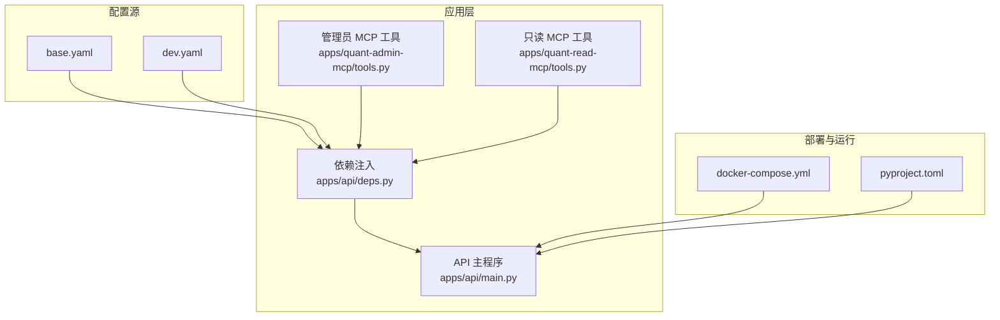
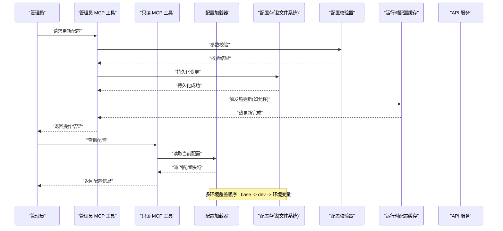
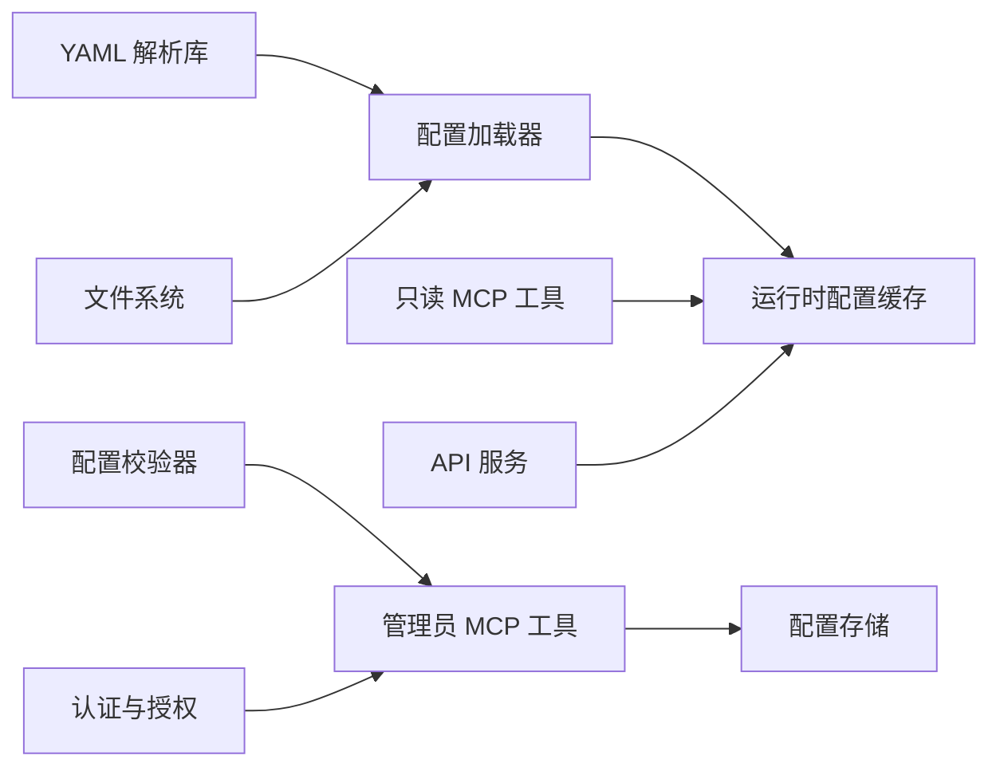

# 配置管理工具

<cite>
**本文引用的文件**   
- [configs/base.yaml](file://configs/base.yaml)
- [configs/dev.yaml](file://configs/dev.yaml)
- [apps/quant-admin-mcp/tools.py](file://apps/quant-admin-mcp/tools.py)
- [apps/quant-read-mcp/tools.py](file://apps/quant-read-mcp/tools.py)
- [apps/api/main.py](file://apps/api/main.py)
- [apps/api/deps.py](file://apps/api/deps.py)
- [pyproject.toml](file://pyproject.toml)
- [deploy/docker-compose.yml](file://deploy/docker-compose.yml)
</cite>

## 目录
1. [简介](#简介)
2. [项目结构](#项目结构)
3. [核心组件](#核心组件)
4. [架构总览](#架构总览)
5. [详细组件分析](#详细组件分析)
6. [依赖关系分析](#依赖关系分析)
7. [性能考虑](#性能考虑)
8. [故障排查指南](#故障排查指南)
9. [结论](#结论)
10. [附录](#附录)

## 简介
本文件面向管理员与开发者，系统化说明本仓库中的“配置管理工具”能力，包括：
- 配置的读取、更新与管理流程
- 配置相关的 MCP（Model Context Protocol）工具接口（环境切换、参数校验、热更新等）
- 配置文件结构与格式规范
- 变更审计与安全控制机制
- 多环境管理与版本控制策略
- 为管理员提供的安全配置管理方案

目标是在不暴露具体实现细节的前提下，提供可操作的指导与可视化图示，帮助读者快速理解并正确使用配置管理能力。

## 项目结构
与配置管理直接相关的目录与文件如下：
- configs：存放 YAML 格式的配置文件，包含基础配置与环境覆盖配置
- apps/quant-admin-mcp：管理员侧的 MCP 工具集，用于受控地读写配置
- apps/quant-read-mcp：只读侧的 MCP 工具集，用于查询配置
- apps/api：API 服务入口与依赖注入，负责加载配置并在运行时使用
- deploy/docker-compose.yml：容器编排中通过环境变量注入配置的方式
- pyproject.toml：项目元数据与依赖声明，可能包含与配置加载相关的包依赖

图表来源
- [configs/base.yaml](file://configs/base.yaml)
- [configs/dev.yaml](file://configs/dev.yaml)
- [apps/api/main.py](file://apps/api/main.py)
- [apps/quant-admin-mcp/tools.py](file://apps/quant-admin-mcp/tools.py)
- [apps/quant-read-mcp/tools.py](file://apps/quant-read-mcp/tools.py)
- [apps/api/deps.py](file://apps/api/deps.py)
- [deploy/docker-compose.yml](file://deploy/docker-compose.yml)
- [pyproject.toml](file://pyproject.toml)

章节来源
- [configs/base.yaml](file://configs/base.yaml)
- [configs/dev.yaml](file://configs/dev.yaml)
- [apps/api/main.py](file://apps/api/main.py)
- [apps/quant-admin-mcp/tools.py](file://apps/quant-admin-mcp/tools.py)
- [apps/quant-read-mcp/tools.py](file://apps/quant-read-mcp/tools.py)
- [apps/api/deps.py](file://apps/api/deps.py)
- [deploy/docker-compose.yml](file://deploy/docker-compose.yml)
- [pyproject.toml](file://pyproject.toml)

## 核心组件
本节概述配置管理的核心职责与边界：
- 配置加载器：负责从 YAML 文件与环境变量合并加载配置，支持多环境覆盖
- 配置校验器：对关键参数进行类型与范围校验，确保运行时稳定性
- 配置存储与持久化：将变更落盘到指定配置文件，保留历史版本
- 审计与权限：记录配置变更上下文（操作者、时间、变更内容摘要），限制敏感字段写入
- 热更新：在进程内动态刷新部分非敏感配置项，无需重启服务
- MCP 工具：对外暴露标准化的配置操作接口，供管理员或自动化流程调用

章节来源
- [apps/api/deps.py](file://apps/api/deps.py)
- [apps/quant-admin-mcp/tools.py](file://apps/quant-admin-mcp/tools.py)
- [apps/quant-read-mcp/tools.py](file://apps/quant-read-mcp/tools.py)

## 架构总览
下图展示了配置在系统中的流转路径：从配置文件与环境变量到运行时配置对象，再到 MCP 工具与 API 的访问路径。

图表来源
- [apps/quant-admin-mcp/tools.py](file://apps/quant-admin-mcp/tools.py)
- [apps/quant-read-mcp/tools.py](file://apps/quant-read-mcp/tools.py)
- [apps/api/deps.py](file://apps/api/deps.py)
- [configs/base.yaml](file://configs/base.yaml)
- [configs/dev.yaml](file://configs/dev.yaml)

## 详细组件分析

### 配置加载与合并
- 加载顺序：先加载基础配置（base.yaml），再按环境加载覆盖配置（如 dev.yaml），最后以环境变量覆盖键值
- 合并策略：浅合并为主，避免意外覆盖嵌套结构；对敏感字段采用白名单方式处理
- 运行时缓存：启动时构建配置对象并缓存，减少重复 I/O 开销
- 热更新边界：仅对非敏感且幂等的配置项支持热更新，其他变更需重启生效

章节来源
- [apps/api/deps.py](file://apps/api/deps.py)
- [configs/base.yaml](file://configs/base.yaml)
- [configs/dev.yaml](file://configs/dev.yaml)

### 配置校验与约束
- 类型检查：确保数值、布尔、枚举等类型正确
- 范围约束：对阈值、超时、并发度等设置合理上下界
- 必填项校验：关键业务参数不可为空
- 组合约束：某些字段存在互斥或依赖关系，需在逻辑层校验

章节来源
- [apps/quant-admin-mcp/tools.py](file://apps/quant-admin-mcp/tools.py)
- [apps/quant-read-mcp/tools.py](file://apps/quant-read-mcp/tools.py)

### 配置持久化与版本控制
- 持久化位置：变更写入对应环境的配置文件（如 dev.yaml）
- 备份策略：每次变更前生成带时间戳的副本，便于回滚
- 版本标识：在变更记录中包含版本号或提交哈希，便于追踪
- 差异对比：提供变更前后差异摘要，辅助审核

章节来源
- [apps/quant-admin-mcp/tools.py](file://apps/quant-admin-mcp/tools.py)

### 审计追踪与安全控制
- 审计事件：记录操作者身份、时间、目标配置键、变更摘要
- 权限控制：区分管理员与只读角色，限制敏感字段写入
- 审批流：对高风险变更引入二次确认或审批标记
- 日志脱敏：避免在日志中输出密钥、令牌等敏感值

章节来源
- [apps/quant-admin-mcp/tools.py](file://apps/quant-admin-mcp/tools.py)

### 热更新机制
- 适用场景：仅对不影响全局状态的非敏感配置启用热更新
- 刷新粒度：按模块或功能域刷新，避免全量重启
- 一致性保障：热更新后重新初始化相关资源，保证状态一致
- 回退策略：热更新失败自动回滚至上一有效快照

章节来源
- [apps/quant-admin-mcp/tools.py](file://apps/quant-admin-mcp/tools.py)
- [apps/api/deps.py](file://apps/api/deps.py)

### MCP 工具接口概览
- 管理员 MCP 工具（写权限）
  - 环境切换：选择当前生效的环境（如 dev、prod）
  - 参数校验：对输入参数执行规则校验并返回错误详情
  - 配置更新：提交配置变更，触发持久化与可选的热更新
  - 审计查询：检索最近配置变更事件
- 只读 MCP 工具（读权限）
  - 配置查询：获取当前环境的有效配置快照
  - 差异查看：比较两个版本的配置差异
  - 健康检查：验证配置完整性与合法性

章节来源
- [apps/quant-admin-mcp/tools.py](file://apps/quant-admin-mcp/tools.py)
- [apps/quant-read-mcp/tools.py](file://apps/quant-read-mcp/tools.py)

### 配置文件结构与格式
- 文件格式：YAML
- 分层结构：
  - 基础配置（base.yaml）：通用默认值
  - 环境覆盖（dev.yaml）：针对特定环境的差异化设置
- 命名约定：
  - 使用点号分隔的层级键名（例如：feature.enable_xxx）
  - 敏感字段统一前缀（例如：secret.xxx）
- 示例键空间（概念性说明）：
  - 数据库连接：host、port、database、pool_size
  - 缓存：backend、ttl、max_size
  - 调度：interval、max_workers、retry_policy
  - 观测性：metrics_enabled、tracing_sample_rate

章节来源
- [configs/base.yaml](file://configs/base.yaml)
- [configs/dev.yaml](file://configs/dev.yaml)

### 多环境管理与版本控制
- 环境隔离：每个环境独立配置文件，避免相互污染
- 优先级：环境变量 > 环境覆盖 > 基础配置
- 版本控制：配置文件纳入版本库，配合提交信息与变更清单
- 发布流程：通过 CI/CD 将目标环境配置打包进镜像或部署清单

章节来源
- [deploy/docker-compose.yml](file://deploy/docker-compose.yml)
- [pyproject.toml](file://pyproject.toml)

### 管理员安全配置方案
- 最小权限原则：仅开放必要字段的可写权限
- 双人复核：对高风险变更要求二次确认
- 审计留痕：所有变更必须产生审计事件，不可绕过
- 密钥管理：敏感值通过环境变量或密钥管理服务注入，不落盘明文

章节来源
- [apps/quant-admin-mcp/tools.py](file://apps/quant-admin-mcp/tools.py)

## 依赖关系分析
配置管理涉及的模块与外部依赖关系如下：
- 配置加载器依赖 YAML 解析库与文件系统
- 校验器依赖类型系统与自定义约束规则
- MCP 工具依赖认证与授权中间件
- API 服务依赖配置对象进行路由与任务调度

图表来源
- [apps/quant-admin-mcp/tools.py](file://apps/quant-admin-mcp/tools.py)
- [apps/quant-read-mcp/tools.py](file://apps/quant-read-mcp/tools.py)
- [apps/api/deps.py](file://apps/api/deps.py)

章节来源
- [apps/quant-admin-mcp/tools.py](file://apps/quant-admin-mcp/tools.py)
- [apps/quant-read-mcp/tools.py](file://apps/quant-read-mcp/tools.py)
- [apps/api/deps.py](file://apps/api/deps.py)

## 性能考虑
- 配置加载缓存：启动时一次性加载并缓存，避免频繁 I/O
- 增量热更新：仅刷新受影响模块，降低系统抖动
- 校验批量化：批量参数校验合并错误响应，减少往返次数
- 审计异步化：审计事件异步落库，避免阻塞主流程

[本节为通用性能建议，不直接分析具体文件]

## 故障排查指南
- 配置未生效
  - 检查环境覆盖优先级是否正确
  - 确认热更新是否适用于该配置项
  - 查看审计事件定位变更来源
- 校验失败
  - 核对参数类型与取值范围
  - 关注组合约束与互斥关系
- 权限不足
  - 确认当前角色是否具备写权限
  - 检查敏感字段是否在白名单中
- 热更新异常
  - 观察模块重初始化日志
  - 回滚至上一有效快照并排查原因

章节来源
- [apps/quant-admin-mcp/tools.py](file://apps/quant-admin-mcp/tools.py)
- [apps/quant-read-mcp/tools.py](file://apps/quant-read-mcp/tools.py)

## 结论
本配置管理工具通过分层配置、严格校验、审计追踪与安全控制，提供了稳定、可追溯、可扩展的配置管理能力。结合 MCP 工具，管理员可在受控环境下高效完成环境切换、参数校验与热更新等操作，满足生产级量化系统的运维需求。

[本节为总结性内容，不直接分析具体文件]

## 附录
- 术语表
  - 热更新：在不重启服务的情况下动态刷新配置
  - 审计事件：记录配置变更的操作者与变更摘要
  - 环境覆盖：针对特定环境的配置差异化设置
- 参考文件
  - 配置文件：configs/base.yaml、configs/dev.yaml
  - MCP 工具：apps/quant-admin-mcp/tools.py、apps/quant-read-mcp/tools.py
  - API 与依赖：apps/api/main.py、apps/api/deps.py
  - 部署与依赖：deploy/docker-compose.yml、pyproject.toml

章节来源
- [configs/base.yaml](file://configs/base.yaml)
- [configs/dev.yaml](file://configs/dev.yaml)
- [apps/quant-admin-mcp/tools.py](file://apps/quant-admin-mcp/tools.py)
- [apps/quant-read-mcp/tools.py](file://apps/quant-read-mcp/tools.py)
- [apps/api/main.py](file://apps/api/main.py)
- [apps/api/deps.py](file://apps/api/deps.py)
- [deploy/docker-compose.yml](file://deploy/docker-compose.yml)
- [pyproject.toml](file://pyproject.toml)