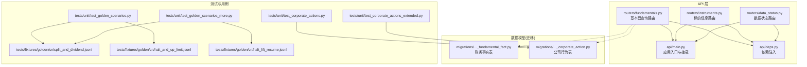
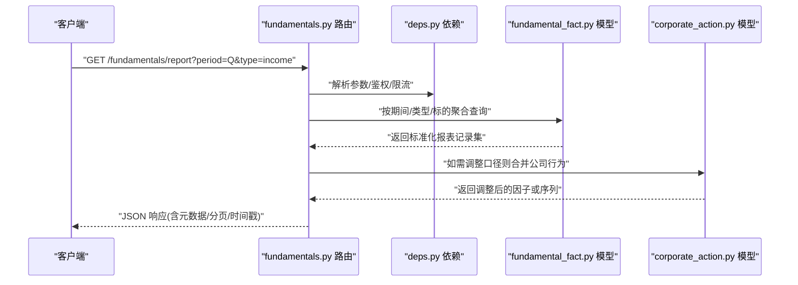
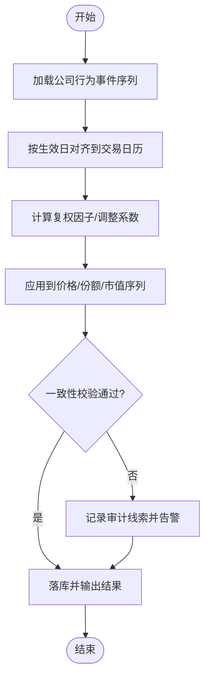
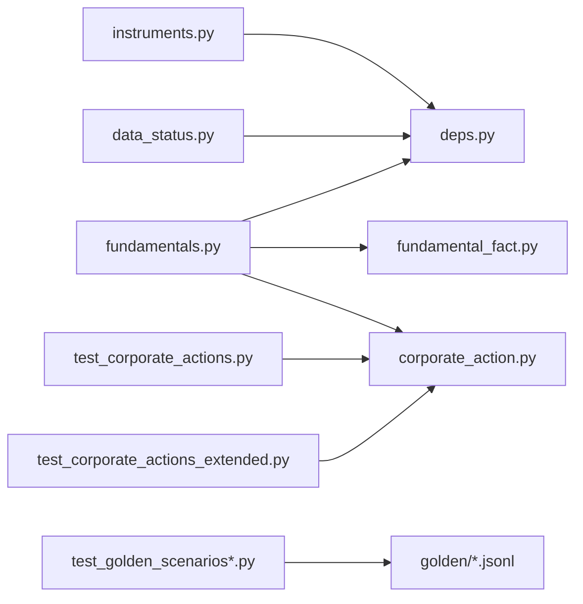

# 基本面数据工具

<cite>
**本文引用的文件**   
- [fundamentals.py](file://apps/api/routers/fundamentals.py)
- [instruments.py](file://apps/api/routers/instruments.py)
- [data_status.py](file://apps/api/routers/data_status.py)
- [main.py](file://apps/api/main.py)
- [deps.py](file://apps/api/deps.py)
- [fundamental_fact.py](file://sql/migrations/20260715_0005_fundamental_fact.py)
- [corporate_action.py](file://sql/migrations/20260715_0004_corporate_action.py)
- [test_corporate_actions.py](file://tests/unit/test_corporate_actions.py)
- [test_corporate_actions_extended.py](file://tests/unit/test_corporate_actions_extended.py)
- [test_golden_scenarios.py](file://tests/unit/test_golden_scenarios.py)
- [test_golden_scenarios_more.py](file://tests/unit/test_golden_scenarios_more.py)
- [split_and_dividend.jsonl](file://tests/fixtures/golden/cn/split_and_dividend.jsonl)
- [halt_and_up_limit.jsonl](file://tests/fixtures/golden/cn/halt_and_up_limit.jsonl)
- [halt_lift_resume.jsonl](file://tests/fixtures/golden/cn/halt_lift_resume.jsonl)
</cite>

## 目录
1. [简介](#简介)
2. [项目结构](#项目结构)
3. [核心组件](#核心组件)
4. [架构总览](#架构总览)
5. [详细组件分析](#详细组件分析)
6. [依赖关系分析](#依赖关系分析)
7. [性能考虑](#性能考虑)
8. [故障排查指南](#故障排查指南)
9. [结论](#结论)
10. [附录](#附录)

## 简介
本文件面向量化研究场景，系统化说明“基本面数据读取工具”的查询接口与数据处理逻辑。内容覆盖：
- 财务报表数据（资产负债表、利润表、现金流量表）字段定义与数据格式
- 公司行为事件（分红派息、拆股合股等）的处理逻辑
- 估值指标与财务比率计算、趋势分析与异常检测的查询方法
- 数据更新频率与质量控制机制
- 为量化研究提供稳定、可追溯、可扩展的基本面数据支持

## 项目结构
本项目采用分层架构：API 层暴露 REST 接口；迁移脚本定义持久化模型；单元测试与黄金用例保障质量与一致性。

图表来源
- [fundamentals.py](file://apps/api/routers/fundamentals.py)
- [instruments.py](file://apps/api/routers/instruments.py)
- [data_status.py](file://apps/api/routers/data_status.py)
- [main.py](file://apps/api/main.py)
- [deps.py](file://apps/api/deps.py)
- [fundamental_fact.py](file://sql/migrations/20260715_0005_fundamental_fact.py)
- [corporate_action.py](file://sql/migrations/20260715_0004_corporate_action.py)
- [test_corporate_actions.py](file://tests/unit/test_corporate_actions.py)
- [test_corporate_actions_extended.py](file://tests/unit/test_corporate_actions_extended.py)
- [test_golden_scenarios.py](file://tests/unit/test_golden_scenarios.py)
- [test_golden_scenarios_more.py](file://tests/unit/test_golden_scenarios_more.py)
- [split_and_dividend.jsonl](file://tests/fixtures/golden/cn/split_and_dividend.jsonl)
- [halt_and_up_limit.jsonl](file://tests/fixtures/golden/cn/halt_and_up_limit.jsonl)
- [halt_lift_resume.jsonl](file://tests/fixtures/golden/cn/halt_lift_resume.jsonl)

章节来源
- [fundamentals.py](file://apps/api/routers/fundamentals.py)
- [instruments.py](file://apps/api/routers/instruments.py)
- [data_status.py](file://apps/api/routers/data_status.py)
- [main.py](file://apps/api/main.py)
- [deps.py](file://apps/api/deps.py)
- [fundamental_fact.py](file://sql/migrations/20260715_0005_fundamental_fact.py)
- [corporate_action.py](file://sql/migrations/20260715_0004_corporate_action.py)
- [test_corporate_actions.py](file://tests/unit/test_corporate_actions.py)
- [test_corporate_actions_extended.py](file://tests/unit/test_corporate_actions_extended.py)
- [test_golden_scenarios.py](file://tests/unit/test_golden_scenarios.py)
- [test_golden_scenarios_more.py](file://tests/unit/test_golden_scenarios_more.py)
- [split_and_dividend.jsonl](file://tests/fixtures/golden/cn/split_and_dividend.jsonl)
- [halt_and_up_limit.jsonl](file://tests/fixtures/golden/cn/halt_and_up_limit.jsonl)
- [halt_lift_resume.jsonl](file://tests/fixtures/golden/cn/halt_lift_resume.jsonl)

## 核心组件
- 基本面查询路由：提供报表、比率、估值、趋势与异常检测的统一入口
- 标的信息路由：提供标的基础信息与映射关系
- 数据状态路由：提供数据新鲜度、覆盖率与质量指标
- 数据模型（迁移）：定义财务事实与公司行为的存储结构
- 测试与黄金用例：验证公司行为处理、跨市场一致性与边界条件

章节来源
- [fundamentals.py](file://apps/api/routers/fundamentals.py)
- [instruments.py](file://apps/api/routers/instruments.py)
- [data_status.py](file://apps/api/routers/data_status.py)
- [fundamental_fact.py](file://sql/migrations/20260715_0005_fundamental_fact.py)
- [corporate_action.py](file://sql/migrations/20260715_0004_corporate_action.py)

## 架构总览
系统通过 API 路由暴露查询能力，底层以迁移定义的表结构进行持久化，并通过测试与黄金用例确保数据质量与一致性。

图表来源
- [fundamentals.py](file://apps/api/routers/fundamentals.py)
- [deps.py](file://apps/api/deps.py)
- [fundamental_fact.py](file://sql/migrations/20260715_0005_fundamental_fact.py)
- [corporate_action.py](file://sql/migrations/20260715_0004_corporate_action.py)

## 详细组件分析

### 财务报表查询接口
- 支持的报表类型
  - 资产负债表
  - 利润表
  - 现金流量表
- 查询维度
  - 标的标识、会计期间（季度/年度）、报告日期、币种与单位
- 字段定义与数据格式
  - 统一使用数值型字段，缺失值以空值表示
  - 金额字段遵循统一单位约定（如元/万元），并在响应中附带单位元数据
  - 关键字段包含但不限于：资产、负债、权益、收入、成本、费用、净利润、经营性现金流、投资性现金流、筹资性现金流等
- 返回结构
  - 列表形式，每条记录包含标的、期间、报告期、字段键值对及数据来源标记
- 典型调用路径
  - 获取利润表：[fundamentals.py](file://apps/api/routers/fundamentals.py)
  - 获取资产负债表：[fundamentals.py](file://apps/api/routers/fundamentals.py)
  - 获取现金流量表：[fundamentals.py](file://apps/api/routers/fundamentals.py)

章节来源
- [fundamentals.py](file://apps/api/routers/fundamentals.py)
- [fundamental_fact.py](file://sql/migrations/20260715_0005_fundamental_fact.py)

### 公司行为事件处理
- 支持的事件类型
  - 分红派息（现金分红、股息率）
  - 拆股/合股（股本结构调整）
  - 停牌/复牌与涨跌停（A 股特有）
- 处理逻辑
  - 事件驱动的时间轴对齐：将事件应用到对应生效日之后的价格与份额序列
  - 复权因子计算：基于历史事件序列生成连续复权因子，用于回测与比较
  - 多源一致性校验：当不同来源存在冲突时，依据优先级与审计线索选择权威数据
- 相关实现与验证
  - 公司行为模型定义：[corporate_action.py](file://sql/migrations/20260715_0004_corporate_action.py)
  - 单元测试（基础与扩展）：[test_corporate_actions.py](file://tests/unit/test_corporate_actions.py)、[test_corporate_actions_extended.py](file://tests/unit/test_corporate_actions_extended.py)
  - 黄金用例（拆分与分红、停牌与涨跌停、复牌）：[split_and_dividend.jsonl](file://tests/fixtures/golden/cn/split_and_dividend.jsonl)、[halt_and_up_limit.jsonl](file://tests/fixtures/golden/cn/halt_and_up_limit.jsonl)、[halt_lift_resume.jsonl](file://tests/fixtures/golden/cn/halt_lift_resume.jsonl)

图表来源
- [corporate_action.py](file://sql/migrations/20260715_0004_corporate_action.py)
- [test_corporate_actions.py](file://tests/unit/test_corporate_actions.py)
- [test_corporate_actions_extended.py](file://tests/unit/test_corporate_actions_extended.py)
- [split_and_dividend.jsonl](file://tests/fixtures/golden/cn/split_and_dividend.jsonl)
- [halt_and_up_limit.jsonl](file://tests/fixtures/golden/cn/halt_and_up_limit.jsonl)
- [halt_lift_resume.jsonl](file://tests/fixtures/golden/cn/halt_lift_resume.jsonl)

章节来源
- [corporate_action.py](file://sql/migrations/20260715_0004_corporate_action.py)
- [test_corporate_actions.py](file://tests/unit/test_corporate_actions.py)
- [test_corporate_actions_extended.py](file://tests/unit/test_corporate_actions_extended.py)
- [test_golden_scenarios.py](file://tests/unit/test_golden_scenarios.py)
- [test_golden_scenarios_more.py](file://tests/unit/test_golden_scenarios_more.py)
- [split_and_dividend.jsonl](file://tests/fixtures/golden/cn/split_and_dividend.jsonl)
- [halt_and_up_limit.jsonl](file://tests/fixtures/golden/cn/halt_and_up_limit.jsonl)
- [halt_lift_resume.jsonl](file://tests/fixtures/golden/cn/halt_lift_resume.jsonl)

### 估值指标与财务比率
- 常用比率
  - 盈利能力：ROE、ROA、毛利率、净利率
  - 偿债能力：资产负债率、流动比率、速动比率
  - 运营效率：存货周转率、应收周转率、总资产周转率
  - 成长能力：营收增速、净利增速、EPS 增速
  - 估值指标：PE、PB、PS、EV/EBITDA、股息率
- 计算方法
  - 基于标准化报表字段进行组合计算，统一口径与单位
  - 支持滚动窗口（TTM、季度环比、年度同比）
- 查询方式
  - 通过基本面路由批量拉取比率序列，并按标的与时间范围过滤
  - 结合公司行为事件进行复权与可比性调整

章节来源
- [fundamentals.py](file://apps/api/routers/fundamentals.py)
- [fundamental_fact.py](file://sql/migrations/20260715_0005_fundamental_fact.py)

### 趋势分析与异常检测
- 趋势分析
  - 移动平均、指数平滑、季节性分解
  - 关键拐点识别与信号生成
- 异常检测
  - 统计阈值法（Z-score、IQR）
  - 变化率突变检测（环比/同比跳变）
  - 与行业/同业对比偏离度
- 输出
  - 标注异常点与原因标签，便于后续策略与风控联动

章节来源
- [fundamentals.py](file://apps/api/routers/fundamentals.py)

### 数据状态与质量控制
- 数据新鲜度
  - 最近更新时间、批次号、来源标识
- 覆盖率与完整性
  - 字段缺失比例、样本覆盖率、时间序列连续性
- 一致性校验
  - 跨源比对、勾稽关系检查（如资产负债表恒等式）
- 监控与告警
  - 质量阈值越界触发告警，记录审计线索

章节来源
- [data_status.py](file://apps/api/routers/data_status.py)

### 标的信息与映射
- 标的基础信息
  - 名称、代码、上市地、行业分类、上市/退市日期
- 标识规范
  - 统一 ID 格式与跨市场映射规则
- 查询用途
  - 作为基本面与公司行为查询的输入约束

章节来源
- [instruments.py](file://apps/api/routers/instruments.py)

## 依赖关系分析
- 路由层依赖
  - fundamentals.py 依赖 deps.py 完成参数解析、鉴权与资源管理
  - instruments.py 与 data_status.py 同样通过 deps.py 复用通用能力
- 数据模型依赖
  - fundamental_fact.py 定义财务事实表结构
  - corporate_action.py 定义公司行为表结构
- 测试与用例依赖
  - 单元测试与黄金用例直接验证公司行为处理与跨市场一致性

图表来源
- [fundamentals.py](file://apps/api/routers/fundamentals.py)
- [instruments.py](file://apps/api/routers/instruments.py)
- [data_status.py](file://apps/api/routers/data_status.py)
- [deps.py](file://apps/api/deps.py)
- [fundamental_fact.py](file://sql/migrations/20260715_0005_fundamental_fact.py)
- [corporate_action.py](file://sql/migrations/20260715_0004_corporate_action.py)
- [test_corporate_actions.py](file://tests/unit/test_corporate_actions.py)
- [test_corporate_actions_extended.py](file://tests/unit/test_corporate_actions_extended.py)
- [test_golden_scenarios.py](file://tests/unit/test_golden_scenarios.py)
- [test_golden_scenarios_more.py](file://tests/unit/test_golden_scenarios_more.py)
- [split_and_dividend.jsonl](file://tests/fixtures/golden/cn/split_and_dividend.jsonl)
- [halt_and_up_limit.jsonl](file://tests/fixtures/golden/cn/halt_and_up_limit.jsonl)
- [halt_lift_resume.jsonl](file://tests/fixtures/golden/cn/halt_lift_resume.jsonl)

章节来源
- [fundamentals.py](file://apps/api/routers/fundamentals.py)
- [instruments.py](file://apps/api/routers/instruments.py)
- [data_status.py](file://apps/api/routers/data_status.py)
- [deps.py](file://apps/api/deps.py)
- [fundamental_fact.py](file://sql/migrations/20260715_0005_fundamental_fact.py)
- [corporate_action.py](file://sql/migrations/20260715_0004_corporate_action.py)
- [test_corporate_actions.py](file://tests/unit/test_corporate_actions.py)
- [test_corporate_actions_extended.py](file://tests/unit/test_corporate_actions_extended.py)
- [test_golden_scenarios.py](file://tests/unit/test_golden_scenarios.py)
- [test_golden_scenarios_more.py](file://tests/unit/test_golden_scenarios_more.py)
- [split_and_dividend.jsonl](file://tests/fixtures/golden/cn/split_and_dividend.jsonl)
- [halt_and_up_limit.jsonl](file://tests/fixtures/golden/cn/halt_and_up_limit.jsonl)
- [halt_lift_resume.jsonl](file://tests/fixtures/golden/cn/halt_lift_resume.jsonl)

## 性能考虑
- 查询优化
  - 按标的与期间索引，避免全表扫描
  - 分页与增量拉取，减少单次响应体积
- 计算优化
  - 比率与趋势预计算与缓存，降低在线计算开销
  - 批处理窗口函数，提升时序聚合效率
- 并发与限流
  - 通过依赖注入层统一限流与熔断，保护后端服务
- 存储优化
  - 冷热数据分层，历史快照归档

## 故障排查指南
- 常见问题
  - 字段缺失：检查数据新鲜度与覆盖率指标
  - 不一致：查看审计线索与跨源差异日志
  - 公司行为异常：核对生效日、复权因子与事件顺序
- 定位步骤
  - 使用数据状态接口确认最近更新时间与批次
  - 针对具体标的拉取事件序列，验证复权因子计算
  - 运行单元测试与黄金用例，复现问题并回归修复
- 参考实现
  - 数据状态接口：[data_status.py](file://apps/api/routers/data_status.py)
  - 公司行为处理与测试：[corporate_action.py](file://sql/migrations/20260715_0004_corporate_action.py)、[test_corporate_actions.py](file://tests/unit/test_corporate_actions.py)、[test_corporate_actions_extended.py](file://tests/unit/test_corporate_actions_extended.py)
  - 黄金用例：[test_golden_scenarios.py](file://tests/unit/test_golden_scenarios.py)、[test_golden_scenarios_more.py](file://tests/unit/test_golden_scenarios_more.py)、[split_and_dividend.jsonl](file://tests/fixtures/golden/cn/split_and_dividend.jsonl)、[halt_and_up_limit.jsonl](file://tests/fixtures/golden/cn/halt_and_up_limit.jsonl)、[halt_lift_resume.jsonl](file://tests/fixtures/golden/cn/halt_lift_resume.jsonl)

章节来源
- [data_status.py](file://apps/api/routers/data_status.py)
- [corporate_action.py](file://sql/migrations/20260715_0004_corporate_action.py)
- [test_corporate_actions.py](file://tests/unit/test_corporate_actions.py)
- [test_corporate_actions_extended.py](file://tests/unit/test_corporate_actions_extended.py)
- [test_golden_scenarios.py](file://tests/unit/test_golden_scenarios.py)
- [test_golden_scenarios_more.py](file://tests/unit/test_golden_scenarios_more.py)
- [split_and_dividend.jsonl](file://tests/fixtures/golden/cn/split_and_dividend.jsonl)
- [halt_and_up_limit.jsonl](file://tests/fixtures/golden/cn/halt_and_up_limit.jsonl)
- [halt_lift_resume.jsonl](file://tests/fixtures/golden/cn/halt_lift_resume.jsonl)

## 结论
本基本面数据工具以统一的 API 接口提供标准化的财务报表、公司行为与估值指标查询，配合严格的数据质量控制与完善的测试体系，满足量化研究对准确性、时效性与可追溯性的要求。建议在实际使用中结合数据状态接口与审计线索，持续监控数据质量与一致性。

## 附录
- 术语
  - 财报三表：资产负债表、利润表、现金流量表
  - 公司行为：分红派息、拆股合股、停牌复牌、涨跌停等
  - 复权因子：用于消除公司行为对价格序列影响的调整系数
- 最佳实践
  - 查询前明确标的、期间与单位
  - 对关键比率设置阈值与预警
  - 定期回归测试与黄金用例校验