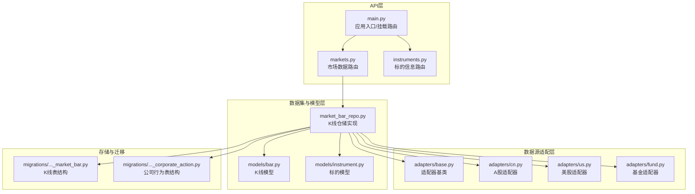
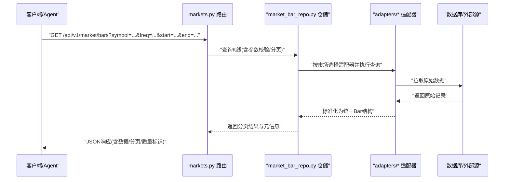
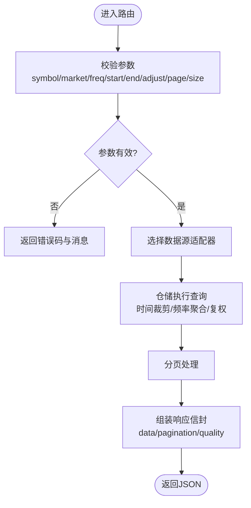
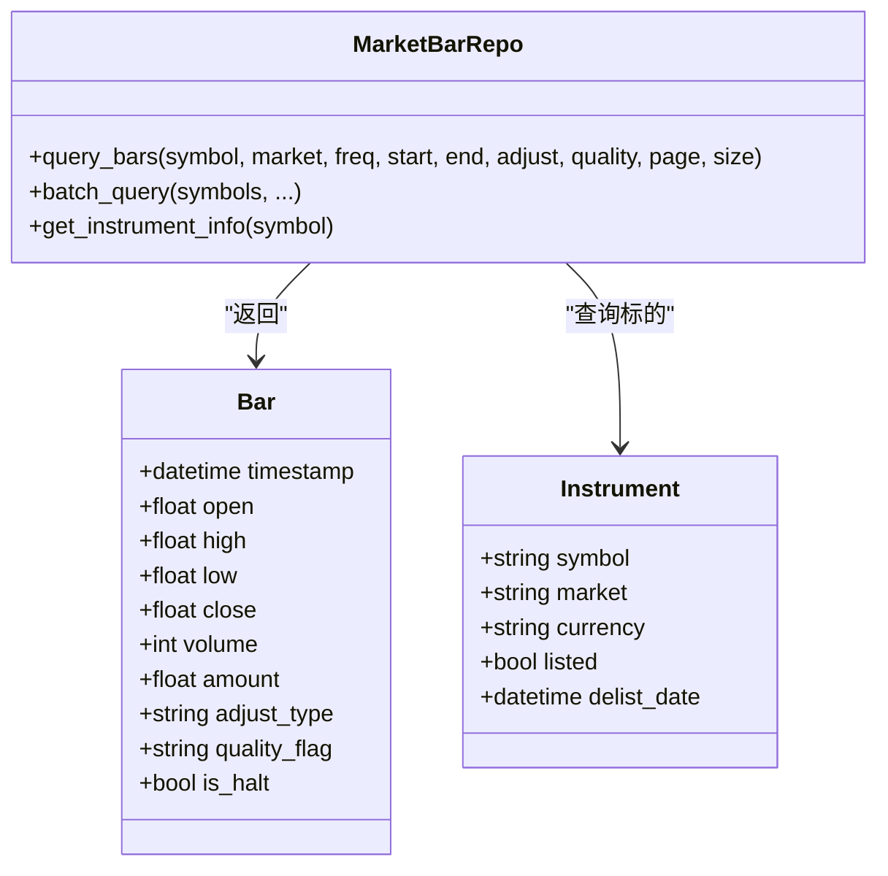
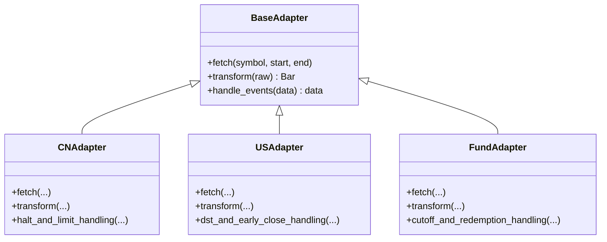
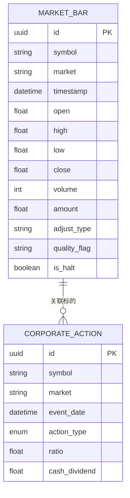
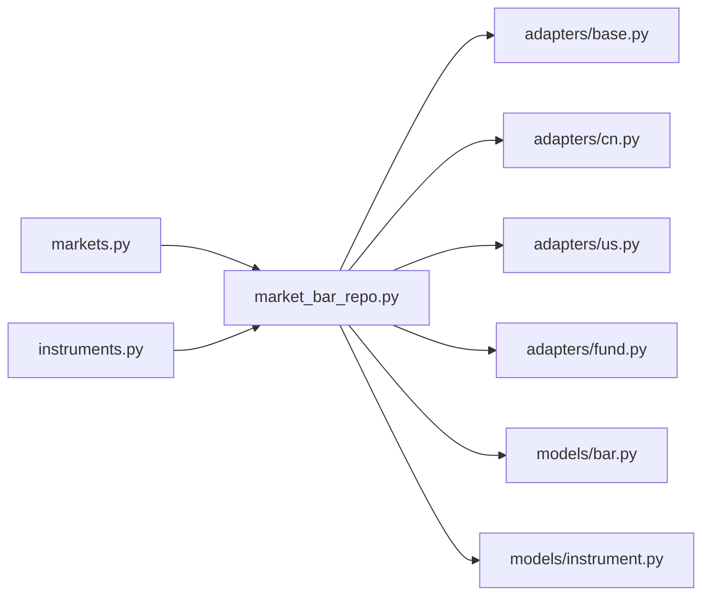

# 市场数据工具

<cite>
**本文引用的文件**   
- [apps/api/routers/markets.py](file://apps/api/routers/markets.py)
- [apps/api/routers/instruments.py](file://apps/api/routers/instruments.py)
- [apps/api/main.py](file://apps/api/main.py)
- [packages/datasets/market_bar_repo.py](file://packages/datasets/market_bar_repo.py)
- [packages/data_sources/adapters/base.py](file://packages/data_sources/adapters/base.py)
- [packages/data_sources/adapters/cn.py](file://packages/data_sources/adapters/cn.py)
- [packages/data_sources/adapters/us.py](file://packages/data_sources/adapters/us.py)
- [packages/data_sources/adapters/fund.py](file://packages/data_sources/adapters/fund.py)
- [packages/models/bar.py](file://packages/models/bar.py)
- [packages/models/instrument.py](file://packages/models/instrument.py)
- [sql/migrations/20260715_0003_market_bar.py](file://sql/migrations/20260715_0003_market_bar.py)
- [sql/migrations/20260715_0004_corporate_action.py](file://sql/migrations/20260715_0004_corporate_action.py)
- [skills/cross-market-quant-research/references/instrument-id-format.md](file://skills/cross-market-quant-research/references/instrument-id-format.md)
- [readme/A股美股基金量化Agent_Skill+MCP模块实施规格_V4.md](file://readme/A股美股基金量化Agent_Skill+MCP模块实施规格_V4.md)
</cite>

## 目录
1. [简介](#简介)
2. [项目结构](#项目结构)
3. [核心组件](#核心组件)
4. [架构总览](#架构总览)
5. [详细组件分析](#详细组件分析)
6. [依赖关系分析](#依赖关系分析)
7. [性能与批量查询优化](#性能与批量查询优化)
8. [故障排查指南](#故障排查指南)
9. [结论](#结论)
10. [附录：接口规范与示例](#附录接口规范与示例)

## 简介
本文件面向AI Agent与开发者，系统化说明“市场数据读取工具”的查询能力与使用方式。内容覆盖K线数据、实时行情、历史数据的查询接口；股票代码格式、时间范围过滤、频率选择等参数配置；A股、美股、基金等多市场示例与响应格式；数据质量标识、停牌状态处理、复权计算选项；以及批量查询优化与分页机制，帮助Agent高效访问跨市场数据。

## 项目结构
本项目采用分层与模块化组织：
- API层：提供HTTP路由与对外接口（如市场数据、标的信息）。
- 数据源适配层：统一封装多源数据接入（A股、美股、基金），屏蔽差异。
- 数据集与模型层：定义统一的Bar实体与仓储接口，支撑K线与历史数据查询。
- 数据库迁移：定义市场K线表与公司行为表结构。
- Skill与文档：为Agent提供标准化技能与参考规范。

图表来源
- [apps/api/main.py](file://apps/api/main.py)
- [apps/api/routers/markets.py](file://apps/api/routers/markets.py)
- [apps/api/routers/instruments.py](file://apps/api/routers/instruments.py)
- [packages/datasets/market_bar_repo.py](file://packages/datasets/market_bar_repo.py)
- [packages/data_sources/adapters/base.py](file://packages/data_sources/adapters/base.py)
- [packages/data_sources/adapters/cn.py](file://packages/data_sources/adapters/cn.py)
- [packages/data_sources/adapters/us.py](file://packages/data_sources/adapters/us.py)
- [packages/data_sources/adapters/fund.py](file://packages/data_sources/adapters/fund.py)
- [packages/models/bar.py](file://packages/models/bar.py)
- [packages/models/instrument.py](file://packages/models/instrument.py)
- [sql/migrations/20260715_0003_market_bar.py](file://sql/migrations/20260715_0003_market_bar.py)
- [sql/migrations/20260715_0004_corporate_action.py](file://sql/migrations/20260715_0004_corporate_action.py)

章节来源
- [apps/api/main.py](file://apps/api/main.py)
- [apps/api/routers/markets.py](file://apps/api/routers/markets.py)
- [apps/api/routers/instruments.py](file://apps/api/routers/instruments.py)
- [packages/datasets/market_bar_repo.py](file://packages/datasets/market_bar_repo.py)
- [packages/models/bar.py](file://packages/models/bar.py)
- [packages/models/instrument.py](file://packages/models/instrument.py)
- [sql/migrations/20260715_0003_market_bar.py](file://sql/migrations/20260715_0003_market_bar.py)
- [sql/migrations/20260715_0004_corporate_action.py](file://sql/migrations/20260715_0004_corporate_action.py)

## 核心组件
- 市场数据路由：提供K线、实时行情、历史数据查询的统一入口，支持按市场、标的、时间范围、频率等参数筛选。
- 标的信息路由：提供标的基础信息与代码格式校验，辅助Agent构造正确请求。
- K线仓储：封装对底层数据源的查询逻辑，负责时间窗口裁剪、频率聚合、复权处理、分页与批量优化。
- 数据源适配器：针对A股、美股、基金的差异化数据源进行统一抽象，屏蔽差异。
- 数据模型：统一K线与标的的数据结构，确保跨市场一致性。

章节来源
- [apps/api/routers/markets.py](file://apps/api/routers/markets.py)
- [apps/api/routers/instruments.py](file://apps/api/routers/instruments.py)
- [packages/datasets/market_bar_repo.py](file://packages/datasets/market_bar_repo.py)
- [packages/data_sources/adapters/base.py](file://packages/data_sources/adapters/base.py)
- [packages/data_sources/adapters/cn.py](file://packages/data_sources/adapters/cn.py)
- [packages/data_sources/adapters/us.py](file://packages/data_sources/adapters/us.py)
- [packages/data_sources/adapters/fund.py](file://packages/data_sources/adapters/fund.py)
- [packages/models/bar.py](file://packages/models/bar.py)
- [packages/models/instrument.py](file://packages/models/instrument.py)

## 架构总览
下图展示从API到数据源的调用链路与关键职责划分。

图表来源
- [apps/api/routers/markets.py](file://apps/api/routers/markets.py)
- [packages/datasets/market_bar_repo.py](file://packages/datasets/market_bar_repo.py)
- [packages/data_sources/adapters/base.py](file://packages/data_sources/adapters/base.py)
- [packages/data_sources/adapters/cn.py](file://packages/data_sources/adapters/cn.py)
- [packages/data_sources/adapters/us.py](file://packages/data_sources/adapters/us.py)
- [packages/data_sources/adapters/fund.py](file://packages/data_sources/adapters/fund.py)

## 详细组件分析

### 市场数据路由（K线/实时/历史）
- 功能要点
  - 统一接收K线、实时行情、历史数据查询请求。
  - 支持参数：symbol、market、freq、start、end、adjust、quality、page、size等。
  - 返回标准JSON信封，包含数据列表、分页信息、质量标识与异常提示。
- 关键流程
  - 参数校验与默认值填充。
  - 根据market选择对应数据源适配器。
  - 调用仓储执行查询，完成时间裁剪、频率聚合、复权处理。
  - 组装分页与质量元数据后返回。

图表来源
- [apps/api/routers/markets.py](file://apps/api/routers/markets.py)
- [packages/datasets/market_bar_repo.py](file://packages/datasets/market_bar_repo.py)

章节来源
- [apps/api/routers/markets.py](file://apps/api/routers/markets.py)

### 标的信息路由（代码格式与基础信息）
- 功能要点
  - 提供标的基础信息查询与代码格式校验。
  - 返回标的所属市场、交易日历、币种、是否可交易等信息。
- 使用建议
  - Agent在发起K线或实时行情前，先通过该接口确认symbol格式与市场映射。

章节来源
- [apps/api/routers/instruments.py](file://apps/api/routers/instruments.py)

### K线仓储与数据模型
- 仓储职责
  - 将上层请求转换为具体数据源的查询条件。
  - 执行时间范围过滤、频率聚合、复权计算、质量过滤。
  - 支持分页与批量优化。
- 数据模型
  - Bar：统一K线字段（时间戳、开高低收、成交量、成交额、复权因子、质量标识等）。
  - Instrument：统一标的字段（symbol、market、币种、上市/退市信息等）。

图表来源
- [packages/datasets/market_bar_repo.py](file://packages/datasets/market_bar_repo.py)
- [packages/models/bar.py](file://packages/models/bar.py)
- [packages/models/instrument.py](file://packages/models/instrument.py)

章节来源
- [packages/datasets/market_bar_repo.py](file://packages/datasets/market_bar_repo.py)
- [packages/models/bar.py](file://packages/models/bar.py)
- [packages/models/instrument.py](file://packages/models/instrument.py)

### 数据源适配器（A股/美股/基金）
- 设计模式
  - 基于适配器基类统一抽象，各市场实现差异化解析与转换。
- 主要职责
  - 原始数据拉取与清洗。
  - 停牌、涨跌停、分红送转、拆合股等事件处理。
  - 输出统一Bar结构，附带质量标识。

图表来源
- [packages/data_sources/adapters/base.py](file://packages/data_sources/adapters/base.py)
- [packages/data_sources/adapters/cn.py](file://packages/data_sources/adapters/cn.py)
- [packages/data_sources/adapters/us.py](file://packages/data_sources/adapters/us.py)
- [packages/data_sources/adapters/fund.py](file://packages/data_sources/adapters/fund.py)

章节来源
- [packages/data_sources/adapters/base.py](file://packages/data_sources/adapters/base.py)
- [packages/data_sources/adapters/cn.py](file://packages/data_sources/adapters/cn.py)
- [packages/data_sources/adapters/us.py](file://packages/data_sources/adapters/us.py)
- [packages/data_sources/adapters/fund.py](file://packages/data_sources/adapters/fund.py)

### 数据库结构与事件处理
- 市场K线表：存储标准化后的Bar记录，便于持久化与回溯。
- 公司行为表：记录分红、拆合股等事件，用于复权计算与数据溯源。

图表来源
- [sql/migrations/20260715_0003_market_bar.py](file://sql/migrations/20260715_0003_market_bar.py)
- [sql/migrations/20260715_0004_corporate_action.py](file://sql/migrations/20260715_0004_corporate_action.py)

章节来源
- [sql/migrations/20260715_0003_market_bar.py](file://sql/migrations/20260715_0003_market_bar.py)
- [sql/migrations/20260715_0004_corporate_action.py](file://sql/migrations/20260715_0004_corporate_action.py)

## 依赖关系分析
- 路由层依赖仓储层，仓储层依赖适配器与模型，适配器依赖外部数据源。
- 数据流向：请求→路由→仓储→适配器→外部源→标准化Bar→仓储→路由→响应。
- 耦合点：
  - 路由与仓储之间通过统一参数契约交互。
  - 仓储与适配器之间通过Bar与Instrument模型解耦。
  - 适配器与外部源之间通过各自协议隔离。

图表来源
- [apps/api/routers/markets.py](file://apps/api/routers/markets.py)
- [apps/api/routers/instruments.py](file://apps/api/routers/instruments.py)
- [packages/datasets/market_bar_repo.py](file://packages/datasets/market_bar_repo.py)
- [packages/data_sources/adapters/base.py](file://packages/data_sources/adapters/base.py)
- [packages/data_sources/adapters/cn.py](file://packages/data_sources/adapters/cn.py)
- [packages/data_sources/adapters/us.py](file://packages/data_sources/adapters/us.py)
- [packages/data_sources/adapters/fund.py](file://packages/data_sources/adapters/fund.py)
- [packages/models/bar.py](file://packages/models/bar.py)
- [packages/models/instrument.py](file://packages/models/instrument.py)

章节来源
- [apps/api/routers/markets.py](file://apps/api/routers/markets.py)
- [apps/api/routers/instruments.py](file://apps/api/routers/instruments.py)
- [packages/datasets/market_bar_repo.py](file://packages/datasets/market_bar_repo.py)
- [packages/models/bar.py](file://packages/models/bar.py)
- [packages/models/instrument.py](file://packages/models/instrument.py)

## 性能与批量查询优化
- 分页机制
  - 通过page与size控制返回条数，避免单次响应过大。
  - 建议使用游标式分页（timestamp/symbol组合）提升稳定性。
- 批量查询
  - 支持symbols数组批量拉取，内部合并去重与并行调度。
  - 对高频场景启用缓存与预聚合，减少重复IO。
- 时间范围与频率
  - 合理缩小start/end范围，降低传输与处理开销。
  - 选择合适的freq（如1min/5min/1h/1d），避免过细粒度导致数据量过大。
- 复权与质量过滤
  - adjust可选前复权/后复权/不复权，默认不复权以提升性能。
  - quality_flag可用于过滤低质量数据，提高下游分析效率。

[本节为通用指导，不直接分析具体文件]

## 故障排查指南
- 常见错误
  - 参数缺失或格式错误：检查symbol格式、market取值、时间范围合法性。
  - 无数据返回：确认标的是否上市、是否在交易时段、是否存在停牌。
  - 数据不一致：关注quality_flag与is_halt字段，必要时调整adjust策略。
- 定位方法
  - 查看响应中的分页与质量元数据。
  - 核对标的基础信息（上市/退市、币种、交易日历）。
  - 对比不同频段的聚合结果，验证频率转换是否正确。

章节来源
- [apps/api/routers/markets.py](file://apps/api/routers/markets.py)
- [apps/api/routers/instruments.py](file://apps/api/routers/instruments.py)
- [packages/datasets/market_bar_repo.py](file://packages/datasets/market_bar_repo.py)

## 结论
本工具以统一接口与标准化模型为核心，屏蔽多市场差异，提供稳定、可扩展的市场数据访问能力。通过分页与批量优化、质量标识与复权选项，满足AI Agent在不同场景下的高效数据获取需求。建议Agent遵循代码格式规范、合理设置时间范围与频率，并结合质量标识与停牌状态进行稳健的数据消费。

[本节为总结性内容，不直接分析具体文件]

## 附录：接口规范与示例

### 股票代码格式
- 规则与约定
  - 采用跨市场统一格式，包含市场前缀与主体代码。
  - 示例参考：A股、美股、基金分别有各自的编码约定。
- 建议
  - 在发起查询前先通过标的接口校验symbol格式。

章节来源
- [skills/cross-market-quant-research/references/instrument-id-format.md](file://skills/cross-market-quant-research/references/instrument-id-format.md)
- [apps/api/routers/instruments.py](file://apps/api/routers/instruments.py)

### 查询参数说明
- 通用参数
  - symbol：标的代码（必填）
  - market：市场（CN/US/FUND，必填）
  - freq：频率（1min/5min/15min/30min/1h/1d等，必填）
  - start/end：起止时间（ISO8601，必填）
  - adjust：复权类型（none/front/back，选填）
  - quality：质量过滤（可选）
  - page/size：分页（选填）
- 特殊参数
  - halt：是否包含停牌日（选填）
  - events：是否包含公司行为事件（选填）

章节来源
- [apps/api/routers/markets.py](file://apps/api/routers/markets.py)
- [packages/datasets/market_bar_repo.py](file://packages/datasets/market_bar_repo.py)

### 响应格式
- 信封结构
  - data：数据列表（Bar数组）
  - pagination：分页信息（page/size/total/has_next）
  - quality：质量统计（good/bad/unknown比例）
  - meta：元信息（market/freq/adjust等）
- 字段说明
  - timestamp/open/high/low/close/volume/amount：标准K线字段
  - adjust_type：复权类型
  - quality_flag：质量标识（如good/bad/unknown）
  - is_halt：是否停牌

章节来源
- [apps/api/routers/markets.py](file://apps/api/routers/markets.py)
- [packages/models/bar.py](file://packages/models/bar.py)

### 多市场示例
- A股
  - 示例：查询某A股标的1分钟K线，时间范围最近交易日，不复权。
  - 注意：关注停牌与涨跌停标记，必要时过滤。
- 美股
  - 示例：查询某美股标的5分钟K线，时间范围自定义，前复权。
  - 注意：考虑夏令时与提前收盘事件。
- 基金
  - 示例：查询某基金净值序列，按日频，包含截止与赎回事件。
  - 注意：基金数据多为日频，关注净值更新延迟。

章节来源
- [packages/data_sources/adapters/cn.py](file://packages/data_sources/adapters/cn.py)
- [packages/data_sources/adapters/us.py](file://packages/data_sources/adapters/us.py)
- [packages/data_sources/adapters/fund.py](file://packages/data_sources/adapters/fund.py)

### 数据质量与停牌处理
- 质量标识
  - good：高质量数据
  - bad：低质量或缺失数据
  - unknown：不确定质量
- 停牌处理
  - is_halt=true表示当日停牌，价格与成交量可能为空或沿用上一交易日。
  - 建议在下游逻辑中跳过停牌日或做特殊处理。

章节来源
- [packages/models/bar.py](file://packages/models/bar.py)
- [packages/data_sources/adapters/cn.py](file://packages/data_sources/adapters/cn.py)

### 复权计算选项
- 不复权（none）：保留原始价格，适合事件研究。
- 前复权（front）：以当前价格为基准向前调整，适合回测。
- 后复权（back）：以历史价格为基准向后调整，适合长期收益分析。
- 触发条件：分红、拆合股等公司行为事件。

章节来源
- [packages/datasets/market_bar_repo.py](file://packages/datasets/market_bar_repo.py)
- [sql/migrations/20260715_0004_corporate_action.py](file://sql/migrations/20260715_0004_corporate_action.py)

### AI Agent高效访问模式
- 推荐实践
  - 先查标的信息，再构造symbol与market。
  - 使用分页与批量查询，避免大响应。
  - 结合quality_flag与is_halt进行数据清洗。
  - 按需选择adjust策略，平衡精度与性能。
- 容错与重试
  - 对网络超时与空结果进行重试与降级。
  - 记录日志与指标，便于问题定位。

章节来源
- [apps/api/routers/markets.py](file://apps/api/routers/markets.py)
- [apps/api/routers/instruments.py](file://apps/api/routers/instruments.py)
- [packages/datasets/market_bar_repo.py](file://packages/datasets/market_bar_repo.py)