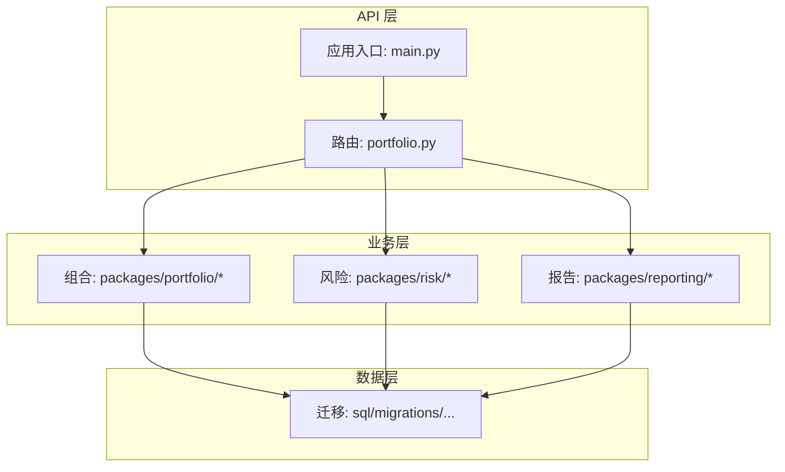
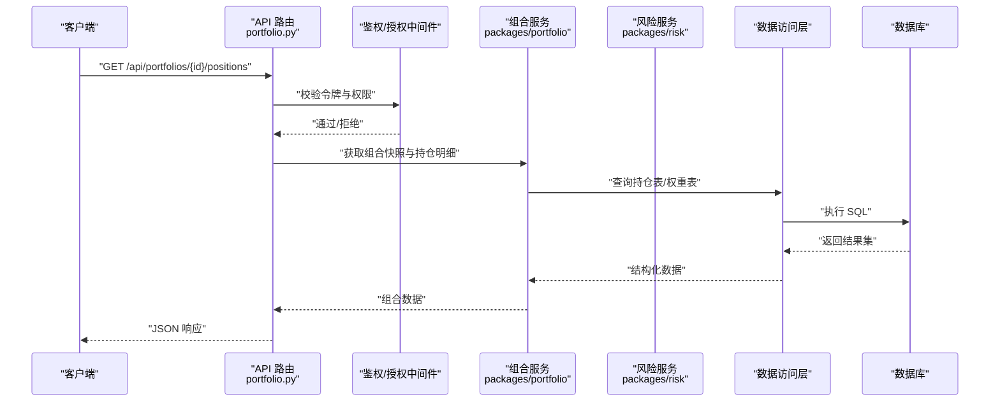
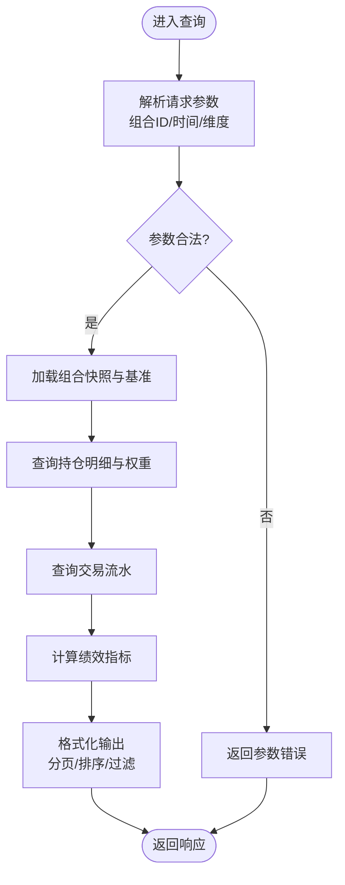
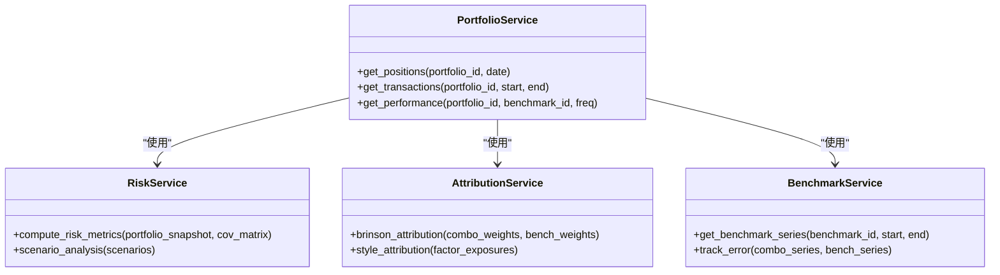
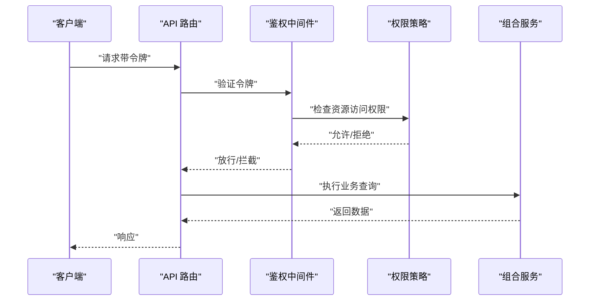
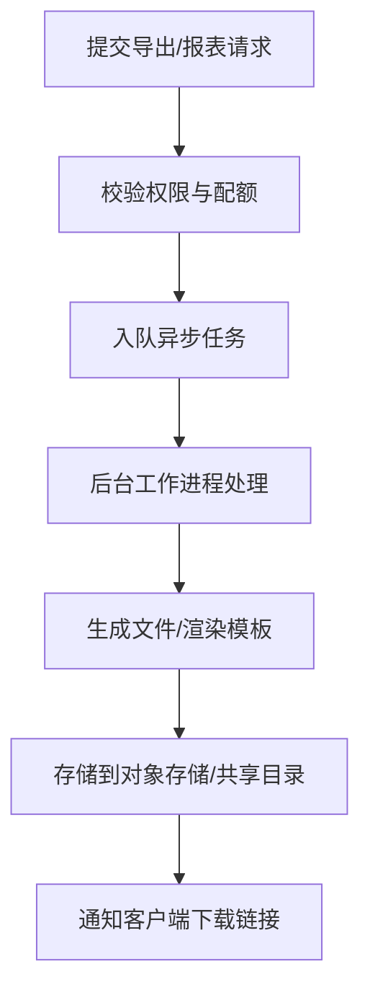
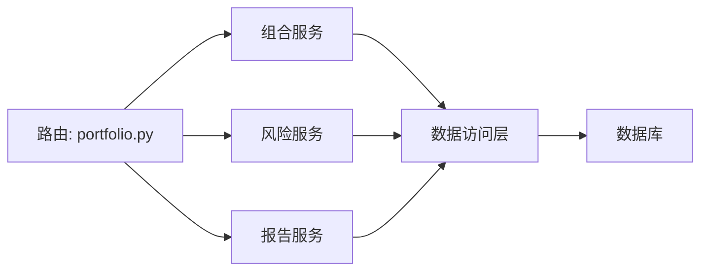

# 投资组合数据工具

<cite>
**本文引用的文件**   
- [apps/api/routers/portfolio.py](file://apps/api/routers/portfolio.py)
- [apps/api/main.py](file://apps/api/main.py)
- [packages/portfolio/](file://packages/portfolio/)
- [packages/risk/](file://packages/risk/)
- [packages/reporting/](file://packages/reporting/)
- [sql/migrations/20260715_0006_fund_fx_portfolio.py](file://sql/migrations/20260715_0006_fund_fx_portfolio.py)
</cite>

## 目录
1. [简介](#简介)
2. [项目结构](#项目结构)
3. [核心组件](#核心组件)
4. [架构总览](#架构总览)
5. [详细组件分析](#详细组件分析)
6. [依赖分析](#依赖分析)
7. [性能考虑](#性能考虑)
8. [故障排查指南](#故障排查指南)
9. [结论](#结论)
10. [附录](#附录)

## 简介
本文件为“投资组合数据读取工具”的完整技术文档，聚焦于组合相关数据的查询接口与能力，包括：
- 当前持仓结构与权重
- 历史交易流水与成交明细
- 盈亏统计与绩效指标
- 组合风险评估、归因分析与基准对比等高级查询
- 权限控制与数据隔离机制
- 批量导出与自定义报表生成选项

目标是提供一套统一的数据访问能力，覆盖从基础查询到高级分析的端到端场景。

## 项目结构
本项目采用分层与模块化组织方式：
- API 层：路由定义与请求处理（FastAPI）
- 业务层：组合、风险、报告等包封装领域逻辑
- 数据层：迁移脚本与数据库模型（Alembic）
- 配置与部署：YAML 配置与容器编排

图表来源
- [apps/api/routers/portfolio.py](file://apps/api/routers/portfolio.py)
- [apps/api/main.py](file://apps/api/main.py)
- [packages/portfolio/](file://packages/portfolio/)
- [packages/risk/](file://packages/risk/)
- [packages/reporting/](file://packages/reporting/)
- [sql/migrations/20260715_0006_fund_fx_portfolio.py](file://sql/migrations/20260715_0006_fund_fx_portfolio.py)

章节来源
- [apps/api/routers/portfolio.py](file://apps/api/routers/portfolio.py)
- [apps/api/main.py](file://apps/api/main.py)
- [sql/migrations/20260715_0006_fund_fx_portfolio.py](file://sql/migrations/20260715_0006_fund_fx_portfolio.py)

## 核心组件
- 组合服务（packages/portfolio）：负责组合快照、持仓明细、权重计算、净值曲线、基准对齐等
- 风险服务（packages/risk）：负责风险指标计算（波动率、VaR、回撤、跟踪误差等）、压力测试、情景分析
- 报告服务（packages/reporting）：负责报表模板、批量导出、自定义字段与维度聚合
- API 路由（apps/api/routers/portfolio.py）：暴露 REST 接口，承载查询、过滤、分页、排序与导出
- 应用入口（apps/api/main.py）：注册路由、中间件、鉴权与限流策略

章节来源
- [apps/api/routers/portfolio.py](file://apps/api/routers/portfolio.py)
- [apps/api/main.py](file://apps/api/main.py)
- [packages/portfolio/](file://packages/portfolio/)
- [packages/risk/](file://packages/risk/)
- [packages/reporting/](file://packages/reporting/)

## 架构总览
整体架构遵循“API 路由 -> 业务服务 -> 数据访问”的分层模式，结合鉴权与审计中间件实现安全可控的数据访问。

图表来源
- [apps/api/routers/portfolio.py](file://apps/api/routers/portfolio.py)
- [packages/portfolio/](file://packages/portfolio/)
- [packages/risk/](file://packages/risk/)

## 详细组件分析

### 组合数据查询接口（持仓、交易、绩效）
- 当前持仓结构
  - 功能：按组合 ID 与时间切片返回持仓明细、权重、市值、币种与资产类别
  - 典型参数：组合标识、日期或区间、是否包含未生效头寸、是否展开至底层标的
  - 输出：标准化持仓列表与汇总视图（含权重合计校验）
- 历史交易流水
  - 功能：按组合与时间范围拉取交易记录，支持按方向、市场、品种、账户、交易员等维度筛选
  - 典型参数：起止时间、交易类型、状态、结算状态、分页与排序
  - 输出：交易流水明细与汇总（成交量、成交额、费用、税费）
- 盈亏统计与绩效指标
  - 功能：按日/周/月粒度计算收益、累计收益、年化收益、夏普比率、最大回撤、波动率、信息比率等
  - 典型参数：基准标识、复权方式、币种折算、滑点与费率假设
  - 输出：指标序列与可视化所需的时间序列数据

图表来源
- [apps/api/routers/portfolio.py](file://apps/api/routers/portfolio.py)
- [packages/portfolio/](file://packages/portfolio/)

章节来源
- [apps/api/routers/portfolio.py](file://apps/api/routers/portfolio.py)
- [packages/portfolio/](file://packages/portfolio/)

### 高级查询（风险评估、归因分析、基准对比）
- 风险评估
  - 功能：计算 VaR/CVaR、波动率、下行风险、相关性矩阵、集中度与流动性风险
  - 输入：组合快照、因子暴露、协方差矩阵、压力情景
  - 输出：风险指标与热力图数据
- 归因分析
  - 功能：Brinson 归因、风格归因、行业/个券贡献度分解
  - 输入：组合与基准的行业/风格权重、收益序列
  - 输出：各层级贡献与交互项分解
- 基准对比
  - 功能：相对基准的收益曲线、跟踪误差、换手率、偏离度
  - 输入：基准序列、组合序列、再平衡规则
  - 输出：对比序列与偏差统计

图表来源
- [packages/portfolio/](file://packages/portfolio/)
- [packages/risk/](file://packages/risk/)
- [packages/reporting/](file://packages/reporting/)

章节来源
- [packages/portfolio/](file://packages/portfolio/)
- [packages/risk/](file://packages/risk/)
- [packages/reporting/](file://packages/reporting/)

### 权限控制与数据隔离
- 鉴权与授权
  - 基于令牌的身份认证与角色/资源级授权
  - 路由级装饰器或中间件拦截，校验用户是否具备访问指定组合的权限
- 数据隔离
  - 多租户/多部门隔离：在查询中强制注入组合归属条件
  - 行级安全：对敏感字段进行脱敏或白名单可见
- 审计与追踪
  - 记录关键查询与导出操作，便于合规追溯

图表来源
- [apps/api/routers/portfolio.py](file://apps/api/routers/portfolio.py)
- [apps/api/main.py](file://apps/api/main.py)

章节来源
- [apps/api/routers/portfolio.py](file://apps/api/routers/portfolio.py)
- [apps/api/main.py](file://apps/api/main.py)

### 批量导出与自定义报表
- 批量导出
  - 支持 CSV/Excel/Parquet 格式，按组合、时间窗口与维度导出
  - 异步任务队列处理大体积导出，避免阻塞主线程
- 自定义报表
  - 可配置字段选择、分组维度、聚合函数与排序规则
  - 模板化报表生成，支持定时推送与订阅

图表来源
- [packages/reporting/](file://packages/reporting/)

章节来源
- [packages/reporting/](file://packages/reporting/)

## 依赖分析
- 外部依赖
  - FastAPI：HTTP 路由与请求处理
  - Alembic：数据库迁移管理
  - 对象存储/消息队列：用于批量导出与异步任务
- 内部依赖
  - 路由依赖组合、风险、报告服务
  - 服务依赖数据访问层与缓存层（可选）
  - 配置中心与环境变量驱动行为切换

图表来源
- [apps/api/routers/portfolio.py](file://apps/api/routers/portfolio.py)
- [packages/portfolio/](file://packages/portfolio/)
- [packages/risk/](file://packages/risk/)
- [packages/reporting/](file://packages/reporting/)

章节来源
- [apps/api/routers/portfolio.py](file://apps/api/routers/portfolio.py)
- [packages/portfolio/](file://packages/portfolio/)
- [packages/risk/](file://packages/risk/)
- [packages/reporting/](file://packages/reporting/)

## 性能考虑
- 查询优化
  - 索引设计：组合ID+时间戳复合索引、交易类型与状态索引
  - 分页与游标：避免全表扫描，提升大数据量下的稳定性
  - 预聚合：常用指标（如日度净值、月度收益）物化视图
- 缓存策略
  - 热点数据（组合快照、基准序列）短期缓存，设置合理 TTL
  - 缓存失效：事件驱动更新，保证一致性
- 并发与限流
  - 路由级速率限制，防止滥用
  - 异步导出与批处理，降低主线程负载

[本节为通用指导，不直接分析具体文件]

## 故障排查指南
- 常见问题
  - 权限不足：确认令牌有效性与资源授权；检查路由中间件日志
  - 数据缺失：核对迁移版本与数据同步任务；检查组合快照更新时间
  - 导出失败：查看对象存储写入权限与队列消费日志
- 诊断步骤
  - 启用调试日志与链路追踪
  - 定位慢查询并分析执行计划
  - 校验缓存一致性与过期策略

章节来源
- [apps/api/routers/portfolio.py](file://apps/api/routers/portfolio.py)
- [apps/api/main.py](file://apps/api/main.py)

## 结论
本工具以清晰的层次化架构与完善的权限控制，提供从基础查询到高级分析的一体化数据访问能力。通过合理的性能优化与可观测性设计，满足大规模组合管理与合规审计需求。建议在生产环境完善监控告警与容量规划，确保稳定高效的服务体验。

[本节为总结性内容，不直接分析具体文件]

## 附录
- 数据模型参考
  - 基金/外汇/组合相关表结构由迁移脚本维护，建议在开发前执行迁移并核对字段变更
- 示例调用路径
  - 组合持仓：GET /api/portfolios/{id}/positions
  - 交易流水：GET /api/portfolios/{id}/transactions
  - 绩效指标：GET /api/portfolios/{id}/performance
  - 风险指标：GET /api/portfolios/{id}/risk
  - 归因分析：GET /api/portfolios/{id}/attribution
  - 基准对比：GET /api/portfolios/{id}/benchmark-compare
  - 批量导出：POST /api/reports/export
  - 自定义报表：POST /api/reports/custom

章节来源
- [apps/api/routers/portfolio.py](file://apps/api/routers/portfolio.py)
- [sql/migrations/20260715_0006_fund_fx_portfolio.py](file://sql/migrations/20260715_0006_fund_fx_portfolio.py)