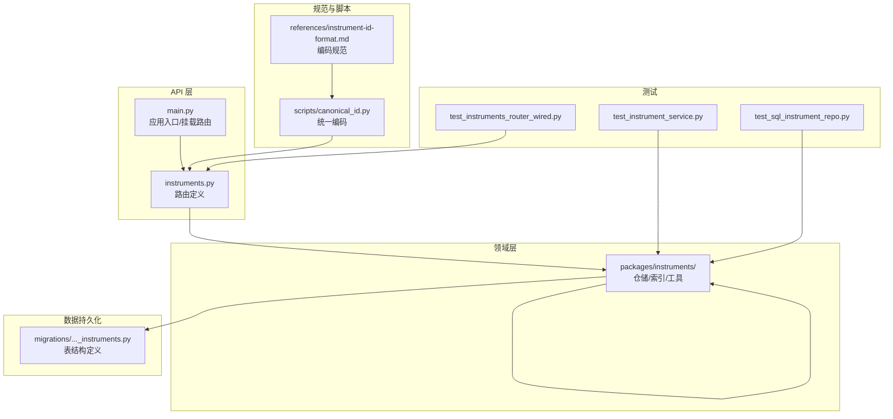
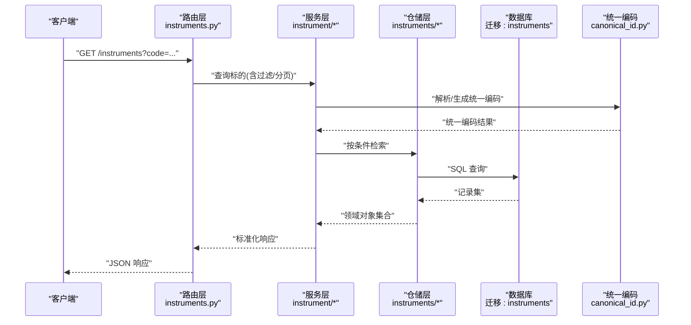
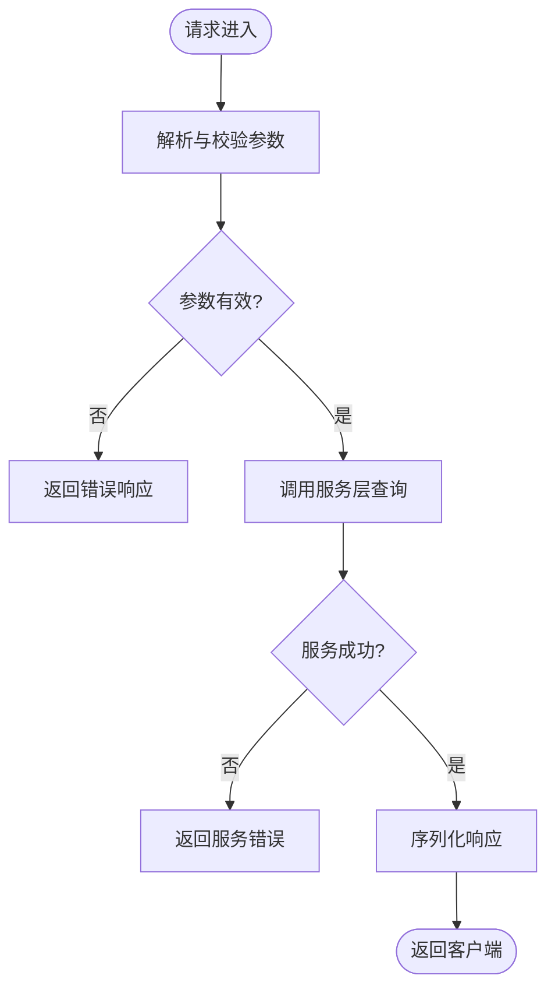
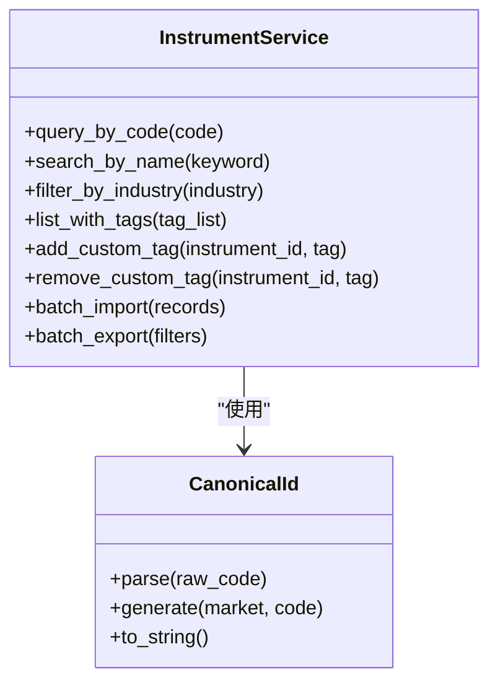
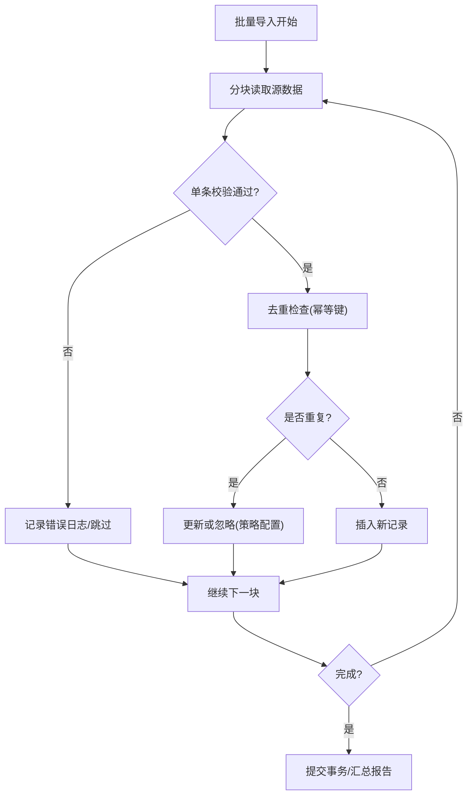
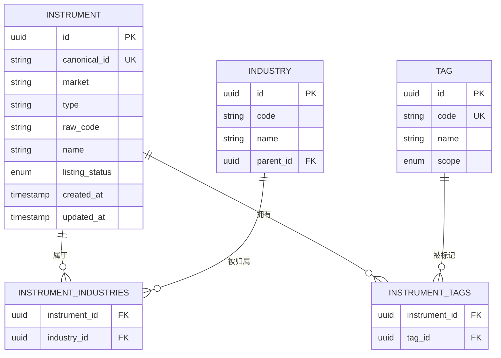
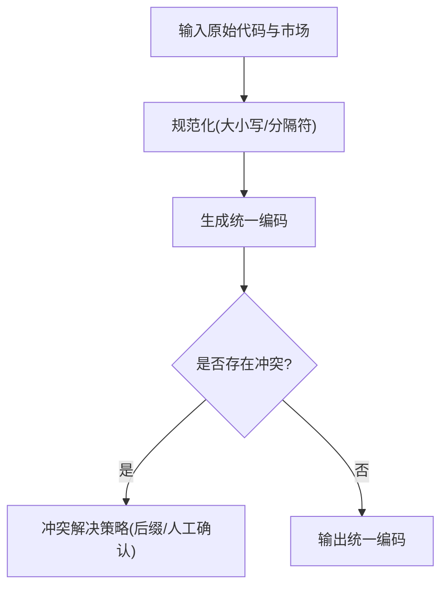
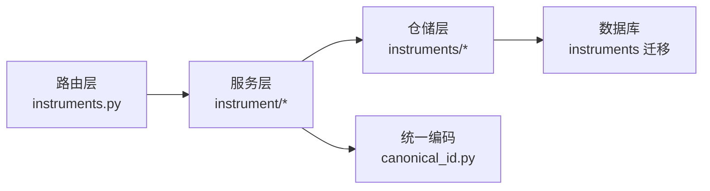

# 标的信息工具

<cite>
**本文引用的文件**   
- [apps/api/routers/instruments.py](file://apps/api/routers/instruments.py)
- [apps/api/main.py](file://apps/api/main.py)
- [packages/instrument/](file://packages/instrument/)
- [packages/instruments/](file://packages/instruments/)
- [sql/migrations/20260715_0001_instruments.py](file://sql/migrations/20260715_0001_instruments.py)
- [skills/cross-market-quant-research/skills/canonical_id.py](file://skills/cross-market-quant-research/scripts/canonical_id.py)
- [skills/cross-market-quant-research/references/instrument-id-format.md](file://skills/cross-market-quant-research/references/instrument-id-format.md)
- [tests/unit/test_instrument_service.py](file://tests/unit/test_instrument_service.py)
- [tests/unit/test_instruments_router_wired.py](file://tests/unit/test_instruments_router_wired.py)
- [tests/unit/test_sql_instrument_repo.py](file://tests/unit/test_sql_instrument_repo.py)
</cite>

## 目录
1. [简介](#简介)
2. [项目结构](#项目结构)
3. [核心组件](#核心组件)
4. [架构总览](#架构总览)
5. [详细组件分析](#详细组件分析)
6. [依赖关系分析](#依赖关系分析)
7. [性能考虑](#性能考虑)
8. [故障排查指南](#故障排查指南)
9. [结论](#结论)
10. [附录](#附录)

## 简介
本文件面向“投资标的信息查询工具”的数据应用与集成方，系统化说明股票、基金、债券等不同类型标的的基础信息、分类标签、上市状态等元数据的查询接口与能力。文档覆盖：
- 标的代码映射与统一编码规则（跨市场识别）
- 名称搜索、行业分类等检索功能
- 标的属性扩展与自定义标签管理
- 批量导入导出操作方法
- 数据模型与迁移、API 路由与服务层交互流程
- 常见问题与排障建议

目标读者包括数据工程师、量化研究员、后端开发者与系统集成人员。

## 项目结构
围绕“标的信息”的核心实现分布在以下位置：
- API 路由层：提供对外查询接口
- 服务与仓储层：封装业务逻辑与数据访问
- 数据库迁移：定义标的相关表结构与字段
- 技能脚本与参考规范：统一编码与跨市场识别规则
- 测试用例：验证路由装配、服务行为与仓储读写

图表来源
- [apps/api/routers/instruments.py](file://apps/api/routers/instruments.py)
- [apps/api/main.py](file://apps/api/main.py)
- [packages/instrument/](file://packages/instrument/)
- [packages/instruments/](file://packages/instruments/)
- [sql/migrations/20260715_0001_instruments.py](file://sql/migrations/20260715_0001_instruments.py)
- [skills/cross-market-quant-research/scripts/canonical_id.py](file://skills/cross-market-quant-research/scripts/canonical_id.py)
- [skills/cross-market-quant-research/references/instrument-id-format.md](file://skills/cross-market-quant-research/references/instrument-id-format.md)
- [tests/unit/test_instruments_router_wired.py](file://tests/unit/test_instruments_router_wired.py)
- [tests/unit/test_instrument_service.py](file://tests/unit/test_instrument_service.py)
- [tests/unit/test_sql_instrument_repo.py](file://tests/unit/test_sql_instrument_repo.py)

章节来源
- [apps/api/routers/instruments.py](file://apps/api/routers/instruments.py)
- [apps/api/main.py](file://apps/api/main.py)
- [sql/migrations/20260715_0001_instruments.py](file://sql/migrations/20260715_0001_instruments.py)
- [skills/cross-market-quant-research/scripts/canonical_id.py](file://skills/cross-market-quant-research/scripts/canonical_id.py)
- [skills/cross-market-quant-research/references/instrument-id-format.md](file://skills/cross-market-quant-research/references/instrument-id-format.md)
- [tests/unit/test_instruments_router_wired.py](file://tests/unit/test_instruments_router_wired.py)
- [tests/unit/test_instrument_service.py](file://tests/unit/test_instrument_service.py)
- [tests/unit/test_sql_instrument_repo.py](file://tests/unit/test_sql_instrument_repo.py)

## 核心组件
- 路由层（API）
  - 负责接收查询请求、参数校验、调用服务层并返回响应。
  - 典型能力：按代码/名称/行业/标签检索；获取标的详情；批量导入导出。
- 服务层（instrument）
  - 封装标的查询、过滤、聚合、标签管理等业务逻辑。
  - 提供统一的领域模型与转换方法。
- 仓储层（instruments）
  - 对接数据库或外部存储，执行增删改查与批量操作。
  - 维护索引与缓存策略（如适用）。
- 数据模型与迁移
  - 通过迁移脚本定义标的主表及关联表（基础信息、分类标签、上市状态等）。
- 统一编码与跨市场识别
  - 基于规范与脚本生成/解析跨市场统一标识，确保多市场标的可唯一识别与互操作。

章节来源
- [apps/api/routers/instruments.py](file://apps/api/routers/instruments.py)
- [packages/instrument/](file://packages/instrument/)
- [packages/instruments/](file://packages/instruments/)
- [sql/migrations/20260715_0001_instruments.py](file://sql/migrations/20260715_0001_instruments.py)
- [skills/cross-market-quant-research/scripts/canonical_id.py](file://skills/cross-market-quant-research/scripts/canonical_id.py)
- [skills/cross-market-quant-research/references/instrument-id-format.md](file://skills/cross-market-quant-research/references/instrument-id-format.md)

## 架构总览
下图展示从客户端到数据层的端到端调用链，以及跨市场统一编码在查询中的参与点。

图表来源
- [apps/api/routers/instruments.py](file://apps/api/routers/instruments.py)
- [packages/instrument/](file://packages/instrument/)
- [packages/instruments/](file://packages/instruments/)
- [sql/migrations/20260715_0001_instruments.py](file://sql/migrations/20260715_0001_instruments.py)
- [skills/cross-market-quant-research/scripts/canonical_id.py](file://skills/cross-market-quant-research/scripts/canonical_id.py)

## 详细组件分析

### 路由层：标的查询接口
- 职责
  - 暴露 REST 风格接口，支持按标的代码、名称、行业、标签、上市状态等维度检索。
  - 支持批量导入/导出（例如 CSV/JSON），便于数据治理与离线处理。
- 关键流程
  - 参数校验与规范化（大小写、空格、编码格式）
  - 调用服务层进行过滤与聚合
  - 将领域对象序列化为标准响应体
- 错误处理
  - 对非法参数、未找到标的、权限不足等情况返回明确状态码与消息

图表来源
- [apps/api/routers/instruments.py](file://apps/api/routers/instruments.py)
- [apps/api/main.py](file://apps/api/main.py)

章节来源
- [apps/api/routers/instruments.py](file://apps/api/routers/instruments.py)
- [apps/api/main.py](file://apps/api/main.py)
- [tests/unit/test_instruments_router_wired.py](file://tests/unit/test_instruments_router_wired.py)

### 服务层：标的查询与标签管理
- 职责
  - 实现标的检索、过滤、分页、排序、聚合等核心业务逻辑。
  - 管理标的属性扩展与自定义标签的增删改查。
  - 协调统一编码的生成与解析，支撑跨市场识别。
- 关键能力
  - 名称模糊匹配与拼音/别名支持（若已实现）
  - 行业分类筛选与层级展开
  - 标签体系：预置标签 + 自定义标签
  - 批量导入/导出：校验、去重、幂等写入
- 异常与边界
  - 重复导入处理、脏数据清洗、事务回滚策略

图表来源
- [packages/instrument/](file://packages/instrument/)
- [skills/cross-market-quant-research/scripts/canonical_id.py](file://skills/cross-market-quant-research/scripts/canonical_id.py)

章节来源
- [packages/instrument/](file://packages/instrument/)
- [tests/unit/test_instrument_service.py](file://tests/unit/test_instrument_service.py)
- [skills/cross-market-quant-research/scripts/canonical_id.py](file://skills/cross-market-quant-research/scripts/canonical_id.py)

### 仓储层：数据访问与批量操作
- 职责
  - 封装 SQL/ORM 查询，提供高性能检索与批量写入。
  - 维护索引与约束，保障数据一致性与完整性。
- 关键能力
  - 条件组合查询（代码、名称、行业、标签、上市状态、时间范围）
  - 分页与排序
  - 批量导入/导出（流式读取/写入，避免内存溢出）
- 一致性
  - 事务边界控制、失败重试与幂等键设计

图表来源
- [packages/instruments/](file://packages/instruments/)
- [sql/migrations/20260715_0001_instruments.py](file://sql/migrations/20260715_0001_instruments.py)

章节来源
- [packages/instruments/](file://packages/instruments/)
- [tests/unit/test_sql_instrument_repo.py](file://tests/unit/test_sql_instrument_repo.py)
- [sql/migrations/20260715_0001_instruments.py](file://sql/migrations/20260715_0001_instruments.py)

### 数据模型与迁移：标的主表与关联
- 标的主表
  - 包含统一编码、原始代码、市场、类型（股票/基金/债券）、名称、上市状态、创建/更新时间等。
- 分类与标签
  - 行业分类表（可能为树形结构）
  - 标签表（预置标签与自定义标签）
  - 标的-标签关联表（多对多）
- 约束与索引
  - 唯一性约束（统一编码、原始代码+市场）
  - 常用查询字段建立索引（名称、行业、标签、上市状态）

图表来源
- [sql/migrations/20260715_0001_instruments.py](file://sql/migrations/20260715_0001_instruments.py)

章节来源
- [sql/migrations/20260715_0001_instruments.py](file://sql/migrations/20260715_0001_instruments.py)

### 统一编码与跨市场识别
- 目标
  - 为不同市场的同一标的提供稳定、可解析的统一编码，支撑跨市场检索与关联。
- 规则要点
  - 编码组成：市场前缀 + 主体代码 + 可选后缀（用于区分份额/类别）
  - 大小写与分隔符规范化
  - 冲突检测与回退策略
- 使用方式
  - 在服务层解析输入代码并转换为统一编码
  - 在仓储层以统一编码作为主键或唯一索引进行查询

图表来源
- [skills/cross-market-quant-research/scripts/canonical_id.py](file://skills/cross-market-quant-research/scripts/canonical_id.py)
- [skills/cross-market-quant-research/references/instrument-id-format.md](file://skills/cross-market-quant-research/references/instrument-id-format.md)

章节来源
- [skills/cross-market-quant-research/scripts/canonical_id.py](file://skills/cross-market-quant-research/scripts/canonical_id.py)
- [skills/cross-market-quant-research/references/instrument-id-format.md](file://skills/cross-market-quant-research/references/instrument-id-format.md)

## 依赖关系分析
- 路由层依赖服务层，服务层依赖仓储层与统一编码模块。
- 仓储层依赖数据库迁移定义的表结构。
- 测试覆盖路由装配、服务行为与仓储读写路径。

图表来源
- [apps/api/routers/instruments.py](file://apps/api/routers/instruments.py)
- [packages/instrument/](file://packages/instrument/)
- [packages/instruments/](file://packages/instruments/)
- [sql/migrations/20260715_0001_instruments.py](file://sql/migrations/20260715_0001_instruments.py)
- [skills/cross-market-quant-research/scripts/canonical_id.py](file://skills/cross-market-quant-research/scripts/canonical_id.py)

章节来源
- [apps/api/routers/instruments.py](file://apps/api/routers/instruments.py)
- [packages/instrument/](file://packages/instrument/)
- [packages/instruments/](file://packages/instruments/)
- [sql/migrations/20260715_0001_instruments.py](file://sql/migrations/20260715_0001_instruments.py)
- [skills/cross-market-quant-research/scripts/canonical_id.py](file://skills/cross-market-quant-research/scripts/canonical_id.py)

## 性能考虑
- 查询优化
  - 针对高频过滤字段（名称、行业、标签、上市状态）建立合适索引
  - 分页与游标分页结合，避免深分页
- 批量导入
  - 分块写入与事务边界控制
  - 去重与幂等键减少重复写入
- 缓存策略
  - 热点标的与字典类数据（行业、标签）可引入缓存层
- 资源限制
  - 设置最大请求体大小与超时阈值，防止慢查询拖垮服务

[本节为通用指导，不直接分析具体文件]

## 故障排查指南
- 路由层问题
  - 检查路由是否正确挂载至应用入口
  - 核对请求参数命名与校验规则
- 服务层问题
  - 统一编码解析失败：核对输入的市场与原始代码是否符合规范
  - 标签不存在：确认标签库初始化与同步任务
- 仓储层问题
  - 连接池耗尽：检查并发与事务时长
  - 死锁与长事务：定位热点更新路径
- 数据一致性问题
  - 对比迁移版本与运行环境
  - 校验唯一约束与索引是否生效

章节来源
- [apps/api/main.py](file://apps/api/main.py)
- [apps/api/routers/instruments.py](file://apps/api/routers/instruments.py)
- [packages/instrument/](file://packages/instrument/)
- [packages/instruments/](file://packages/instruments/)
- [sql/migrations/20260715_0001_instruments.py](file://sql/migrations/20260715_0001_instruments.py)

## 结论
本工具围绕“标的信息”构建了从 API 到数据层的完整链路，支持多类型标的的元数据查询、标签管理与跨市场统一编码。通过清晰的层次划分与完善的迁移与测试，可为上层数据应用提供稳定、可扩展的标的管理能力。建议在上线前完善索引与缓存策略，并对批量导入流程进行压测与监控。

[本节为总结性内容，不直接分析具体文件]

## 附录
- 术语
  - 标的：股票、基金、债券等金融资产的统称
  - 统一编码：跨市场唯一标识，用于消除市场差异带来的歧义
  - 标签：用于描述标的属性的分类键值
- 最佳实践
  - 所有外部输入先规范化再进入服务层
  - 批量导入采用幂等键与分块事务
  - 对敏感字段与审计事件进行留痕

[本节为补充说明，不直接分析具体文件]