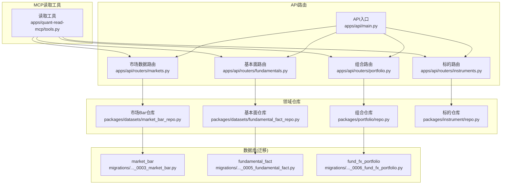
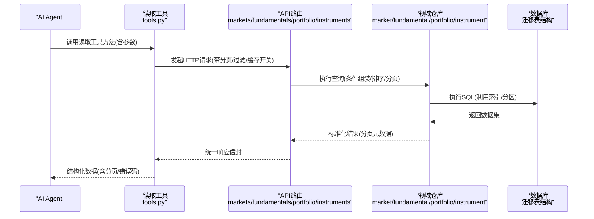
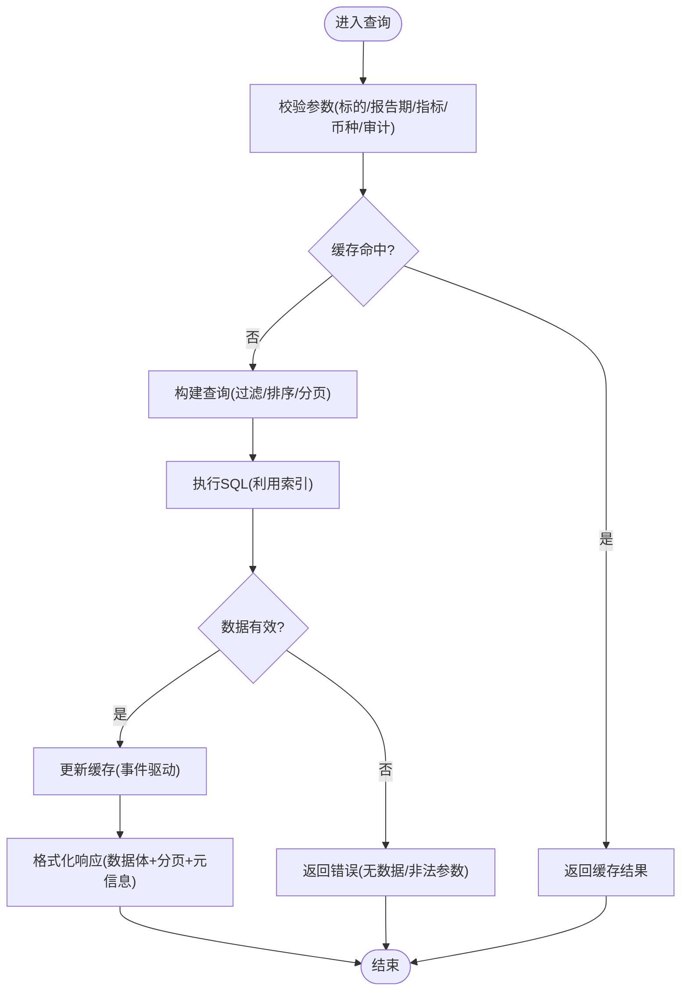
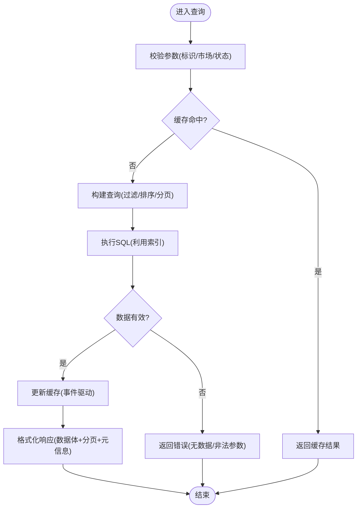
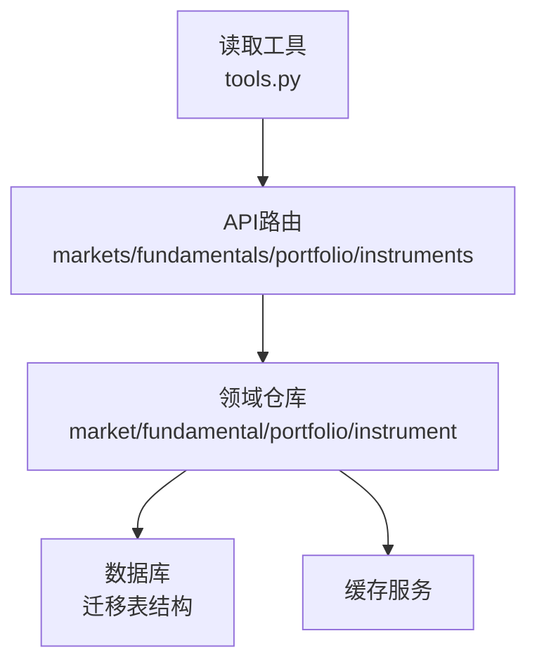

# 读取工具

<cite>
**本文引用的文件**   
- [apps/quant-read-mcp/tools.py](file://apps/quant-read-mcp/tools.py)
- [apps/api/routers/markets.py](file://apps/api/routers/markets.py)
- [apps/api/routers/fundamentals.py](file://apps/api/routers/fundamentals.py)
- [apps/api/routers/portfolio.py](file://apps/api/routers/portfolio.py)
- [apps/api/routers/instruments.py](file://apps/api/routers/instruments.py)
- [apps/api/main.py](file://apps/api/main.py)
- [packages/datasets/market_bar_repo.py](file://packages/datasets/market_bar_repo.py)
- [packages/datasets/fundamental_fact_repo.py](file://packages/datasets/fundamental_fact_repo.py)
- [packages/portfolio/repo.py](file://packages/portfolio/repo.py)
- [packages/instrument/repo.py](file://packages/instrument/repo.py)
- [sql/migrations/20260715_0003_market_bar.py](file://sql/migrations/20260715_0003_market_bar.py)
- [sql/migrations/20260715_0005_fundamental_fact.py](file://sql/migrations/20260715_0005_fundamental_fact.py)
- [sql/migrations/20260715_0006_fund_fx_portfolio.py](file://sql/migrations/20260715_0006_fund_fx_portfolio.py)
</cite>

## 目录
1. [简介](#简介)
2. [项目结构](#项目结构)
3. [核心组件](#核心组件)
4. [架构总览](#架构总览)
5. [详细组件分析](#详细组件分析)
6. [依赖关系分析](#依赖关系分析)
7. [性能考虑](#性能考虑)
8. [故障排查指南](#故障排查指南)
9. [结论](#结论)
10. [附录](#附录)

## 简介
本文件面向AI Agent与数据应用，提供“量化读取MCP工具”的完整使用指南。内容覆盖：
- 市场数据查询（K线/Bar）
- 基本面数据获取（财务指标、公告等）
- 投资组合信息查询（持仓、净值、交易流水等）
- 标的信息检索（代码映射、上市状态等）

文档明确各工具的函数接口、查询参数、返回结果格式、过滤条件、分页机制、性能优化选项，并说明缓存策略、实时性保证、错误处理与数据一致性保障。

## 项目结构
读取能力由“MCP读取工具层”暴露给上层Agent调用，内部通过API路由转发至领域服务与数据仓库，最终访问数据库表。关键路径如下：
- MCP读取工具：定义对外可调用的工具方法与参数契约
- API路由：将工具调用转为HTTP请求，统一响应信封
- 领域仓库：封装SQL查询、分页、过滤与聚合逻辑
- 数据库迁移：定义市场Bar、基本面事实、组合相关表结构

图表来源
- [apps/quant-read-mcp/tools.py](file://apps/quant-read-mcp/tools.py)
- [apps/api/routers/markets.py](file://apps/api/routers/markets.py)
- [apps/api/routers/fundamentals.py](file://apps/api/routers/fundamentals.py)
- [apps/api/routers/portfolio.py](file://apps/api/routers/portfolio.py)
- [apps/api/routers/instruments.py](file://apps/api/routers/instruments.py)
- [apps/api/main.py](file://apps/api/main.py)
- [packages/datasets/market_bar_repo.py](file://packages/datasets/market_bar_repo.py)
- [packages/datasets/fundamental_fact_repo.py](file://packages/datasets/fundamental_fact_repo.py)
- [packages/portfolio/repo.py](file://packages/portfolio/repo.py)
- [packages/instrument/repo.py](file://packages/instrument/repo.py)
- [sql/migrations/20260715_0003_market_bar.py](file://sql/migrations/20260715_0003_market_bar.py)
- [sql/migrations/20260715_0005_fundamental_fact.py](file://sql/migrations/20260715_0005_fundamental_fact.py)
- [sql/migrations/20260715_0006_fund_fx_portfolio.py](file://sql/migrations/20260715_0006_fund_fx_portfolio.py)

章节来源
- [apps/quant-read-mcp/tools.py](file://apps/quant-read-mcp/tools.py)
- [apps/api/main.py](file://apps/api/main.py)

## 核心组件
- 读取工具（MCP）：提供统一的工具方法集合，用于查询市场数据、基本面数据、组合信息与标的信息。每个工具方法包含明确的参数校验、分页控制与可选的性能开关（如是否启用缓存）。
- API路由：将工具方法转换为HTTP端点，负责鉴权、限流、日志与统一响应信封包装。
- 领域仓库：实现具体查询逻辑，包括多条件过滤、时间窗口、排序与分页；对底层数据库进行高效访问。
- 数据库迁移：定义核心表结构与索引，确保查询性能与数据一致性。

章节来源
- [apps/quant-read-mcp/tools.py](file://apps/quant-read-mcp/tools.py)
- [apps/api/routers/markets.py](file://apps/api/routers/markets.py)
- [apps/api/routers/fundamentals.py](file://apps/api/routers/fundamentals.py)
- [apps/api/routers/portfolio.py](file://apps/api/routers/portfolio.py)
- [apps/api/routers/instruments.py](file://apps/api/routers/instruments.py)
- [packages/datasets/market_bar_repo.py](file://packages/datasets/market_bar_repo.py)
- [packages/datasets/fundamental_fact_repo.py](file://packages/datasets/fundamental_fact_repo.py)
- [packages/portfolio/repo.py](file://packages/portfolio/repo.py)
- [packages/instrument/repo.py](file://packages/instrument/repo.py)

## 架构总览
下图展示从MCP读取工具到数据库的端到端调用链，以及关键的数据流向与职责边界。

图表来源
- [apps/quant-read-mcp/tools.py](file://apps/quant-read-mcp/tools.py)
- [apps/api/routers/markets.py](file://apps/api/routers/markets.py)
- [apps/api/routers/fundamentals.py](file://apps/api/routers/fundamentals.py)
- [apps/api/routers/portfolio.py](file://apps/api/routers/portfolio.py)
- [apps/api/routers/instruments.py](file://apps/api/routers/instruments.py)
- [packages/datasets/market_bar_repo.py](file://packages/datasets/market_bar_repo.py)
- [packages/datasets/fundamental_fact_repo.py](file://packages/datasets/fundamental_fact_repo.py)
- [packages/portfolio/repo.py](file://packages/portfolio/repo.py)
- [packages/instrument/repo.py](file://packages/instrument/repo.py)
- [sql/migrations/20260715_0003_market_bar.py](file://sql/migrations/20260715_0003_market_bar.py)
- [sql/migrations/20260715_0005_fundamental_fact.py](file://sql/migrations/20260715_0005_fundamental_fact.py)
- [sql/migrations/20260715_0006_fund_fx_portfolio.py](file://sql/migrations/20260715_0006_fund_fx_portfolio.py)

## 详细组件分析

### 市场数据查询（K线/Bar）
- 功能范围
  - 按标的、时间区间、频率、复权方式、交易所等条件查询Bar序列
  - 支持分页、排序、字段裁剪与统计摘要
- 关键参数
  - 标的标识：支持多标的列表、通配符或行业/指数筛选
  - 时间窗口：起止时间、时区、交易日过滤
  - 频率：分钟/日/周/月等
  - 复权：前复权/后复权/不复权
  - 分页：页码、每页条数、游标式翻页
  - 性能开关：是否启用缓存、是否仅返回增量
- 返回格式
  - 数据体：Bar记录数组（时间戳、开高低收、成交量、成交额等）
  - 分页元数据：总条数、当前页、下一页游标
  - 元信息：数据来源、更新时间、延迟标记
- 过滤与排序
  - 过滤：停牌、涨跌停、异常值剔除
  - 排序：时间升序/降序、按成交量加权
- 示例与响应
  - 典型请求：指定标的+时间区间+频率+分页
  - 典型响应：数据体+分页元数据+元信息
- 缓存与实时性
  - 缓存键：基于标的、时间窗口、频率、复权、字段集
  - 失效策略：TTL过期、写入事件触发失效
  - 实时性：标注数据延迟、是否准实时

图表来源
- [apps/api/routers/markets.py](file://apps/api/routers/markets.py)
- [packages/datasets/market_bar_repo.py](file://packages/datasets/market_bar_repo.py)
- [sql/migrations/20260715_0003_market_bar.py](file://sql/migrations/20260715_0003_market_bar.py)

章节来源
- [apps/api/routers/markets.py](file://apps/api/routers/markets.py)
- [packages/datasets/market_bar_repo.py](file://packages/datasets/market_bar_repo.py)
- [sql/migrations/20260715_0003_market_bar.py](file://sql/migrations/20260715_0003_market_bar.py)

### 基本面数据获取（财务指标/公告）
- 功能范围
  - 按标的、报告期、指标类型、币种、审计状态等条件查询基本面事实
  - 支持多期对比、同比环比计算、缺失值填充策略
- 关键参数
  - 标的标识：单标的或多标的
  - 报告期：季度/年度、起止日期、财报发布日
  - 指标：收入、利润、资产负债、现金流等
  - 币种：本地币/USD/CNY等
  - 审计：已审计/未审计/修订版
  - 分页：页码、每页条数、游标
- 返回格式
  - 数据体：Fact记录数组（指标名、数值、单位、币种、发布日期）
  - 分页元数据：总条数、当前页、下一页游标
  - 元信息：数据版本、来源、更新时间
- 过滤与排序
  - 过滤：指标有效性、审计状态、币种转换
  - 排序：发布日期、指标优先级
- 示例与响应
  - 典型请求：标的+报告期+指标列表+分页
  - 典型响应：数据体+分页元数据+元信息
- 缓存与实时性
  - 缓存键：标的+报告期+指标集+币种+审计状态
  - 失效策略：财报发布事件触发失效
  - 实时性：标注数据延迟、是否待审计

图表来源
- [apps/api/routers/fundamentals.py](file://apps/api/routers/fundamentals.py)
- [packages/datasets/fundamental_fact_repo.py](file://packages/datasets/fundamental_fact_repo.py)
- [sql/migrations/20260715_0005_fundamental_fact.py](file://sql/migrations/20260715_0005_fundamental_fact.py)

章节来源
- [apps/api/routers/fundamentals.py](file://apps/api/routers/fundamentals.py)
- [packages/datasets/fundamental_fact_repo.py](file://packages/datasets/fundamental_fact_repo.py)
- [sql/migrations/20260715_0005_fundamental_fact.py](file://sql/migrations/20260715_0005_fundamental_fact.py)

### 投资组合信息查询（持仓/净值/交易流水）
- 功能范围
  - 查询组合基本信息、持仓明细、净值曲线、交易流水、风险指标快照
- 关键参数
  - 组合ID：唯一标识
  - 时间窗口：起止时间、时区
  - 粒度：日/周/月
  - 字段：持仓市值、权重、现金、杠杆、回撤等
  - 分页：页码、每页条数、游标
- 返回格式
  - 数据体：组合记录数组（时间戳、指标值、权重、备注）
  - 分页元数据：总条数、当前页、下一页游标
  - 元信息：组合版本、数据来源、更新时间
- 过滤与排序
  - 过滤：资产类别、区域、策略标签
  - 排序：时间、指标优先级
- 示例与响应
  - 典型请求：组合ID+时间窗口+粒度+分页
  - 典型响应：数据体+分页元数据+元信息
- 缓存与实时性
  - 缓存键：组合ID+时间窗口+粒度+字段集
  - 失效策略：交易/估值事件触发失效
  - 实时性：标注数据延迟、是否盘中快照

图表来源
- [apps/api/routers/portfolio.py](file://apps/api/routers/portfolio.py)
- [packages/portfolio/repo.py](file://packages/portfolio/repo.py)
- [sql/migrations/20260715_0006_fund_fx_portfolio.py](file://sql/migrations/20260715_0006_fund_fx_portfolio.py)

章节来源
- [apps/api/routers/portfolio.py](file://apps/api/routers/portfolio.py)
- [packages/portfolio/repo.py](file://packages/portfolio/repo.py)
- [sql/migrations/20260715_0006_fund_fx_portfolio.py](file://sql/migrations/20260715_0006_fund_fx_portfolio.py)

### 标的信息检索（代码映射/上市状态）
- 功能范围
  - 查询标的基础信息、代码映射、上市/退市状态、交易所规则
- 关键参数
  - 标识：证券代码、ISIN、CUSIP、内部ID
  - 市场：A股/美股/基金等
  - 状态：上市/停牌/退市
  - 分页：页码、每页条数、游标
- 返回格式
  - 数据体：Instrument记录数组（名称、代码、市场、状态、更新时间）
  - 分页元数据：总条数、当前页、下一页游标
  - 元信息：数据来源、更新时间
- 过滤与排序
  - 过滤：市场、板块、行业分类
  - 排序：代码、更新时间
- 示例与响应
  - 典型请求：标识+市场+状态+分页
  - 典型响应：数据体+分页元数据+元信息
- 缓存与实时性
  - 缓存键：标识+市场+状态
  - 失效策略：上市/退市事件触发失效
  - 实时性：标注数据延迟

图表来源
- [apps/api/routers/instruments.py](file://apps/api/routers/instruments.py)
- [packages/instrument/repo.py](file://packages/instrument/repo.py)

章节来源
- [apps/api/routers/instruments.py](file://apps/api/routers/instruments.py)
- [packages/instrument/repo.py](file://packages/instrument/repo.py)

## 依赖关系分析
- 耦合与内聚
  - MCP读取工具与API路由松耦合，通过HTTP契约交互
  - 路由与仓库高内聚，仓库专注数据访问与分页
- 外部依赖
  - 数据库：通过迁移定义表结构与索引
  - 缓存：基于键空间的事件驱动失效
- 潜在循环依赖
  - 路由不直接依赖仓库，避免循环
  - 仓库只依赖数据库与缓存，保持单向依赖

图表来源
- [apps/quant-read-mcp/tools.py](file://apps/quant-read-mcp/tools.py)
- [apps/api/routers/markets.py](file://apps/api/routers/markets.py)
- [apps/api/routers/fundamentals.py](file://apps/api/routers/fundamentals.py)
- [apps/api/routers/portfolio.py](file://apps/api/routers/portfolio.py)
- [apps/api/routers/instruments.py](file://apps/api/routers/instruments.py)
- [packages/datasets/market_bar_repo.py](file://packages/datasets/market_bar_repo.py)
- [packages/datasets/fundamental_fact_repo.py](file://packages/datasets/fundamental_fact_repo.py)
- [packages/portfolio/repo.py](file://packages/portfolio/repo.py)
- [packages/instrument/repo.py](file://packages/instrument/repo.py)

章节来源
- [apps/quant-read-mcp/tools.py](file://apps/quant-read-mcp/tools.py)
- [apps/api/routers/markets.py](file://apps/api/routers/markets.py)
- [apps/api/routers/fundamentals.py](file://apps/api/routers/fundamentals.py)
- [apps/api/routers/portfolio.py](file://apps/api/routers/portfolio.py)
- [apps/api/routers/instruments.py](file://apps/api/routers/instruments.py)
- [packages/datasets/market_bar_repo.py](file://packages/datasets/market_bar_repo.py)
- [packages/datasets/fundamental_fact_repo.py](file://packages/datasets/fundamental_fact_repo.py)
- [packages/portfolio/repo.py](file://packages/portfolio/repo.py)
- [packages/instrument/repo.py](file://packages/instrument/repo.py)

## 性能考虑
- 索引与分区
  - 时间戳、标的ID、报告期等字段建立复合索引
  - 大表按时间分区，减少扫描范围
- 分页与游标
  - 优先使用游标式翻页，避免深分页
  - 限制最大每页条数，防止内存溢出
- 字段裁剪
  - 按需返回字段，减少网络传输
- 缓存策略
  - 热点查询缓存，设置合理TTL
  - 事件驱动失效，保证一致性
- 并发与限流
  - 路由层限流，保护后端
  - 连接池复用，降低开销

[本节为通用指导，无需特定文件引用]

## 故障排查指南
- 常见错误
  - 参数校验失败：检查标的标识、时间区间、频率、分页参数
  - 无数据返回：确认标的存在、时间窗口有效、状态过滤正确
  - 超时：增大分页大小或缩小时间窗口，检查索引
- 诊断步骤
  - 查看路由日志与错误码
  - 检查仓库SQL执行计划与慢查询
  - 验证缓存键与失效事件
- 一致性保障
  - 事务边界：写入与读取一致
  - 版本号：数据变更携带版本，客户端可检测不一致
  - 幂等：重复请求不产生副作用

章节来源
- [apps/api/routers/markets.py](file://apps/api/routers/markets.py)
- [apps/api/routers/fundamentals.py](file://apps/api/routers/fundamentals.py)
- [apps/api/routers/portfolio.py](file://apps/api/routers/portfolio.py)
- [apps/api/routers/instruments.py](file://apps/api/routers/instruments.py)

## 结论
读取工具为AI Agent与数据应用提供了统一、稳定、高性能的数据访问面。通过清晰的接口契约、完善的分页与过滤、合理的缓存与实时性策略，以及健壮的错误处理与一致性保障，能够满足跨市场、跨数据类型的大规模查询需求。建议在生产环境结合监控与告警，持续优化索引与缓存策略，确保SLA达成。

[本节为总结，无需特定文件引用]

## 附录
- 术语
  - Bar：K线记录，包含时间、开高低收、成交量、成交额等
  - Fact：基本面事实，包含指标名、数值、单位、币种、发布日期等
  - Instrument：标的信息，包含名称、代码、市场、状态等
- 最佳实践
  - 小步快跑：先拉取少量数据进行探索，再逐步扩大范围
  - 字段裁剪：仅请求必要字段，提升吞吐
  - 游标翻页：避免深分页，提高稳定性
  - 缓存预热：对热点标的/指标预加载缓存

[本节为概念性内容，无需特定文件引用]