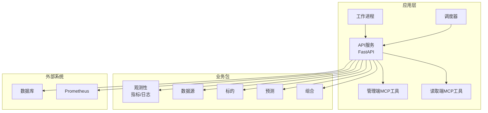
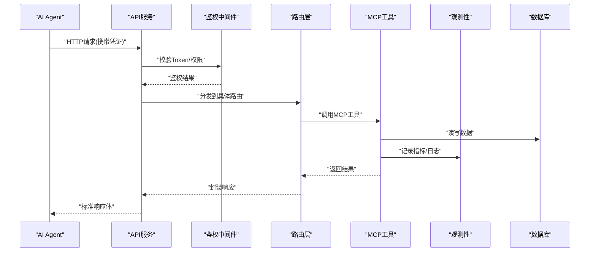
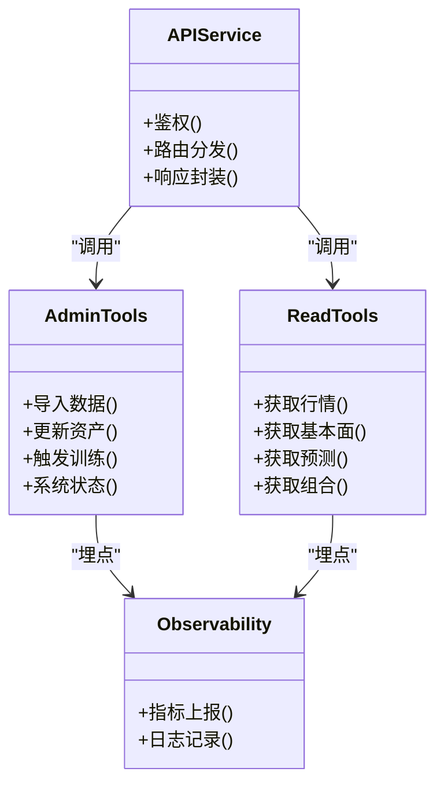
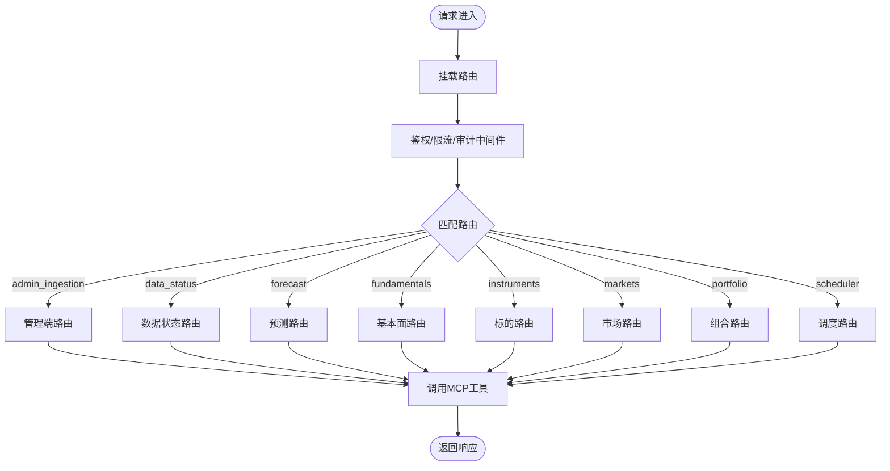
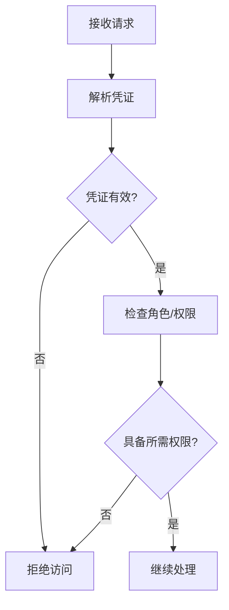
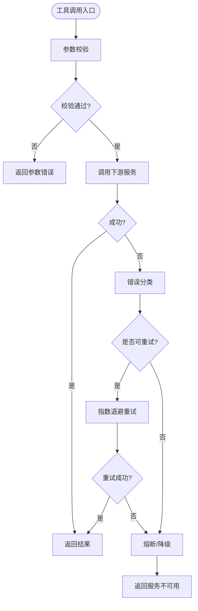
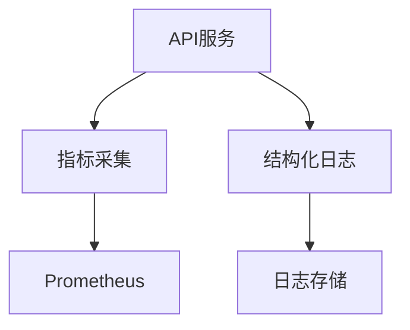
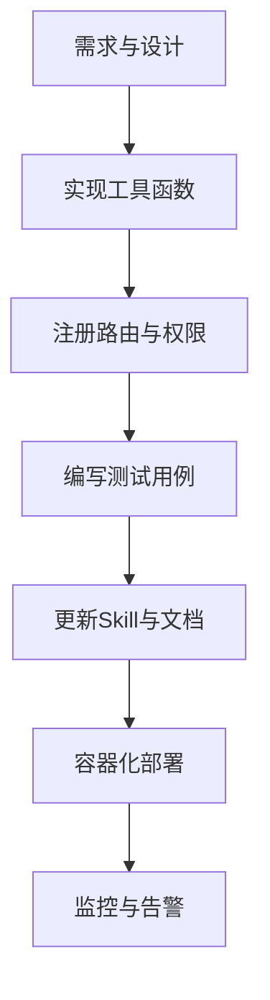
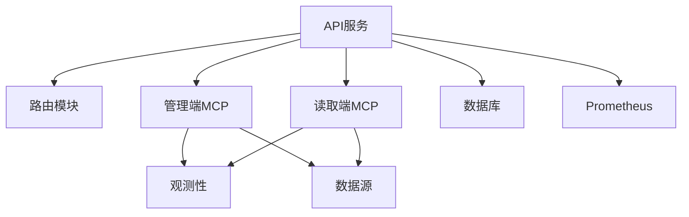

# 集成指南

<cite>
**本文引用的文件**   
- [apps/quant-admin-mcp/tools.py](file://apps/quant-admin-mcp/tools.py)
- [apps/quant-read-mcp/tools.py](file://apps/quant-read-mcp/tools.py)
- [apps/api/main.py](file://apps/api/main.py)
- [apps/api/deps.py](file://apps/api/deps.py)
- [apps/api/routers/__init__.py](file://apps/api/routers/__init__.py)
- [apps/api/routers/admin_ingestion.py](file://apps/api/routers/admin_ingestion.py)
- [apps/api/routers/data_status.py](file://apps/api/routers/data_status.py)
- [apps/api/routers/forecast.py](file://apps/api/routers/forecast.py)
- [apps/api/routers/fundamentals.py](file://apps/api/routers/fundamentals.py)
- [apps/api/routers/instruments.py](file://apps/api/routers/instruments.py)
- [apps/api/routers/markets.py](file://apps/api/routers/markets.py)
- [apps/api/routers/portfolio.py](file://apps/api/routers/portfolio.py)
- [apps/api/routers/scheduler.py](file://apps/api/routers/scheduler.py)
- [packages/observability/metrics.py](file://packages/observability/metrics.py)
- [packages/observability/logging_config.py](file://packages/observability/logging_config.py)
- [deploy/docker-compose.yml](file://deploy/docker-compose.yml)
- [deploy/prometheus.yml](file://deploy/prometheus.yml)
- [readme/A股美股基金量化Agent_Skill+MCP模块实施规格_V4.md](file://readme/A股美股基金量化Agent_Skill+MCP模块实施规格_V4.md)
- [skills/cross-market-quant-research/SKILL.md](file://skills/cross-market-quant-research/SKILL.md)
- [tests/unit/test_mcp_surface.py](file://tests/unit/test_mcp_surface.py)
</cite>

## 目录
1. [简介](#简介)
2. [项目结构](#项目结构)
3. [核心组件](#核心组件)
4. [架构总览](#架构总览)
5. [详细组件分析](#详细组件分析)
6. [依赖分析](#依赖分析)
7. [性能考虑](#性能考虑)
8. [故障排查指南](#故障排查指南)
9. [结论](#结论)
10. [附录](#附录)

## 简介
本指南面向AI Agent与MCP（Model Context Protocol）工具集成的开发者，提供从入门到高级的完整路径。内容涵盖：
- AI Agent如何发现、注册和调用MCP工具
- 不同AI框架的集成示例与配置方法
- 工具认证、授权与安全访问控制机制
- 工具调用的错误处理与重试策略
- 性能监控与日志记录实施方案
- 工具扩展与自定义开发流程
- 实际项目中的集成案例与最佳实践

## 项目结构
本项目采用分层与模块化组织方式：
- apps：应用层服务，包含API服务、调度器、工作进程以及MCP工具实现
- packages：可复用业务包，如数据源、特征、风控、观测性等
- deploy：部署编排与监控配置
- skills：Skill规范与脚本，用于约束Agent行为与输出格式
- tests：单元测试与集成测试
- readme：规格文档与说明

图表来源
- [apps/api/main.py:1-200](file://apps/api/main.py#L1-L200)
- [apps/quant-admin-mcp/tools.py:1-200](file://apps/quant-admin-mcp/tools.py#L1-L200)
- [apps/quant-read-mcp/tools.py:1-200](file://apps/quant-read-mcp/tools.py#L1-L200)
- [packages/observability/metrics.py:1-200](file://packages/observability/metrics.py#L1-L200)
- [deploy/docker-compose.yml:1-200](file://deploy/docker-compose.yml#L1-L200)

章节来源
- [apps/api/main.py:1-200](file://apps/api/main.py#L1-L200)
- [apps/quant-admin-mcp/tools.py:1-200](file://apps/quant-admin-mcp/tools.py#L1-L200)
- [apps/quant-read-mcp/tools.py:1-200](file://apps/quant-read-mcp/tools.py#L1-L200)
- [deploy/docker-compose.yml:1-200](file://deploy/docker-compose.yml#L1-L200)

## 核心组件
- MCP工具实现
  - 管理端工具：提供数据导入、状态查询、模型管理等能力
  - 读取端工具：提供行情、基本面、预测等只读能力
- API网关
  - 基于FastAPI暴露REST接口，作为Agent与MCP工具的桥接层
  - 统一鉴权、限流、审计与可观测性接入点
- 观测性
  - 指标采集（Prometheus）、结构化日志、链路追踪
- 调度与工作进程
  - 定时任务与异步任务执行，解耦耗时操作

章节来源
- [apps/quant-admin-mcp/tools.py:1-200](file://apps/quant-admin-mcp/tools.py#L1-L200)
- [apps/quant-read-mcp/tools.py:1-200](file://apps/quant-read-mcp/tools.py#L1-L200)
- [apps/api/main.py:1-200](file://apps/api/main.py#L1-L200)
- [packages/observability/metrics.py:1-200](file://packages/observability/metrics.py#L1-L200)

## 架构总览
下图展示Agent通过API调用MCP工具的整体流程，包括鉴权、路由、工具执行、可观测性与持久化。

图表来源
- [apps/api/main.py:1-200](file://apps/api/main.py#L1-L200)
- [apps/api/deps.py:1-200](file://apps/api/deps.py#L1-L200)
- [apps/api/routers/__init__.py:1-200](file://apps/api/routers/__init__.py#L1-L200)
- [apps/quant-admin-mcp/tools.py:1-200](file://apps/quant-admin-mcp/tools.py#L1-L200)
- [packages/observability/metrics.py:1-200](file://packages/observability/metrics.py#L1-L200)

## 详细组件分析

### MCP工具实现与管理端/读取端分离
- 管理端工具
  - 职责：数据导入、资产维护、模型训练触发、系统状态管理
  - 安全：需管理员角色或更高权限
- 读取端工具
  - 职责：查询行情、基本面、预测结果、组合信息
  - 安全：普通用户即可访问，但需具备相应资源权限

图表来源
- [apps/quant-admin-mcp/tools.py:1-200](file://apps/quant-admin-mcp/tools.py#L1-L200)
- [apps/quant-read-mcp/tools.py:1-200](file://apps/quant-read-mcp/tools.py#L1-L200)
- [apps/api/main.py:1-200](file://apps/api/main.py#L1-L200)
- [packages/observability/metrics.py:1-200](file://packages/observability/metrics.py#L1-L200)

章节来源
- [apps/quant-admin-mcp/tools.py:1-200](file://apps/quant-admin-mcp/tools.py#L1-L200)
- [apps/quant-read-mcp/tools.py:1-200](file://apps/quant-read-mcp/tools.py#L1-L200)

### API网关与路由
- 入口与挂载
  - FastAPI应用初始化、中间件注册、路由挂载
- 路由组织
  - 按功能域划分路由模块，便于权限与版本管理
- 依赖注入
  - 统一的数据库连接、缓存、配置、鉴权上下文注入

图表来源
- [apps/api/main.py:1-200](file://apps/api/main.py#L1-L200)
- [apps/api/routers/__init__.py:1-200](file://apps/api/routers/__init__.py#L1-L200)
- [apps/api/routers/admin_ingestion.py:1-200](file://apps/api/routers/admin_ingestion.py#L1-L200)
- [apps/api/routers/data_status.py:1-200](file://apps/api/routers/data_status.py#L1-L200)
- [apps/api/routers/forecast.py:1-200](file://apps/api/routers/forecast.py#L1-L200)
- [apps/api/routers/fundamentals.py:1-200](file://apps/api/routers/fundamentals.py#L1-L200)
- [apps/api/routers/instruments.py:1-200](file://apps/api/routers/instruments.py#L1-L200)
- [apps/api/routers/markets.py:1-200](file://apps/api/routers/markets.py#L1-L200)
- [apps/api/routers/portfolio.py:1-200](file://apps/api/routers/portfolio.py#L1-L200)
- [apps/api/routers/scheduler.py:1-200](file://apps/api/routers/scheduler.py#L1-L200)

章节来源
- [apps/api/main.py:1-200](file://apps/api/main.py#L1-L200)
- [apps/api/routers/__init__.py:1-200](file://apps/api/routers/__init__.py#L1-L200)
- [apps/api/routers/admin_ingestion.py:1-200](file://apps/api/routers/admin_ingestion.py#L1-L200)
- [apps/api/routers/data_status.py:1-200](file://apps/api/routers/data_status.py#L1-L200)
- [apps/api/routers/forecast.py:1-200](file://apps/api/routers/forecast.py#L1-L200)
- [apps/api/routers/fundamentals.py:1-200](file://apps/api/routers/fundamentals.py#L1-L200)
- [apps/api/routers/instruments.py:1-200](file://apps/api/routers/instruments.py#L1-L200)
- [apps/api/routers/markets.py:1-200](file://apps/api/routers/markets.py#L1-L200)
- [apps/api/routers/portfolio.py:1-200](file://apps/api/routers/portfolio.py#L1-L200)
- [apps/api/routers/scheduler.py:1-200](file://apps/api/routers/scheduler.py#L1-L200)

### 鉴权与授权
- 认证
  - 基于JWT或会话令牌，验证请求身份
- 授权
  - 基于角色的访问控制（RBAC），区分管理与读取权限
- 细粒度控制
  - 针对资源级权限（如特定标的、组合）进行校验

图表来源
- [apps/api/deps.py:1-200](file://apps/api/deps.py#L1-L200)

章节来源
- [apps/api/deps.py:1-200](file://apps/api/deps.py#L1-L200)

### 错误处理与重试策略
- 错误分类
  - 参数校验错误、权限不足、下游服务异常、超时
- 统一响应
  - 标准化错误码与消息，便于客户端处理
- 重试策略
  - 幂等操作支持指数退避重试；非幂等操作禁止自动重试
- 熔断与降级
  - 对不稳定下游启用熔断，避免雪崩

图表来源
- [apps/quant-admin-mcp/tools.py:1-200](file://apps/quant-admin-mcp/tools.py#L1-L200)
- [apps/quant-read-mcp/tools.py:1-200](file://apps/quant-read-mcp/tools.py#L1-L200)

章节来源
- [apps/quant-admin-mcp/tools.py:1-200](file://apps/quant-admin-mcp/tools.py#L1-L200)
- [apps/quant-read-mcp/tools.py:1-200](file://apps/quant-read-mcp/tools.py#L1-L200)

### 性能监控与日志记录
- 指标
  - 请求量、延迟分布、错误率、下游调用成功率
- 日志
  - 结构化日志，包含请求ID、用户ID、工具名、耗时、状态码
- 采样与聚合
  - 高吞吐场景下使用采样降低开销，定期聚合上报

图表来源
- [packages/observability/metrics.py:1-200](file://packages/observability/metrics.py#L1-L200)
- [packages/observability/logging_config.py:1-200](file://packages/observability/logging_config.py#L1-L200)
- [deploy/prometheus.yml:1-200](file://deploy/prometheus.yml#L1-200)

章节来源
- [packages/observability/metrics.py:1-200](file://packages/observability/metrics.py#L1-L200)
- [packages/observability/logging_config.py:1-200](file://packages/observability/logging_config.py#L1-L200)
- [deploy/prometheus.yml:1-200](file://deploy/prometheus.yml#L1-200)

### 工具扩展与自定义开发流程
- 新增工具步骤
  - 在对应MCP模块中定义工具函数
  - 在路由中注册新接口并绑定权限
  - 添加单元测试与集成测试
  - 更新Skill规范与文档
- 发布与回滚
  - 通过容器编排滚动升级，保留健康检查与灰度发布能力

图表来源
- [apps/quant-admin-mcp/tools.py:1-200](file://apps/quant-admin-mcp/tools.py#L1-L200)
- [apps/quant-read-mcp/tools.py:1-200](file://apps/quant-read-mcp/tools.py#L1-L200)
- [apps/api/routers/__init__.py:1-200](file://apps/api/routers/__init__.py#L1-L200)
- [skills/cross-market-quant-research/SKILL.md:1-200](file://skills/cross-market-quant-research/SKILL.md#L1-200)

章节来源
- [apps/quant-admin-mcp/tools.py:1-200](file://apps/quant-admin-mcp/tools.py#L1-L200)
- [apps/quant-read-mcp/tools.py:1-200](file://apps/quant-read-mcp/tools.py#L1-L200)
- [apps/api/routers/__init__.py:1-200](file://apps/api/routers/__init__.py#L1-L200)
- [skills/cross-market-quant-research/SKILL.md:1-200](file://skills/cross-market-quant-research/SKILL.md#L1-200)

### 实际项目中的集成案例与最佳实践
- 案例一：Agent调用读取端工具获取预测结果
  - 通过API网关鉴权后，路由至预测接口，调用读取端工具返回数据
- 案例二：管理员通过管理端工具批量导入数据
  - 需要管理员角色，写入数据库并上报指标与日志
- 最佳实践
  - 幂等设计、最小权限原则、可观测性先行、测试驱动开发

章节来源
- [apps/api/routers/forecast.py:1-200](file://apps/api/routers/forecast.py#L1-L200)
- [apps/api/routers/admin_ingestion.py:1-200](file://apps/api/routers/admin_ingestion.py#L1-L200)
- [tests/unit/test_mcp_surface.py:1-200](file://tests/unit/test_mcp_surface.py#L1-L200)

## 依赖分析
- 内部依赖
  - API服务依赖各路由模块与MCP工具实现
  - 工具实现依赖观测性包与数据源包
- 外部依赖
  - 数据库、Prometheus、日志存储

图表来源
- [apps/api/main.py:1-200](file://apps/api/main.py#L1-L200)
- [apps/api/routers/__init__.py:1-200](file://apps/api/routers/__init__.py#L1-L200)
- [apps/quant-admin-mcp/tools.py:1-200](file://apps/quant-admin-mcp/tools.py#L1-L200)
- [apps/quant-read-mcp/tools.py:1-200](file://apps/quant-read-mcp/tools.py#L1-L200)
- [packages/observability/metrics.py:1-200](file://packages/observability/metrics.py#L1-L200)

章节来源
- [apps/api/main.py:1-200](file://apps/api/main.py#L1-L200)
- [apps/api/routers/__init__.py:1-200](file://apps/api/routers/__init__.py#L1-L200)
- [apps/quant-admin-mcp/tools.py:1-200](file://apps/quant-admin-mcp/tools.py#L1-L200)
- [apps/quant-read-mcp/tools.py:1-200](file://apps/quant-read-mcp/tools.py#L1-L200)
- [packages/observability/metrics.py:1-200](file://packages/observability/metrics.py#L1-L200)

## 性能考虑
- 并发与连接池
  - 合理设置数据库与HTTP客户端连接池大小
- 缓存
  - 热点数据使用缓存减少重复计算与IO
- 批处理
  - 批量导入与查询提升吞吐
- 采样与异步上报
  - 指标与日志异步上报，避免阻塞主流程

[本节为通用指导，不直接分析具体文件]

## 故障排查指南
- 常见问题
  - 鉴权失败：检查Token有效期与权限范围
  - 下游超时：查看熔断与重试配置，确认下游健康
  - 指标缺失：确认Prometheus抓取配置与端口可达
- 定位手段
  - 通过请求ID关联日志与指标
  - 使用分布式追踪定位慢调用链

章节来源
- [deploy/prometheus.yml:1-200](file://deploy/prometheus.yml#L1-200)
- [packages/observability/logging_config.py:1-200](file://packages/observability/logging_config.py#L1-200)

## 结论
通过将MCP工具与API网关、鉴权、观测性深度整合，AI Agent能够以安全、可控、可观测的方式发现和调用工具。遵循幂等、最小权限、可观测性先行的原则，结合完善的测试与部署流程，可实现稳定高效的工具生态。

[本节为总结，不直接分析具体文件]

## 附录
- 参考规格与技能规范
  - 阅读实施规格文档，理解整体设计与边界
  - 遵循Skill规范约束Agent输入输出格式

章节来源
- [readme/A股美股基金量化Agent_Skill+MCP模块实施规格_V4.md:1-200](file://readme/A股美股基金量化Agent_Skill+MCP模块实施规格_V4.md#L1-200)
- [skills/cross-market-quant-research/SKILL.md:1-200](file://skills/cross-market-quant-research/SKILL.md#L1-200)