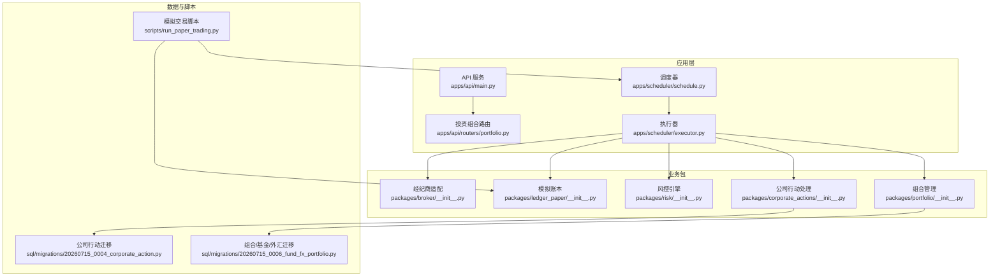
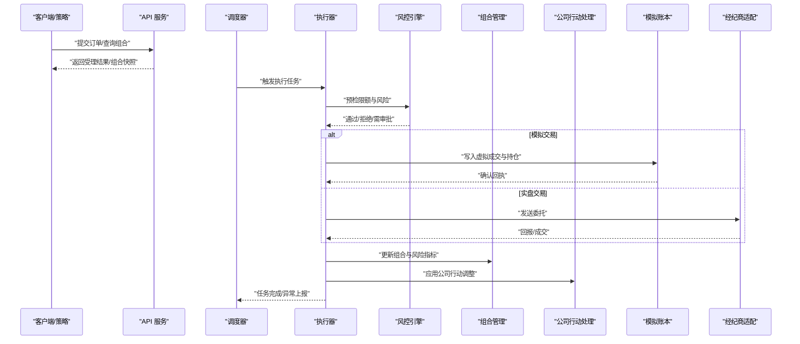
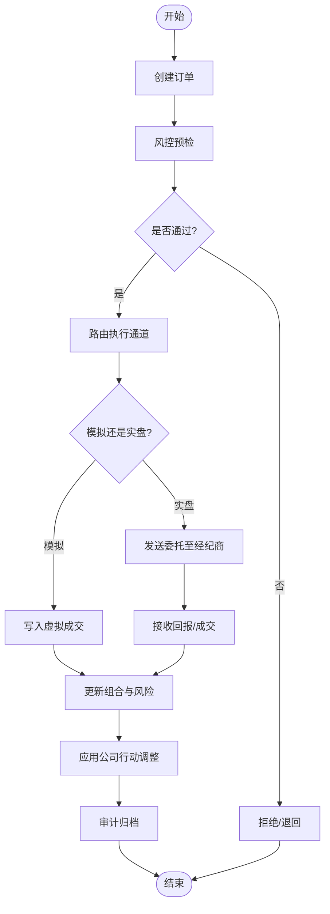
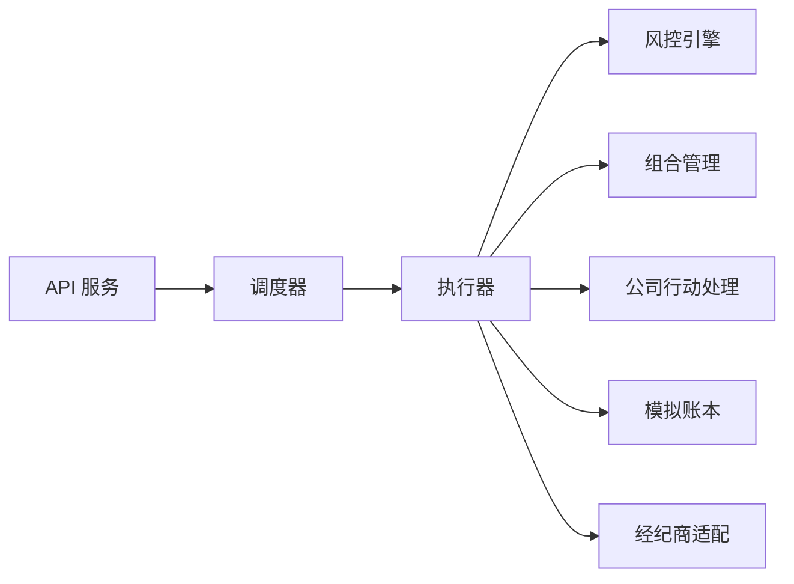

# 交易执行系统

<cite>
**本文引用的文件**   
- [apps/api/main.py](file://apps/api/main.py)
- [apps/api/routers/portfolio.py](file://apps/api/routers/portfolio.py)
- [apps/scheduler/executor.py](file://apps/scheduler/executor.py)
- [apps/scheduler/schedule.py](file://apps/scheduler/schedule.py)
- [packages/broker/__init__.py](file://packages/broker/__init__.py)
- [packages/ledger_paper/__init__.py](file://packages/ledger_paper/__init__.py)
- [packages/risk/__init__.py](file://packages/risk/__init__.py)
- [packages/portfolio/__init__.py](file://packages/portfolio/__init__.py)
- [packages/corporate_actions/__init__.py](file://packages/corporate_actions/__init__.py)
- [scripts/run_paper_trading.py](file://scripts/run_paper_trading.py)
- [sql/migrations/20260715_0004_corporate_action.py](file://sql/migrations/20260715_0004_corporate_action.py)
- [sql/migrations/20260715_0006_fund_fx_portfolio.py](file://sql/migrations/20260715_0006_fund_fx_portfolio.py)
</cite>

## 目录
1. [简介](#简介)
2. [项目结构](#项目结构)
3. [核心组件](#核心组件)
4. [架构总览](#架构总览)
5. [详细组件分析](#详细组件分析)
6. [依赖关系分析](#依赖关系分析)
7. [性能考虑](#性能考虑)
8. [故障排查指南](#故障排查指南)
9. [结论](#结论)
10. [附录](#附录)

## 简介
本技术文档面向交易执行系统，聚焦订单管理、风险控制与绩效分析三大模块的实现细节，深入解释持仓管理、风险限额控制与实时风险监控的工作原理。文档同时覆盖模拟交易与实盘交易的执行流程，给出与公司行动处理和组合管理的集成方式，并提供常见问题定位与性能优化策略。读者无需深厚的量化背景即可理解整体设计与关键实现要点。

## 项目结构
系统采用分层与模块化组织：
- API 层：提供对外接口（如投资组合查询等）
- 调度与执行层：负责任务编排与执行器调用
- 业务包：broker（经纪商适配）、ledger_paper（模拟账本）、risk（风控）、portfolio（组合）、corporate_actions（公司行动）等
- 脚本：运行模拟交易等端到端流程
- 数据库迁移：定义公司行动、组合与基金/外汇相关表结构

图表来源
- [apps/api/main.py](file://apps/api/main.py)
- [apps/api/routers/portfolio.py](file://apps/api/routers/portfolio.py)
- [apps/scheduler/executor.py](file://apps/scheduler/executor.py)
- [apps/scheduler/schedule.py](file://apps/scheduler/schedule.py)
- [packages/broker/__init__.py](file://packages/broker/__init__.py)
- [packages/ledger_paper/__init__.py](file://packages/ledger_paper/__init__.py)
- [packages/risk/__init__.py](file://packages/risk/__init__.py)
- [packages/portfolio/__init__.py](file://packages/portfolio/__init__.py)
- [packages/corporate_actions/__init__.py](file://packages/corporate_actions/__init__.py)
- [scripts/run_paper_trading.py](file://scripts/run_paper_trading.py)
- [sql/migrations/20260715_0004_corporate_action.py](file://sql/migrations/20260715_0004_corporate_action.py)
- [sql/migrations/20260715_0006_fund_fx_portfolio.py](file://sql/migrations/20260715_0006_fund_fx_portfolio.py)

章节来源
- [apps/api/main.py](file://apps/api/main.py)
- [apps/api/routers/portfolio.py](file://apps/api/routers/portfolio.py)
- [apps/scheduler/executor.py](file://apps/scheduler/executor.py)
- [apps/scheduler/schedule.py](file://apps/scheduler/schedule.py)
- [packages/broker/__init__.py](file://packages/broker/__init__.py)
- [packages/ledger_paper/__init__.py](file://packages/ledger_paper/__init__.py)
- [packages/risk/__init__.py](file://packages/risk/__init__.py)
- [packages/portfolio/__init__.py](file://packages/portfolio/__init__.py)
- [packages/corporate_actions/__init__.py](file://packages/corporate_actions/__init__.py)
- [scripts/run_paper_trading.py](file://scripts/run_paper_trading.py)
- [sql/migrations/20260715_0004_corporate_action.py](file://sql/migrations/20260715_0004_corporate_action.py)
- [sql/migrations/20260715_0006_fund_fx_portfolio.py](file://sql/migrations/20260715_0006_fund_fx_portfolio.py)

## 核心组件
- 订单管理模块
  - 职责：接收并校验订单、路由至执行器、记录审计事件、协调风控与组合更新。
  - 关键点：幂等性、状态机（新建/已确认/部分成交/已成交/已取消/已拒绝）、滑点与流动性约束。
- 风险控制机制
  - 职责：在下单前进行限额检查（头寸、敞口、止损、集中度、货币暴露），在盘中持续监控并触发告警或阻断。
  - 关键点：可配置限额、阈值分级（警告/硬拦截）、实时快照与回溯。
- 绩效分析工具
  - 职责：计算收益曲线、回撤、夏普比率、换手率、冲击成本等指标；支持按日/周/月粒度聚合。
  - 关键点：基准对齐、费用与税费扣除、分账户/分策略维度。
- 持仓管理
  - 职责：维护当前头寸、成本价、未实现盈亏、可用资金与冻结资金。
  - 关键点：公司行动调整（拆股、分红、配股）、多币种折算、对账与一致性校验。
- 风险限额控制与实时监控
  - 职责：将限额规则应用于每个标的与组合层面，结合市场数据流进行实时评估。
  - 关键点：规则引擎、事件驱动、熔断与降级策略。
- 模拟交易与实盘交易执行流程
  - 模拟：通过 ledger_paper 生成虚拟成交与持仓变更，便于回测与演练。
  - 实盘：通过 broker 适配器对接真实交易所/券商，处理委托、回报与结算。
- 与公司行动和组合管理的集成
  - 公司行动：根据事件类型调整历史价格序列与持仓数量/成本。
  - 组合管理：汇总各资产头寸与风险指标，输出组合视图与报表。

章节来源
- [packages/broker/__init__.py](file://packages/broker/__init__.py)
- [packages/ledger_paper/__init__.py](file://packages/ledger_paper/__init__.py)
- [packages/risk/__init__.py](file://packages/risk/__init__.py)
- [packages/portfolio/__init__.py](file://packages/portfolio/__init__.py)
- [packages/corporate_actions/__init__.py](file://packages/corporate_actions/__init__.py)

## 架构总览
系统以“调度-执行-适配”为核心链路：调度器按策略或事件触发执行器，执行器串联风控、组合、公司行动与经纪商/模拟账本，完成订单生命周期管理与结果回写。

图表来源
- [apps/api/main.py](file://apps/api/main.py)
- [apps/scheduler/executor.py](file://apps/scheduler/executor.py)
- [apps/scheduler/schedule.py](file://apps/scheduler/schedule.py)
- [packages/risk/__init__.py](file://packages/risk/__init__.py)
- [packages/portfolio/__init__.py](file://packages/portfolio/__init__.py)
- [packages/corporate_actions/__init__.py](file://packages/corporate_actions/__init__.py)
- [packages/ledger_paper/__init__.py](file://packages/ledger_paper/__init__.py)
- [packages/broker/__init__.py](file://packages/broker/__init__.py)

## 详细组件分析

### 订单管理模块
- 设计要点
  - 订单模型：包含标的、方向、数量、价格类型、时间属性、状态与审计字段。
  - 状态机：确保幂等与可追溯，任何状态变更均需落库并触发后续动作。
  - 路由策略：按标的类别与市场选择执行通道（模拟/实盘）。
- 关键流程
  - 创建订单 -> 风控预检 -> 路由执行 -> 成交回报 -> 组合更新 -> 审计归档。
- 代码片段路径
  - [订单创建与路由逻辑参考](file://apps/scheduler/executor.py)
  - [API 层订单入口参考](file://apps/api/main.py)

章节来源
- [apps/api/main.py](file://apps/api/main.py)
- [apps/scheduler/executor.py](file://apps/scheduler/executor.py)

### 风险控制机制
- 限额体系
  - 头寸限额：单标的/行业/国家维度上限。
  - 敞口限额：净多头/空头、杠杆倍数、VaR 限制。
  - 止损与回撤：触发减仓或暂停交易。
  - 集中度与流动性：避免过度集中与冲击过大。
- 实时监控
  - 基于事件流与定时快照双重机制，保证低延迟与高可靠。
  - 告警分级：提示、警告、阻断、熔断。
- 代码片段路径
  - [风控规则与检查入口参考](file://packages/risk/__init__.py)

章节来源
- [packages/risk/__init__.py](file://packages/risk/__init__.py)

### 绩效分析工具
- 指标体系
  - 收益类：累计收益、年化收益、超额收益。
  - 风险类：波动率、最大回撤、下行风险。
  - 效率类：夏普比率、索提诺比率、信息比率。
  - 交易类：换手率、冲击成本、滑点统计。
- 计算管线
  - 数据源：成交、持仓、净值、基准。
  - 频率：日频为主，支持分钟级滚动窗口。
  - 输出：报表、可视化与导出。
- 代码片段路径
  - [组合与绩效数据关联参考](file://packages/portfolio/__init__.py)

章节来源
- [packages/portfolio/__init__.py](file://packages/portfolio/__init__.py)

### 持仓管理
- 功能要点
  - 头寸维护：数量、成本、市值、未实现盈亏。
  - 资金账户：可用、冻结、占用、余额。
  - 多币种：汇率折算与汇兑损益。
  - 一致性：与成交、公司行动、费用对账。
- 公司行动影响
  - 拆合股：调整数量与成本。
  - 现金分红：增加现金、调整成本。
  - 配股/增发：新增头寸与资金占用。
- 代码片段路径
  - [公司行动处理入口参考](file://packages/corporate_actions/__init__.py)
  - [组合/基金/外汇表结构参考](file://sql/migrations/20260715_0006_fund_fx_portfolio.py)
  - [公司行动表结构参考](file://sql/migrations/20260715_0004_corporate_action.py)

章节来源
- [packages/corporate_actions/__init__.py](file://packages/corporate_actions/__init__.py)
- [sql/migrations/20260715_0006_fund_fx_portfolio.py](file://sql/migrations/20260715_0006_fund_fx_portfolio.py)
- [sql/migrations/20260715_0004_corporate_action.py](file://sql/migrations/20260715_0004_corporate_action.py)

### 模拟交易与实盘交易执行流程
- 模拟交易
  - 使用 ledger_paper 生成虚拟成交，不产生真实资金变动。
  - 适合策略验证、压力测试与演示。
- 实盘交易
  - 通过 broker 适配器发送委托，接收回报与成交。
  - 需要连接认证、心跳、重连与错误恢复。
- 统一入口
  - 执行器根据环境或策略参数选择通道。
- 代码片段路径
  - [模拟交易脚本入口参考](file://scripts/run_paper_trading.py)
  - [模拟账本入口参考](file://packages/ledger_paper/__init__.py)
  - [经纪商适配入口参考](file://packages/broker/__init__.py)
  - [执行器参考](file://apps/scheduler/executor.py)

章节来源
- [scripts/run_paper_trading.py](file://scripts/run_paper_trading.py)
- [packages/ledger_paper/__init__.py](file://packages/ledger_paper/__init__.py)
- [packages/broker/__init__.py](file://packages/broker/__init__.py)
- [apps/scheduler/executor.py](file://apps/scheduler/executor.py)

### 与公司行动处理和组合管理的集成
- 公司行动到组合的联动
  - 事件到达 -> 解析与校验 -> 调整历史价格与持仓 -> 重新计算风险与绩效。
- 组合视图
  - 汇总各资产头寸、风险指标与收益表现，支持多维度切片。
- 代码片段路径
  - [公司行动处理入口参考](file://packages/corporate_actions/__init__.py)
  - [组合管理入口参考](file://packages/portfolio/__init__.py)

章节来源
- [packages/corporate_actions/__init__.py](file://packages/corporate_actions/__init__.py)
- [packages/portfolio/__init__.py](file://packages/portfolio/__init__.py)

### 概念性概览
以下流程图展示从订单到成交再到组合更新的通用工作流，适用于模拟与实盘场景。

[此图为概念性流程，不直接映射具体源码文件]

## 依赖关系分析
- 组件耦合
  - 执行器依赖风控、组合、公司行动与执行通道（模拟/实盘）。
  - API 层主要暴露查询与提交入口，内部委托给调度与执行器。
- 外部依赖
  - 数据库：持久化订单、成交、组合与公司行动数据。
  - 消息/队列：用于异步任务与事件分发（可选）。
- 潜在循环依赖
  - 组合与风控相互引用需谨慎，建议通过事件总线或接口抽象解耦。

图表来源
- [apps/api/main.py](file://apps/api/main.py)
- [apps/scheduler/executor.py](file://apps/scheduler/executor.py)
- [apps/scheduler/schedule.py](file://apps/scheduler/schedule.py)
- [packages/risk/__init__.py](file://packages/risk/__init__.py)
- [packages/portfolio/__init__.py](file://packages/portfolio/__init__.py)
- [packages/corporate_actions/__init__.py](file://packages/corporate_actions/__init__.py)
- [packages/ledger_paper/__init__.py](file://packages/ledger_paper/__init__.py)
- [packages/broker/__init__.py](file://packages/broker/__init__.py)

章节来源
- [apps/api/main.py](file://apps/api/main.py)
- [apps/scheduler/executor.py](file://apps/scheduler/executor.py)
- [apps/scheduler/schedule.py](file://apps/scheduler/schedule.py)
- [packages/risk/__init__.py](file://packages/risk/__init__.py)
- [packages/portfolio/__init__.py](file://packages/portfolio/__init__.py)
- [packages/corporate_actions/__init__.py](file://packages/corporate_actions/__init__.py)
- [packages/ledger_paper/__init__.py](file://packages/ledger_paper/__init__.py)
- [packages/broker/__init__.py](file://packages/broker/__init__.py)

## 性能考虑
- 批量与批处理
  - 批量下单与批量成交回报合并处理，降低锁竞争与 IO 开销。
- 缓存与索引
  - 热点数据（标的、汇率、限额）缓存；数据库索引覆盖常用查询条件。
- 并发与异步
  - 非阻塞 I/O 与任务队列分离，避免主线程阻塞。
- 限流与背压
  - 对上游策略与下游通道实施速率限制，防止雪崩。
- 观测与度量
  - 埋点关键路径耗时、失败率与队列积压，配合告警与自动扩容。

[本节为通用指导，不直接分析具体文件]

## 故障排查指南
- 常见问题
  - 订单被风控拒绝：检查限额配置、头寸与敞口、止损触发条件。
  - 模拟成交不一致：核对时间戳、价格来源与手续费假设。
  - 实盘委托无回报：检查网络连通、认证与重试策略。
  - 公司行动未生效：确认事件到达顺序、幂等键与历史价格修正。
- 定位步骤
  - 查看审计日志与执行轨迹。
  - 回放关键事件，复现问题。
  - 对比组合快照与数据库一致。
- 代码片段路径
  - [执行器与调度参考](file://apps/scheduler/executor.py)
  - [API 健康与路由参考](file://apps/api/main.py)
  - [组合查询路由参考](file://apps/api/routers/portfolio.py)

章节来源
- [apps/scheduler/executor.py](file://apps/scheduler/executor.py)
- [apps/api/main.py](file://apps/api/main.py)
- [apps/api/routers/portfolio.py](file://apps/api/routers/portfolio.py)

## 结论
本系统通过清晰的模块化设计与统一的执行器模式，实现了订单管理、风险控制与绩效分析的闭环。模拟与实盘双通道保障策略迭代与生产稳定性。公司行动与组合管理深度集成，确保数据一致性与指标准确性。建议在上线前完善观测与告警，持续优化批处理与缓存策略，提升吞吐与可靠性。

[本节为总结性内容，不直接分析具体文件]

## 附录
- 使用模式示例（路径指引）
  - 启动模拟交易：参见 [模拟交易脚本](file://scripts/run_paper_trading.py)
  - 提交订单与查询组合：参见 [API 服务](file://apps/api/main.py)、[投资组合路由](file://apps/api/routers/portfolio.py)
  - 配置风控与组合：参见 [风控引擎](file://packages/risk/__init__.py)、[组合管理](file://packages/portfolio/__init__.py)
  - 接入公司行动：参见 [公司行动处理](file://packages/corporate_actions/__init__.py) 与相关迁移文件
- 数据模型参考
  - 公司行动表结构：参见 [迁移文件](file://sql/migrations/20260715_0004_corporate_action.py)
  - 组合/基金/外汇表结构：参见 [迁移文件](file://sql/migrations/20260715_0006_fund_fx_portfolio.py)