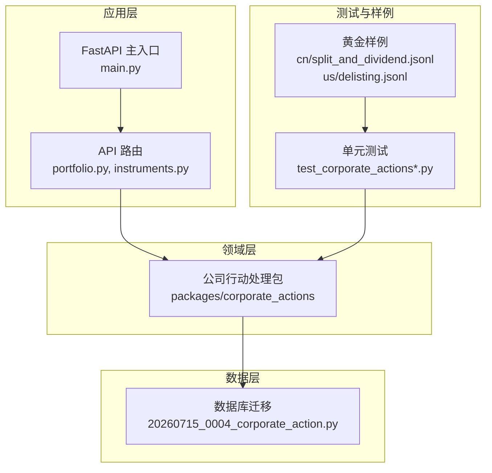
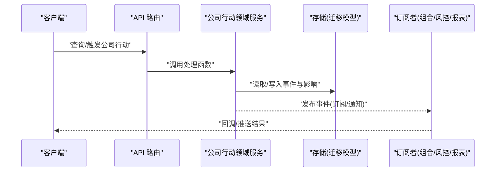
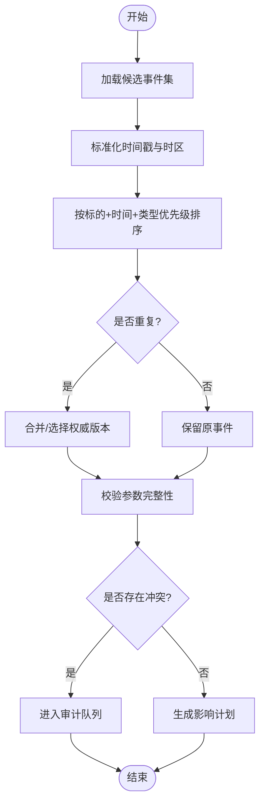
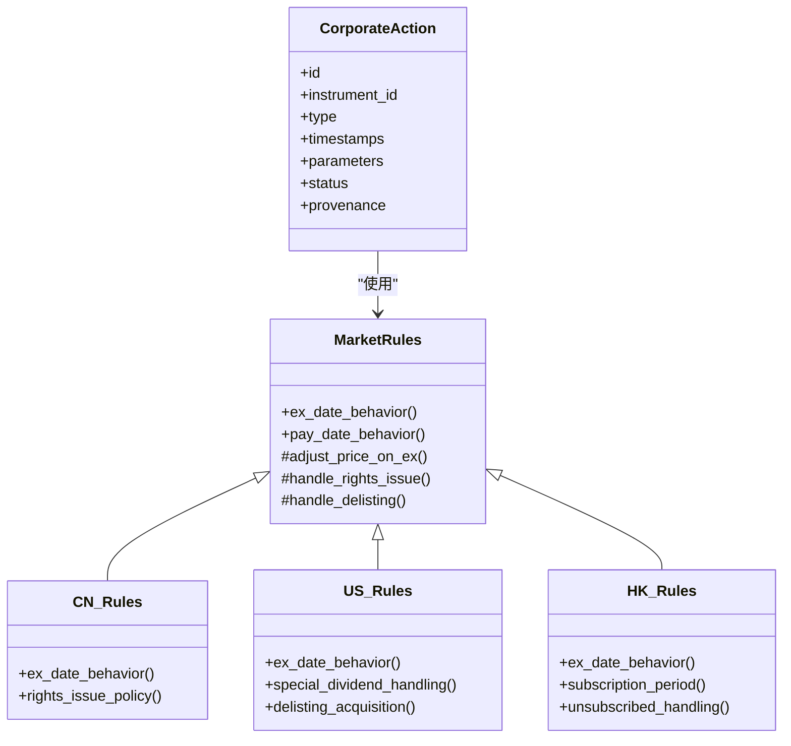
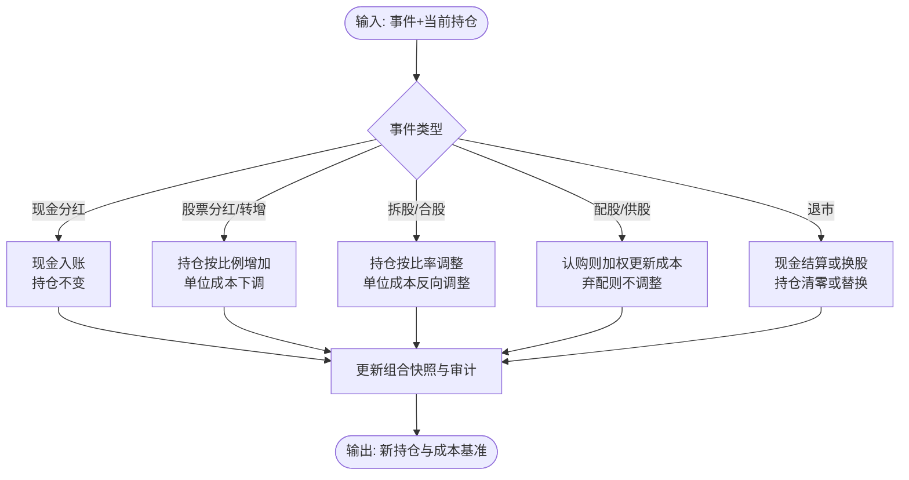
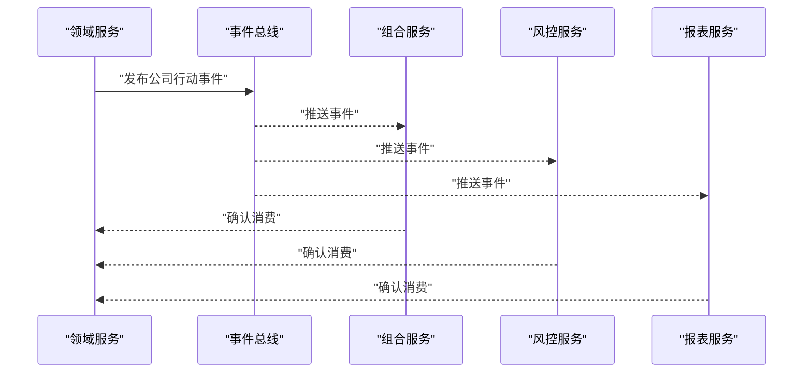
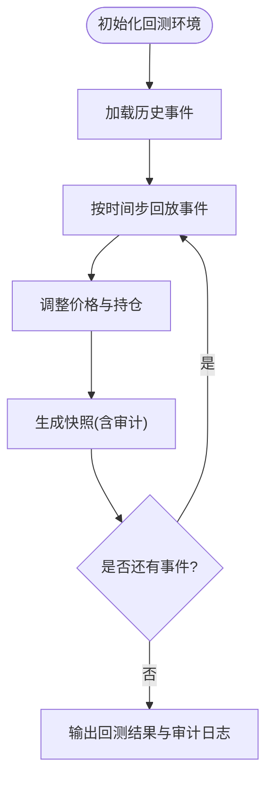
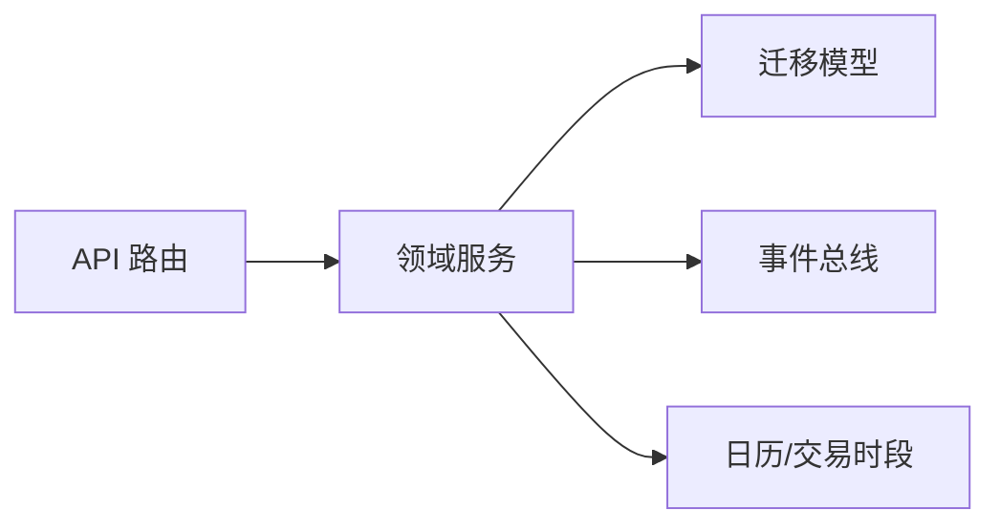

# 公司行动处理

<cite>
**本文引用的文件**   
- [packages/corporate_actions](file://packages/corporate_actions)
- [sql/migrations/20260715_0004_corporate_action.py](file://sql/migrations/20260715_0004_corporate_action.py)
- [tests/unit/test_corporate_actions.py](file://tests/unit/test_corporate_actions.py)
- [tests/unit/test_corporate_actions_extended.py](file://tests/unit/test_corporate_actions_extended.py)
- [tests/fixtures/golden/cn/split_and_dividend.jsonl](file://tests/fixtures/golden/cn/split_and_dividend.jsonl)
- [tests/fixtures/golden/us/delisting.jsonl](file://tests/fixtures/golden/us/delisting.jsonl)
- [apps/api/routers/portfolio.py](file://apps/api/routers/portfolio.py)
- [apps/api/routers/instruments.py](file://apps/api/routers/instruments.py)
- [apps/api/main.py](file://apps/api/main.py)
</cite>

## 目录
1. [简介](#简介)
2. [项目结构](#项目结构)
3. [核心组件](#核心组件)
4. [架构总览](#架构总览)
5. [详细组件分析](#详细组件分析)
6. [依赖关系分析](#依赖关系分析)
7. [性能考虑](#性能考虑)
8. [故障排查指南](#故障排查指南)
9. [结论](#结论)
10. [附录](#附录)

## 简介
本技术文档面向“公司行动处理”模块，覆盖分红、拆股、配股、退市等典型公司行动的处理流程。文档从数据结构、时间戳与优先级、跨市场差异化逻辑（A股、美股、港股）、订阅与通知机制、对持仓与成本基准的影响计算，以及回测支持与历史数据重建等方面展开，帮助研发与量化团队准确理解并扩展该能力。

## 项目结构
公司行动相关代码位于 packages/corporate_actions 目录下，数据库模型通过迁移脚本定义，测试用例覆盖多场景与跨市场差异，API 层提供查询接口以暴露公司行动事件与影响结果。

图表来源
- [apps/api/main.py](file://apps/api/main.py)
- [apps/api/routers/portfolio.py](file://apps/api/routers/portfolio.py)
- [apps/api/routers/instruments.py](file://apps/api/routers/instruments.py)
- [packages/corporate_actions](file://packages/corporate_actions)
- [sql/migrations/20260715_0004_corporate_action.py](file://sql/migrations/20260715_0004_corporate_action.py)
- [tests/unit/test_corporate_actions.py](file://tests/unit/test_corporate_actions.py)
- [tests/unit/test_corporate_actions_extended.py](file://tests/unit/test_corporate_actions_extended.py)
- [tests/fixtures/golden/cn/split_and_dividend.jsonl](file://tests/fixtures/golden/cn/split_and_dividend.jsonl)
- [tests/fixtures/golden/us/delisting.jsonl](file://tests/fixtures/golden/us/delisting.jsonl)

章节来源
- [packages/corporate_actions](file://packages/corporate_actions)
- [sql/migrations/20260715_0004_corporate_action.py](file://sql/migrations/20260715_0004_corporate_action.py)
- [tests/unit/test_corporate_actions.py](file://tests/unit/test_corporate_actions.py)
- [tests/unit/test_corporate_actions_extended.py](file://tests/unit/test_corporate_actions_extended.py)
- [tests/fixtures/golden/cn/split_and_dividend.jsonl](file://tests/fixtures/golden/cn/split_and_dividend.jsonl)
- [tests/fixtures/golden/us/delisting.jsonl](file://tests/fixtures/golden/us/delisting.jsonl)
- [apps/api/routers/portfolio.py](file://apps/api/routers/portfolio.py)
- [apps/api/routers/instruments.py](file://apps/api/routers/instruments.py)
- [apps/api/main.py](file://apps/api/main.py)

## 核心组件
本节概述公司行动处理的关键概念与职责边界：
- 事件模型：统一描述公司行动类型、标的、生效时间、比例/金额等关键参数。
- 处理器族：按市场或业务域划分的事件解析与执行策略。
- 调度与排序：基于时间戳与优先级的合并、去重与冲突消解。
- 影响计算：对持仓数量、成本基准、权益调整的计算与审计。
- 订阅与通知：事件发布与订阅通道，供组合、风控、报表等下游消费。
- 回测支持：在历史回放中注入公司行动，保证可重复性与一致性。

章节来源
- [packages/corporate_actions](file://packages/corporate_actions)
- [sql/migrations/20260715_0004_corporate_action.py](file://sql/migrations/20260715_0004_corporate_action.py)

## 架构总览
公司行动处理采用分层架构：API 层暴露查询与触发能力；领域层实现事件解析、排序、影响计算与持久化；数据层由迁移脚本维护表结构与索引；测试层通过黄金样例验证跨市场行为。

图表来源
- [apps/api/routers/portfolio.py](file://apps/api/routers/portfolio.py)
- [apps/api/routers/instruments.py](file://apps/api/routers/instruments.py)
- [packages/corporate_actions](file://packages/corporate_actions)
- [sql/migrations/20260715_0004_corporate_action.py](file://sql/migrations/20260715_0004_corporate_action.py)

## 详细组件分析

### 事件模型与数据结构
- 关键字段
  - 事件标识：唯一键，用于去重与幂等。
  - 标的标识：统一 instrument_id，跨市场一致。
  - 事件类型：如分红、拆股、配股、退市等。
  - 时间戳：宣告日、登记日、除权除息日、生效日等，用于排序与窗口计算。
  - 参数：比例、现金金额、认购价、行权比等，随类型不同而变。
  - 状态：草稿、已确认、已生效、已失效等。
  - 来源与审计：数据来源、创建/更新时间、变更轨迹。
- 复杂度
  - 单条事件 O(1) 读写；批量合并与排序 O(n log n)。
- 设计要点
  - 时间戳字段需带时区信息，避免跨市场夏令时问题。
  - 参数结构建议采用可扩展的 JSON 字段，便于新增事件类型。

章节来源
- [sql/migrations/20260715_0004_corporate_action.py](file://sql/migrations/20260715_0004_corporate_action.py)

### 时间戳处理与优先级排序
- 时间语义
  - 宣告日：对外公告日期。
  - 登记日：确定有权参与股东的截止日。
  - 除权除息日：价格调整生效日。
  - 生效日：实际资金/股份到账日。
- 排序规则
  - 同一标的同一天多条事件：按类型优先级与时间戳微秒级顺序合并。
  - 跨市场差异：部分市场除权除息与生效存在 T+1 差异，需在排序前进行本地日历对齐。
- 冲突消解
  - 若出现重复事件，依据来源可信度与时间戳选择权威版本。
  - 若参数不一致，进入人工审核队列并记录审计日志。

图表来源
- [packages/corporate_actions](file://packages/corporate_actions)

章节来源
- [packages/corporate_actions](file://packages/corporate_actions)

### 跨市场差异化处理（A股、美股、港股）
- A股
  - 常见事件：现金分红、送红股、转增股本、配股、停牌/复牌、退市。
  - 特点：除权除息日通常为交易日当日，价格调整在开盘前完成；配股需投资者主动缴款或默认弃配策略。
- 美股
  - 常见事件：现金分红、股票股利、拆股/合股、特别股息、退市收购。
  - 特点：除息日与支付日分离；退市可能涉及换股或现金结算，需按交易协议计算替代头寸。
- 港股
  - 常见事件：现金分红、红股、供股、退市。
  - 特点：除净日与派息日分离；供股通常有认购期与未认购处理。

图表来源
- [packages/corporate_actions](file://packages/corporate_actions)
- [tests/fixtures/golden/cn/split_and_dividend.jsonl](file://tests/fixtures/golden/cn/split_and_dividend.jsonl)
- [tests/fixtures/golden/us/delisting.jsonl](file://tests/fixtures/golden/us/delisting.jsonl)

章节来源
- [packages/corporate_actions](file://packages/corporate_actions)
- [tests/fixtures/golden/cn/split_and_dividend.jsonl](file://tests/fixtures/golden/cn/split_and_dividend.jsonl)
- [tests/fixtures/golden/us/delisting.jsonl](file://tests/fixtures/golden/us/delisting.jsonl)

### 对持仓与成本基准的影响计算
- 分红（现金）
  - 持仓数量不变；账户现金增加；资产净值变化；成本基准不变。
- 分红（股票/送红股/转增）
  - 持仓数量按比例增加；单位成本按反比下调；总市值不变（除权）。
- 拆股/合股
  - 持仓数量按拆合比调整；单位成本反向调整；总市值不变。
- 配股/供股
  - 若认购：持仓数量增加，成本按认购价与市价加权更新；若弃配：持仓不变，可能产生机会成本。
- 退市
  - 若现金结算：持仓清零，现金入账；若换股：按换股比例替换为标的，成本基准按等价原则调整。

图表来源
- [packages/corporate_actions](file://packages/corporate_actions)

章节来源
- [packages/corporate_actions](file://packages/corporate_actions)

### 订阅与通知机制
- 事件发布
  - 领域服务在完成事件解析与影响计算后，将事件与影响摘要发布到消息通道。
- 订阅者
  - 组合管理：更新持仓与风险敞口。
  - 风控：检查阈值与合规约束。
  - 报表：生成披露与绩效归因。
- 可靠性
  - 至少一次投递与幂等消费；失败重试与死信队列。

图表来源
- [packages/corporate_actions](file://packages/corporate_actions)

章节来源
- [packages/corporate_actions](file://packages/corporate_actions)

### 回测支持与历史数据重建
- 回放模式
  - 在回测引擎中按时间线注入历史公司行动事件，确保价格序列与持仓同步调整。
- 一致性
  - 事件版本与快照：每次影响计算生成不可变快照，便于回溯与对比。
- 数据重建
  - 从迁移模型与事件源重建历史持仓与成本基准，支持断点续跑与增量修复。

图表来源
- [packages/corporate_actions](file://packages/corporate_actions)

章节来源
- [packages/corporate_actions](file://packages/corporate_actions)

## 依赖关系分析
- 内部依赖
  - API 路由依赖领域服务；领域服务依赖存储模型与事件总线。
- 外部依赖
  - 数据库迁移模型；消息总线（可选）；日历与交易时段库（跨市场）。
- 耦合与内聚
  - 领域层保持高内聚，市场规则通过策略模式扩展，降低耦合。
- 循环依赖
  - 应避免 API 直接访问存储，统一通过领域服务。

图表来源
- [apps/api/routers/portfolio.py](file://apps/api/routers/portfolio.py)
- [apps/api/routers/instruments.py](file://apps/api/routers/instruments.py)
- [packages/corporate_actions](file://packages/corporate_actions)
- [sql/migrations/20260715_0004_corporate_action.py](file://sql/migrations/20260715_0004_corporate_action.py)

章节来源
- [apps/api/routers/portfolio.py](file://apps/api/routers/portfolio.py)
- [apps/api/routers/instruments.py](file://apps/api/routers/instruments.py)
- [packages/corporate_actions](file://packages/corporate_actions)
- [sql/migrations/20260715_0004_corporate_action.py](file://sql/migrations/20260715_0004_corporate_action.py)

## 性能考虑
- 批量处理
  - 对大规模事件集采用批处理与并行排序，减少 I/O 次数。
- 索引优化
  - 在 instrument_id、生效日、事件类型上建立复合索引，加速查询与回放。
- 缓存策略
  - 热点标的的影响计划可短期缓存，注意失效策略与一致性。
- 内存控制
  - 流式处理大事件集，避免一次性加载全部数据。

[本节为通用指导，无需具体文件引用]

## 故障排查指南
- 常见问题
  - 时间戳异常：检查时区转换与夏令时处理。
  - 重复事件：核对唯一键与幂等逻辑。
  - 参数缺失：校验必填字段与范围约束。
  - 跨市场差异：确认市场规则适配是否正确。
- 定位方法
  - 查看审计日志与事件版本；比对黄金样例；回放最小复现场景。
- 恢复步骤
  - 修正数据后重新运行影响计算；必要时重建快照与持仓。

章节来源
- [tests/unit/test_corporate_actions.py](file://tests/unit/test_corporate_actions.py)
- [tests/unit/test_corporate_actions_extended.py](file://tests/unit/test_corporate_actions_extended.py)

## 结论
公司行动处理模块通过统一事件模型、严格的时间戳与优先级规则、跨市场差异化策略、可靠的订阅通知机制以及对持仓与成本基准的精确影响计算，为多市场量化研究与生产系统提供了坚实基础。结合回测支持与历史数据重建能力，可实现端到端的一致性与可追溯性。

[本节为总结，无需具体文件引用]

## 附录
- 术语
  - 除权除息日：价格调整的基准日。
  - 登记日：确定股东资格的截止日。
  - 配股/供股：向现有股东发行新股的权利。
  - 退市：标的退出交易市场，可能伴随现金或换股结算。
- 参考
  - 黄金样例用于验证跨市场行为与边界条件。

章节来源
- [tests/fixtures/golden/cn/split_and_dividend.jsonl](file://tests/fixtures/golden/cn/split_and_dividend.jsonl)
- [tests/fixtures/golden/us/delisting.jsonl](file://tests/fixtures/golden/us/delisting.jsonl)