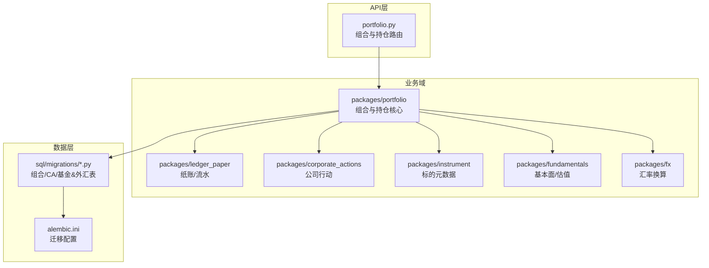
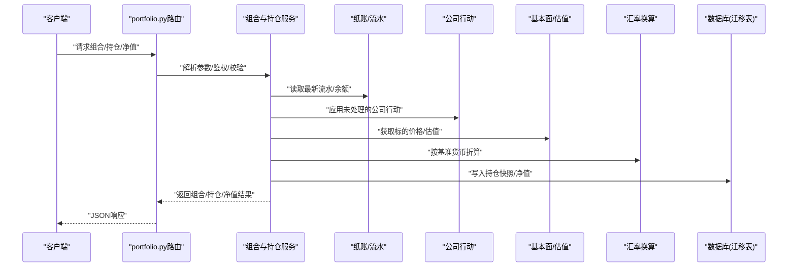
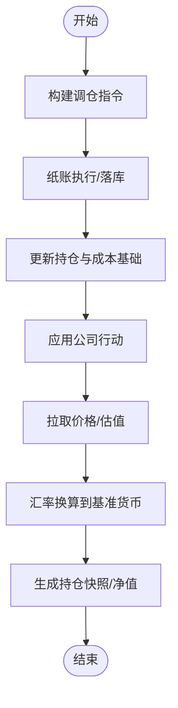
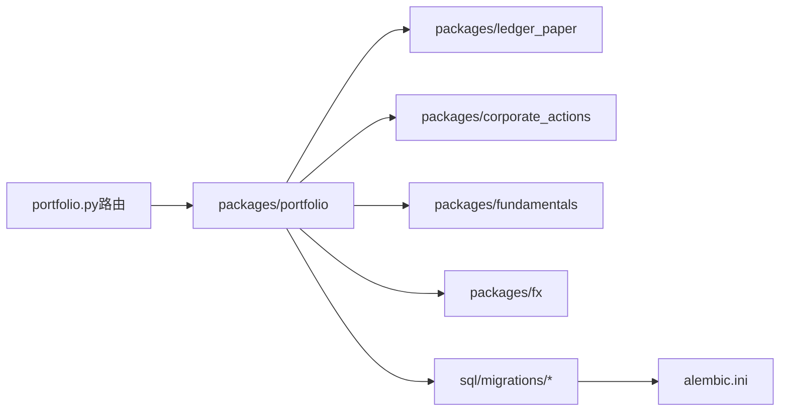

# 持仓管理

<cite>
**本文引用的文件**   
- [apps/api/routers/portfolio.py](file://apps/api/routers/portfolio.py)
- [packages/portfolio](file://packages/portfolio)
- [packages/ledger_paper](file://packages/ledger_paper)
- [packages/corporate_actions](file://packages/corporate_actions)
- [packages/instrument](file://packages/instrument)
- [packages/fundamentals](file://packages/fundamentals)
- [packages/fx](file://packages/fx)
- [sql/migrations/20260715_0006_fund_fx_portfolio.py](file://sql/migrations/20260715_0006_fund_fx_portfolio.py)
- [sql/migrations/20260715_0004_corporate_action.py](file://sql/migrations/20260715_0004_corporate_action.py)
- [alembic.ini](file://alembic.ini)
</cite>

## 目录
1. [简介](#简介)
2. [项目结构](#项目结构)
3. [核心组件](#核心组件)
4. [架构总览](#架构总览)
5. [详细组件分析](#详细组件分析)
6. [依赖关系分析](#依赖关系分析)
7. [性能考虑](#性能考虑)
8. [故障排查指南](#故障排查指南)
9. [结论](#结论)
10. [附录](#附录)

## 简介
本技术文档聚焦于“持仓管理”模块，覆盖投资组合构建、持仓记录与净值计算的关键实现细节。文档重点说明多资产类别（股票、基金、外汇等）的持仓管理逻辑，包括仓位调整、再平衡策略与成本计算方法；提供持仓查询、分析与报告的API接口说明；阐述与公司行动处理的集成关系；并解释持仓数据的持久化存储与并发访问控制。

## 项目结构
从仓库结构看，持仓管理相关能力分布在以下位置：
- API层：路由定义位于 apps/api/routers/portfolio.py，暴露组合与持仓相关的HTTP接口。
- 业务域：packages/portfolio 为组合与持仓的核心领域包。
- 记账与交易：packages/ledger_paper 提供纸账/模拟交易与持仓流水。
- 公司行动：packages/corporate_actions 处理分红、拆合股等事件对持仓的影响。
- 数据模型迁移：sql/migrations 下的迁移脚本定义了组合、公司行动、基金/外汇组合等表结构。
- 配置：alembic.ini 用于数据库迁移工具的配置。

图表来源
- [apps/api/routers/portfolio.py](file://apps/api/routers/portfolio.py)
- [packages/portfolio](file://packages/portfolio)
- [packages/ledger_paper](file://packages/ledger_paper)
- [packages/corporate_actions](file://packages/corporate_actions)
- [packages/instrument](file://packages/instrument)
- [packages/fundamentals](file://packages/fundamentals)
- [packages/fx](file://packages/fx)
- [sql/migrations/20260715_0006_fund_fx_portfolio.py](file://sql/migrations/20260715_0006_fund_fx_portfolio.py)
- [sql/migrations/20260715_0004_corporate_action.py](file://sql/migrations/20260715_0004_corporate_action.py)
- [alembic.ini](file://alembic.ini)

章节来源
- [apps/api/routers/portfolio.py](file://apps/api/routers/portfolio.py)
- [packages/portfolio](file://packages/portfolio)
- [packages/ledger_paper](file://packages/ledger_paper)
- [packages/corporate_actions](file://packages/corporate_actions)
- [packages/instrument](file://packages/instrument)
- [packages/fundamentals](file://packages/fundamentals)
- [packages/fx](file://packages/fx)
- [sql/migrations/20260715_0006_fund_fx_portfolio.py](file://sql/migrations/20260715_0006_fund_fx_portfolio.py)
- [sql/migrations/20260715_0004_corporate_action.py](file://sql/migrations/20260715_0004_corporate_action.py)
- [alembic.ini](file://alembic.ini)

## 核心组件
- 组合与持仓服务（packages/portfolio）
  - 负责组合生命周期管理、持仓快照、权重计算、净值汇总与多币种折算。
  - 支持多资产类别：股票、基金、外汇等，通过统一的数据模型与转换层进行抽象。
- 纸账与流水（packages/ledger_paper）
  - 记录交易流水、费用、滑点等，驱动持仓增量更新与成本基础维护。
- 公司行动（packages/corporate_actions）
  - 将公司行动事件（如分红、拆合股、配股）映射为持仓与成本的调整。
- 标的与基本面（packages/instrument, packages/fundamentals）
  - 提供标的属性、交易日历、价格序列与估值因子，支撑净值与风险指标计算。
- 汇率换算（packages/fx）
  - 提供跨币种折算，确保组合净值以基准货币呈现。
- 数据持久化（sql/migrations + alembic）
  - 使用迁移脚本定义组合、公司行动、基金/外汇组合等表结构，并通过Alembic进行版本化管理。

章节来源
- [packages/portfolio](file://packages/portfolio)
- [packages/ledger_paper](file://packages/ledger_paper)
- [packages/corporate_actions](file://packages/corporate_actions)
- [packages/instrument](file://packages/instrument)
- [packages/fundamentals](file://packages/fundamentals)
- [packages/fx](file://packages/fx)
- [sql/migrations/20260715_0006_fund_fx_portfolio.py](file://sql/migrations/20260715_0006_fund_fx_portfolio.py)
- [sql/migrations/20260715_0004_corporate_action.py](file://sql/migrations/20260715_0004_corporate_action.py)
- [alembic.ini](file://alembic.ini)

## 架构总览
整体架构采用分层设计：API路由作为入口，调用组合与持仓服务；后者协调纸账流水、公司行动、标的与基本面、汇率换算等子系统，最终读写数据库。

图表来源
- [apps/api/routers/portfolio.py](file://apps/api/routers/portfolio.py)
- [packages/portfolio](file://packages/portfolio)
- [packages/ledger_paper](file://packages/ledger_paper)
- [packages/corporate_actions](file://packages/corporate_actions)
- [packages/fundamentals](file://packages/fundamentals)
- [packages/fx](file://packages/fx)
- [sql/migrations/20260715_0006_fund_fx_portfolio.py](file://sql/migrations/20260715_0006_fund_fx_portfolio.py)
- [sql/migrations/20260715_0004_corporate_action.py](file://sql/migrations/20260715_0004_corporate_action.py)

## 详细组件分析

### 组合与持仓服务（packages/portfolio）
- 职责
  - 组合创建/更新/删除、持仓快照生成、权重与敞口计算、净值汇总与币种折算。
  - 多资产类别统一建模：股票、基金、外汇等共享通用字段（数量、成本、市值、币种），并按资产类型扩展特定字段（如基金的份额净值、外汇的交叉汇率）。
- 关键流程
  - 组合构建：基于目标权重或信号生成调仓指令，经纸账执行后更新持仓。
  - 净值计算：按日/实时聚合各标的市值，结合汇率换算得到组合净值曲线。
  - 成本方法：支持加权平均成本、先进先出等策略，保证卖出时成本结转一致。
- 并发与一致性
  - 在组合维度加锁，避免同一组合的并发写冲突；读操作可并行。
  - 使用事务包裹“流水→持仓→快照”的更新链路，确保一致性。

图表来源
- [packages/portfolio](file://packages/portfolio)
- [packages/ledger_paper](file://packages/ledger_paper)
- [packages/corporate_actions](file://packages/corporate_actions)
- [packages/fundamentals](file://packages/fundamentals)
- [packages/fx](file://packages/fx)

章节来源
- [packages/portfolio](file://packages/portfolio)
- [packages/ledger_paper](file://packages/ledger_paper)
- [packages/corporate_actions](file://packages/corporate_actions)
- [packages/fundamentals](file://packages/fundamentals)
- [packages/fx](file://packages/fx)

### 纸账与流水（packages/ledger_paper）
- 职责
  - 记录买入/卖出/分红/费用等流水，维护账户余额与持仓增量。
  - 提供回滚与幂等机制，确保重复提交不产生副作用。
- 与持仓的关系
  - 每次有效流水都会触发持仓与成本基础的重新计算或增量更新。
  - 支持批量导入历史流水，重建持仓快照。

章节来源
- [packages/ledger_paper](file://packages/ledger_paper)

### 公司行动（packages/corporate_actions）
- 职责
  - 解析公司行动事件（如现金分红、送红股、拆合股、配股），转换为对持仓数量、成本与权益的调整。
- 集成点
  - 在持仓快照前应用未处理的公司行动，确保净值反映真实权益变化。
  - 与基本面/估值系统联动，区分除息/除权日的价格调整。

章节来源
- [packages/corporate_actions](file://packages/corporate_actions)
- [sql/migrations/20260715_0004_corporate_action.py](file://sql/migrations/20260715_0004_corporate_action.py)

### 标的与基本面（packages/instrument, packages/fundamentals）
- 职责
  - 提供标的元数据（代码、市场、币种、交易日历）、价格序列与估值因子。
  - 支撑净值计算中的市值估算与收益归因。
- 多资产支持
  - 股票：收盘价/成交量等。
  - 基金：份额净值（NAV）、申赎费率等。
  - 外汇：即期汇率与交叉汇率。

章节来源
- [packages/instrument](file://packages/instrument)
- [packages/fundamentals](file://packages/fundamentals)

### 汇率换算（packages/fx）
- 职责
  - 提供多币种到基准货币的换算，支持直接汇率与交叉汇率路径。
- 使用场景
  - 组合净值汇总、风险敞口统计、报告输出均以基准货币展示。

章节来源
- [packages/fx](file://packages/fx)

### 数据模型与持久化（sql/migrations + alembic）
- 迁移脚本
  - 20260715_0006_fund_fx_portfolio.py：定义基金/外汇组合及持仓相关表结构。
  - 20260715_0004_corporate_action.py：定义公司行动事件表结构。
- Alembic配置
  - alembic.ini：指定数据库连接、迁移目录与版本管理策略。

章节来源
- [sql/migrations/20260715_0006_fund_fx_portfolio.py](file://sql/migrations/20260715_0006_fund_fx_portfolio.py)
- [sql/migrations/20260715_0004_corporate_action.py](file://sql/migrations/20260715_0004_corporate_action.py)
- [alembic.ini](file://alembic.ini)

## 依赖关系分析
- 组件耦合
  - portfolio 强依赖 ledger_paper、corporate_actions、fundamentals、fx。
  - API路由仅依赖 portfolio，保持薄入口。
- 外部依赖
  - 数据库通过Alembic迁移管理，避免硬编码DDL。
  - 时间/日历由instrument/fundamentals提供，确保跨市场一致性。

图表来源
- [apps/api/routers/portfolio.py](file://apps/api/routers/portfolio.py)
- [packages/portfolio](file://packages/portfolio)
- [packages/ledger_paper](file://packages/ledger_paper)
- [packages/corporate_actions](file://packages/corporate_actions)
- [packages/fundamentals](file://packages/fundamentals)
- [packages/fx](file://packages/fx)
- [sql/migrations/20260715_0006_fund_fx_portfolio.py](file://sql/migrations/20260715_0006_fund_fx_portfolio.py)
- [sql/migrations/20260715_0004_corporate_action.py](file://sql/migrations/20260715_0004_corporate_action.py)
- [alembic.ini](file://alembic.ini)

章节来源
- [apps/api/routers/portfolio.py](file://apps/api/routers/portfolio.py)
- [packages/portfolio](file://packages/portfolio)
- [packages/ledger_paper](file://packages/ledger_paper)
- [packages/corporate_actions](file://packages/corporate_actions)
- [packages/fundamentals](file://packages/fundamentals)
- [packages/fx](file://packages/fx)
- [sql/migrations/20260715_0006_fund_fx_portfolio.py](file://sql/migrations/20260715_0006_fund_fx_portfolio.py)
- [sql/migrations/20260715_0004_corporate_action.py](file://sql/migrations/20260715_0004_corporate_action.py)
- [alembic.ini](file://alembic.ini)

## 性能考虑
- 批处理与增量更新
  - 批量导入流水时采用分批提交，减少锁持有时间。
  - 持仓快照按需刷新，避免全量重算。
- 缓存策略
  - 对高频只读数据（汇率、标的元数据）引入内存缓存，设置合理TTL。
- 索引与查询优化
  - 针对组合ID、时间戳、标的ID建立复合索引，加速查询与报表生成。
- 并发控制
  - 组合级写锁，读操作无锁或短事务读，降低阻塞。

[本节为通用指导，无需具体文件引用]

## 故障排查指南
- 常见问题
  - 公司行动未生效：检查迁移是否执行、事件状态是否为“待处理”。
  - 净值异常波动：核对汇率源与除权除息日价格是否正确。
  - 并发写冲突：确认组合级锁是否释放，是否存在长事务。
- 定位步骤
  - 查看流水与快照的时间顺序，确认因果链完整。
  - 对比基准货币折算前后的数值，定位汇率问题。
  - 审查迁移日志与错误信息，确认DDL变更已应用。

章节来源
- [sql/migrations/20260715_0004_corporate_action.py](file://sql/migrations/20260715_0004_corporate_action.py)
- [sql/migrations/20260715_0006_fund_fx_portfolio.py](file://sql/migrations/20260715_0006_fund_fx_portfolio.py)
- [alembic.ini](file://alembic.ini)

## 结论
持仓管理模块通过清晰的分层与模块化设计，实现了多资产类别的统一建模与净值计算，并与公司行动、基本面、汇率等子系统紧密集成。借助迁移与事务保障数据一致性，配合并发控制与缓存策略，满足高可用与高性能需求。后续可在成本结转策略、再平衡规则与报表维度上持续增强。

[本节为总结性内容，无需具体文件引用]

## 附录
- API接口概览（示例）
  - 组合与持仓查询：GET /api/portfolio/{id}/positions
  - 净值曲线：GET /api/portfolio/{id}/nav?start=&end=
  - 公司行动应用：POST /api/portfolio/{id}/apply-corporate-actions
  - 流水导入：POST /api/portfolio/{id}/ledger/import
  - 再平衡建议：POST /api/portfolio/{id}/rebalance/suggest
  - 报告导出：GET /api/portfolio/{id}/report?format=csv|json

章节来源
- [apps/api/routers/portfolio.py](file://apps/api/routers/portfolio.py)