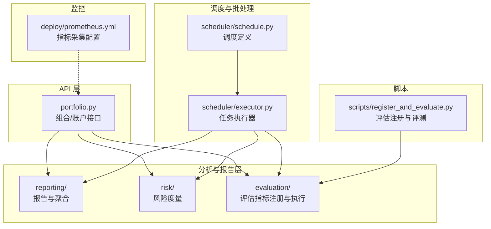
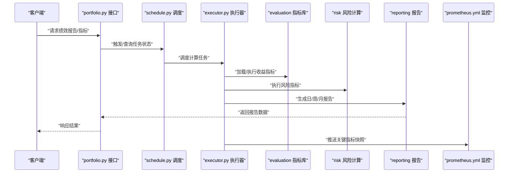
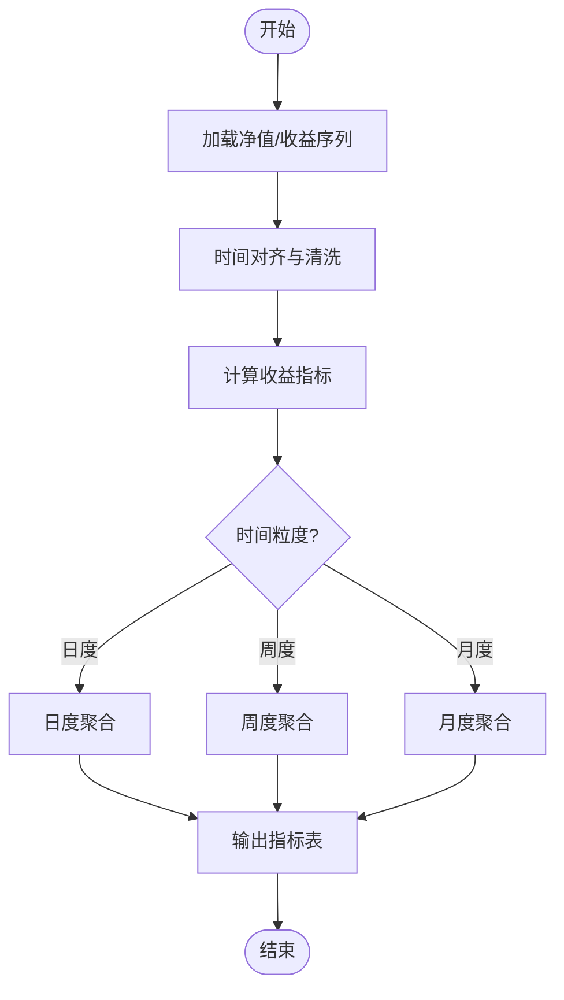
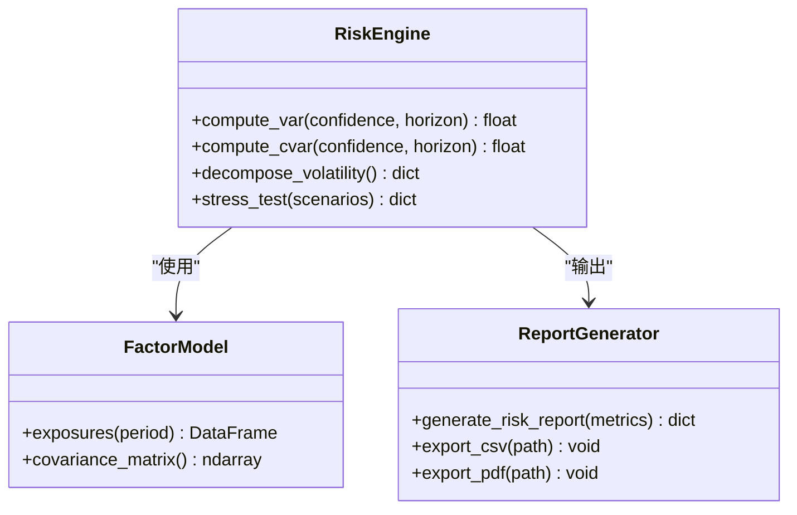
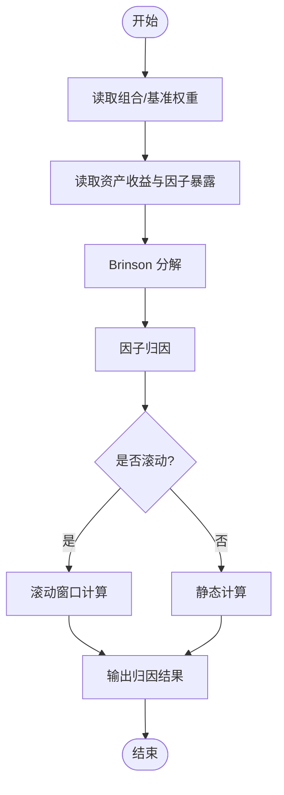
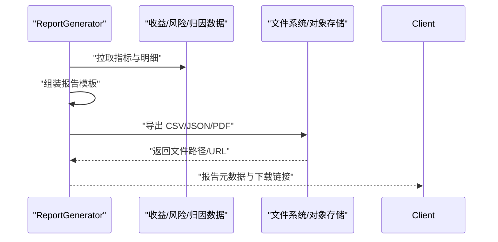
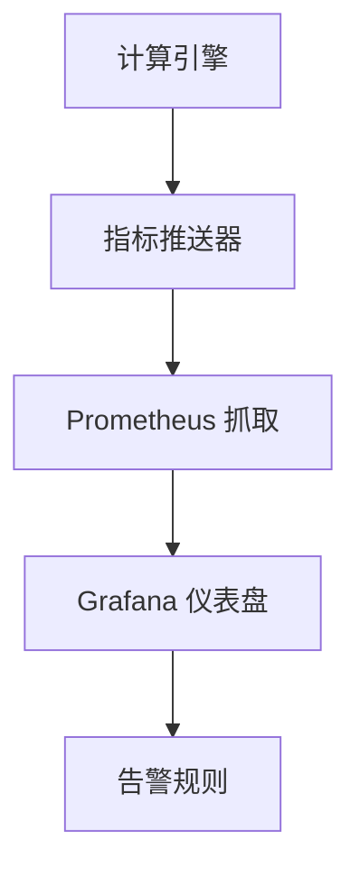
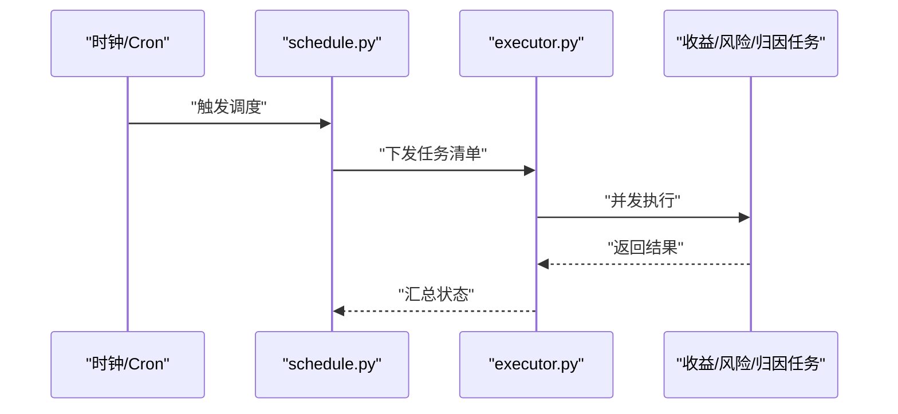
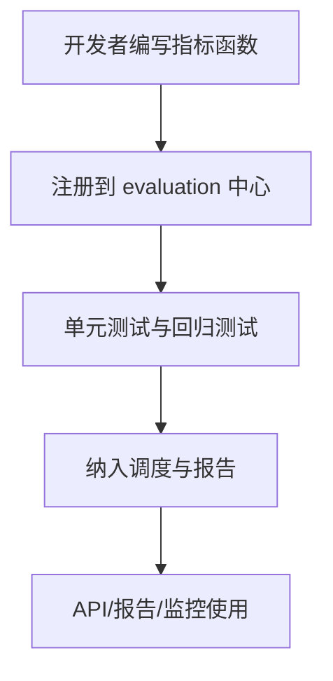
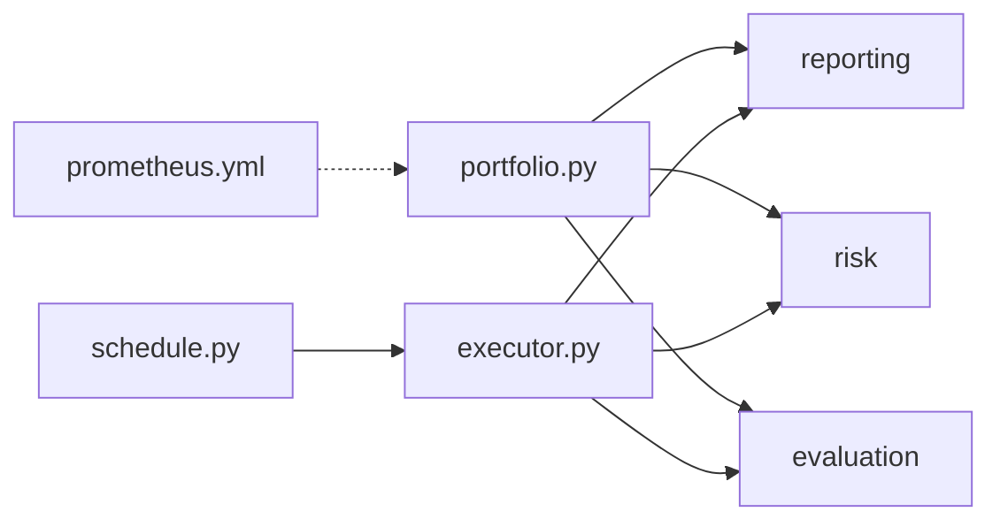

# 绩效分析

<cite>
**本文引用的文件**   
- [apps/api/routers/portfolio.py](file://apps/api/routers/portfolio.py)
- [packages/reporting/](file://packages/reporting/)
- [packages/risk/](file://packages/risk/)
- [packages/evaluation/](file://packages/evaluation/)
- [deploy/prometheus.yml](file://deploy/prometheus.yml)
- [apps/scheduler/executor.py](file://apps/scheduler/executor.py)
- [apps/scheduler/schedule.py](file://apps/scheduler/schedule.py)
- [scripts/register_and_evaluate.py](file://scripts/register_and_evaluate.py)
</cite>

## 目录
1. [简介](#简介)
2. [项目结构](#项目结构)
3. [核心组件](#核心组件)
4. [架构总览](#架构总览)
5. [详细组件分析](#详细组件分析)
6. [依赖关系分析](#依赖关系分析)
7. [性能考虑](#性能考虑)
8. [故障排查指南](#故障排查指南)
9. [结论](#结论)
10. [附录](#附录)

## 简介
本技术文档聚焦于“绩效分析”模块，围绕交易绩效评估指标的计算方法与实现细节展开，覆盖收益分析、风险分析与归因分析三大主题。文档同时说明多时间粒度（日度、周度、月度）的绩效报告生成流程，提供自定义绩效指标的扩展机制，并解释与监控系统的集成及实时绩效展示方案，最后给出可视化呈现与导出能力的落地建议。

## 项目结构
从仓库结构看，绩效相关能力分布在以下位置：
- API 层：组合/账户维度的接口定义位于 apps/api/routers/portfolio.py
- 计算与分析层：
  - reporting：报告与聚合输出
  - risk：风险度量与暴露度计算
  - evaluation：评估指标注册与执行
- 调度与批处理：scheduler 负责定时任务编排与执行
- 监控：prometheus.yml 用于指标采集配置
- 脚本：register_and_evaluate.py 用于评估指标注册与批量评测

图表来源
- [apps/api/routers/portfolio.py](file://apps/api/routers/portfolio.py)
- [packages/reporting/](file://packages/reporting/)
- [packages/risk/](file://packages/risk/)
- [packages/evaluation/](file://packages/evaluation/)
- [apps/scheduler/executor.py](file://apps/scheduler/executor.py)
- [apps/scheduler/schedule.py](file://apps/scheduler/schedule.py)
- [deploy/prometheus.yml](file://deploy/prometheus.yml)
- [scripts/register_and_evaluate.py](file://scripts/register_and_evaluate.py)

章节来源
- [apps/api/routers/portfolio.py](file://apps/api/routers/portfolio.py)
- [packages/reporting/](file://packages/reporting/)
- [packages/risk/](file://packages/risk/)
- [packages/evaluation/](file://packages/evaluation/)
- [apps/scheduler/executor.py](file://apps/scheduler/executor.py)
- [apps/scheduler/schedule.py](file://apps/scheduler/schedule.py)
- [deploy/prometheus.yml](file://deploy/prometheus.yml)
- [scripts/register_and_evaluate.py](file://scripts/register_and_evaluate.py)

## 核心组件
- 收益分析
  - 目标：计算组合/账户在多个时间粒度下的累计收益、年化收益、波动率、夏普比率等基础收益指标。
  - 输入：净值序列或逐笔盈亏、持仓变动、基准序列。
  - 输出：日度/周度/月度收益表、滚动窗口统计、年度化指标。
- 风险分析
  - 目标：衡量下行风险、尾部风险、敞口集中度、相关性风险等。
  - 输入：收益率序列、因子暴露、协方差矩阵、压力情景。
  - 输出：VaR、CVaR、最大回撤、波动率分解、风险预算使用率。
- 归因分析
  - 目标：将超额收益拆解为资产配置、个券选择、交互效应等贡献。
  - 输入：权重序列、基准权重、资产收益、行业/风格因子暴露。
  - 输出：Brinson 归因、因子归因、贡献度排序与可视化数据。
- 报告与导出
  - 目标：按日度/周度/月度生成标准化报告，支持导出为 CSV/JSON/PDF。
  - 输入：上述三类分析结果。
  - 输出：结构化报表、图表数据、归档记录。
- 监控与实时展示
  - 目标：通过 Prometheus 暴露关键绩效指标，供 Grafana 或前端展示。
  - 输入：计算管道产出的指标快照。
  - 输出：Prometheus 可抓取的时间序列指标。

章节来源
- [packages/reporting/](file://packages/reporting/)
- [packages/risk/](file://packages/risk/)
- [packages/evaluation/](file://packages/evaluation/)
- [deploy/prometheus.yml](file://deploy/prometheus.yml)

## 架构总览
整体采用“API 调用 + 批处理调度 + 指标计算 + 报告输出 + 监控暴露”的分层架构。API 层提供查询入口；调度器驱动周期性计算；analysis 层完成收益/风险/归因计算；reporting 层汇总输出；monitoring 层暴露指标。

图表来源
- [apps/api/routers/portfolio.py](file://apps/api/routers/portfolio.py)
- [apps/scheduler/schedule.py](file://apps/scheduler/schedule.py)
- [apps/scheduler/executor.py](file://apps/scheduler/executor.py)
- [packages/evaluation/](file://packages/evaluation/)
- [packages/risk/](file://packages/risk/)
- [packages/reporting/](file://packages/reporting/)
- [deploy/prometheus.yml](file://deploy/prometheus.yml)

## 详细组件分析

### 收益分析组件
- 功能要点
  - 支持日度/周度/月度聚合，提供滚动窗口统计与年度化转换。
  - 兼容多种收益口径（简单收益、对数收益、复权收益）。
  - 与基准对比，计算相对收益与跟踪误差。
- 关键流程
  - 数据准备：对齐时间轴、处理缺失值与停牌。
  - 指标计算：累计收益、年化收益、波动率、夏普比率、索提诺比率等。
  - 输出：时序指标表与摘要统计。
- 复杂度与优化
  - 向量化计算为主，避免逐行循环；大窗口滚动采用增量更新策略。
  - 内存优化：分块计算与流式聚合。
- 错误处理
  - 缺失日期插值策略可配置；异常值检测与剔除。
- 可视化与导出
  - 输出图表所需的数据帧；支持 CSV/JSON 导出。

章节来源
- [packages/reporting/](file://packages/reporting/)
- [packages/evaluation/](file://packages/evaluation/)

### 风险分析组件
- 功能要点
  - 市场风险：VaR、CVaR、波动率分解、Beta/Greeks（如适用）。
  - 集中度风险：行业/风格/个券集中度、赫芬达尔指数。
  - 流动性与尾部风险：滑点假设、极端情景回测。
- 关键流程
  - 输入：收益率序列、协方差矩阵、因子暴露、压力参数。
  - 计算：历史模拟法/参数法 VaR、蒙特卡洛（可选）、风险预算分配。
  - 输出：风险指标表、压力测试报告、风险限额使用率。
- 复杂度与优化
  - 协方差估计采用缩尾/正则化方法；大规模资产采用低秩近似。
- 错误处理
  - 奇异矩阵处理、负方差修正、极端值截断。
- 可视化与导出
  - 风险热力图、分布直方图、压力曲线；导出 PDF/CSV。

图表来源
- [packages/risk/](file://packages/risk/)
- [packages/reporting/](file://packages/reporting/)

章节来源
- [packages/risk/](file://packages/risk/)
- [packages/reporting/](file://packages/reporting/)

### 归因分析组件
- 功能要点
  - Brinson 归因：资产配置贡献、个券选择贡献、交互效应。
  - 因子归因：风格/行业因子暴露与收益贡献。
  - 滚动归因：按日/周/月滚动计算贡献度。
- 关键流程
  - 输入：组合权重、基准权重、资产收益、因子暴露。
  - 计算：各层级贡献度分解、累积贡献与残差。
  - 输出：归因表、贡献度排序、可视化数据。
- 复杂度与优化
  - 分层归因采用递归分解；大数据集采用稀疏矩阵加速。
- 错误处理
  - 权重未归一化校验、零权重处理、因子共线性诊断。
- 可视化与导出
  - 瀑布图、堆叠柱状图；导出 JSON/CSV。

章节来源
- [packages/reporting/](file://packages/reporting/)
- [packages/evaluation/](file://packages/evaluation/)

### 报告与导出组件
- 功能要点
  - 统一报告模板：日度/周度/月度报告，包含收益、风险、归因摘要。
  - 导出格式：CSV、JSON、PDF（含图表）。
  - 版本与归档：报告元数据、生成时间、数据来源追踪。
- 关键流程
  - 组装：聚合收益/风险/归因结果。
  - 渲染：表格与图表数据生成。
  - 导出：写入文件系统或对象存储。
- 错误处理
  - 路径权限检查、编码一致性、空数据集保护。
- 可视化与导出
  - 内置图表数据；支持外部 BI 工具对接。

图表来源
- [packages/reporting/](file://packages/reporting/)

章节来源
- [packages/reporting/](file://packages/reporting/)

### 监控与实时展示组件
- 功能要点
  - 通过 Prometheus 暴露关键绩效指标（KPI），如当日收益、VaR、最大回撤、风险限额使用率。
  - 支持 Grafana 仪表盘与告警规则。
- 关键流程
  - 计算完成后推送指标快照至本地/远程收集端。
  - Prometheus 定期抓取，Grafana 展示趋势与阈值告警。
- 错误处理
  - 指标推送失败重试、降级为本地缓存。
- 可视化与导出
  - 仪表盘截图、CSV 导出、Webhook 通知。

图表来源
- [deploy/prometheus.yml](file://deploy/prometheus.yml)

章节来源
- [deploy/prometheus.yml](file://deploy/prometheus.yml)

### 调度与批处理组件
- 功能要点
  - schedule.py 定义任务周期（日度/周度/月度）。
  - executor.py 负责任务分发、依赖解析与执行。
- 关键流程
  - 触发：基于 Cron 或事件驱动。
  - 执行：并行/串行执行收益/风险/归因计算。
  - 产出：报告与指标快照。
- 错误处理
  - 任务重试、失败告警、断点续算。
- 可视化与导出
  - 任务执行日志、耗时统计、资源占用。

图表来源
- [apps/scheduler/schedule.py](file://apps/scheduler/schedule.py)
- [apps/scheduler/executor.py](file://apps/scheduler/executor.py)

章节来源
- [apps/scheduler/schedule.py](file://apps/scheduler/schedule.py)
- [apps/scheduler/executor.py](file://apps/scheduler/executor.py)

### 自定义绩效指标扩展机制
- 设计思路
  - 通过 evaluation 模块的指标注册中心，新增自定义指标无需修改核心逻辑。
  - 指标函数需遵循统一签名与返回约定（名称、单位、频率、描述）。
- 扩展步骤
  - 编写指标函数：接收必要输入，返回结构化结果。
  - 注册指标：在注册表中声明元数据与依赖。
  - 验证与测试：单元测试覆盖边界条件与数值稳定性。
  - 发布与启用：纳入调度任务与报告模板。
- 示例入口
  - 参考 register_and_evaluate.py 中的注册与评测流程。

图表来源
- [packages/evaluation/](file://packages/evaluation/)
- [scripts/register_and_evaluate.py](file://scripts/register_and_evaluate.py)

章节来源
- [packages/evaluation/](file://packages/evaluation/)
- [scripts/register_and_evaluate.py](file://scripts/register_and_evaluate.py)

## 依赖关系分析
- 组件耦合
  - API 层依赖 reporting、risk、evaluation 三个分析层。
  - scheduler 作为编排者，协调各层执行顺序与依赖。
  - monitoring 独立于计算链路，仅消费指标快照。
- 外部依赖
  - 数据库/对象存储：持久化报告与中间结果。
  - Prometheus：指标采集与告警。
- 潜在循环依赖
  - 确保 evaluation 不反向依赖 reporting；risk 与 reporting 解耦通过数据契约。

图表来源
- [apps/api/routers/portfolio.py](file://apps/api/routers/portfolio.py)
- [packages/reporting/](file://packages/reporting/)
- [packages/risk/](file://packages/risk/)
- [packages/evaluation/](file://packages/evaluation/)
- [apps/scheduler/schedule.py](file://apps/scheduler/schedule.py)
- [apps/scheduler/executor.py](file://apps/scheduler/executor.py)
- [deploy/prometheus.yml](file://deploy/prometheus.yml)

章节来源
- [apps/api/routers/portfolio.py](file://apps/api/routers/portfolio.py)
- [packages/reporting/](file://packages/reporting/)
- [packages/risk/](file://packages/risk/)
- [packages/evaluation/](file://packages/evaluation/)
- [apps/scheduler/schedule.py](file://apps/scheduler/schedule.py)
- [apps/scheduler/executor.py](file://apps/scheduler/executor.py)
- [deploy/prometheus.yml](file://deploy/prometheus.yml)

## 性能考虑
- 计算性能
  - 优先使用向量化与分块计算；滚动窗口采用增量算法。
  - 协方差估计与因子模型采用近似与降维技术。
- I/O 性能
  - 报告导出采用异步写入与压缩；大文件分片上传。
- 并发与资源
  - 调度器支持并行任务；限制并发度以避免资源争用。
- 监控与可观测性
  - 关键路径埋点，记录耗时与错误率；Prometheus 指标采样间隔合理设置。

[本节为通用指导，不涉及具体文件分析]

## 故障排查指南
- 常见问题
  - 指标缺失：检查时间对齐与缺失值处理策略。
  - 报告导出失败：确认路径权限与磁盘空间。
  - 监控无数据：核对 Prometheus 抓取配置与网络连通性。
- 定位方法
  - 查看调度器日志与任务状态。
  - 检查中间结果与数据血缘。
  - 使用最小数据集复现问题。
- 恢复措施
  - 重试失败任务；清理临时文件；重启监控采集端。

章节来源
- [apps/scheduler/executor.py](file://apps/scheduler/executor.py)
- [deploy/prometheus.yml](file://deploy/prometheus.yml)

## 结论
本绩效分析模块以清晰的层次划分与可扩展的指标注册机制为核心，实现了收益、风险与归因的全面分析，并通过调度器与监控系统形成闭环。通过统一的报告与导出能力，满足多时间粒度的业务需求。建议在后续迭代中持续优化计算性能与可视化体验，完善告警与审计能力。

[本节为总结性内容，不涉及具体文件分析]

## 附录
- 术语
  - 收益：组合价值随时间的变化率。
  - 风险：收益的不确定性与下行损失的可能性。
  - 归因：将超额收益分解为不同来源的贡献。
- 最佳实践
  - 指标命名规范与单位统一。
  - 报告模板版本化管理。
  - 监控指标与业务阈值联动。

[本节为概念性内容，不涉及具体文件分析]