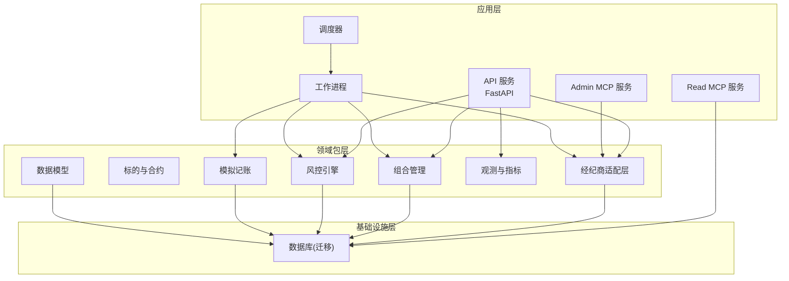
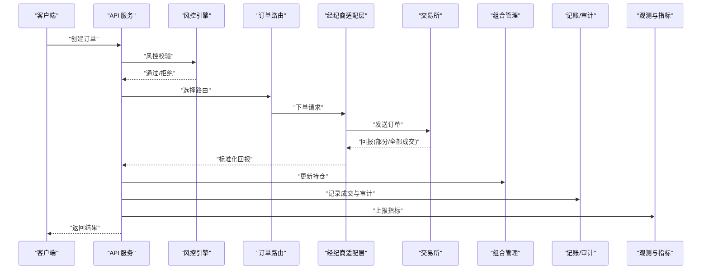
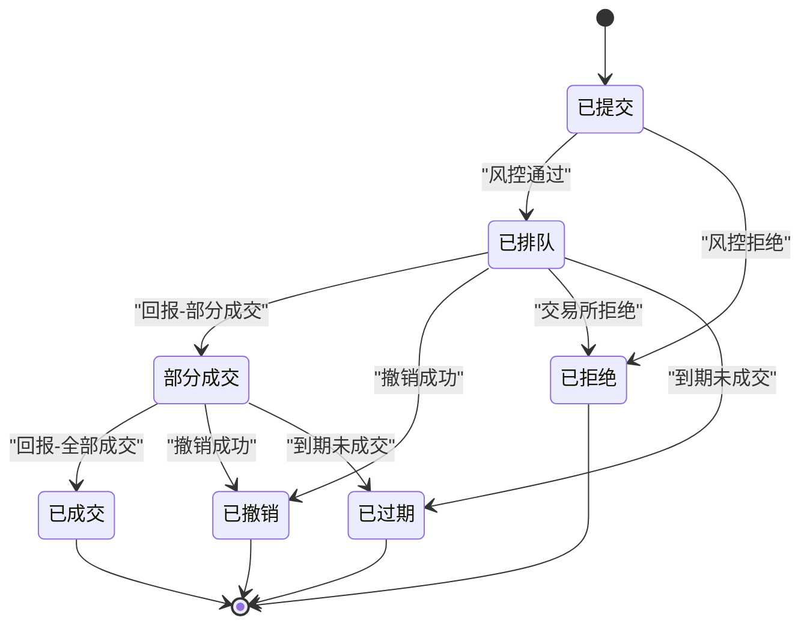
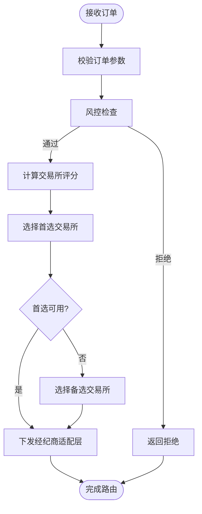
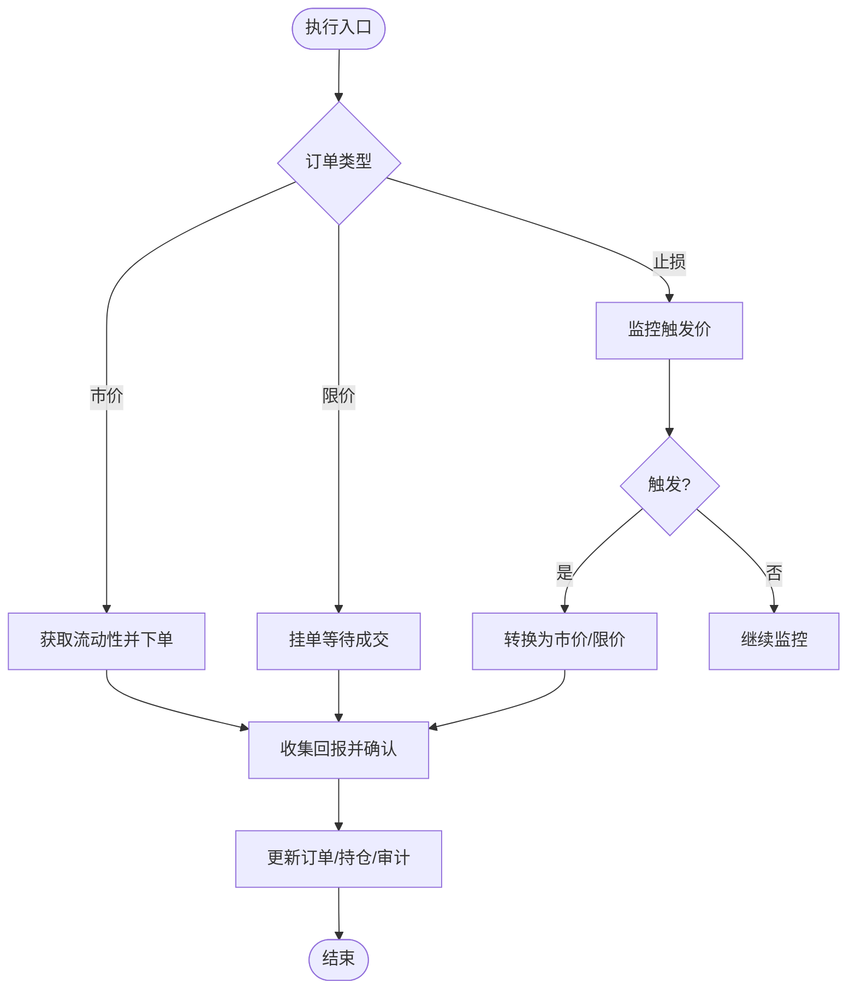
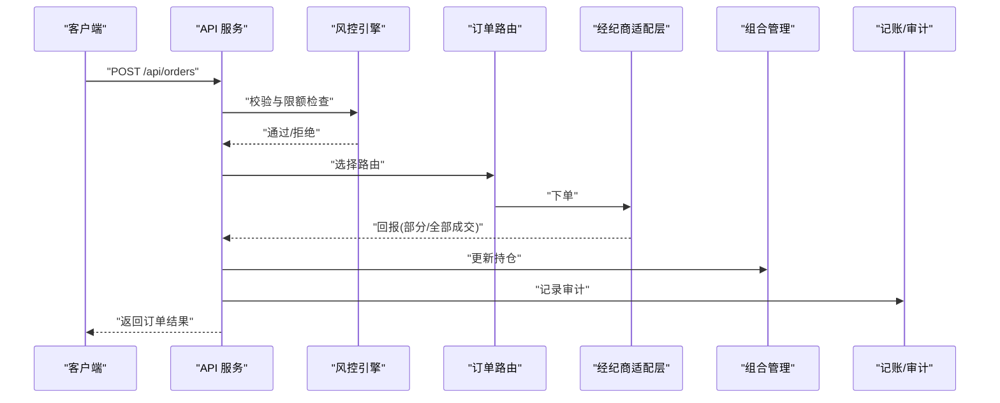
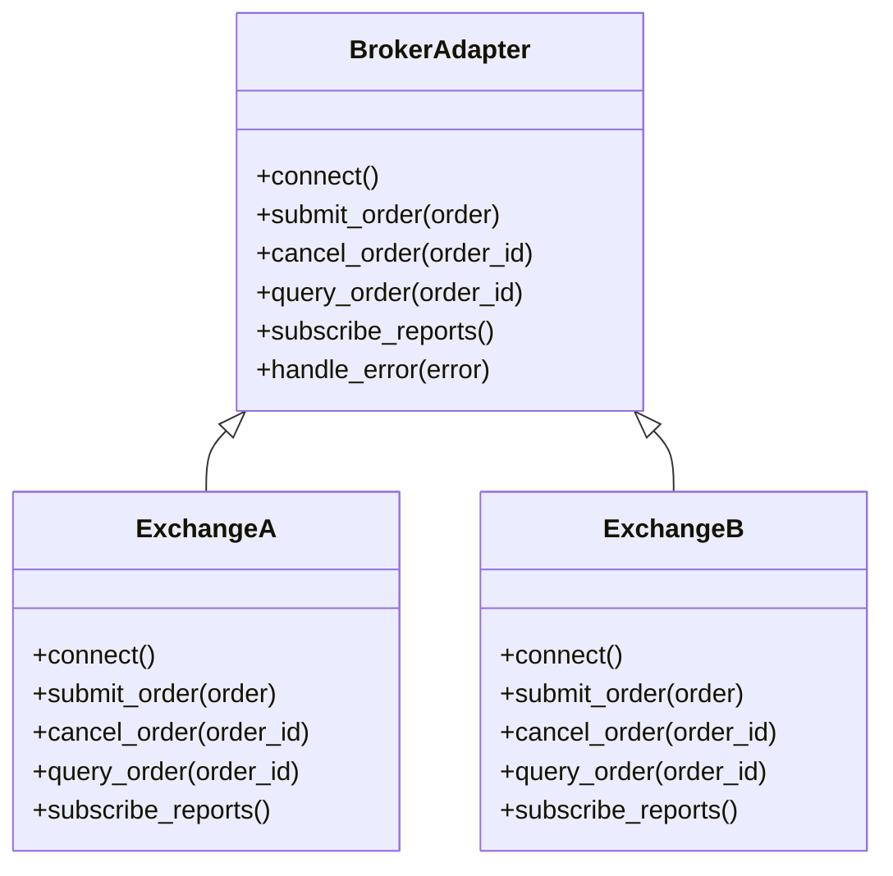
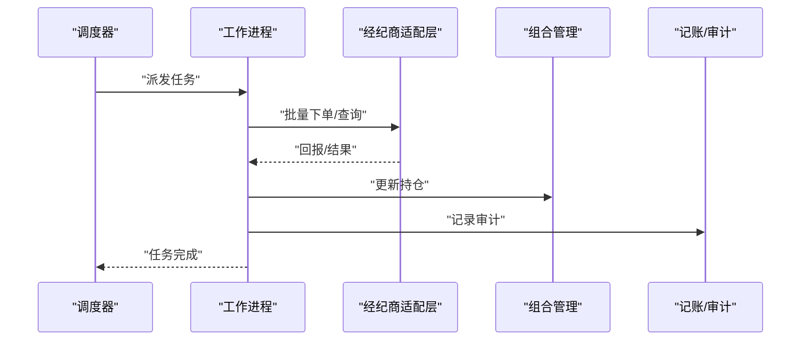
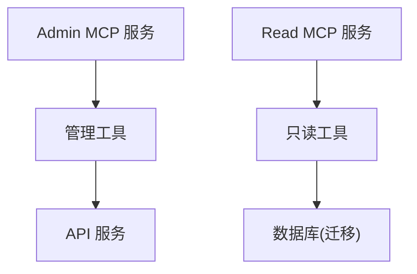
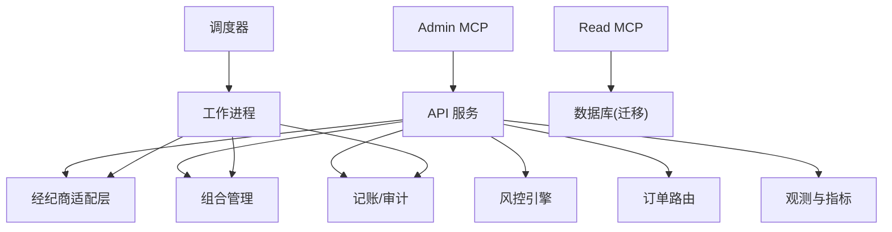

# 订单管理系统

<cite>
**本文引用的文件**   
- [apps/api/main.py](file://apps/api/main.py)
- [apps/api/deps.py](file://apps/api/deps.py)
- [apps/quant-admin-mcp/server.py](file://apps/quant-admin-mcp/server.py)
- [apps/quant-admin-mcp/tools.py](file://apps/quant-admin-mcp/tools.py)
- [apps/quant-read-mcp/server.py](file://apps/quant-read-mcp/server.py)
- [apps/quant-read-mcp/db_backends.py](file://apps/quant-read-mcp/db_backends.py)
- [apps/scheduler/executor.py](file://apps/scheduler/executor.py)
- [apps/scheduler/schedule.py](file://apps/scheduler/schedule.py)
- [apps/worker/main.py](file://apps/worker/main.py)
- [apps/worker/tasks.py](file://apps/worker/tasks.py)
- [packages/broker/__init__.py](file://packages/broker/__init__.py)
- [packages/instruments/__init__.py](file://packages/instruments/__init__.py)
- [packages/portfolio/__init__.py](file://packages/portfolio/__init__.py)
- [packages/risk/__init__.py](file://packages/risk/__init__.py)
- [packages/ledger_paper/__init__.py](file://packages/ledger_paper/__init__.py)
- [packages/observability/__init__.py](file://packages/observability/__init__.py)
- [packages/models/__init__.py](file://packages/models/__init__.py)
- [sql/migrations/env.py](file://sql/migrations/env.py)
- [alembic.ini](file://alembic.ini)
</cite>

## 目录
1. [简介](#简介)
2. [项目结构](#项目结构)
3. [核心组件](#核心组件)
4. [架构总览](#架构总览)
5. [详细组件分析](#详细组件分析)
6. [依赖关系分析](#依赖关系分析)
7. [性能考虑](#性能考虑)
8. [故障排查指南](#故障排查指南)
9. [结论](#结论)
10. [附录](#附录)

## 简介
本技术文档围绕“订单管理系统”展开，聚焦于订单生命周期管理、订单路由机制与执行算法的实现细节。文档涵盖：
- 订单状态转换模型与流转规则
- 订单匹配逻辑与成交确认流程
- 支持的订单类型（市价单、限价单、止损单等）及其实现要点
- 订单创建、修改、取消的API接口说明
- 与交易所接口的集成方式与错误处理机制
- 执行性能优化策略与常见问题解决方案

为保证可追溯性，所有涉及具体代码实现的章节均附带“章节来源”，并在需要时提供“图示来源”。

## 项目结构
系统采用多应用+多包的分层组织方式：
- 应用层：HTTP API、MCP服务、调度器、工作进程
- 领域包层：经纪商适配、标的、组合、风控、记账、观测、数据模型等
- 基础设施层：数据库迁移与环境配置

**图示来源**
- [apps/api/main.py](file://apps/api/main.py)
- [apps/quant-admin-mcp/server.py](file://apps/quant-admin-mcp/server.py)
- [apps/quant-read-mcp/server.py](file://apps/quant-read-mcp/server.py)
- [apps/scheduler/executor.py](file://apps/scheduler/executor.py)
- [apps/worker/main.py](file://apps/worker/main.py)
- [packages/broker/__init__.py](file://packages/broker/__init__.py)
- [packages/instruments/__init__.py](file://packages/instruments/__init__.py)
- [packages/portfolio/__init__.py](file://packages/portfolio/__init__.py)
- [packages/risk/__init__.py](file://packages/risk/__init__.py)
- [packages/ledger_paper/__init__.py](file://packages/ledger_paper/__init__.py)
- [packages/observability/__init__.py](file://packages/observability/__init__.py)
- [packages/models/__init__.py](file://packages/models/__init__.py)
- [sql/migrations/env.py](file://sql/migrations/env.py)

**章节来源**
- [apps/api/main.py](file://apps/api/main.py)
- [apps/quant-admin-mcp/server.py](file://apps/quant-admin-mcp/server.py)
- [apps/quant-read-mcp/server.py](file://apps/quant-read-mcp/server.py)
- [apps/scheduler/executor.py](file://apps/scheduler/executor.py)
- [apps/worker/main.py](file://apps/worker/main.py)
- [packages/broker/__init__.py](file://packages/broker/__init__.py)
- [packages/instruments/__init__.py](file://packages/instruments/__init__.py)
- [packages/portfolio/__init__.py](file://packages/portfolio/__init__.py)
- [packages/risk/__init__.py](file://packages/risk/__init__.py)
- [packages/ledger_paper/__init__.py](file://packages/ledger_paper/__init__.py)
- [packages/observability/__init__.py](file://packages/observability/__init__.py)
- [packages/models/__init__.py](file://packages/models/__init__.py)
- [sql/migrations/env.py](file://sql/migrations/env.py)

## 核心组件
- 订单生命周期管理
  - 状态包括：已提交、已排队、部分成交、已成交、已撤销、已拒绝、已过期等
  - 关键事件：创建、校验通过、进入队列、触发条件、部分成交、完全成交、撤销、拒绝、过期
- 订单路由机制
  - 基于标的属性、流动性、风险限额、交易所能力选择最优路由
  - 支持多交易所并行路由与回退策略
- 执行算法
  - 市价单：立即按可用流动性成交
  - 限价单：在价格阈值内等待或分批成交
  - 止损单：达到触发价后转为市价或限价单继续执行
- 订单匹配与成交确认
  - 内部撮合优先（如适用），否则转发至外部交易所
  - 成交回报异步回调，更新订单与持仓、生成审计日志
- 订单类型支持
  - 市价单、限价单、止损单、止损限价单、跟踪止损等
  - 时间有效性：当日有效、IOC、FOK等
- API接口
  - 创建订单、查询订单、修改订单（改价/改量）、取消订单
  - 批量操作与幂等键保障
- 交易所集成
  - 统一适配器抽象，封装连接、认证、下单、撤单、查询、回报订阅
  - 错误分类：网络异常、业务拒绝、风控拦截、超时重试
- 性能优化
  - 批量化下单、零拷贝序列化、连接池、背压控制、异步IO
  - 指标埋点与慢路径告警

**章节来源**
- [packages/broker/__init__.py](file://packages/broker/__init__.py)
- [packages/instruments/__init__.py](file://packages/instruments/__init__.py)
- [packages/portfolio/__init__.py](file://packages/portfolio/__init__.py)
- [packages/risk/__init__.py](file://packages/risk/__init__.py)
- [packages/ledger_paper/__init__.py](file://packages/ledger_paper/__init__.py)
- [packages/observability/__init__.py](file://packages/observability/__init__.py)
- [packages/models/__init__.py](file://packages/models/__init__.py)

## 架构总览
系统以API为入口，结合MCP工具扩展管理能力；调度器与工作进程负责后台任务与执行；经纪商适配层屏蔽不同交易所差异；组合与风控贯穿全链路；观测模块提供可观测性；数据模型与迁移确保一致性。

**图示来源**
- [apps/api/main.py](file://apps/api/main.py)
- [packages/risk/__init__.py](file://packages/risk/__init__.py)
- [packages/broker/__init__.py](file://packages/broker/__init__.py)
- [packages/portfolio/__init__.py](file://packages/portfolio/__init__.py)
- [packages/ledger_paper/__init__.py](file://packages/ledger_paper/__init__.py)
- [packages/observability/__init__.py](file://packages/observability/__init__.py)

## 详细组件分析

### 订单生命周期与状态机
- 状态定义
  - 已提交：订单进入系统，尚未通过风控
  - 已排队：风控通过，进入路由与队列
  - 部分成交：已有部分数量成交
  - 已成交：全部数量成交
  - 已撤销：主动或被动撤销
  - 已拒绝：风控或交易所拒绝
  - 已过期：超过有效期未成交
- 转换规则
  - 已提交 → 已排队：风控通过
  - 已排队 → 部分成交：收到回报
  - 部分成交 → 已成交：剩余数量成交
  - 任意活跃态 → 已撤销：撤销成功
  - 任意非终态 → 已拒绝：校验失败或交易所拒绝
  - 任意非终态 → 已过期：到达失效时间

**图示来源**
- [packages/models/__init__.py](file://packages/models/__init__.py)
- [packages/broker/__init__.py](file://packages/broker/__init__.py)
- [packages/risk/__init__.py](file://packages/risk/__init__.py)

**章节来源**
- [packages/models/__init__.py](file://packages/models/__init__.py)
- [packages/broker/__init__.py](file://packages/broker/__init__.py)
- [packages/risk/__init__.py](file://packages/risk/__init__.py)

### 订单路由机制
- 路由决策维度
  - 标的特性：流动性、交易时段、涨跌停限制
  - 交易所能力：订单类型支持、延迟、费用
  - 风险约束：头寸上限、集中度、波动率阈值
  - 执行质量：滑点预估、冲击成本、历史成交分布
- 路由策略
  - 首选交易所：综合评分最高
  - 备选交易所：主选不可用时的回退
  - 分仓策略：大单拆分为多笔小单分散到多个交易所
- 动态调整
  - 实时行情变化触发重新评估
  - 风控阈值突破强制切换或暂停

**图示来源**
- [packages/broker/__init__.py](file://packages/broker/__init__.py)
- [packages/risk/__init__.py](file://packages/risk/__init__.py)
- [packages/instruments/__init__.py](file://packages/instruments/__init__.py)

**章节来源**
- [packages/broker/__init__.py](file://packages/broker/__init__.py)
- [packages/risk/__init__.py](file://packages/risk/__init__.py)
- [packages/instruments/__init__.py](file://packages/instruments/__init__.py)

### 执行算法与匹配逻辑
- 市价单
  - 立即按当前最优报价成交，允许滑点阈值控制
  - 若流动性不足，自动拆分并路由至多交易所
- 限价单
  - 仅在价格阈值内成交，支持IOC/FOK时间有效性
  - 深度监控与动态重定价（可选）
- 止损单
  - 达到触发价后转换为市价或限价单继续执行
  - 防抖动与去重逻辑避免重复触发
- 匹配与确认
  - 内部撮合优先（如有），否则转发外部
  - 回报标准化，合并部分成交，最终确认

**图示来源**
- [packages/broker/__init__.py](file://packages/broker/__init__.py)
- [packages/portfolio/__init__.py](file://packages/portfolio/__init__.py)
- [packages/ledger_paper/__init__.py](file://packages/ledger_paper/__init__.py)

**章节来源**
- [packages/broker/__init__.py](file://packages/broker/__init__.py)
- [packages/portfolio/__init__.py](file://packages/portfolio/__init__.py)
- [packages/ledger_paper/__init__.py](file://packages/ledger_paper/__init__.py)

### API接口文档
- 创建订单
  - 方法：POST /api/orders
  - 请求体字段：标的ID、方向、数量、类型、价格（限价/止损）、时间有效性、幂等键
  - 响应：订单ID、状态、预期路由、风控结果
- 查询订单
  - 方法：GET /api/orders/{order_id}
  - 响应：订单详情、历史回报、当前状态
- 修改订单
  - 方法：PUT /api/orders/{order_id}
  - 支持：改价、改量、变更时间有效性
  - 约束：仅允许在“已排队/部分成交”状态修改
- 取消订单
  - 方法：DELETE /api/orders/{order_id}
  - 响应：撤销结果、剩余数量
- 批量操作
  - 方法：POST /api/orders/batch
  - 支持：批量创建、批量取消
  - 幂等：使用幂等键保证重复提交安全

**图示来源**
- [apps/api/main.py](file://apps/api/main.py)
- [packages/risk/__init__.py](file://packages/risk/__init__.py)
- [packages/broker/__init__.py](file://packages/broker/__init__.py)
- [packages/portfolio/__init__.py](file://packages/portfolio/__init__.py)
- [packages/ledger_paper/__init__.py](file://packages/ledger_paper/__init__.py)

**章节来源**
- [apps/api/main.py](file://apps/api/main.py)
- [packages/risk/__init__.py](file://packages/risk/__init__.py)
- [packages/broker/__init__.py](file://packages/broker/__init__.py)
- [packages/portfolio/__init__.py](file://packages/portfolio/__init__.py)
- [packages/ledger_paper/__init__.py](file://packages/ledger_paper/__init__.py)

### 与交易所接口的集成与错误处理
- 统一适配器
  - 抽象连接管理、认证、下单、撤单、查询、回报订阅
  - 标准化错误码映射与重试策略
- 错误分类
  - 网络异常：超时、断线、DNS解析失败
  - 业务拒绝：参数非法、额度不足、标的停牌
  - 风控拦截：超限、集中度超标、波动率异常
  - 系统错误：内部校验失败、序列化异常
- 恢复机制
  - 指数退避重试、熔断降级、回退至备选交易所
  - 幂等键与去重表防止重复下单

**图示来源**
- [packages/broker/__init__.py](file://packages/broker/__init__.py)

**章节来源**
- [packages/broker/__init__.py](file://packages/broker/__init__.py)

### 调度与工作流
- 调度器
  - 定时任务：对账、清理过期订单、健康检查
  - 事件驱动：回报回调触发后续处理
- 工作进程
  - 消费任务队列，执行耗时操作（批量下单、报表生成）
  - 失败重试与死信队列

**图示来源**
- [apps/scheduler/executor.py](file://apps/scheduler/executor.py)
- [apps/worker/main.py](file://apps/worker/main.py)
- [packages/broker/__init__.py](file://packages/broker/__init__.py)
- [packages/portfolio/__init__.py](file://packages/portfolio/__init__.py)
- [packages/ledger_paper/__init__.py](file://packages/ledger_paper/__init__.py)

**章节来源**
- [apps/scheduler/executor.py](file://apps/scheduler/executor.py)
- [apps/worker/main.py](file://apps/worker/main.py)
- [packages/broker/__init__.py](file://packages/broker/__init__.py)
- [packages/portfolio/__init__.py](file://packages/portfolio/__init__.py)
- [packages/ledger_paper/__init__.py](file://packages/ledger_paper/__init__.py)

### MCP工具与管理面
- Admin MCP
  - 提供管理工具：订单查询、撤销、风控参数调整
- Read MCP
  - 提供只读工具：市场数据、历史成交、审计日志

**图示来源**
- [apps/quant-admin-mcp/server.py](file://apps/quant-admin-mcp/server.py)
- [apps/quant-admin-mcp/tools.py](file://apps/quant-admin-mcp/tools.py)
- [apps/quant-read-mcp/server.py](file://apps/quant-read-mcp/server.py)
- [apps/quant-read-mcp/db_backends.py](file://apps/quant-read-mcp/db_backends.py)

**章节来源**
- [apps/quant-admin-mcp/server.py](file://apps/quant-admin-mcp/server.py)
- [apps/quant-admin-mcp/tools.py](file://apps/quant-admin-mcp/tools.py)
- [apps/quant-read-mcp/server.py](file://apps/quant-read-mcp/server.py)
- [apps/quant-read-mcp/db_backends.py](file://apps/quant-read-mcp/db_backends.py)

## 依赖关系分析
- 组件耦合
  - API依赖风控、路由、经纪商适配、组合、记账、观测
  - 调度与工作进程依赖经纪商适配、组合、记账
  - MCP服务依赖API与数据库后端
- 外部依赖
  - 交易所SDK、消息队列、数据库、指标采集

**图示来源**
- [apps/api/main.py](file://apps/api/main.py)
- [apps/scheduler/executor.py](file://apps/scheduler/executor.py)
- [apps/worker/main.py](file://apps/worker/main.py)
- [apps/quant-admin-mcp/server.py](file://apps/quant-admin-mcp/server.py)
- [apps/quant-read-mcp/server.py](file://apps/quant-read-mcp/server.py)
- [packages/broker/__init__.py](file://packages/broker/__init__.py)
- [packages/portfolio/__init__.py](file://packages/portfolio/__init__.py)
- [packages/ledger_paper/__init__.py](file://packages/ledger_paper/__init__.py)
- [packages/observability/__init__.py](file://packages/observability/__init__.py)
- [sql/migrations/env.py](file://sql/migrations/env.py)

**章节来源**
- [apps/api/main.py](file://apps/api/main.py)
- [apps/scheduler/executor.py](file://apps/scheduler/executor.py)
- [apps/worker/main.py](file://apps/worker/main.py)
- [apps/quant-admin-mcp/server.py](file://apps/quant-admin-mcp/server.py)
- [apps/quant-read-mcp/server.py](file://apps/quant-read-mcp/server.py)
- [packages/broker/__init__.py](file://packages/broker/__init__.py)
- [packages/portfolio/__init__.py](file://packages/portfolio/__init__.py)
- [packages/ledger_paper/__init__.py](file://packages/ledger_paper/__init__.py)
- [packages/observability/__init__.py](file://packages/observability/__init__.py)
- [sql/migrations/env.py](file://sql/migrations/env.py)

## 性能考虑
- 批量化与并发
  - 批量下单减少网络往返
  - 并发路由与下单，注意背压与限流
- 序列化与传输
  - 使用高效序列化格式，避免对象复制
  - 压缩与分片传输大报文
- 资源管理
  - 连接池复用，避免频繁握手
  - 内存池与对象复用降低GC压力
- 可观测性与调优
  - 指标埋点：延迟、吞吐、错误率
  - 慢路径追踪与热点定位
  - 容量规划与弹性扩缩容

[本节为通用指导，不直接分析具体文件]

## 故障排查指南
- 常见问题
  - 订单被拒绝：检查风控规则、标的状态、参数合法性
  - 部分成交未更新：核对回报订阅与合并逻辑
  - 撤销失败：确认订单状态与交易所限制
  - 超时与重试：观察网络状况与指数退避策略
- 诊断步骤
  - 查看审计日志与指标
  - 复现最小用例，隔离问题域
  - 对比不同交易所表现，定位适配层差异
- 恢复建议
  - 启用熔断与回退
  - 幂等键与去重表保障一致性
  - 定期演练灾难恢复

**章节来源**
- [packages/broker/__init__.py](file://packages/broker/__init__.py)
- [packages/observability/__init__.py](file://packages/observability/__init__.py)
- [packages/ledger_paper/__init__.py](file://packages/ledger_paper/__init__.py)

## 结论
本订单管理系统通过分层架构与统一适配，实现了灵活的订单生命周期管理、智能路由与稳健的执行算法。API与MCP提供了丰富的管理与只读能力，配合调度与工作进程保障后台任务的可靠执行。通过完善的错误处理与性能优化策略，系统在复杂市场环境下具备高可用与可扩展性。

[本节为总结，不直接分析具体文件]

## 附录
- 配置与环境
  - 数据库迁移与环境变量
  - 交易所接入参数与密钥管理
- 术语表
  - IOC、FOK、止损、止损限价、跟踪止损等

**章节来源**
- [alembic.ini](file://alembic.ini)
- [sql/migrations/env.py](file://sql/migrations/env.py)