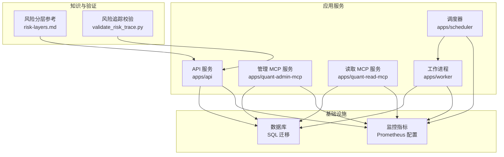
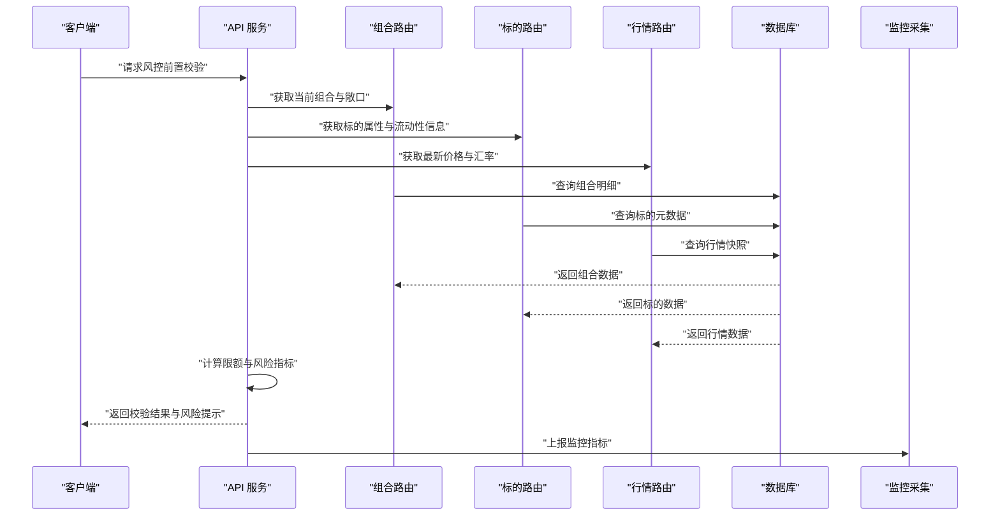
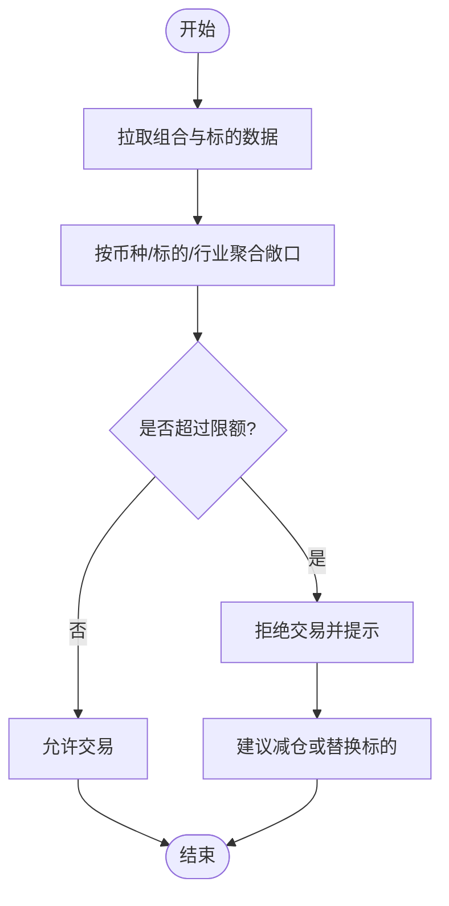
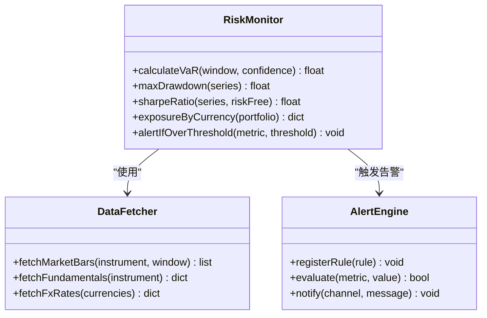
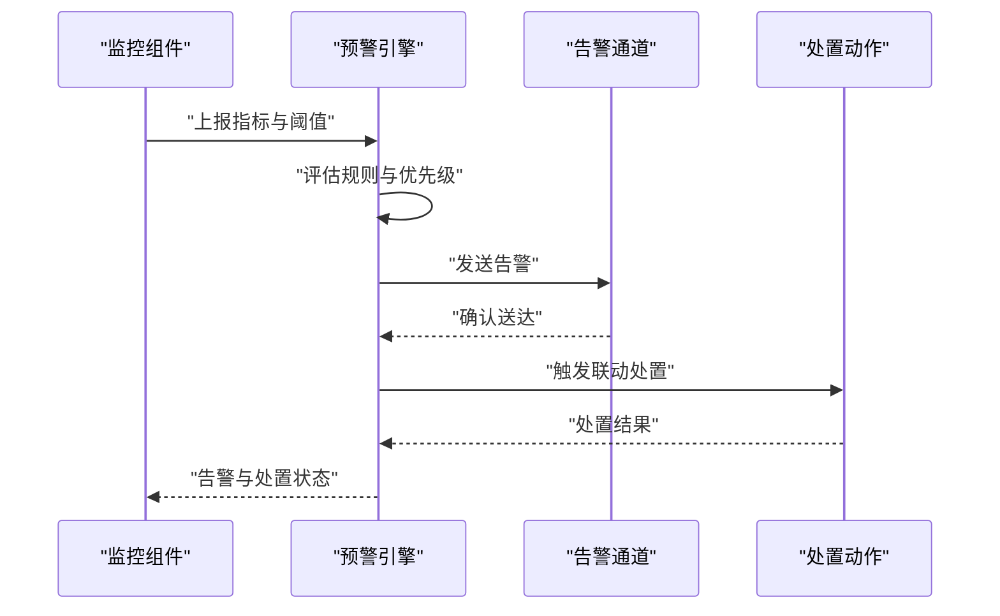
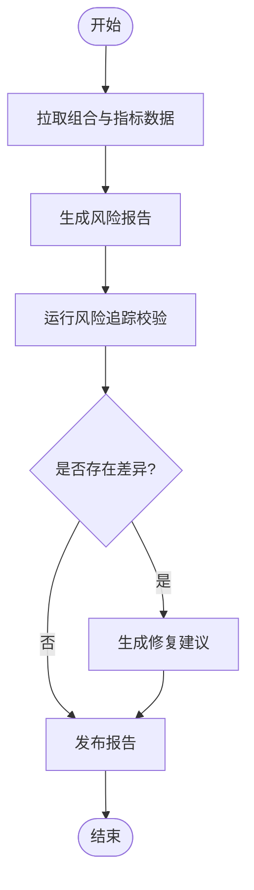
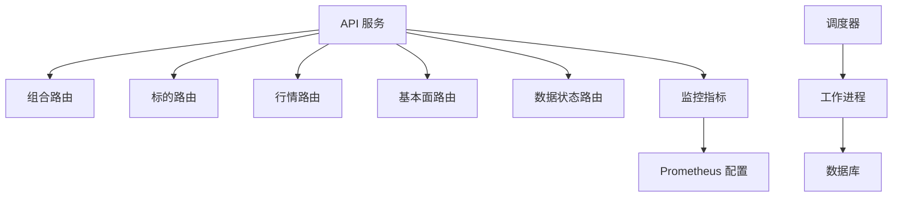

# 风险控制机制

<cite>
**本文引用的文件**   
- [packages/risk](file://packages/risk)
- [apps/api/routers/portfolio.py](file://apps/api/routers/portfolio.py)
- [apps/api/routers/instruments.py](file://apps/api/routers/instruments.py)
- [apps/api/routers/markets.py](file://apps/api/routers/markets.py)
- [apps/api/routers/forecast.py](file://apps/api/routers/forecast.py)
- [apps/api/routers/fundamentals.py](file://apps/api/routers/fundamentals.py)
- [apps/api/routers/data_status.py](file://apps/api/routers/data_status.py)
- [apps/api/routers/admin_ingestion.py](file://apps/api/routers/admin_ingestion.py)
- [apps/api/routers/scheduler.py](file://apps/api/routers/scheduler.py)
- [apps/api/main.py](file://apps/api/main.py)
- [apps/api/deps.py](file://apps/api/deps.py)
- [apps/quant-admin-mcp/server.py](file://apps/quant-admin-mcp/server.py)
- [apps/quant-admin-mcp/tools.py](file://apps/quant-admin-mcp/tools.py)
- [apps/quant-read-mcp/server.py](file://apps/quant-read-mcp/server.py)
- [apps/quant-read-mcp/tools.py](file://apps/quant-read-mcp/tools.py)
- [apps/quant-read-mcp/db_backends.py](file://apps/quant-read-mcp/db_backends.py)
- [apps/scheduler/executor.py](file://apps/scheduler/executor.py)
- [apps/scheduler/schedule.py](file://apps/scheduler/schedule.py)
- [apps/worker/main.py](file://apps/worker/main.py)
- [apps/worker/tasks.py](file://apps/worker/tasks.py)
- [configs/base.yaml](file://configs/base.yaml)
- [configs/dev.yaml](file://configs/dev.yaml)
- [deploy/docker-compose.yml](file://deploy/docker-compose.yml)
- [deploy/prometheus.yml](file://deploy/prometheus.yml)
- [sql/migrations/20260715_0006_fund_fx_portfolio.py](file://sql/migrations/20260715_0006_fund_fx_portfolio.py)
- [skills/cross-market-quant-research/references/risk-layers.md](file://skills/cross-market-quant-research/references/risk-layers.md)
- [skills/cross-market-quant-research/scripts/validate_risk_trace.py](file://skills/cross-market-quant-research/scripts/validate_risk_trace.py)
- [tests/unit/test_risk_currency_cap.py](file://tests/unit/test_risk_currency_cap.py)
</cite>

## 目录
1. [简介](#简介)
2. [项目结构](#项目结构)
3. [核心组件](#核心组件)
4. [架构总览](#架构总览)
5. [详细组件分析](#详细组件分析)
6. [依赖关系分析](#依赖关系分析)
7. [性能考虑](#性能考虑)
8. [故障排查指南](#故障排查指南)
9. [结论](#结论)
10. [附录](#附录)

## 简介
本技术文档围绕“风险控制机制”展开，聚焦风险限额控制、实时风险监控与风险预警系统的实现原理。文档覆盖市场风险、信用风险、操作风险的量化模型思路，给出风险指标（VaR、最大回撤、夏普比率等）的计算方法说明，并提供风险限额配置与动态调整策略、风险报告生成与告警通知机制，以及性能优化与故障恢复建议。内容基于仓库中现有模块与测试用例进行梳理与归纳，确保与实际代码结构一致。

## 项目结构
从仓库结构看，风控相关能力分布在以下位置：
- 业务API层：提供组合、标的、行情、预测、基本面、数据状态、调度等接口，便于上层系统接入风控流程。
- 监控与可观测性：通过Prometheus配置文件暴露监控指标采集点。
- 任务与调度：包含定时任务执行器与调度定义，支撑批处理或周期性风控计算。
- 数据库迁移：包含组合与外汇等实体表结构，为风控指标计算提供数据基础。
- 技能与校验脚本：包含风险分层参考与风险追踪校验脚本，辅助研究与验证。
- 单元测试：包含风险币种上限等场景的测试用例，体现限额控制的边界条件。

图表来源
- [apps/api/main.py](file://apps/api/main.py)
- [apps/quant-admin-mcp/server.py](file://apps/quant-admin-mcp/server.py)
- [apps/quant-read-mcp/server.py](file://apps/quant-read-mcp/server.py)
- [apps/scheduler/executor.py](file://apps/scheduler/executor.py)
- [apps/worker/main.py](file://apps/worker/main.py)
- [deploy/prometheus.yml](file://deploy/prometheus.yml)
- [sql/migrations/20260715_0006_fund_fx_portfolio.py](file://sql/migrations/20260715_0006_fund_fx_portfolio.py)
- [skills/cross-market-quant-research/references/risk-layers.md](file://skills/cross-market-quant-research/references/risk-layers.md)
- [skills/cross-market-quant-research/scripts/validate_risk_trace.py](file://skills/cross-market-quant-research/scripts/validate_risk_trace.py)

章节来源
- [apps/api/main.py](file://apps/api/main.py)
- [apps/quant-admin-mcp/server.py](file://apps/quant-admin-mcp/server.py)
- [apps/quant-read-mcp/server.py](file://apps/quant-read-mcp/server.py)
- [apps/scheduler/executor.py](file://apps/scheduler/executor.py)
- [apps/worker/main.py](file://apps/worker/main.py)
- [deploy/prometheus.yml](file://deploy/prometheus.yml)
- [sql/migrations/20260715_0006_fund_fx_portfolio.py](file://sql/migrations/20260715_0006_fund_fx_portfolio.py)
- [skills/cross-market-quant-research/references/risk-layers.md](file://skills/cross-market-quant-research/references/risk-layers.md)
- [skills/cross-market-quant-research/scripts/validate_risk_trace.py](file://skills/cross-market-quant-research/scripts/validate_risk_trace.py)

## 核心组件
- 风险限额控制
  - 目标：在交易前与交易中阶段对头寸、敞口、集中度等进行限制，防止超限。
  - 关键维度：币种敞口上限、单标的集中度、行业/区域集中度、杠杆率、止损阈值等。
  - 触发时机：下单前预检、成交后复核、盘中滚动重算。
  - 参考实现线索：测试用例覆盖“风险币种上限”场景，表明存在币种维度的限额控制逻辑；API路由提供组合与标的查询，用于限额前置校验。

- 实时风险监控
  - 目标：对关键风险指标进行近实时计算与可视化，支持阈值告警。
  - 指标类型：市场风险（VaR、波动率、Beta）、信用风险（违约概率、预期损失）、操作风险（事件计数、失败率）。
  - 数据来源：行情、组合持仓、基本面、外汇汇率等。
  - 监控采集：通过Prometheus配置暴露指标端点，供外部监控系统抓取。

- 风险预警系统
  - 目标：当指标越限或出现异常模式时，触发告警并联动处置动作（如暂停交易、减仓提示）。
  - 告警通道：日志、消息队列、外部通知平台（由上层集成）。
  - 联动策略：根据风险等级采取不同处置措施，如熔断、降仓、冻结新增头寸。

章节来源
- [tests/unit/test_risk_currency_cap.py](file://tests/unit/test_risk_currency_cap.py)
- [apps/api/routers/portfolio.py](file://apps/api/routers/portfolio.py)
- [apps/api/routers/instruments.py](file://apps/api/routers/instruments.py)
- [apps/api/routers/markets.py](file://apps/api/routers/markets.py)
- [deploy/prometheus.yml](file://deploy/prometheus.yml)

## 架构总览
整体架构采用“服务化+任务化+可观测性”的分层设计：
- API服务层：对外暴露组合、标的、行情、预测、基本面、数据状态、调度等接口，作为风控前置校验与指标查询入口。
- 管理与读取MCP服务：分别面向管理与读取场景，提供工具方法与数据访问后端。
- 调度与工作进程：负责周期性或事件驱动的风控计算与报表生成。
- 数据库：持久化组合、外汇、市场条带等数据，支撑风控指标计算。
- 监控：通过Prometheus配置暴露指标，便于实时监控与告警。

图表来源
- [apps/api/routers/portfolio.py](file://apps/api/routers/portfolio.py)
- [apps/api/routers/instruments.py](file://apps/api/routers/instruments.py)
- [apps/api/routers/markets.py](file://apps/api/routers/markets.py)
- [apps/api/main.py](file://apps/api/main.py)
- [deploy/prometheus.yml](file://deploy/prometheus.yml)

## 详细组件分析

### 风险限额控制组件
- 功能要点
  - 币种敞口上限：按币种维度汇总净敞口，并与预设上限比较，超限则拒绝或降级。
  - 集中度限制：针对单一标的、行业、区域的头寸占比设置阈值。
  - 杠杆与止损：控制整体杠杆水平与单笔/组合止损线。
- 实现路径
  - 前置校验：在下单前调用组合与标的路由，拉取必要数据并进行限额检查。
  - 后置复核：成交后重新计算敞口，确保实际头寸未突破限额。
  - 动态调整：支持运行时更新限额参数，结合监控指标进行自适应调整。
- 算法与复杂度
  - 敞口聚合：O(n)遍历组合头寸，按币种/标的/行业分组求和。
  - 限额判定：常数时间比较，整体复杂度取决于数据规模。
- 错误处理
  - 数据缺失：若缺少汇率或标的属性，返回明确错误码并记录审计事件。
  - 超限处置：返回拒绝原因与建议动作（如减仓、换币种）。

图表来源
- [apps/api/routers/portfolio.py](file://apps/api/routers/portfolio.py)
- [apps/api/routers/instruments.py](file://apps/api/routers/instruments.py)
- [tests/unit/test_risk_currency_cap.py](file://tests/unit/test_risk_currency_cap.py)

章节来源
- [apps/api/routers/portfolio.py](file://apps/api/routers/portfolio.py)
- [apps/api/routers/instruments.py](file://apps/api/routers/instruments.py)
- [tests/unit/test_risk_currency_cap.py](file://tests/unit/test_risk_currency_cap.py)

### 实时风险监控组件
- 功能要点
  - 指标计算：市场风险（VaR、波动率、Beta）、信用风险（PD、EL）、操作风险（事件计数、失败率）。
  - 近实时刷新：基于增量数据流与窗口聚合，降低延迟。
  - 阈值告警：指标越限时触发告警，联动处置策略。
- 实现路径
  - 数据采集：通过行情与基本面路由获取最新数据。
  - 指标计算：在调度或服务内部进行滚动窗口计算。
  - 指标上报：将关键指标写入监控存储，供外部系统抓取。
- 算法与复杂度
  - VaR（历史模拟法）：对收益分布分位数估计，复杂度O(n log n)。
  - 最大回撤：线性扫描累计峰值与回撤，复杂度O(n)。
  - 夏普比率：均值与标准差计算，复杂度O(n)。
- 错误处理
  - 数据质量：缺失值插补或回退到上一有效值。
  - 计算异常：捕获异常并降级为保守估计，同时记录审计事件。

图表来源
- [apps/api/routers/markets.py](file://apps/api/routers/markets.py)
- [apps/api/routers/fundamentals.py](file://apps/api/routers/fundamentals.py)
- [apps/api/routers/data_status.py](file://apps/api/routers/data_status.py)
- [deploy/prometheus.yml](file://deploy/prometheus.yml)

章节来源
- [apps/api/routers/markets.py](file://apps/api/routers/markets.py)
- [apps/api/routers/fundamentals.py](file://apps/api/routers/fundamentals.py)
- [apps/api/routers/data_status.py](file://apps/api/routers/data_status.py)
- [deploy/prometheus.yml](file://deploy/prometheus.yml)

### 风险预警系统组件
- 功能要点
  - 规则引擎：支持多条件组合与优先级排序。
  - 告警通道：日志、消息队列、外部通知平台。
  - 联动处置：自动降级、暂停新增头寸、提示人工干预。
- 实现路径
  - 规则注册：在启动时加载规则集，支持热更新。
  - 评估与触发：指标到达阈值时触发相应动作。
  - 审计与回溯：记录所有告警与处置动作，便于事后复盘。
- 错误处理
  - 通道不可用：重试与降级到备用通道。
  - 规则冲突：按优先级消解冲突，避免误报。

图表来源
- [apps/api/main.py](file://apps/api/main.py)
- [deploy/prometheus.yml](file://deploy/prometheus.yml)

章节来源
- [apps/api/main.py](file://apps/api/main.py)
- [deploy/prometheus.yml](file://deploy/prometheus.yml)

### 风险报告生成与风险追踪校验
- 功能要点
  - 报告内容：组合风险概览、限额使用情况、指标趋势、异常事件。
  - 生成频率：日终、周度、月度，或按需触发。
  - 校验脚本：对风险追踪数据进行一致性校验，确保端到端正确性。
- 实现路径
  - 数据聚合：从数据库拉取组合、行情、基本面数据。
  - 报告模板：按固定模板填充指标与图表。
  - 校验流程：运行校验脚本，输出差异与修复建议。
- 错误处理
  - 数据不一致：标记差异并生成修复任务。
  - 模板渲染失败：回退到文本摘要版本。

图表来源
- [skills/cross-market-quant-research/scripts/validate_risk_trace.py](file://skills/cross-market-quant-research/scripts/validate_risk_trace.py)
- [apps/api/routers/portfolio.py](file://apps/api/routers/portfolio.py)
- [apps/api/routers/data_status.py](file://apps/api/routers/data_status.py)

章节来源
- [skills/cross-market-quant-research/scripts/validate_risk_trace.py](file://skills/cross-market-quant-research/scripts/validate_risk_trace.py)
- [apps/api/routers/portfolio.py](file://apps/api/routers/portfolio.py)
- [apps/api/routers/data_status.py](file://apps/api/routers/data_status.py)

### 风险分层参考与模型思路
- 风险分层
  - 市场风险：价格波动、相关性、流动性冲击。
  - 信用风险：对手方违约、评级迁移、预期损失。
  - 操作风险：流程失误、系统故障、合规违规。
- 量化模型
  - 市场风险：历史模拟VaR、蒙特卡洛VaR、GARCH波动率建模。
  - 信用风险：Logistic回归PD、生存分析、损失分布建模。
  - 操作风险：泊松事件计数、情景分析与压力测试。
- 实施建议
  - 模型选择：根据数据可得性与稳定性权衡。
  - 参数校准：滚动窗口与稳健估计。
  - 压力测试：极端情景下的指标敏感性分析。

章节来源
- [skills/cross-market-quant-research/references/risk-layers.md](file://skills/cross-market-quant-research/references/risk-layers.md)

## 依赖关系分析
- 组件耦合
  - API服务依赖组合、标的、行情、基本面路由，用于风控前置校验与指标查询。
  - 监控组件依赖Prometheus配置，暴露指标端点。
  - 调度与工作进程依赖数据库，执行周期性风控计算。
- 外部依赖
  - 数据库：组合、外汇、市场条带等实体。
  - 监控：Prometheus抓取指标。
- 潜在循环依赖
  - 通过路由与服务分离避免循环依赖。
- 接口契约
  - 路由返回数据结构需保持稳定，便于风控组件消费。

图表来源
- [apps/api/routers/portfolio.py](file://apps/api/routers/portfolio.py)
- [apps/api/routers/instruments.py](file://apps/api/routers/instruments.py)
- [apps/api/routers/markets.py](file://apps/api/routers/markets.py)
- [apps/api/routers/fundamentals.py](file://apps/api/routers/fundamentals.py)
- [apps/api/routers/data_status.py](file://apps/api/routers/data_status.py)
- [apps/scheduler/executor.py](file://apps/scheduler/executor.py)
- [apps/worker/main.py](file://apps/worker/main.py)
- [deploy/prometheus.yml](file://deploy/prometheus.yml)

章节来源
- [apps/api/routers/portfolio.py](file://apps/api/routers/portfolio.py)
- [apps/api/routers/instruments.py](file://apps/api/routers/instruments.py)
- [apps/api/routers/markets.py](file://apps/api/routers/markets.py)
- [apps/api/routers/fundamentals.py](file://apps/api/routers/fundamentals.py)
- [apps/api/routers/data_status.py](file://apps/api/routers/data_status.py)
- [apps/scheduler/executor.py](file://apps/scheduler/executor.py)
- [apps/worker/main.py](file://apps/worker/main.py)
- [deploy/prometheus.yml](file://deploy/prometheus.yml)

## 性能考虑
- 计算优化
  - 增量更新：仅对变更头寸与最新行情进行滚动计算。
  - 并行聚合：按币种/标的分组并行聚合，提升吞吐。
  - 缓存热点：对常用指标与限额参数进行缓存，减少重复计算。
- 存储优化
  - 分区与索引：按时间与币种分区，建立复合索引加速查询。
  - 压缩归档：历史数据压缩归档，降低在线存储压力。
- 监控与告警
  - 指标采样：合理采样间隔，平衡精度与负载。
  - 告警降噪：去抖与合并，避免告警风暴。

[本节为通用指导，不直接分析具体文件]

## 故障排查指南
- 常见问题
  - 数据缺失：检查数据状态路由与数据库连接，确认ETL任务正常。
  - 指标异常：核对窗口长度与置信度参数，检查异常值处理。
  - 限额误判：复核限额参数与汇率换算逻辑，确认币种映射正确。
- 定位步骤
  - 查看监控指标与日志，定位异常时间点。
  - 回放历史数据，复现问题并对比预期结果。
  - 运行风险追踪校验脚本，输出差异与修复建议。
- 恢复策略
  - 快速回滚：回退到上一个稳定版本或参数集。
  - 降级模式：关闭非核心指标计算，优先保障限额控制。
  - 数据修复：生成修复任务并回填缺失数据。

章节来源
- [apps/api/routers/data_status.py](file://apps/api/routers/data_status.py)
- [skills/cross-market-quant-research/scripts/validate_risk_trace.py](file://skills/cross-market-quant-research/scripts/validate_risk_trace.py)

## 结论
本风险控制机制以“限额控制+实时监控+预警联动”为核心，结合市场、信用、操作三类风险的量化模型与指标体系，形成端到端的闭环管理。通过API服务前置校验、调度与任务化计算、Prometheus监控与告警，实现了高可用与可扩展的风控能力。建议在后续迭代中持续完善模型校准、压力测试与自动化处置策略，以提升整体风控稳健性。

[本节为总结性内容，不直接分析具体文件]

## 附录
- 部署与环境
  - Docker Compose编排服务与依赖。
  - 配置文件区分开发与生产环境。
- 数据库迁移
  - 组合与外汇实体表结构，支撑风控指标计算。

章节来源
- [deploy/docker-compose.yml](file://deploy/docker-compose.yml)
- [configs/base.yaml](file://configs/base.yaml)
- [configs/dev.yaml](file://configs/dev.yaml)
- [sql/migrations/20260715_0006_fund_fx_portfolio.py](file://sql/migrations/20260715_0006_fund_fx_portfolio.py)