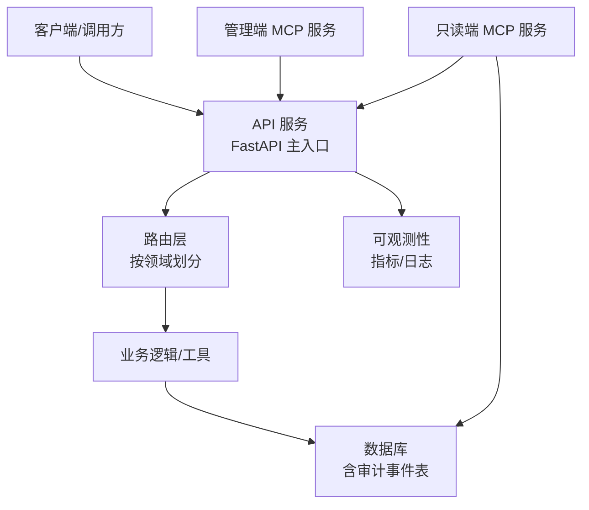
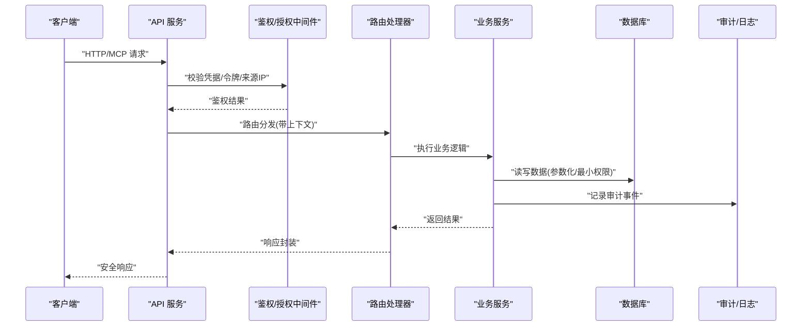
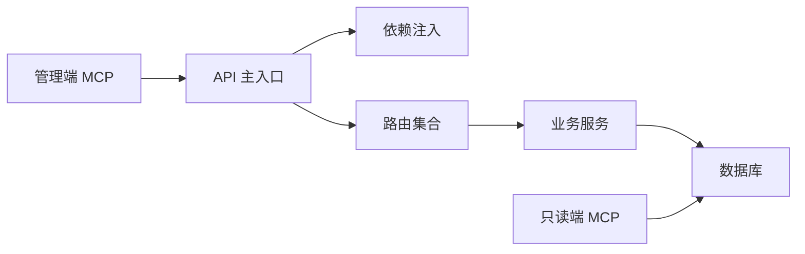

# 安全考虑

<cite>
**本文引用的文件**   
- [apps/api/main.py](file://apps/api/main.py)
- [apps/api/deps.py](file://apps/api/deps.py)
- [apps/api/routers/instruments.py](file://apps/api/routers/instruments.py)
- [apps/api/routers/forecast.py](file://apps/api/routers/forecast.py)
- [apps/api/routers/portfolio.py](file://apps/api/routers/portfolio.py)
- [apps/api/routers/admin_ingestion.py](file://apps/api/routers/admin_ingestion.py)
- [apps/api/routers/data_status.py](file://apps/api/routers/data_status.py)
- [apps/api/routers/fundamentals.py](file://apps/api/routers/fundamentals.py)
- [apps/api/routers/markets.py](file://apps/api/routers/markets.py)
- [apps/api/routers/scheduler.py](file://apps/api/routers/scheduler.py)
- [apps/quant-admin-mcp/server.py](file://apps/quant-admin-mcp/server.py)
- [apps/quant-read-mcp/server.py](file://apps/quant-read-mcp/server.py)
- [apps/quant-read-mcp/db_backends.py](file://apps/quant-read-mcp/db_backends.py)
- [packages/observability](file://packages/observability)
- [sql/migrations/20260715_0002_audit_events.py](file://sql/migrations/20260715_0002_audit_events.py)
- [configs/base.yaml](file://configs/base.yaml)
- [deploy/docker-compose.yml](file://deploy/docker-compose.yml)
</cite>

## 目录
1. [简介](#简介)
2. [项目结构](#项目结构)
3. [核心组件](#核心组件)
4. [架构总览](#架构总览)
5. [详细组件分析](#详细组件分析)
6. [依赖分析](#依赖分析)
7. [性能与安全权衡](#性能与安全权衡)
8. [故障排查指南](#故障排查指南)
9. [结论](#结论)
10. [附录](#附录)

## 简介
本文件面向量化交易MCP系统的安全设计与实现，聚焦认证与授权、数据安全保护、审计日志记录、API安全、数据库安全、文件访问安全、网络通信安全、敏感信息保护、访问控制列表（ACL）、安全漏洞防护、合规性要求与安全审计流程，并提供可操作的安全配置示例与最佳实践。文档同时给出常见安全问题与加固建议，帮助研发与运维团队在生产环境中落地安全基线。

## 项目结构
从安全视角看，系统主要包含以下层次：
- API网关与服务入口：FastAPI应用启动、中间件与依赖注入
- 业务路由层：各功能域的路由定义与权限边界
- MCP服务：管理端与只读端分离的MCP服务器
- 数据持久化：数据库迁移与审计事件表
- 可观测性与审计：指标、日志与审计事件
- 部署与环境：容器编排与配置管理

[此图为概念性结构图，不直接映射具体源码文件]

## 核心组件
- API主入口与中间件：负责全局安全策略、跨域、请求限流、日志与异常处理等
- 依赖注入：集中管理鉴权上下文、数据库连接、外部服务客户端等
- 路由层：按领域组织接口，明确访问范围与权限要求
- MCP服务：区分管理与只读能力，最小权限暴露
- 审计与可观测性：统一记录关键操作与系统状态，支撑事后追溯与合规检查

章节来源
- [apps/api/main.py](file://apps/api/main.py)
- [apps/api/deps.py](file://apps/api/deps.py)
- [apps/quant-admin-mcp/server.py](file://apps/quant-admin-mcp/server.py)
- [apps/quant-read-mcp/server.py](file://apps/quant-read-mcp/server.py)
- [sql/migrations/20260715_0002_audit_events.py](file://sql/migrations/20260715_0002_audit_events.py)

## 架构总览
下图展示典型请求在系统中的安全路径：客户端通过受控通道进入API服务，经鉴权与输入校验后进入路由层，再访问业务逻辑与数据层；所有关键操作写入审计日志并输出可观测指标。

图表来源
- [apps/api/main.py](file://apps/api/main.py)
- [apps/api/deps.py](file://apps/api/deps.py)
- [apps/api/routers/instruments.py](file://apps/api/routers/instruments.py)
- [apps/api/routers/forecast.py](file://apps/api/routers/forecast.py)
- [apps/api/routers/portfolio.py](file://apps/api/routers/portfolio.py)
- [apps/api/routers/admin_ingestion.py](file://apps/api/routers/admin_ingestion.py)
- [apps/api/routers/data_status.py](file://apps/api/routers/data_status.py)
- [apps/api/routers/fundamentals.py](file://apps/api/routers/fundamentals.py)
- [apps/api/routers/markets.py](file://apps/api/routers/markets.py)
- [apps/api/routers/scheduler.py](file://apps/api/routers/scheduler.py)
- [sql/migrations/20260715_0002_audit_events.py](file://sql/migrations/20260715_0002_audit_events.py)

## 详细组件分析

### 认证与授权机制
- 身份认证
  - 支持基于令牌或会话的身份验证，建议在API入口处统一校验，拒绝未认证请求
  - 对MCP管理端与只读端分别实施不同的认证策略，避免越权
- 授权与访问控制
  - 基于角色的访问控制（RBAC）结合资源级ACL，限制管理员、研究员、只读用户等角色对接口与数据的访问
  - 对高风险操作（如数据导入、调度变更）强制二次确认与审批流
- 会话与令牌管理
  - 短生命周期令牌+刷新机制，服务端维护黑名单与撤销能力
  - 令牌绑定客户端指纹/IP白名单，降低泄露风险

章节来源
- [apps/api/main.py](file://apps/api/main.py)
- [apps/api/deps.py](file://apps/api/deps.py)
- [apps/quant-admin-mcp/server.py](file://apps/quant-admin-mcp/server.py)
- [apps/quant-read-mcp/server.py](file://apps/quant-read-mcp/server.py)

### API安全
- 传输安全
  - 强制HTTPS/TLS，禁用弱密码套件与旧协议版本
  - 启用HSTS、严格CORS策略、同源校验
- 输入校验与输出净化
  - 使用Pydantic模型进行强类型校验与默认值约束，拒绝非法输入
  - 对输出进行最小字段返回与脱敏处理
- 速率限制与防重放
  - 针对登录、批量导入等接口设置速率限制与幂等键
- 错误处理与日志
  - 统一错误码与消息模板，避免泄露内部细节
  - 记录请求ID、来源IP、用户标识等上下文用于追踪

章节来源
- [apps/api/main.py](file://apps/api/main.py)
- [apps/api/routers/instruments.py](file://apps/api/routers/instruments.py)
- [apps/api/routers/forecast.py](file://apps/api/routers/forecast.py)
- [apps/api/routers/portfolio.py](file://apps/api/routers/portfolio.py)
- [apps/api/routers/admin_ingestion.py](file://apps/api/routers/admin_ingestion.py)
- [apps/api/routers/data_status.py](file://apps/api/routers/data_status.py)
- [apps/api/routers/fundamentals.py](file://apps/api/routers/fundamentals.py)
- [apps/api/routers/markets.py](file://apps/api/routers/markets.py)
- [apps/api/routers/scheduler.py](file://apps/api/routers/scheduler.py)

### 数据库安全
- 连接与凭证
  - 使用环境变量或密钥管理服务注入数据库凭据，禁止硬编码
  - 最小权限原则：为应用账户授予必要的最小权限
- 查询安全
  - 全面使用参数化查询，杜绝SQL拼接
  - 对分页、排序、过滤参数进行白名单校验
- 数据隔离
  - 多租户或多环境场景下采用独立Schema或行级权限隔离
- 备份与恢复
  - 定期加密备份，保留恢复演练记录

章节来源
- [apps/quant-read-mcp/db_backends.py](file://apps/quant-read-mcp/db_backends.py)
- [sql/migrations/20260715_0002_audit_events.py](file://sql/migrations/20260715_0002_audit_events.py)

### 文件访问安全
- 上传与下载
  - 限制文件类型、大小与数量，扫描恶意内容
  - 存储于隔离目录或对象存储，禁止执行权限
- 路径遍历防护
  - 规范化路径并校验前缀，拒绝相对路径逃逸
- 日志与临时文件
  - 清理临时文件，避免敏感信息残留

章节来源
- [apps/api/routers/admin_ingestion.py](file://apps/api/routers/admin_ingestion.py)

### 网络通信安全
- 服务间通信
  - 内网mTLS双向认证，证书轮换与过期检测
  - 微服务间调用增加签名与时间戳校验，防止重放
- 外部依赖
  - 对外部API调用启用超时、重试退避与熔断
  - 域名白名单与DNS解析校验

章节来源
- [apps/api/main.py](file://apps/api/main.py)
- [apps/quant-admin-mcp/server.py](file://apps/quant-admin-mcp/server.py)
- [apps/quant-read-mcp/server.py](file://apps/quant-read-mcp/server.py)

### 敏感信息保护
- 密钥与配置
  - 使用环境变量或密钥管理服务，禁止提交到代码库
  - 配置文件按环境拆分，生产环境最小化暴露
- 日志与告警
  - 自动屏蔽敏感字段（口令、令牌、卡号等），仅记录必要上下文
- 数据传输
  - 全链路TLS，避免明文传输

章节来源
- [configs/base.yaml](file://configs/base.yaml)
- [deploy/docker-compose.yml](file://deploy/docker-compose.yml)

### 审计日志记录
- 审计事件
  - 统一审计事件模型，记录主体、动作、资源、结果、来源与时间
  - 将审计事件持久化至专用表，支持检索与导出
- 不可抵赖性
  - 审计记录追加写、防篡改校验（如哈希链或WORM存储）
- 合规对接
  - 提供标准格式导出，满足监管审计需求

章节来源
- [sql/migrations/20260715_0002_audit_events.py](file://sql/migrations/20260715_0002_audit_events.py)
- [packages/observability](file://packages/observability)

### 访问控制列表（ACL）
- 资源级ACL
  - 为资产、数据集、模型、策略等建立ACL，支持细粒度读写/执行权限
- 动态加载
  - 运行时加载ACL规则，支持热更新与灰度发布
- 审计联动
  - ACL决策失败与越权尝试均记录审计事件

章节来源
- [apps/api/deps.py](file://apps/api/deps.py)
- [apps/api/routers/admin_ingestion.py](file://apps/api/routers/admin_ingestion.py)

### 安全漏洞防护
- 常见威胁
  - 注入（SQL/命令/模板）、XSS、CSRF、SSRF、路径遍历、反序列化漏洞、过度权限
- 防护措施
  - 输入校验与白名单、参数化查询、沙箱执行、最小权限、依赖漏洞扫描、静态/动态分析
- 供应链安全
  - 锁定依赖版本、镜像签名与完整性校验、SBOM生成

章节来源
- [apps/api/main.py](file://apps/api/main.py)
- [apps/api/routers/admin_ingestion.py](file://apps/api/routers/admin_ingestion.py)

## 依赖分析
- 组件耦合
  - API主入口依赖中间件与依赖注入模块，路由层依赖业务服务与数据访问
  - MCP服务通过API或直接访问数据层，需遵循最小权限
- 外部依赖
  - 数据库驱动、消息队列、对象存储、监控与日志平台
- 潜在循环依赖
  - 路由不应反向依赖中间件，服务层应解耦基础设施

图表来源
- [apps/api/main.py](file://apps/api/main.py)
- [apps/api/deps.py](file://apps/api/deps.py)
- [apps/quant-admin-mcp/server.py](file://apps/quant-admin-mcp/server.py)
- [apps/quant-read-mcp/server.py](file://apps/quant-read-mcp/server.py)

章节来源
- [apps/api/main.py](file://apps/api/main.py)
- [apps/api/deps.py](file://apps/api/deps.py)
- [apps/quant-admin-mcp/server.py](file://apps/quant-admin-mcp/server.py)
- [apps/quant-read-mcp/server.py](file://apps/quant-read-mcp/server.py)

## 性能与安全权衡
- 鉴权开销
  - 缓存令牌校验结果，减少重复计算；对高频接口采用本地缓存与分布式缓存结合
- 审计写入
  - 异步落盘与批处理，避免阻塞主流程；高吞吐场景使用消息队列缓冲
- 加密与解密
  - 合理选择算法与密钥长度，避免频繁加解密热点路径
- 限流与熔断
  - 保护后端资源，防止雪崩；对异常流量快速降级

[本节为通用指导，无需特定文件引用]

## 故障排查指南
- 认证失败
  - 检查令牌有效期、签名校验、时钟同步与密钥轮换
- 授权拒绝
  - 核对角色与ACL规则，定位越权原因
- 审计缺失
  - 检查审计写入链路、磁盘空间与权限
- 数据库连接异常
  - 核查凭据、网络连通、白名单与连接池配置
- 文件上传失败
  - 校验文件大小、类型与存储配额，查看扫描结果

章节来源
- [apps/api/main.py](file://apps/api/main.py)
- [apps/api/deps.py](file://apps/api/deps.py)
- [apps/api/routers/admin_ingestion.py](file://apps/api/routers/admin_ingestion.py)
- [apps/quant-read-mcp/db_backends.py](file://apps/quant-read-mcp/db_backends.py)

## 结论
通过在API入口、路由层、数据层与MCP服务中分层落实认证授权、输入校验、最小权限、审计与可观测性，并结合严格的网络与密钥管理，可有效提升量化交易MCP系统的整体安全性。建议持续进行安全测试、依赖治理与合规审计，形成闭环改进。

[本节为总结性内容，无需特定文件引用]

## 附录

### 安全配置示例与最佳实践
- 传输安全
  - 强制HTTPS，启用HSTS，禁用不安全协议与弱套件
- 认证与授权
  - 使用短期令牌+刷新，绑定设备/IP，开启会话黑名单
- 输入校验
  - 使用强类型模型，白名单校验，限制深度与长度
- 数据库
  - 参数化查询、最小权限账号、连接池上限与超时
- 文件与对象存储
  - 类型/大小限制、病毒扫描、不可执行、路径规范化
- 密钥管理
  - 环境变量/密钥管理服务，禁止提交到仓库，定期轮换
- 审计与可观测性
  - 统一审计模型、异步写入、不可篡改存储、指标与告警
- 供应链与依赖
  - 锁定版本、镜像签名、SBOM、漏洞扫描与修复SLA

章节来源
- [configs/base.yaml](file://configs/base.yaml)
- [deploy/docker-compose.yml](file://deploy/docker-compose.yml)

### 合规性要求与安全审计流程
- 合规要点
  - 数据最小化、目的限定、留存周期、跨境传输控制、隐私影响评估
- 审计流程
  - 事前：权限评审与策略基线
  - 事中：实时告警与阻断
  - 事后：取证、报告与整改跟踪
- 证据留存
  - 审计日志、访问记录、变更历史、密钥轮换记录

章节来源
- [sql/migrations/20260715_0002_audit_events.py](file://sql/migrations/20260715_0002_audit_events.py)
- [packages/observability](file://packages/observability)