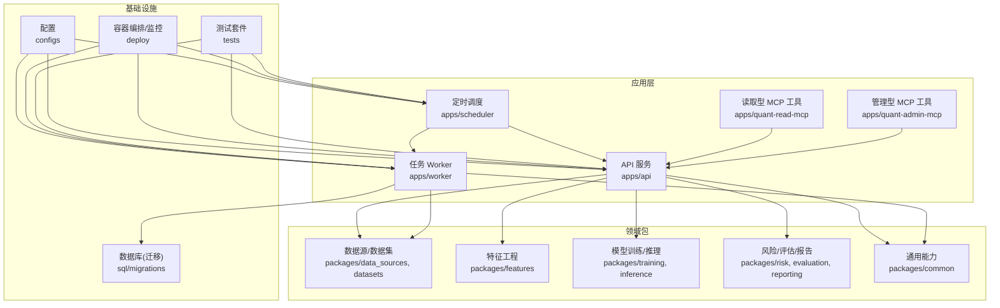
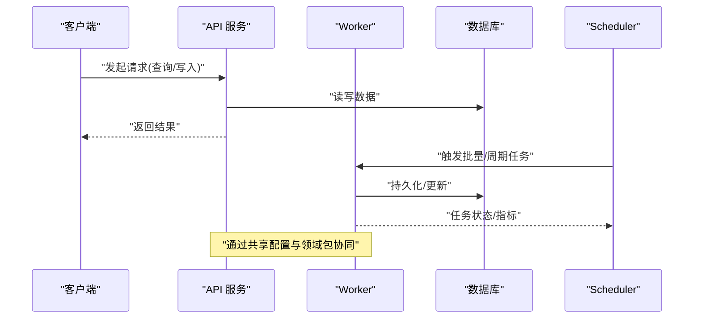
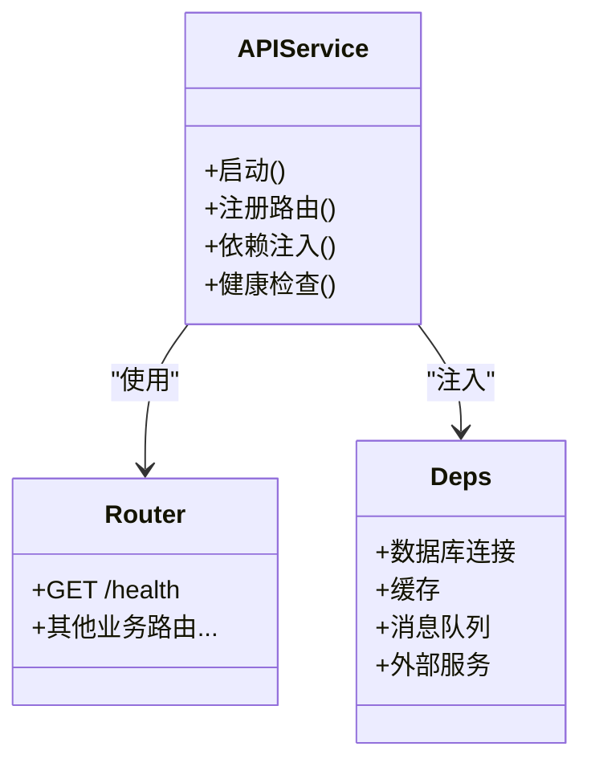
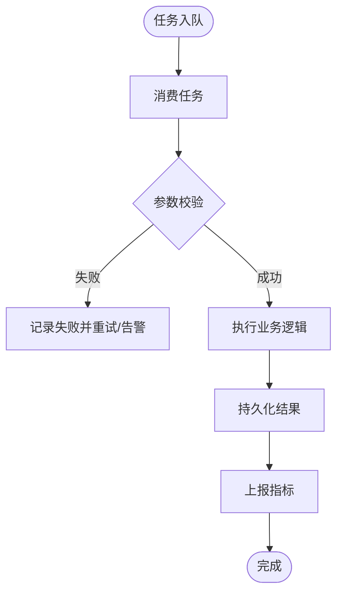
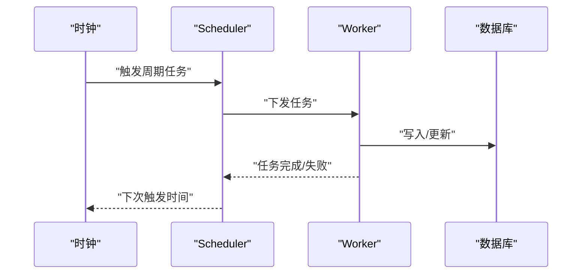
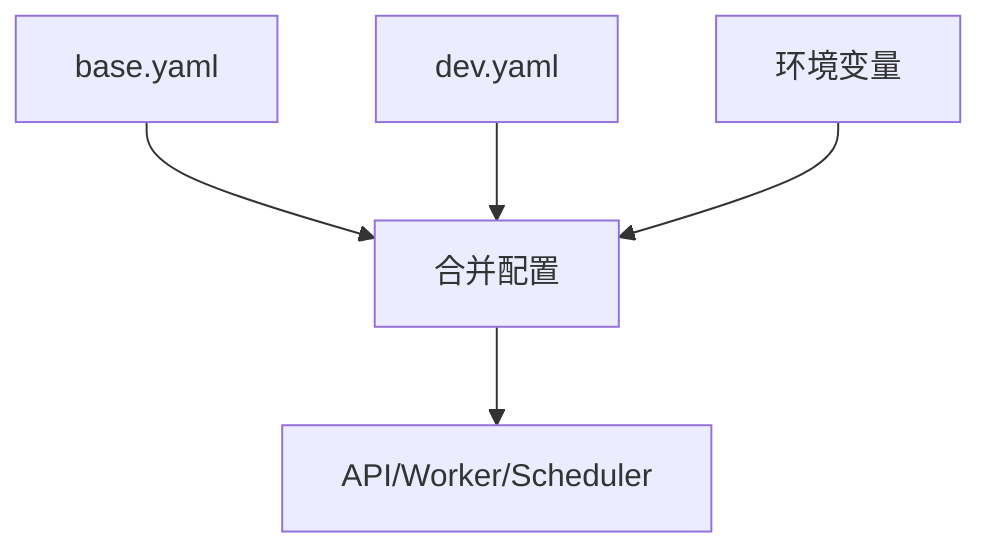
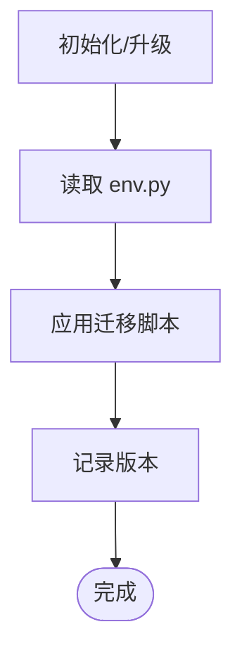
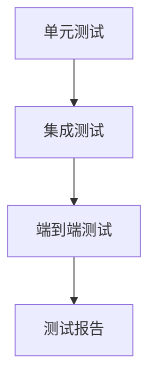
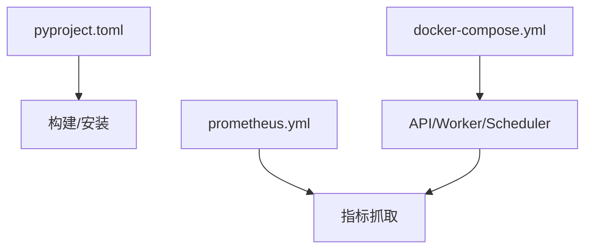

# 开发指南

<cite>
**本文引用的文件**   
- [pyproject.toml](file://pyproject.toml)
- [README.md](file://README.md)
- [.pre-commit-config.yaml](file://.pre-commit-config.yaml)
- [alembic.ini](file://alembic.ini)
- [deploy/docker-compose.yml](file://deploy/docker-compose.yml)
- [deploy/prometheus.yml](file://deploy/prometheus.yml)
- [configs/base.yaml](file://configs/base.yaml)
- [configs/dev.yaml](file://configs/dev.yaml)
- [apps/api/main.py](file://apps/api/main.py)
- [apps/api/deps.py](file://apps/api/deps.py)
- [apps/worker/main.py](file://apps/worker/main.py)
- [apps/worker/tasks.py](file://apps/worker/tasks.py)
- [apps/scheduler/schedule.py](file://apps/scheduler/schedule.py)
- [sql/migrations/env.py](file://sql/migrations/env.py)
- [tests/conftest.py](file://tests/conftest.py)
- [tests/integration/test_e2e_pipeline.py](file://tests/integration/test_e2e_pipeline.py)
- [tests/unit/test_api_health.py](file://tests/unit/test_api_health.py)
- [tests/unit/test_worker_tasks.py](file://tests/unit/test_worker_tasks.py)
</cite>

## 目录
1. [简介](#简介)
2. [项目结构](#项目结构)
3. [核心组件](#核心组件)
4. [架构总览](#架构总览)
5. [详细组件分析](#详细组件分析)
6. [依赖分析](#依赖分析)
7. [性能考虑](#性能考虑)
8. [故障排查指南](#故障排查指南)
9. [结论](#结论)
10. [附录](#附录)

## 简介
本指南面向新加入的开发者，提供从环境搭建、代码规范、测试策略、调试技巧、Git工作流与审查、预提交钩子与自动化检查、性能分析与内存泄漏检测、持续集成与部署到快速上手的一站式说明。目标是帮助团队在统一标准下高效协作，保障质量与可维护性。

## 项目结构
仓库采用多应用+多包的分层组织方式：
- apps：运行期服务与应用（API、Worker、Scheduler、MCP工具等）
- packages：领域能力包（数据源、特征、回测、评估、风控、报告等）
- configs：配置（基础与开发环境）
- sql/migrations：数据库迁移脚本
- tests：单元测试、集成测试与端到端测试
- deploy：容器编排与监控配置
- scripts：辅助脚本（可按需扩展）
- skills：研究技能与校验脚本

图表来源
- [apps/api/main.py:1-200](file://apps/api/main.py#L1-L200)
- [apps/worker/main.py:1-200](file://apps/worker/main.py#L1-L200)
- [apps/scheduler/schedule.py:1-200](file://apps/scheduler/schedule.py#L1-L200)
- [deploy/docker-compose.yml:1-200](file://deploy/docker-compose.yml#L1-L200)
- [configs/base.yaml:1-200](file://configs/base.yaml#L1-L200)
- [configs/dev.yaml:1-200](file://configs/dev.yaml#L1-L200)

章节来源
- [README.md:1-200](file://README.md#L1-L200)
- [pyproject.toml:1-200](file://pyproject.toml#L1-L200)

## 核心组件
- API 服务：对外暴露REST接口，负责路由分发、依赖注入、健康检查与跨域/鉴权等横切关注点。
- Worker：异步任务执行器，消费队列任务，完成数据入库、指标计算、报表生成等耗时操作。
- Scheduler：定时任务编排，驱动周期性采集、批处理与重算。
- MCP 工具：为外部Agent提供“读”和“管理”两类工具能力，通过API或内部通道调用。
- 领域包：按职责拆分的可复用模块，如数据源适配、特征工程、模型训练/推理、风险评估与报告。
- 配置中心：基于YAML的环境化配置，支持基础与开发覆盖。
- 数据库迁移：Alembic驱动的DDL变更管理。
- 测试体系：单元、集成与端到端分层测试，配合fixtures与golden数据。

章节来源
- [apps/api/main.py:1-200](file://apps/api/main.py#L1-L200)
- [apps/api/deps.py:1-200](file://apps/api/deps.py#L1-L200)
- [apps/worker/main.py:1-200](file://apps/worker/main.py#L1-L200)
- [apps/worker/tasks.py:1-200](file://apps/worker/tasks.py#L1-L200)
- [apps/scheduler/schedule.py:1-200](file://apps/scheduler/schedule.py#L1-L200)
- [configs/base.yaml:1-200](file://configs/base.yaml#L1-L200)
- [configs/dev.yaml:1-200](file://configs/dev.yaml#L1-L200)
- [sql/migrations/env.py:1-200](file://sql/migrations/env.py#L1-L200)

## 架构总览
系统由API服务、Worker与Scheduler组成，三者共享配置与领域包；数据库通过迁移管理演进；容器编排与监控支撑部署与可观测性。

图表来源
- [apps/api/main.py:1-200](file://apps/api/main.py#L1-L200)
- [apps/worker/main.py:1-200](file://apps/worker/main.py#L1-L200)
- [apps/scheduler/schedule.py:1-200](file://apps/scheduler/schedule.py#L1-L200)
- [sql/migrations/env.py:1-200](file://sql/migrations/env.py#L1-L200)

## 详细组件分析

### API 服务
- 入口与路由：集中注册路由，统一异常与响应格式，提供健康检查端点。
- 依赖注入：集中管理数据库连接、缓存、消息队列、外部服务等依赖，便于测试替换。
- 中间件：日志、审计、限流、CORS、认证授权等横切逻辑。

图表来源
- [apps/api/main.py:1-200](file://apps/api/main.py#L1-L200)
- [apps/api/deps.py:1-200](file://apps/api/deps.py#L1-L200)

章节来源
- [apps/api/main.py:1-200](file://apps/api/main.py#L1-L200)
- [apps/api/deps.py:1-200](file://apps/api/deps.py#L1-L200)
- [tests/unit/test_api_health.py:1-200](file://tests/unit/test_api_health.py#L1-L200)

### Worker 与任务
- 任务定义：将耗时操作封装为可重试的任务，支持幂等与去重。
- 执行器：连接消息队列/调度器，拉取并执行任务，上报状态与指标。
- 资源管理：连接池、并发度、超时与退避策略。

图表来源
- [apps/worker/main.py:1-200](file://apps/worker/main.py#L1-L200)
- [apps/worker/tasks.py:1-200](file://apps/worker/tasks.py#L1-L200)

章节来源
- [apps/worker/main.py:1-200](file://apps/worker/main.py#L1-L200)
- [apps/worker/tasks.py:1-200](file://apps/worker/tasks.py#L1-L200)
- [tests/unit/test_worker_tasks.py:1-200](file://tests/unit/test_worker_tasks.py#L1-L200)

### Scheduler 定时调度
- 任务编排：声明式定义周期任务，支持依赖关系与失败重试。
- 与Worker联动：触发批处理、数据刷新、报表生成等。
- 可观测性：记录调度历史、延迟与成功率。

图表来源
- [apps/scheduler/schedule.py:1-200](file://apps/scheduler/schedule.py#L1-L200)
- [apps/worker/main.py:1-200](file://apps/worker/main.py#L1-L200)

章节来源
- [apps/scheduler/schedule.py:1-200](file://apps/scheduler/schedule.py#L1-L200)

### 配置与环境
- 基础配置：base.yaml定义默认值。
- 开发覆盖：dev.yaml覆盖开发环境差异。
- 运行时加载：各服务按需合并配置，敏感信息通过环境变量注入。

图表来源
- [configs/base.yaml:1-200](file://configs/base.yaml#L1-L200)
- [configs/dev.yaml:1-200](file://configs/dev.yaml#L1-L200)

章节来源
- [configs/base.yaml:1-200](file://configs/base.yaml#L1-L200)
- [configs/dev.yaml:1-200](file://configs/dev.yaml#L1-L200)

### 数据库迁移
- Alembic初始化与版本管理：env.py定义连接与目标元数据。
- 迁移脚本：按版本号递增，保证幂等与可回滚。

图表来源
- [sql/migrations/env.py:1-200](file://sql/migrations/env.py#L1-L200)
- [alembic.ini:1-200](file://alembic.ini#L1-L200)

章节来源
- [sql/migrations/env.py:1-200](file://sql/migrations/env.py#L1-L200)
- [alembic.ini:1-200](file://alembic.ini#L1-L200)

### 测试体系
- 单元测试：针对函数/类/模块行为，隔离外部依赖。
- 集成测试：验证组件间交互（如API与健康检查）。
- 端到端测试：模拟完整流程（数据采集→处理→存储→查询）。
- 测试夹具：conftest.py集中管理fixture，golden数据用于回归对比。

图表来源
- [tests/conftest.py:1-200](file://tests/conftest.py#L1-L200)
- [tests/integration/test_e2e_pipeline.py:1-200](file://tests/integration/test_e2e_pipeline.py#L1-L200)
- [tests/unit/test_api_health.py:1-200](file://tests/unit/test_api_health.py#L1-L200)
- [tests/unit/test_worker_tasks.py:1-200](file://tests/unit/test_worker_tasks.py#L1-L200)

章节来源
- [tests/conftest.py:1-200](file://tests/conftest.py#L1-L200)
- [tests/integration/test_e2e_pipeline.py:1-200](file://tests/integration/test_e2e_pipeline.py#L1-L200)
- [tests/unit/test_api_health.py:1-200](file://tests/unit/test_api_health.py#L1-L200)
- [tests/unit/test_worker_tasks.py:1-200](file://tests/unit/test_worker_tasks.py#L1-L200)

## 依赖分析
- 构建与依赖：pyproject.toml统一管理依赖、工具链与脚本命令。
- 容器编排：docker-compose.yml定义API、Worker、Scheduler及依赖服务（数据库、缓存、消息队列等）。
- 监控：prometheus.yml定义抓取目标与指标暴露。

图表来源
- [pyproject.toml:1-200](file://pyproject.toml#L1-L200)
- [deploy/docker-compose.yml:1-200](file://deploy/docker-compose.yml#L1-L200)
- [deploy/prometheus.yml:1-200](file://deploy/prometheus.yml#L1-L200)

章节来源
- [pyproject.toml:1-200](file://pyproject.toml#L1-L200)
- [deploy/docker-compose.yml:1-200](file://deploy/docker-compose.yml#L1-L200)
- [deploy/prometheus.yml:1-200](file://deploy/prometheus.yml#L1-L200)

## 性能考虑
- 连接池与并发：合理设置数据库/HTTP/消息队列连接池大小与并发度，避免资源争用。
- 批处理与分页：大数据量场景优先批处理与游标分页，减少内存峰值。
- 缓存策略：热点数据引入缓存，注意失效与一致性。
- 指标与追踪：暴露关键指标（QPS、延迟、错误率、队列积压），结合分布式追踪定位瓶颈。
- 内存泄漏检测：使用内存分析工具定期扫描，关注长生命周期对象与循环引用。

[本节为通用指导，不直接分析具体文件]

## 故障排查指南
- 健康检查：通过API健康端点确认服务可用性。
- 日志与指标：集中收集日志与Prometheus指标，结合告警规则快速定位问题。
- 任务失败：查看Worker任务日志与重试次数，核对幂等性与去重键。
- 迁移失败：回滚至上一版本，检查迁移脚本幂等性与依赖顺序。
- 配置错误：比对base与dev配置，确认环境变量注入正确。

章节来源
- [tests/unit/test_api_health.py:1-200](file://tests/unit/test_api_health.py#L1-L200)
- [deploy/prometheus.yml:1-200](file://deploy/prometheus.yml#L1-L200)
- [apps/worker/tasks.py:1-200](file://apps/worker/tasks.py#L1-L200)
- [sql/migrations/env.py:1-200](file://sql/migrations/env.py#L1-L200)
- [configs/base.yaml:1-200](file://configs/base.yaml#L1-L200)
- [configs/dev.yaml:1-200](file://configs/dev.yaml#L1-L200)

## 结论
本指南提供了从环境搭建、代码规范、测试策略、调试技巧、Git工作流与审查、预提交钩子与自动化检查、性能分析与内存泄漏检测、持续集成与部署到快速上手的完整路径。遵循上述实践有助于提升团队协作效率与系统稳定性。

[本节为总结，不直接分析具体文件]

## 附录

### 快速上手（新开发者）
- 克隆仓库并进入项目根目录。
- 安装依赖与工具链（参考pyproject.toml中的依赖与脚本命令）。
- 准备本地数据库与必要的外部服务（参考docker-compose.yml）。
- 加载基础配置与开发覆盖（configs/base.yaml与configs/dev.yaml）。
- 执行数据库迁移（参考alembic.ini与sql/migrations/env.py）。
- 启动API、Worker与Scheduler服务。
- 运行测试套件（单元、集成、端到端）。
- 使用预提交钩子进行本地检查（.pre-commit-config.yaml）。

章节来源
- [pyproject.toml:1-200](file://pyproject.toml#L1-L200)
- [deploy/docker-compose.yml:1-200](file://deploy/docker-compose.yml#L1-L200)
- [configs/base.yaml:1-200](file://configs/base.yaml#L1-L200)
- [configs/dev.yaml:1-200](file://configs/dev.yaml#L1-L200)
- [alembic.ini:1-200](file://alembic.ini#L1-L200)
- [sql/migrations/env.py:1-200](file://sql/migrations/env.py#L1-L200)
- [.pre-commit-config.yaml:1-200](file://.pre-commit-config.yaml#L1-L200)

### 代码规范与命名约定
- Python编码风格：遵循PEP 8，统一缩进、导入分组、类型注解与文档字符串。
- 模块与包：按功能域划分，避免循环依赖；公共能力放入common包。
- 命名：模块小写下划线，类名大驼峰，函数/变量小写下划线，常量全大写。
- 注释与文档：关键函数与复杂逻辑补充docstring与行内注释。
- 配置：敏感信息通过环境变量注入，不在代码中硬编码。

[本节为通用规范，不直接分析具体文件]

### 测试编写指南
- 单元测试：聚焦单一职责，使用mock隔离外部依赖，断言清晰明确。
- 集成测试：验证组件交互与边界条件，尽量使用轻量级真实依赖。
- 端到端测试：模拟真实用户流程，使用golden数据进行回归对比。
- 夹具与数据：在conftest.py集中管理fixture，保持测试数据稳定可复现。

章节来源
- [tests/conftest.py:1-200](file://tests/conftest.py#L1-L200)
- [tests/integration/test_e2e_pipeline.py:1-200](file://tests/integration/test_e2e_pipeline.py#L1-L200)
- [tests/unit/test_api_health.py:1-200](file://tests/unit/test_api_health.py#L1-L200)
- [tests/unit/test_worker_tasks.py:1-200](file://tests/unit/test_worker_tasks.py#L1-L200)

### 调试技巧与常用工具
- 日志：结构化日志，包含上下文与traceId，便于链路追踪。
- 指标：暴露关键业务与系统指标，接入Prometheus/Grafana。
- 调试器：本地使用调试器逐步排查，结合断点与变量观察。
- 性能分析：使用CPU/内存分析工具定位热点与泄漏。

[本节为通用指导，不直接分析具体文件]

### Git工作流与代码审查
- 分支策略：主分支保护，功能分支命名规范，PR描述清晰。
- 代码审查：至少一人审查，关注设计、可读性与可维护性。
- 提交规范：语义化提交，拆分原子提交，关联Issue编号。
- 标签与发布：按版本打标签，记录变更摘要。

[本节为通用实践，不直接分析具体文件]

### 预提交钩子与自动化检查
- 钩子配置：.pre-commit-config.yaml定义格式化、静态检查、单测等步骤。
- 本地运行：提交前自动执行检查，修复问题后再提交。
- CI集成：与流水线联动，确保所有分支一致的质量门槛。

章节来源
- [.pre-commit-config.yaml:1-200](file://.pre-commit-config.yaml#L1-L200)

### 持续集成与自动化部署
- 容器编排：docker-compose.yml定义服务拓扑与依赖。
- 监控：prometheus.yml定义抓取目标，统一收集指标。
- 部署：建议结合CI/CD平台实现自动化构建、测试与发布。

章节来源
- [deploy/docker-compose.yml:1-200](file://deploy/docker-compose.yml#L1-L200)
- [deploy/prometheus.yml:1-200](file://deploy/prometheus.yml#L1-L200)