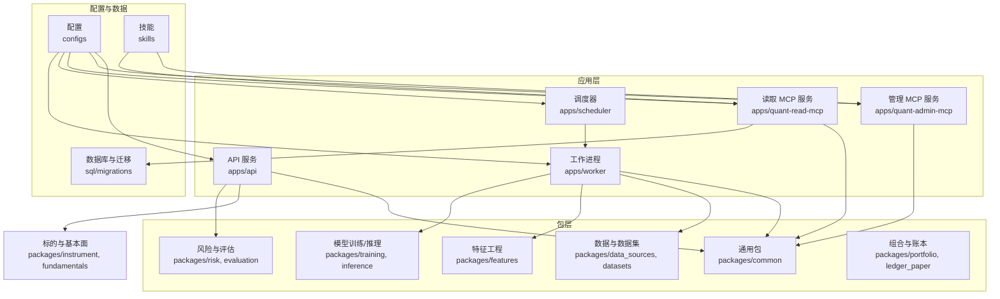
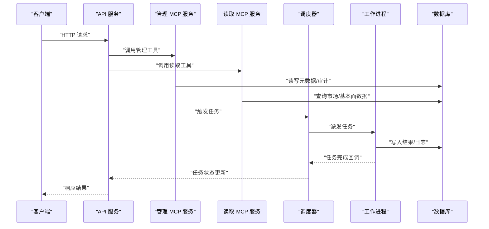
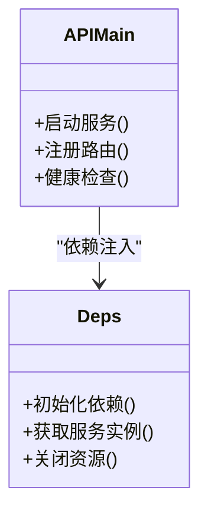
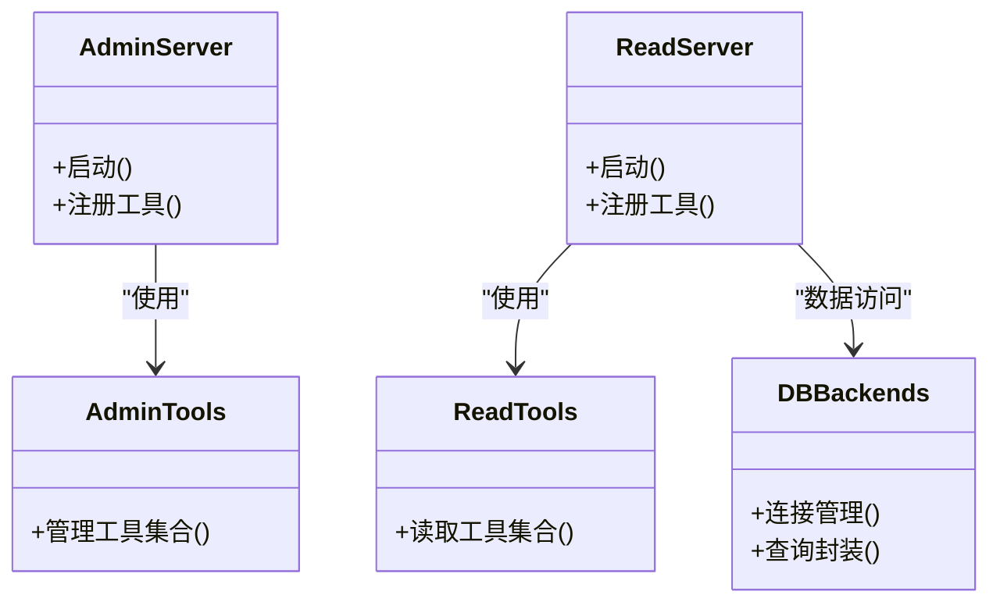
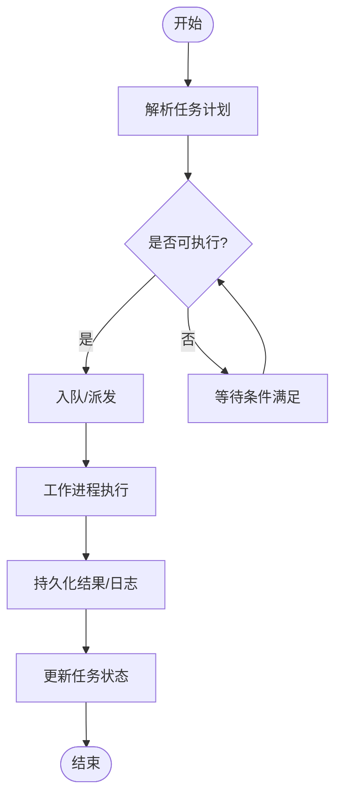
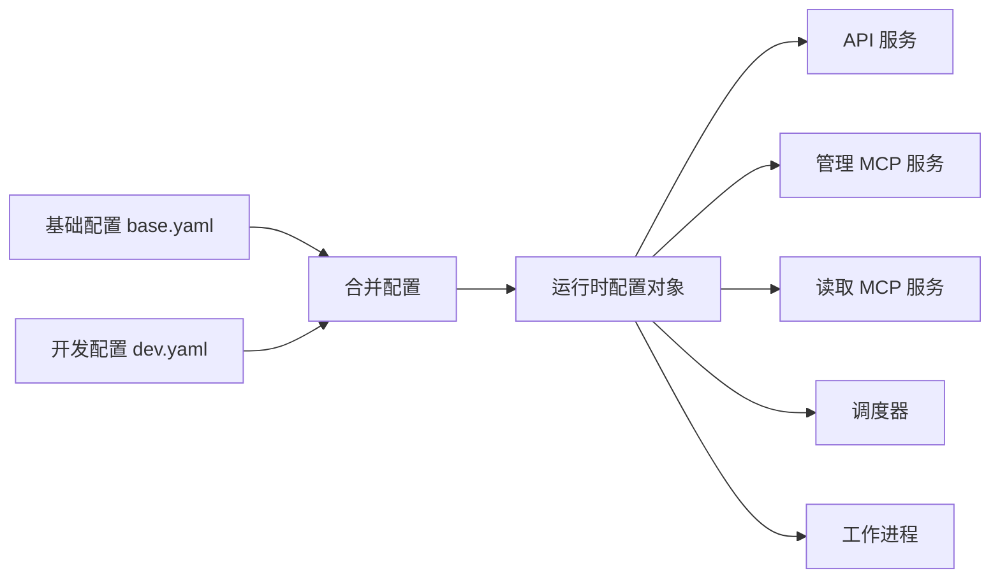
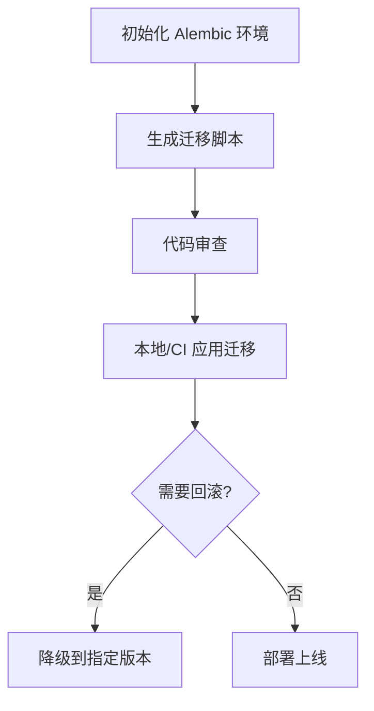
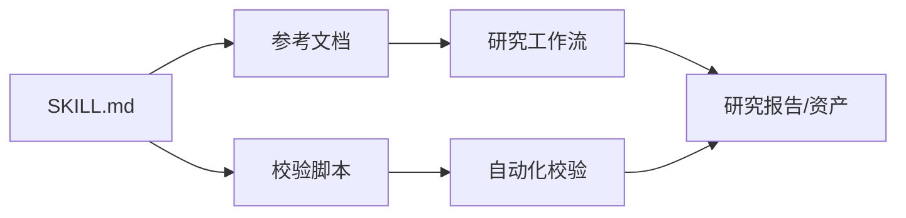
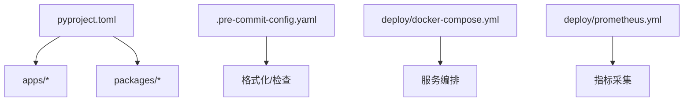

# 开发者指南

<cite>
**本文引用的文件**   
- [README.md](file://README.md)
- [pyproject.toml](file://pyproject.toml)
- [.pre-commit-config.yaml](file://.pre-commit-config.yaml)
- [alembic.ini](file://alembic.ini)
- [deploy/docker-compose.yml](file://deploy/docker-compose.yml)
- [deploy/prometheus.yml](file://deploy/prometheus.yml)
- [apps/api/main.py](file://apps/api/main.py)
- [apps/api/deps.py](file://apps/api/deps.py)
- [apps/quant-admin-mcp/server.py](file://apps/quant-admin-mcp/server.py)
- [apps/quant-admin-mcp/tools.py](file://apps/quant-admin-mcp/tools.py)
- [apps/quant-read-mcp/server.py](file://apps/quant-read-mcp/server.py)
- [apps/quant-read-mcp/db_backends.py](file://apps/quant-read-mcp/db_backends.py)
- [apps/quant-read-mcp/tools.py](file://apps/quant-read-mcp/tools.py)
- [apps/scheduler/executor.py](file://apps/scheduler/executor.py)
- [apps/scheduler/schedule.py](file://apps/scheduler/schedule.py)
- [apps/worker/main.py](file://apps/worker/main.py)
- [apps/worker/tasks.py](file://apps/worker/tasks.py)
- [configs/base.yaml](file://configs/base.yaml)
- [configs/dev.yaml](file://configs/dev.yaml)
- [skills/cross-market-quant-research/SKILL.md](file://skills/cross-market-quant-research/SKILL.md)
- [sql/migrations/env.py](file://sql/migrations/env.py)
- [tests/conftest.py](file://tests/conftest.py)
</cite>

## 目录
1. [简介](#简介)
2. [项目结构](#项目结构)
3. [核心组件](#核心组件)
4. [架构总览](#架构总览)
5. [详细组件分析](#详细组件分析)
6. [依赖分析](#依赖分析)
7. [性能考虑](#性能考虑)
8. [故障排查指南](#故障排查指南)
9. [结论](#结论)
10. [附录](#附录)

## 简介
本指南面向量化交易MCP系统的开发者，覆盖开发环境搭建、代码规范与贡献流程、项目结构与模块划分、依赖管理、代码审查标准、提交规范、分支策略、工具配置与调试技巧、技能系统使用与自定义流程，以及常见问题与效率提升建议。目标是帮助新成员快速上手并高效协作。

## 项目结构
仓库采用多应用+多包的分层组织方式：
- apps：运行期服务与应用（API、MCP服务器、调度器、工作进程）
- packages：可复用的业务与基础设施包（数据源、特征、回测、风控等）
- configs：环境与配置（基础与开发）
- sql/migrations：数据库迁移脚本
- skills：技能定义与参考文档、校验脚本
- tests：单元测试与集成测试
- deploy：部署编排与监控配置
- scripts：常用运维与研究脚本

图表来源
- [apps/api/main.py](file://apps/api/main.py)
- [apps/quant-admin-mcp/server.py](file://apps/quant-admin-mcp/server.py)
- [apps/quant-read-mcp/server.py](file://apps/quant-read-mcp/server.py)
- [apps/scheduler/executor.py](file://apps/scheduler/executor.py)
- [apps/worker/main.py](file://apps/worker/main.py)
- [configs/base.yaml](file://configs/base.yaml)
- [sql/migrations/env.py](file://sql/migrations/env.py)

章节来源
- [README.md](file://README.md)
- [pyproject.toml](file://pyproject.toml)

## 核心组件
- API 服务：提供REST接口，聚合各包能力，负责路由、依赖注入与健康检查。
- MCP 服务：对外暴露“模型上下文协议”工具集，分为管理与读取两类。
- 调度器与工作进程：基于任务队列的批处理与定时任务执行。
- 配置中心：YAML分层配置，支持开发与生产差异。
- 数据库与迁移：Alembic驱动的数据版本管理。
- 技能系统：以SKILL.md为入口，配合参考文档与校验脚本，形成可复用的研究/交付流程。

章节来源
- [apps/api/main.py](file://apps/api/main.py)
- [apps/api/deps.py](file://apps/api/deps.py)
- [apps/quant-admin-mcp/server.py](file://apps/quant-admin-mcp/server.py)
- [apps/quant-read-mcp/server.py](file://apps/quant-read-mcp/server.py)
- [apps/scheduler/executor.py](file://apps/scheduler/executor.py)
- [apps/worker/main.py](file://apps/worker/main.py)
- [configs/base.yaml](file://configs/base.yaml)
- [configs/dev.yaml](file://configs/dev.yaml)
- [alembic.ini](file://alembic.ini)
- [sql/migrations/env.py](file://sql/migrations/env.py)
- [skills/cross-market-quant-research/SKILL.md](file://skills/cross-market-quant-research/SKILL.md)

## 架构总览
整体由“API + MCP + 调度/工作进程”构成，统一通过配置加载运行时参数，共享底层包能力，并通过数据库持久化状态。

图表来源
- [apps/api/main.py](file://apps/api/main.py)
- [apps/quant-admin-mcp/server.py](file://apps/quant-admin-mcp/server.py)
- [apps/quant-read-mcp/server.py](file://apps/quant-read-mcp/server.py)
- [apps/scheduler/executor.py](file://apps/scheduler/executor.py)
- [apps/worker/main.py](file://apps/worker/main.py)
- [sql/migrations/env.py](file://sql/migrations/env.py)

## 详细组件分析

### API 服务
职责
- 启动Web服务、注册路由、健康检查、跨域与中间件。
- 通过依赖注入获取包级服务实例，保证生命周期一致。

关键要点
- 入口与路由注册位于主程序文件。
- 依赖解析集中在依赖模块中，便于替换与测试。

图表来源
- [apps/api/main.py](file://apps/api/main.py)
- [apps/api/deps.py](file://apps/api/deps.py)

章节来源
- [apps/api/main.py](file://apps/api/main.py)
- [apps/api/deps.py](file://apps/api/deps.py)

### MCP 服务（管理与读取）
职责
- 管理端：提供系统管理、审计、配置变更等工具。
- 读取端：提供数据查询、报表生成、指标拉取等只读工具。

实现要点
- 各自维护server与tools模块，遵循统一的工具签名与错误返回约定。
- 读取端通过后端抽象访问不同数据源或数据库。

图表来源
- [apps/quant-admin-mcp/server.py](file://apps/quant-admin-mcp/server.py)
- [apps/quant-admin-mcp/tools.py](file://apps/quant-admin-mcp/tools.py)
- [apps/quant-read-mcp/server.py](file://apps/quant-read-mcp/server.py)
- [apps/quant-read-mcp/tools.py](file://apps/quant-read-mcp/tools.py)
- [apps/quant-read-mcp/db_backends.py](file://apps/quant-read-mcp/db_backends.py)

章节来源
- [apps/quant-admin-mcp/server.py](file://apps/quant-admin-mcp/server.py)
- [apps/quant-admin-mcp/tools.py](file://apps/quant-admin-mcp/tools.py)
- [apps/quant-read-mcp/server.py](file://apps/quant-read-mcp/server.py)
- [apps/quant-read-mcp/tools.py](file://apps/quant-read-mcp/tools.py)
- [apps/quant-read-mcp/db_backends.py](file://apps/quant-read-mcp/db_backends.py)

### 调度器与工作进程
职责
- 调度器：解析任务计划、分发到工作进程、跟踪状态。
- 工作进程：执行具体任务（数据入库、特征计算、模型训练/推理、报告生成等）。

图表来源
- [apps/scheduler/executor.py](file://apps/scheduler/executor.py)
- [apps/scheduler/schedule.py](file://apps/scheduler/schedule.py)
- [apps/worker/main.py](file://apps/worker/main.py)
- [apps/worker/tasks.py](file://apps/worker/tasks.py)

章节来源
- [apps/scheduler/executor.py](file://apps/scheduler/executor.py)
- [apps/scheduler/schedule.py](file://apps/scheduler/schedule.py)
- [apps/worker/main.py](file://apps/worker/main.py)
- [apps/worker/tasks.py](file://apps/worker/tasks.py)

### 配置与环境
- 分层配置：基础配置与开发配置分离，便于覆盖与扩展。
- 运行时加载：各服务在启动时按环境合并配置。

图表来源
- [configs/base.yaml](file://configs/base.yaml)
- [configs/dev.yaml](file://configs/dev.yaml)
- [apps/api/main.py](file://apps/api/main.py)
- [apps/quant-admin-mcp/server.py](file://apps/quant-admin-mcp/server.py)
- [apps/quant-read-mcp/server.py](file://apps/quant-read-mcp/server.py)
- [apps/scheduler/executor.py](file://apps/scheduler/executor.py)
- [apps/worker/main.py](file://apps/worker/main.py)

章节来源
- [configs/base.yaml](file://configs/base.yaml)
- [configs/dev.yaml](file://configs/dev.yaml)

### 数据库与迁移
- 使用Alembic进行版本化管理，迁移脚本存放于sql/migrations。
- 迁移环境配置与脚本模板位于migrations目录。

图表来源
- [alembic.ini](file://alembic.ini)
- [sql/migrations/env.py](file://sql/migrations/env.py)

章节来源
- [alembic.ini](file://alembic.ini)
- [sql/migrations/env.py](file://sql/migrations/env.py)

### 技能系统
- 每个技能以SKILL.md为入口，包含参考文档与校验脚本。
- 用于标准化研究与交付流程，确保产出质量与一致性。

图表来源
- [skills/cross-market-quant-research/SKILL.md](file://skills/cross-market-quant-research/SKILL.md)

章节来源
- [skills/cross-market-quant-research/SKILL.md](file://skills/cross-market-quant-research/SKILL.md)

## 依赖分析
- 包管理与依赖声明位于项目根配置文件中，所有子包与服务均受其约束。
- 预提交钩子集中配置，统一格式化、类型检查与静态分析。
- 容器编排与监控通过docker-compose与Prometheus配置文件管理。

图表来源
- [pyproject.toml](file://pyproject.toml)
- [.pre-commit-config.yaml](file://.pre-commit-config.yaml)
- [deploy/docker-compose.yml](file://deploy/docker-compose.yml)
- [deploy/prometheus.yml](file://deploy/prometheus.yml)

章节来源
- [pyproject.toml](file://pyproject.toml)
- [.pre-commit-config.yaml](file://.pre-commit-config.yaml)
- [deploy/docker-compose.yml](file://deploy/docker-compose.yml)
- [deploy/prometheus.yml](file://deploy/prometheus.yml)

## 性能考虑
- 数据库连接池与超时：合理设置连接数、超时与重试策略，避免长事务阻塞。
- 任务并行度：根据CPU/IO瓶颈调整工作进程并发度，避免争用。
- I/O优化：批量写入、分页查询、索引优化；对热点数据引入缓存层。
- 序列化与传输：减少大对象传输，按需字段选择，压缩响应体。
- 监控与告警：结合Prometheus收集关键指标，设定阈值告警。

[本节为通用指导，不直接分析具体文件]

## 故障排查指南
- 启动失败
  - 检查端口占用、环境变量与配置文件路径是否正确。
  - 查看服务日志定位异常堆栈。
- 数据库连接问题
  - 确认连接串、用户名密码、网络可达性与防火墙规则。
  - 验证迁移版本与当前库一致。
- 任务执行失败
  - 检查工作进程日志与任务状态表。
  - 检查外部依赖（数据源、模型权重）可用性。
- 性能退化
  - 观察慢查询与锁竞争，必要时增加索引或拆分任务。
  - 调整并发与批大小，关注GC与内存峰值。

章节来源
- [tests/conftest.py](file://tests/conftest.py)

## 结论
本指南从架构、组件、依赖、配置、技能系统与运维角度提供了完整的开发视角。遵循本文的流程与规范，有助于提升团队协作效率与系统稳定性。建议在迭代过程中持续完善文档与自动化检查，保持代码质量与可维护性。

## 附录

### 开发环境搭建
- 安装Python与依赖
  - 使用项目根配置中的依赖声明安装依赖。
- 配置环境变量
  - 复制开发配置并覆盖必要项（数据库、外部服务地址等）。
- 初始化数据库
  - 执行迁移命令，确保schema与迁移版本一致。
- 启动服务
  - 分别启动API、MCP、调度器与工作进程。
- 运行测试
  - 执行单元与集成测试，确保改动未破坏既有行为。

章节来源
- [pyproject.toml](file://pyproject.toml)
- [configs/dev.yaml](file://configs/dev.yaml)
- [alembic.ini](file://alembic.ini)
- [sql/migrations/env.py](file://sql/migrations/env.py)
- [apps/api/main.py](file://apps/api/main.py)
- [apps/quant-admin-mcp/server.py](file://apps/quant-admin-mcp/server.py)
- [apps/quant-read-mcp/server.py](file://apps/quant-read-mcp/server.py)
- [apps/scheduler/executor.py](file://apps/scheduler/executor.py)
- [apps/worker/main.py](file://apps/worker/main.py)
- [tests/conftest.py](file://tests/conftest.py)

### 代码规范与贡献流程
- 预提交钩子
  - 统一格式化、类型检查与静态分析，提交前自动运行。
- 提交信息规范
  - 采用语义化提交信息，描述变更范围与动机。
- 分支策略
  - 主干保护，功能分支命名清晰，合并前需通过CI与评审。
- 代码审查标准
  - 可读性、可测试性、性能与安全；变更影响面评估与回归用例补充。

章节来源
- [.pre-commit-config.yaml](file://.pre-commit-config.yaml)

### 调试技巧
- 本地调试
  - 使用IDE断点调试API/MCP服务；开启详细日志级别。
- 任务调试
  - 单独运行工作进程并打印任务输入输出；必要时将任务隔离到独立环境。
- 数据库调试
  - 启用SQL日志，定位慢查询；使用迁移历史对比验证一致性。
- 性能剖析
  - 使用性能分析工具定位热点函数与I/O瓶颈。

章节来源
- [apps/api/main.py](file://apps/api/main.py)
- [apps/quant-admin-mcp/server.py](file://apps/quant-admin-mcp/server.py)
- [apps/quant-read-mcp/server.py](file://apps/quant-read-mcp/server.py)
- [apps/worker/main.py](file://apps/worker/main.py)
- [sql/migrations/env.py](file://sql/migrations/env.py)

### 技能系统使用方法与自定义流程
- 使用方法
  - 阅读SKILL.md了解目标与步骤；参考文档理解领域知识；使用校验脚本保障产出质量。
- 自定义流程
  - 新增技能目录，编写SKILL.md与参考文档；实现校验脚本并在CI中集成。
  - 在MCP服务中注册相关工具，使AI助手能调用技能流程。

章节来源
- [skills/cross-market-quant-research/SKILL.md](file://skills/cross-market-quant-research/SKILL.md)
- [apps/quant-admin-mcp/server.py](file://apps/quant-admin-mcp/server.py)
- [apps/quant-read-mcp/server.py](file://apps/quant-read-mcp/server.py)

### 常见问题与效率提升
- 常见问题
  - 依赖冲突：锁定版本并使用虚拟环境；优先使用项目根配置。
  - 迁移冲突：先拉取最新迁移再本地应用；必要时手动解决。
  - 端口冲突：修改默认端口或释放占用进程。
- 效率提升
  - 利用预提交钩子减少返工；编写可复用的夹具与测试数据。
  - 使用容器化一键拉起依赖服务，缩短环境准备时间。

章节来源
- [pyproject.toml](file://pyproject.toml)
- [alembic.ini](file://alembic.ini)
- [deploy/docker-compose.yml](file://deploy/docker-compose.yml)
- [.pre-commit-config.yaml](file://.pre-commit-config.yaml)